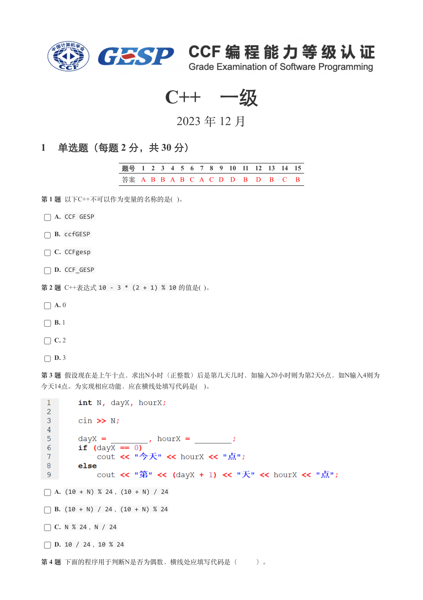
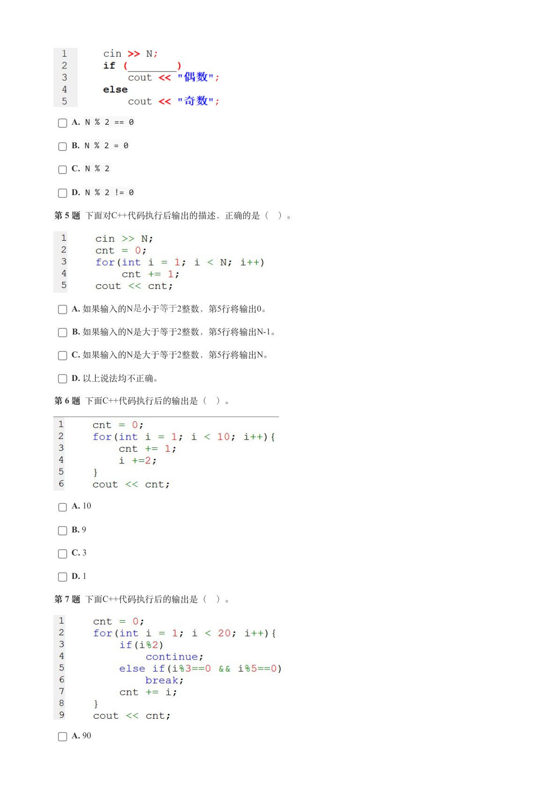
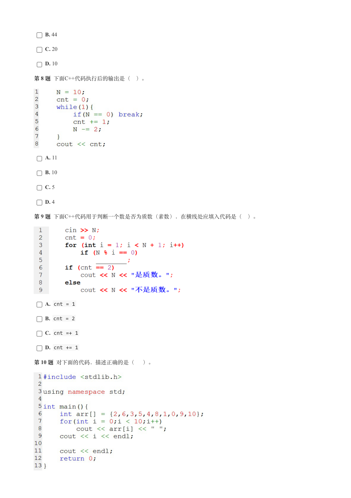
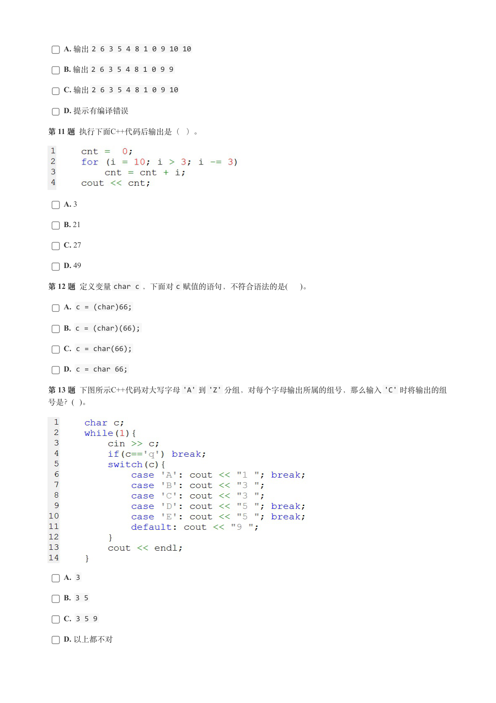
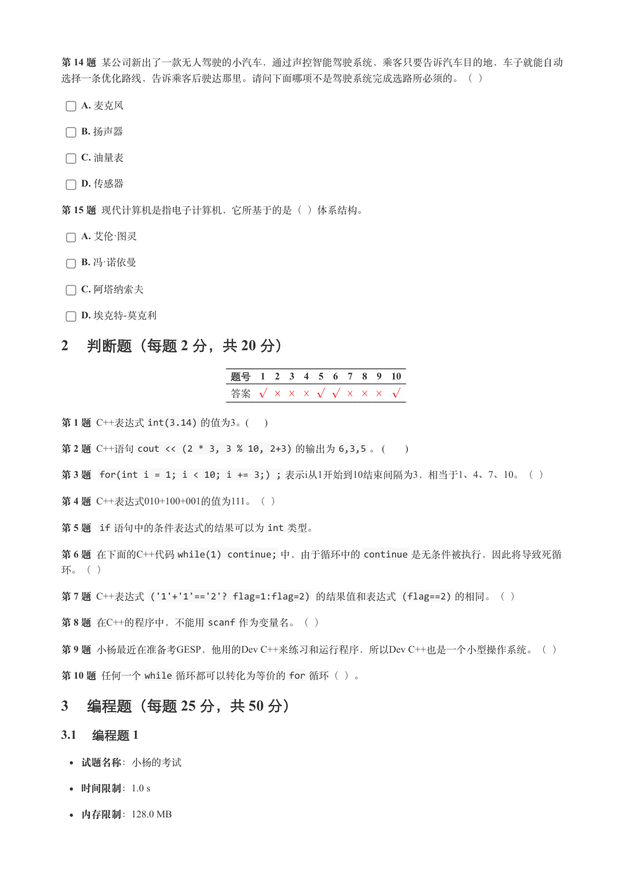
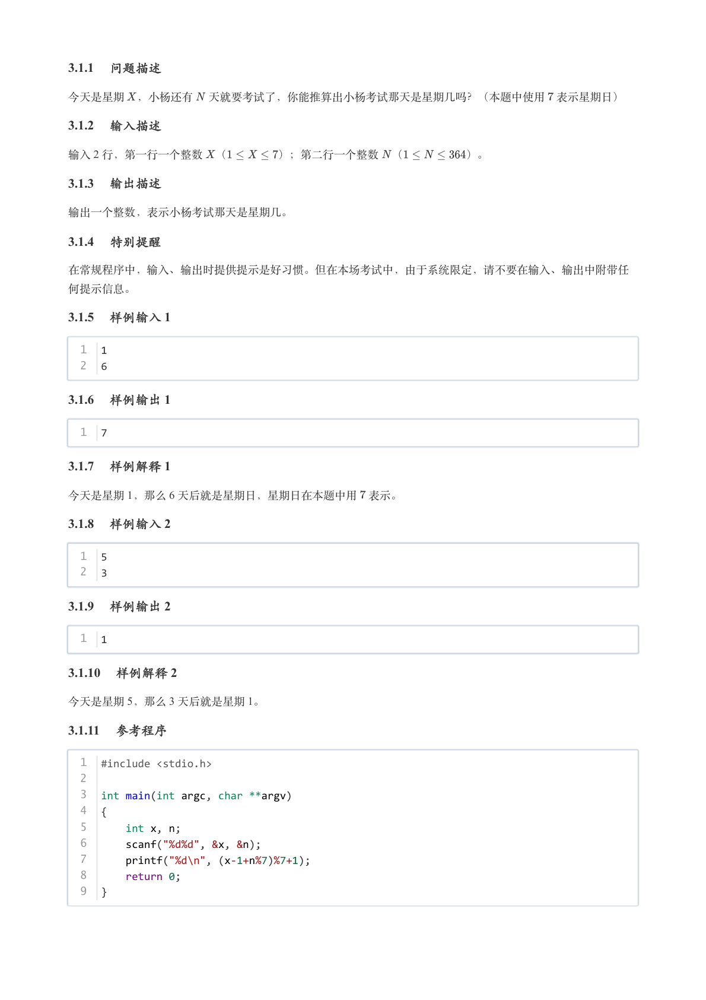
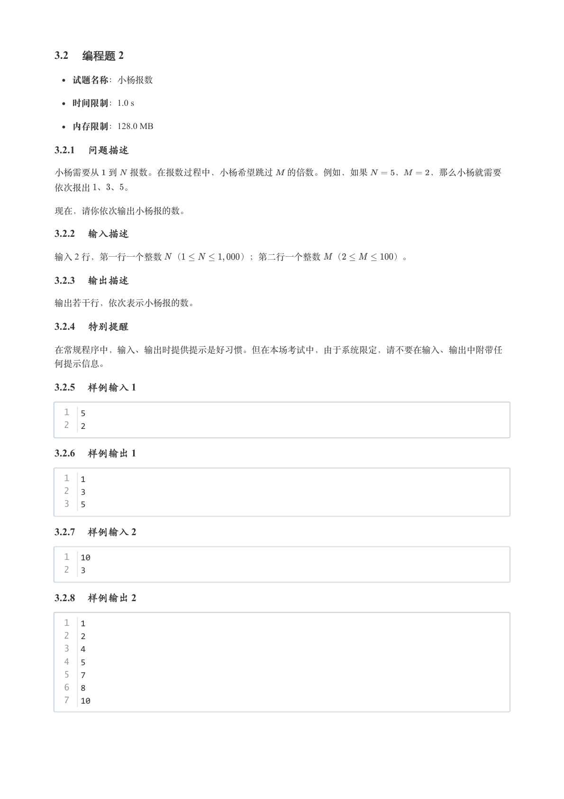
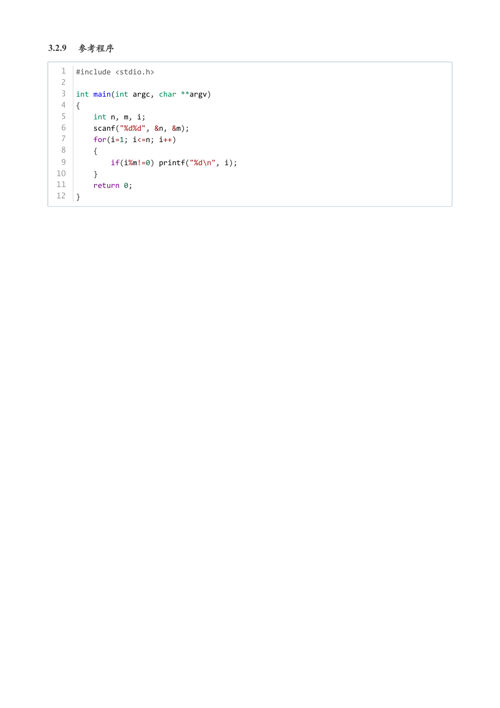

# 2023年12月-C++1级

- 原始 PDF：[`pdfs/2023年12月-C++1级.pdf`](../pdfs/2023年12月-C++1级.pdf)
- 页数：8
- 转换脚本：[`scripts/convert_pdfs_to_markdown.py`](../scripts/convert_pdfs_to_markdown.py)

> 为尽量避免信息丢失，每页均附带页面图片；文本提取结果保留原有顺序与换行特征，个别公式、图形、特殊排版请以页面图片为准。

## 第 1 页



### 提取文本

```
C++　一级

                      2023 年 12 月

1 单选题（每题 2 分，共 30 分）


            题号  1  2  3  4  5  6  7  8  9  10  11  12  13  14  15
            答案 A B B A B C A C D D  B  D  B  C  B


第 1 题 以下C++不可以作为变量的名称的是( )。

    A. CCF GESP

    B. ccfGESP

    C. CCFgesp

    D. CCF_GESP

第 2 题 C++表达式10 - 3 * (2 + 1) % 10 的值是( )。

    A. 0

    B. 1

    C. 2

    D. 3

第 3 题 假设现在是上午十点，求出N小时（正整数）后是第几天几时，如输入20小时则为第2天6点，如N输入4则为
今天14点。为实现相应功能，应在横线处填写代码是( )。


    A. (10 + N) % 24 , (10 + N) / 24

    B. (10 + N) / 24 , (10 + N) % 24

    C. N % 24 , N / 24

    D. 10 / 24 , 10 % 24

第 4 题 下面的程序用于判断N是否为偶数，横线处应填写代码是（   ）。
```

## 第 2 页



### 提取文本

```
A. N % 2 == 0

    B. N % 2 = 0

    C. N % 2

    D. N % 2 != 0

第 5 题 下面对C++代码执行后输出的描述，正确的是（ ）。


    A. 如果输⼊的N是⼩于等于2整数，第5⾏将输出0。

    B. 如果输⼊的N是⼤于等于2整数，第5⾏将输出N-1。

    C. 如果输⼊的N是⼤于等于2整数，第5⾏将输出N。

    D. 以上说法均不正确。

第 6 题 下面C++代码执行后的输出是（ ）。


    A. 10

    B. 9

    C. 3

    D. 1

第 7 题 下面C++代码执行后的输出是（ ）。


    A. 90
```

## 第 3 页



### 提取文本

```
B. 44

    C. 20

    D. 10

第 8 题 下面C++代码执行后的输出是（ ）。


    A. 11

    B. 10

    C. 5

    D. 4

第 9 题 下面C++代码用于判断一个数是否为质数（素数），在横线处应填入代码是（ ）。


    A. cnt = 1

    B. cnt = 2

    C. cnt =+ 1

    D. cnt += 1

第 10 题 对下面的代码，描述正确的是（ ）。
```

## 第 4 页



### 提取文本

```
A. 输出2 6 3 5 4 8 1 0 9 10 10

    B. 输出2 6 3 5 4 8 1 0 9 9

    C. 输出2 6 3 5 4 8 1 0 9 10

    D. 提示有编译错误

第 11 题 执行下面C++代码后输出是（ ）。


    A. 3

    B. 21

    C. 27

    D. 49

第 12 题 定义变量char c ，下面对c 赋值的语句，不符合语法的是(  )。

    A. c = (char)66;

    B. c = (char)(66);

    C. c = char(66);

    D. c = char 66;

第 13 题 下图所示C++代码对大写字母'A' 到'Z' 分组，对每个字母输出所属的组号，那么输入'C' 时将输出的组
号是？( )。


    A. 3

    B. 3 5

    C. 3 5 9

    D. 以上都不对
```

## 第 5 页



### 提取文本

```
第 14 题 某公司新出了一款无人驾驶的小汽车，通过声控智能驾驶系统，乘客只要告诉汽车目的地，车子就能自动

选择一条优化路线，告诉乘客后驶达那里。请问下面哪项不是驾驶系统完成选路所必须的。（ ）

    A. 麦克风

    B. 扬声器

    C. 油量表

    D. 传感器

第 15 题 现代计算机是指电子计算机，它所基于的是（ ）体系结构。

    A. 艾伦·图灵

    B. 冯·诺依曼

    C. 阿塔纳索夫

    D. 埃克特-莫克利

2 判断题（每题 2 分，共 20 分）


                 题号  1  2  3  4  5  6  7  8  9  10

                 答案


第 1 题 C++表达式int(3.14) 的值为3。(     )

第 2 题 C++语句cout << (2 * 3, 3 % 10, 2+3) 的输出为6,3,5 。 (      )

第 3 题 for(int i = 1; i < 10; i += 3;) ; 表示i从1开始到10结束间隔为3，相当于1、4、7、10。（ ）

第 4 题 C++表达式010+100+001的值为111。（ ）

第 5 题 if 语句中的条件表达式的结果可以为int 类型。

第 6 题 在下面的C++代码while(1) continue; 中，由于循环中的continue 是无条件被执行，因此将导致死循

环。（ ）

第 7 题 C++表达式 ('1'+'1'=='2'? flag=1:flag=2) 的结果值和表达式 (flag==2) 的相同。（ ）

第 8 题 在C++的程序中，不能用scanf 作为变量名。（ ）

第 9 题 小杨最近在准备考GESP，他用的Dev C++来练习和运行程序，所以Dev C++也是一个小型操作系统。（ ）

第 10 题 任何一个while 循环都可以转化为等价的for 循环（ ）。

3 编程题（每题 25 分，共 50 分）

3.1 编程题 1


  试题名称：小杨的考试

   时间限制：1.0 s

   内存限制：128.0 MB
```

## 第 6 页



### 提取文本

```
3.1.1 问题描述

今天是星期 ，小杨还有 天就要考试了，你能推算出小杨考试那天是星期几吗？（本题中使用 表示星期日）

3.1.2 输入描述

输入 2 行，第一行一个整数 （     ）；第二行一个整数 （      ）。

3.1.3 输出描述

输出一个整数，表示小杨考试那天是星期几。

3.1.4 特别提醒

在常规程序中，输入、输出时提供提示是好习惯。但在本场考试中，由于系统限定，请不要在输入、输出中附带任

何提示信息。

3.1.5 样例输入 1

  1  1
  2  6

3.1.6 样例输出 1

  1  7

3.1.7 样例解释 1

今天是星期 1，那么 6 天后就是星期日，星期日在本题中用 表示。

3.1.8 样例输入 2

  1  5
  2  3

3.1.9 样例输出 2

  1  1

3.1.10 样例解释 2

今天是星期 5，那么 3 天后就是星期 1。

3.1.11 参考程序

  1  #include <stdio.h>
  2
  3  int main(int argc, char **argv)
  4  {
  5      int x, n;
  6      scanf("%d%d", &x, &n);
  7      printf("%d\n", (x-1+n%7)%7+1);
  8      return 0;
  9  }
```

## 第 7 页



### 提取文本

```
3.2 编程题 2


  试题名称：小杨报数

   时间限制：1.0 s

   内存限制：128.0 MB

3.2.1 问题描述

小杨需要从 到 报数。在报数过程中，小杨希望跳过  的倍数。例如，如果   ，   ，那么小杨就需要

依次报出 、、。


现在，请你依次输出小杨报的数。

3.2.2 输入描述

输入 2 行，第一行一个整数 （       ）；第二行一个整数 （      ）。

3.2.3 输出描述

输出若干行，依次表示小杨报的数。

3.2.4 特别提醒

在常规程序中，输入、输出时提供提示是好习惯。但在本场考试中，由于系统限定，请不要在输入、输出中附带任

何提示信息。

3.2.5 样例输入 1

  1  5
  2  2

3.2.6 样例输出 1

  1  1
  2  3
  3  5

3.2.7 样例输入 2

  1  10
  2  3

3.2.8 样例输出 2

  1  1
  2  2
  3  4
  4  5
  5  7
  6  8
  7  10
```

## 第 8 页



### 提取文本

```
3.2.9 参考程序

   1  #include <stdio.h>
   2
   3  int main(int argc, char **argv)
   4  {
   5      int n, m, i;
   6      scanf("%d%d", &n, &m);
   7      for(i=1; i<=n; i++)
   8      {
   9          if(i%m!=0) printf("%d\n", i);
  10      }
  11      return 0;
  12  }
```
