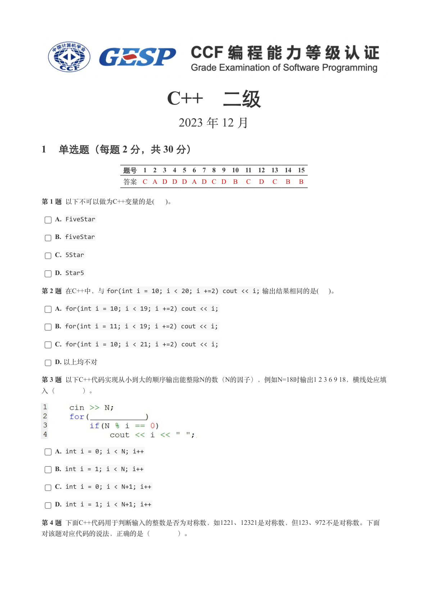
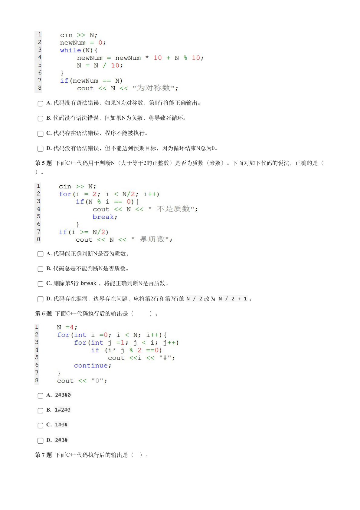
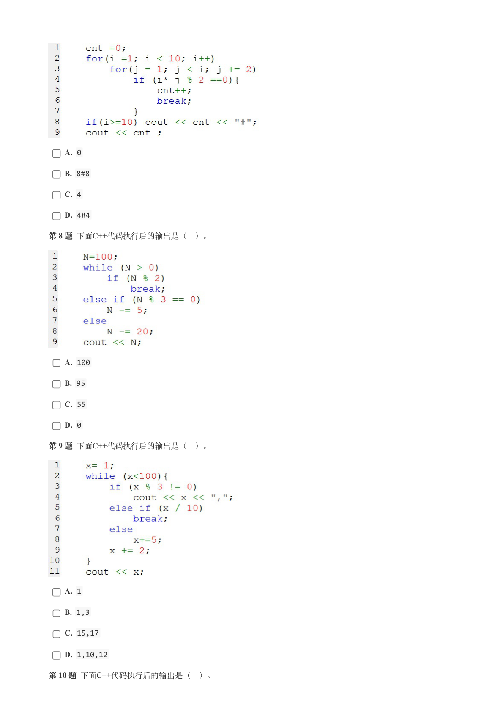
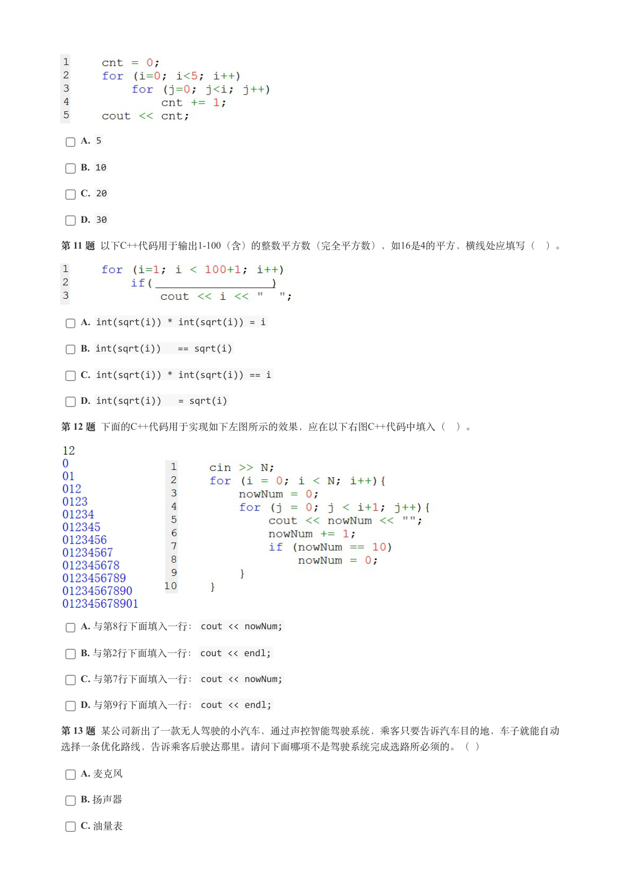
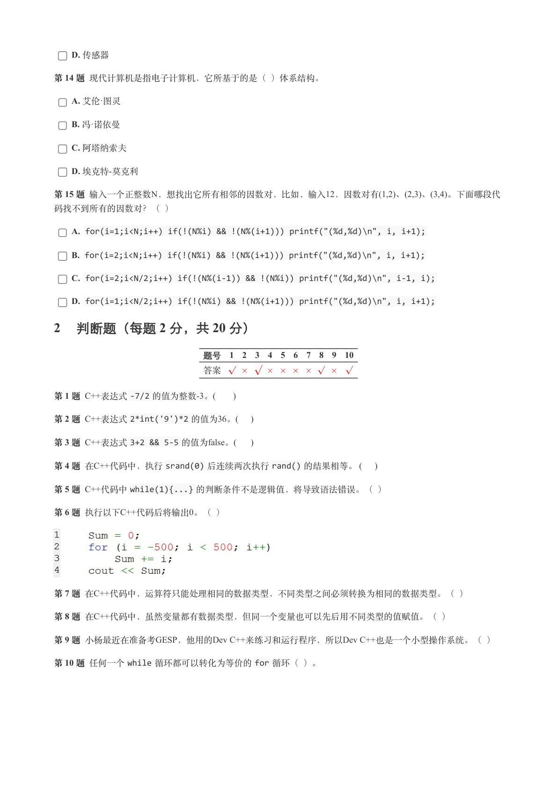
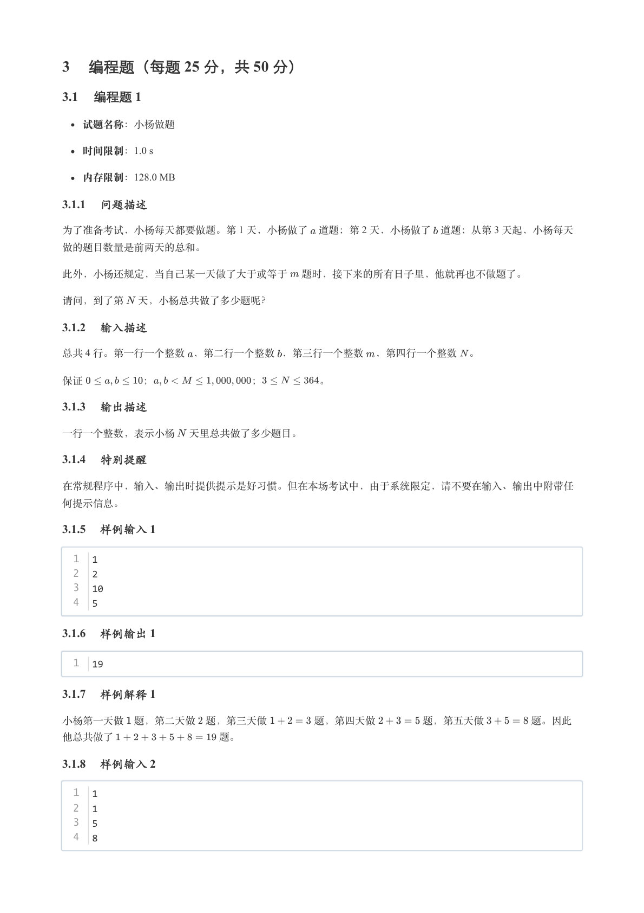
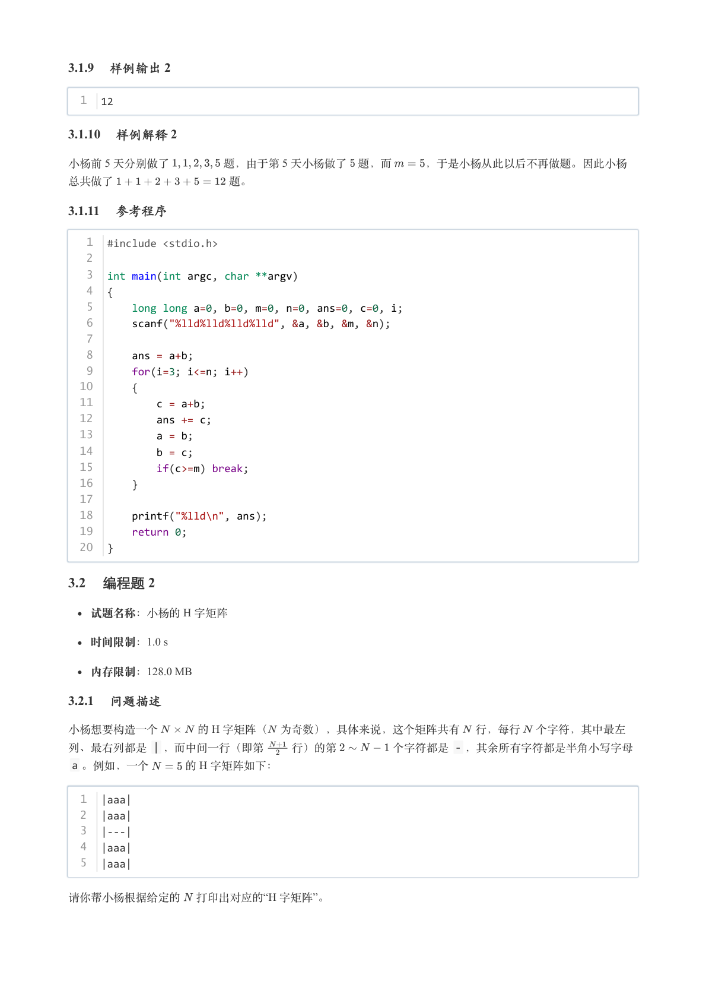
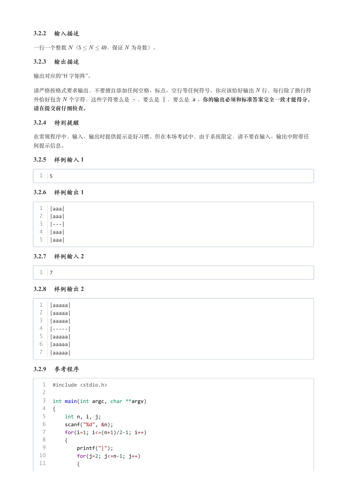
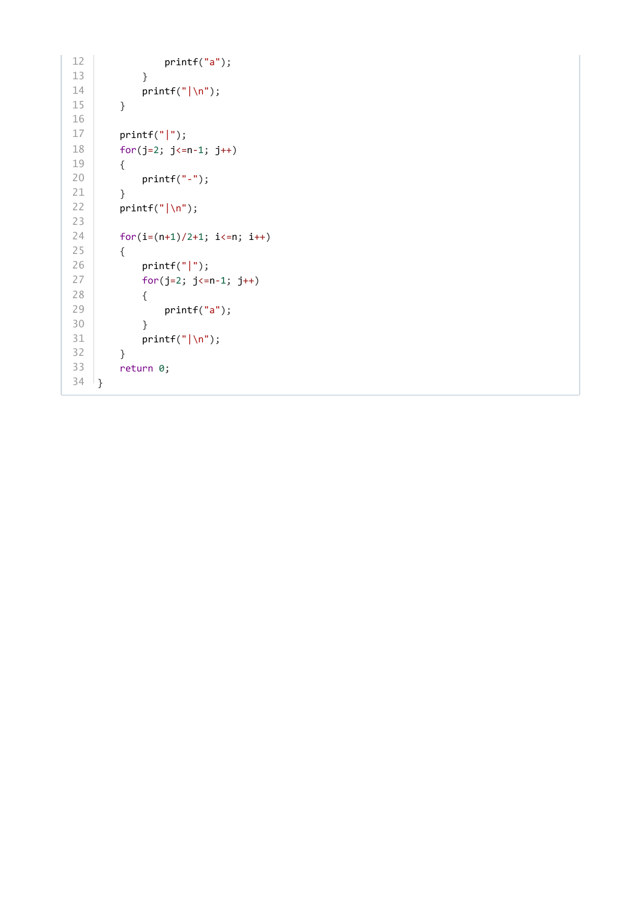

# 2023年12月-C++2级

- 原始 PDF：[`pdfs/2023年12月-C++2级.pdf`](../pdfs/2023年12月-C++2级.pdf)
- 页数：9
- 转换脚本：[`scripts/convert_pdfs_to_markdown.py`](../scripts/convert_pdfs_to_markdown.py)

> 为尽量避免信息丢失，每页均附带页面图片；文本提取结果保留原有顺序与换行特征，个别公式、图形、特殊排版请以页面图片为准。

## 第 1 页



### 提取文本

```
C++　二级

                      2023 年 12 月

1 单选题（每题 2 分，共 30 分）


            题号  1  2  3  4  5  6  7  8  9  10  11  12  13  14  15
            答案 C A D D D A D C D  B  C  D  C  B  B


第 1 题 以下不可以做为C++变量的是(  )。

    A. FiveStar

    B. fiveStar

    C. 5Star

    D. Star5

第 2 题 在C++中，与for(int i = 10; i < 20; i +=2) cout << i; 输出结果相同的是(  )。

    A. for(int i = 10; i < 19; i +=2) cout << i;

    B. for(int i = 11; i < 19; i +=2) cout << i;

    C. for(int i = 10; i < 21; i +=2) cout << i;

    D. 以上均不对

第 3 题 以下C++代码实现从小到大的顺序输出能整除N的数（N的因子），例如N=18时输出1 2 3 6 9 18，横线处应填

入（    ）。


    A. int i = 0; i < N; i++

    B. int i = 1; i < N; i++

    C. int i = 0; i < N+1; i++

    D. int i = 1; i < N+1; i++

第 4 题 下面C++代码用于判断输入的整数是否为对称数，如1221、12321是对称数，但123、972不是对称数。下面

对该题对应代码的说法，正确的是（    ）。
```

## 第 2 页



### 提取文本

```
A. 代码没有语法错误，如果N为对称数，第8行将能正确输出。

    B. 代码没有语法错误，但如果N为负数，将导致死循环。

    C. 代码存在语法错误，程序不能被执行。

    D. 代码没有语法错误，但不能达到预期目标，因为循环结束N总为0。

第 5 题 下面C++代码用于判断N（大于等于2的正整数）是否为质数（素数）。下面对如下代码的说法，正确的是（

）。


    A. 代码能正确判断N是否为质数。

    B. 代码总是不能判断N是否质数。

    C. 删除第5行break ，将能正确判断N是否质数。

    D. 代码存在漏洞，边界存在问题，应将第2行和第7行的N / 2 改为 N / 2 + 1 。

第 6 题 下面C++代码执行后的输出是（   ）。


    A. 2#3#0

    B. 1#2#0

    C. 1#0#

    D. 2#3#

第 7 题 下面C++代码执行后的输出是（ ）。
```

## 第 3 页



### 提取文本

```
A. 0

    B. 8#8

    C. 4

    D. 4#4

第 8 题 下面C++代码执行后的输出是（ ）。


    A. 100

    B. 95

    C. 55

    D. 0

第 9 题 下面C++代码执行后的输出是（ ）。


    A. 1

    B. 1,3

    C. 15,17

    D. 1,10,12

第 10 题 下面C++代码执行后的输出是（ ）。
```

## 第 4 页



### 提取文本

```
A. 5

    B. 10

    C. 20

    D. 30

第 11 题 以下C++代码用于输出1-100（含）的整数平方数（完全平方数），如16是4的平方，横线处应填写（ ）。


    A. int(sqrt(i)) * int(sqrt(i)) = i

    B. int(sqrt(i))   == sqrt(i)

    C. int(sqrt(i)) * int(sqrt(i)) == i

    D. int(sqrt(i))   = sqrt(i)

第 12 题 下面的C++代码用于实现如下左图所示的效果，应在以下右图C++代码中填入（ ）。


    A. 与第8行下面填入一行：cout << nowNum;

    B. 与第2行下面填入一行：cout << endl;

    C. 与第7行下面填入一行：cout << nowNum;

    D. 与第9行下面填入一行：cout << endl;

第 13 题 某公司新出了一款无人驾驶的小汽车，通过声控智能驾驶系统，乘客只要告诉汽车目的地，车子就能自动

选择一条优化路线，告诉乘客后驶达那里。请问下面哪项不是驾驶系统完成选路所必须的。（ ）

    A. 麦克风

    B. 扬声器

    C. 油量表
```

## 第 5 页



### 提取文本

```
D. 传感器

第 14 题 现代计算机是指电子计算机，它所基于的是（ ）体系结构。

    A. 艾伦·图灵

    B. 冯·诺依曼

    C. 阿塔纳索夫

    D. 埃克特-莫克利

第 15 题 输入一个正整数N，想找出它所有相邻的因数对，比如，输入12，因数对有(1,2)、(2,3)、(3,4)。下面哪段代

码找不到所有的因数对？（ ）

    A. for(i=1;i<N;i++) if(!(N%i) && !(N%(i+1))) printf("(%d,%d)\n", i, i+1);

    B. for(i=2;i<N;i++) if(!(N%i) && !(N%(i+1))) printf("(%d,%d)\n", i, i+1);

    C. for(i=2;i<N/2;i++) if(!(N%(i-1)) && !(N%i)) printf("(%d,%d)\n", i-1, i);

    D. for(i=1;i<N/2;i++) if(!(N%i) && !(N%(i+1))) printf("(%d,%d)\n", i, i+1);

2 判断题（每题 2 分，共 20 分）


                 题号  1  2  3  4  5  6  7  8  9  10

                 答案


第 1 题 C++表达式-7/2 的值为整数-3。(      )

第 2 题 C++表达式2*int('9')*2 的值为36。(    )

第 3 题 C++表达式3+2 && 5-5 的值为false。(     )

第 4 题 在C++代码中，执行srand(0) 后连续两次执行rand() 的结果相等。 (    )

第 5 题 C++代码中while(1){...} 的判断条件不是逻辑值，将导致语法错误。（ ）

第 6 题 执行以下C++代码后将输出0。（ ）


第 7 题 在C++代码中，运算符只能处理相同的数据类型，不同类型之间必须转换为相同的数据类型。（ ）

第 8 题 在C++代码中，虽然变量都有数据类型，但同一个变量也可以先后用不同类型的值赋值。（ ）

第 9 题 小杨最近在准备考GESP，他用的Dev C++来练习和运行程序，所以Dev C++也是一个小型操作系统。（ ）

第 10 题 任何一个while 循环都可以转化为等价的for 循环（ ）。
```

## 第 6 页



### 提取文本

```
3 编程题（每题 25 分，共 50 分）

3.1 编程题 1


  试题名称：小杨做题

   时间限制：1.0 s

   内存限制：128.0 MB

3.1.1 问题描述

为了准备考试，小杨每天都要做题。第 1 天，小杨做了 道题；第 2 天，小杨做了 道题；从第 3 天起，小杨每天

做的题目数量是前两天的总和。


此外，小杨还规定，当自己某一天做了大于或等于 题时，接下来的所有日子里，他就再也不做题了。


请问，到了第 天，小杨总共做了多少题呢？

3.1.2 输入描述

总共 4 行。第一行一个整数 ，第二行一个整数 ，第三行一个整数 ，第四行一个整数 。


保证      ；          ；      。

3.1.3 输出描述

一行一个整数，表示小杨 天里总共做了多少题目。

3.1.4 特别提醒

在常规程序中，输入、输出时提供提示是好习惯。但在本场考试中，由于系统限定，请不要在输入、输出中附带任

何提示信息。

3.1.5 样例输入 1

  1  1
  2  2
  3  10
  4  5

3.1.6 样例输出 1

  1  19

3.1.7 样例解释 1

小杨第一天做 题，第二天做 题，第三天做     题，第四天做     题，第五天做     题。因此

他总共做了          题。

3.1.8 样例输入 2

  1  1
  2  1
  3  5
  4  8
```

## 第 7 页



### 提取文本

```
3.1.9 样例输出 2

  1  12

3.1.10 样例解释 2

小杨前 5 天分别做了     题，由于第 5 天小杨做了 题，而   ，于是小杨从此以后不再做题。因此小杨

总共做了          题。

3.1.11 参考程序

   1  #include <stdio.h>
   2
   3  int main(int argc, char **argv)
   4  {
   5      long long a=0, b=0, m=0, n=0, ans=0, c=0, i;
   6      scanf("%lld%lld%lld%lld", &a, &b, &m, &n);
   7
   8      ans = a+b;
   9      for(i=3; i<=n; i++)
  10      {
  11          c = a+b;
  12          ans += c;
  13          a = b;
  14          b = c;
  15          if(c>=m) break;
  16      }
  17
  18      printf("%lld\n", ans);
  19      return 0;
  20  }

3.2 编程题 2

  试题名称：小杨的 H 字矩阵

   时间限制：1.0 s

   内存限制：128.0 MB

3.2.1 问题描述

小杨想要构造一个    的 H 字矩阵（ 为奇数），具体来说，这个矩阵共有 行，每行 个字符，其中最左
列、最右列都是 | ，而中间一行（即第  行）的第     个字符都是 - ，其余所有字符都是半角小写字母
 a 。例如，一个   的 H 字矩阵如下：


  1  |aaa|
  2  |aaa|
  3  |---|
  4  |aaa|
  5  |aaa|


请你帮小杨根据给定的  打印出对应的“H 字矩阵”。
```

## 第 8 页



### 提取文本

```
3.2.2 输入描述

一行一个整数 （     ，保证 为奇数）。

3.2.3 输出描述

输出对应的“H 字矩阵”。


请严格按格式要求输出，不要擅自添加任何空格、标点、空行等任何符号。你应该恰好输出 行，每行除了换行符
外恰好包含 个字符，这些字符要么是 - ，要么是 | ，要么是 a 。你的输出必须和标准答案完全一致才能得分，

请在提交前仔细检查。

3.2.4 特别提醒

在常规程序中，输入、输出时提供提示是好习惯。但在本场考试中，由于系统限定，请不要在输入、输出中附带任

何提示信息。

3.2.5 样例输入 1

  1  5

3.2.6 样例输出 1

  1  |aaa|
  2  |aaa|
  3  |---|
  4  |aaa|
  5  |aaa|

3.2.7 样例输入 2

  1  7

3.2.8 样例输出 2

  1  |aaaaa|
  2  |aaaaa|
  3  |aaaaa|
  4  |-----|
  5  |aaaaa|
  6  |aaaaa|
  7  |aaaaa|

3.2.9 参考程序

   1  #include <stdio.h>
   2
   3  int main(int argc, char **argv)
   4  {
   5      int n, i, j;
   6      scanf("%d", &n);
   7      for(i=1; i<=(n+1)/2-1; i++)
   8      {
   9          printf("|");
  10          for(j=2; j<=n-1; j++)
  11          {
```

## 第 9 页



### 提取文本

```
12              printf("a");
13          }
14          printf("|\n");
15      }
16
17      printf("|");
18      for(j=2; j<=n-1; j++)
19      {
20          printf("-");
21      }
22      printf("|\n");
23
24      for(i=(n+1)/2+1; i<=n; i++)
25      {
26          printf("|");
27          for(j=2; j<=n-1; j++)
28          {
29              printf("a");
30          }
31          printf("|\n");
32      }
33      return 0;
34  }
```
