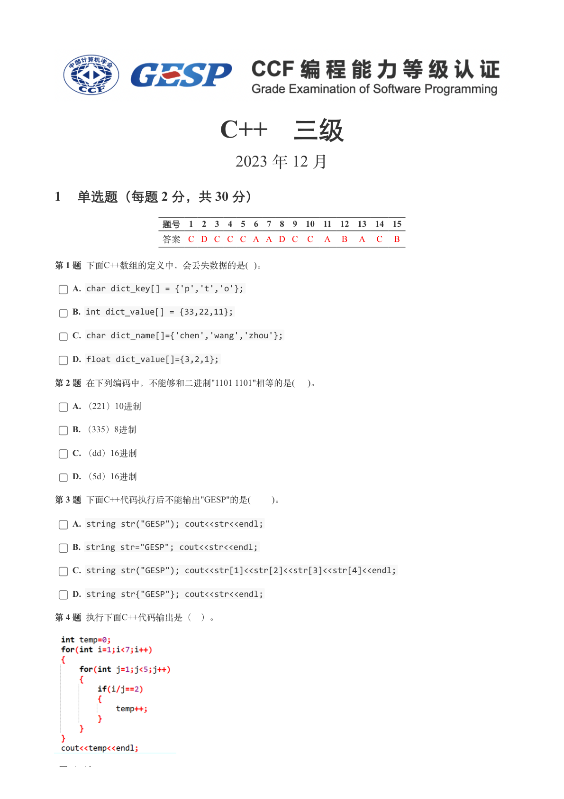
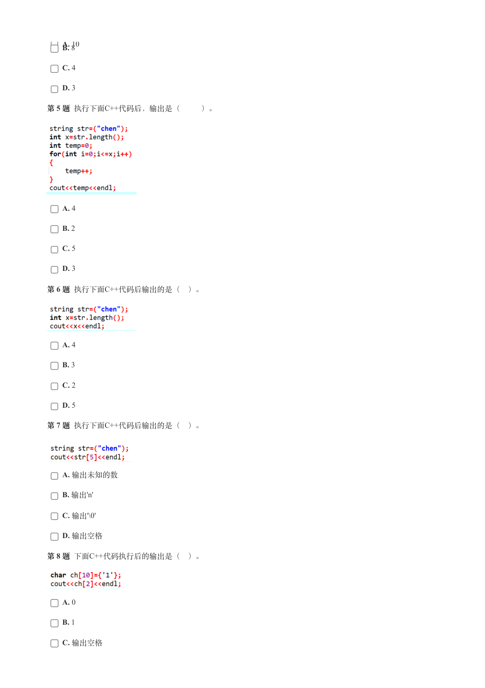
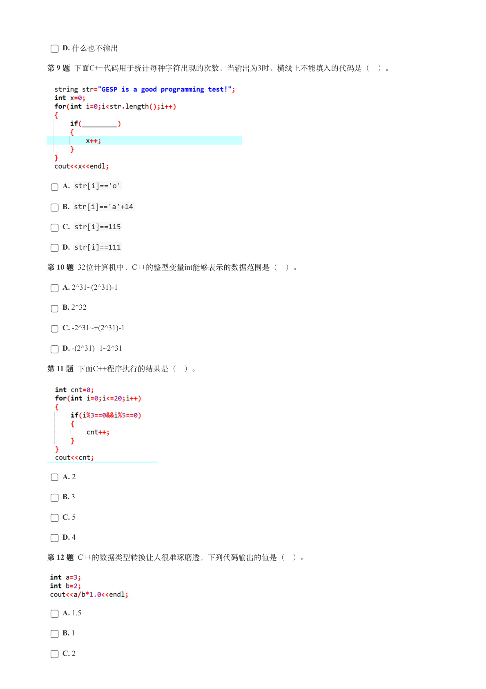
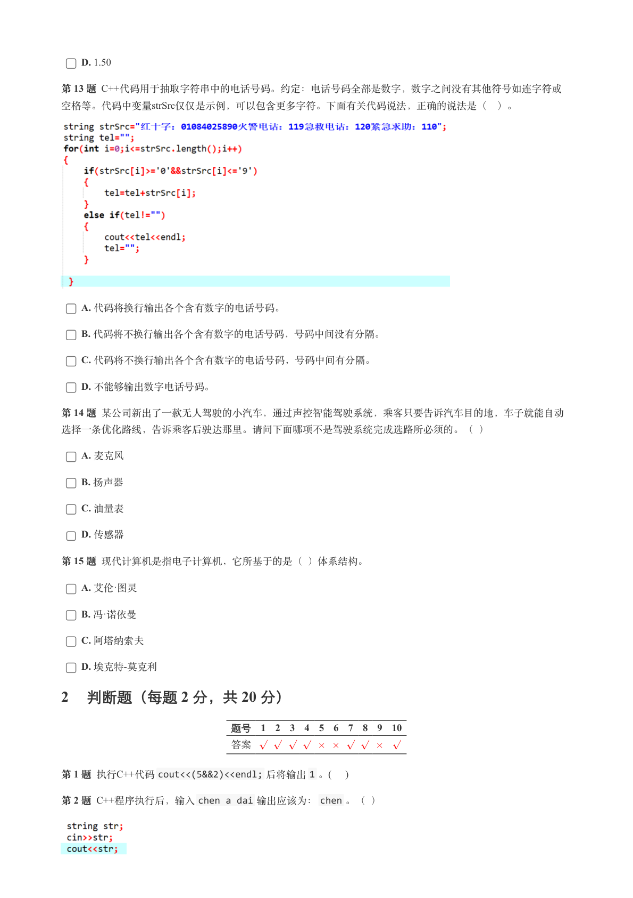
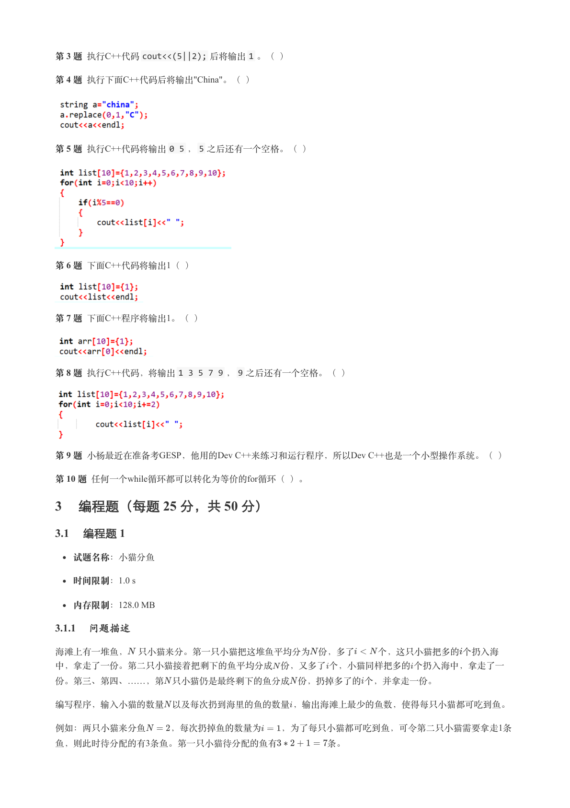
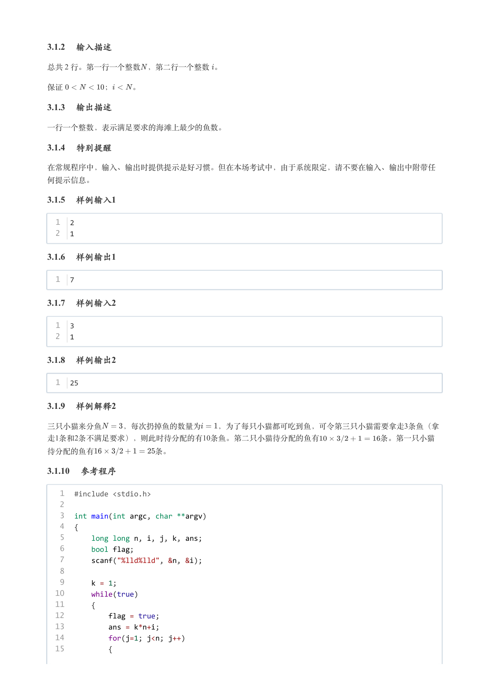
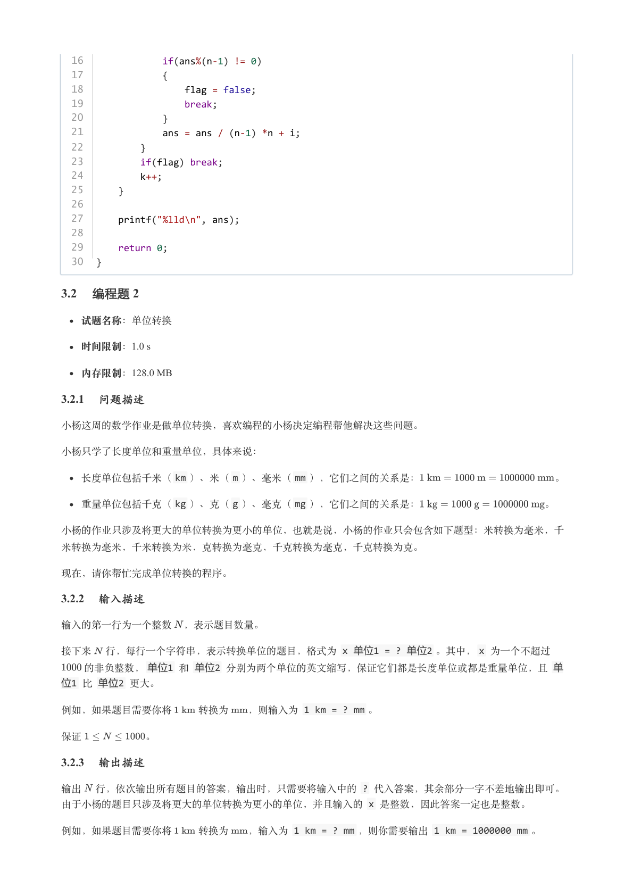
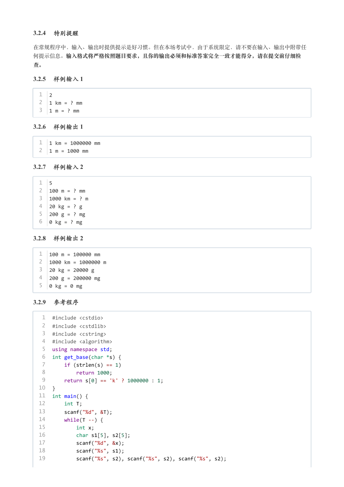
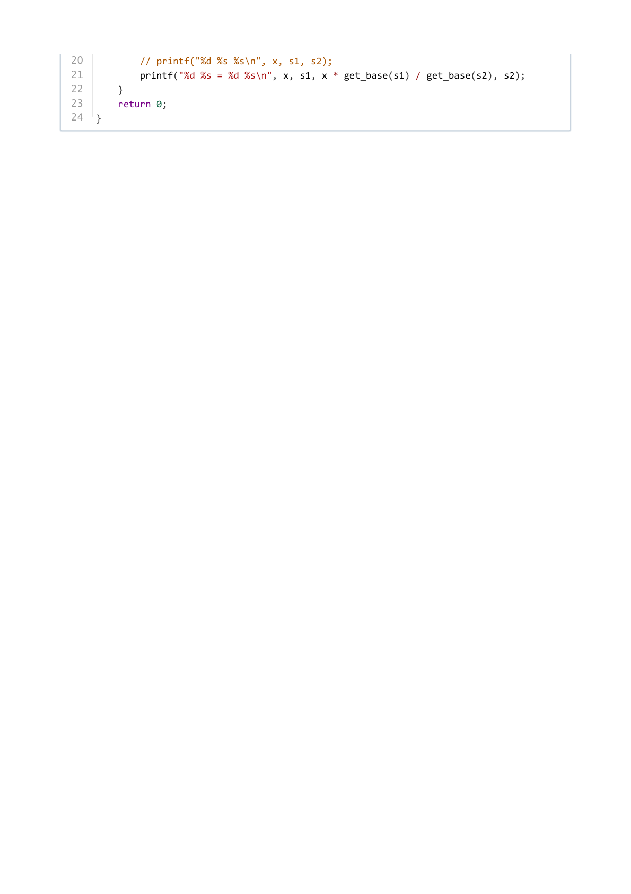

# 2023年12月-C++3级

- 原始 PDF：[`pdfs/2023年12月-C++3级.pdf`](../pdfs/2023年12月-C++3级.pdf)
- 页数：9
- 转换脚本：[`scripts/convert_pdfs_to_markdown.py`](../scripts/convert_pdfs_to_markdown.py)

> 为尽量避免信息丢失，每页均附带页面图片；文本提取结果保留原有顺序与换行特征，个别公式、图形、特殊排版请以页面图片为准。

## 第 1 页



### 提取文本

```
C++　三级

                      2023 年 12 月

1 单选题（每题 2 分，共 30 分）


            题号  1  2  3  4  5  6  7  8  9  10  11  12  13  14  15
            答案 C D C C C A A D C  C  A  B  A  C  B


第 1 题 下面C++数组的定义中，会丢失数据的是( )。

    A. char dict_key[] = {'p','t','o'};

    B. int dict_value[] = {33,22,11};

    C. char dict_name[]={'chen','wang','zhou'};

    D. float dict_value[]={3,2,1};

第 2 题 在下列编码中，不能够和二进制"1101 1101"相等的是(  )。

    A. （221）10进制

    B. （335）8进制

    C. （dd）16进制

    D. （5d）16进制

第 3 题 下面C++代码执行后不能输出"GESP"的是(    )。

    A. string str("GESP"); cout<<str<<endl;

    B. string str="GESP"; cout<<str<<endl;

    C. string str("GESP"); cout<<str[1]<<str[2]<<str[3]<<str[4]<<endl;

    D. string str{"GESP"}; cout<<str<<endl;

第 4 题 执行下面C++代码输出是（ ）。


   A 10
```

## 第 2 页



### 提取文本

```
A. 10    B. 8

    C. 4

    D. 3

第 5 题 执行下面C++代码后，输出是（   ）。


    A. 4

    B. 2

    C. 5

    D. 3

第 6 题 执行下面C++代码后输出的是（ ）。


    A. 4

    B. 3

    C. 2

    D. 5

第 7 题 执行下面C++代码后输出的是（ ）。


    A. 输出未知的数

    B. 输出'n'

    C. 输出'\0'

    D. 输出空格

第 8 题 下面C++代码执行后的输出是（ ）。


    A. 0

    B. 1

    C. 输出空格
```

## 第 3 页



### 提取文本

```
D. 什么也不输出

第 9 题 下面C++代码用于统计每种字符出现的次数，当输出为3时，横线上不能填入的代码是（ ）。


    A. str[i]=='o'

    B. str[i]=='a'+14

    C. str[i]==115

    D. str[i]==111

第 10 题 32位计算机中，C++的整型变量int能够表示的数据范围是（ ）。

    A. 2^31~(2^31)-1

    B. 2^32

    C. -2^31~+(2^31)-1

    D. -(2^31)+1~2^31

第 11 题 下面C++程序执行的结果是（ ）。


    A. 2

    B. 3

    C. 5

    D. 4

第 12 题 C++的数据类型转换让人很难琢磨透，下列代码输出的值是（ ）。


    A. 1.5

    B. 1

    C. 2
```

## 第 4 页



### 提取文本

```
D. 1.50

第 13 题 C++代码用于抽取字符串中的电话号码。约定：电话号码全部是数字，数字之间没有其他符号如连字符或
空格等。代码中变量strSrc仅仅是示例，可以包含更多字符。下面有关代码说法，正确的说法是（ ）。


    A. 代码将换行输出各个含有数字的电话号码。

    B. 代码将不换行输出各个含有数字的电话号码，号码中间没有分隔。

    C. 代码将不换行输出各个含有数字的电话号码，号码中间有分隔。

    D. 不能够输出数字电话号码。

第 14 题 某公司新出了一款无人驾驶的小汽车，通过声控智能驾驶系统，乘客只要告诉汽车目的地，车子就能自动

选择一条优化路线，告诉乘客后驶达那里。请问下面哪项不是驾驶系统完成选路所必须的。（ ）

    A. 麦克风

    B. 扬声器

    C. 油量表

    D. 传感器

第 15 题 现代计算机是指电子计算机，它所基于的是（ ）体系结构。

    A. 艾伦·图灵

    B. 冯·诺依曼

    C. 阿塔纳索夫

    D. 埃克特-莫克利

2 判断题（每题 2 分，共 20 分）


                 题号  1  2  3  4  5  6  7  8  9  10

                 答案


第 1 题 执行C++代码cout<<(5&&2)<<endl; 后将输出1 。(    )

第 2 题 C++程序执行后，输入chen a dai 输出应该为：chen 。（ ）
```

## 第 5 页



### 提取文本

```
第 3 题 执行C++代码cout<<(5||2); 后将输出1 。（ ）

第 4 题 执行下面C++代码后将输出"China"。（ ）


第 5 题 执行C++代码将输出0 5 ，5 之后还有一个空格。（ ）


第 6 题 下面C++代码将输出1（ ）


第 7 题 下面C++程序将输出1。（ ）


第 8 题 执行C++代码，将输出1 3 5 7 9 ，9 之后还有一个空格。（ ）


第 9 题 小杨最近在准备考GESP，他用的Dev C++来练习和运行程序，所以Dev C++也是一个小型操作系统。（ ）

第 10 题 任何一个while循环都可以转化为等价的for循环（ ）。

3 编程题（每题 25 分，共 50 分）

3.1 编程题 1

  试题名称：小猫分鱼

   时间限制：1.0 s

   内存限制：128.0 MB

3.1.1 问题描述

海滩上有一堆鱼， 只小猫来分。第一只小猫把这堆鱼平均分为 份，多了   个，这只小猫把多的个扔入海

中，拿走了一份。第二只小猫接着把剩下的鱼平均分成 份，又多了个，小猫同样把多的个扔入海中，拿走了一

份。第三、第四、……，第 只小猫仍是最终剩下的鱼分成 份，扔掉多了的个，并拿走一份。


编写程序，输入小猫的数量 以及每次扔到海里的鱼的数量，输出海滩上最少的鱼数，使得每只小猫都可吃到鱼。

例如：两只小猫来分鱼   ，每次扔掉鱼的数量为  ，为了每只小猫都可吃到鱼，可令第二只小猫需要拿走1条
鱼，则此时待分配的有3条鱼。第一只小猫待分配的鱼有      条。
```

## 第 6 页



### 提取文本

```
3.1.2 输入描述

总共 2 行。第一行一个整数 ，第二行一个整数 。


保证     ；   。

3.1.3 输出描述

一行一个整数，表示满足要求的海滩上最少的鱼数。

3.1.4 特别提醒

在常规程序中，输入、输出时提供提示是好习惯。但在本场考试中，由于系统限定，请不要在输入、输出中附带任

何提示信息。

3.1.5 样例输入1

  1  2
  2  1

3.1.6 样例输出1

  1  7

3.1.7 样例输入2

  1  3
  2  1

3.1.8 样例输出2

  1  25

3.1.9 样例解释2

三只小猫来分鱼   ，每次扔掉鱼的数量为  ，为了每只小猫都可吃到鱼，可令第三只小猫需要拿走3条鱼（拿
走1条和2条不满足要求），则此时待分配的有10条鱼。第二只小猫待分配的鱼有        条。第一只小猫

待分配的鱼有        条。

3.1.10 参考程序

   1  #include <stdio.h>
   2
   3  int main(int argc, char **argv)
   4  {
   5      long long n, i, j, k, ans;
   6      bool flag;
   7      scanf("%lld%lld", &n, &i);
   8
   9      k = 1;
  10      while(true)
  11      {
  12          flag = true;
  13          ans = k*n+i;
  14          for(j=1; j<n; j++)
  15          {
```

## 第 7 页



### 提取文本

```
16              if(ans%(n-1) != 0)
  17              {
  18                  flag = false;
  19                  break;
  20              }
  21              ans = ans / (n-1) *n + i;
  22          }
  23          if(flag) break;
  24          k++;
  25      }
  26
  27      printf("%lld\n", ans);
  28
  29      return 0;
  30  }

3.2 编程题 2


  试题名称：单位转换

   时间限制：1.0 s

   内存限制：128.0 MB

3.2.1 问题描述

小杨这周的数学作业是做单位转换，喜欢编程的小杨决定编程帮他解决这些问题。


小杨只学了长度单位和重量单位，具体来说：

  长度单位包括千米（km ）、米（m ）、毫米（mm ），它们之间的关系是：             。

  重量单位包括千克（kg ）、克（g ）、毫克（mg ），它们之间的关系是：            。


小杨的作业只涉及将更大的单位转换为更小的单位，也就是说，小杨的作业只会包含如下题型：米转换为毫米，千

米转换为毫米，千米转换为米，克转换为毫克，千克转换为毫克，千克转换为克。


现在，请你帮忙完成单位转换的程序。

3.2.2 输入描述

输入的第一行为一个整数 ，表示题目数量。

接下来 行，每行一个字符串，表示转换单位的题目，格式为 x 单位1 = ? 单位2 。其中，x 为一个不超过
  的非负整数，单位1 和 单位2 分别为两个单位的英文缩写，保证它们都是长度单位或都是重量单位，且 单
位1 比 单位2 更大。

例如，如果题目需要你将   转换为  ，则输入为 1 km = ? mm 。


保证      。

3.2.3 输出描述

输出 行，依次输出所有题目的答案，输出时，只需要将输入中的 ? 代入答案，其余部分一字不差地输出即可。
由于小杨的题目只涉及将更大的单位转换为更小的单位，并且输入的 x 是整数，因此答案一定也是整数。

例如，如果题目需要你将   转换为  ，输入为 1 km = ? mm ，则你需要输出 1 km = 1000000 mm 。
```

## 第 8 页



### 提取文本

```
3.2.4 特别提醒

在常规程序中，输入、输出时提供提示是好习惯。但在本场考试中，由于系统限定，请不要在输入、输出中附带任

何提示信息。输入格式将严格按照题目要求，且你的输出必须和标准答案完全一致才能得分，请在提交前仔细检

查。

3.2.5 样例输入 1

  1  2
  2  1 km = ? mm
  3  1 m = ? mm

3.2.6 样例输出 1

  1  1 km = 1000000 mm
  2  1 m = 1000 mm

3.2.7 样例输入 2

  1  5
  2  100 m = ? mm
  3  1000 km = ? m
  4  20 kg = ? g
  5  200 g = ? mg
  6  0 kg = ? mg

3.2.8 样例输出 2

  1  100 m = 100000 mm
  2  1000 km = 1000000 m
  3  20 kg = 20000 g
  4  200 g = 200000 mg
  5  0 kg = 0 mg

3.2.9 参考程序

   1  #include <cstdio>
   2  #include <cstdlib>
   3  #include <cstring>
   4  #include <algorithm>
   5  using namespace std;
   6  int get_base(char *s) {
   7      if (strlen(s) == 1)
   8          return 1000;
   9      return s[0] == 'k' ? 1000000 : 1;
  10  }
  11  int main() {
  12      int T;
  13      scanf("%d", &T);
  14      while(T --) {
  15          int x;
  16          char s1[5], s2[5];
  17          scanf("%d", &x);
  18          scanf("%s", s1);
  19          scanf("%s", s2), scanf("%s", s2), scanf("%s", s2);
```

## 第 9 页



### 提取文本

```
20          // printf("%d %s %s\n", x, s1, s2);
21          printf("%d %s = %d %s\n", x, s1, x * get_base(s1) / get_base(s2), s2);
22      }
23      return 0;
24  }
```
