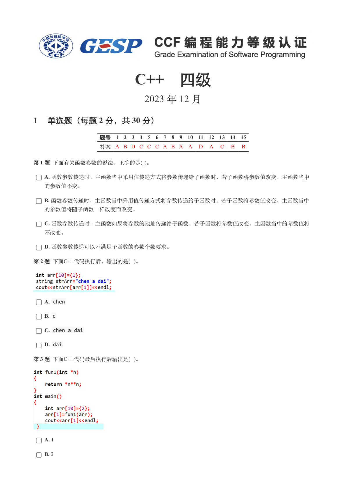
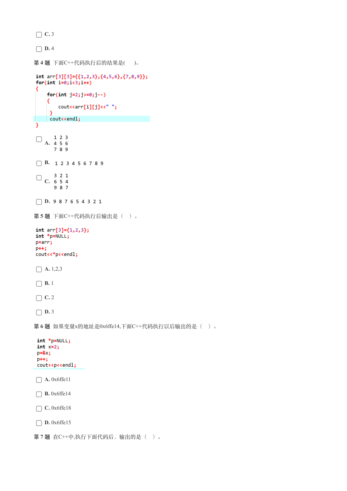
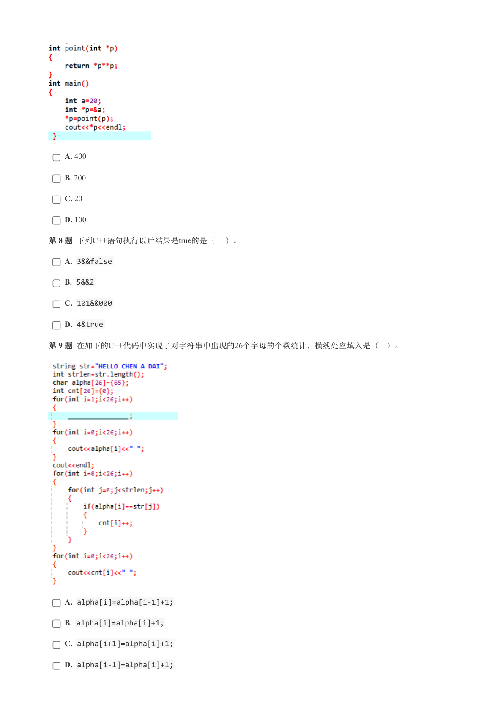
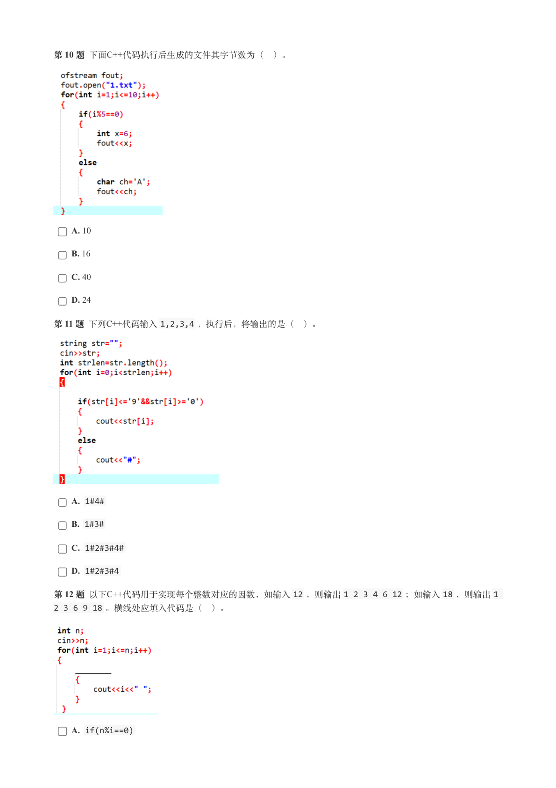
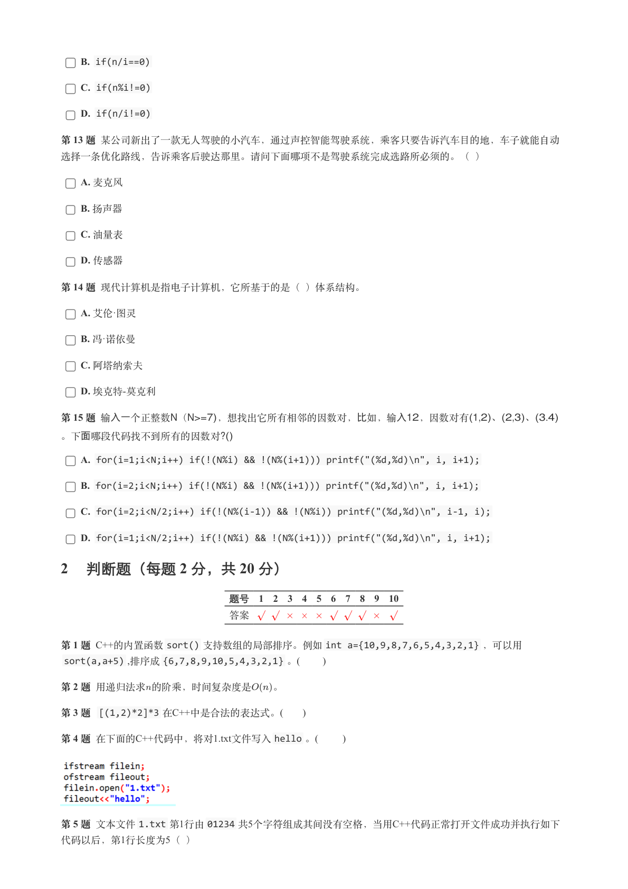
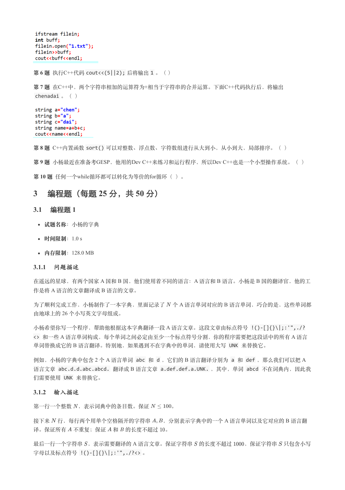
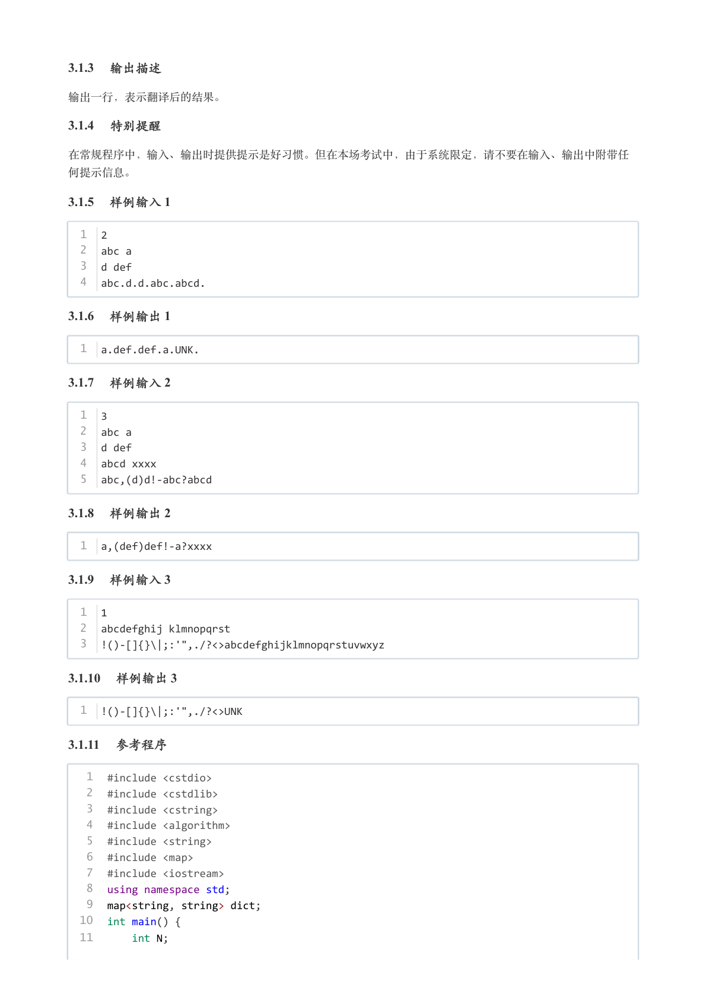
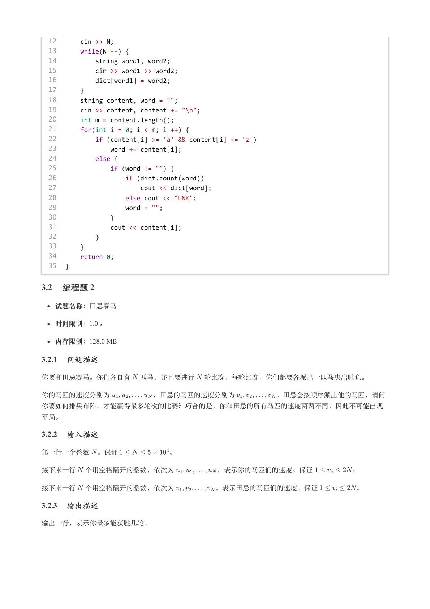
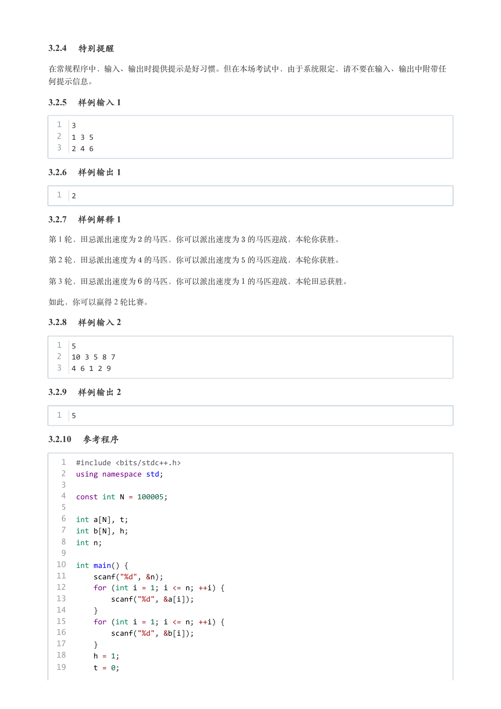
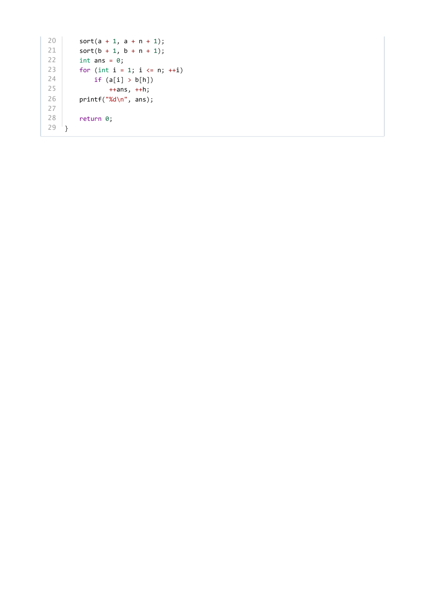

# 2023年12月-C++4级

- 原始 PDF：[`pdfs/2023年12月-C++4级.pdf`](../pdfs/2023年12月-C++4级.pdf)
- 页数：10
- 转换脚本：[`scripts/convert_pdfs_to_markdown.py`](../scripts/convert_pdfs_to_markdown.py)

> 为尽量避免信息丢失，每页均附带页面图片；文本提取结果保留原有顺序与换行特征，个别公式、图形、特殊排版请以页面图片为准。

## 第 1 页



### 提取文本

```
C++　四级

                      2023 年 12 月

1 单选题（每题 2 分，共 30 分）


            题号  1  2  3  4  5  6  7  8  9  10  11  12  13  14  15
            答案 A B D C C C A B A A  D  A  C  B  B


第 1 题 下面有关函数参数的说法，正确的是( )。

    A. 函数参数传递时，主函数当中采用值传递方式将参数传递给子函数时，若子函数将参数值改变，主函数当中

  的参数值不变。

    B. 函数参数传递时，主函数当中采用值传递方式将参数传递给子函数时，若子函数将参数值改变，主函数当中

  的参数值将随子函数一样改变而改变。

    C. 函数参数传递时，主函数如果将参数的地址传递给子函数，若子函数将参数值改变，主函数当中的参数值将

  不改变。

    D. 函数参数传递可以不满足子函数的参数个数要求。

第 2 题 下面C++代码执行后，输出的是( )。


    A. chen

    B. c

    C. chen a dai

    D. dai

第 3 题 下面C++代码最后执行后输出是( )。


    A. 1

    B. 2
```

## 第 2 页



### 提取文本

```
C. 3

    D. 4

第 4 题 下面C++代码执行后的结果是(  )。


    A.


    B.


    C.


    D.

第 5 题 下面C++代码执行后输出是（ ）。


    A. 1,2,3

    B. 1

    C. 2

    D. 3

第 6 题 如果变量x的地址是0x6ffe14,下面C++代码执行以后输出的是（ ）。


    A. 0x6ffe11

    B. 0x6ffe14

    C. 0x6ffe18

    D. 0x6ffe15

第 7 题 在C++中,执行下面代码后，输出的是（ ）。
```

## 第 3 页



### 提取文本

```
A. 400

    B. 200

    C. 20

    D. 100

第 8 题 下列C++语句执行以后结果是true的是（ ）。

    A. 3&&false

    B. 5&&2

    C. 101&&000

    D. 4&true

第 9 题 在如下的C++代码中实现了对字符串中出现的26个字母的个数统计，横线处应填入是（ ）。


    A. alpha[i]=alpha[i-1]+1;

    B. alpha[i]=alpha[i]+1;

    C. alpha[i+1]=alpha[i]+1;

    D. alpha[i-1]=alpha[i]+1;
```

## 第 4 页



### 提取文本

```
第 10 题 下面C++代码执行后生成的文件其字节数为（ ）。


    A. 10

    B. 16

    C. 40

    D. 24

第 11 题 下列C++代码输入1,2,3,4 ，执行后，将输出的是（ ）。


    A. 1#4#

    B. 1#3#

    C. 1#2#3#4#

    D. 1#2#3#4

第 12 题 以下C++代码用于实现每个整数对应的因数，如输入12 ，则输出1 2 3 4 6 12 ；如输入18 ，则输出1
2 3 6 9 18 。横线处应填入代码是（ ）。


    A. if(n%i==0)
```

## 第 5 页



### 提取文本

```
B. if(n/i==0)

    C. if(n%i!=0)

    D. if(n/i!=0)

第 13 题 某公司新出了一款无人驾驶的小汽车，通过声控智能驾驶系统，乘客只要告诉汽车目的地，车子就能自动

选择一条优化路线，告诉乘客后驶达那里。请问下面哪项不是驾驶系统完成选路所必须的。（ ）

    A. 麦克风

    B. 扬声器

    C. 油量表

    D. 传感器

第 14 题 现代计算机是指电子计算机，它所基于的是（ ）体系结构。

    A. 艾伦·图灵

    B. 冯·诺依曼

    C. 阿塔纳索夫

    D. 埃克特-莫克利

第15 题输入一个正整数N（N>=7)，想找出它所有相邻的因数对，比如，输入12，因数对有(1,2)、(2,3)、(3.4)

。下面哪段代码找不到所有的因数对?()

    A. for(i=1;i<N;i++) if(!(N%i) && !(N%(i+1))) printf("(%d,%d)\n", i, i+1);

    B. for(i=2;i<N;i++) if(!(N%i) && !(N%(i+1))) printf("(%d,%d)\n", i, i+1);

    C. for(i=2;i<N/2;i++) if(!(N%(i-1)) && !(N%i)) printf("(%d,%d)\n", i-1, i);

    D. for(i=1;i<N/2;i++) if(!(N%i) && !(N%(i+1))) printf("(%d,%d)\n", i, i+1);

2 判断题（每题 2 分，共 20 分）

                 题号  1  2  3  4  5  6  7  8  9  10

                 答案


第 1 题 C++的内置函数sort() 支持数组的局部排序。例如int a={10,9,8,7,6,5,4,3,2,1} ，可以用
 sort(a,a+5) ,排序成{6,7,8,9,10,5,4,3,2,1} 。(       )

第 2 题 用递归法求的阶乘，时间复杂度是  。

第 3 题 [(1,2)*2]*3 在C++中是合法的表达式。(      )

第 4 题 在下面的C++代码中，将对1.txt文件写入hello 。(       )


第 5 题 文本文件1.txt 第1行由01234 共5个字符组成其间没有空格，当用C++代码正常打开文件成功并执行如下
代码以后，第1行长度为5（ ）
```

## 第 6 页



### 提取文本

```
第 6 题 执行C++代码cout<<(5||2); 后将输出1 。（ ）

第 7 题 在C++中，两个字符串相加的运算符为+相当于字符串的合并运算。下面C++代码执行后，将输出
 chenadai 。（ ）


第 8 题 C++内置函数sort() 可以对整数、浮点数、字符数组进行从大到小，从小到大，局部排序。（ ）

第 9 题 小杨最近在准备考GESP，他用的Dev C++来练习和运行程序，所以Dev C++也是一个小型操作系统。（ ）

第 10 题 任何一个while循环都可以转化为等价的for循环（ ）。

3 编程题（每题 25 分，共 50 分）

3.1 编程题 1


  试题名称：小杨的字典

   时间限制：1.0 s

   内存限制：128.0 MB

3.1.1 问题描述

在遥远的星球，有两个国家 A 国和 B 国，他们使用着不同的语言：A 语言和 B 语言。小杨是 B 国的翻译官，他的工
作是将 A 语言的文章翻译成 B 语言的文章。

为了顺利完成工作，小杨制作了一本字典，里面记录了 个 A 语言单词对应的 B 语言单词，巧合的是，这些单词都
由地球上的 26 个小写英文字母组成。

小杨希望你写一个程序，帮助他根据这本字典翻译一段 A 语言文章。这段文章由标点符号 !()-[]{}\|;:'",./?
<> 和一些 A 语言单词构成，每个单词之间必定由至少一个标点符号分割，你的程序需要把这段话中的所有 A 语言
单词替换成它的 B 语言翻译。特别地，如果遇到不在字典中的单词，请使用大写 UNK 来替换它。

例如，小杨的字典中包含 2 个 A 语言单词 abc 和 d ，它们的 B 语言翻译分别为 a 和 def ，那么我们可以把 A
语言文章 abc.d.d.abc.abcd. 翻译成 B 语言文章 a.def.def.a.UNK. ，其中，单词 abcd 不在词典内，因此我
们需要使用 UNK 来替换它。

3.1.2 输入描述

第一行一个整数 ，表示词典中的条目数。保证    。

接下来 行，每行两个用单个空格隔开的字符串  ，分别表示字典中的一个 A 语言单词以及它对应的 B 语言翻

译。保证所有 不重复；保证 和 的长度不超过 。

最后一行一个字符串 ，表示需要翻译的 A 语言文章。保证字符串 的长度不超过  ，保证字符串 只包含小写
字母以及标点符号 !()-[]{}\|;:'",./?<> 。
```

## 第 7 页



### 提取文本

```
3.1.3 输出描述

输出一行，表示翻译后的结果。

3.1.4 特别提醒

在常规程序中，输入、输出时提供提示是好习惯。但在本场考试中，由于系统限定，请不要在输入、输出中附带任

何提示信息。

3.1.5 样例输入 1

  1  2
  2  abc a
  3  d def
  4  abc.d.d.abc.abcd.

3.1.6 样例输出 1

  1  a.def.def.a.UNK.

3.1.7 样例输入 2

  1  3
  2  abc a
  3  d def
  4  abcd xxxx
  5  abc,(d)d!-abc?abcd

3.1.8 样例输出 2

  1  a,(def)def!-a?xxxx

3.1.9 样例输入 3

  1  1
  2  abcdefghij klmnopqrst
  3  !()-[]{}\|;:'",./?<>abcdefghijklmnopqrstuvwxyz

3.1.10 样例输出 3

  1  !()-[]{}\|;:'",./?<>UNK

3.1.11 参考程序

   1  #include <cstdio>
   2  #include <cstdlib>
   3  #include <cstring>
   4  #include <algorithm>
   5  #include <string>
   6  #include <map>
   7  #include <iostream>
   8  using namespace std;
   9  map<string, string> dict;
  10  int main() {
  11      int N;
```

## 第 8 页



### 提取文本

```
12      cin >> N;
  13      while(N --) {
  14          string word1, word2;
  15          cin >> word1 >> word2;
  16          dict[word1] = word2;
  17      }
  18      string content, word = "";
  19      cin >> content, content += "\n";
  20      int m = content.length();
  21      for(int i = 0; i < m; i ++) {
  22          if (content[i] >= 'a' && content[i] <= 'z')
  23              word += content[i];
  24          else {
  25              if (word != "") {
  26                  if (dict.count(word))
  27                      cout << dict[word];
  28                  else cout << "UNK";
  29                  word = "";
  30              }
  31              cout << content[i];
  32          }
  33      }
  34      return 0;
  35  }

3.2 编程题 2


  试题名称：田忌赛马

   时间限制：1.0 s

   内存限制：128.0 MB

3.2.1 问题描述

你要和田忌赛马。你们各自有 匹马，并且要进行 轮比赛，每轮比赛，你们都要各派出一匹马决出胜负。


你的马匹的速度分别为      ，田忌的马匹的速度分别为      。田忌会按顺序派出他的马匹，请问

你要如何排兵布阵，才能赢得最多轮次的比赛？巧合的是，你和田忌的所有马匹的速度两两不同，因此不可能出现

平局。

3.2.2 输入描述

第一行一个整数 。保证        。


接下来一行 个用空格隔开的整数，依次为      ，表示你的马匹们的速度。保证      。


接下来一行 个用空格隔开的整数，依次为      ，表示田忌的马匹们的速度。保证      。

3.2.3 输出描述

输出一行，表示你最多能获胜几轮。
```

## 第 9 页



### 提取文本

```
3.2.4 特别提醒

在常规程序中，输入、输出时提供提示是好习惯。但在本场考试中，由于系统限定，请不要在输入、输出中附带任

何提示信息。

3.2.5 样例输入 1

  1  3
  2  1 3 5
  3  2 4 6

3.2.6 样例输出 1

  1  2

3.2.7 样例解释 1

第 1 轮，田忌派出速度为 的马匹，你可以派出速度为 的马匹迎战，本轮你获胜。

第 2 轮，田忌派出速度为 的马匹，你可以派出速度为 的马匹迎战，本轮你获胜。

第 3 轮，田忌派出速度为 的马匹，你可以派出速度为 的马匹迎战，本轮田忌获胜。

如此，你可以赢得 2 轮比赛。

3.2.8 样例输入 2

  1  5
  2  10 3 5 8 7
  3  4 6 1 2 9

3.2.9 样例输出 2

  1  5

3.2.10 参考程序

   1  #include <bits/stdc++.h>
   2  using namespace std;
   3
   4  const int N = 100005;
   5
   6  int a[N], t;
   7  int b[N], h;
   8  int n;
   9
  10  int main() {
  11      scanf("%d", &n);
  12      for (int i = 1; i <= n; ++i) {
  13          scanf("%d", &a[i]);
  14      }
  15      for (int i = 1; i <= n; ++i) {
  16          scanf("%d", &b[i]);
  17      }
  18      h = 1;
  19      t = 0;
```

## 第 10 页



### 提取文本

```
20      sort(a + 1, a + n + 1);
21      sort(b + 1, b + n + 1);
22      int ans = 0;
23      for (int i = 1; i <= n; ++i)
24          if (a[i] > b[h])
25              ++ans, ++h;
26      printf("%d\n", ans);
27
28      return 0;
29  }
```
