# 2023年12月-C++5级

- 原始 PDF：[`pdfs/2023年12月-C++5级.pdf`](../pdfs/2023年12月-C++5级.pdf)
- 页数：12
- 转换脚本：[`scripts/convert_pdfs_to_markdown.py`](../scripts/convert_pdfs_to_markdown.py)

> 为尽量避免信息丢失，每页均附带页面图片；文本提取结果保留原有顺序与换行特征，个别公式、图形、特殊排版请以页面图片为准。

## 第 1 页

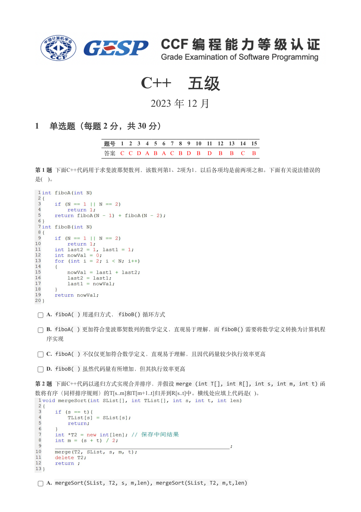

### 提取文本

```
C++　五级

                      2023 年 12 月

1 单选题（每题 2 分，共 30 分）


            题号  1  2  3  4  5  6  7  8  9  10  11  12  13  14  15
            答案 C C D A B A C B D  B  D  B  B  C  B


第 1 题 下面C++代码用于求斐波那契数列，该数列第1、2项为1，以后各项均是前两项之和。下面有关说法错误的
是( )。


    A. fiboA( ) 用递归方式，fiboB() 循环方式

    B. fiboA( ) 更加符合斐波那契数列的数学定义，直观易于理解，而fiboB() 需要将数学定义转换为计算机程

  序实现

    C. fiboA( ) 不仅仅更加符合数学定义，直观易于理解，且因代码量较少执行效率更高

    D. fiboB( ) 虽然代码量有所增加，但其执行效率更高

第 2 题 下面C++代码以递归方式实现合并排序，并假设merge (int T[], int R[], int s, int m, int t) 函
数将有序（同样排序规则）的T[s..m]和T[m+1..t]归并到R[s..t]中。横线处应填上代码是( )。


    A. mergeSort(SList, T2, s, m,len), mergeSort(SList, T2, m,t,len)
```

## 第 2 页

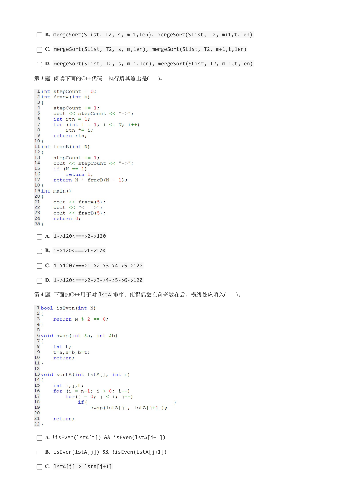

### 提取文本

```
B. mergeSort(SList, T2, s, m-1,len), mergeSort(SList, T2, m+1,t,len)

    C. mergeSort(SList, T2, s, m,len), mergeSort(SList, T2, m+1,t,len)

    D. mergeSort(SList, T2, s, m-1,len), mergeSort(SList, T2, m-1,t,len)

第 3 题 阅读下面的C++代码，执行后其输出是(  )。


    A. 1->120<===>2->120

    B. 1->120<===>1->120

    C. 1->120<===>1->2->3->4->5->120

    D. 1->120<===>2->3->4->5->6->120

第 4 题 下面的C++用于对lstA 排序，使得偶数在前奇数在后，横线处应填入(   )。


    A. !isEven(lstA[j]) && isEven(lstA[j+1])

    B. isEven(lstA[j]) && !isEven(lstA[j+1])

    C. lstA[j] > lstA[j+1]
```

## 第 3 页

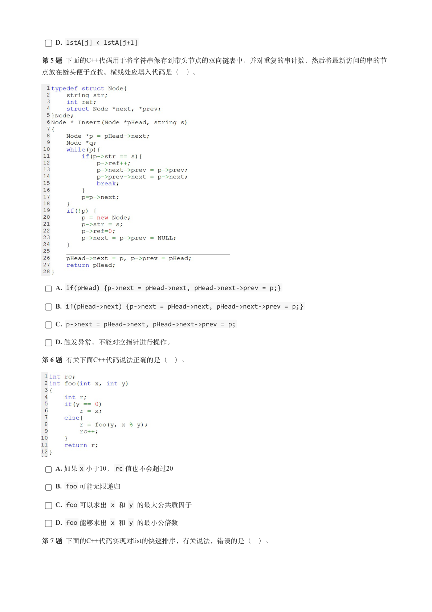

### 提取文本

```
D. lstA[j] < lstA[j+1]

第 5 题 下面的C++代码用于将字符串保存到带头节点的双向链表中，并对重复的串计数，然后将最新访问的串的节

点放在链头便于查找。横线处应填入代码是（ ）。


    A. if(pHead) {p->next = pHead->next, pHead->next->prev = p;}

    B. if(pHead->next) {p->next = pHead->next, pHead->next->prev = p;}

    C. p->next = pHead->next, pHead->next->prev = p;

    D. 触发异常，不能对空指针进行操作。

第 6 题 有关下面C++代码说法正确的是（ ）。


    A. 如果x 小于10，rc 值也不会超过20

    B. foo 可能无限递归

    C. foo 可以求出 x 和 y 的最大公共质因子

    D. foo 能够求出 x 和 y 的最小公倍数

第 7 题 下面的C++代码实现对list的快速排序，有关说法，错误的是（ ）。
```

## 第 4 页

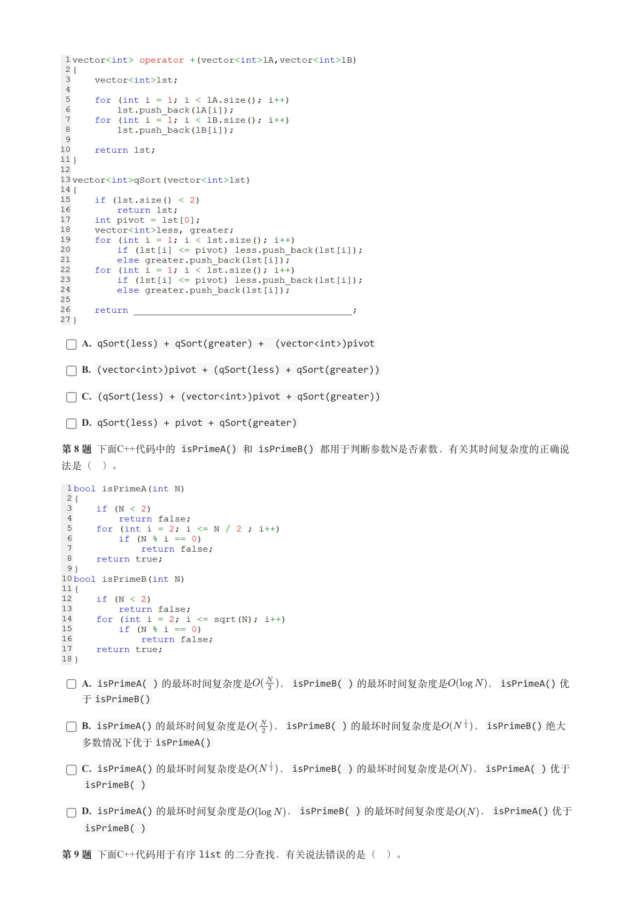

### 提取文本

```
A. qSort(less) + qSort(greater) +  (vector<int>)pivot

    B. (vector<int>)pivot + (qSort(less) + qSort(greater))

    C. (qSort(less) + (vector<int>)pivot + qSort(greater))

    D. qSort(less) + pivot + qSort(greater)

第 8 题 下面C++代码中的 isPrimeA() 和 isPrimeB() 都用于判断参数N是否素数，有关其时间复杂度的正确说

法是（ ）。


    A. isPrimeA( ) 的最坏时间复杂度是    ，isPrimeB( ) 的最坏时间复杂度是      ，isPrimeA() 优
   于isPrimeB()

    B. isPrimeA() 的最坏时间复杂度是    ，isPrimeB( ) 的最坏时间复杂度是     ，isPrimeB() 绝大
   多数情况下优于isPrimeA()

    C. isPrimeA() 的最坏时间复杂度是     ，isPrimeB( ) 的最坏时间复杂度是    ，isPrimeA( ) 优于
    isPrimeB( )

    D. isPrimeA() 的最坏时间复杂度是      ，isPrimeB( ) 的最坏时间复杂度是    ，isPrimeA() 优于
    isPrimeB( )

第 9 题 下面C++代码用于有序list 的二分查找，有关说法错误的是（ ）。
```

## 第 5 页

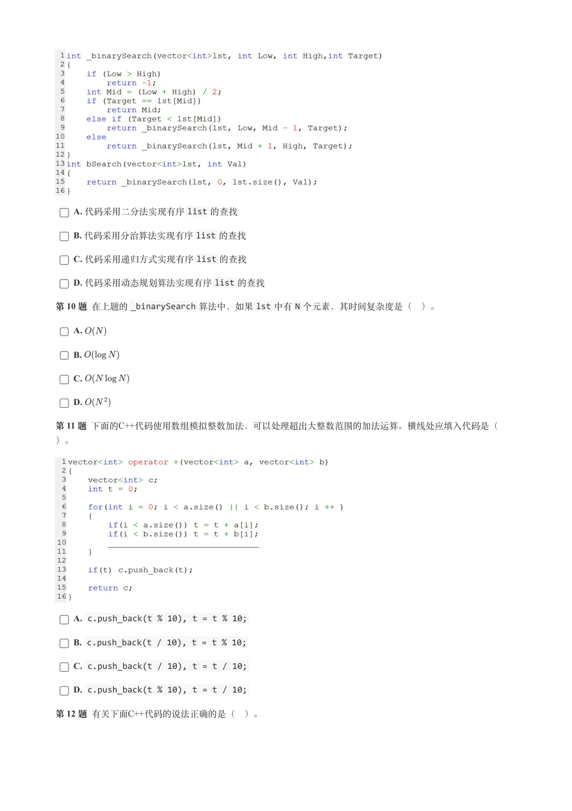

### 提取文本

```
A. 代码采用二分法实现有序list 的查找

    B. 代码采用分治算法实现有序list 的查找

    C. 代码采用递归方式实现有序list 的查找

    D. 代码采用动态规划算法实现有序list 的查找

第 10 题 在上题的_binarySearch 算法中，如果lst 中有N 个元素，其时间复杂度是（ ）。

    A.

    B.

    C.

    D.

第 11 题 下面的C++代码使用数组模拟整数加法，可以处理超出大整数范围的加法运算。横线处应填入代码是（

）。


    A. c.push_back(t % 10), t = t % 10;

    B. c.push_back(t / 10), t = t % 10;

    C. c.push_back(t / 10), t = t / 10;

    D. c.push_back(t % 10), t = t / 10;

第 12 题 有关下面C++代码的说法正确的是（ ）。
```

## 第 6 页

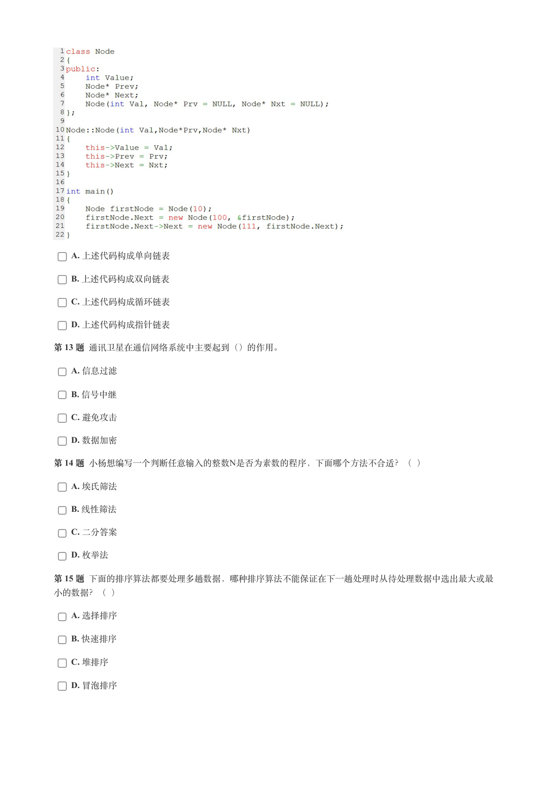

### 提取文本

```
A. 上述代码构成单向链表

    B. 上述代码构成双向链表

    C. 上述代码构成循环链表

    D. 上述代码构成指针链表

第 13 题 通讯卫星在通信网络系统中主要起到（）的作用。

    A. 信息过滤

    B. 信号中继

    C. 避免攻击

    D. 数据加密

第 14 题 小杨想编写一个判断任意输入的整数N是否为素数的程序，下面哪个方法不合适？（ ）

    A. 埃氏筛法

    B. 线性筛法

    C. 二分答案

    D. 枚举法

第 15 题 下面的排序算法都要处理多趟数据，哪种排序算法不能保证在下一趟处理时从待处理数据中选出最大或最

小的数据？（ ）

    A. 选择排序

    B. 快速排序

    C. 堆排序

    D. 冒泡排序
```

## 第 7 页

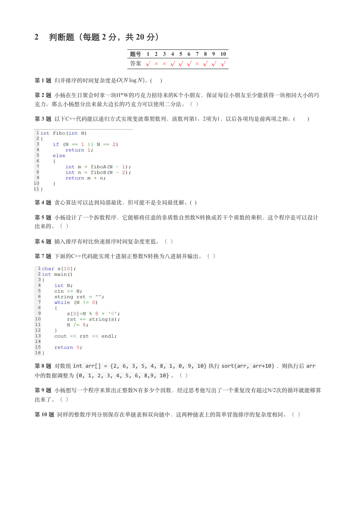

### 提取文本

```
2 判断题（每题 2 分，共 20 分）

                 题号  1  2  3  4  5  6  7  8  9  10

                 答案


第 1 题 归并排序的时间复杂度是       。(    )

第 2 题 小杨在生日聚会时拿一块H*W的巧克力招待来的K个小朋友，保证每位小朋友至少能获得一块相同大小的巧

克力。那么小杨想分出来最大边长的巧克力可以使用二分法。（ ）

第 3 题 以下C++代码能以递归方式实现斐波那契数列，该数列第1、2项为1，以后各项均是前两项之和。(      )


第 4 题 贪心算法可以达到局部最优，但可能不是全局最优解。(  )

第 5 题 小杨设计了一个拆数程序，它能够将任意的非质数自然数N转换成若干个质数的乘积，这个程序是可以设计

出来的。（ ）

第 6 题 插入排序有时比快速排序时间复杂度更低。（ ）

第 7 题 下面的C++代码能实现十进制正整数N转换为八进制并输出。（ ）


第 8 题 对数组int arr[] = {2, 6, 3, 5, 4, 8, 1, 0, 9, 10} 执行sort(arr, arr+10) ，则执行后arr
中的数据调整为{0, 1, 2, 3, 4, 5, 6, 8,9, 10} 。（ ）

第 9 题 小杨想写一个程序来算出正整数N有多少个因数，经过思考他写出了一个重复没有超过N/2次的循环就能够算

出来了。（ ）

第 10 题 同样的整数序列分别保存在单链表和双向链中，这两种链表上的简单冒泡排序的复杂度相同。（ ）
```

## 第 8 页

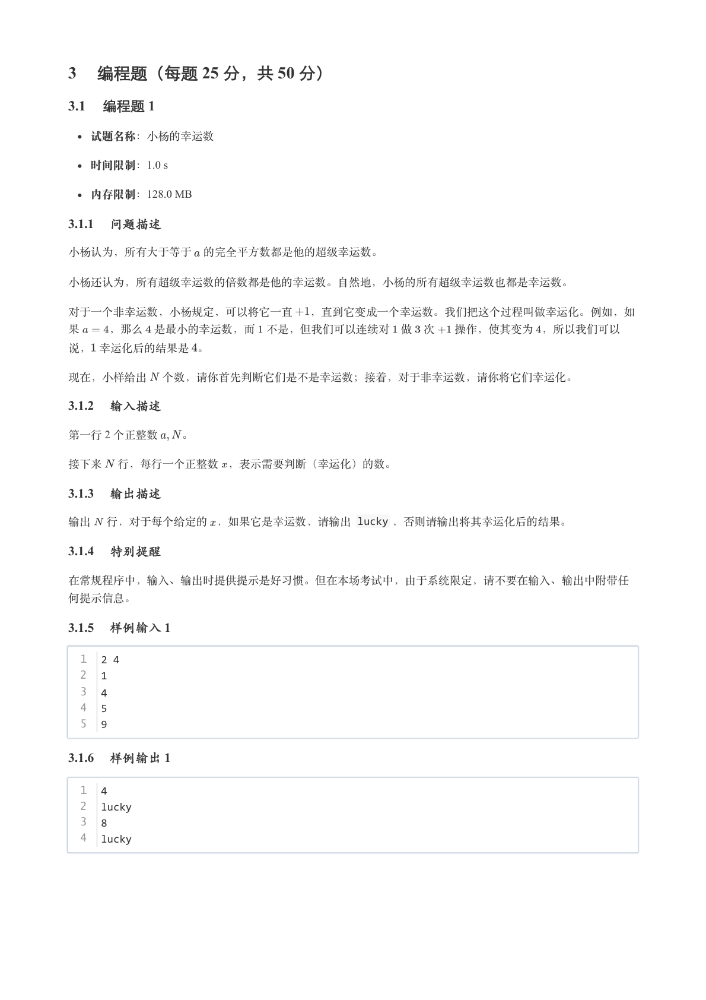

### 提取文本

```
3 编程题（每题 25 分，共 50 分）

3.1 编程题 1


  试题名称：小杨的幸运数

   时间限制：1.0 s

   内存限制：128.0 MB

3.1.1 问题描述

小杨认为，所有大于等于 的完全平方数都是他的超级幸运数。


小杨还认为，所有超级幸运数的倍数都是他的幸运数。自然地，小杨的所有超级幸运数也都是幸运数。


对于一个非幸运数，小杨规定，可以将它一直  ，直到它变成一个幸运数。我们把这个过程叫做幸运化。例如，如

果   ，那么 是最小的幸运数，而 不是，但我们可以连续对 做 次  操作，使其变为 ，所以我们可以

说， 幸运化后的结果是 。


现在，小样给出 个数，请你首先判断它们是不是幸运数；接着，对于非幸运数，请你将它们幸运化。

3.1.2 输入描述

第一行 2 个正整数  。


接下来 行，每行一个正整数 ，表示需要判断（幸运化）的数。

3.1.3 输出描述

输出 行，对于每个给定的 ，如果它是幸运数，请输出 lucky ，否则请输出将其幸运化后的结果。

3.1.4 特别提醒

在常规程序中，输入、输出时提供提示是好习惯。但在本场考试中，由于系统限定，请不要在输入、输出中附带任

何提示信息。

3.1.5 样例输入 1

  1  2 4
  2  1
  3  4
  4  5
  5  9

3.1.6 样例输出 1

  1  4
  2  lucky
  3  8
  4  lucky
```

## 第 9 页

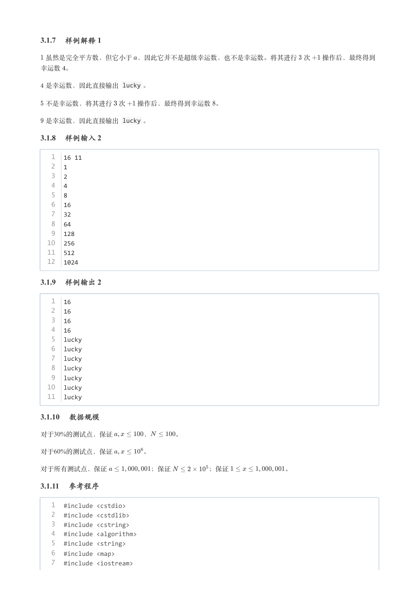

### 提取文本

```
3.1.7 样例解释 1

 虽然是完全平方数，但它小于 ，因此它并不是超级幸运数，也不是幸运数。将其进行 次  操作后，最终得到

幸运数 。

 是幸运数，因此直接输出 lucky 。


 不是幸运数，将其进行 次  操作后，最终得到幸运数 。

 是幸运数，因此直接输出 lucky 。

3.1.8 样例输入 2

   1  16 11
   2  1
   3  2
   4  4
   5  8
   6  16
   7  32
   8  64
   9  128
  10  256
  11  512
  12  1024

3.1.9 样例输出 2

   1  16
   2  16
   3  16
   4  16
   5  lucky
   6  lucky
   7  lucky
   8  lucky
   9  lucky
  10  lucky
  11  lucky

3.1.10 数据规模

对于30%的测试点，保证     ，    。

对于60%的测试点，保证     。


对于所有测试点，保证       ；保证      ；保证        。

3.1.11 参考程序

   1  #include <cstdio>
   2  #include <cstdlib>
   3  #include <cstring>
   4  #include <algorithm>
   5  #include <string>
   6  #include <map>
   7  #include <iostream>
```

## 第 10 页

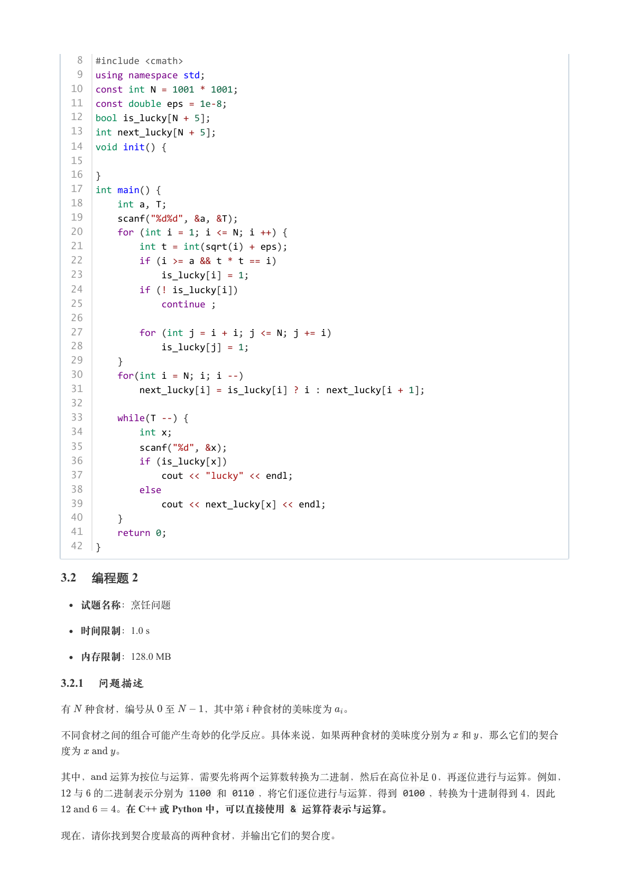

### 提取文本

```
8  #include <cmath>
   9  using namespace std;
  10  const int N = 1001 * 1001;
  11  const double eps = 1e-8;
  12  bool is_lucky[N + 5];
  13  int next_lucky[N + 5];
  14  void init() {
  15
  16  }
  17  int main() {
  18      int a, T;
  19      scanf("%d%d", &a, &T);
  20      for (int i = 1; i <= N; i ++) {
  21          int t = int(sqrt(i) + eps);
  22          if (i >= a && t * t == i)
  23              is_lucky[i] = 1;
  24          if (! is_lucky[i])
  25              continue ;
  26
  27          for (int j = i + i; j <= N; j += i)
  28              is_lucky[j] = 1;
  29      }
  30      for(int i = N; i; i --)
  31          next_lucky[i] = is_lucky[i] ? i : next_lucky[i + 1];
  32
  33      while(T --) {
  34          int x;
  35          scanf("%d", &x);
  36          if (is_lucky[x])
  37              cout << "lucky" << endl;
  38          else
  39              cout << next_lucky[x] << endl;
  40      }
  41      return 0;
  42  }

3.2 编程题 2


  试题名称：烹饪问题

   时间限制：1.0 s

   内存限制：128.0 MB

3.2.1 问题描述

有 种食材，编号从 至   ，其中第 种食材的美味度为 。


不同食材之间的组合可能产生奇妙的化学反应。具体来说，如果两种食材的美味度分别为 和 ，那么它们的契合

度为   。


其中，  运算为按位与运算，需要先将两个运算数转换为二进制，然后在高位补足 ，再逐位进行与运算。例如，
 与 的二进制表示分别为 1100 和 0110 ，将它们逐位进行与运算，得到 0100 ，转换为十进制得到 ，因此
      。在 C++ 或 Python 中，可以直接使用 & 运算符表示与运算。


现在，请你找到契合度最高的两种食材，并输出它们的契合度。
```

## 第 11 页

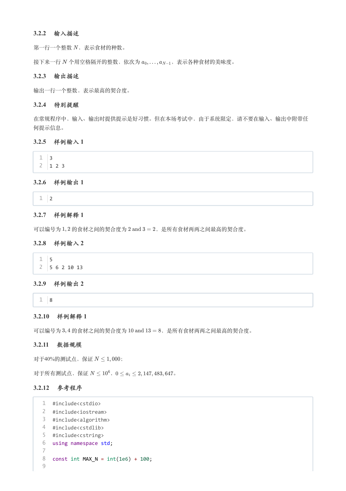

### 提取文本

```
3.2.2 输入描述

第一行一个整数 ，表示食材的种数。


接下来一行 个用空格隔开的整数，依次为      ，表示各种食材的美味度。

3.2.3 输出描述

输出一行一个整数，表示最高的契合度。

3.2.4 特别提醒

在常规程序中，输入、输出时提供提示是好习惯。但在本场考试中，由于系统限定，请不要在输入、输出中附带任

何提示信息。

3.2.5 样例输入 1

  1  3
  2  1 2 3

3.2.6 样例输出 1

  1  2

3.2.7 样例解释 1

可以编号为  的食材之间的契合度为     ，是所有食材两两之间最高的契合度。

3.2.8 样例输入 2

  1  5
  2  5 6 2 10 13

3.2.9 样例输出 2

  1  8

3.2.10 样例解释 1

可以编号为  的食材之间的契合度为      ，是所有食材两两之间最高的契合度。

3.2.11 数据规模

对于40%的测试点，保证     ；


对于所有测试点，保证    ，          。

3.2.12 参考程序

   1  #include<cstdio>
   2  #include<iostream>
   3  #include<algorithm>
   4  #include<cstdlib>
   5  #include<cstring>
   6  using namespace std;
   7
   8  const int MAX_N = int(1e6) + 100;
   9
```

## 第 12 页

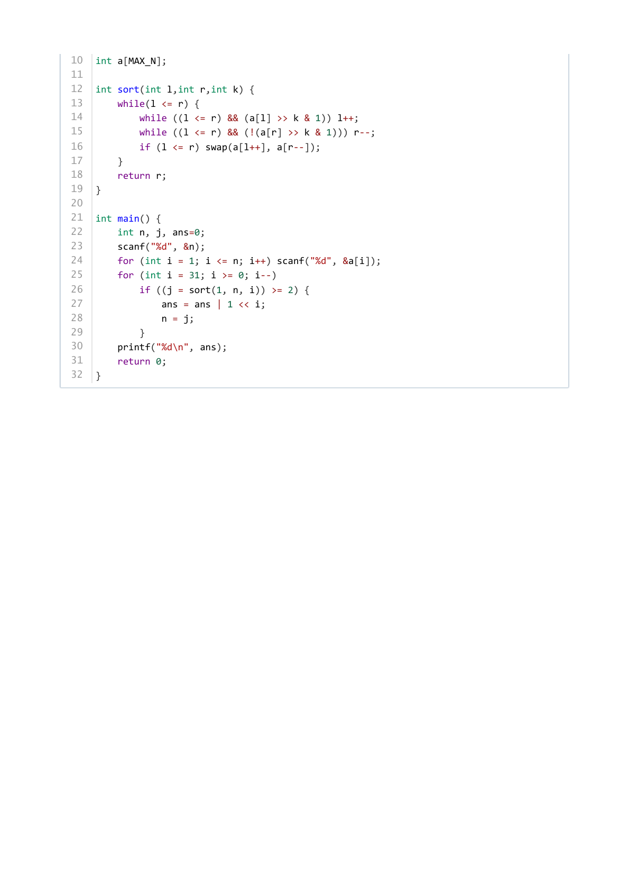

### 提取文本

```
10  int a[MAX_N];
11
12  int sort(int l,int r,int k) {
13      while(l <= r) {
14          while ((l <= r) && (a[l] >> k & 1)) l++;
15          while ((l <= r) && (!(a[r] >> k & 1))) r--;
16          if (l <= r) swap(a[l++], a[r--]);
17      }
18      return r;
19  }
20
21  int main() {
22      int n, j, ans=0;
23      scanf("%d", &n);
24      for (int i = 1; i <= n; i++) scanf("%d", &a[i]);
25      for (int i = 31; i >= 0; i--)
26          if ((j = sort(1, n, i)) >= 2) {
27              ans = ans | 1 << i;
28              n = j;
29          }
30      printf("%d\n", ans);
31      return 0;
32  }
```
