# 2023年12月-C++7级

- 原始 PDF：[`pdfs/2023年12月-C++7级.pdf`](../pdfs/2023年12月-C++7级.pdf)
- 页数：13
- 转换脚本：[`scripts/convert_pdfs_to_markdown.py`](../scripts/convert_pdfs_to_markdown.py)

> 为尽量避免信息丢失，每页均附带页面图片；文本提取结果保留原有顺序与换行特征，个别公式、图形、特殊排版请以页面图片为准。

## 第 1 页

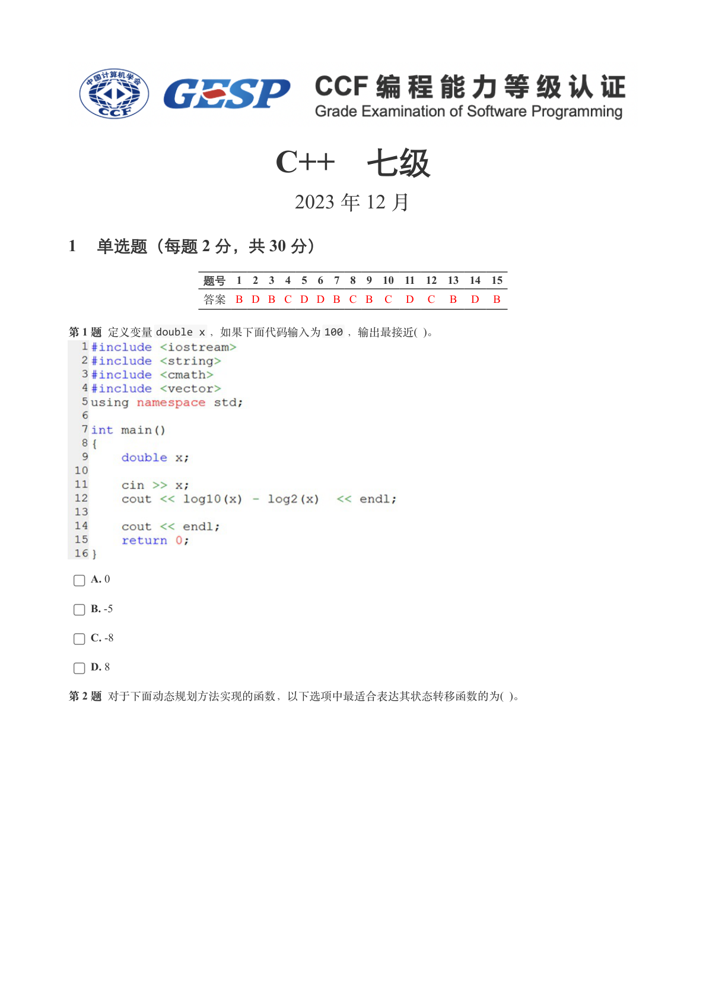

### 提取文本

```
C++　七级

                      2023 年 12 月

1 单选题（每题 2 分，共 30 分）


            题号  1  2  3  4  5  6  7  8  9  10  11  12  13  14  15
            答案 B D B C D D B C B  C  D  C  B  D  B


第 1 题 定义变量double x ，如果下面代码输入为100 ，输出最接近( )。


    A. 0

    B. -5

    C. -8

    D. 8

第 2 题 对于下面动态规划方法实现的函数，以下选项中最适合表达其状态转移函数的为( )。
```

## 第 2 页

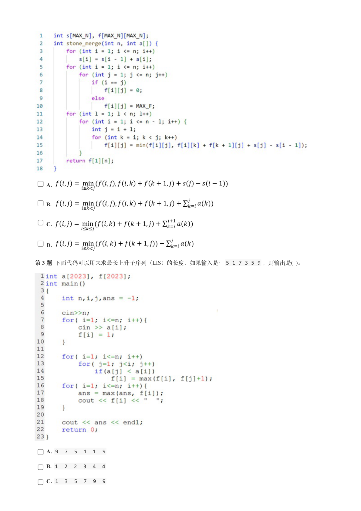

### 提取文本

```
A.


    B.


    C.


    D.


第 3 题 下面代码可以用来求最长上升子序列（LIS）的长度，如果输入是：5 1 7 3 5 9 ，则输出是( )。


    A. 9  7  5  1  1  9

    B. 1  2  2  3  4  4

    C. 1  3  5  7  9  9
```

## 第 3 页

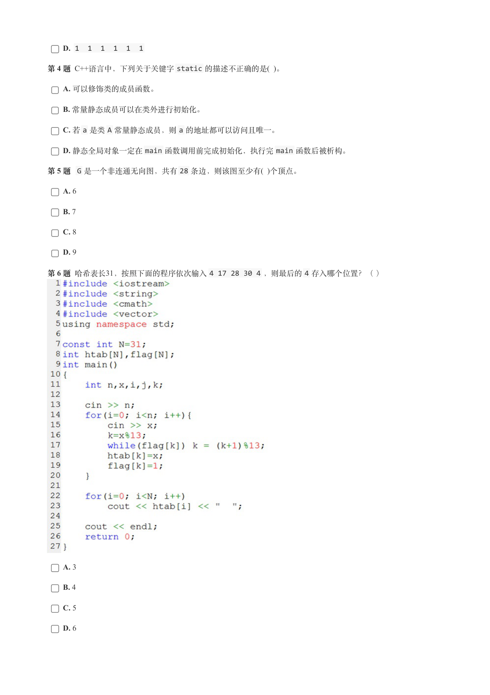

### 提取文本

```
D. 1  1  1  1  1  1

第 4 题 C++语言中，下列关于关键字static 的描述不正确的是( )。

    A. 可以修饰类的成员函数。

    B. 常量静态成员可以在类外进行初始化。

    C. 若a 是类A 常量静态成员，则a 的地址都可以访问且唯一。

    D. 静态全局对象一定在main 函数调用前完成初始化，执行完main 函数后被析构。

第 5 题 G 是一个非连通无向图，共有28 条边，则该图至少有( )个顶点。

    A. 6

    B. 7

    C. 8

    D. 9

第 6 题 哈希表长31，按照下面的程序依次输入4 17 28 30 4 ，则最后的4 存入哪个位置？（ ）


    A. 3

    B. 4

    C. 5

    D. 6
```

## 第 4 页

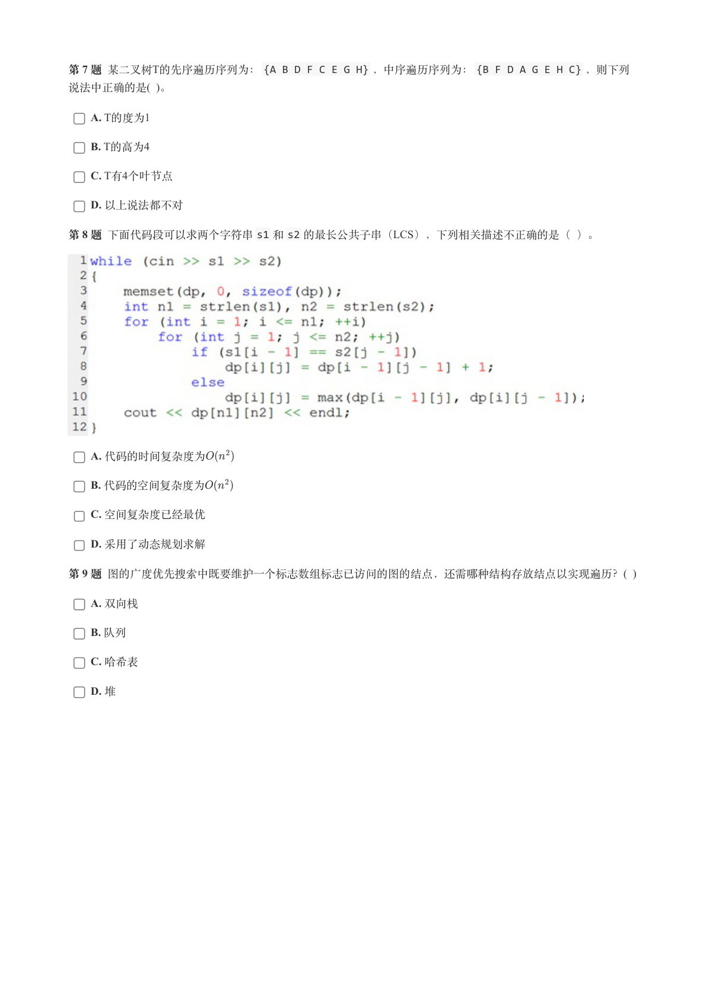

### 提取文本

```
第 7 题 某二叉树T的先序遍历序列为：{A B D F C E G H} ，中序遍历序列为：{B F D A G E H C} ，则下列
说法中正确的是( )。

    A. T的度为1

    B. T的高为4

    C. T有4个叶节点

    D. 以上说法都不对

第 8 题 下面代码段可以求两个字符串s1 和s2 的最长公共子串（LCS），下列相关描述不正确的是（ ）。


    A. 代码的时间复杂度为

    B. 代码的空间复杂度为

    C. 空间复杂度已经最优

    D. 采用了动态规划求解

第 9 题 图的广度优先搜索中既要维护一个标志数组标志已访问的图的结点，还需哪种结构存放结点以实现遍历？(  )

    A. 双向栈

    B. 队列

    C. 哈希表

    D. 堆
```

## 第 5 页

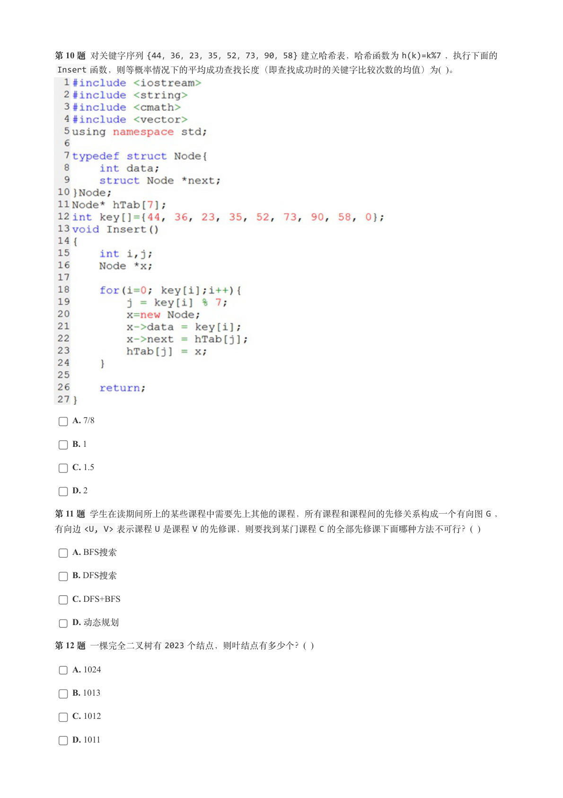

### 提取文本

```
第 10 题 对关键字序列{44，36，23，35，52，73，90，58} 建立哈希表，哈希函数为h(k)=k%7 ，执行下面的
 Insert 函数，则等概率情况下的平均成功查找长度（即查找成功时的关键字比较次数的均值）为( )。


    A. 7/8

    B. 1

    C. 1.5

    D. 2

第 11 题 学生在读期间所上的某些课程中需要先上其他的课程，所有课程和课程间的先修关系构成一个有向图G ，
有向边<U, V> 表示课程U 是课程V 的先修课，则要找到某门课程C 的全部先修课下面哪种方法不可行？(  )

    A. BFS搜索

    B. DFS搜索

    C. DFS+BFS

    D. 动态规划

第 12 题 一棵完全二叉树有2023 个结点，则叶结点有多少个？(  )

    A. 1024

    B. 1013

    C. 1012

    D. 1011
```

## 第 6 页

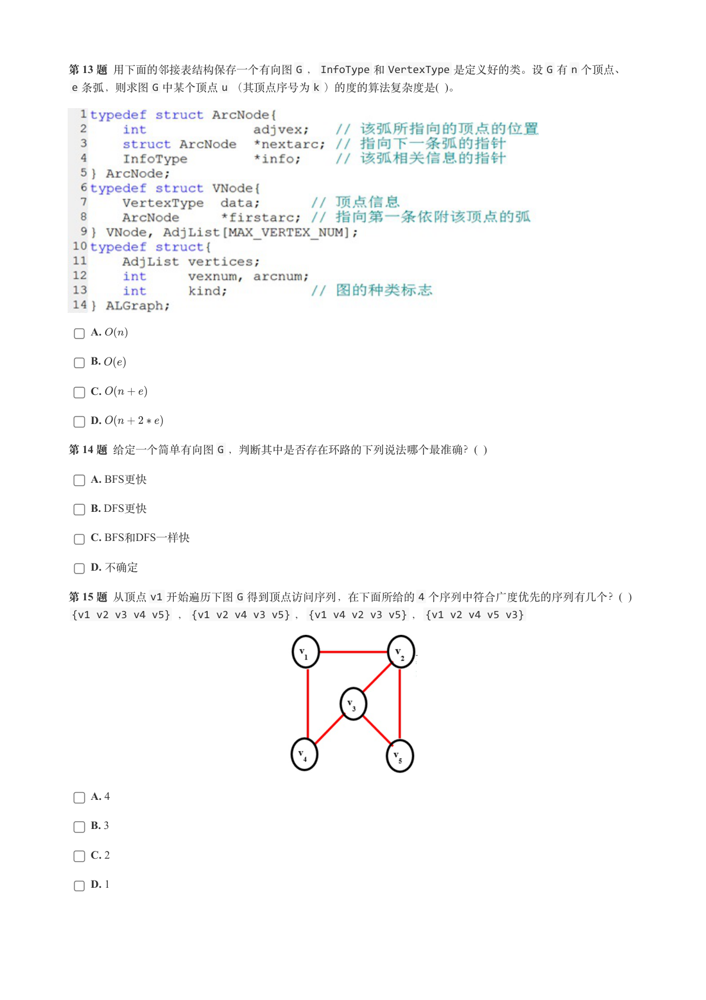

### 提取文本

```
第 13 题 用下面的邻接表结构保存一个有向图G ，InfoType 和VertexType 是定义好的类。设G 有n 个顶点、
 e 条弧，则求图G 中某个顶点u （其顶点序号为k ）的度的算法复杂度是( )。


    A.

    B.

    C.

    D.

第 14 题 给定一个简单有向图G ，判断其中是否存在环路的下列说法哪个最准确？(  )

    A. BFS更快

    B. DFS更快

    C. BFS和DFS一样快

    D. 不确定

第 15 题 从顶点v1 开始遍历下图G 得到顶点访问序列，在下面所给的4 个序列中符合广度优先的序列有几个？(  )
 {v1 v2 v3 v4 v5} ，{v1 v2 v4 v3 v5} ，{v1 v4 v2 v3 v5} ，{v1 v2 v4 v5 v3}


    A. 4

    B. 3

    C. 2

    D. 1
```

## 第 7 页

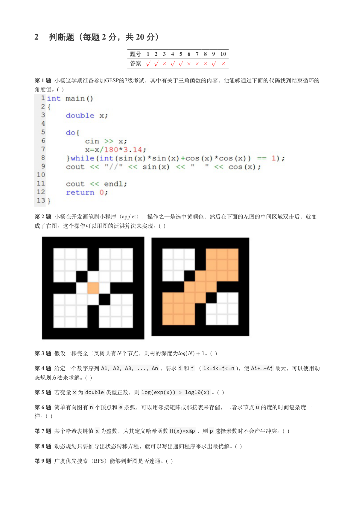

### 提取文本

```
2 判断题（每题 2 分，共 20 分）

                 题号  1  2  3  4  5  6  7  8  9  10

                 答案


第 1 题 小杨这学期准备参加GESP的7级考试，其中有关于三角函数的内容，他能够通过下面的代码找到结束循环的
角度值。(  )


第 2 题 小杨在开发画笔刷小程序（applet），操作之一是选中黄颜色，然后在下面的左图的中间区域双击后，就变
成了右图。这个操作可以用图的泛洪算法来实现。(  )


第 3 题 假设一棵完全二叉树共有 个节点，则树的深度为       。(  )

第 4 题 给定一个数字序列A1，A2，A3，...，An ，要求i 和j （1<=i<=j<=n )，使Ai+…+Aj 最大，可以使用动
态规划方法来求解。(  )

第 5 题 若变量x 为double 类型正数，则log(exp(x)) > log10(x) 。(  )

第 6 题 简单有向图有n 个顶点和e 条弧，可以用邻接矩阵或邻接表来存储，二者求节点u 的度的时间复杂度一
样。(  )

第 7 题 某个哈希表键值x 为整数，为其定义哈希函数H(x)=x%p ，则p 选择素数时不会产生冲突。(  )

第 8 题 动态规划只要推导出状态转移方程，就可以写出递归程序来求出最优解。(  )

第 9 题 广度优先搜索（BFS）能够判断图是否连通。(  )
```

## 第 8 页

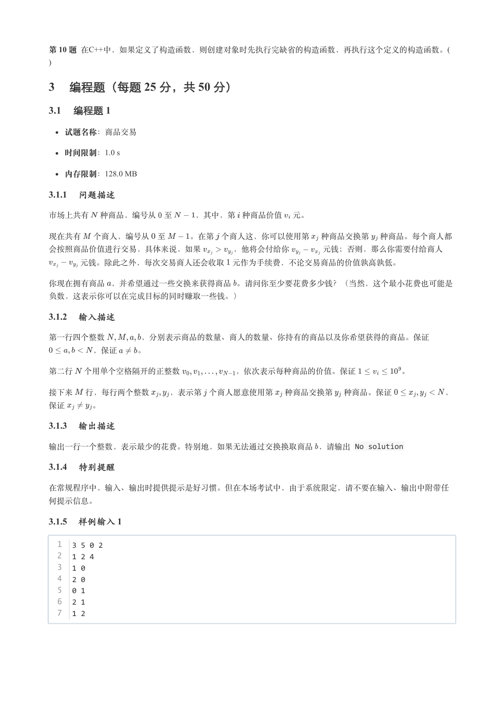

### 提取文本

```
第 10 题 在C++中，如果定义了构造函数，则创建对象时先执行完缺省的构造函数，再执行这个定义的构造函数。(
)

3 编程题（每题 25 分，共 50 分）

3.1 编程题 1


  试题名称：商品交易

   时间限制：1.0 s

   内存限制：128.0 MB

3.1.1 问题描述

市场上共有 种商品，编号从 至   ，其中，第 种商品价值 元。


现在共有  个商人，编号从 至   。在第 个商人这，你可以使用第 种商品交换第 种商品。每个商人都

会按照商品价值进行交易，具体来说，如果    ，他将会付给你    元钱；否则，那么你需要付给商人

    元钱。除此之外，每次交易商人还会收取 元作为手续费，不论交易商品的价值孰高孰低。


你现在拥有商品 ，并希望通过一些交换来获得商品 。请问你至少要花费多少钱？（当然，这个最小花费也可能是

负数，这表示你可以在完成目标的同时赚取一些钱。）

3.1.2 输入描述

第一行四个整数     ，分别表示商品的数量、商人的数量、你持有的商品以及你希望获得的商品。保证

      ，保证   。


第二行 个用单个空格隔开的正整数       ，依次表示每种商品的价值。保证      。


接下来  行，每行两个整数   ，表示第 个商人愿意使用第 种商品交换第 种商品。保证       ，

保证   。

3.1.3 输出描述

输出一行一个整数，表示最少的花费。特别地，如果无法通过交换换取商品 ，请输出 No solution

3.1.4 特别提醒

在常规程序中，输入、输出时提供提示是好习惯。但在本场考试中，由于系统限定，请不要在输入、输出中附带任

何提示信息。

3.1.5 样例输入 1

  1  3 5 0 2
  2  1 2 4
  3  1 0
  4  2 0
  5  0 1
  6  2 1
  7  1 2
```

## 第 9 页

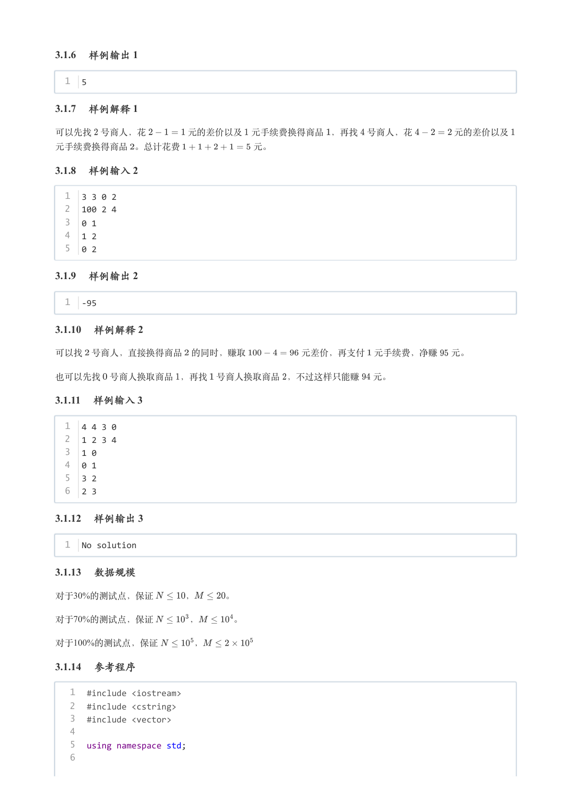

### 提取文本

```
3.1.6 样例输出 1

  1  5

3.1.7 样例解释 1

可以先找 号商人，花     元的差价以及 元手续费换得商品 ，再找 号商人，花     元的差价以及

元手续费换得商品 。总计花费        元。

3.1.8 样例输入 2

  1  3 3 0 2
  2  100 2 4
  3  0 1
  4  1 2
  5  0 2

3.1.9 样例输出 2

  1  -95

3.1.10 样例解释 2

可以找 号商人，直接换得商品 的同时，赚取      元差价，再支付 元手续费，净赚  元。


也可以先找 号商人换取商品 ，再找 号商人换取商品 ，不过这样只能赚  元。

3.1.11 样例输入 3

  1  4 4 3 0
  2  1 2 3 4
  3  1 0
  4  0 1
  5  3 2
  6  2 3

3.1.12 样例输出 3

  1  No solution

3.1.13 数据规模

对于30%的测试点，保证    ，   。

对于70%的测试点，保证    ，    。

对于100%的测试点，保证    ，

3.1.14 参考程序

   1  #include <iostream>
   2  #include <cstring>
   3  #include <vector>
   4
   5  using namespace std;
   6
```

## 第 10 页

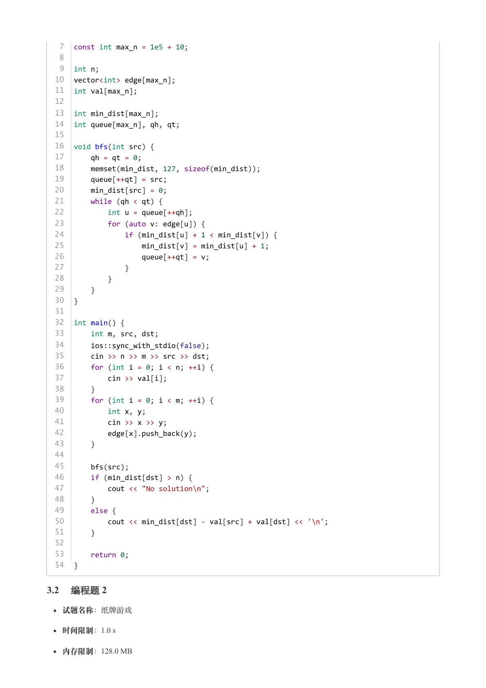

### 提取文本

```
7  const int max_n = 1e5 + 10;
   8
   9  int n;
  10  vector<int> edge[max_n];
  11  int val[max_n];
  12
  13  int min_dist[max_n];
  14  int queue[max_n], qh, qt;
  15
  16  void bfs(int src) {
  17      qh = qt = 0;
  18      memset(min_dist, 127, sizeof(min_dist));
  19      queue[++qt] = src;
  20      min_dist[src] = 0;
  21      while (qh < qt) {
  22          int u = queue[++qh];
  23          for (auto v: edge[u]) {
  24              if (min_dist[u] + 1 < min_dist[v]) {
  25                  min_dist[v] = min_dist[u] + 1;
  26                  queue[++qt] = v;
  27              }
  28          }
  29      }
  30  }
  31
  32  int main() {
  33      int m, src, dst;
  34      ios::sync_with_stdio(false);
  35      cin >> n >> m >> src >> dst;
  36      for (int i = 0; i < n; ++i) {
  37          cin >> val[i];
  38      }
  39      for (int i = 0; i < m; ++i) {
  40          int x, y;
  41          cin >> x >> y;
  42          edge[x].push_back(y);
  43      }
  44
  45      bfs(src);
  46      if (min_dist[dst] > n) {
  47          cout << "No solution\n";
  48      }
  49      else {
  50          cout << min_dist[dst] - val[src] + val[dst] << '\n';
  51      }
  52
  53      return 0;
  54  }

3.2 编程题 2

  试题名称：纸牌游戏

   时间限制：1.0 s

   内存限制：128.0 MB
```

## 第 11 页

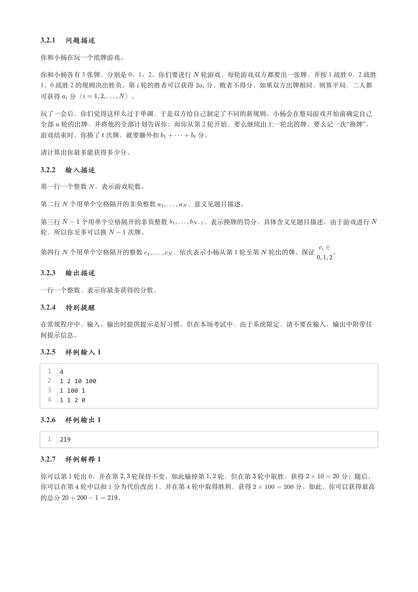

### 提取文本

```
3.2.1 问题描述

你和小杨在玩一个纸牌游戏。

你和小杨各有 3 张牌，分别是 0、1、2。你们要进行 轮游戏，每轮游戏双方都要出一张牌，并按 1 战胜 0，2 战胜
1，0 战胜 2 的规则决出胜负。第 轮的胜者可以获得  分，败者不得分，如果双方出牌相同，则算平局，二人都

可获得 分（      ）。


玩了一会后，你们觉得这样太过于单调，于是双方给自己制定了不同的新规则。小杨会在整局游戏开始前确定自己
全部 轮的出牌，并将他的全部计划告诉你；而你从第 2 轮开始，要么继续出上一轮出的牌，要么记一次“换牌”。

游戏结束时，你换了 次牌，就要额外扣      分。


请计算出你最多能获得多少分。

3.2.2 输入描述

第一行一个整数 ，表示游戏轮数。


第二行 个用单个空格隔开的非负整数     ，意义见题目描述。


第三行   个用单个空格隔开的非负整数     ，表示换牌的罚分，具体含义见题目描述。由于游戏进行

轮，所以你至多可以换   次牌。


第四行 个用单个空格隔开的整数     ，依次表示小杨从第 轮至第 轮出的牌。保证   。

3.2.3 输出描述

一行一个整数，表示你最多获得的分数。

3.2.4 特别提醒

在常规程序中，输入、输出时提供提示是好习惯。但在本场考试中，由于系统限定，请不要在输入、输出中附带任

何提示信息。

3.2.5 样例输入 1

  1  4
  2  1 2 10 100
  3  1 100 1
  4  1 1 2 0

3.2.6 样例输出 1

  1  219

3.2.7 样例解释 1

你可以第 轮出 0，并在第  轮保持不变，如此输掉第  轮，但在第 轮中取胜，获得      分；随后，
你可以在第 轮中以扣 分为代价改出 1，并在第 轮中取得胜利，获得       分。如此，你可以获得最高

的总分         。
```

## 第 12 页

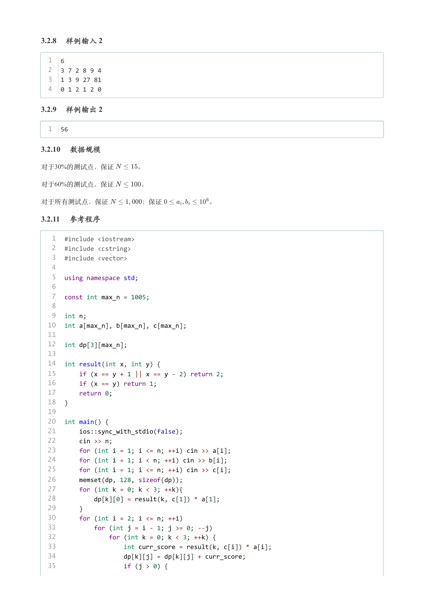

### 提取文本

```
3.2.8 样例输入 2

  1  6
  2  3 7 2 8 9 4
  3  1 3 9 27 81
  4  0 1 2 1 2 0

3.2.9 样例输出 2

  1  56

3.2.10 数据规模

对于30%的测试点，保证    。

对于60%的测试点，保证    。


对于所有测试点，保证     ；保证       。

3.2.11 参考程序

   1  #include <iostream>
   2  #include <cstring>
   3  #include <vector>
   4
   5  using namespace std;
   6
   7  const int max_n = 1005;
   8
   9  int n;
  10  int a[max_n], b[max_n], c[max_n];
  11
  12  int dp[3][max_n];
  13
  14  int result(int x, int y) {
  15      if (x == y + 1 || x == y - 2) return 2;
  16      if (x == y) return 1;
  17      return 0;
  18  }
  19
  20  int main() {
  21      ios::sync_with_stdio(false);
  22      cin >> n;
  23      for (int i = 1; i <= n; ++i) cin >> a[i];
  24      for (int i = 1; i < n; ++i) cin >> b[i];
  25      for (int i = 1; i <= n; ++i) cin >> c[i];
  26      memset(dp, 128, sizeof(dp));
  27      for (int k = 0; k < 3; ++k){
  28          dp[k][0] = result(k, c[1]) * a[1];
  29      }
  30      for (int i = 2; i <= n; ++i)
  31          for (int j = i - 1; j >= 0; --j)
  32              for (int k = 0; k < 3; ++k) {
  33                  int curr_score = result(k, c[i]) * a[i];
  34                  dp[k][j] = dp[k][j] + curr_score;
  35                  if (j > 0) {
```

## 第 13 页

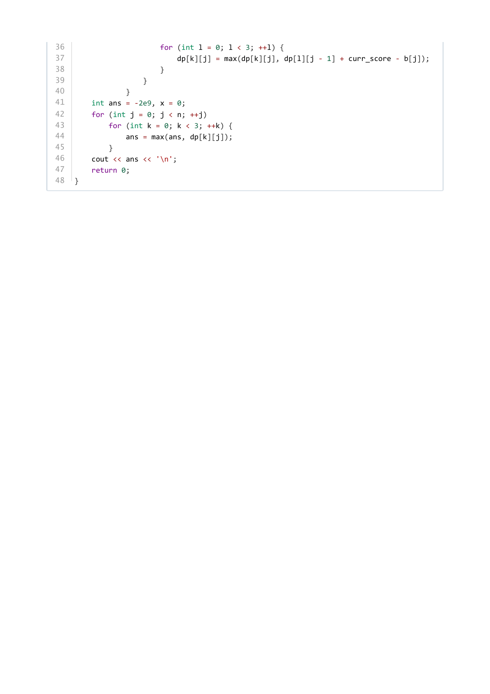

### 提取文本

```
36                      for (int l = 0; l < 3; ++l) {
37                          dp[k][j] = max(dp[k][j], dp[l][j - 1] + curr_score - b[j]);
38                      }
39                  }
40              }
41      int ans = -2e9, x = 0;
42      for (int j = 0; j < n; ++j)
43          for (int k = 0; k < 3; ++k) {
44              ans = max(ans, dp[k][j]);
45          }
46      cout << ans << '\n';
47      return 0;
48  }
```
