# 2023年12月-C++8级

- 原始 PDF：[`pdfs/2023年12月-C++8级.pdf`](../pdfs/2023年12月-C++8级.pdf)
- 页数：11
- 转换脚本：[`scripts/convert_pdfs_to_markdown.py`](../scripts/convert_pdfs_to_markdown.py)

> 为尽量避免信息丢失，每页均附带页面图片；文本提取结果保留原有顺序与换行特征，个别公式、图形、特殊排版请以页面图片为准。

## 第 1 页

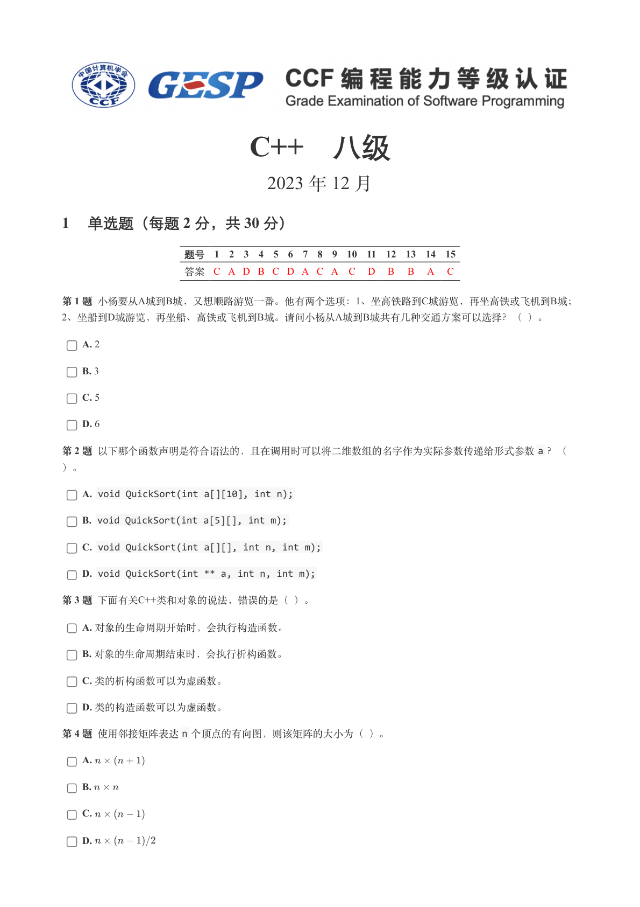

### 提取文本

```
C++　八级

                      2023 年 12 月

1 单选题（每题 2 分，共 30 分）


            题号  1  2  3  4  5  6  7  8  9  10  11  12  13  14  15
            答案 C A D B C D A C A  C  D  B  B  A  C


第 1 题 小杨要从A城到B城，又想顺路游览一番。他有两个选项：1、坐高铁路到C城游览，再坐高铁或飞机到B城；
2、坐船到D城游览，再坐船、高铁或飞机到B城。请问小杨从A城到B城共有几种交通方案可以选择？（ ）。

    A. 2

    B. 3

    C. 5

    D. 6

第 2 题 以下哪个函数声明是符合语法的，且在调用时可以将二维数组的名字作为实际参数传递给形式参数a ？（

）。

    A. void QuickSort(int a[][10], int n);

    B. void QuickSort(int a[5][], int m);

    C. void QuickSort(int a[][], int n, int m);

    D. void QuickSort(int ** a, int n, int m);

第 3 题 下面有关C++类和对象的说法，错误的是（ ）。

    A. 对象的生命周期开始时，会执行构造函数。

    B. 对象的生命周期结束时，会执行析构函数。

    C. 类的析构函数可以为虚函数。

    D. 类的构造函数可以为虚函数。

第 4 题 使用邻接矩阵表达n 个顶点的有向图，则该矩阵的大小为（ ）。

    A.

    B.

    C.

    D.
```

## 第 2 页

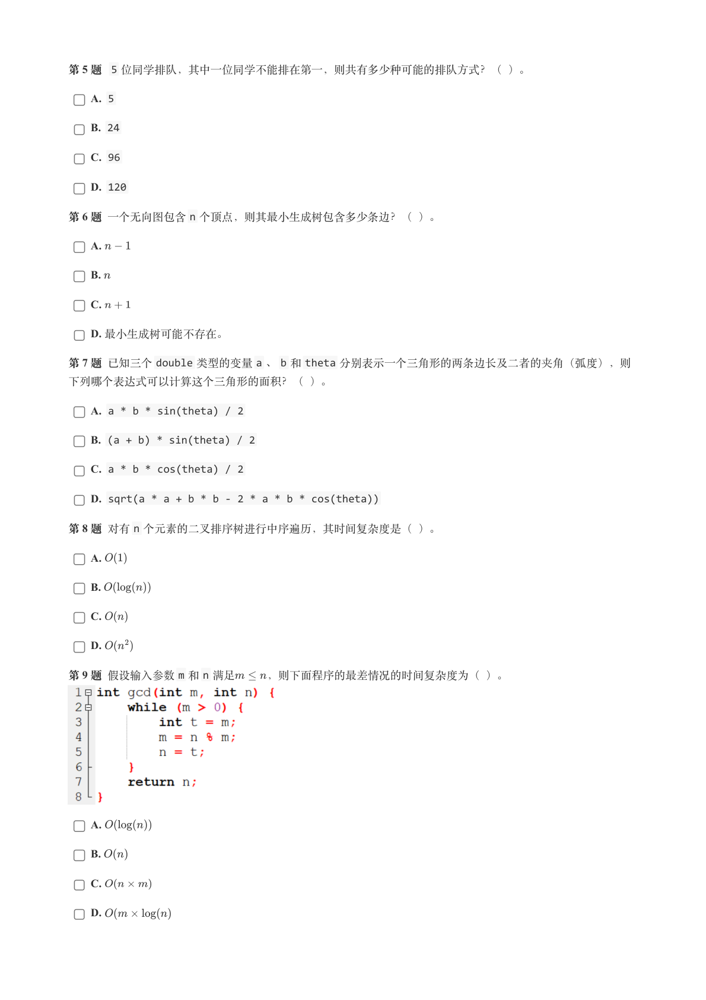

### 提取文本

```
第 5 题 5 位同学排队，其中一位同学不能排在第一，则共有多少种可能的排队方式？（ ）。

    A. 5

    B. 24

    C. 96

    D. 120

第 6 题 一个无向图包含n 个顶点，则其最小生成树包含多少条边？（ ）。

    A.

    B.

    C.

    D. 最小生成树可能不存在。

第 7 题 已知三个double 类型的变量a 、b 和theta 分别表示一个三角形的两条边长及二者的夹角（弧度），则

下列哪个表达式可以计算这个三角形的面积？（ ）。

    A. a * b * sin(theta) / 2

    B. (a + b) * sin(theta) / 2

    C. a * b * cos(theta) / 2

    D. sqrt(a * a + b * b - 2 * a * b * cos(theta))

第 8 题 对有n 个元素的二叉排序树进行中序遍历，其时间复杂度是（ ）。

    A.

    B.

    C.

    D.

第 9 题 假设输入参数m 和n 满足   ，则下面程序的最差情况的时间复杂度为（ ）。


    A.

    B.

    C.

    D.
```

## 第 3 页

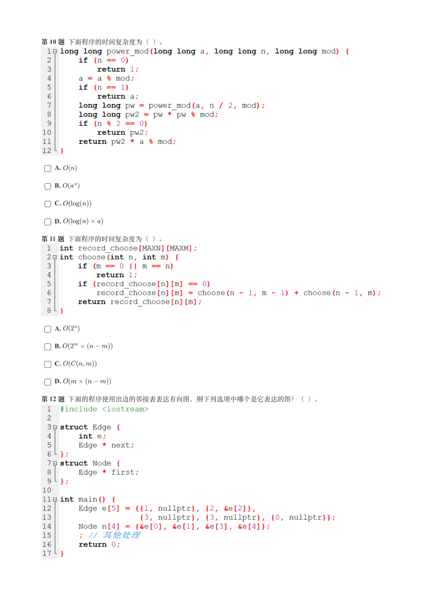

### 提取文本

```
第 10 题 下面程序的时间复杂度为（ ）。


    A.

    B.

    C.

    D.

第 11 题 下面程序的时间复杂度为（ ）。


    A.

    B.

    C.

    D.

第 12 题 下面的程序使用出边的邻接表表达有向图，则下列选项中哪个是它表达的图？（ ）。
```

## 第 4 页

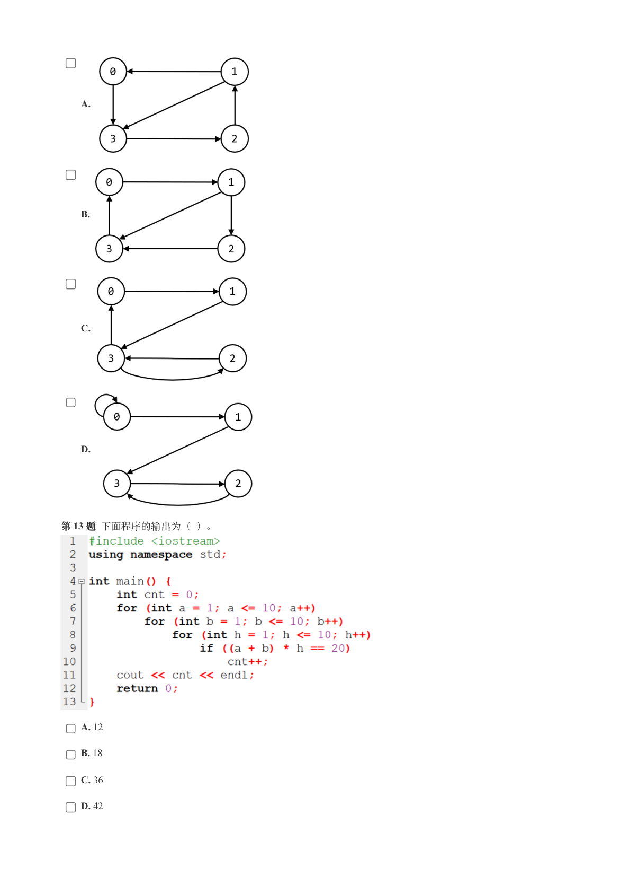

### 提取文本

```
A.


    B.


    C.


    D.


第 13 题 下面程序的输出为（ ）。


    A. 12

    B. 18

    C. 36

    D. 42
```

## 第 5 页

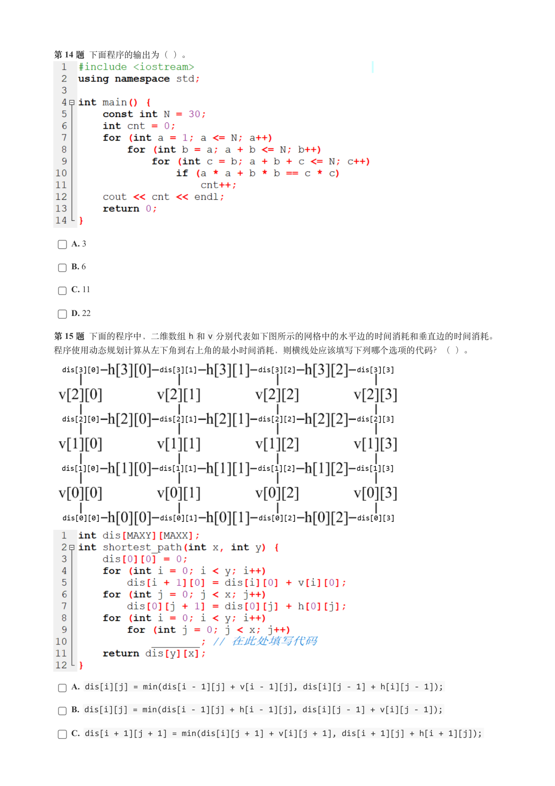

### 提取文本

```
第 14 题 下面程序的输出为（ ）。


    A. 3

    B. 6

    C. 11

    D. 22

第 15 题 下面的程序中，二维数组h 和v 分别代表如下图所示的网格中的水平边的时间消耗和垂直边的时间消耗。

程序使用动态规划计算从左下角到右上角的最小时间消耗，则横线处应该填写下列哪个选项的代码？（ ）。


    A. dis[i][j] = min(dis[i - 1][j] + v[i - 1][j], dis[i][j - 1] + h[i][j - 1]);

    B. dis[i][j] = min(dis[i - 1][j] + h[i - 1][j], dis[i][j - 1] + v[i][j - 1]);

    C. dis[i + 1][j + 1] = min(dis[i][j + 1] + v[i][j + 1], dis[i + 1][j] + h[i + 1][j]);
```

## 第 6 页

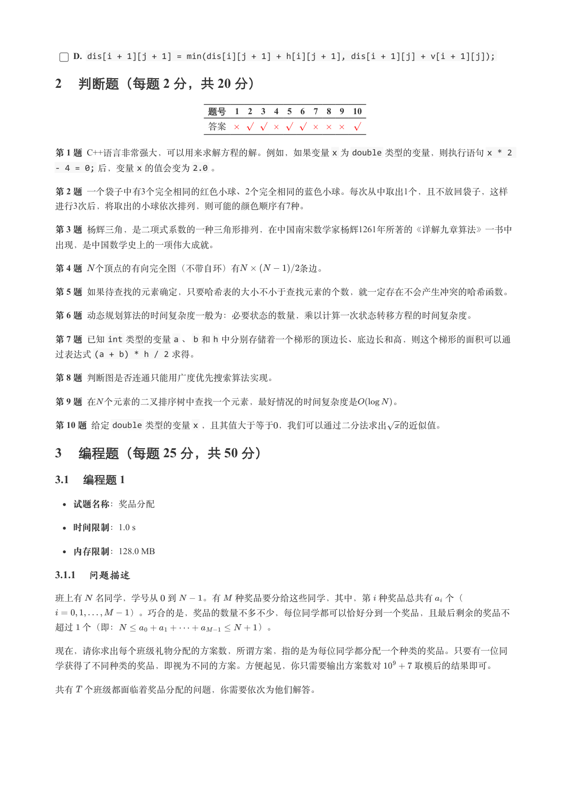

### 提取文本

```
D. dis[i + 1][j + 1] = min(dis[i][j + 1] + h[i][j + 1], dis[i + 1][j] + v[i + 1][j]);

2 判断题（每题 2 分，共 20 分）


                 题号  1  2  3  4  5  6  7  8  9  10

                 答案


第 1 题 C++语言非常强大，可以用来求解方程的解。例如，如果变量x 为double 类型的变量，则执行语句x * 2
- 4 = 0; 后，变量x 的值会变为2.0 。

第 2 题 一个袋子中有3个完全相同的红色小球、2个完全相同的蓝色小球。每次从中取出1个，且不放回袋子，这样
进行3次后，将取出的小球依次排列，则可能的颜色顺序有7种。

第 3 题 杨辉三角，是二项式系数的一种三角形排列，在中国南宋数学家杨辉1261年所著的《详解九章算法》一书中

出现，是中国数学史上的一项伟大成就。

第 4 题 个顶点的有向完全图（不带自环）有       条边。

第 5 题 如果待查找的元素确定，只要哈希表的大小不小于查找元素的个数，就一定存在不会产生冲突的哈希函数。

第 6 题 动态规划算法的时间复杂度一般为：必要状态的数量，乘以计算一次状态转移方程的时间复杂度。

第 7 题 已知int 类型的变量a 、b 和h 中分别存储着一个梯形的顶边长、底边长和高，则这个梯形的面积可以通
过表达式(a + b) * h / 2 求得。

第 8 题 判断图是否连通只能用广度优先搜索算法实现。

第 9 题 在 个元素的二叉排序树中查找一个元素，最好情况的时间复杂度是    。

第 10 题 给定double 类型的变量x ，且其值大于等于，我们可以通过二分法求出 的近似值。

3 编程题（每题 25 分，共 50 分）

3.1 编程题 1


  试题名称：奖品分配

   时间限制：1.0 s

   内存限制：128.0 MB

3.1.1 问题描述

班上有 名同学，学号从 到   。有  种奖品要分给这些同学，其中，第 种奖品总共有 个（

        ）。巧合的是，奖品的数量不多不少，每位同学都可以恰好分到一个奖品，且最后剩余的奖品不

超过 个（即：               ）。


现在，请你求出每个班级礼物分配的方案数，所谓方案，指的是为每位同学都分配一个种类的奖品。只要有一位同

学获得了不同种类的奖品，即视为不同的方案。方便起见，你只需要输出方案数对    取模后的结果即可。


共有 个班级都面临着奖品分配的问题，你需要依次为他们解答。
```

## 第 7 页

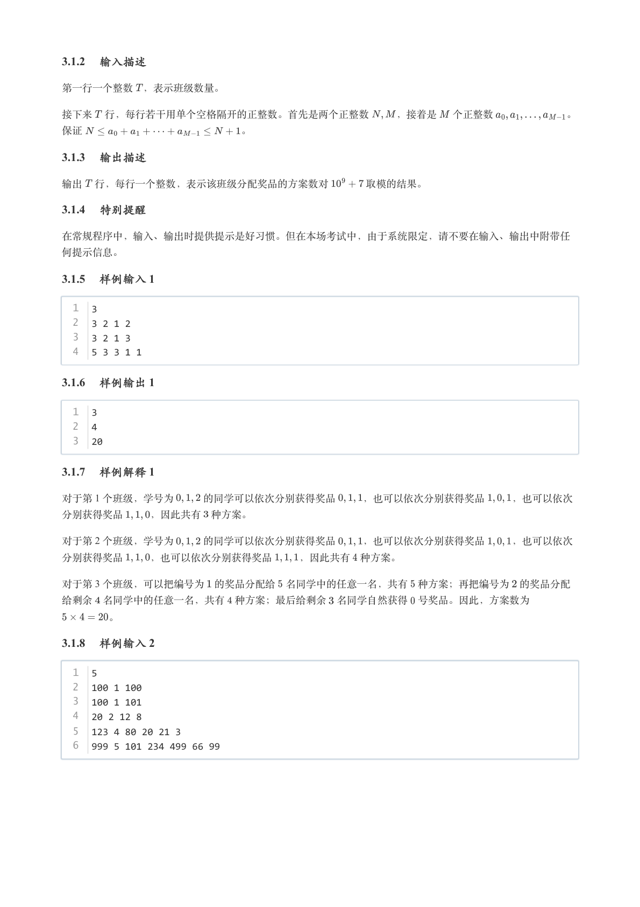

### 提取文本

```
3.1.2 输入描述

第一行一个整数 ，表示班级数量。


接下来 行，每行若干用单个空格隔开的正整数。首先是两个正整数   ，接着是  个正整数       。

保证                。

3.1.3 输出描述

输出 行，每行一个整数，表示该班级分配奖品的方案数对    取模的结果。

3.1.4 特别提醒

在常规程序中，输入、输出时提供提示是好习惯。但在本场考试中，由于系统限定，请不要在输入、输出中附带任

何提示信息。

3.1.5 样例输入 1

  1  3
  2  3 2 1 2
  3  3 2 1 3
  4  5 3 3 1 1

3.1.6 样例输出 1

  1  3
  2  4
  3  20

3.1.7 样例解释 1

对于第 1 个班级，学号为   的同学可以依次分别获得奖品   ，也可以依次分别获得奖品   ，也可以依次

分别获得奖品   ，因此共有 种方案。

对于第 2 个班级，学号为   的同学可以依次分别获得奖品   ，也可以依次分别获得奖品   ，也可以依次

分别获得奖品   ，也可以依次分别获得奖品   ，因此共有 种方案。

对于第 3 个班级，可以把编号为 的奖品分配给 名同学中的任意一名，共有 种方案；再把编号为 的奖品分配

给剩余 名同学中的任意一名，共有 种方案；最后给剩余 名同学自然获得 号奖品。因此，方案数为

     。

3.1.8 样例输入 2

  1  5
  2  100 1 100
  3  100 1 101
  4  20 2 12 8
  5  123 4 80 20 21 3
  6  999 5 101 234 499 66 99
```

## 第 8 页

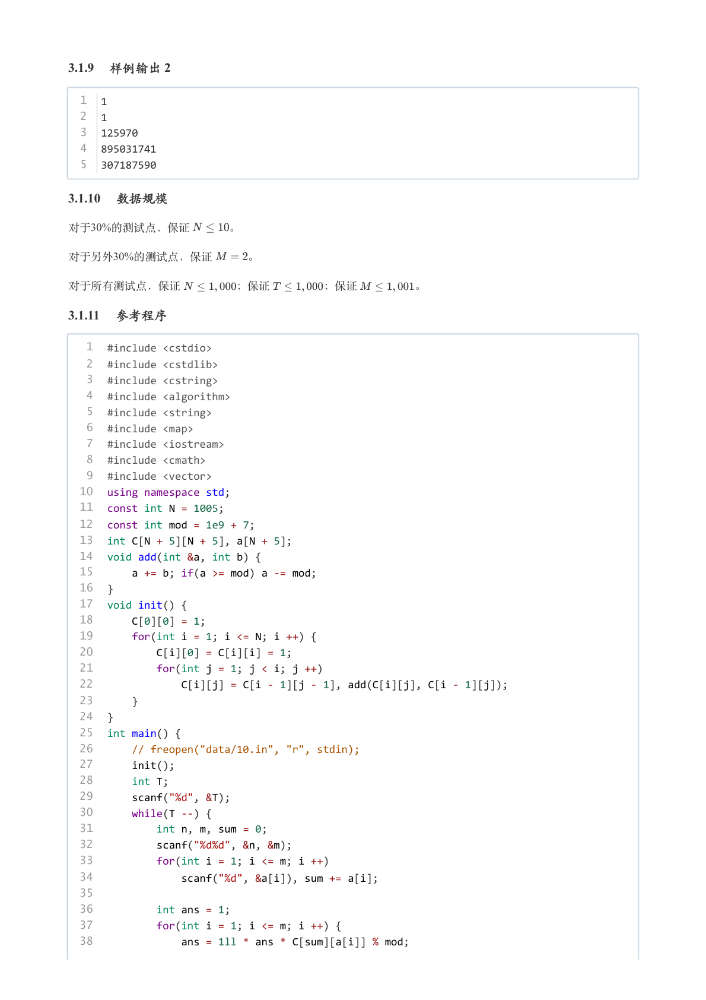

### 提取文本

```
3.1.9 样例输出 2

  1  1
  2  1
  3  125970
  4  895031741
  5  307187590

3.1.10 数据规模

对于30%的测试点，保证    。

对于另外30%的测试点，保证   。


对于所有测试点，保证     ；保证     ；保证     。

3.1.11 参考程序

   1  #include <cstdio>
   2  #include <cstdlib>
   3  #include <cstring>
   4  #include <algorithm>
   5  #include <string>
   6  #include <map>
   7  #include <iostream>
   8  #include <cmath>
   9  #include <vector>
  10  using namespace std;
  11  const int N = 1005;
  12  const int mod = 1e9 + 7;
  13  int C[N + 5][N + 5], a[N + 5];
  14  void add(int &a, int b) {
  15      a += b; if(a >= mod) a -= mod;
  16  }
  17  void init() {
  18      C[0][0] = 1;
  19      for(int i = 1; i <= N; i ++) {
  20          C[i][0] = C[i][i] = 1;
  21          for(int j = 1; j < i; j ++)
  22              C[i][j] = C[i - 1][j - 1], add(C[i][j], C[i - 1][j]);
  23      }
  24  }
  25  int main() {
  26      // freopen("data/10.in", "r", stdin);
  27      init();
  28      int T;
  29      scanf("%d", &T);
  30      while(T --) {
  31          int n, m, sum = 0;
  32          scanf("%d%d", &n, &m);
  33          for(int i = 1; i <= m; i ++)
  34              scanf("%d", &a[i]), sum += a[i];
  35
  36          int ans = 1;
  37          for(int i = 1; i <= m; i ++) {
  38              ans = 1ll * ans * C[sum][a[i]] % mod;
```

## 第 9 页

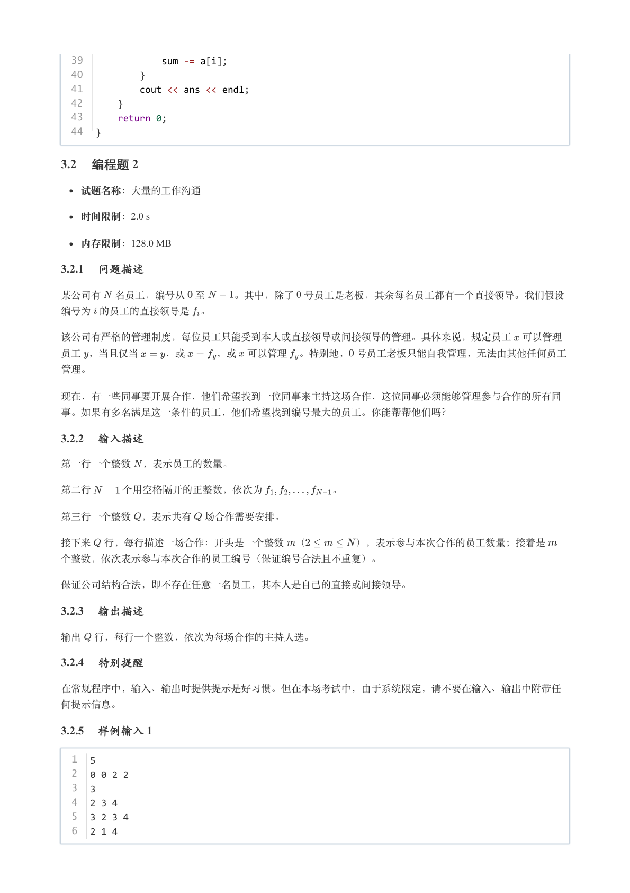

### 提取文本

```
39              sum -= a[i];
  40          }
  41          cout << ans << endl;
  42      }
  43      return 0;
  44  }

3.2 编程题 2

  试题名称：大量的工作沟通

   时间限制：2.0 s

   内存限制：128.0 MB

3.2.1 问题描述

某公司有 名员工，编号从 至   。其中，除了 号员工是老板，其余每名员工都有一个直接领导。我们假设

编号为 的员工的直接领导是 。


该公司有严格的管理制度，每位员工只能受到本人或直接领导或间接领导的管理。具体来说，规定员工 可以管理

员工 ，当且仅当   ，或   ，或 可以管理 。特别地， 号员工老板只能自我管理，无法由其他任何员工

管理。


现在，有一些同事要开展合作，他们希望找到一位同事来主持这场合作，这位同事必须能够管理参与合作的所有同

事。如果有多名满足这一条件的员工，他们希望找到编号最大的员工。你能帮帮他们吗？

3.2.2 输入描述

第一行一个整数 ，表示员工的数量。


第二行   个用空格隔开的正整数，依次为       。


第三行一个整数 ，表示共有 场合作需要安排。


接下来 行，每行描述一场合作：开头是一个整数 （     ），表示参与本次合作的员工数量；接着是

个整数，依次表示参与本次合作的员工编号（保证编号合法且不重复）。


保证公司结构合法，即不存在任意一名员工，其本人是自己的直接或间接领导。

3.2.3 输出描述

输出 行，每行一个整数，依次为每场合作的主持人选。

3.2.4 特别提醒

在常规程序中，输入、输出时提供提示是好习惯。但在本场考试中，由于系统限定，请不要在输入、输出中附带任

何提示信息。

3.2.5 样例输入 1

  1  5
  2  0 0 2 2
  3  3
  4  2 3 4
  5  3 2 3 4
  6  2 1 4
```

## 第 10 页

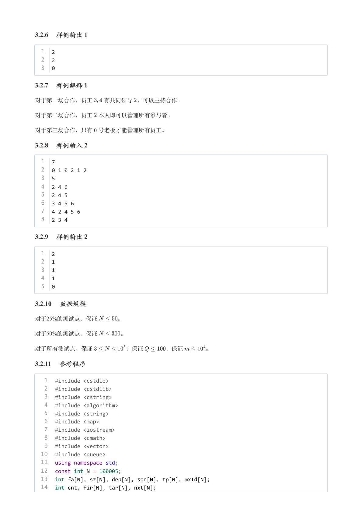

### 提取文本

```
3.2.6 样例输出 1

  1  2
  2  2
  3  0

3.2.7 样例解释 1

对于第一场合作，员工  有共同领导 ，可以主持合作。


对于第二场合作，员工 本人即可以管理所有参与者。


对于第三场合作，只有 号老板才能管理所有员工。

3.2.8 样例输入 2

  1  7
  2  0 1 0 2 1 2
  3  5
  4  2 4 6
  5  2 4 5
  6  3 4 5 6
  7  4 2 4 5 6
  8  2 3 4

3.2.9 样例输出 2

  1  2
  2  1
  3  1
  4  1
  5  0

3.2.10 数据规模

对于25%的测试点，保证    。

对于50%的测试点，保证    。


对于所有测试点，保证      ；保证    ，保证    。

3.2.11 参考程序

   1  #include <cstdio>
   2  #include <cstdlib>
   3  #include <cstring>
   4  #include <algorithm>
   5  #include <string>
   6  #include <map>
   7  #include <iostream>
   8  #include <cmath>
   9  #include <vector>
  10  #include <queue>
  11  using namespace std;
  12  const int N = 100005;
  13  int fa[N], sz[N], dep[N], son[N], tp[N], mxId[N];
  14  int cnt, fir[N], tar[N], nxt[N];
```

## 第 11 页

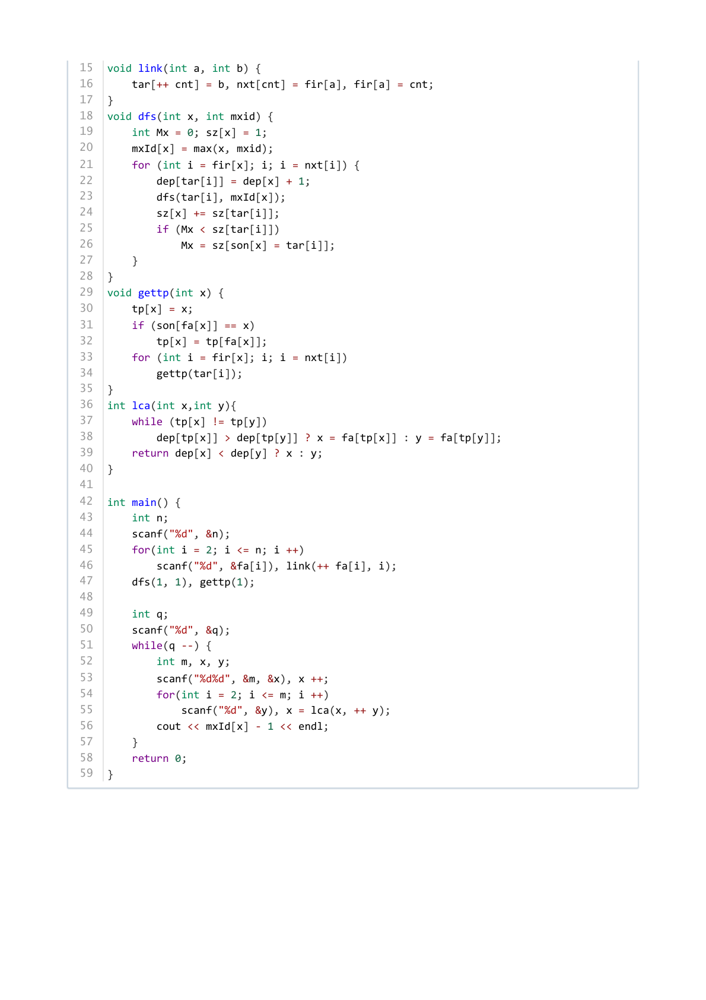

### 提取文本

```
15  void link(int a, int b) {
16      tar[++ cnt] = b, nxt[cnt] = fir[a], fir[a] = cnt;
17  }
18  void dfs(int x, int mxid) {
19      int Mx = 0; sz[x] = 1;
20      mxId[x] = max(x, mxid);
21      for (int i = fir[x]; i; i = nxt[i]) {
22          dep[tar[i]] = dep[x] + 1;
23          dfs(tar[i], mxId[x]);
24          sz[x] += sz[tar[i]];
25          if (Mx < sz[tar[i]])
26              Mx = sz[son[x] = tar[i]];
27      }
28  }
29  void gettp(int x) {
30      tp[x] = x;
31      if (son[fa[x]] == x)
32          tp[x] = tp[fa[x]];
33      for (int i = fir[x]; i; i = nxt[i])
34          gettp(tar[i]);
35  }
36  int lca(int x,int y){
37      while (tp[x] != tp[y])
38          dep[tp[x]] > dep[tp[y]] ? x = fa[tp[x]] : y = fa[tp[y]];
39      return dep[x] < dep[y] ? x : y;
40  }
41
42  int main() {
43      int n;
44      scanf("%d", &n);
45      for(int i = 2; i <= n; i ++)
46          scanf("%d", &fa[i]), link(++ fa[i], i);
47      dfs(1, 1), gettp(1);
48
49      int q;
50      scanf("%d", &q);
51      while(q --) {
52          int m, x, y;
53          scanf("%d%d", &m, &x), x ++;
54          for(int i = 2; i <= m; i ++)
55              scanf("%d", &y), x = lca(x, ++ y);
56          cout << mxId[x] - 1 << endl;
57      }
58      return 0;
59  }
```
