# 2023年3月-C++1级

- 原始 PDF：[`pdfs/2023年3月-C++1级.pdf`](../pdfs/2023年3月-C++1级.pdf)
- 页数：17
- 转换脚本：[`scripts/convert_pdfs_to_markdown.py`](../scripts/convert_pdfs_to_markdown.py)

> 为尽量避免信息丢失，每页均附带页面图片；文本提取结果保留原有顺序与换行特征，个别公式、图形、特殊排版请以页面图片为准。

## 第 1 页

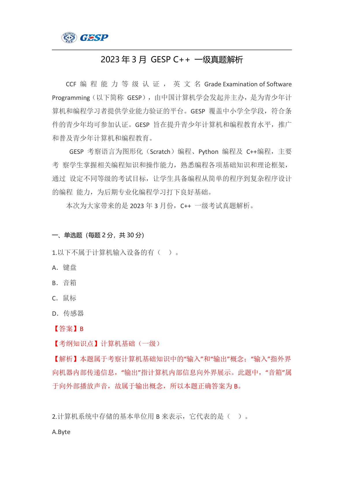

### 提取文本

```
2023 年3 月GESP C++ 一级真题解析


    CCF 编程能力等级认证，英文名Grade Examination of Software
Programming（以下简称GESP），由中国计算机学会发起并主办，是为青少年计
算机和编程学习者提供学业能力验证的平台。GESP 覆盖中小学全学段，符合条
件的青少年均可参加认证。GESP 旨在提升青少年计算机和编程教育水平，推广

和普及青少年计算机和编程教育。

     GESP 考察语言为图形化（Scratch）编程、Python 编程及C++编程，主要

考察学生掌握相关编程知识和操作能力，熟悉编程各项基础知识和理论框架，

通过设定不同等级的考试目标，让学生具备编程从简单的程序到复杂程序设计

的编程能力，为后期专业化编程学习打下良好基础。

  本次为大家带来的是2023 年3 月份，C++ 一级考试真题解析。


一、单选题（每题2 分，共30 分）

1.以下不属于计算机输入设备的有（ ）。

A．键盘

B．音箱

C．鼠标

D．传感器

【答案】B

【考纲知识点】计算机基础（一级）

【解析】本题属于考察计算机基础知识中的“输入”和“输出”概念；“输入”指外界
向机器内部传递信息，“输出”指计算机内部信息向外界展示。此题中，“音箱”属
于向外部播放声音，故属于输出概念，所以本题正确答案为B。


2.计算机系统中存储的基本单位用B 来表示，它代表的是（ ）。

A.Byte
```

## 第 2 页

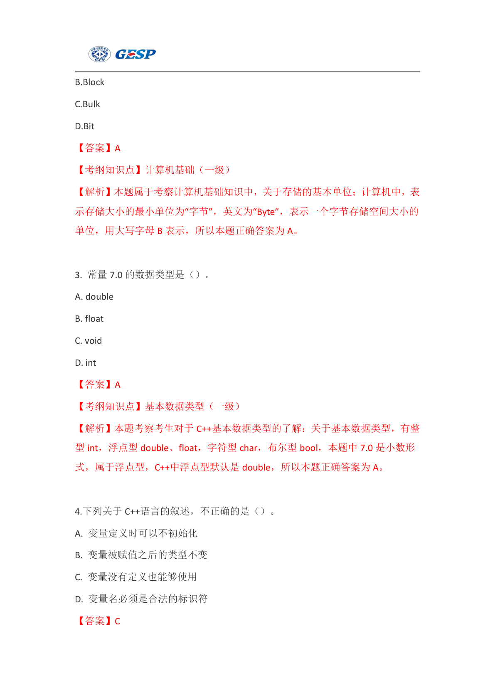

### 提取文本

```
B.Block

C.Bulk

D.Bit

【答案】A

【考纲知识点】计算机基础（一级）

【解析】本题属于考察计算机基础知识中，关于存储的基本单位；计算机中，表

示存储大小的最小单位为“字节”，英文为“Byte”，表示一个字节存储空间大小的
单位，用大写字母B 表示，所以本题正确答案为A。


3. 常量7.0 的数据类型是（）。

A. double

B. float

C. void

D. int

【答案】A

【考纲知识点】基本数据类型（一级）

【解析】本题考察考生对于C++基本数据类型的了解：关于基本数据类型，有整
型int，浮点型double、float，字符型char，布尔型bool，本题中7.0 是小数形
式，属于浮点型，C++中浮点型默认是double，所以本题正确答案为A。


4.下列关于C++语言的叙述，不正确的是（）。

A. 变量定义时可以不初始化

B. 变量被赋值之后的类型不变

C. 变量没有定义也能够使用

D. 变量名必须是合法的标识符

【答案】C
```

## 第 3 页

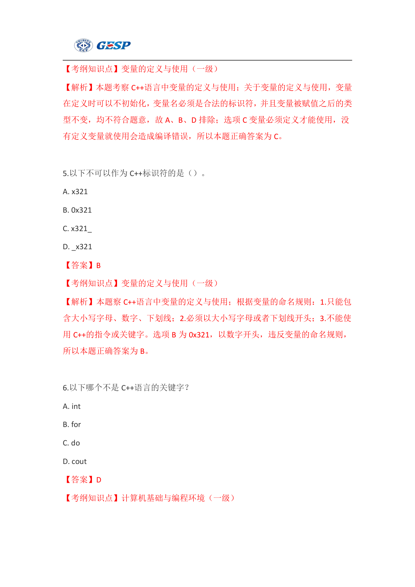

### 提取文本

```
【考纲知识点】变量的定义与使用（一级）

【解析】本题考察C++语言中变量的定义与使用；关于变量的定义与使用，变量

在定义时可以不初始化，变量名必须是合法的标识符，并且变量被赋值之后的类

型不变，均不符合题意，故A、B、D 排除；选项C 变量必须定义才能使用，没
有定义变量就使用会造成编译错误，所以本题正确答案为C。


5.以下不可以作为C++标识符的是（）。

A. x321

B. 0x321

C. x321_

D. _x321

【答案】B

【考纲知识点】变量的定义与使用（一级）

【解析】本题察C++语言中变量的定义与使用；根据变量的命名规则：1.只能包
含大小写字母、数字、下划线；2.必须以大小写字母或者下划线开头；3.不能使
用C++的指令或关键字。选项B 为0x321，以数字开头，违反变量的命名规则，
所以本题正确答案为B。


6.以下哪个不是C++语言的关键字？

A. int

B. for

C. do

D. cout

【答案】D

【考纲知识点】计算机基础与编程环境（一级）
```

## 第 4 页

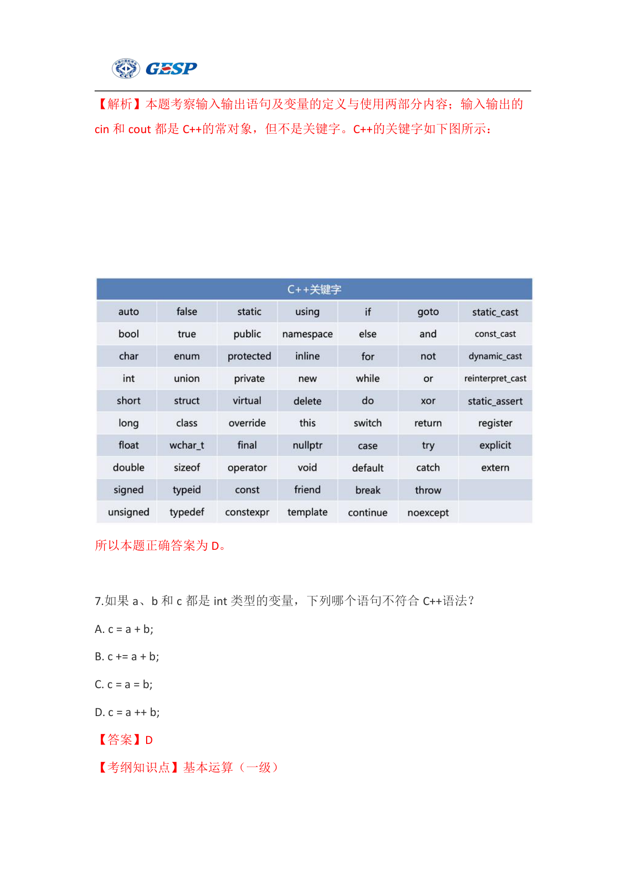

### 提取文本

```
【解析】本题考察输入输出语句及变量的定义与使用两部分内容；输入输出的

cin 和cout 都是C++的常对象，但不是关键字。C++的关键字如下图所示：


所以本题正确答案为D。


7.如果a、b 和c 都是int 类型的变量，下列哪个语句不符合C++语法？

A. c = a + b;

B. c += a + b;

C. c = a = b;

D. c = a ++ b;

【答案】D

【考纲知识点】基本运算（一级）
```

## 第 5 页

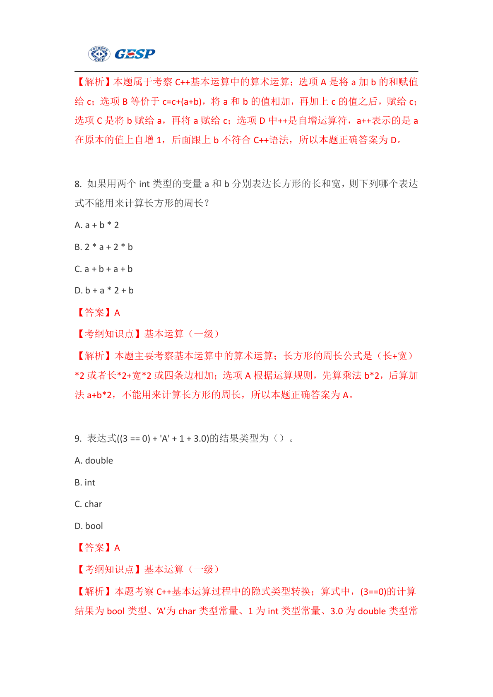

### 提取文本

```
【解析】本题属于考察C++基本运算中的算术运算；选项A 是将a 加b 的和赋值
给c；选项B 等价于c=c+(a+b)，将a 和b 的值相加，再加上c 的值之后，赋给c；
选项C 是将b 赋给a，再将a 赋给c；选项D 中++是自增运算符，a++表示的是a
在原本的值上自增1，后面跟上b 不符合C++语法，所以本题正确答案为D。


8. 如果用两个int 类型的变量a 和b 分别表达长方形的长和宽，则下列哪个表达

式不能用来计算长方形的周长？

A. a + b * 2

B. 2 * a + 2 * b

C. a + b + a + b

D. b + a * 2 + b

【答案】A

【考纲知识点】基本运算（一级）

【解析】本题主要考察基本运算中的算术运算；长方形的周长公式是（长+宽）
*2 或者长*2+宽*2 或四条边相加；选项A 根据运算规则，先算乘法b*2，后算加
法a+b*2，不能用来计算长方形的周长，所以本题正确答案为A。


9. 表达式((3 == 0) + 'A' + 1 + 3.0)的结果类型为（）。

A. double

B. int

C. char

D. bool

【答案】A

【考纲知识点】基本运算（一级）

【解析】本题考察C++基本运算过程中的隐式类型转换；算式中，(3==0)的计算
结果为bool 类型、’A’为char 类型常量、1 为int 类型常量、3.0 为double 类型常
```

## 第 6 页

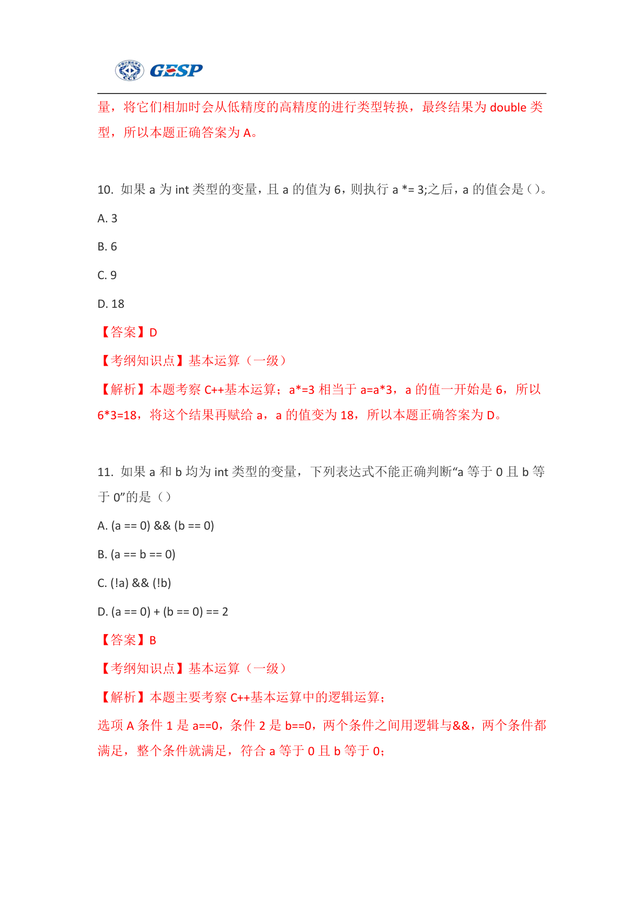

### 提取文本

```
量，将它们相加时会从低精度的高精度的进行类型转换，最终结果为double 类
型，所以本题正确答案为A。


10. 如果a 为int 类型的变量，且a 的值为6，则执行a *= 3;之后，a 的值会是（）。

A. 3

B. 6

C. 9

D. 18

【答案】D

【考纲知识点】基本运算（一级）

【解析】本题考察C++基本运算；a*=3 相当于a=a*3，a 的值一开始是6，所以
6*3=18，将这个结果再赋给a，a 的值变为18，所以本题正确答案为D。


11. 如果a 和b 均为int 类型的变量，下列表达式不能正确判断“a 等于0 且b 等
于0”的是（）

A. (a == 0) && (b == 0)

B. (a == b == 0)

C. (!a) && (!b)

D. (a == 0) + (b == 0) == 2

【答案】B

【考纲知识点】基本运算（一级）

【解析】本题主要考察C++基本运算中的逻辑运算；

选项A 条件1 是a==0，条件2 是b==0，两个条件之间用逻辑与&&，两个条件都
满足，整个条件就满足，符合a 等于0 且b 等于0；
```

## 第 7 页

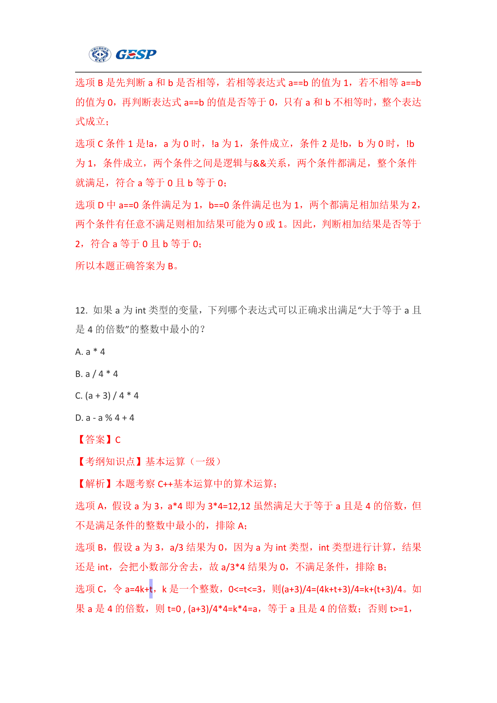

### 提取文本

```
选项B 是先判断a 和b 是否相等，若相等表达式a==b 的值为1，若不相等a==b
的值为0，再判断表达式a==b 的值是否等于0，只有a 和b 不相等时，整个表达

式成立；

选项C 条件1 是!a，a 为0 时，!a 为1，条件成立，条件2 是!b，b 为0 时，!b
为1，条件成立，两个条件之间是逻辑与&&关系，两个条件都满足，整个条件
就满足，符合a 等于0 且b 等于0；

选项D 中a==0 条件满足为1，b==0 条件满足也为1，两个都满足相加结果为2，
两个条件有任意不满足则相加结果可能为0 或1。因此，判断相加结果是否等于
2，符合a 等于0 且b 等于0；

所以本题正确答案为B。


12. 如果a 为int 类型的变量，下列哪个表达式可以正确求出满足“大于等于a 且
是4 的倍数”的整数中最小的？

A. a * 4

B. a / 4 * 4

C. (a + 3) / 4 * 4

D. a - a % 4 + 4

【答案】C

【考纲知识点】基本运算（一级）

【解析】本题考察C++基本运算中的算术运算；

选项A，假设a 为3，a*4 即为3*4=12,12 虽然满足大于等于a 且是4 的倍数，但
不是满足条件的整数中最小的，排除A；

选项B，假设a 为3，a/3 结果为0，因为a 为int 类型，int 类型进行计算，结果
还是int，会把小数部分舍去，故a/3*4 结果为0，不满足条件，排除B；

选项C，令a=4k+t，k 是一个整数，0<=t<=3，则(a+3)/4=(4k+t+3)/4=k+(t+3)/4。如
果a 是4 的倍数，则t=0 , (a+3)/4*4=k*4=a，等于a 且是4 的倍数；否则t>=1，
```

## 第 8 页

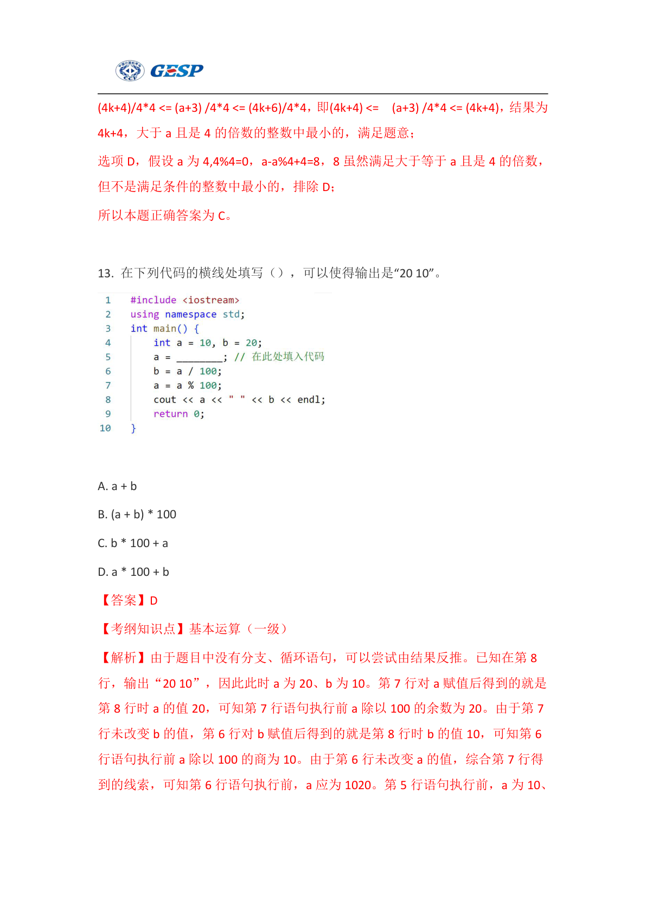

### 提取文本

```
(4k+4)/4*4 <= (a+3) /4*4 <= (4k+6)/4*4，即(4k+4) <=  (a+3) /4*4 <= (4k+4)，结果为
4k+4，大于a 且是4 的倍数的整数中最小的，满足题意；

选项D，假设a 为4,4%4=0，a-a%4+4=8，8 虽然满足大于等于a 且是4 的倍数，
但不是满足条件的整数中最小的，排除D；

所以本题正确答案为C。


13. 在下列代码的横线处填写（），可以使得输出是“20 10”。


A. a + b

B. (a + b) * 100

C. b * 100 + a

D. a * 100 + b

【答案】D

【考纲知识点】基本运算（一级）

【解析】由于题目中没有分支、循环语句，可以尝试由结果反推。已知在第8
行，输出“20 10”，因此此时a 为20、b 为10。第7 行对a 赋值后得到的就是
第8 行时a 的值20，可知第7 行语句执行前a 除以100 的余数为20。由于第7
行未改变b 的值，第6 行对b 赋值后得到的就是第8 行时b 的值10，可知第6
行语句执行前a 除以100 的商为10。由于第6 行未改变a 的值，综合第7 行得
到的线索，可知第6 行语句执行前，a 应为1020。第5 行语句执行前，a 为10、
```

## 第 9 页

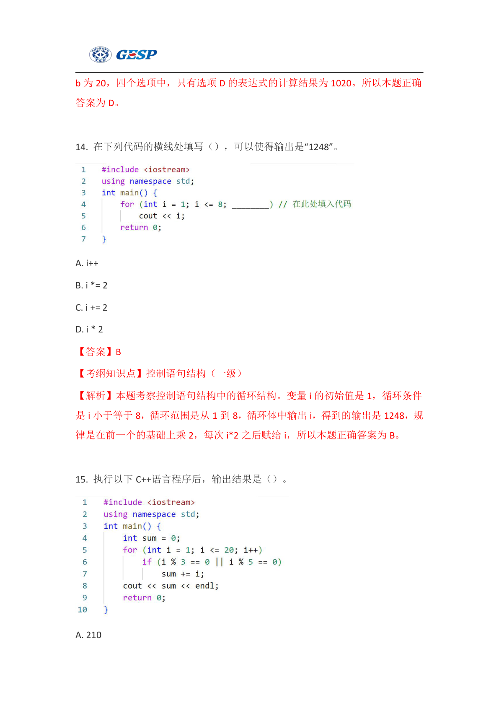

### 提取文本

```
b 为20，四个选项中，只有选项D 的表达式的计算结果为1020。所以本题正确
答案为D。


14. 在下列代码的横线处填写（），可以使得输出是“1248”。


A. i++

B. i *= 2

C. i += 2

D. i * 2

【答案】B

【考纲知识点】控制语句结构（一级）

【解析】本题考察控制语句结构中的循环结构。变量i 的初始值是1，循环条件
是i 小于等于8，循环范围是从1 到8，循环体中输出i，得到的输出是1248，规
律是在前一个的基础上乘2，每次i*2 之后赋给i，所以本题正确答案为B。


15. 执行以下C++语言程序后，输出结果是（）。


A. 210
```

## 第 10 页

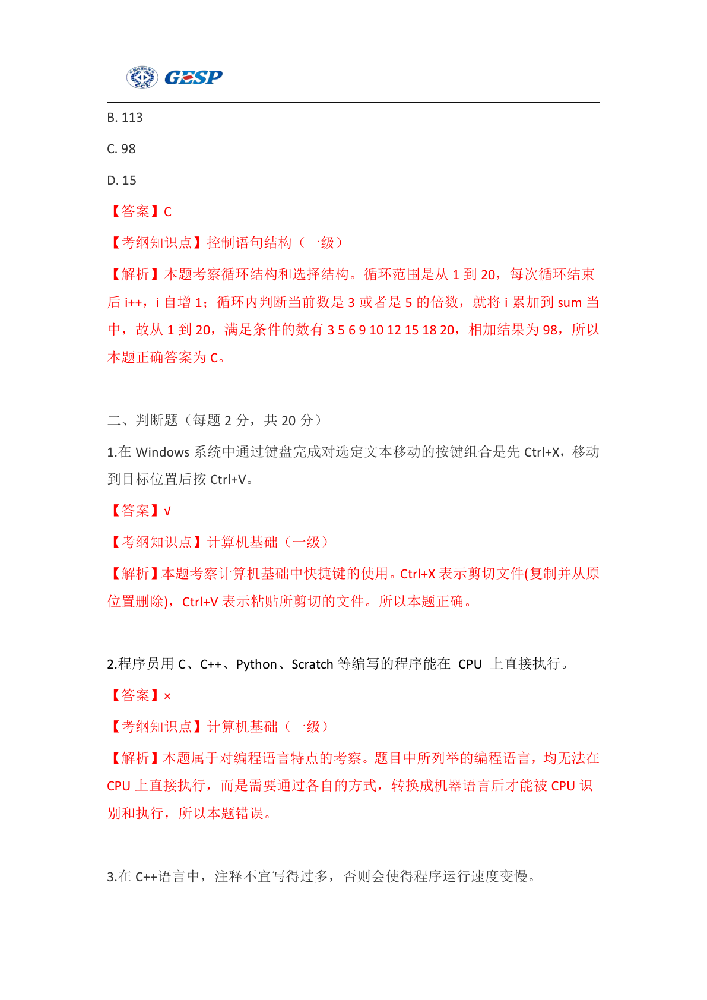

### 提取文本

```
B. 113

C. 98

D. 15

【答案】C

【考纲知识点】控制语句结构（一级）

【解析】本题考察循环结构和选择结构。循环范围是从1 到20，每次循环结束
后i++，i 自增1；循环内判断当前数是3 或者是5 的倍数，就将i 累加到sum 当
中，故从1 到20，满足条件的数有3 5 6 9 10 12 15 18 20，相加结果为98，所以
本题正确答案为C。


二、判断题（每题2 分，共20 分）

1.在Windows 系统中通过键盘完成对选定文本移动的按键组合是先Ctrl+X，移动
到目标位置后按Ctrl+V。

【答案】√

【考纲知识点】计算机基础（一级）

【解析】本题考察计算机基础中快捷键的使用。Ctrl+X 表示剪切文件(复制并从原
位置删除)，Ctrl+V 表示粘贴所剪切的文件。所以本题正确。


2.程序员用C、C++、Python、Scratch 等编写的程序能在CPU 上直接执行。

【答案】×

【考纲知识点】计算机基础（一级）

【解析】本题属于对编程语言特点的考察。题目中所列举的编程语言，均无法在

CPU 上直接执行，而是需要通过各自的方式，转换成机器语言后才能被CPU 识

别和执行，所以本题错误。


3.在C++语言中，注释不宜写得过多，否则会使得程序运行速度变慢。
```

## 第 11 页

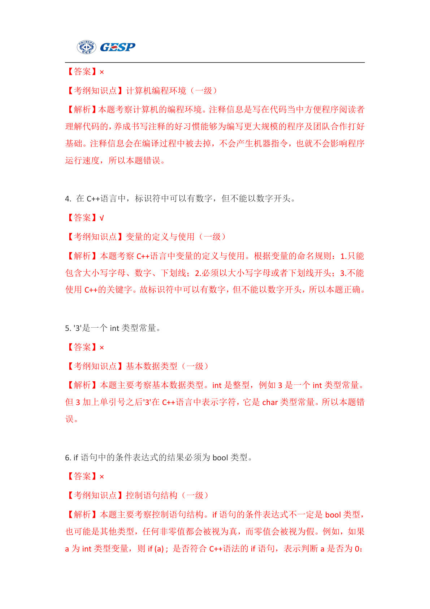

### 提取文本

```
【答案】×

【考纲知识点】计算机编程环境（一级）

【解析】本题考察计算机的编程环境。注释信息是写在代码当中方便程序阅读者

理解代码的，养成书写注释的好习惯能够为编写更大规模的程序及团队合作打好

基础。注释信息会在编译过程中被去掉，不会产生机器指令，也就不会影响程序

运行速度，所以本题错误。


4. 在C++语言中，标识符中可以有数字，但不能以数字开头。

【答案】√

【考纲知识点】变量的定义与使用（一级）

【解析】本题考察C++语言中变量的定义与使用。根据变量的命名规则：1.只能
包含大小写字母、数字、下划线；2.必须以大小写字母或者下划线开头；3.不能
使用C++的关键字。故标识符中可以有数字，但不能以数字开头，所以本题正确。


5. '3'是一个int 类型常量。

【答案】×

【考纲知识点】基本数据类型（一级）

【解析】本题主要考察基本数据类型。int 是整型，例如3 是一个int 类型常量。
但3 加上单引号之后'3'在C++语言中表示字符，它是char 类型常量。所以本题错

误。


6. if 语句中的条件表达式的结果必须为bool 类型。

【答案】×

【考纲知识点】控制语句结构（一级）

【解析】本题主要考察控制语句结构。if 语句的条件表达式不一定是bool 类型，

也可能是其他类型，任何非零值都会被视为真，而零值会被视为假。例如，如果

a 为int 类型变量，则if (a) ; 是否符合C++语法的if 语句，表示判断a 是否为0：
```

## 第 12 页

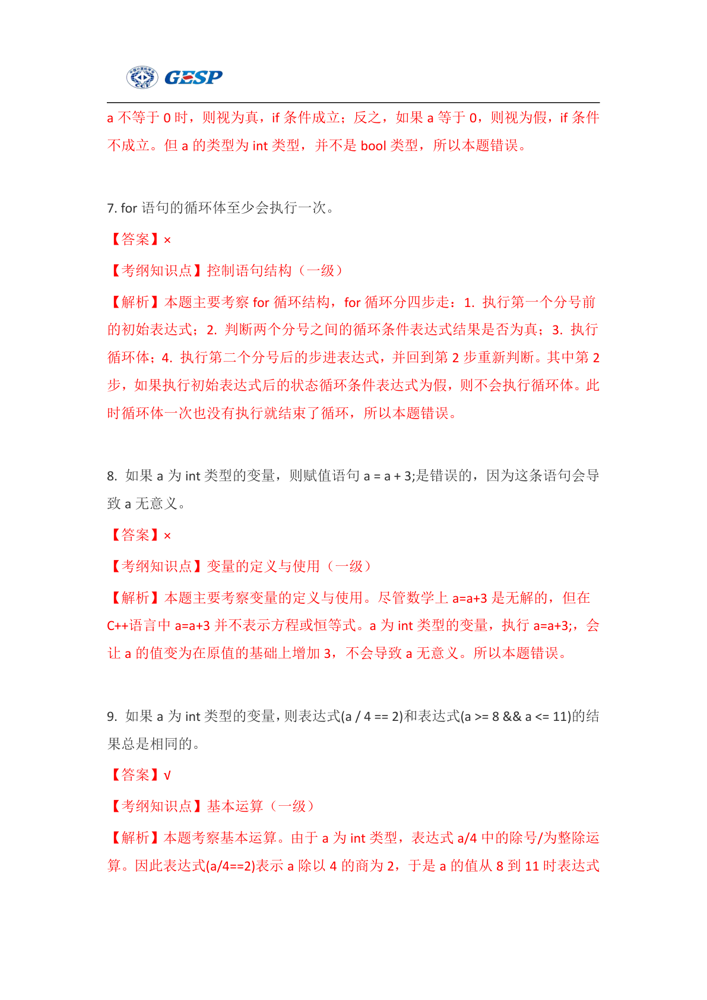

### 提取文本

```
a 不等于0 时，则视为真，if 条件成立；反之，如果a 等于0，则视为假，if 条件
不成立。但a 的类型为int 类型，并不是bool 类型，所以本题错误。


7. for 语句的循环体至少会执行一次。

【答案】×

【考纲知识点】控制语句结构（一级）

【解析】本题主要考察for 循环结构，for 循环分四步走：1. 执行第一个分号前
的初始表达式；2. 判断两个分号之间的循环条件表达式结果是否为真；3. 执行
循环体；4. 执行第二个分号后的步进表达式，并回到第2 步重新判断。其中第2

步，如果执行初始表达式后的状态循环条件表达式为假，则不会执行循环体。此

时循环体一次也没有执行就结束了循环，所以本题错误。


8. 如果a 为int 类型的变量，则赋值语句a = a + 3;是错误的，因为这条语句会导
致a 无意义。

【答案】×

【考纲知识点】变量的定义与使用（一级）

【解析】本题主要考察变量的定义与使用。尽管数学上a=a+3 是无解的，但在
C++语言中a=a+3 并不表示方程或恒等式。a 为int 类型的变量，执行a=a+3;，会
让a 的值变为在原值的基础上增加3，不会导致a 无意义。所以本题错误。


9. 如果a 为int 类型的变量，则表达式(a / 4 == 2)和表达式(a >= 8 && a <= 11)的结

果总是相同的。

【答案】√

【考纲知识点】基本运算（一级）

【解析】本题考察基本运算。由于a 为int 类型，表达式a/4 中的除号/为整除运
算。因此表达式(a/4==2)表示a 除以4 的商为2，于是a 的值从8 到11 时表达式
```

## 第 13 页

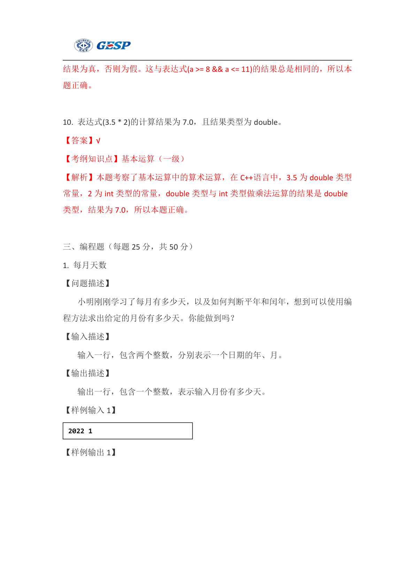

### 提取文本

```
结果为真，否则为假。这与表达式(a >= 8 && a <= 11)的结果总是相同的，所以本

题正确。


10. 表达式(3.5 * 2)的计算结果为7.0，且结果类型为double。

【答案】√

【考纲知识点】基本运算（一级）

【解析】本题考察了基本运算中的算术运算，在C++语言中，3.5 为double 类型
常量，2 为int 类型的常量，double 类型与int 类型做乘法运算的结果是double
类型，结果为7.0，所以本题正确。


三、编程题（每题25 分，共50 分）

1. 每月天数

【问题描述】

  小明刚刚学习了每月有多少天，以及如何判断平年和闰年，想到可以使用编

程方法求出给定的月份有多少天。你能做到吗？

【输入描述】

  输入一行，包含两个整数，分别表示一个日期的年、月。

【输出描述】

  输出一行，包含一个整数，表示输入月份有多少天。

【样例输入1】

 2022 1

【样例输出1】
```

## 第 14 页

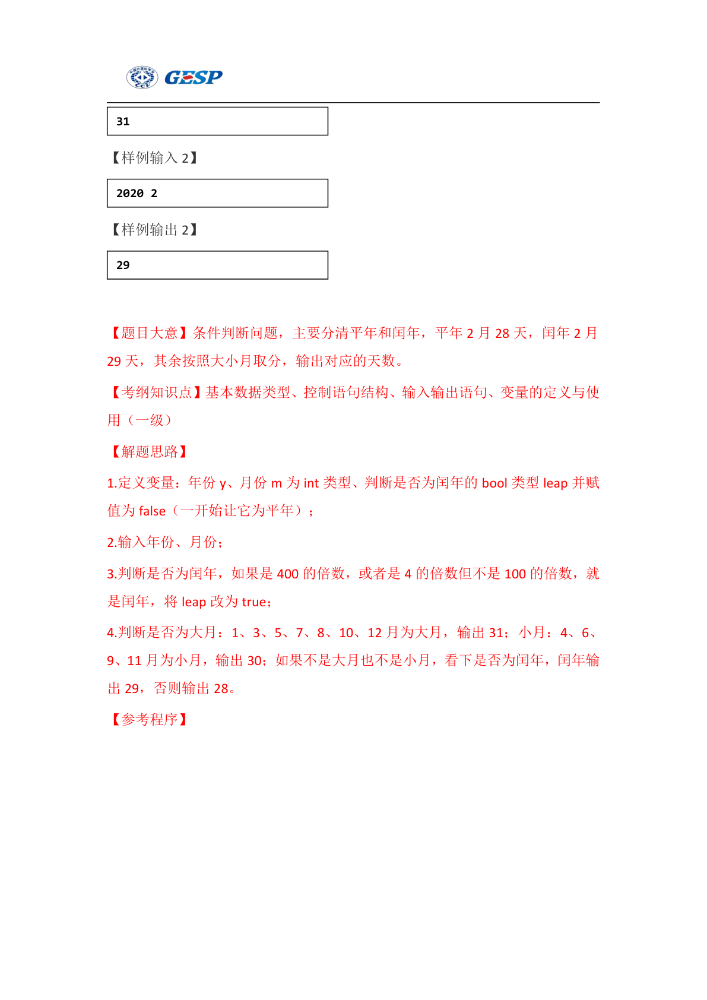

### 提取文本

```
31

【样例输入2】

 2020 2

【样例输出2】

 29


【题目大意】条件判断问题，主要分清平年和闰年，平年2 月28 天，闰年2 月
29 天，其余按照大小月取分，输出对应的天数。

【考纲知识点】基本数据类型、控制语句结构、输入输出语句、变量的定义与使

用（一级）

【解题思路】

1.定义变量：年份y、月份m 为int 类型、判断是否为闰年的bool 类型leap 并赋
值为false（一开始让它为平年）；

2.输入年份、月份；

3.判断是否为闰年，如果是400 的倍数，或者是4 的倍数但不是100 的倍数，就
是闰年，将leap 改为true；

4.判断是否为大月：1、3、5、7、8、10、12 月为大月，输出31；小月：4、6、
9、11 月为小月，输出30；如果不是大月也不是小月，看下是否为闰年，闰年输
出29，否则输出28。

【参考程序】
```

## 第 15 页

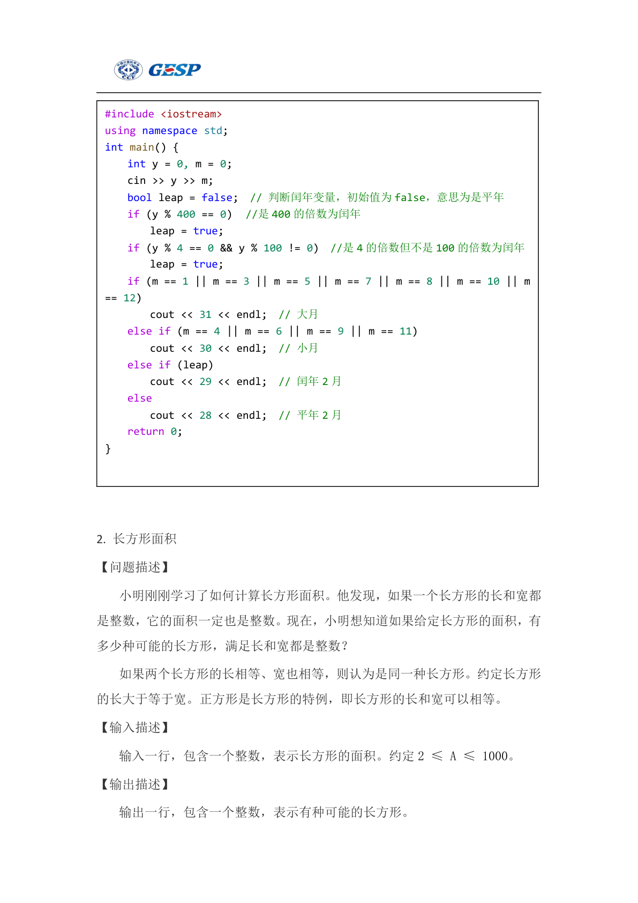

### 提取文本

```
#include <iostream>
 using namespace std;
 int main() {
     int y = 0, m = 0;
     cin >> y >> m;
     bool leap = false;  // 判断闰年变量，初始值为false，意思为是平年
     if (y % 400 == 0)  //是400 的倍数为闰年
         leap = true;
     if (y % 4 == 0 && y % 100 != 0) //是4 的倍数但不是100 的倍数为闰年
         leap = true;
     if (m == 1 || m == 3 || m == 5 || m == 7 || m == 8 || m == 10 || m
 == 12)
         cout << 31 << endl;  // 大月
     else if (m == 4 || m == 6 || m == 9 || m == 11)
         cout << 30 << endl;  // 小月
     else if (leap)
         cout << 29 << endl;  // 闰年2 月
     else
         cout << 28 << endl;  // 平年2 月
     return 0;
 }


2. 长方形面积

【问题描述】

  小明刚刚学习了如何计算长方形面积。他发现，如果一个长方形的长和宽都

是整数，它的面积一定也是整数。现在，小明想知道如果给定长方形的面积，有

多少种可能的长方形，满足长和宽都是整数？

  如果两个长方形的长相等、宽也相等，则认为是同一种长方形。约定长方形

的长大于等于宽。正方形是长方形的特例，即长方形的长和宽可以相等。

【输入描述】

  输入一行，包含一个整数，表示长方形的面积。约定2 ≤A ≤1000。

【输出描述】

  输出一行，包含一个整数，表示有种可能的长方形。
```

## 第 16 页

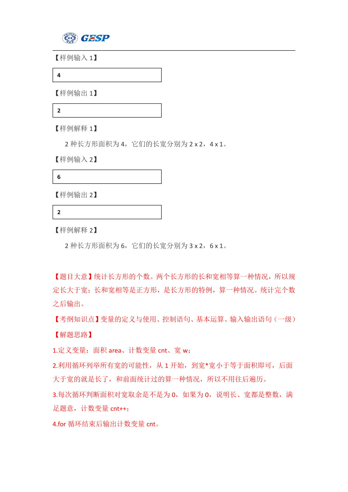

### 提取文本

```
【样例输入1】

 4

【样例输出1】

 2

【样例解释1】

   2 种长方形面积为4，它们的长宽分别为2 x 2，4 x 1。

【样例输入2】

 6

【样例输出2】

 2

【样例解释2】

   2 种长方形面积为6，它们的长宽分别为3 x 2，6 x 1。


【题目大意】统计长方形的个数。两个长方形的长和宽相等算一种情况，所以规

定长大于宽；长和宽相等是正方形，是长方形的特例，算一种情况。统计完个数

之后输出。

【考纲知识点】变量的定义与使用、控制语句、基本运算、输入输出语句（一级）

【解题思路】

1.定义变量：面积area、计数变量cnt、宽w；

2.利用循环列举所有宽的可能性，从1 开始，到宽*宽小于等于面积即可，后面

大于宽的就是长了，和前面统计过的算一种情况，所以不用往后遍历。

3.每次循环判断面积对宽取余是不是为0，如果为0，说明长、宽都是整数，满
足题意，计数变量cnt++；

4.for 循环结束后输出计数变量cnt。
```

## 第 17 页

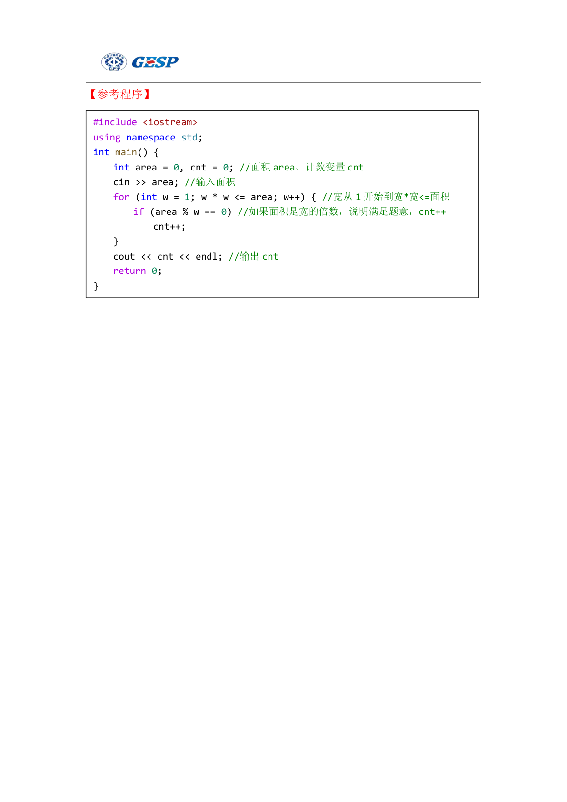

### 提取文本

```
【参考程序】

 #include <iostream>
 using namespace std;
 int main() {
     int area = 0, cnt = 0; //面积area、计数变量cnt
     cin >> area; //输入面积
     for (int w = 1; w * w <= area; w++) { //宽从1 开始到宽*宽<=面积
         if (area % w == 0) //如果面积是宽的倍数，说明满足题意，cnt++
            cnt++;
     }
     cout << cnt << endl; //输出cnt
     return 0;
 }
```
