# 2023年3月-C++2级

- 原始 PDF：[`pdfs/2023年3月-C++2级.pdf`](../pdfs/2023年3月-C++2级.pdf)
- 页数：15
- 转换脚本：[`scripts/convert_pdfs_to_markdown.py`](../scripts/convert_pdfs_to_markdown.py)

> 为尽量避免信息丢失，每页均附带页面图片；文本提取结果保留原有顺序与换行特征，个别公式、图形、特殊排版请以页面图片为准。

## 第 1 页

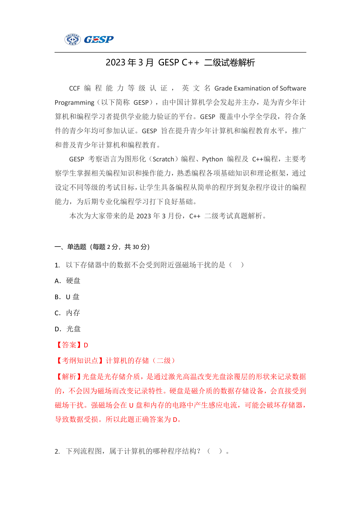

### 提取文本

```
2023 年3 月GESP C++ 二级试卷解析


    CCF 编程能力等级认证，英文名Grade Examination of Software
Programming（以下简称GESP），由中国计算机学会发起并主办，是为青少年计
算机和编程学习者提供学业能力验证的平台。GESP 覆盖中小学全学段，符合条
件的青少年均可参加认证。GESP 旨在提升青少年计算机和编程教育水平，推广

和普及青少年计算机和编程教育。

    GESP 考察语言为图形化（Scratch）编程、Python 编程及C++编程，主要考

察学生掌握相关编程知识和操作能力，熟悉编程各项基础知识和理论框架，通过

设定不同等级的考试目标，让学生具备编程从简单的程序到复杂程序设计的编程

能力，为后期专业化编程学习打下良好基础。

  本次为大家带来的是2023 年3 月份，C++ 二级考试真题解析。


一、单选题（每题2 分，共30 分）

1. 以下存储器中的数据不会受到附近强磁场干扰的是（ ）

A．硬盘

B．U 盘

C．内存

D．光盘

【答案】D

【考纲知识点】计算机的存储（二级）

【解析】光盘是光存储介质，是通过激光高温改变光盘涂覆层的形状来记录数据

的，不会因为磁场而改变记录特性。硬盘是磁介质的数据存储设备，会直接受到

磁场干扰。强磁场会在U 盘和内存的电路中产生感应电流，可能会破坏存储器，
导致数据受损。所以此题正确答案为D。


2. 下列流程图，属于计算机的哪种程序结构？（ ）。
```

## 第 2 页

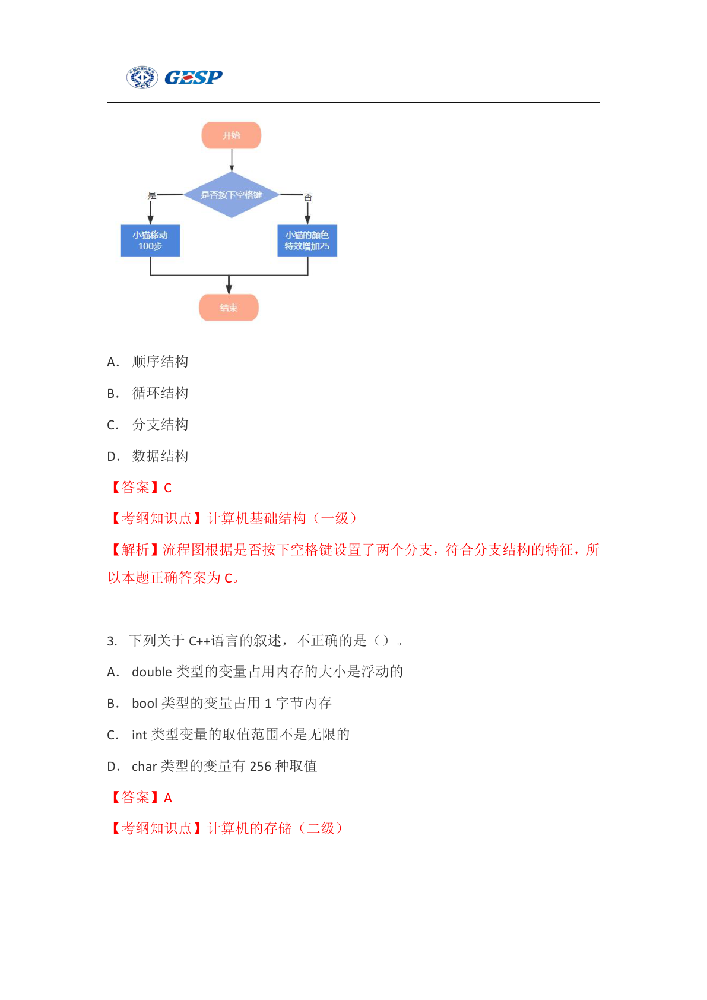

### 提取文本

```
A．顺序结构

B．循环结构

C．分支结构

D．数据结构

【答案】C

【考纲知识点】计算机基础结构（一级）

【解析】流程图根据是否按下空格键设置了两个分支，符合分支结构的特征，所

以本题正确答案为C。


3. 下列关于C++语言的叙述，不正确的是（）。

A．double 类型的变量占用内存的大小是浮动的

B．bool 类型的变量占用1 字节内存

C．int 类型变量的取值范围不是无限的

D．char 类型的变量有256 种取值

【答案】A

【考纲知识点】计算机的存储（二级）
```

## 第 3 页

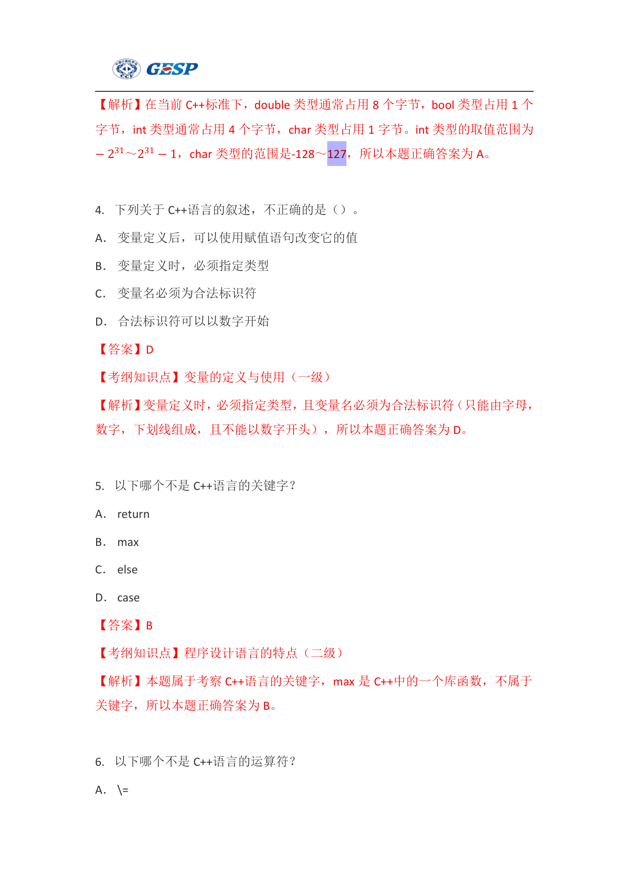

### 提取文本

```
【解析】在当前C++标准下，double 类型通常占用8 个字节，bool 类型占用1 个
字节，int 类型通常占用4 个字节，char 类型占用1 字节。int 类型的取值范围为
−231～231 −1，char 类型的范围是-128～127，所以本题正确答案为A。


4. 下列关于C++语言的叙述，不正确的是（）。

A．变量定义后，可以使用赋值语句改变它的值

B．变量定义时，必须指定类型

C．变量名必须为合法标识符

D．合法标识符可以以数字开始

【答案】D

【考纲知识点】变量的定义与使用（一级）

【解析】变量定义时，必须指定类型，且变量名必须为合法标识符（只能由字母，

数字，下划线组成，且不能以数字开头），所以本题正确答案为D。


5. 以下哪个不是C++语言的关键字？

A．return

B．max

C．else

D．case

【答案】B

【考纲知识点】程序设计语言的特点（二级）

【解析】本题属于考察C++语言的关键字，max 是C++中的一个库函数，不属于
关键字，所以本题正确答案为B。


6. 以下哪个不是C++语言的运算符？

A．\=
```

## 第 4 页

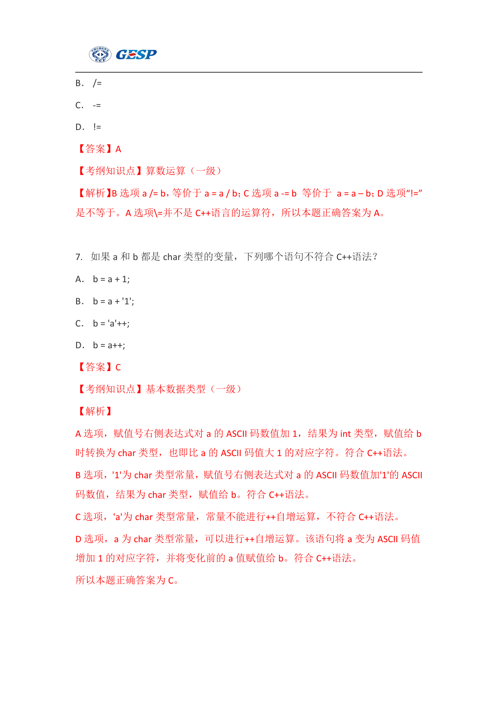

### 提取文本

```
B．/=

C．-=

D．!=

【答案】A

【考纲知识点】算数运算（一级）

【解析】B 选项a /= b，等价于a = a / b；C 选项a -= b 等价于a = a – b；D 选项“!=”
是不等于。A 选项\=并不是C++语言的运算符，所以本题正确答案为A。


7. 如果a 和b 都是char 类型的变量，下列哪个语句不符合C++语法？

A．b = a + 1;

B．b = a + '1';

C．b = 'a'++;

D．b = a++;

【答案】C

【考纲知识点】基本数据类型（一级）

【解析】

A 选项，赋值号右侧表达式对a 的ASCII 码数值加1，结果为int 类型，赋值给b
时转换为char 类型，也即比a 的ASCII 码值大1 的对应字符。符合C++语法。

B 选项，'1'为char 类型常量，赋值号右侧表达式对a 的ASCII 码数值加'1'的ASCII
码数值，结果为char 类型，赋值给b。符合C++语法。

C 选项，'a'为char 类型常量，常量不能进行++自增运算，不符合C++语法。

D 选项，a 为char 类型常量，可以进行++自增运算。该语句将a 变为ASCII 码值
增加1 的对应字符，并将变化前的a 值赋值给b。符合C++语法。

所以本题正确答案为C。
```

## 第 5 页

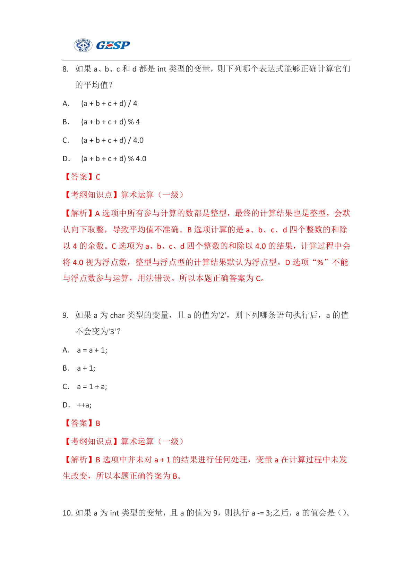

### 提取文本

```
8. 如果a、b、c 和d 都是int 类型的变量，则下列哪个表达式能够正确计算它们

  的平均值？

A．(a + b + c + d) / 4

B．(a + b + c + d) % 4

C．(a + b + c + d) / 4.0

D．(a + b + c + d) % 4.0

【答案】C

【考纲知识点】算术运算（一级）

【解析】A 选项中所有参与计算的数都是整型，最终的计算结果也是整型，会默
认向下取整，导致平均值不准确。B 选项计算的是a、b、c、d 四个整数的和除
以4 的余数。C 选项为a、b、c、d 四个整数的和除以4.0 的结果，计算过程中会
将4.0 视为浮点数，整型与浮点型的计算结果默认为浮点型。D 选项“%”不能
与浮点数参与运算，用法错误。所以本题正确答案为C。


9. 如果a 为char 类型的变量，且a 的值为'2'，则下列哪条语句执行后，a 的值
  不会变为'3'？

A．a = a + 1;

B．a + 1;

C．a = 1 + a;

D．++a;

【答案】B

【考纲知识点】算术运算（一级）

【解析】B 选项中并未对a + 1 的结果进行任何处理，变量a 在计算过程中未发
生改变，所以本题正确答案为B。


10. 如果a 为int 类型的变量，且a 的值为9，则执行a -= 3;之后，a 的值会是（）。
```

## 第 6 页

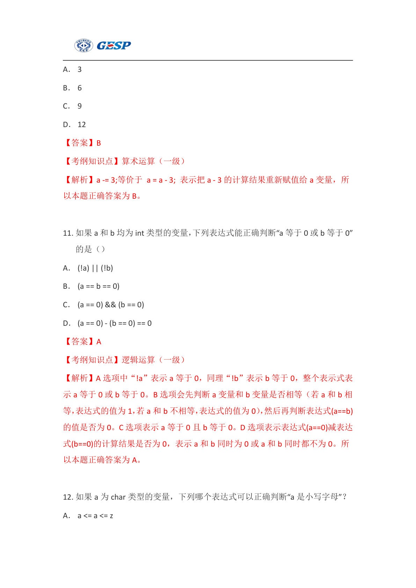

### 提取文本

```
A．3

B．6

C．9

D．12

【答案】B

【考纲知识点】算术运算（一级）

【解析】a -= 3;等价于a = a - 3; 表示把a - 3 的计算结果重新赋值给a 变量，所
以本题正确答案为B。


11. 如果a 和b 均为int 类型的变量，下列表达式能正确判断“a 等于0 或b 等于0”

  的是（）

A．(!a) || (!b)

B．(a == b == 0)

C．(a == 0) && (b == 0)

D．(a == 0) - (b == 0) == 0

【答案】A

【考纲知识点】逻辑运算（一级）

【解析】A 选项中“!a”表示a 等于0，同理“!b”表示b 等于0，整个表示式表
示a 等于0 或b 等于0。B 选项会先判断a 变量和b 变量是否相等（若a 和b 相
等，表达式的值为1，若a 和b 不相等，表达式的值为0），然后再判断表达式(a==b)
的值是否为0。C 选项表示a 等于0 且b 等于0。D 选项表示表达式(a==0)减表达
式(b==0)的计算结果是否为0，表示a 和b 同时为0 或a 和b 同时都不为0。所
以本题正确答案为A。


12. 如果a 为char 类型的变量，下列哪个表达式可以正确判断“a 是小写字母”？

A．a <= a <= z
```

## 第 7 页

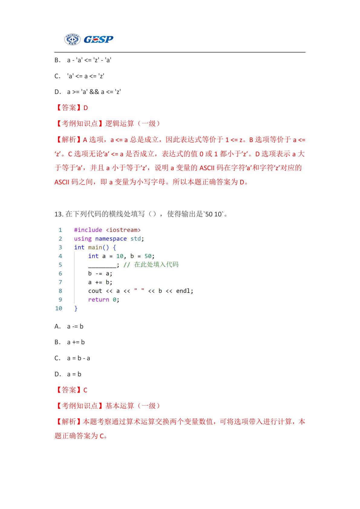

### 提取文本

```
B．a - 'a' <= 'z' - 'a'

C．'a' <= a <= 'z'

D．a >= 'a' && a <= 'z'

【答案】D

【考纲知识点】逻辑运算（一级）

【解析】A 选项，a <= a 总是成立，因此表达式等价于1 <= z。B 选项等价于a <=
‘z’。C 选项无论’a’ <= a 是否成立，表达式的值0 或1 都小于’z’。D 选项表示a 大
于等于’a’，并且a 小于等于’z’，说明a 变量的ASCII 码在字符’a’和字符’z’对应的
ASCII 码之间，即a 变量为小写字母。所以本题正确答案为D。


13. 在下列代码的横线处填写（），使得输出是`50 10`。


A．a -= b

B．a += b

C．a = b - a

D．a = b

【答案】C

【考纲知识点】基本运算（一级）

【解析】本题考察通过算术运算交换两个变量数值，可将选项带入进行计算，本

题正确答案为C。
```

## 第 8 页

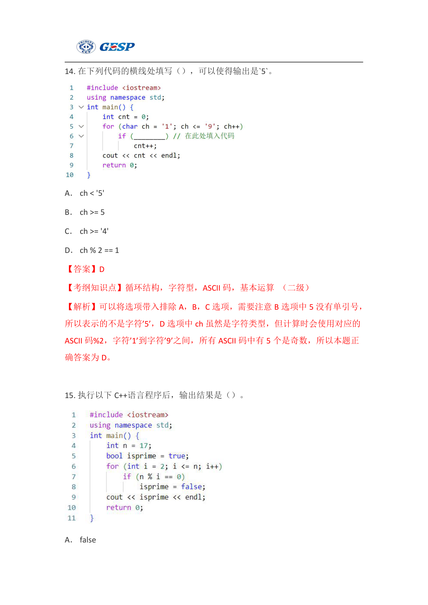

### 提取文本

```
14. 在下列代码的横线处填写（），可以使得输出是`5`。


A．ch < '5'

B．ch >= 5

C．ch >= '4'

D．ch % 2 == 1

【答案】D

【考纲知识点】循环结构，字符型，ASCII 码，基本运算（二级）

【解析】可以将选项带入排除A，B，C 选项，需要注意B 选项中5 没有单引号，
所以表示的不是字符’5’，D 选项中ch 虽然是字符类型，但计算时会使用对应的
ASCII 码%2，字符’1’到字符’9’之间，所有ASCII 码中有5 个是奇数，所以本题正
确答案为D。


15. 执行以下C++语言程序后，输出结果是（）。


A．false
```

## 第 9 页

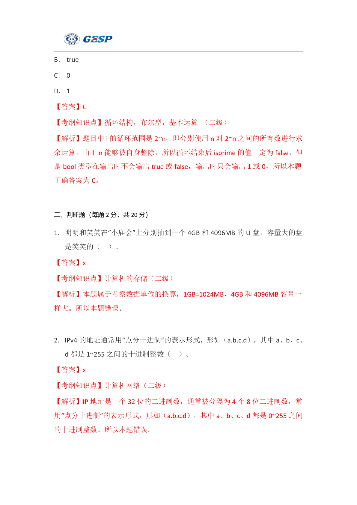

### 提取文本

```
B．true

C．0

D．1

【答案】C

【考纲知识点】循环结构，布尔型，基本运算（二级）

【解析】题目中i 的循环范围是2~n，即分别使用n 对2~n 之间的所有数进行求
余运算，由于n 能够被自身整除，所以循环结束后isprime 的值一定为false，但
是bool 类型在输出时不会输出true 或false，输出时只会输出1 或0，所以本题
正确答案为C。


二、判断题（每题2 分，共20 分）

1. 明明和笑笑在“小庙会”上分别抽到一个4GB 和4096MB 的U 盘，容量大的盘

  是笑笑的（ ）。

【答案】x

【考纲知识点】计算机的存储（二级）

【解析】本题属于考察数据单位的换算，1GB=1024MB，4GB 和4096MB 容量一

样大。所以本题错误。


2.  IPv4 的地址通常用“点分十进制”的表示形式，形如（a.b.c.d），其中a、b、c、
   d 都是1~255 之间的十进制整数（ ）。

【答案】x

【考纲知识点】计算机网络（二级）

【解析】IP 地址是一个32 位的二进制数，通常被分隔为4 个8 位二进制数，常
用“点分十进制”的表示形式，形如（a.b.c.d），其中a、b、c、d 都是0~255 之间

的十进制整数。所以本题错误。
```

## 第 10 页

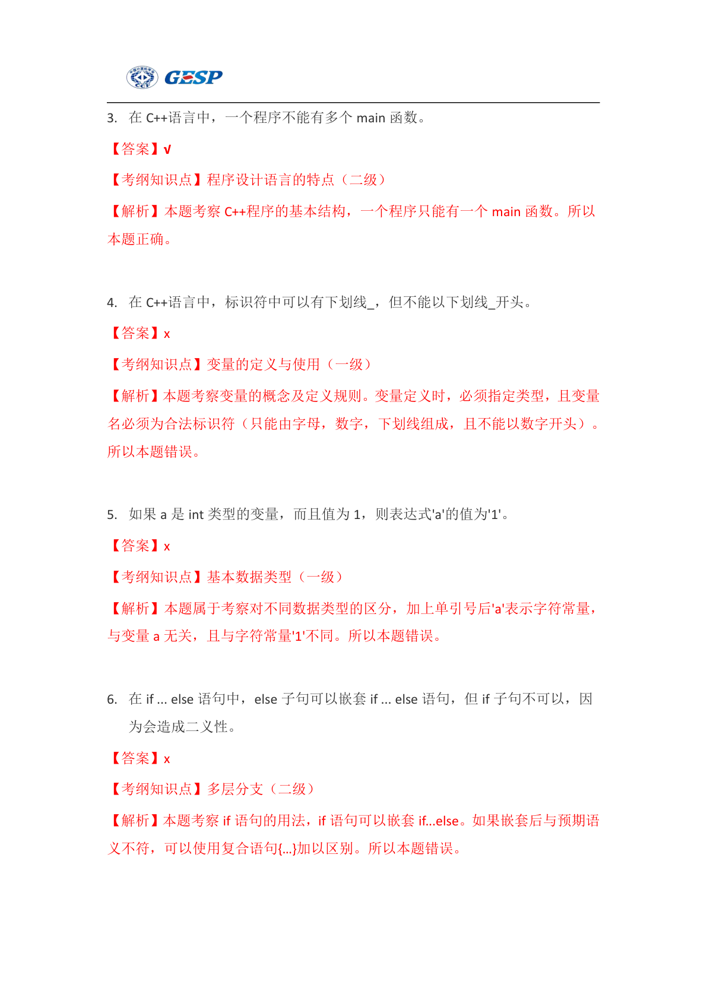

### 提取文本

```
3. 在C++语言中，一个程序不能有多个main 函数。

【答案】√

【考纲知识点】程序设计语言的特点（二级）

【解析】本题考察C++程序的基本结构，一个程序只能有一个main 函数。所以

本题正确。


4. 在C++语言中，标识符中可以有下划线_，但不能以下划线_开头。

【答案】x

【考纲知识点】变量的定义与使用（一级）

【解析】本题考察变量的概念及定义规则。变量定义时，必须指定类型，且变量

名必须为合法标识符（只能由字母，数字，下划线组成，且不能以数字开头）。

所以本题错误。


5. 如果a 是int 类型的变量，而且值为1，则表达式'a'的值为'1'。

【答案】x

【考纲知识点】基本数据类型（一级）

【解析】本题属于考察对不同数据类型的区分，加上单引号后'a'表示字符常量，
与变量a 无关，且与字符常量'1'不同。所以本题错误。


6. 在if ... else 语句中，else 子句可以嵌套if ... else 语句，但if 子句不可以，因

  为会造成二义性。

【答案】x

【考纲知识点】多层分支（二级）

【解析】本题考察if 语句的用法，if 语句可以嵌套if...else。如果嵌套后与预期语
义不符，可以使用复合语句{…}加以区别。所以本题错误。
```

## 第 11 页

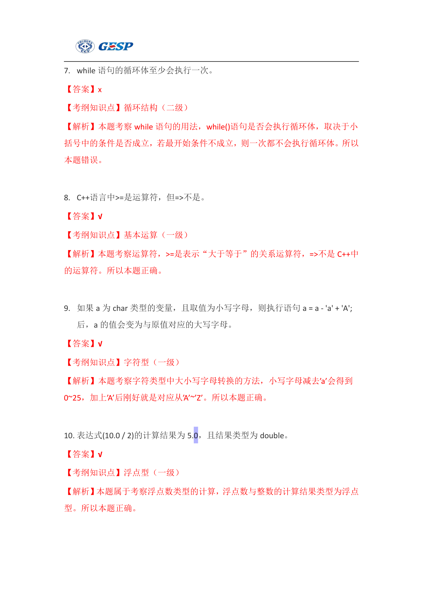

### 提取文本

```
7.  while 语句的循环体至少会执行一次。

【答案】x

【考纲知识点】循环结构（二级）

【解析】本题考察while 语句的用法，while()语句是否会执行循环体，取决于小

括号中的条件是否成立，若最开始条件不成立，则一次都不会执行循环体。所以

本题错误。


8. C++语言中>=是运算符，但=>不是。

【答案】√

【考纲知识点】基本运算（一级）

【解析】本题考察运算符，>=是表示“大于等于”的关系运算符，=>不是C++中

的运算符。所以本题正确。


9. 如果a 为char 类型的变量，且取值为小写字母，则执行语句a = a - 'a' + 'A';
  后，a 的值会变为与原值对应的大写字母。

【答案】√

【考纲知识点】字符型（一级）

【解析】本题考察字符类型中大小写字母转换的方法，小写字母减去’a’会得到
0~25，加上’A’后刚好就是对应从’A’~’Z’。所以本题正确。


10. 表达式(10.0 / 2)的计算结果为5.0，且结果类型为double。

【答案】√

【考纲知识点】浮点型（一级）

【解析】本题属于考察浮点数类型的计算，浮点数与整数的计算结果类型为浮点

型。所以本题正确。
```

## 第 12 页

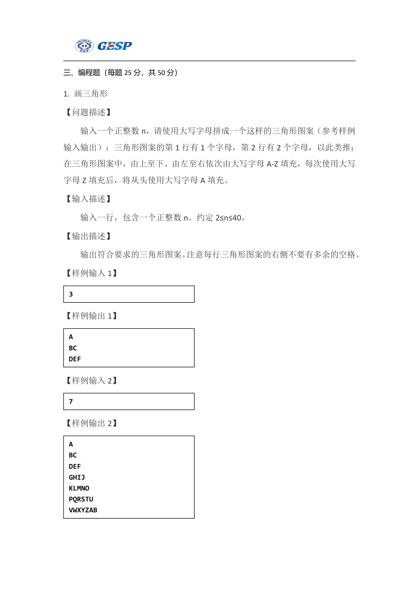

### 提取文本

```
三、编程题（每题25 分，共50 分）

1. 画三角形

【问题描述】

  输入一个正整数n，请使用大写字母拼成一个这样的三角形图案（参考样例
输入输出）：三角形图案的第1 行有1 个字母，第2 行有2 个字母，以此类推；
在三角形图案中，由上至下、由左至右依次由大写字母A-Z 填充，每次使用大写
字母Z 填充后，将从头使用大写字母A 填充。

【输入描述】

  输入一行，包含一个正整数n。约定2≤n≤40。

【输出描述】

  输出符合要求的三角形图案。注意每行三角形图案的右侧不要有多余的空格。

【样例输入1】

 3

【样例输出1】

 A
 BC
 DEF

【样例输入2】

 7

【样例输出2】

 A
 BC
 DEF
 GHIJ
 KLMNO
 PQRSTU
 VWXYZAB
```

## 第 13 页

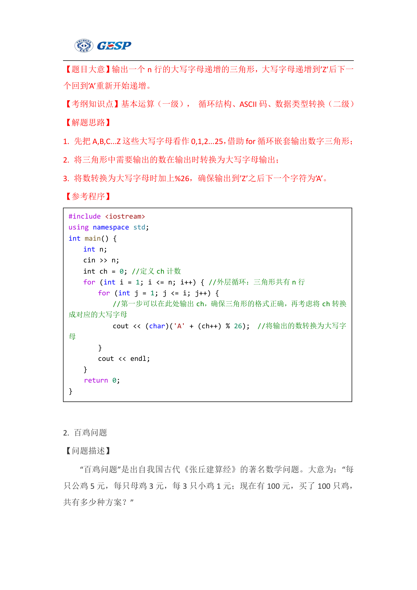

### 提取文本

```
【题目大意】输出一个n 行的大写字母递增的三角形，大写字母递增到’Z’后下一
个回到’A’重新开始递增。

【考纲知识点】基本运算（一级），循环结构、ASCII 码、数据类型转换（二级）

【解题思路】

1. 先把A,B,C...Z 这些大写字母看作0,1,2...25，借助for 循环嵌套输出数字三角形；

2. 将三角形中需要输出的数在输出时转换为大写字母输出；

3. 将数转换为大写字母时加上%26，确保输出到’Z’之后下一个字符为’A’。

【参考程序】

 #include <iostream>
 using namespace std;
 int main() {
     int n;
     cin >> n;
     int ch = 0; //定义ch 计数
     for (int i = 1; i <= n; i++) { //外层循环：三角形共有n 行
         for (int j = 1; j <= i; j++) {
       //第一步可以在此处输出ch，确保三角形的格式正确，再考虑将ch 转换
 成对应的大写字母
            cout << (char)('A' + (ch++) % 26); //将输出的数转换为大写字
 母
         }
         cout << endl;
     }
     return 0;
 }


2. 百鸡问题

【问题描述】

  “百鸡问题”是出自我国古代《张丘建算经》的著名数学问题。大意为：“每
只公鸡5 元，每只母鸡3 元，每3 只小鸡1 元；现在有100 元，买了100 只鸡，
共有多少种方案？”
```

## 第 14 页

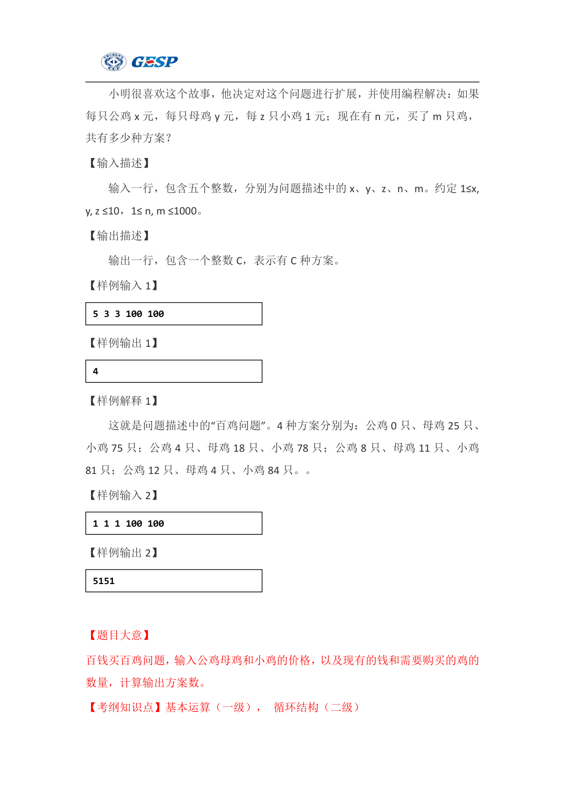

### 提取文本

```
小明很喜欢这个故事，他决定对这个问题进行扩展，并使用编程解决：如果

每只公鸡x 元，每只母鸡y 元，每z 只小鸡1 元；现在有n 元，买了m 只鸡，

共有多少种方案？

【输入描述】

  输入一行，包含五个整数，分别为问题描述中的x、y、z、n、m。约定1≤x,
y, z ≤10，1≤n, m ≤1000。

【输出描述】

  输出一行，包含一个整数C，表示有C 种方案。

【样例输入1】

 5 3 3 100 100

【样例输出1】

 4

【样例解释1】

  这就是问题描述中的“百鸡问题”。4 种方案分别为：公鸡0 只、母鸡25 只、
小鸡75 只；公鸡4 只、母鸡18 只、小鸡78 只；公鸡8 只、母鸡11 只、小鸡
81 只；公鸡12 只、母鸡4 只、小鸡84 只。。

【样例输入2】

 1 1 1 100 100

【样例输出2】

 5151


【题目大意】

百钱买百鸡问题，输入公鸡母鸡和小鸡的价格，以及现有的钱和需要购买的鸡的

数量，计算输出方案数。

【考纲知识点】基本运算（一级），循环结构（二级）
```

## 第 15 页

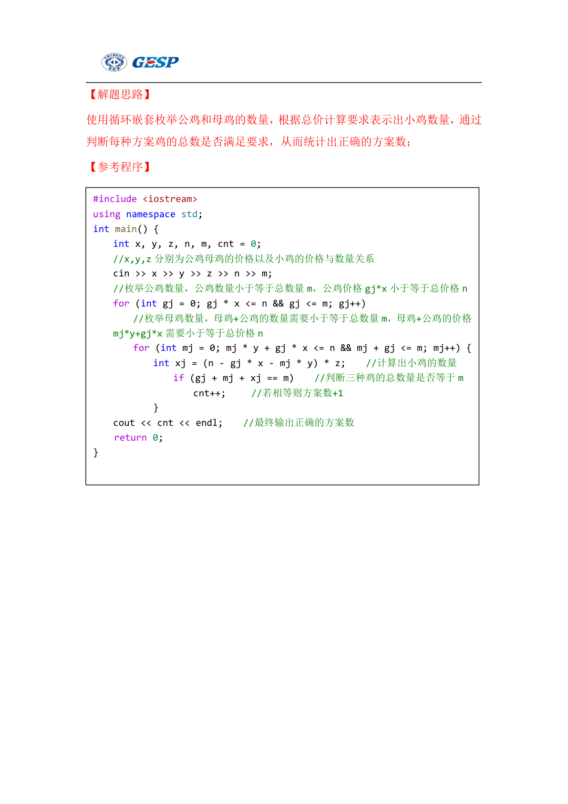

### 提取文本

```
【解题思路】

使用循环嵌套枚举公鸡和母鸡的数量，根据总价计算要求表示出小鸡数量，通过

判断每种方案鸡的总数是否满足要求，从而统计出正确的方案数；

【参考程序】

 #include <iostream>
 using namespace std;
 int main() {
     int x, y, z, n, m, cnt = 0;
     //x,y,z 分别为公鸡母鸡的价格以及小鸡的价格与数量关系
     cin >> x >> y >> z >> n >> m;
   //枚举公鸡数量，公鸡数量小于等于总数量m，公鸡价格gj*x 小于等于总价格n
     for (int gj = 0; gj * x <= n && gj <= m; gj++)
     //枚举母鸡数量，母鸡+公鸡的数量需要小于等于总数量m，母鸡+公鸡的价格
     mj*y+gj*x 需要小于等于总价格n
         for (int mj = 0; mj * y + gj * x <= n && mj + gj <= m; mj++) {
            int xj = (n - gj * x - mj * y) * z;  //计算出小鸡的数量
                if (gj + mj + xj == m)  //判断三种鸡的总数量是否等于m
                    cnt++;   //若相等则方案数+1
            }
     cout << cnt << endl;  //最终输出正确的方案数
     return 0;
 }
```
