# 2023年6月-C++1级

- 原始 PDF：[`pdfs/2023年6月-C++1级.pdf`](../pdfs/2023年6月-C++1级.pdf)
- 页数：16
- 转换脚本：[`scripts/convert_pdfs_to_markdown.py`](../scripts/convert_pdfs_to_markdown.py)

> 为尽量避免信息丢失，每页均附带页面图片；文本提取结果保留原有顺序与换行特征，个别公式、图形、特殊排版请以页面图片为准。

## 第 1 页

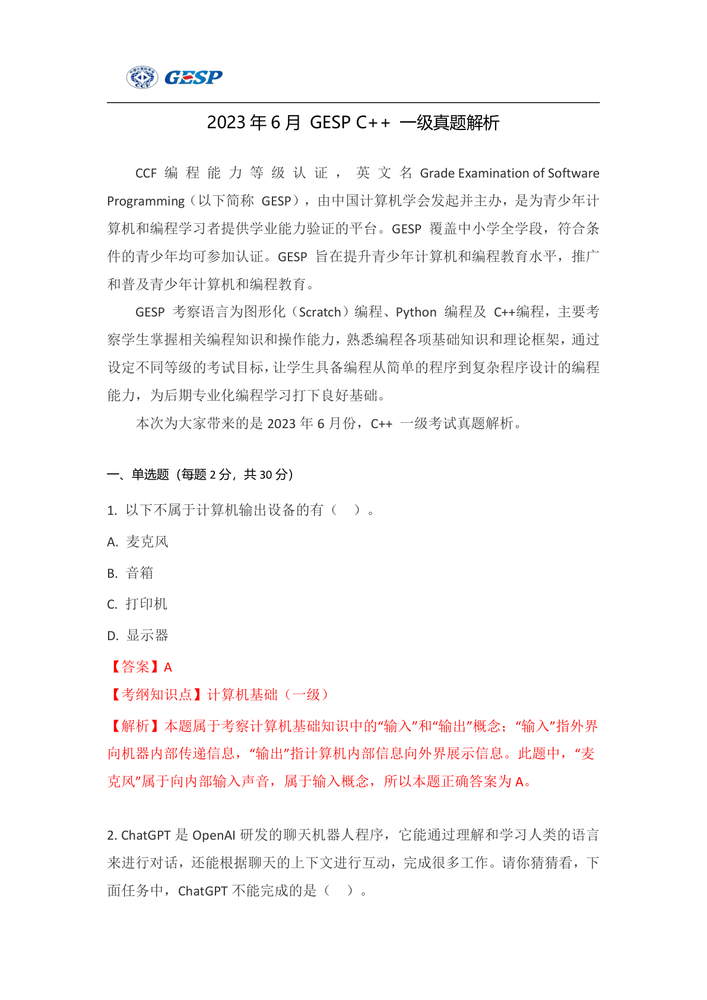

### 提取文本

```
2023 年6 月GESP C++ 一级真题解析


    CCF 编程能力等级认证，英文名Grade Examination of Software
Programming（以下简称GESP），由中国计算机学会发起并主办，是为青少年计
算机和编程学习者提供学业能力验证的平台。GESP 覆盖中小学全学段，符合条
件的青少年均可参加认证。GESP 旨在提升青少年计算机和编程教育水平，推广

和普及青少年计算机和编程教育。

    GESP 考察语言为图形化（Scratch）编程、Python 编程及C++编程，主要考

察学生掌握相关编程知识和操作能力，熟悉编程各项基础知识和理论框架，通过

设定不同等级的考试目标，让学生具备编程从简单的程序到复杂程序设计的编程

能力，为后期专业化编程学习打下良好基础。

  本次为大家带来的是2023 年6 月份，C++ 一级考试真题解析。


一、单选题（每题2 分，共30 分）

1. 以下不属于计算机输出设备的有（ ）。

A. 麦克风

B. 音箱

C. 打印机

D. 显示器

【答案】A

【考纲知识点】计算机基础（一级）

【解析】本题属于考察计算机基础知识中的“输入”和“输出”概念；“输入”指外界
向机器内部传递信息，“输出”指计算机内部信息向外界展示信息。此题中，“麦
克风”属于向内部输入声音，属于输入概念，所以本题正确答案为A。


2. ChatGPT 是OpenAI 研发的聊天机器人程序，它能通过理解和学习人类的语言

来进行对话，还能根据聊天的上下文进行互动，完成很多工作。请你猜猜看，下

面任务中，ChatGPT 不能完成的是（ ）。
```

## 第 2 页

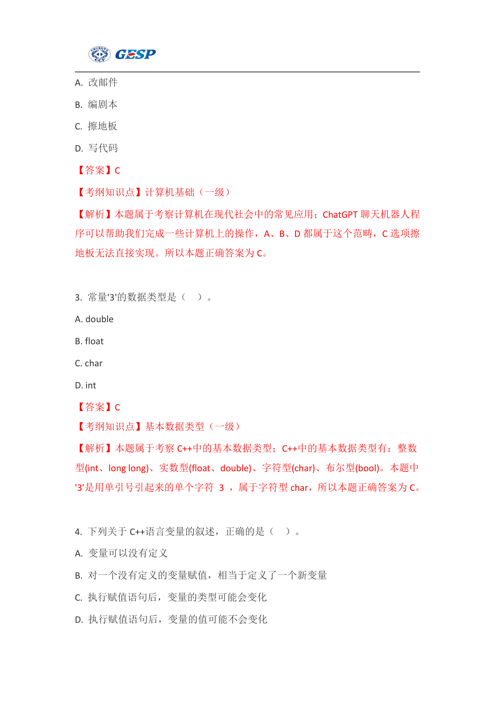

### 提取文本

```
A. 改邮件

B. 编剧本

C. 擦地板

D. 写代码

【答案】C

【考纲知识点】计算机基础（一级）

【解析】本题属于考察计算机在现代社会中的常见应用；ChatGPT 聊天机器人程
序可以帮助我们完成一些计算机上的操作，A、B、D 都属于这个范畴，C 选项擦
地板无法直接实现。所以本题正确答案为C。


3. 常量'3'的数据类型是（ ）。

A. double

B. float

C. char

D. int

【答案】C

【考纲知识点】基本数据类型（一级）

【解析】本题属于考察C++中的基本数据类型；C++中的基本数据类型有：整数
型(int、long long)、实数型(float、double)、字符型(char)、布尔型(bool)。本题中
'3'是用单引号引起来的单个字符3 ，属于字符型char，所以本题正确答案为C。


4. 下列关于C++语言变量的叙述，正确的是（ ）。

A. 变量可以没有定义

B. 对一个没有定义的变量赋值，相当于定义了一个新变量

C. 执行赋值语句后，变量的类型可能会变化

D. 执行赋值语句后，变量的值可能不会变化
```

## 第 3 页

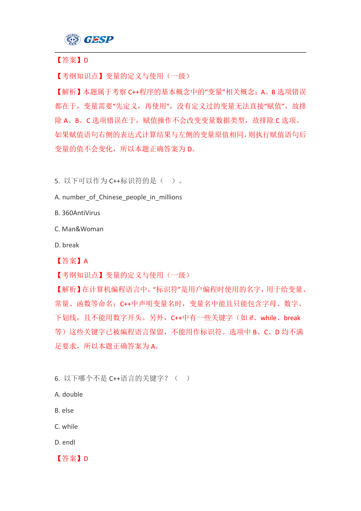

### 提取文本

```
【答案】D

【考纲知识点】变量的定义与使用（一级）

【解析】本题属于考察C++程序的基本概念中的“变量”相关概念；A、B 选项错误
都在于，变量需要“先定义，再使用”，没有定义过的变量无法直接“赋值”，故排
除A、B。C 选项错误在于，赋值操作不会改变变量数据类型，故排除C 选项。

如果赋值语句右侧的表达式计算结果与左侧的变量原值相同，则执行赋值语句后

变量的值不会变化，所以本题正确答案为D。


5. 以下可以作为C++标识符的是（ ）。

A. number_of_Chinese_people_in_millions

B. 360AntiVirus

C. Man&Woman

D. break

【答案】A

【考纲知识点】变量的定义与使用（一级）

【解析】在计算机编程语言中，“标识符”是用户编程时使用的名字，用于给变量、
常量、函数等命名；C++中声明变量名时，变量名中能且只能包含字母、数字、
下划线，且不能用数字开头。另外，C++中有一些关键字（如if、while、break
等）这些关键字已被编程语言保留，不能用作标识符。选项中B、C、D 均不满
足要求，所以本题正确答案为A。


6. 以下哪个不是C++语言的关键字？（ ）

A. double

B. else

C. while

D. endl

【答案】D
```

## 第 4 页

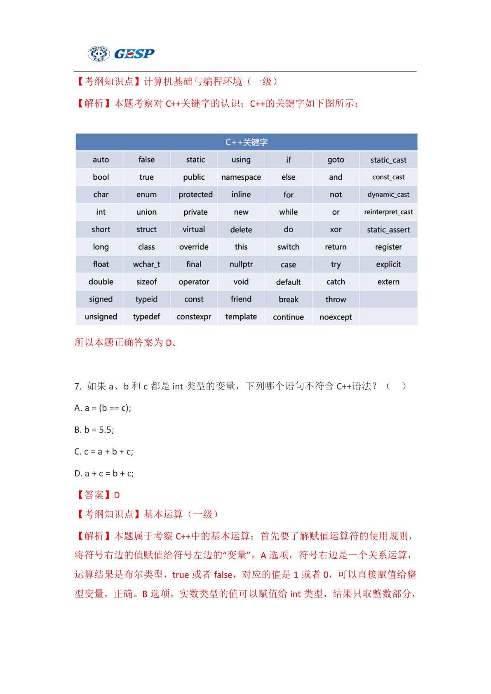

### 提取文本

```
【考纲知识点】计算机基础与编程环境（一级）

【解析】本题考察对C++关键字的认识；C++的关键字如下图所示：


所以本题正确答案为D。


7. 如果a、b 和c 都是int 类型的变量，下列哪个语句不符合C++语法？（ ）

A. a = (b == c);

B. b = 5.5;

C. c = a + b + c;

D. a + c = b + c;

【答案】D

【考纲知识点】基本运算（一级）

【解析】本题属于考察C++中的基本运算；首先要了解赋值运算符的使用规则，
将符号右边的值赋值给符号左边的“变量”。A 选项，符号右边是一个关系运算，
运算结果是布尔类型，true 或者false，对应的值是1 或者0，可以直接赋值给整
型变量，正确。B 选项，实数类型的值可以赋值给int 类型，结果只取整数部分，
```

## 第 5 页

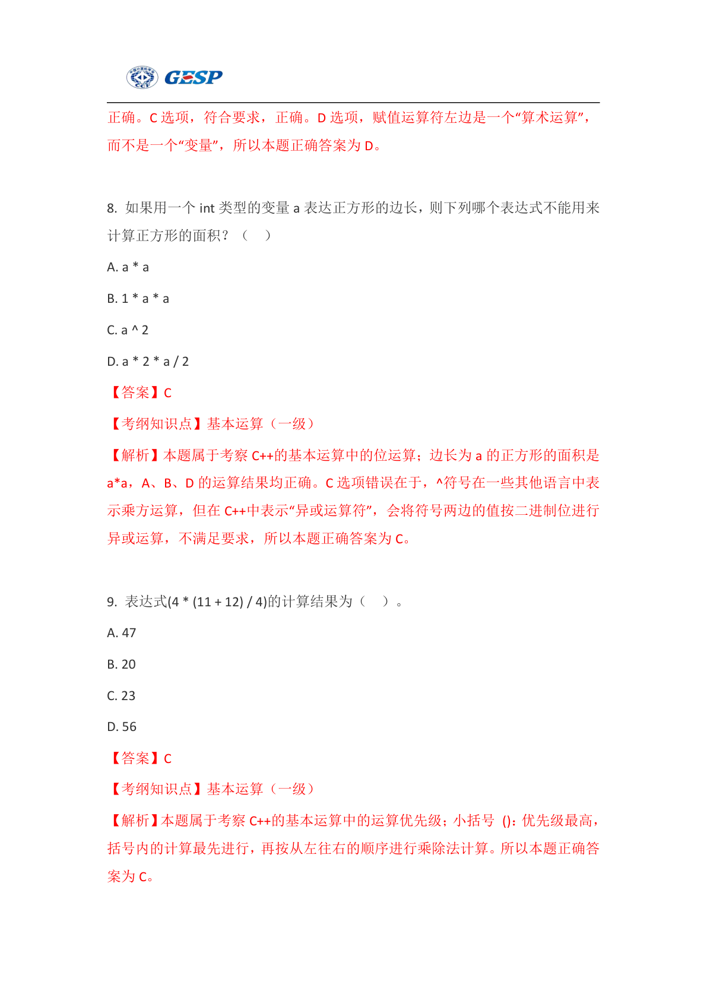

### 提取文本

```
正确。C 选项，符合要求，正确。D 选项，赋值运算符左边是一个“算术运算”，
而不是一个“变量”，所以本题正确答案为D。


8. 如果用一个int 类型的变量a 表达正方形的边长，则下列哪个表达式不能用来

计算正方形的面积？（ ）

A. a * a

B. 1 * a * a

C. a ^ 2

D. a * 2 * a / 2

【答案】C

【考纲知识点】基本运算（一级）

【解析】本题属于考察C++的基本运算中的位运算；边长为a 的正方形的面积是
a*a，A、B、D 的运算结果均正确。C 选项错误在于，^符号在一些其他语言中表
示乘方运算，但在C++中表示“异或运算符”，会将符号两边的值按二进制位进行
异或运算，不满足要求，所以本题正确答案为C。


9. 表达式(4 * (11 + 12) / 4)的计算结果为（ ）。

A. 47

B. 20

C. 23

D. 56

【答案】C

【考纲知识点】基本运算（一级）

【解析】本题属于考察C++的基本运算中的运算优先级；小括号()：优先级最高，

括号内的计算最先进行，再按从左往右的顺序进行乘除法计算。所以本题正确答

案为C。
```

## 第 6 页

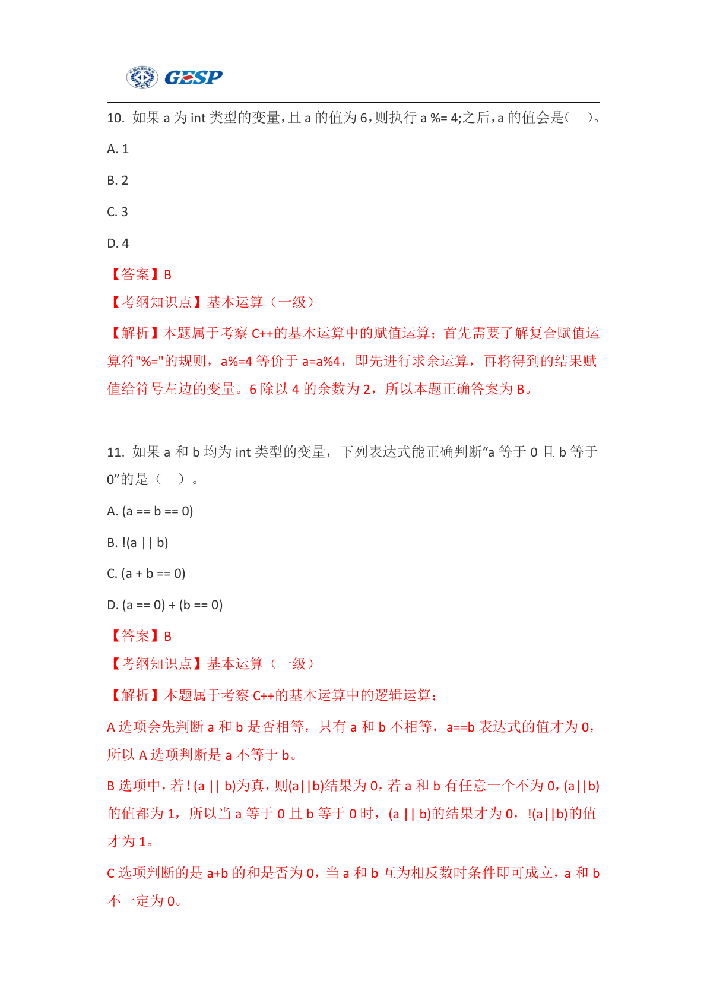

### 提取文本

```
10. 如果a 为int 类型的变量，且a 的值为6，则执行a %= 4;之后，a 的值会是（ ）。

A. 1

B. 2

C. 3

D. 4

【答案】B

【考纲知识点】基本运算（一级）

【解析】本题属于考察C++的基本运算中的赋值运算；首先需要了解复合赋值运
算符"%="的规则，a%=4 等价于a=a%4，即先进行求余运算，再将得到的结果赋
值给符号左边的变量。6 除以4 的余数为2，所以本题正确答案为B。


11. 如果a 和b 均为int 类型的变量，下列表达式能正确判断“a 等于0 且b 等于
0”的是（ ）。

A. (a == b == 0)

B. !(a || b)

C. (a + b == 0)

D. (a == 0) + (b == 0)

【答案】B

【考纲知识点】基本运算（一级）

【解析】本题属于考察C++的基本运算中的逻辑运算；

A 选项会先判断a 和b 是否相等，只有a 和b 不相等，a==b 表达式的值才为0，
所以A 选项判断是a 不等于b。

B 选项中，若！(a || b)为真，则(a||b)结果为0，若a 和b 有任意一个不为0，(a||b)
的值都为1，所以当a 等于0 且b 等于0 时，(a || b)的结果才为0，!(a||b)的值
才为1。

C 选项判断的是a+b 的和是否为0，当a 和b 互为相反数时条件即可成立，a 和b
不一定为0。
```

## 第 7 页

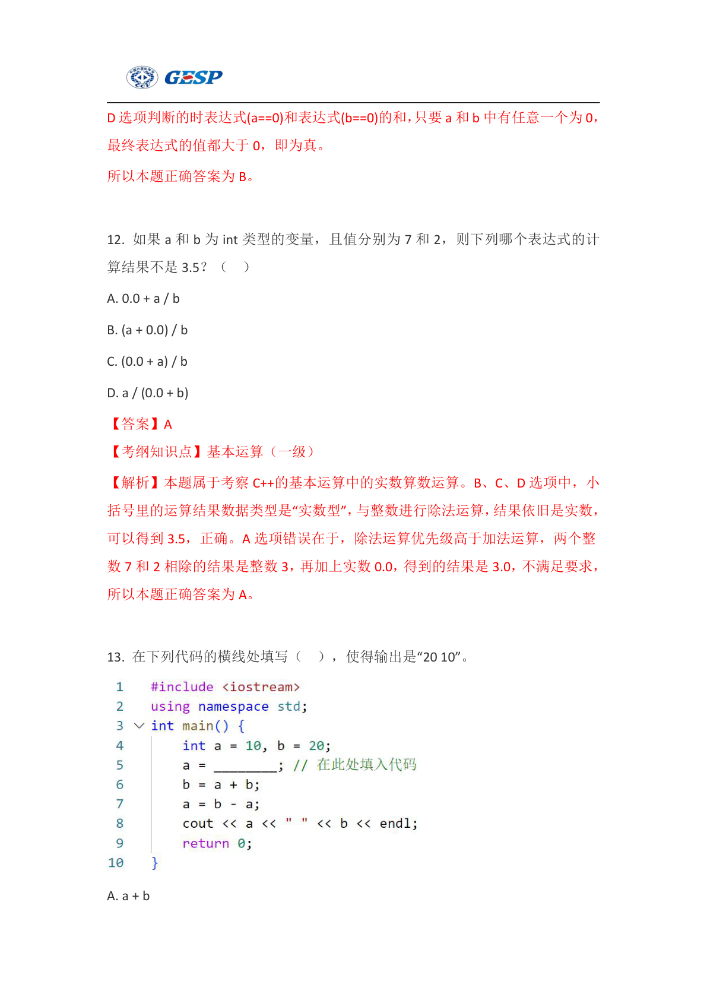

### 提取文本

```
D 选项判断的时表达式(a==0)和表达式(b==0)的和，只要a 和b 中有任意一个为0，
最终表达式的值都大于0，即为真。

所以本题正确答案为B。


12. 如果a 和b 为int 类型的变量，且值分别为7 和2，则下列哪个表达式的计
算结果不是3.5？（ ）

A. 0.0 + a / b

B. (a + 0.0) / b

C. (0.0 + a) / b

D. a / (0.0 + b)

【答案】A

【考纲知识点】基本运算（一级）

【解析】本题属于考察C++的基本运算中的实数算数运算。B、C、D 选项中，小
括号里的运算结果数据类型是“实数型”，与整数进行除法运算，结果依旧是实数，
可以得到3.5，正确。A 选项错误在于，除法运算优先级高于加法运算，两个整
数7 和2 相除的结果是整数3，再加上实数0.0，得到的结果是3.0，不满足要求，
所以本题正确答案为A。


13. 在下列代码的横线处填写（ ），使得输出是“20 10”。


A. a + b
```

## 第 8 页

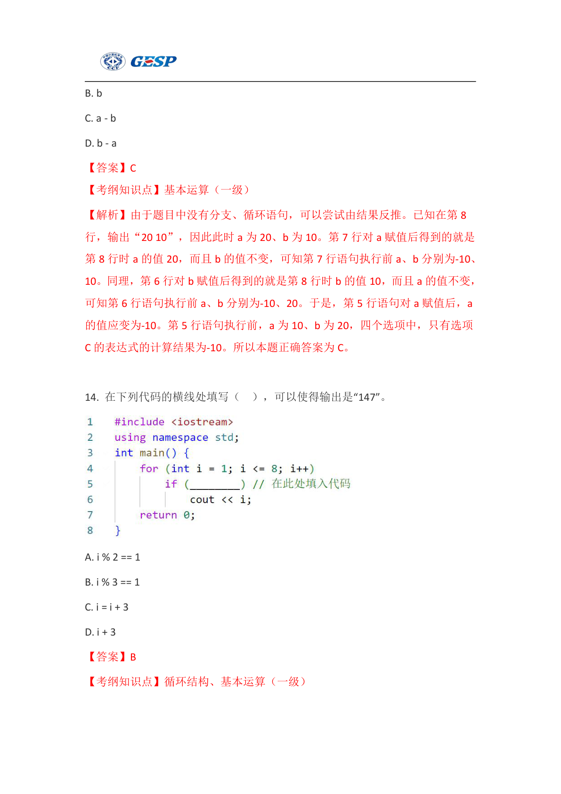

### 提取文本

```
B. b

C. a - b

D. b - a

【答案】C

【考纲知识点】基本运算（一级）

【解析】由于题目中没有分支、循环语句，可以尝试由结果反推。已知在第8
行，输出“20 10”，因此此时a 为20、b 为10。第7 行对a 赋值后得到的就是
第8 行时a 的值20，而且b 的值不变，可知第7 行语句执行前a、b 分别为-10、
10。同理，第6 行对b 赋值后得到的就是第8 行时b 的值10，而且a 的值不变，
可知第6 行语句执行前a、b 分别为-10、20。于是，第5 行语句对a 赋值后，a
的值应变为-10。第5 行语句执行前，a 为10、b 为20，四个选项中，只有选项
C 的表达式的计算结果为-10。所以本题正确答案为C。


14. 在下列代码的横线处填写（ ），可以使得输出是“147”。


A. i % 2 == 1

B. i % 3 == 1

C. i = i + 3

D. i + 3

【答案】B

【考纲知识点】循环结构、基本运算（一级）
```

## 第 9 页

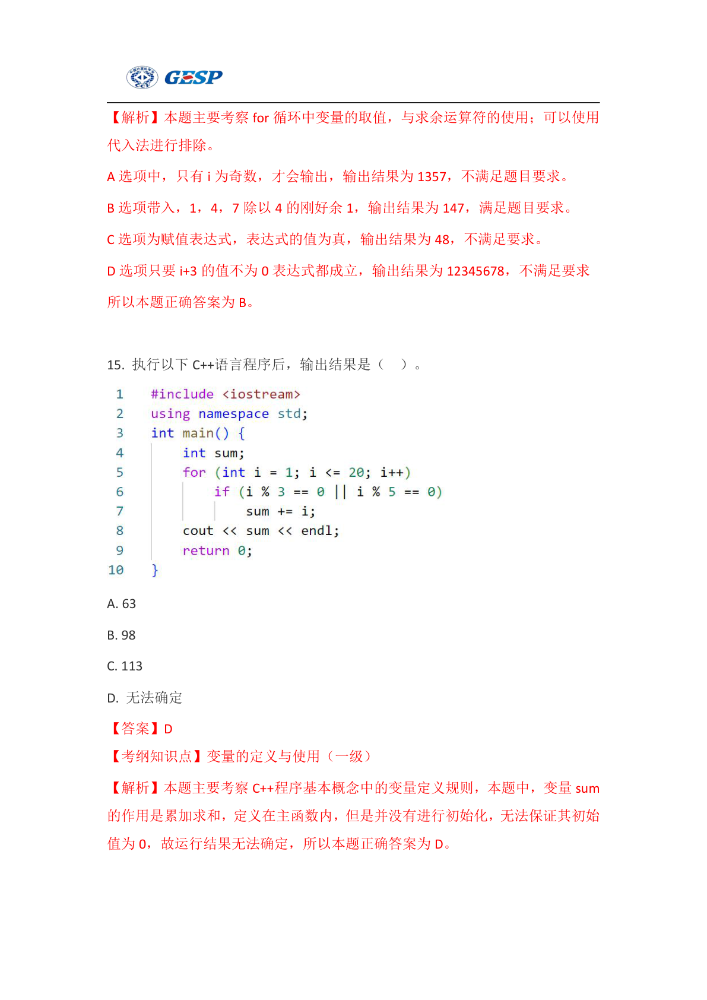

### 提取文本

```
【解析】本题主要考察for 循环中变量的取值，与求余运算符的使用；可以使用

代入法进行排除。

A 选项中，只有i 为奇数，才会输出，输出结果为1357，不满足题目要求。

B 选项带入，1，4，7 除以4 的刚好余1，输出结果为147，满足题目要求。

C 选项为赋值表达式，表达式的值为真，输出结果为48，不满足要求。

D 选项只要i+3 的值不为0 表达式都成立，输出结果为12345678，不满足要求

所以本题正确答案为B。


15. 执行以下C++语言程序后，输出结果是（ ）。


A. 63

B. 98

C. 113

D. 无法确定

【答案】D

【考纲知识点】变量的定义与使用（一级）

【解析】本题主要考察C++程序基本概念中的变量定义规则，本题中，变量sum

的作用是累加求和，定义在主函数内，但是并没有进行初始化，无法保证其初始

值为0，故运行结果无法确定，所以本题正确答案为D。
```

## 第 10 页

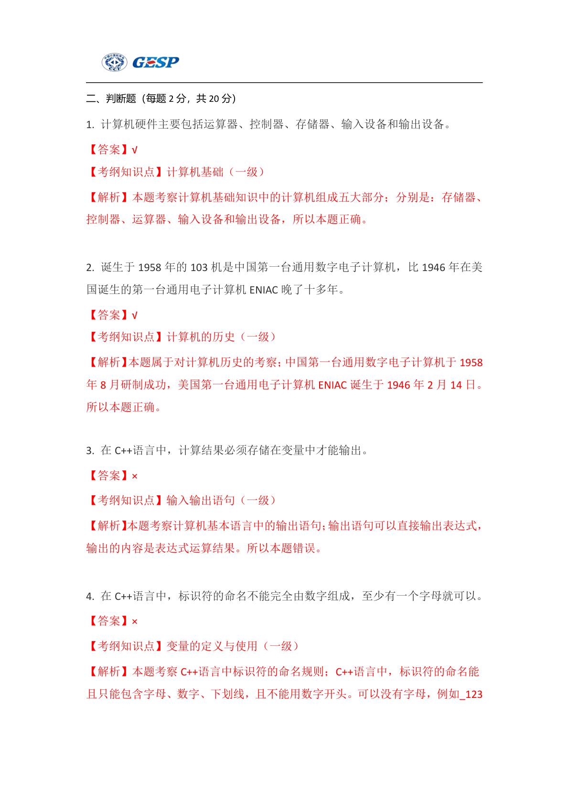

### 提取文本

```
二、判断题（每题2 分，共20 分）

1. 计算机硬件主要包括运算器、控制器、存储器、输入设备和输出设备。

【答案】√

【考纲知识点】计算机基础（一级）

【解析】本题考察计算机基础知识中的计算机组成五大部分；分别是：存储器、

控制器、运算器、输入设备和输出设备，所以本题正确。


2. 诞生于1958 年的103 机是中国第一台通用数字电子计算机，比1946 年在美
国诞生的第一台通用电子计算机ENIAC 晚了十多年。

【答案】√

【考纲知识点】计算机的历史（一级）

【解析】本题属于对计算机历史的考察；中国第一台通用数字电子计算机于1958
年8 月研制成功，美国第一台通用电子计算机ENIAC 诞生于1946 年2 月14 日。

所以本题正确。


3. 在C++语言中，计算结果必须存储在变量中才能输出。

【答案】×

【考纲知识点】输入输出语句（一级）

【解析】本题考察计算机基本语言中的输出语句；输出语句可以直接输出表达式，

输出的内容是表达式运算结果。所以本题错误。


4. 在C++语言中，标识符的命名不能完全由数字组成，至少有一个字母就可以。

【答案】×

【考纲知识点】变量的定义与使用（一级）

【解析】本题考察C++语言中标识符的命名规则；C++语言中，标识符的命名能
且只能包含字母、数字、下划线，且不能用数字开头。可以没有字母，例如_123
```

## 第 11 页

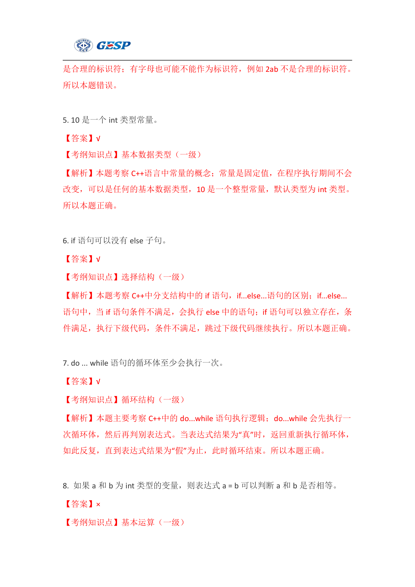

### 提取文本

```
是合理的标识符；有字母也可能不能作为标识符，例如2ab 不是合理的标识符。

所以本题错误。


5. 10 是一个int 类型常量。

【答案】√

【考纲知识点】基本数据类型（一级）

【解析】本题考察C++语言中常量的概念；常量是固定值，在程序执行期间不会
改变，可以是任何的基本数据类型，10 是一个整型常量，默认类型为int 类型。

所以本题正确。


6. if 语句可以没有else 子句。

【答案】√

【考纲知识点】选择结构（一级）

【解析】本题考察C++中分支结构中的if 语句，if...else...语句的区别；if...else...
语句中，当if 语句条件不满足，会执行else 中的语句；if 语句可以独立存在，条

件满足，执行下级代码，条件不满足，跳过下级代码继续执行。所以本题正确。


7. do ... while 语句的循环体至少会执行一次。

【答案】√

【考纲知识点】循环结构（一级）

【解析】本题主要考察C++中的do...while 语句执行逻辑；do...while 会先执行一
次循环体，然后再判别表达式。当表达式结果为“真”时，返回重新执行循环体，
如此反复，直到表达式结果为“假”为止，此时循环结束。所以本题正确。


8. 如果a 和b 为int 类型的变量，则表达式a = b 可以判断a 和b 是否相等。

【答案】×

【考纲知识点】基本运算（一级）
```

## 第 12 页

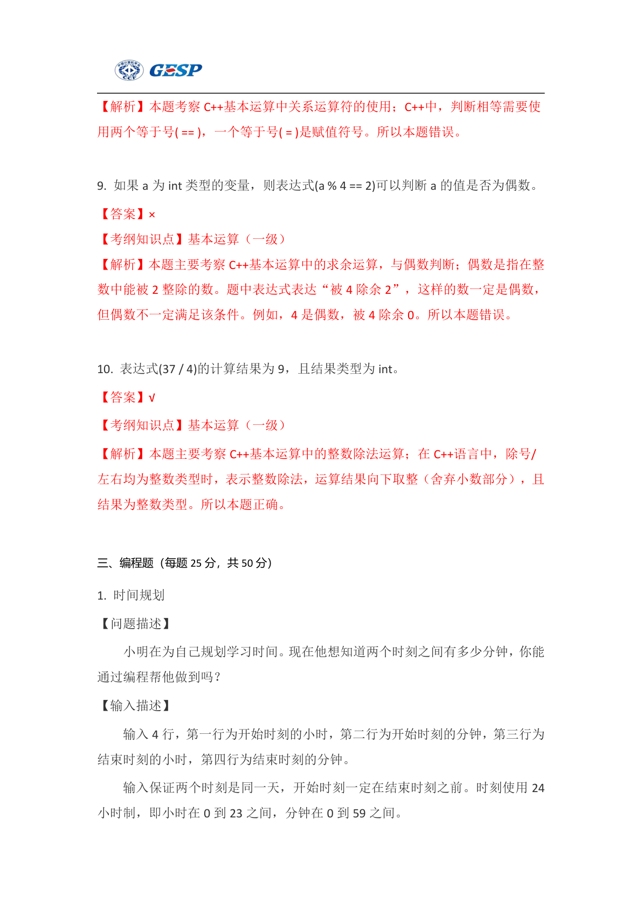

### 提取文本

```
【解析】本题考察C++基本运算中关系运算符的使用；C++中，判断相等需要使
用两个等于号( == )，一个等于号( = )是赋值符号。所以本题错误。


9. 如果a 为int 类型的变量，则表达式(a % 4 == 2)可以判断a 的值是否为偶数。

【答案】×

【考纲知识点】基本运算（一级）

【解析】本题主要考察C++基本运算中的求余运算，与偶数判断；偶数是指在整
数中能被2 整除的数。题中表达式表达“被4 除余2”，这样的数一定是偶数，
但偶数不一定满足该条件。例如，4 是偶数，被4 除余0。所以本题错误。


10. 表达式(37 / 4)的计算结果为9，且结果类型为int。

【答案】√

【考纲知识点】基本运算（一级）

【解析】本题主要考察C++基本运算中的整数除法运算；在C++语言中，除号/

左右均为整数类型时，表示整数除法，运算结果向下取整（舍弃小数部分），且

结果为整数类型。所以本题正确。


三、编程题（每题25 分，共50 分）

1. 时间规划

【问题描述】

  小明在为自己规划学习时间。现在他想知道两个时刻之间有多少分钟，你能

通过编程帮他做到吗？

【输入描述】

  输入4 行，第一行为开始时刻的小时，第二行为开始时刻的分钟，第三行为

结束时刻的小时，第四行为结束时刻的分钟。

  输入保证两个时刻是同一天，开始时刻一定在结束时刻之前。时刻使用24
小时制，即小时在0 到23 之间，分钟在0 到59 之间。
```

## 第 13 页

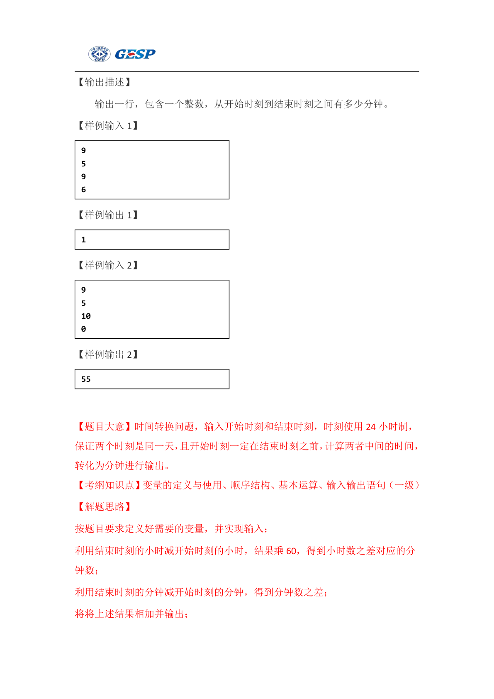

### 提取文本

```
【输出描述】

  输出一行，包含一个整数，从开始时刻到结束时刻之间有多少分钟。

【样例输入1】

 9
 5
 9
 6

【样例输出1】

 1

【样例输入2】

 9
 5
 10
 0

【样例输出2】

 55


【题目大意】时间转换问题，输入开始时刻和结束时刻，时刻使用24 小时制，

保证两个时刻是同一天，且开始时刻一定在结束时刻之前，计算两者中间的时间，

转化为分钟进行输出。

【考纲知识点】变量的定义与使用、顺序结构、基本运算、输入输出语句（一级）

【解题思路】

按题目要求定义好需要的变量，并实现输入；

利用结束时刻的小时减开始时刻的小时，结果乘60，得到小时数之差对应的分

钟数；

利用结束时刻的分钟减开始时刻的分钟，得到分钟数之差；

将将上述结果相加并输出；
```

## 第 14 页

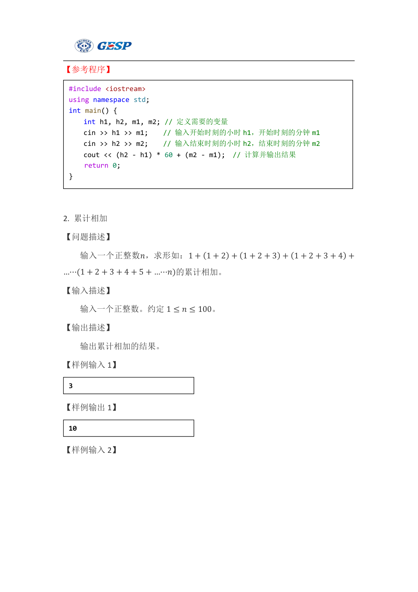

### 提取文本

```
【参考程序】

 #include <iostream>
 using namespace std;
 int main() {
     int h1, h2, m1, m2; // 定义需要的变量
     cin >> h1 >> m1;    // 输入开始时刻的小时h1，开始时刻的分钟m1
     cin >> h2 >> m2;    // 输入结束时刻的小时h2，结束时刻的分钟m2
     cout << (h2 - h1) * 60 + (m2 - m1);  // 计算并输出结果
     return 0;
 }


2. 累计相加

【问题描述】

  输入一个正整数�，求形如：1 + 1 + 2 + 1 + 2 + 3 + 1 + 2 + 3 + 4 +

…⋯(1 + 2 + 3 + 4 + 5 + …⋯�)的累计相加。

【输入描述】

  输入一个正整数。约定1 ≤�≤100。

【输出描述】

  输出累计相加的结果。

【样例输入1】

 3

【样例输出1】

 10

【样例输入2】
```

## 第 15 页

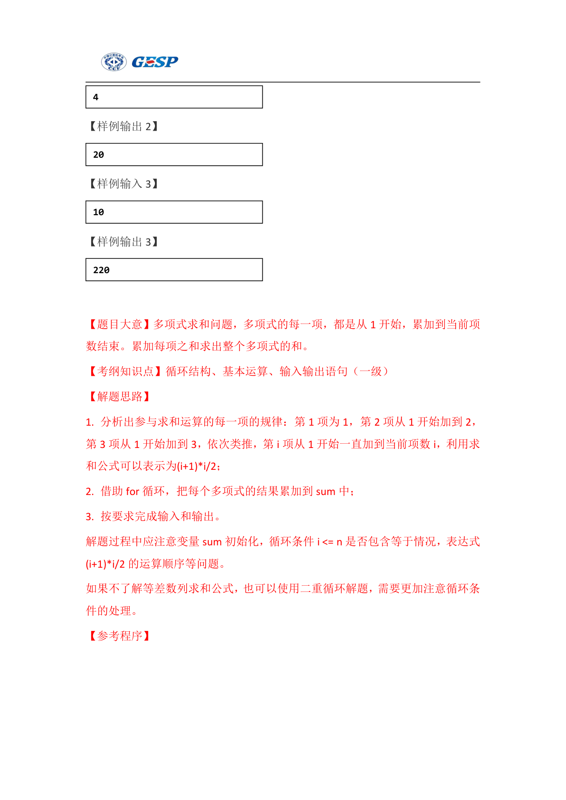

### 提取文本

```
4

【样例输出2】

 20

【样例输入3】

 10

【样例输出3】

 220


【题目大意】多项式求和问题，多项式的每一项，都是从1 开始，累加到当前项

数结束。累加每项之和求出整个多项式的和。

【考纲知识点】循环结构、基本运算、输入输出语句（一级）

【解题思路】

1. 分析出参与求和运算的每一项的规律：第1 项为1，第2 项从1 开始加到2，
第3 项从1 开始加到3，依次类推，第i 项从1 开始一直加到当前项数i，利用求
和公式可以表示为(i+1)*i/2；

2. 借助for 循环，把每个多项式的结果累加到sum 中；

3. 按要求完成输入和输出。

解题过程中应注意变量sum 初始化，循环条件i <= n 是否包含等于情况，表达式
(i+1)*i/2 的运算顺序等问题。

如果不了解等差数列求和公式，也可以使用二重循环解题，需要更加注意循环条

件的处理。

【参考程序】
```

## 第 16 页

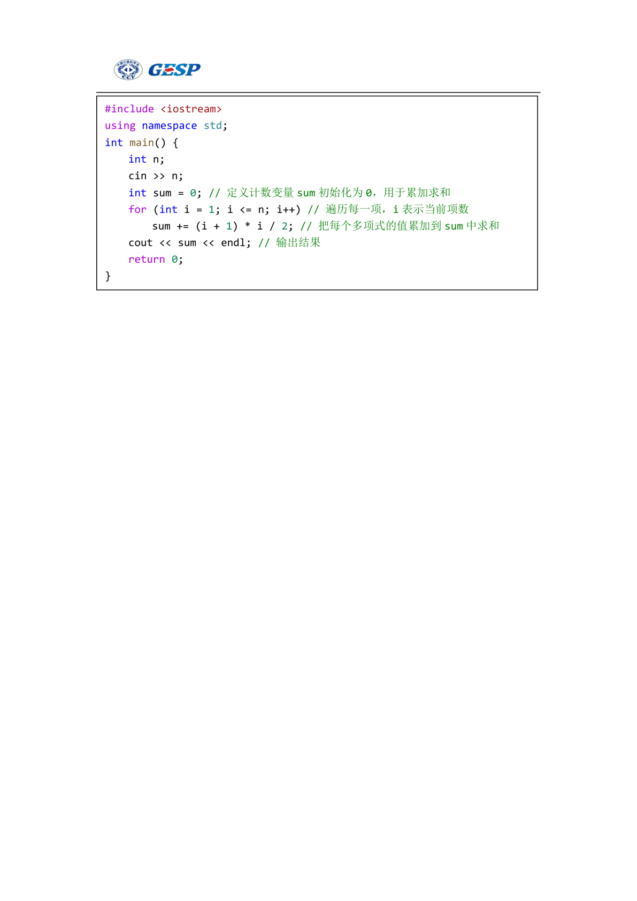

### 提取文本

```
#include <iostream>
using namespace std;
int main() {
    int n;
    cin >> n;
    int sum = 0; // 定义计数变量sum 初始化为0，用于累加求和
    for (int i = 1; i <= n; i++) // 遍历每一项，i 表示当前项数
        sum += (i + 1) * i / 2; // 把每个多项式的值累加到sum 中求和
    cout << sum << endl; // 输出结果
    return 0;
}
```
