# 2023年6月-C++2级

- 原始 PDF：[`pdfs/2023年6月-C++2级.pdf`](../pdfs/2023年6月-C++2级.pdf)
- 页数：16
- 转换脚本：[`scripts/convert_pdfs_to_markdown.py`](../scripts/convert_pdfs_to_markdown.py)

> 为尽量避免信息丢失，每页均附带页面图片；文本提取结果保留原有顺序与换行特征，个别公式、图形、特殊排版请以页面图片为准。

## 第 1 页

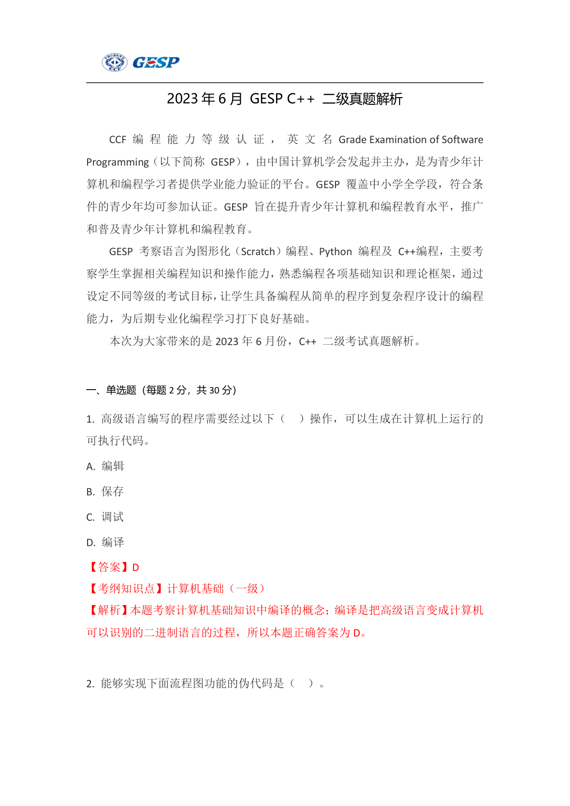

### 提取文本

```
2023 年6 月GESP C++ 二级真题解析


    CCF 编程能力等级认证，英文名Grade Examination of Software
Programming（以下简称GESP），由中国计算机学会发起并主办，是为青少年计
算机和编程学习者提供学业能力验证的平台。GESP 覆盖中小学全学段，符合条
件的青少年均可参加认证。GESP 旨在提升青少年计算机和编程教育水平，推广

和普及青少年计算机和编程教育。

    GESP 考察语言为图形化（Scratch）编程、Python 编程及C++编程，主要考

察学生掌握相关编程知识和操作能力，熟悉编程各项基础知识和理论框架，通过

设定不同等级的考试目标，让学生具备编程从简单的程序到复杂程序设计的编程

能力，为后期专业化编程学习打下良好基础。

  本次为大家带来的是2023 年6 月份，C++ 二级考试真题解析。


一、单选题（每题2 分，共30 分）

1. 高级语言编写的程序需要经过以下（ ）操作，可以生成在计算机上运行的

可执行代码。

A. 编辑

B. 保存

C. 调试

D. 编译

【答案】D

【考纲知识点】计算机基础（一级）

【解析】本题考察计算机基础知识中编译的概念；编译是把高级语言变成计算机

可以识别的二进制语言的过程，所以本题正确答案为D。


2. 能够实现下面流程图功能的伪代码是（ ）。
```

## 第 2 页

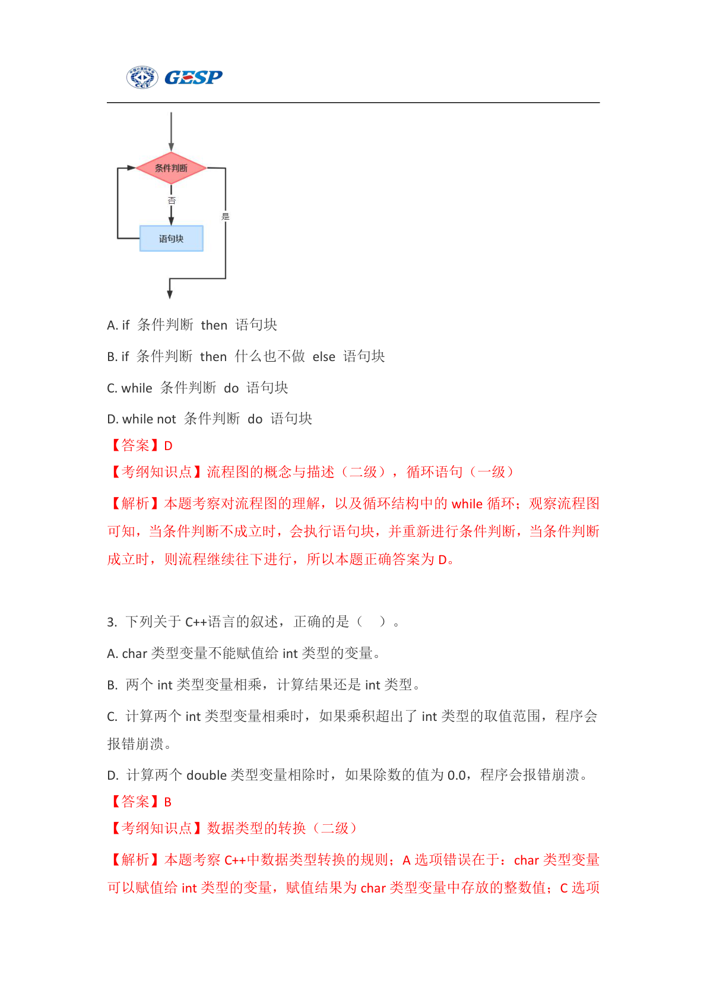

### 提取文本

```
A. if 条件判断then 语句块

B. if 条件判断then 什么也不做else 语句块

C. while 条件判断do 语句块

D. while not 条件判断do 语句块
【答案】D

【考纲知识点】流程图的概念与描述（二级），循环语句（一级）

【解析】本题考察对流程图的理解，以及循环结构中的while 循环；观察流程图

可知，当条件判断不成立时，会执行语句块，并重新进行条件判断，当条件判断

成立时，则流程继续往下进行，所以本题正确答案为D。


3. 下列关于C++语言的叙述，正确的是（ ）。

A. char 类型变量不能赋值给int 类型的变量。

B. 两个int 类型变量相乘，计算结果还是int 类型。

C. 计算两个int 类型变量相乘时，如果乘积超出了int 类型的取值范围，程序会

报错崩溃。

D. 计算两个double 类型变量相除时，如果除数的值为0.0，程序会报错崩溃。
【答案】B

【考纲知识点】数据类型的转换（二级）

【解析】本题考察C++中数据类型转换的规则；A 选项错误在于：char 类型变量
可以赋值给int 类型的变量，赋值结果为char 类型变量中存放的整数值；C 选项
```

## 第 3 页

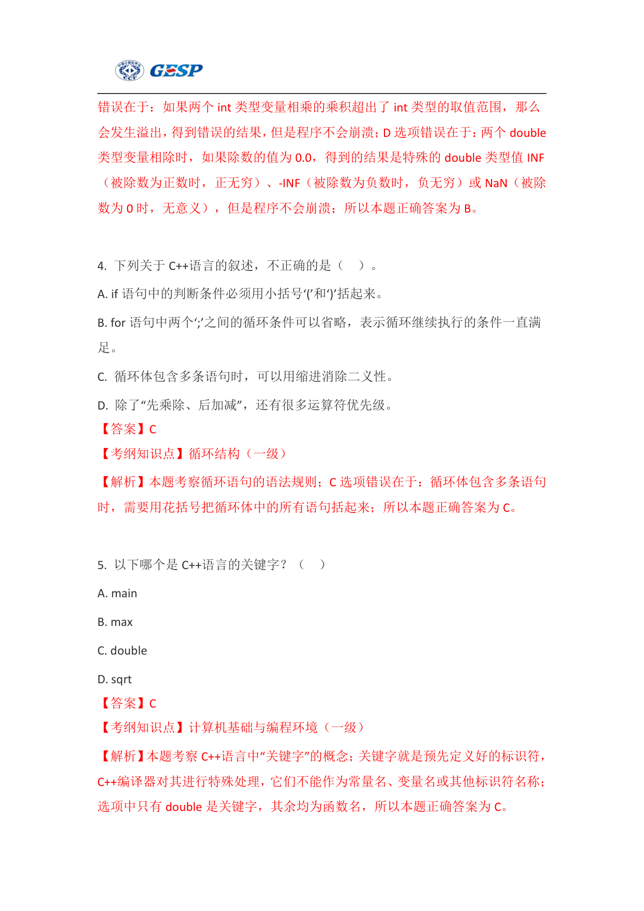

### 提取文本

```
错误在于：如果两个int 类型变量相乘的乘积超出了int 类型的取值范围，那么
会发生溢出，得到错误的结果，但是程序不会崩溃；D 选项错误在于：两个double
类型变量相除时，如果除数的值为0.0，得到的结果是特殊的double 类型值INF
（被除数为正数时，正无穷）、-INF（被除数为负数时，负无穷）或NaN（被除
数为0 时，无意义），但是程序不会崩溃；所以本题正确答案为B。


4. 下列关于C++语言的叙述，不正确的是（ ）。

A. if 语句中的判断条件必须用小括号‘(’和‘)’括起来。

B. for 语句中两个‘;’之间的循环条件可以省略，表示循环继续执行的条件一直满

足。

C. 循环体包含多条语句时，可以用缩进消除二义性。

D. 除了“先乘除、后加减”，还有很多运算符优先级。
【答案】C

【考纲知识点】循环结构（一级）

【解析】本题考察循环语句的语法规则；C 选项错误在于：循环体包含多条语句
时，需要用花括号把循环体中的所有语句括起来；所以本题正确答案为C。


5. 以下哪个是C++语言的关键字？（ ）

A. main

B. max

C. double

D. sqrt
【答案】C

【考纲知识点】计算机基础与编程环境（一级）

【解析】本题考察C++语言中“关键字”的概念；关键字就是预先定义好的标识符，
C++编译器对其进行特殊处理，它们不能作为常量名、变量名或其他标识符名称；
选项中只有double 是关键字，其余均为函数名，所以本题正确答案为C。
```

## 第 4 页

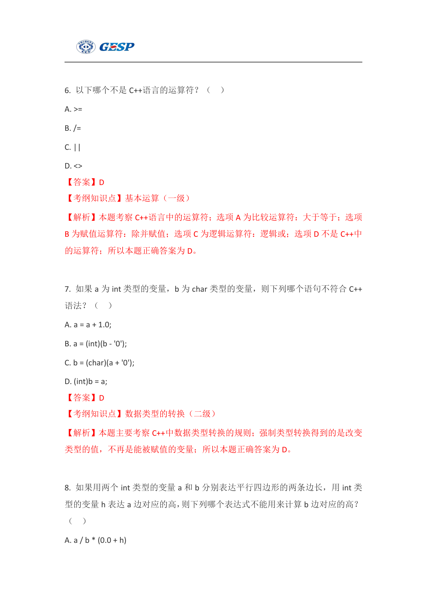

### 提取文本

```
6. 以下哪个不是C++语言的运算符？（ ）

A. >=

B. /=

C. ||

D. <>
【答案】D

【考纲知识点】基本运算（一级）

【解析】本题考察C++语言中的运算符；选项A 为比较运算符：大于等于；选项
B 为赋值运算符：除并赋值；选项C 为逻辑运算符：逻辑或；选项D 不是C++中
的运算符；所以本题正确答案为D。


7. 如果a 为int 类型的变量，b 为char 类型的变量，则下列哪个语句不符合C++

语法？（ ）

A. a = a + 1.0;

B. a = (int)(b - '0');

C. b = (char)(a + '0');

D. (int)b = a;
【答案】D

【考纲知识点】数据类型的转换（二级）

【解析】本题主要考察C++中数据类型转换的规则；强制类型转换得到的是改变
类型的值，不再是能被赋值的变量；所以本题正确答案为D。


8. 如果用两个int 类型的变量a 和b 分别表达平行四边形的两条边长，用int 类
型的变量h 表达a 边对应的高，则下列哪个表达式不能用来计算b 边对应的高？

（ ）

A. a / b * (0.0 + h)
```

## 第 5 页

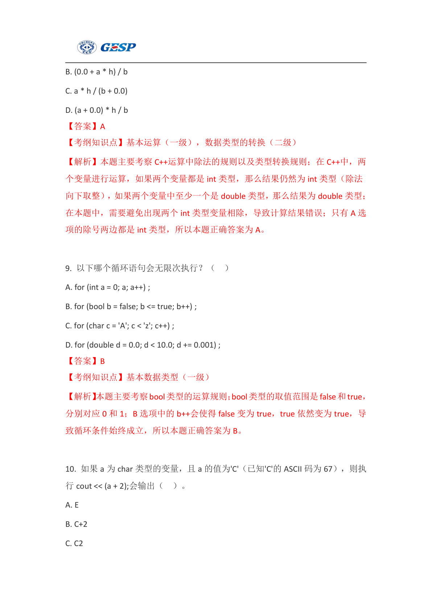

### 提取文本

```
B. (0.0 + a * h) / b

C. a * h / (b + 0.0)

D. (a + 0.0) * h / b
【答案】A

【考纲知识点】基本运算（一级），数据类型的转换（二级）

【解析】本题主要考察C++运算中除法的规则以及类型转换规则；在C++中，两
个变量进行运算，如果两个变量都是int 类型，那么结果仍然为int 类型（除法
向下取整），如果两个变量中至少一个是double 类型，那么结果为double 类型；
在本题中，需要避免出现两个int 类型变量相除，导致计算结果错误；只有A 选
项的除号两边都是int 类型，所以本题正确答案为A。


9. 以下哪个循环语句会无限次执行？（ ）

A. for (int a = 0; a; a++) ;

B. for (bool b = false; b <= true; b++) ;

C. for (char c = 'A'; c < 'z'; c++) ;

D. for (double d = 0.0; d < 10.0; d += 0.001) ;
【答案】B

【考纲知识点】基本数据类型（一级）

【解析】本题主要考察bool 类型的运算规则；bool 类型的取值范围是false 和true，
分别对应0 和1；B 选项中的b++会使得false 变为true，true 依然变为true，导
致循环条件始终成立，所以本题正确答案为B。


10. 如果a 为char 类型的变量，且a 的值为'C'（已知'C'的ASCII 码为67），则执
行cout << (a + 2);会输出（ ）。

A. E

B. C+2

C. C2
```

## 第 6 页

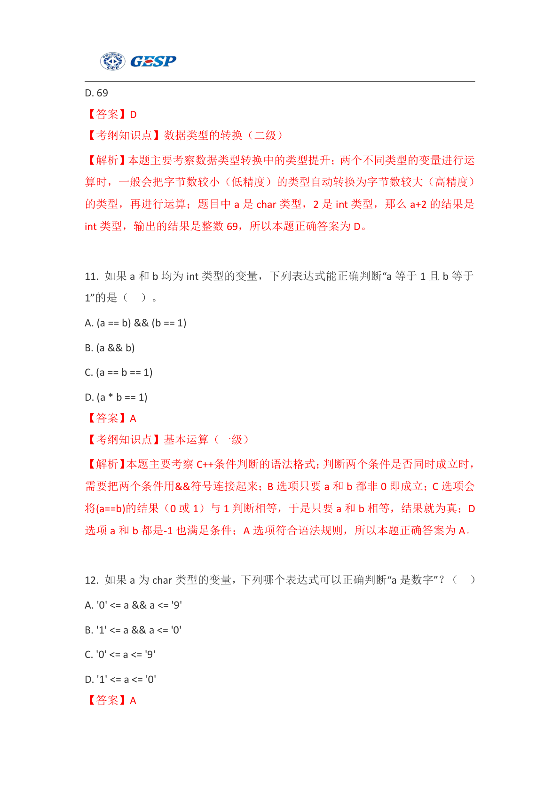

### 提取文本

```
D. 69
【答案】D

【考纲知识点】数据类型的转换（二级）

【解析】本题主要考察数据类型转换中的类型提升；两个不同类型的变量进行运

算时，一般会把字节数较小（低精度）的类型自动转换为字节数较大（高精度）

的类型，再进行运算；题目中a 是char 类型，2 是int 类型，那么a+2 的结果是
int 类型，输出的结果是整数69，所以本题正确答案为D。


11. 如果a 和b 均为int 类型的变量，下列表达式能正确判断“a 等于1 且b 等于
1”的是（ ）。

A. (a == b) && (b == 1)

B. (a && b)

C. (a == b == 1)

D. (a * b == 1)
【答案】A

【考纲知识点】基本运算（一级）

【解析】本题主要考察C++条件判断的语法格式；判断两个条件是否同时成立时，
需要把两个条件用&&符号连接起来；B 选项只要a 和b 都非0 即成立；C 选项会
将(a==b)的结果（0 或1）与1 判断相等，于是只要a 和b 相等，结果就为真；D
选项a 和b 都是-1 也满足条件；A 选项符合语法规则，所以本题正确答案为A。


12. 如果a 为char 类型的变量，下列哪个表达式可以正确判断“a 是数字”？（ ）

A. '0' <= a && a <= '9'

B. '1' <= a && a <= '0'

C. '0' <= a <= '9'

D. '1' <= a <= '0'
【答案】A
```

## 第 7 页

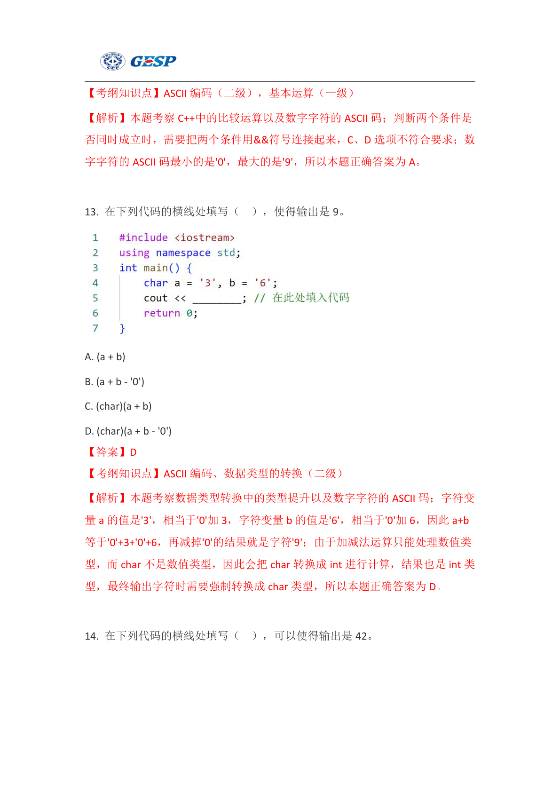

### 提取文本

```
【考纲知识点】ASCII 编码（二级），基本运算（一级）

【解析】本题考察C++中的比较运算以及数字字符的ASCII 码；判断两个条件是
否同时成立时，需要把两个条件用&&符号连接起来，C、D 选项不符合要求；数
字字符的ASCII 码最小的是'0'，最大的是'9'，所以本题正确答案为A。


13. 在下列代码的横线处填写（ ），使得输出是9。


A. (a + b)

B. (a + b - '0')

C. (char)(a + b)

D. (char)(a + b - '0')
【答案】D
【考纲知识点】ASCII 编码、数据类型的转换（二级）

【解析】本题考察数据类型转换中的类型提升以及数字字符的ASCII 码；字符变
量a 的值是'3'，相当于'0'加3，字符变量b 的值是'6'，相当于'0'加6，因此a+b
等于'0'+3+'0'+6，再减掉'0'的结果就是字符'9'；由于加减法运算只能处理数值类
型，而char 不是数值类型，因此会把char 转换成int 进行计算，结果也是int 类
型，最终输出字符时需要强制转换成char 类型，所以本题正确答案为D。


14. 在下列代码的横线处填写（ ），可以使得输出是42。
```

## 第 8 页

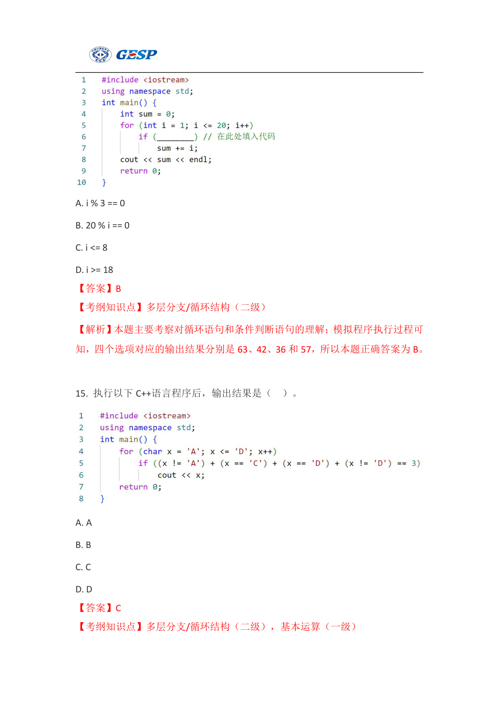

### 提取文本

```
A. i % 3 == 0

B. 20 % i == 0

C. i <= 8

D. i >= 18
【答案】B
【考纲知识点】多层分支/循环结构（二级）

【解析】本题主要考察对循环语句和条件判断语句的理解；模拟程序执行过程可

知，四个选项对应的输出结果分别是63、42、36 和57，所以本题正确答案为B。


15. 执行以下C++语言程序后，输出结果是（ ）。


A. A

B. B

C. C

D. D
【答案】C
【考纲知识点】多层分支/循环结构（二级），基本运算（一级）
```

## 第 9 页

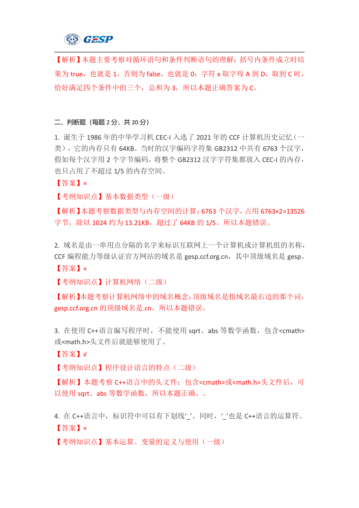

### 提取文本

```
【解析】本题主要考察对循环语句和条件判断语句的理解；括号内条件成立时结

果为true，也就是1，否则为false，也就是0；字符x 取字母A 到D，取到C 时，
恰好满足四个条件中的三个，总和为3，所以本题正确答案为C。


二、判断题（每题2 分，共20 分）

1. 诞生于1986 年的中华学习机CEC-I 入选了2021 年的CCF 计算机历史记忆（一
类），它的内存只有64KB。当时的汉字编码字符集GB2312 中共有6763 个汉字，
假如每个汉字用2 个字节编码，将整个GB2312 汉字字符集都放入CEC-I 的内存，
也只占用了不超过1/5 的内存空间。
【答案】×

【考纲知识点】基本数据类型（一级）

【解析】本题考察数据类型与内存空间的计算；6763 个汉字，占用6763×2=13526
字节，除以1024 约为13.21KB，超过了64KB 的1/5。所以本题错误。

2. 域名是由一串用点分隔的名字来标识互联网上一个计算机或计算机组的名称，
CCF 编程能力等级认证官方网站的域名是gesp.ccf.org.cn，其中顶级域名是gesp。
【答案】×

【考纲知识点】计算机网络（二级）

【解析】本题考察计算机网络中的域名概念；顶级域名是指域名最右边的那个词，
gesp.ccf.org.cn 的顶级域名是.cn。所以本题错误。

3. 在使用C++语言编写程序时，不能使用sqrt、abs 等数学函数，包含<cmath>
或<math.h>头文件后就能够使用了。
【答案】√

【考纲知识点】程序设计语言的特点（二级）

【解析】本题考察C++语言中的头文件；包含<cmath>或<math.h>头文件后，可
以使用sqrt、abs 等数学函数，所以本题正确。。

4. 在C++语言中，标识符中可以有下划线‘_’。同时，‘_’也是C++语言的运算符。
【答案】×

【考纲知识点】基本运算、变量的定义与使用（一级）
```

## 第 10 页

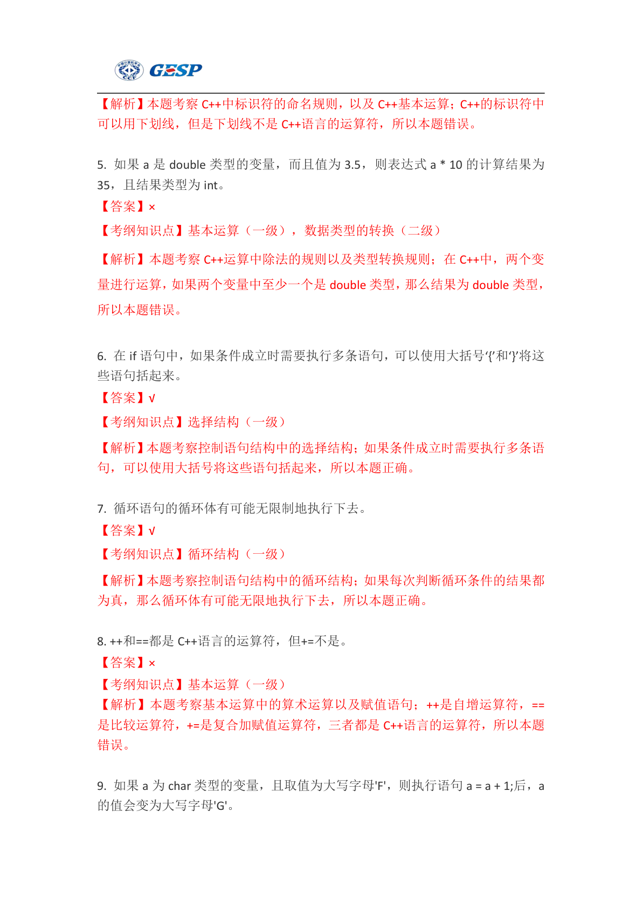

### 提取文本

```
【解析】本题考察C++中标识符的命名规则，以及C++基本运算；C++的标识符中
可以用下划线，但是下划线不是C++语言的运算符，所以本题错误。

5. 如果a 是double 类型的变量，而且值为3.5，则表达式a * 10 的计算结果为
35，且结果类型为int。
【答案】×

【考纲知识点】基本运算（一级），数据类型的转换（二级）

【解析】本题考察C++运算中除法的规则以及类型转换规则；在C++中，两个变
量进行运算，如果两个变量中至少一个是double 类型，那么结果为double 类型，

所以本题错误。


6. 在if 语句中，如果条件成立时需要执行多条语句，可以使用大括号‘{’和‘}’将这
些语句括起来。
【答案】√

【考纲知识点】选择结构（一级）

【解析】本题考察控制语句结构中的选择结构；如果条件成立时需要执行多条语

句，可以使用大括号将这些语句括起来，所以本题正确。

7. 循环语句的循环体有可能无限制地执行下去。
【答案】√

【考纲知识点】循环结构（一级）

【解析】本题考察控制语句结构中的循环结构；如果每次判断循环条件的结果都

为真，那么循环体有可能无限地执行下去，所以本题正确。

8. ++和==都是C++语言的运算符，但+=不是。
【答案】×

【考纲知识点】基本运算（一级）
【解析】本题考察基本运算中的算术运算以及赋值语句；++是自增运算符，==
是比较运算符，+=是复合加赋值运算符，三者都是C++语言的运算符，所以本题
错误。

9. 如果a 为char 类型的变量，且取值为大写字母'F'，则执行语句a = a + 1;后，a
的值会变为大写字母'G'。
```

## 第 11 页

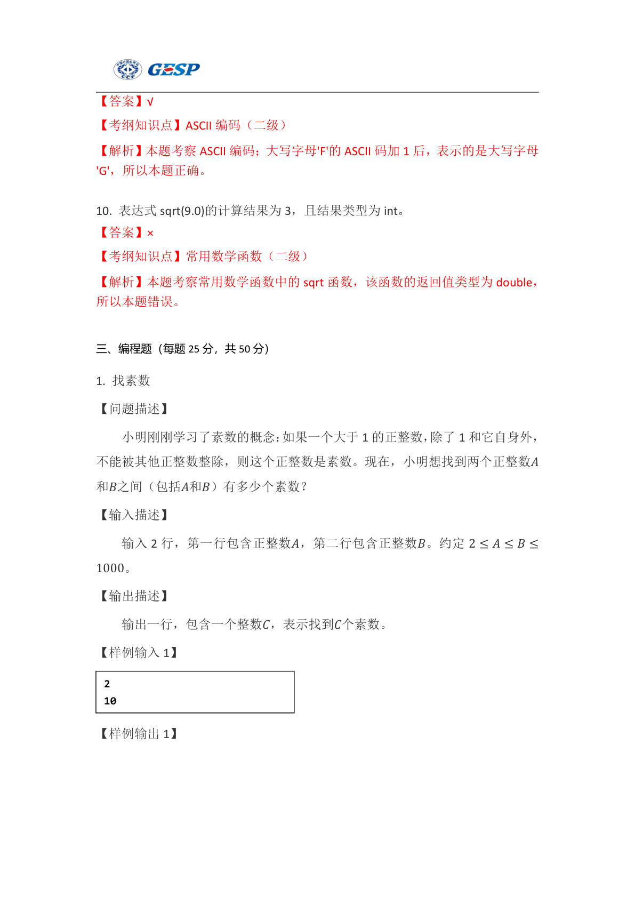

### 提取文本

```
【答案】√
【考纲知识点】ASCII 编码（二级）
【解析】本题考察ASCII 编码；大写字母'F'的ASCII 码加1 后，表示的是大写字母
'G'，所以本题正确。

10. 表达式sqrt(9.0)的计算结果为3，且结果类型为int。
【答案】×

【考纲知识点】常用数学函数（二级）

【解析】本题考察常用数学函数中的sqrt 函数，该函数的返回值类型为double，
所以本题错误。


三、编程题（每题25 分，共50 分）

1. 找素数

【问题描述】

  小明刚刚学习了素数的概念：如果一个大于1 的正整数，除了1 和它自身外，

不能被其他正整数整除，则这个正整数是素数。现在，小明想找到两个正整数�

和�之间（包括�和�）有多少个素数？

【输入描述】

  输入2 行，第一行包含正整数�，第二行包含正整数�。约定2 ≤�≤�≤

1000。

【输出描述】

  输出一行，包含一个整数�，表示找到�个素数。

【样例输入1】

 2
 10

【样例输出1】
```

## 第 12 页

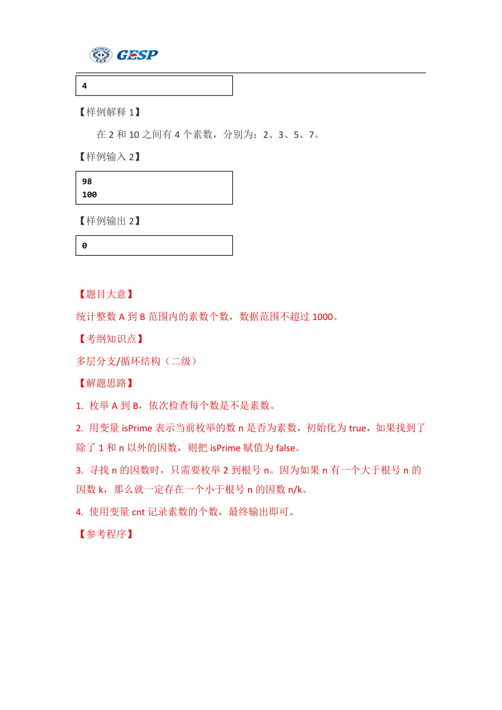

### 提取文本

```
4

【样例解释1】

  在2 和10 之间有4 个素数，分别为：2、3、5、7。

【样例输入2】

 98
 100

【样例输出2】

 0


【题目大意】

统计整数A 到B 范围内的素数个数，数据范围不超过1000。

【考纲知识点】

多层分支/循环结构（二级）

【解题思路】

1. 枚举A 到B，依次检查每个数是不是素数。

2. 用变量isPrime 表示当前枚举的数n 是否为素数，初始化为true，如果找到了
除了1 和n 以外的因数，则把isPrime 赋值为false。

3. 寻找n 的因数时，只需要枚举2 到根号n。因为如果n 有一个大于根号n 的
因数k，那么就一定存在一个小于根号n 的因数n/k。

4. 使用变量cnt 记录素数的个数，最终输出即可。

【参考程序】
```

## 第 13 页

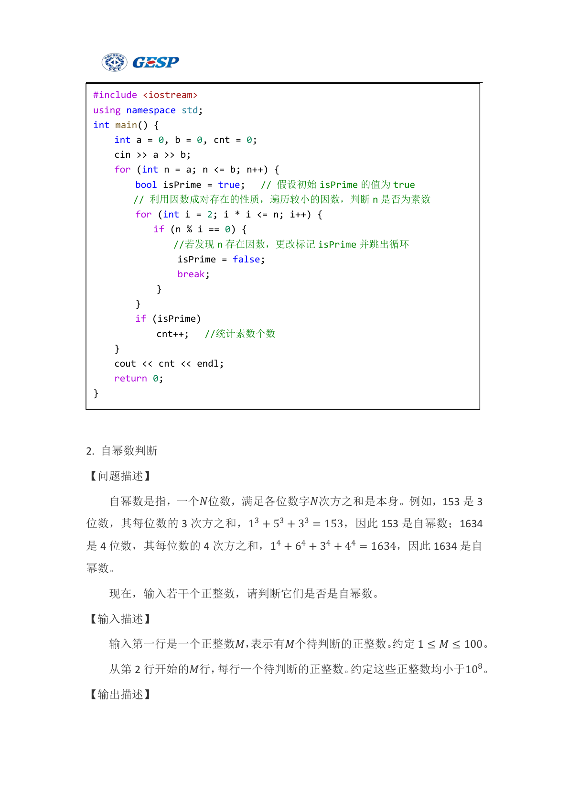

### 提取文本

```
#include <iostream>
 using namespace std;
 int main() {
     int a = 0, b = 0, cnt = 0;
     cin >> a >> b;
     for (int n = a; n <= b; n++) {
         bool isPrime = true;   // 假设初始isPrime 的值为true
         // 利用因数成对存在的性质，遍历较小的因数，判断n 是否为素数
         for (int i = 2; i * i <= n; i++) {
            if (n % i == 0) {
           //若发现n 存在因数，更改标记isPrime 并跳出循环
                 isPrime = false;
                 break;
             }
         }
         if (isPrime)
             cnt++;  //统计素数个数
     }
     cout << cnt << endl;
     return 0;
 }


2. 自幂数判断

【问题描述】

  自幂数是指，一个�位数，满足各位数字�次方之和是本身。例如，153 是3
位数，其每位数的3 次方之和，13 + 53 + 33 = 153，因此153 是自幂数；1634
是4 位数，其每位数的4 次方之和，14 + 64 + 34 + 44 = 1634，因此1634 是自

幂数。

  现在，输入若干个正整数，请判断它们是否是自幂数。

【输入描述】

  输入第一行是一个正整数�，表示有�个待判断的正整数。约定1 ≤�≤100。

  从第2 行开始的�行，每行一个待判断的正整数。约定这些正整数均小于108。

【输出描述】
```

## 第 14 页

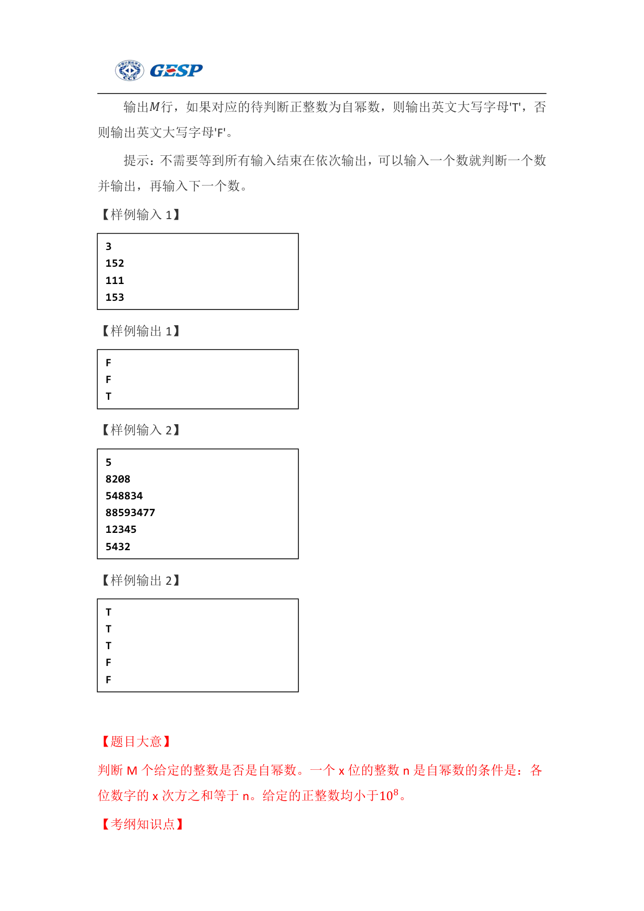

### 提取文本

```
输出�行，如果对应的待判断正整数为自幂数，则输出英文大写字母'T'，否
则输出英文大写字母'F'。

  提示：不需要等到所有输入结束在依次输出，可以输入一个数就判断一个数

并输出，再输入下一个数。

【样例输入1】

 3
 152
 111
 153

【样例输出1】

 F
 F
 T

【样例输入2】

 5
 8208
 548834
 88593477
 12345
 5432

【样例输出2】

 T
 T
 T
 F
 F


【题目大意】

判断M 个给定的整数是否是自幂数。一个x 位的整数n 是自幂数的条件是：各
位数字的x 次方之和等于n。给定的正整数均小于108。

【考纲知识点】
```

## 第 15 页

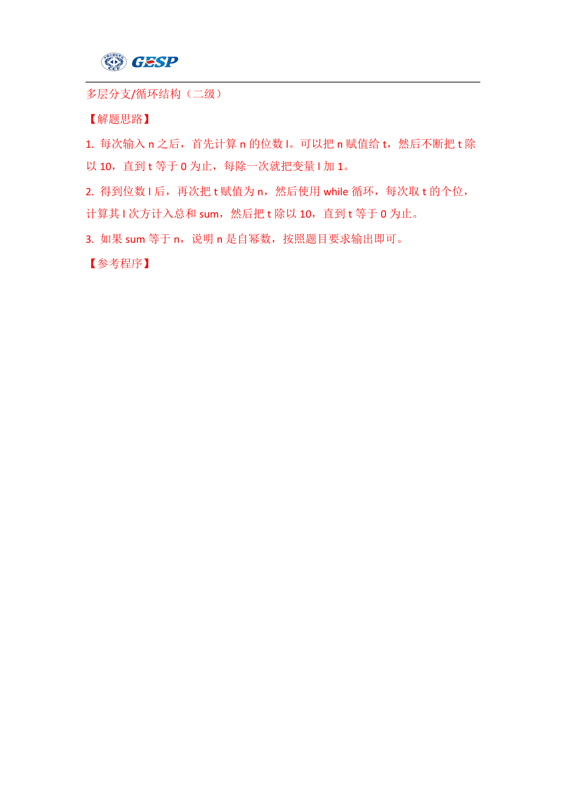

### 提取文本

```
多层分支/循环结构（二级）

【解题思路】

1. 每次输入n 之后，首先计算n 的位数l。可以把n 赋值给t，然后不断把t 除
以10，直到t 等于0 为止，每除一次就把变量l 加1。

2. 得到位数l 后，再次把t 赋值为n，然后使用while 循环，每次取t 的个位，
计算其l 次方计入总和sum，然后把t 除以10，直到t 等于0 为止。

3. 如果sum 等于n，说明n 是自幂数，按照题目要求输出即可。

【参考程序】
```

## 第 16 页

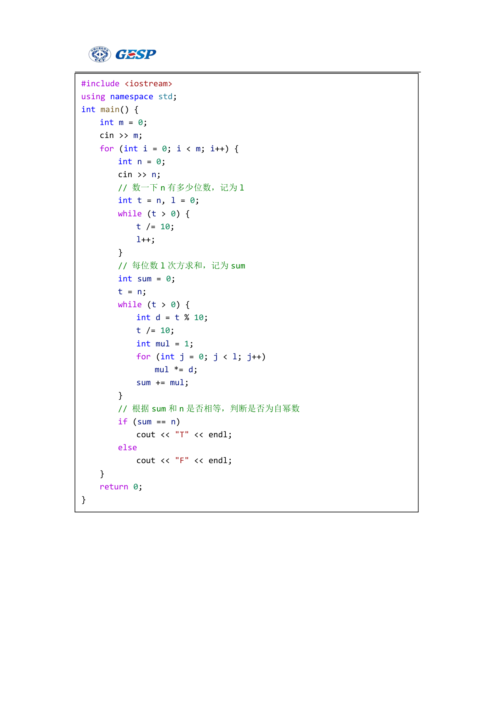

### 提取文本

```
#include <iostream>
using namespace std;
int main() {
    int m = 0;
    cin >> m;
    for (int i = 0; i < m; i++) {
        int n = 0;
        cin >> n;
        // 数一下n 有多少位数，记为l
        int t = n, l = 0;
        while (t > 0) {
            t /= 10;
           l++;
        }
        // 每位数l 次方求和，记为sum
        int sum = 0;
        t = n;
        while (t > 0) {
           int d = t % 10;
            t /= 10;
           int mul = 1;
           for (int j = 0; j < l; j++)
               mul *= d;
           sum += mul;
        }
        // 根据sum 和n 是否相等，判断是否为自幂数
        if (sum == n)
           cout << "T" << endl;
        else
           cout << "F" << endl;
    }
    return 0;
}
```
