# 2023年6月-C++3级

- 原始 PDF：[`pdfs/2023年6月-C++3级.pdf`](../pdfs/2023年6月-C++3级.pdf)
- 页数：15
- 转换脚本：[`scripts/convert_pdfs_to_markdown.py`](../scripts/convert_pdfs_to_markdown.py)

> 为尽量避免信息丢失，每页均附带页面图片；文本提取结果保留原有顺序与换行特征，个别公式、图形、特殊排版请以页面图片为准。

## 第 1 页

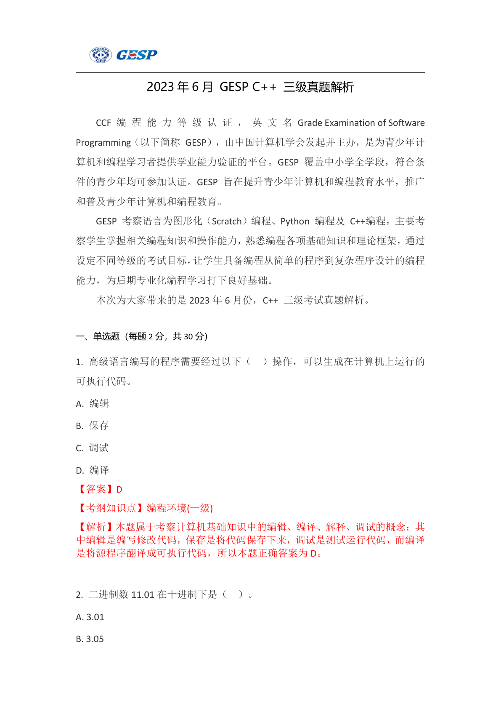

### 提取文本

```
2023 年6 月GESP C++ 三级真题解析


    CCF 编程能力等级认证，英文名Grade Examination of Software
Programming（以下简称GESP），由中国计算机学会发起并主办，是为青少年计
算机和编程学习者提供学业能力验证的平台。GESP 覆盖中小学全学段，符合条
件的青少年均可参加认证。GESP 旨在提升青少年计算机和编程教育水平，推广

和普及青少年计算机和编程教育。

    GESP 考察语言为图形化（Scratch）编程、Python 编程及C++编程，主要考

察学生掌握相关编程知识和操作能力，熟悉编程各项基础知识和理论框架，通过

设定不同等级的考试目标，让学生具备编程从简单的程序到复杂程序设计的编程

能力，为后期专业化编程学习打下良好基础。

  本次为大家带来的是2023 年6 月份，C++ 三级考试真题解析。


一、单选题（每题2 分，共30 分）

1. 高级语言编写的程序需要经过以下（ ）操作，可以生成在计算机上运行的

可执行代码。

A. 编辑

B. 保存

C. 调试

D. 编译
【答案】D
【考纲知识点】编程环境(一级)

【解析】本题属于考察计算机基础知识中的编辑、编译、解释、调试的概念；其
中编辑是编写修改代码，保存是将代码保存下来，调试是测试运行代码，而编译
是将源程序翻译成可执行代码，所以本题正确答案为D。


2. 二进制数11.01 在十进制下是（ ）。

A. 3.01

B. 3.05
```

## 第 2 页

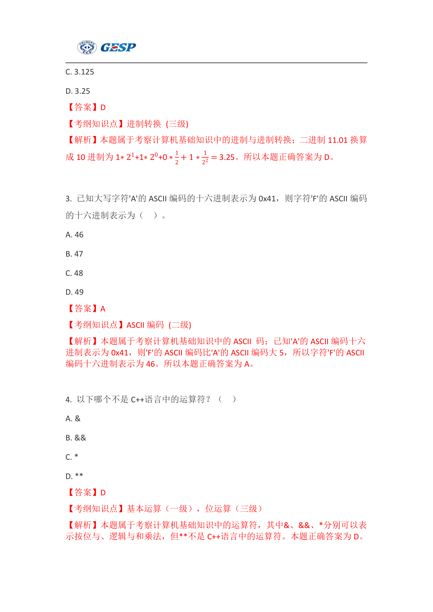

### 提取文本

```
C. 3.125

D. 3.25
【答案】D
【考纲知识点】进制转换(三级)
【解析】本题属于考察计算机基础知识中的进制与进制转换；二进制11.01 换算
成10 进制为1∗21+1∗20+0 ∗ 1 + 1 ∗ 1 = 3.25。所以本题正确答案为D。                                2        22


3. 已知大写字符'A'的ASCII 编码的十六进制表示为0x41，则字符'F'的ASCII 编码

的十六进制表示为（ ）。

A. 46

B. 47

C. 48

D. 49
【答案】A
【考纲知识点】ASCII 编码(二级)
【解析】本题属于考察计算机基础知识中的ASCII 码；已知'A'的ASCII 编码十六
进制表示为0x41，则'F'的ASCII 编码比'A'的ASCII 编码大5，所以字符'F'的ASCII
编码十六进制表示为46。所以本题正确答案为A。


4. 以下哪个不是C++语言中的运算符？（ ）

A. &

B. &&

C. *

D. **
【答案】D

【考纲知识点】基本运算（一级），位运算（三级）

【解析】本题属于考察计算机基础知识中的运算符，其中&、&&、*分别可以表
示按位与、逻辑与和乘法，但**不是C++语言中的运算符。本题正确答案为D。
```

## 第 3 页

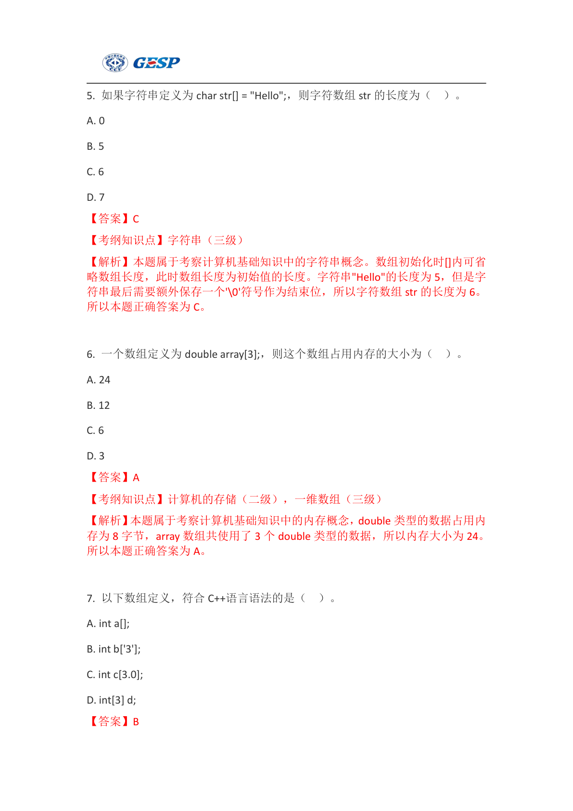

### 提取文本

```
5. 如果字符串定义为char str[] = "Hello";，则字符数组str 的长度为（ ）。

A. 0

B. 5

C. 6

D. 7
【答案】C

【考纲知识点】字符串（三级）

【解析】本题属于考察计算机基础知识中的字符串概念。数组初始化时[]内可省
略数组长度，此时数组长度为初始值的长度。字符串"Hello"的长度为5，但是字
符串最后需要额外保存一个'\0'符号作为结束位，所以字符数组str 的长度为6。
所以本题正确答案为C。


6. 一个数组定义为double array[3];，则这个数组占用内存的大小为（ ）。

A. 24

B. 12

C. 6

D. 3
【答案】A

【考纲知识点】计算机的存储（二级），一维数组（三级）

【解析】本题属于考察计算机基础知识中的内存概念，double 类型的数据占用内
存为8 字节，array 数组共使用了3 个double 类型的数据，所以内存大小为24。
所以本题正确答案为A。


7. 以下数组定义，符合C++语言语法的是（ ）。

A. int a[];

B. int b['3'];

C. int c[3.0];

D. int[3] d;
【答案】B
```

## 第 4 页

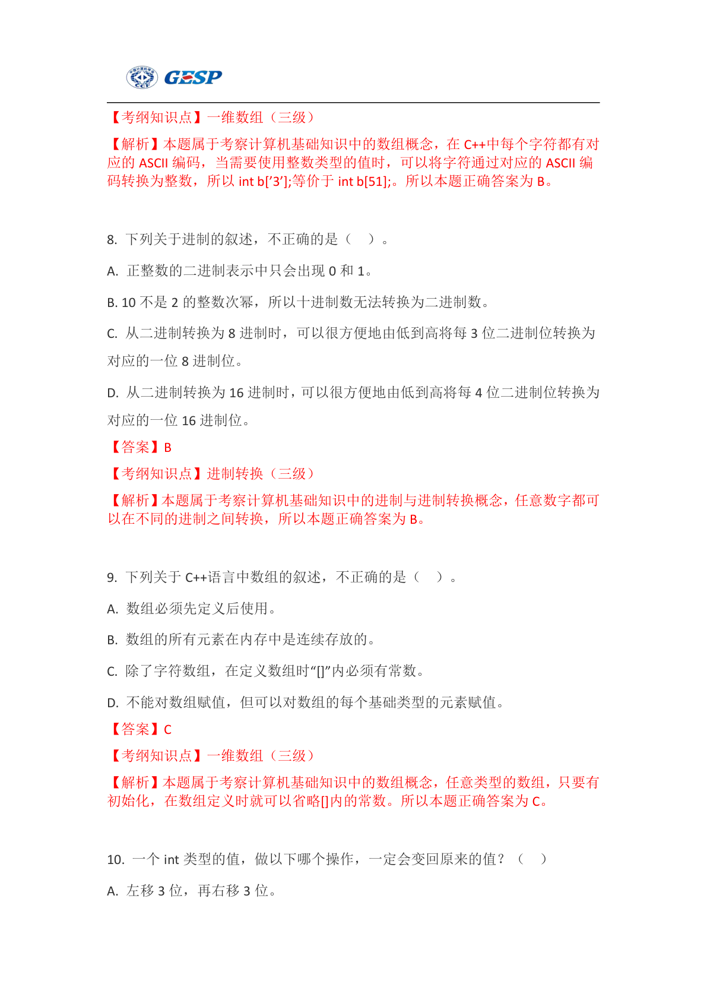

### 提取文本

```
【考纲知识点】一维数组（三级）

【解析】本题属于考察计算机基础知识中的数组概念，在C++中每个字符都有对
应的ASCII 编码，当需要使用整数类型的值时，可以将字符通过对应的ASCII 编
码转换为整数，所以int b[’3’];等价于int b[51];。所以本题正确答案为B。


8. 下列关于进制的叙述，不正确的是（ ）。

A. 正整数的二进制表示中只会出现0 和1。

B. 10 不是2 的整数次幂，所以十进制数无法转换为二进制数。

C. 从二进制转换为8 进制时，可以很方便地由低到高将每3 位二进制位转换为
对应的一位8 进制位。

D. 从二进制转换为16 进制时，可以很方便地由低到高将每4 位二进制位转换为
对应的一位16 进制位。
【答案】B

【考纲知识点】进制转换（三级）

【解析】本题属于考察计算机基础知识中的进制与进制转换概念，任意数字都可
以在不同的进制之间转换，所以本题正确答案为B。


9. 下列关于C++语言中数组的叙述，不正确的是（ ）。

A. 数组必须先定义后使用。

B. 数组的所有元素在内存中是连续存放的。

C. 除了字符数组，在定义数组时“[]”内必须有常数。

D. 不能对数组赋值，但可以对数组的每个基础类型的元素赋值。
【答案】C

【考纲知识点】一维数组（三级）

【解析】本题属于考察计算机基础知识中的数组概念，任意类型的数组，只要有
初始化，在数组定义时就可以省略[]内的常数。所以本题正确答案为C。


10. 一个int 类型的值，做以下哪个操作，一定会变回原来的值？（ ）

A. 左移3 位，再右移3 位。
```

## 第 5 页

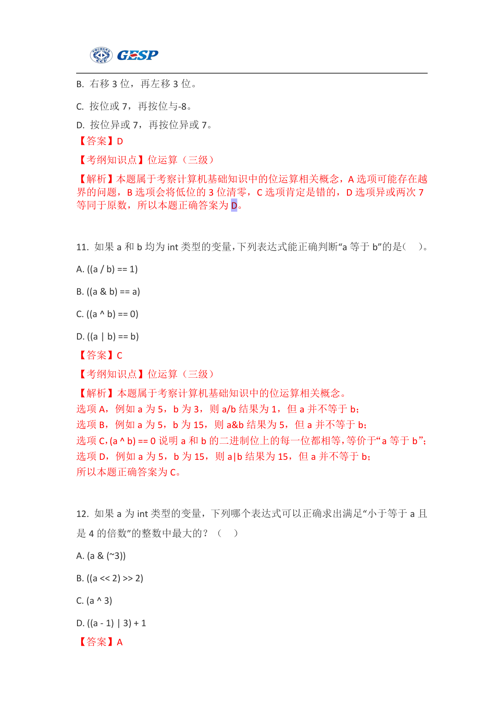

### 提取文本

```
B. 右移3 位，再左移3 位。

C. 按位或7，再按位与-8。
D. 按位异或7，再按位异或7。
【答案】D

【考纲知识点】位运算（三级）

【解析】本题属于考察计算机基础知识中的位运算相关概念，A 选项可能存在越
界的问题，B 选项会将低位的3 位清零，C 选项肯定是错的，D 选项异或两次7
等同于原数，所以本题正确答案为D。


11. 如果a 和b 均为int 类型的变量，下列表达式能正确判断“a 等于b”的是（ ）。

A. ((a / b) == 1)

B. ((a & b) == a)

C. ((a ^ b) == 0)

D. ((a | b) == b)
【答案】C

【考纲知识点】位运算（三级）

【解析】本题属于考察计算机基础知识中的位运算相关概念。
选项A，例如a 为5，b 为3，则a/b 结果为1，但a 并不等于b；
选项B，例如a 为5，b 为15，则a&b 结果为5，但a 并不等于b；
选项C，(a ^ b) == 0 说明a 和b 的二进制位上的每一位都相等，等价于“a 等于b”；
选项D，例如a 为5，b 为15，则a|b 结果为15，但a 并不等于b；
所以本题正确答案为C。


12. 如果a 为int 类型的变量，下列哪个表达式可以正确求出满足“小于等于a 且
是4 的倍数”的整数中最大的？（ ）

A. (a & (~3))

B. ((a << 2) >> 2)

C. (a ^ 3)

D. ((a - 1) | 3) + 1
【答案】A
```

## 第 6 页

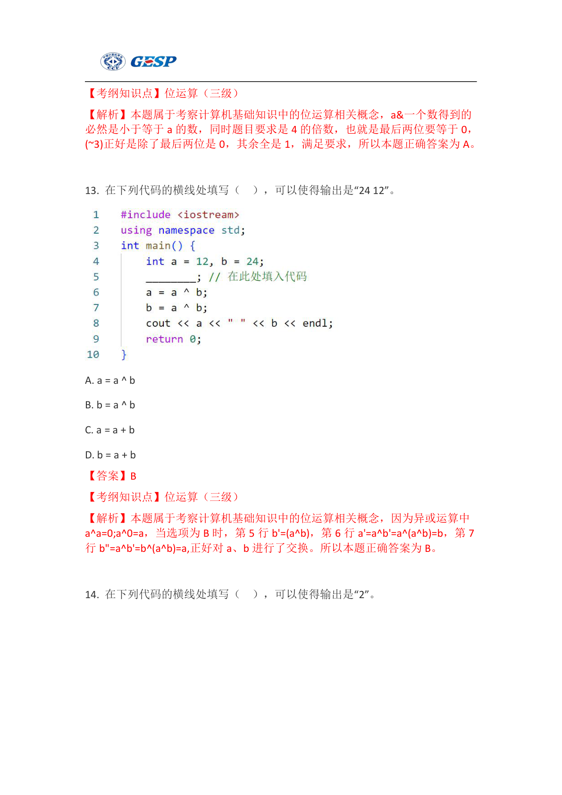

### 提取文本

```
【考纲知识点】位运算（三级）

【解析】本题属于考察计算机基础知识中的位运算相关概念，a&一个数得到的
必然是小于等于a 的数，同时题目要求是4 的倍数，也就是最后两位要等于0，
(~3)正好是除了最后两位是0，其余全是1，满足要求，所以本题正确答案为A。


13. 在下列代码的横线处填写（ ），可以使得输出是“24 12”。


A. a = a ^ b

B. b = a ^ b

C. a = a + b

D. b = a + b
【答案】B

【考纲知识点】位运算（三级）

【解析】本题属于考察计算机基础知识中的位运算相关概念，因为异或运算中
a^a=0;a^0=a，当选项为B 时，第5 行b'=(a^b)，第6 行a'=a^b'=a^(a^b)=b，第7
行b"=a^b'=b^(a^b)=a,正好对a、b 进行了交换。所以本题正确答案为B。


14. 在下列代码的横线处填写（ ），可以使得输出是“2”。
```

## 第 7 页

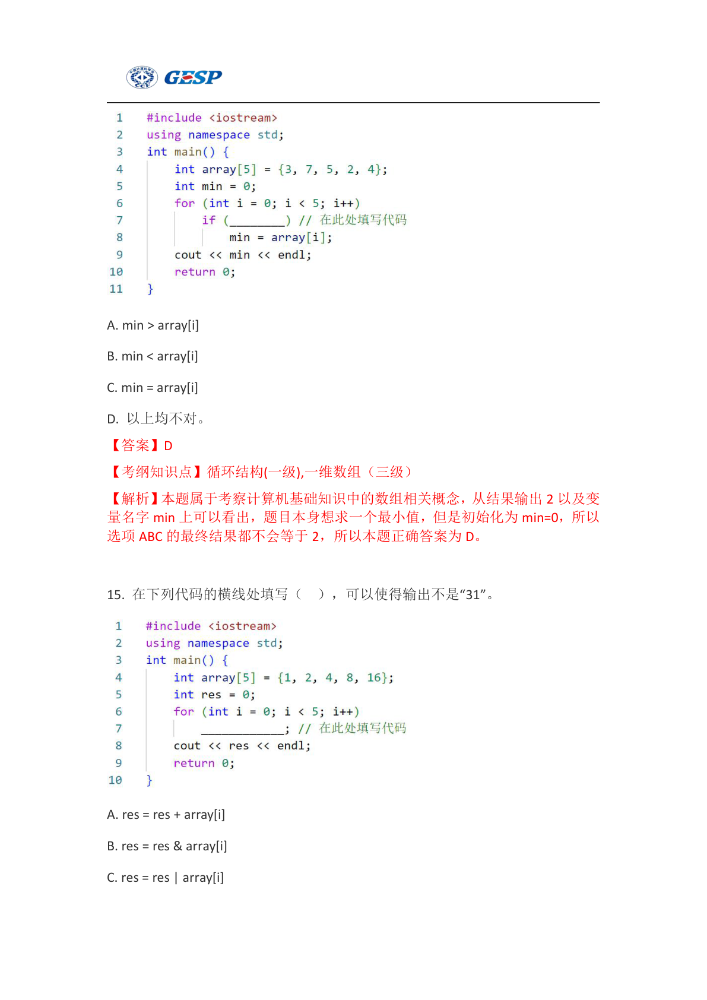

### 提取文本

```
A. min > array[i]

B. min < array[i]

C. min = array[i]

D. 以上均不对。
【答案】D
【考纲知识点】循环结构(一级),一维数组（三级）
【解析】本题属于考察计算机基础知识中的数组相关概念，从结果输出2 以及变
量名字min 上可以看出，题目本身想求一个最小值，但是初始化为min=0，所以
选项ABC 的最终结果都不会等于2，所以本题正确答案为D。


15. 在下列代码的横线处填写（ ），可以使得输出不是“31”。


A. res = res + array[i]

B. res = res & array[i]

C. res = res | array[i]
```

## 第 8 页

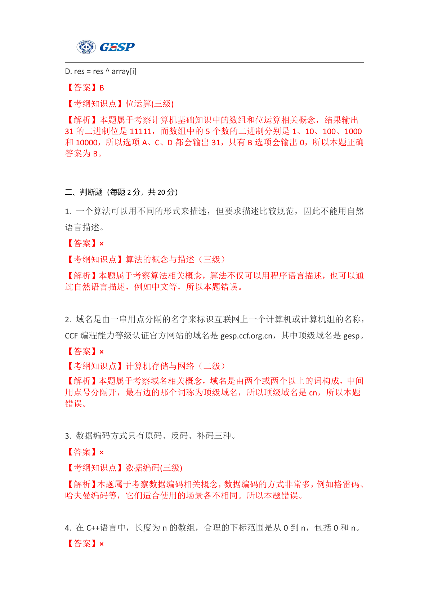

### 提取文本

```
D. res = res ^ array[i]
【答案】B
【考纲知识点】位运算(三级)

【解析】本题属于考察计算机基础知识中的数组和位运算相关概念，结果输出
31 的二进制位是11111，而数组中的5 个数的二进制分别是1、10、100、1000
和10000，所以选项A、C、D 都会输出31，只有B 选项会输出0，所以本题正确
答案为B。


二、判断题（每题2 分，共20 分）

1. 一个算法可以用不同的形式来描述，但要求描述比较规范，因此不能用自然

语言描述。
【答案】×

【考纲知识点】算法的概念与描述（三级）

【解析】本题属于考察算法相关概念，算法不仅可以用程序语言描述，也可以通
过自然语言描述，例如中文等，所以本题错误。


2. 域名是由一串用点分隔的名字来标识互联网上一个计算机或计算机组的名称，
CCF 编程能力等级认证官方网站的域名是gesp.ccf.org.cn，其中顶级域名是gesp。
【答案】×

【考纲知识点】计算机存储与网络（二级）

【解析】本题属于考察域名相关概念，域名是由两个或两个以上的词构成，中间
用点号分隔开，最右边的那个词称为顶级域名，所以顶级域名是cn，所以本题
错误。


3. 数据编码方式只有原码、反码、补码三种。
【答案】×
【考纲知识点】数据编码(三级)

【解析】本题属于考察数据编码相关概念，数据编码的方式非常多，例如格雷码、
哈夫曼编码等，它们适合使用的场景各不相同。所以本题错误。


4. 在C++语言中，长度为n 的数组，合理的下标范围是从0 到n，包括0 和n。
【答案】×
```

## 第 9 页

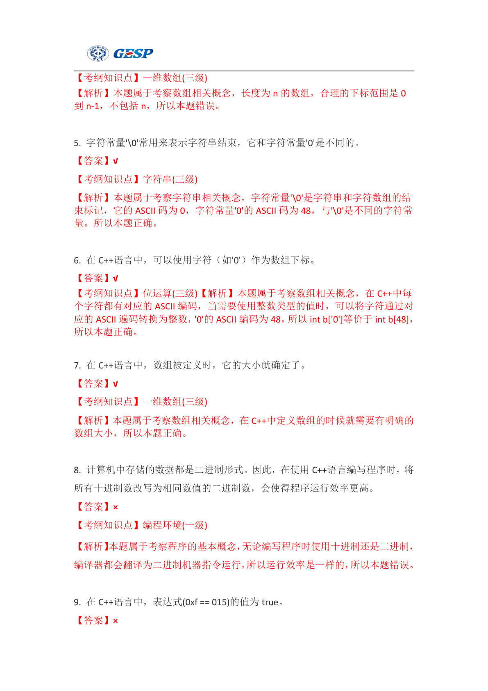

### 提取文本

```
【考纲知识点】一维数组(三级)
【解析】本题属于考察数组相关概念，长度为n 的数组，合理的下标范围是0
到n-1，不包括n，所以本题错误。


5. 字符常量'\0'常用来表示字符串结束，它和字符常量'0'是不同的。
【答案】√
【考纲知识点】字符串(三级)
【解析】本题属于考察字符串相关概念，字符常量'\0'是字符串和字符数组的结
束标记，它的ASCII 码为0，字符常量'0'的ASCII 码为48，与'\0'是不同的字符常
量。所以本题正确。


6. 在C++语言中，可以使用字符（如'0'）作为数组下标。
【答案】√
【考纲知识点】位运算(三级)【解析】本题属于考察数组相关概念，在C++中每
个字符都有对应的ASCII 编码，当需要使用整数类型的值时，可以将字符通过对
应的ASCII 遍码转换为整数，'0'的ASCII 编码为48，所以int b['0']等价于int b[48]，
所以本题正确。


7. 在C++语言中，数组被定义时，它的大小就确定了。
【答案】√
【考纲知识点】一维数组(三级)
【解析】本题属于考察数组相关概念，在C++中定义数组的时候就需要有明确的
数组大小，所以本题正确。


8. 计算机中存储的数据都是二进制形式。因此，在使用C++语言编写程序时，将

所有十进制数改写为相同数值的二进制数，会使得程序运行效率更高。
【答案】×
【考纲知识点】编程环境(一级)

【解析】本题属于考察程序的基本概念，无论编写程序时使用十进制还是二进制，

编译器都会翻译为二进制机器指令运行，所以运行效率是一样的，所以本题错误。


9. 在C++语言中，表达式(0xf == 015)的值为true。
【答案】×
```

## 第 10 页

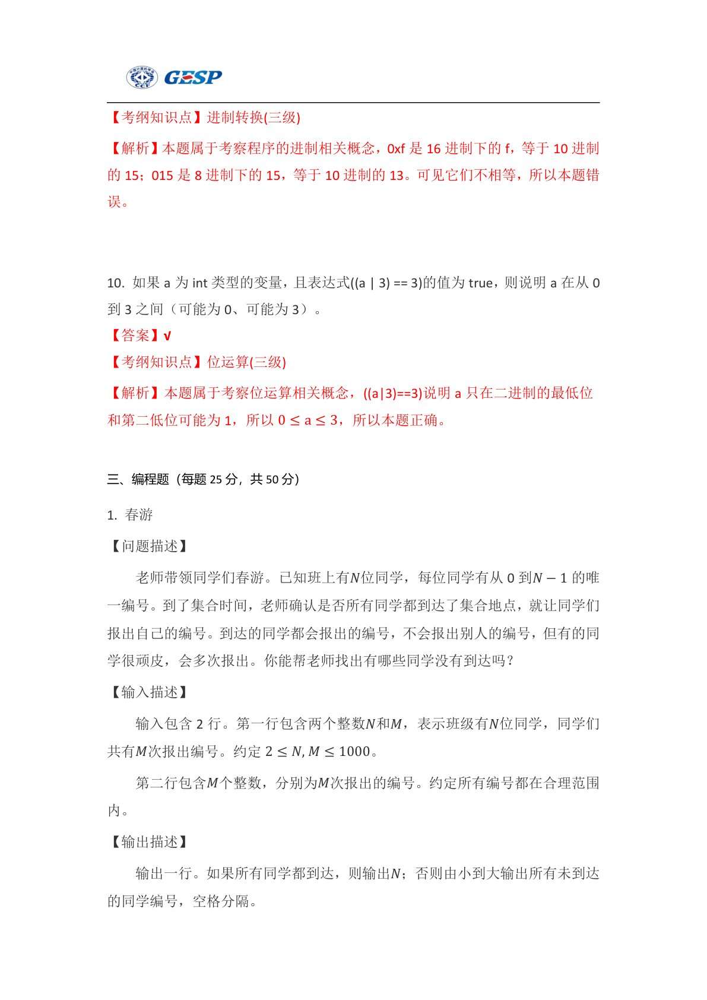

### 提取文本

```
【考纲知识点】进制转换(三级)

【解析】本题属于考察程序的进制相关概念，0xf 是16 进制下的f，等于10 进制
的15；015 是8 进制下的15，等于10 进制的13。可见它们不相等，所以本题错

误。


10. 如果a 为int 类型的变量，且表达式((a | 3) == 3)的值为true，则说明a 在从0
到3 之间（可能为0、可能为3）。
【答案】√
【考纲知识点】位运算(三级)

【解析】本题属于考察位运算相关概念，((a|3)==3)说明a 只在二进制的最低位
和第二低位可能为1，所以0 ≤a ≤3，所以本题正确。


三、编程题（每题25 分，共50 分）

1. 春游

【问题描述】

  老师带领同学们春游。已知班上有�位同学，每位同学有从0 到�−1 的唯

一编号。到了集合时间，老师确认是否所有同学都到达了集合地点，就让同学们

报出自己的编号。到达的同学都会报出的编号，不会报出别人的编号，但有的同

学很顽皮，会多次报出。你能帮老师找出有哪些同学没有到达吗？

【输入描述】

  输入包含2 行。第一行包含两个整数�和�，表示班级有�位同学，同学们

共有�次报出编号。约定2 ≤�, �≤1000。

  第二行包含�个整数，分别为�次报出的编号。约定所有编号都在合理范围

内。

【输出描述】

  输出一行。如果所有同学都到达，则输出�；否则由小到大输出所有未到达

的同学编号，空格分隔。
```

## 第 11 页

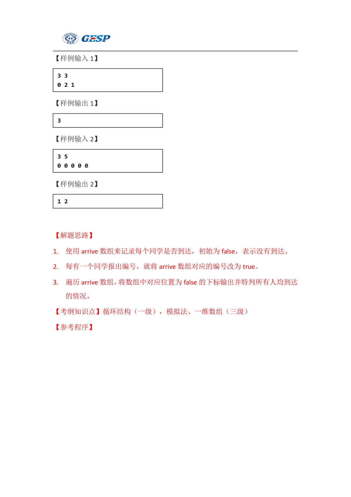

### 提取文本

```
【样例输入1】

 3 3
 0 2 1

【样例输出1】

 3

【样例输入2】

 3 5
 0 0 0 0 0

【样例输出2】

 1 2


【解题思路】

1.  使用arrive 数组来记录每个同学是否到达，初始为false，表示没有到达。

2. 每有一个同学报出编号，就将arrive 数组对应的编号改为true。

3.  遍历arrive 数组，将数组中对应位置为false 的下标输出并特判所有人均到达

  的情况。

【考纲知识点】循环结构（一级），模拟法、一维数组（三级）

【参考程序】
```

## 第 12 页

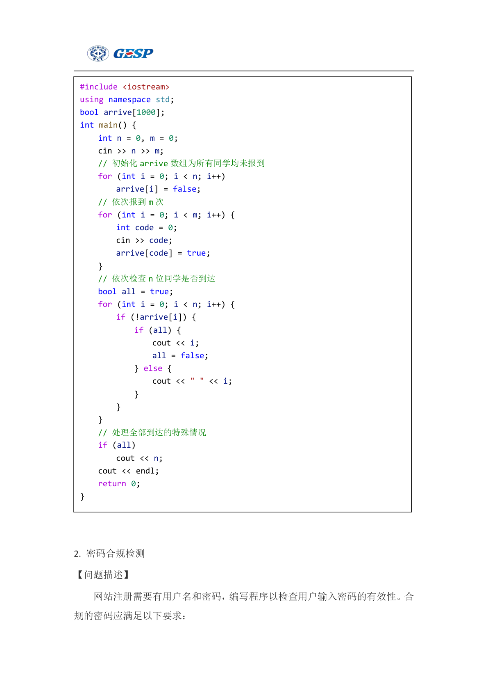

### 提取文本

```
#include <iostream>
 using namespace std;
 bool arrive[1000];
 int main() {
     int n = 0, m = 0;
     cin >> n >> m;
     // 初始化arrive 数组为所有同学均未报到
     for (int i = 0; i < n; i++)
         arrive[i] = false;
     // 依次报到m 次
     for (int i = 0; i < m; i++) {
         int code = 0;
         cin >> code;
         arrive[code] = true;
     }
     // 依次检查n 位同学是否到达
     bool all = true;
     for (int i = 0; i < n; i++) {
         if (!arrive[i]) {
             if (all) {
                 cout << i;
                 all = false;
             } else {
                 cout << " " << i;
             }
         }
     }
     // 处理全部到达的特殊情况
     if (all)
         cout << n;
     cout << endl;
     return 0;
 }


2. 密码合规检测

【问题描述】

  网站注册需要有用户名和密码，编写程序以检查用户输入密码的有效性。合

规的密码应满足以下要求：
```

## 第 13 页

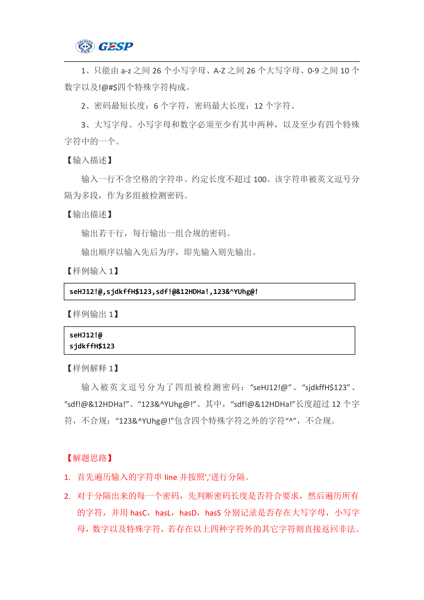

### 提取文本

```
1、只能由a-z 之间26 个小写字母、A-Z 之间26 个大写字母、0-9 之间10 个
数字以及!@#$四个特殊字符构成。

  2、密码最短长度：6 个字符，密码最大长度：12 个字符。

  3、大写字母、小写字母和数字必须至少有其中两种，以及至少有四个特殊

字符中的一个。

【输入描述】

  输入一行不含空格的字符串。约定长度不超过100。该字符串被英文逗号分

隔为多段，作为多组被检测密码。

【输出描述】

  输出若干行，每行输出一组合规的密码。

  输出顺序以输入先后为序，即先输入则先输出。

【样例输入1】

 seHJ12!@,sjdkffH$123,sdf!@&12HDHa!,123&^YUhg@!

【样例输出1】

 seHJ12!@
 sjdkffH$123

【样例解释1】

   输入被英文逗号分为了四组被检测密码：“seHJ12!@”、“sjdkffH$123”、
“sdf!@&12HDHa!”、“123&^YUhg@!”。其中，“sdf!@&12HDHa!”长度超过12 个字
符，不合规；“123&^YUhg@!”包含四个特殊字符之外的字符“^”，不合规。


【解题思路】

1. 首先遍历输入的字符串line 并按照','进行分隔。

2. 对于分隔出来的每一个密码，先判断密码长度是否符合要求，然后遍历所有
  的字符，并用hasC，hasL，hasD，hasS 分别记录是否存在大写字母，小写字

  母，数字以及特殊字符，若存在以上四种字符外的其它字符则直接返回非法。
```

## 第 14 页

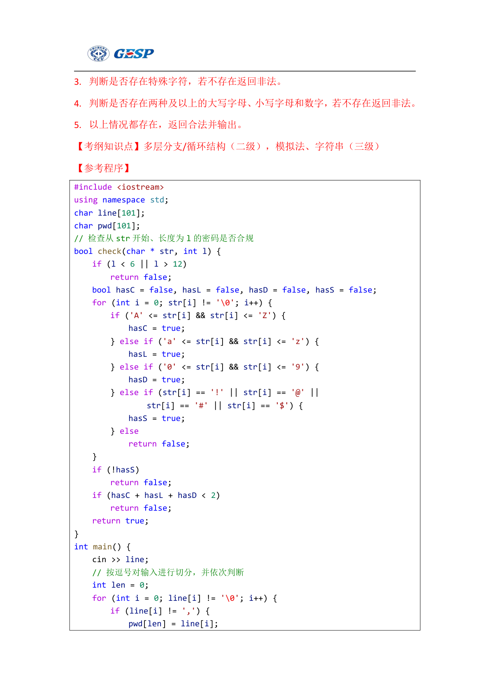

### 提取文本

```
3. 判断是否存在特殊字符，若不存在返回非法。

4. 判断是否存在两种及以上的大写字母、小写字母和数字，若不存在返回非法。

5. 以上情况都存在，返回合法并输出。

【考纲知识点】多层分支/循环结构（二级），模拟法、字符串（三级）

【参考程序】

#include <iostream>
using namespace std;
char line[101];
char pwd[101];
// 检查从str 开始、长度为l 的密码是否合规
bool check(char * str, int l) {
    if (l < 6 || l > 12)
        return false;
    bool hasC = false, hasL = false, hasD = false, hasS = false;
    for (int i = 0; str[i] != '\0'; i++) {
        if ('A' <= str[i] && str[i] <= 'Z') {
           hasC = true;
        } else if ('a' <= str[i] && str[i] <= 'z') {
           hasL = true;
        } else if ('0' <= str[i] && str[i] <= '9') {
           hasD = true;
        } else if (str[i] == '!' || str[i] == '@' ||
               str[i] == '#' || str[i] == '$') {
           hasS = true;
        } else
           return false;
    }
    if (!hasS)
        return false;
    if (hasC + hasL + hasD < 2)
        return false;
    return true;
}
int main() {
    cin >> line;
    // 按逗号对输入进行切分，并依次判断
    int len = 0;
    for (int i = 0; line[i] != '\0'; i++) {
        if (line[i] != ',') {
           pwd[len] = line[i];
```

## 第 15 页

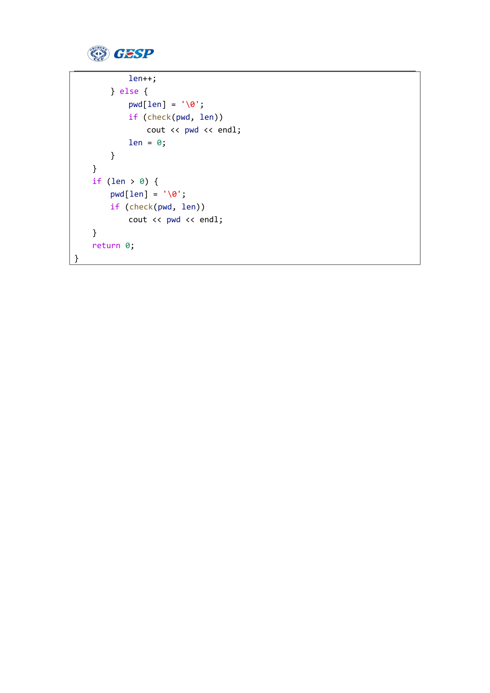

### 提取文本

```
len++;
        } else {
           pwd[len] = '\0';
            if (check(pwd, len))
               cout << pwd << endl;
           len = 0;
        }
    }
    if (len > 0) {
        pwd[len] = '\0';
        if (check(pwd, len))
           cout << pwd << endl;
    }
    return 0;
}
```
