# 2023年6月-C++4级

- 原始 PDF：[`pdfs/2023年6月-C++4级.pdf`](../pdfs/2023年6月-C++4级.pdf)
- 页数：16
- 转换脚本：[`scripts/convert_pdfs_to_markdown.py`](../scripts/convert_pdfs_to_markdown.py)

> 为尽量避免信息丢失，每页均附带页面图片；文本提取结果保留原有顺序与换行特征，个别公式、图形、特殊排版请以页面图片为准。

## 第 1 页

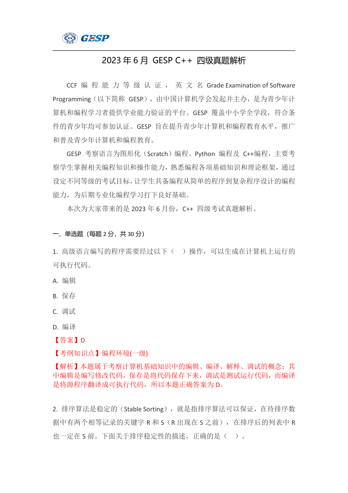

### 提取文本

```
2023 年6 月GESP C++ 四级真题解析


    CCF 编程能力等级认证，英文名Grade Examination of Software
Programming（以下简称GESP），由中国计算机学会发起并主办，是为青少年计
算机和编程学习者提供学业能力验证的平台。GESP 覆盖中小学全学段，符合条
件的青少年均可参加认证。GESP 旨在提升青少年计算机和编程教育水平，推广

和普及青少年计算机和编程教育。

    GESP 考察语言为图形化（Scratch）编程、Python 编程及C++编程，主要考

察学生掌握相关编程知识和操作能力，熟悉编程各项基础知识和理论框架，通过

设定不同等级的考试目标，让学生具备编程从简单的程序到复杂程序设计的编程

能力，为后期专业化编程学习打下良好基础。

  本次为大家带来的是2023 年6 月份，C++ 四级考试真题解析。


一、单选题（每题2 分，共30 分）

1. 高级语言编写的程序需要经过以下（ ）操作，可以生成在计算机上运行的

可执行代码。

A. 编辑

B. 保存

C. 调试

D. 编译
【答案】D
【考纲知识点】编程环境(一级)

【解析】本题属于考察计算机基础知识中的编辑、编译、解释、调试的概念；其
中编辑是编写修改代码，保存是将代码保存下来，调试是测试运行代码，而编译
是将源程序翻译成可执行代码，所以本题正确答案为D。


2. 排序算法是稳定的（Stable Sorting），就是指排序算法可以保证，在待排序数
据中有两个相等记录的关键字R 和S（R 出现在S 之前），在排序后的列表中R
也一定在S 前。下面关于排序稳定性的描述，正确的是（ ）。
```

## 第 2 页

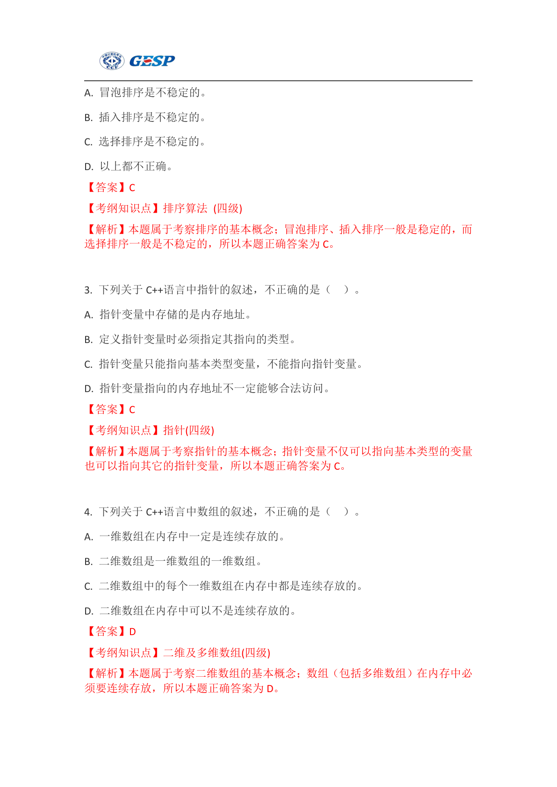

### 提取文本

```
A. 冒泡排序是不稳定的。

B. 插入排序是不稳定的。

C. 选择排序是不稳定的。

D. 以上都不正确。
【答案】C
【考纲知识点】排序算法(四级)

【解析】本题属于考察排序的基本概念；冒泡排序、插入排序一般是稳定的，而
选择排序一般是不稳定的，所以本题正确答案为C。


3. 下列关于C++语言中指针的叙述，不正确的是（ ）。

A. 指针变量中存储的是内存地址。

B. 定义指针变量时必须指定其指向的类型。

C. 指针变量只能指向基本类型变量，不能指向指针变量。

D. 指针变量指向的内存地址不一定能够合法访问。
【答案】C
【考纲知识点】指针(四级)

【解析】本题属于考察指针的基本概念；指针变量不仅可以指向基本类型的变量
也可以指向其它的指针变量，所以本题正确答案为C。


4. 下列关于C++语言中数组的叙述，不正确的是（ ）。

A. 一维数组在内存中一定是连续存放的。

B. 二维数组是一维数组的一维数组。

C. 二维数组中的每个一维数组在内存中都是连续存放的。

D. 二维数组在内存中可以不是连续存放的。
【答案】D
【考纲知识点】二维及多维数组(四级)

【解析】本题属于考察二维数组的基本概念；数组（包括多维数组）在内存中必
须要连续存放，所以本题正确答案为D。
```

## 第 3 页

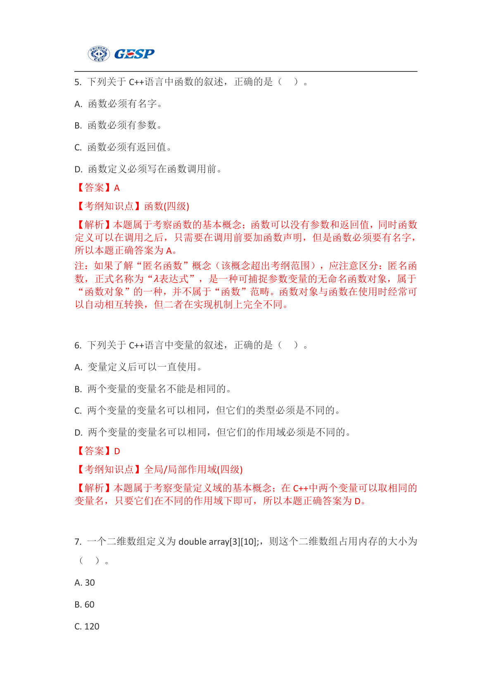

### 提取文本

```
5. 下列关于C++语言中函数的叙述，正确的是（ ）。

A. 函数必须有名字。

B. 函数必须有参数。

C. 函数必须有返回值。

D. 函数定义必须写在函数调用前。
【答案】A
【考纲知识点】函数(四级)

【解析】本题属于考察函数的基本概念；函数可以没有参数和返回值，同时函数
定义可以在调用之后，只需要在调用前要加函数声明，但是函数必须要有名字，
所以本题正确答案为A。
注：如果了解“匿名函数”概念（该概念超出考纲范围），应注意区分：匿名函
数，正式名称为“�表达式”，是一种可捕捉参数变量的无命名函数对象，属于
“函数对象”的一种，并不属于“函数”范畴。函数对象与函数在使用时经常可
以自动相互转换，但二者在实现机制上完全不同。


6. 下列关于C++语言中变量的叙述，正确的是（ ）。

A. 变量定义后可以一直使用。

B. 两个变量的变量名不能是相同的。

C. 两个变量的变量名可以相同，但它们的类型必须是不同的。

D. 两个变量的变量名可以相同，但它们的作用域必须是不同的。
【答案】D
【考纲知识点】全局/局部作用域(四级)
【解析】本题属于考察变量定义域的基本概念；在C++中两个变量可以取相同的
变量名，只要它们在不同的作用域下即可，所以本题正确答案为D。


7. 一个二维数组定义为double array[3][10];，则这个二维数组占用内存的大小为

（ ）。

A. 30

B. 60

C. 120
```

## 第 4 页

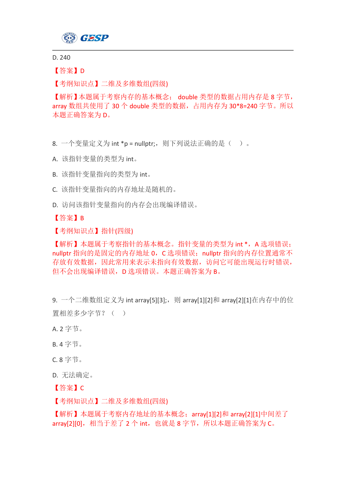

### 提取文本

```
D. 240
【答案】D
【考纲知识点】二维及多维数组(四级)
【解析】本题属于考察内存的基本概念；double 类型的数据占用内存是8 字节，
array 数组共使用了30 个double 类型的数据，占用内存为30*8=240 字节。所以
本题正确答案为D。


8. 一个变量定义为int *p = nullptr;，则下列说法正确的是（ ）。

A. 该指针变量的类型为int。

B. 该指针变量指向的类型为int。

C. 该指针变量指向的内存地址是随机的。

D. 访问该指针变量指向的内存会出现编译错误。
【答案】B
【考纲知识点】指针(四级)
【解析】本题属于考察指针的基本概念。指针变量的类型为int *，A 选项错误；
nullptr 指向的是固定的内存地址0，C 选项错误；nullptr 指向的内存位置通常不
存放有效数据，因此常用来表示未指向有效数据，访问它可能出现运行时错误，
但不会出现编译错误，D 选项错误。本题正确答案为B。


9. 一个二维数组定义为int array[5][3];，则array[1][2]和array[2][1]在内存中的位

置相差多少字节？（ ）

A. 2 字节。

B. 4 字节。

C. 8 字节。

D. 无法确定。
【答案】C
【考纲知识点】二维及多维数组(四级)
【解析】本题属于考察内存地址的基本概念；array[1][2]和array[2][1]中间差了
array[2][0]，相当于差了2 个int，也就是8 字节，所以本题正确答案为C。
```

## 第 5 页

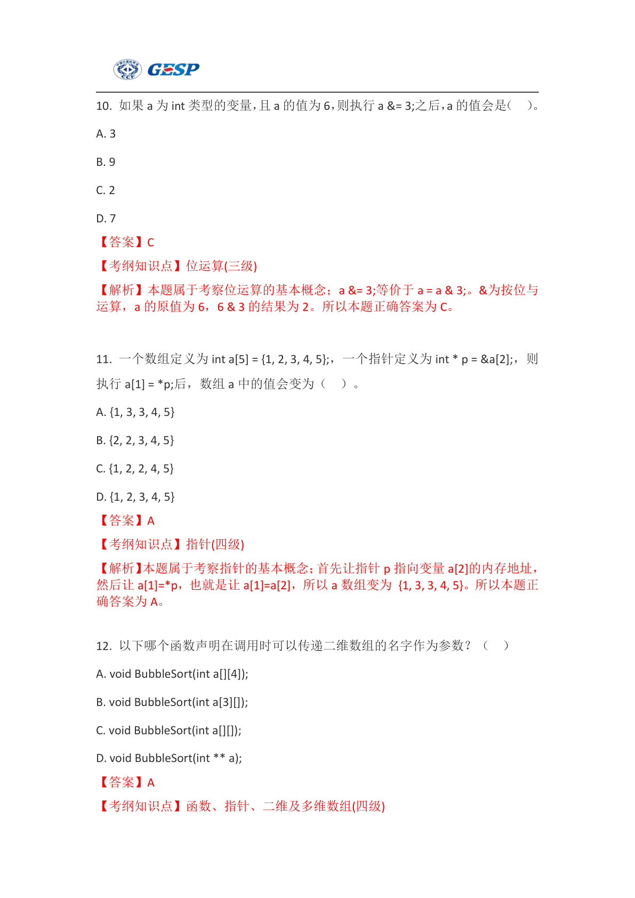

### 提取文本

```
10. 如果a 为int 类型的变量，且a 的值为6，则执行a &= 3;之后，a 的值会是（ ）。

A. 3

B. 9

C. 2

D. 7
【答案】C
【考纲知识点】位运算(三级)
【解析】本题属于考察位运算的基本概念；a &= 3;等价于a = a & 3;。&为按位与
运算，a 的原值为6，6 & 3 的结果为2。所以本题正确答案为C。


11. 一个数组定义为int a[5] = {1, 2, 3, 4, 5};，一个指针定义为int * p = &a[2];，则
执行a[1] = *p;后，数组a 中的值会变为（ ）。

A. {1, 3, 3, 4, 5}

B. {2, 2, 3, 4, 5}

C. {1, 2, 2, 4, 5}

D. {1, 2, 3, 4, 5}
【答案】A
【考纲知识点】指针(四级)
【解析】本题属于考察指针的基本概念；首先让指针p 指向变量a[2]的内存地址，
然后让a[1]=*p，也就是让a[1]=a[2]，所以a 数组变为{1, 3, 3, 4, 5}。所以本题正
确答案为A。


12. 以下哪个函数声明在调用时可以传递二维数组的名字作为参数？（ ）

A. void BubbleSort(int a[][4]);

B. void BubbleSort(int a[3][]);

C. void BubbleSort(int a[][]);

D. void BubbleSort(int ** a);
【答案】A
【考纲知识点】函数、指针、二维及多维数组(四级)
```

## 第 6 页

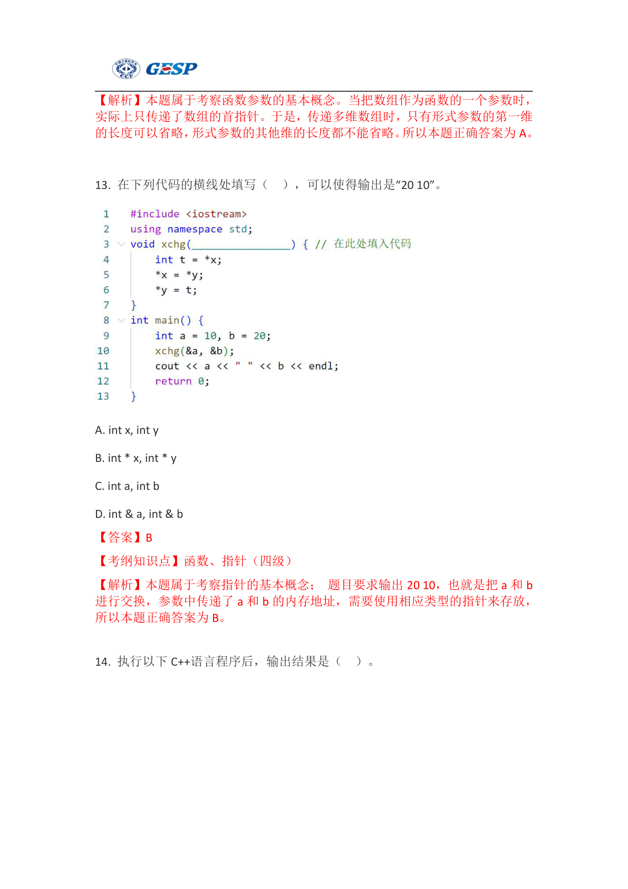

### 提取文本

```
【解析】本题属于考察函数参数的基本概念。当把数组作为函数的一个参数时，
实际上只传递了数组的首指针。于是，传递多维数组时，只有形式参数的第一维
的长度可以省略，形式参数的其他维的长度都不能省略。所以本题正确答案为A。


13. 在下列代码的横线处填写（ ），可以使得输出是“20 10”。


A. int x, int y

B. int * x, int * y

C. int a, int b

D. int & a, int & b
【答案】B

【考纲知识点】函数、指针（四级）

【解析】本题属于考察指针的基本概念；题目要求输出20 10，也就是把a 和b
进行交换，参数中传递了a 和b 的内存地址，需要使用相应类型的指针来存放，
所以本题正确答案为B。


14. 执行以下C++语言程序后，输出结果是（ ）。
```

## 第 7 页

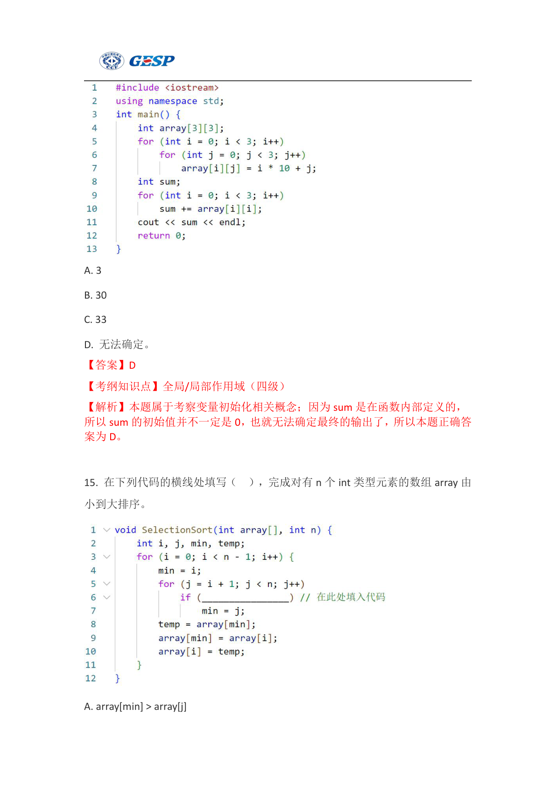

### 提取文本

```
A. 3

B. 30

C. 33

D. 无法确定。
【答案】D
【考纲知识点】全局/局部作用域（四级）
【解析】本题属于考察变量初始化相关概念；因为sum 是在函数内部定义的，
所以sum 的初始值并不一定是0，也就无法确定最终的输出了，所以本题正确答
案为D。


15. 在下列代码的横线处填写（ ），完成对有n 个int 类型元素的数组array 由

小到大排序。


A. array[min] > array[j]
```

## 第 8 页

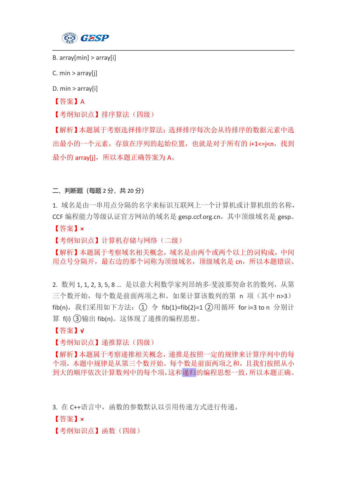

### 提取文本

```
B. array[min] > array[i]

C. min > array[j]

D. min > array[i]
【答案】A

【考纲知识点】排序算法（四级）

【解析】本题属于考察选择排序算法；选择排序每次会从待排序的数据元素中选

出最小的一个元素，存放在序列的起始位置，也就是对于所有的i+1<=j<n，找到
最小的array[j]，所以本题正确答案为A。


二、判断题（每题2 分，共20 分）

1. 域名是由一串用点分隔的名字来标识互联网上一个计算机或计算机组的名称，
CCF 编程能力等级认证官方网站的域名是gesp.ccf.org.cn，其中顶级域名是gesp。
【答案】×

【考纲知识点】计算机存储与网络（二级）

【解析】本题属于考察域名相关概念，域名是由两个或两个以上的词构成，中间
用点号分隔开，最右边的那个词称为顶级域名，顶级域名是cn，所以本题错误。

2. 数列1, 1, 2, 3, 5, 8 ... 是以意大利数学家列昂纳多·斐波那契命名的数列，从第
三个数开始，每个数是前面两项之和。如果计算该数列的第n 项（其中n>3）
fib(n)，我们采用如下方法：①令fib(1)=fib(2)=1 ②用循环for i=3 to n 分别计
算f(i) ③输出fib(n)。这体现了递推的编程思想。
【答案】√

【考纲知识点】递推算法（四级）

【解析】本题属于考察递推相关概念，递推是按照一定的规律来计算序列中的每
个项，本题中规律是从第三个数开始，每个数是前面两项之和，且我们按照从小
到大的顺序依次计算数列中的每个项，这和递归的编程思想一致，所以本题正确。


3. 在C++语言中，函数的参数默认以引用传递方式进行传递。
【答案】×

【考纲知识点】函数（四级）
```

## 第 9 页

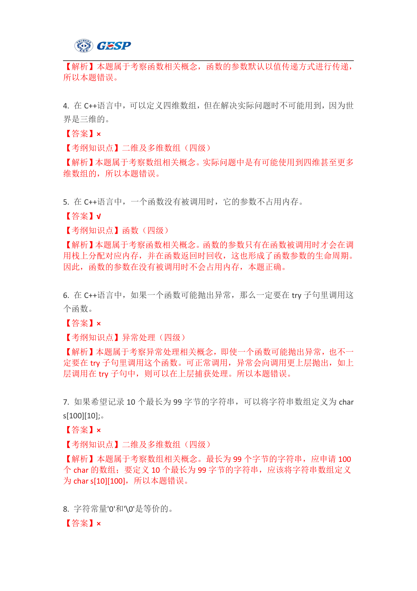

### 提取文本

```
【解析】本题属于考察函数相关概念，函数的参数默认以值传递方式进行传递，
所以本题错误。


4. 在C++语言中，可以定义四维数组，但在解决实际问题时不可能用到，因为世
界是三维的。
【答案】×

【考纲知识点】二维及多维数组（四级）

【解析】本题属于考察数组相关概念。实际问题中是有可能使用到四维甚至更多
维数组的，所以本题错误。


5. 在C++语言中，一个函数没有被调用时，它的参数不占用内存。
【答案】√

【考纲知识点】函数（四级）

【解析】本题属于考察函数相关概念。函数的参数只有在函数被调用时才会在调
用栈上分配对应内存，并在函数返回时回收，这也形成了函数参数的生命周期。
因此，函数的参数在没有被调用时不会占用内存，本题正确。


6. 在C++语言中，如果一个函数可能抛出异常，那么一定要在try 子句里调用这
个函数。
【答案】×

【考纲知识点】异常处理（四级）

【解析】本题属于考察异常处理相关概念，即使一个函数可能抛出异常，也不一
定要在try 子句里调用这个函数。可正常调用，异常会向调用更上层抛出，如上
层调用在try 子句中，则可以在上层捕获处理。所以本题错误。

7. 如果希望记录10 个最长为99 字节的字符串，可以将字符串数组定义为char
s[100][10];。
【答案】×

【考纲知识点】二维及多维数组（四级）
【解析】本题属于考察数组相关概念。最长为99 个字节的字符串，应申请100
个char 的数组；要定义10 个最长为99 字节的字符串，应该将字符串数组定义
为char s[10][100]，所以本题错误。

8. 字符常量'0'和'\0'是等价的。
【答案】×
```

## 第 10 页

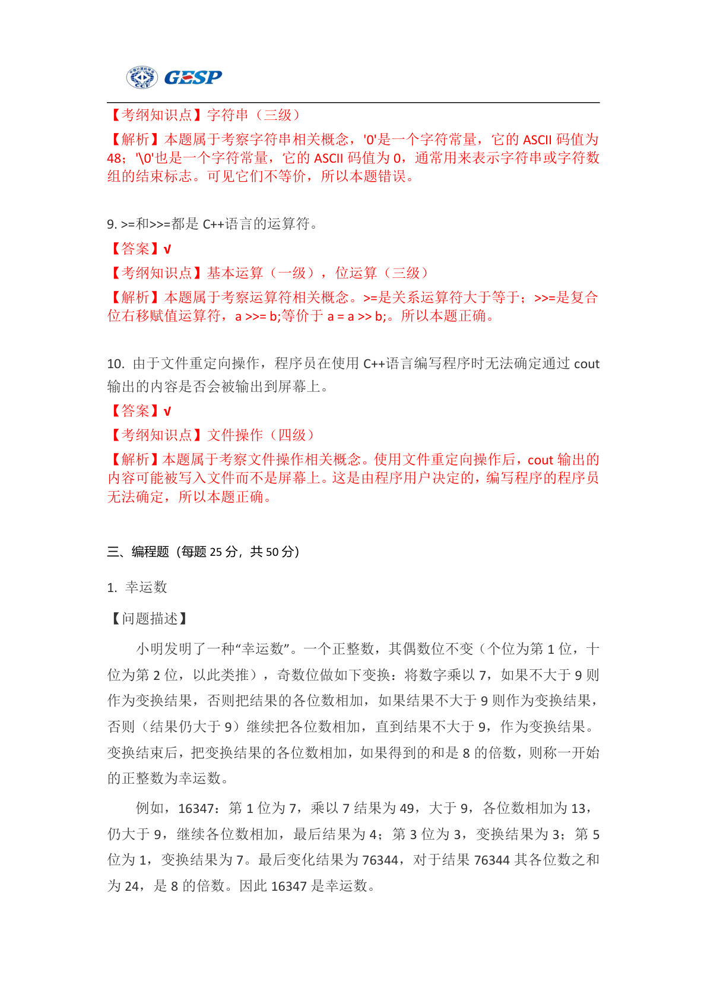

### 提取文本

```
【考纲知识点】字符串（三级）
【解析】本题属于考察字符串相关概念，'0'是一个字符常量，它的ASCII 码值为
48；'\0'也是一个字符常量，它的ASCII 码值为0，通常用来表示字符串或字符数
组的结束标志。可见它们不等价，所以本题错误。


9. >=和>>=都是C++语言的运算符。
【答案】√

【考纲知识点】基本运算（一级），位运算（三级）
【解析】本题属于考察运算符相关概念。>=是关系运算符大于等于；>>=是复合
位右移赋值运算符，a >>= b;等价于a = a >> b;。所以本题正确。

10. 由于文件重定向操作，程序员在使用C++语言编写程序时无法确定通过cout
输出的内容是否会被输出到屏幕上。
【答案】√

【考纲知识点】文件操作（四级）
【解析】本题属于考察文件操作相关概念。使用文件重定向操作后，cout 输出的
内容可能被写入文件而不是屏幕上。这是由程序用户决定的，编写程序的程序员
无法确定，所以本题正确。


三、编程题（每题25 分，共50 分）

1. 幸运数

【问题描述】

  小明发明了一种“幸运数”。一个正整数，其偶数位不变（个位为第1 位，十
位为第2 位，以此类推），奇数位做如下变换：将数字乘以7，如果不大于9 则
作为变换结果，否则把结果的各位数相加，如果结果不大于9 则作为变换结果，
否则（结果仍大于9）继续把各位数相加，直到结果不大于9，作为变换结果。
变换结束后，把变换结果的各位数相加，如果得到的和是8 的倍数，则称一开始

的正整数为幸运数。

   例如，16347：第1 位为7，乘以7 结果为49，大于9，各位数相加为13，
仍大于9，继续各位数相加，最后结果为4；第3 位为3，变换结果为3；第5
位为1，变换结果为7。最后变化结果为76344，对于结果76344 其各位数之和
为24，是8 的倍数。因此16347 是幸运数。
```

## 第 11 页

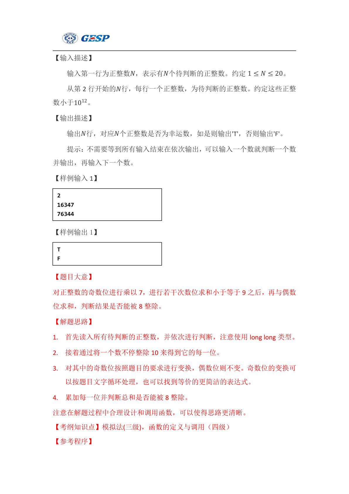

### 提取文本

```
【输入描述】

  输入第一行为正整数�，表示有�个待判断的正整数。约定1 ≤�≤20。

  从第2 行开始的�行，每行一个正整数，为待判断的正整数。约定这些正整

数小于1012。

【输出描述】

  输出�行，对应�个正整数是否为幸运数，如是则输出'T'，否则输出'F'。

  提示：不需要等到所有输入结束在依次输出，可以输入一个数就判断一个数

并输出，再输入下一个数。

【样例输入1】

 2
 16347
 76344


【样例输出1】

 T
 F


【题目大意】

对正整数的奇数位进行乘以7，进行若干次数位求和小于等于9 之后，再与偶数
位求和，判断结果是否能被8 整除。

【解题思路】

1. 首先读入所有待判断的正整数，并依次进行判断，注意使用long long 类型。

2. 接着通过将一个数不停整除10 来得到它的每一位。

3. 对其中的奇数位按照题目的要求进行变换，偶数位则不变。奇数位的变换可

  以按题目文字循环处理，也可以找到等价的更简洁的表达式。

4. 累加每一位并判断总和是否能被8 整除。

注意在解题过程中合理设计和调用函数，可以使得思路更清晰。

【考纲知识点】模拟法(三级)，函数的定义与调用（四级）

【参考程序】
```

## 第 12 页

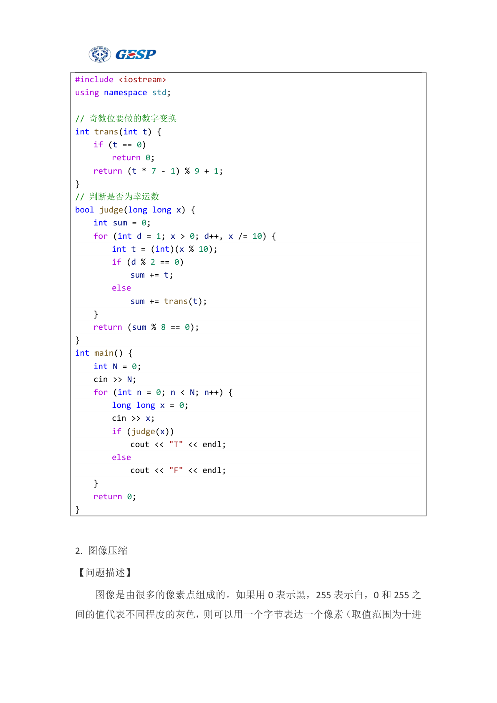

### 提取文本

```
#include <iostream>
using namespace std;

// 奇数位要做的数字变换
int trans(int t) {
    if (t == 0)
        return 0;
    return (t * 7 - 1) % 9 + 1;
}
// 判断是否为幸运数
bool judge(long long x) {
    int sum = 0;
    for (int d = 1; x > 0; d++, x /= 10) {
        int t = (int)(x % 10);
        if (d % 2 == 0)
           sum += t;
        else
           sum += trans(t);
    }
    return (sum % 8 == 0);
}
int main() {
    int N = 0;
    cin >> N;
    for (int n = 0; n < N; n++) {
        long long x = 0;
        cin >> x;
        if (judge(x))
           cout << "T" << endl;
        else
           cout << "F" << endl;
    }
    return 0;
}


2. 图像压缩

【问题描述】

  图像是由很多的像素点组成的。如果用0 表示黑，255 表示白，0 和255 之

间的值代表不同程度的灰色，则可以用一个字节表达一个像素（取值范围为十进
```

## 第 13 页

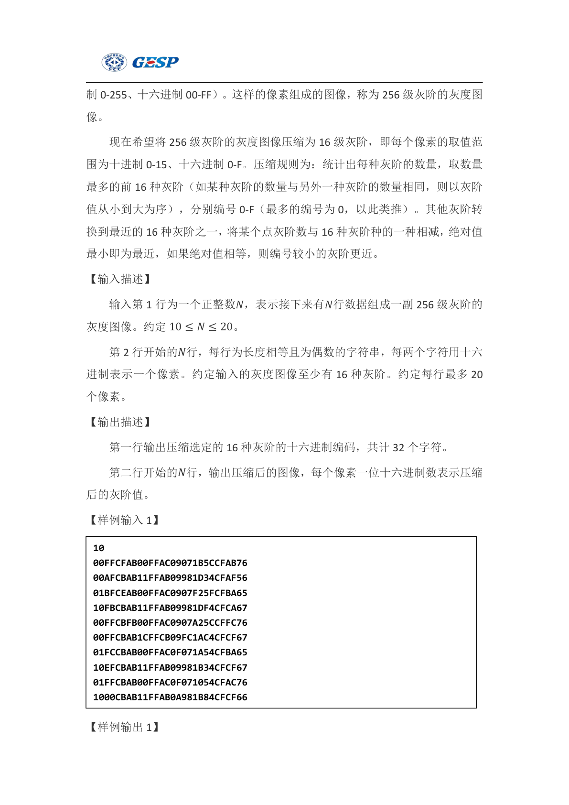

### 提取文本

```
制0-255、十六进制00-FF）。这样的像素组成的图像，称为256 级灰阶的灰度图

像。

  现在希望将256 级灰阶的灰度图像压缩为16 级灰阶，即每个像素的取值范
围为十进制0-15、十六进制0-F。压缩规则为：统计出每种灰阶的数量，取数量
最多的前16 种灰阶（如某种灰阶的数量与另外一种灰阶的数量相同，则以灰阶
值从小到大为序），分别编号0-F（最多的编号为0，以此类推）。其他灰阶转
换到最近的16 种灰阶之一，将某个点灰阶数与16 种灰阶种的一种相减，绝对值

最小即为最近，如果绝对值相等，则编号较小的灰阶更近。

【输入描述】

  输入第1 行为一个正整数�，表示接下来有�行数据组成一副256 级灰阶的

灰度图像。约定10 ≤�≤20。

  第2 行开始的�行，每行为长度相等且为偶数的字符串，每两个字符用十六
进制表示一个像素。约定输入的灰度图像至少有16 种灰阶。约定每行最多20

个像素。

【输出描述】

  第一行输出压缩选定的16 种灰阶的十六进制编码，共计32 个字符。

  第二行开始的�行，输出压缩后的图像，每个像素一位十六进制数表示压缩

后的灰阶值。

【样例输入1】

 10
 00FFCFAB00FFAC09071B5CCFAB76
 00AFCBAB11FFAB09981D34CFAF56
 01BFCEAB00FFAC0907F25FCFBA65
 10FBCBAB11FFAB09981DF4CFCA67
 00FFCBFB00FFAC0907A25CCFFC76
 00FFCBAB1CFFCB09FC1AC4CFCF67
 01FCCBAB00FFAC0F071A54CFBA65
 10EFCBAB11FFAB09981B34CFCF67
 01FFCBAB00FFAC0F071054CFAC76
 1000CBAB11FFAB0A981B84CFCF66

【样例输出1】
```

## 第 14 页

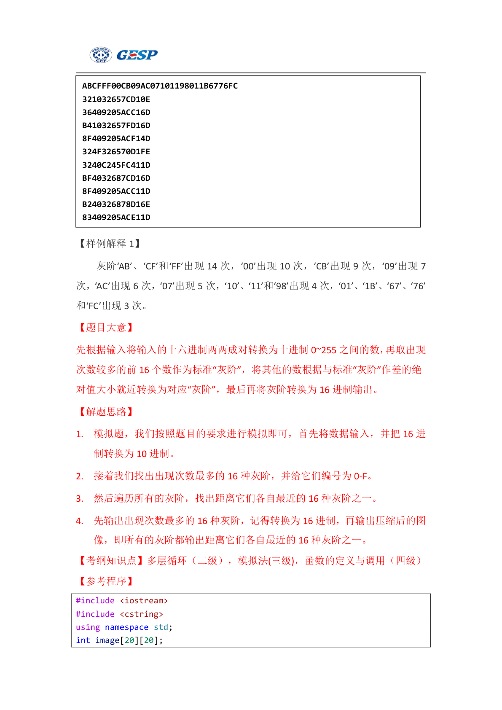

### 提取文本

```
ABCFFF00CB09AC07101198011B6776FC
 321032657CD10E
 36409205ACC16D
 B41032657FD16D
 8F409205ACF14D
 324F326570D1FE
 3240C245FC411D
 BF4032687CD16D
 8F409205ACC11D
 B240326878D16E
 83409205ACE11D

【样例解释1】

   灰阶‘AB’、‘CF’和‘FF’出现14 次，‘00’出现10 次，‘CB’出现9 次，‘09’出现7
次，‘AC’出现6 次，‘07’出现5 次，‘10’、‘11’和‘98’出现4 次，‘01’、‘1B’、‘67’、‘76’
和‘FC’出现3 次。

【题目大意】

先根据输入将输入的十六进制两两成对转换为十进制0~255 之间的数，再取出现
次数较多的前16 个数作为标准“灰阶”，将其他的数根据与标准“灰阶”作差的绝
对值大小就近转换为对应“灰阶”，最后再将灰阶转换为16 进制输出。

【解题思路】

1. 模拟题，我们按照题目的要求进行模拟即可，首先将数据输入，并把16 进
  制转换为10 进制。

2. 接着我们找出出现次数最多的16 种灰阶，并给它们编号为0-F。

3. 然后遍历所有的灰阶，找出距离它们各自最近的16 种灰阶之一。

4. 先输出出现次数最多的16 种灰阶，记得转换为16 进制，再输出压缩后的图
  像，即所有的灰阶都输出距离它们各自最近的16 种灰阶之一。

【考纲知识点】多层循环（二级），模拟法(三级)，函数的定义与调用（四级）

【参考程序】

#include <iostream>
#include <cstring>
using namespace std;
int image[20][20];
```

## 第 15 页

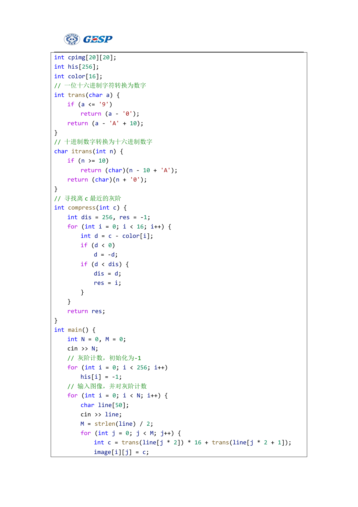

### 提取文本

```
int cpimg[20][20];
int his[256];
int color[16];
// 一位十六进制字符转换为数字
int trans(char a) {
    if (a <= '9')
        return (a - '0');
    return (a - 'A' + 10);
}
// 十进制数字转换为十六进制数字
char itrans(int n) {
    if (n >= 10)
        return (char)(n - 10 + 'A');
    return (char)(n + '0');
}
// 寻找离c 最近的灰阶
int compress(int c) {
    int dis = 256, res = -1;
    for (int i = 0; i < 16; i++) {
        int d = c - color[i];
        if (d < 0)
            d = -d;
        if (d < dis) {
           dis = d;
           res = i;
        }
    }
    return res;
}
int main() {
    int N = 0, M = 0;
    cin >> N;
    // 灰阶计数，初始化为-1
    for (int i = 0; i < 256; i++)
        his[i] = -1;
    // 输入图像，并对灰阶计数
    for (int i = 0; i < N; i++) {
        char line[50];
        cin >> line;
        M = strlen(line) / 2;
        for (int j = 0; j < M; j++) {
           int c = trans(line[j * 2]) * 16 + trans(line[j * 2 + 1]);
           image[i][j] = c;
```

## 第 16 页

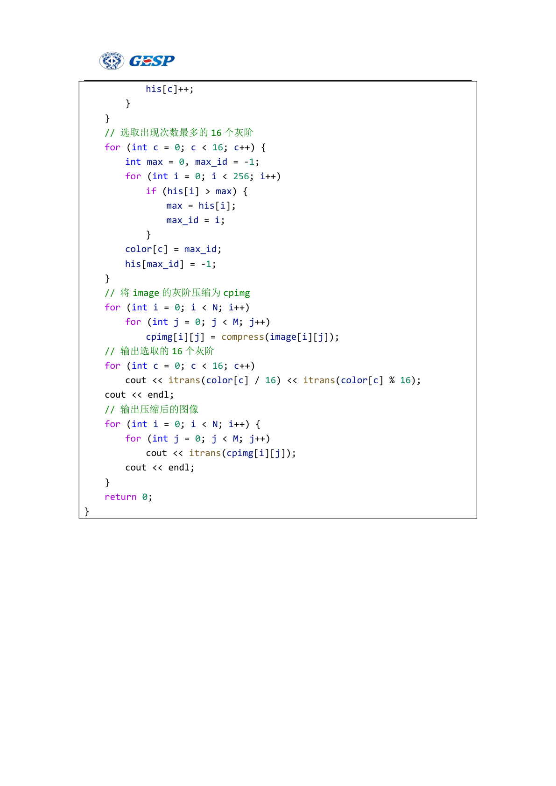

### 提取文本

```
his[c]++;
        }
    }
    // 选取出现次数最多的16 个灰阶
    for (int c = 0; c < 16; c++) {
        int max = 0, max_id = -1;
        for (int i = 0; i < 256; i++)
            if (his[i] > max) {
               max = his[i];
               max_id = i;
            }
        color[c] = max_id;
        his[max_id] = -1;
    }
    // 将image 的灰阶压缩为cpimg
    for (int i = 0; i < N; i++)
        for (int j = 0; j < M; j++)
           cpimg[i][j] = compress(image[i][j]);
    // 输出选取的16 个灰阶
    for (int c = 0; c < 16; c++)
        cout << itrans(color[c] / 16) << itrans(color[c] % 16);
    cout << endl;
    // 输出压缩后的图像
    for (int i = 0; i < N; i++) {
        for (int j = 0; j < M; j++)
           cout << itrans(cpimg[i][j]);
        cout << endl;
    }
    return 0;
}
```
