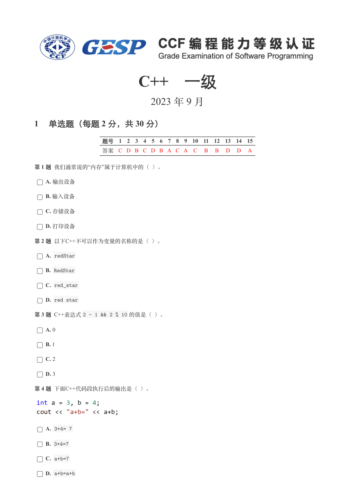
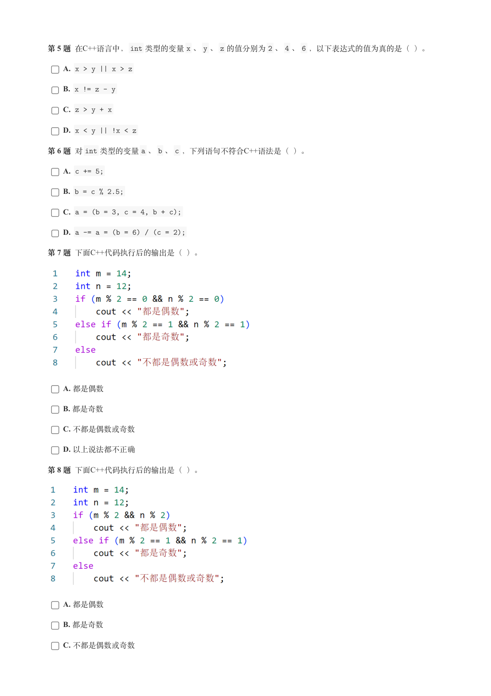
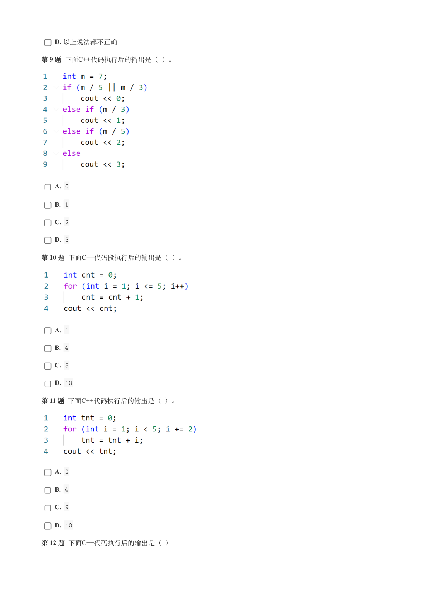
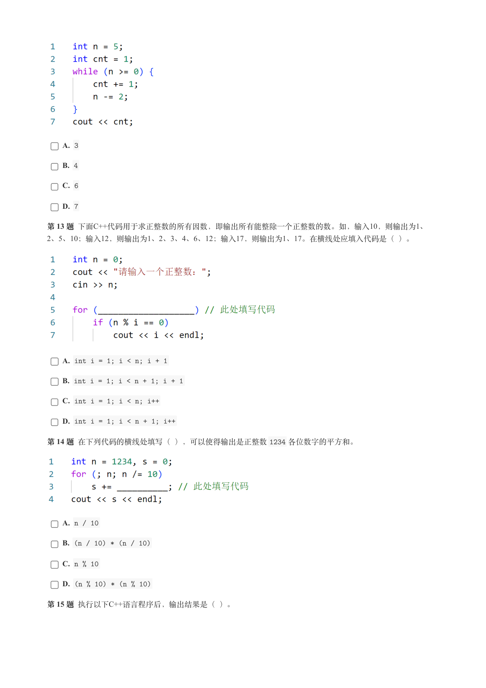
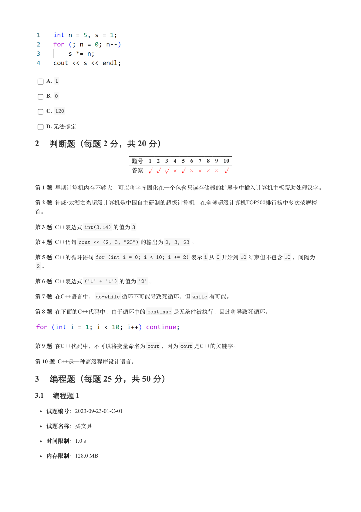
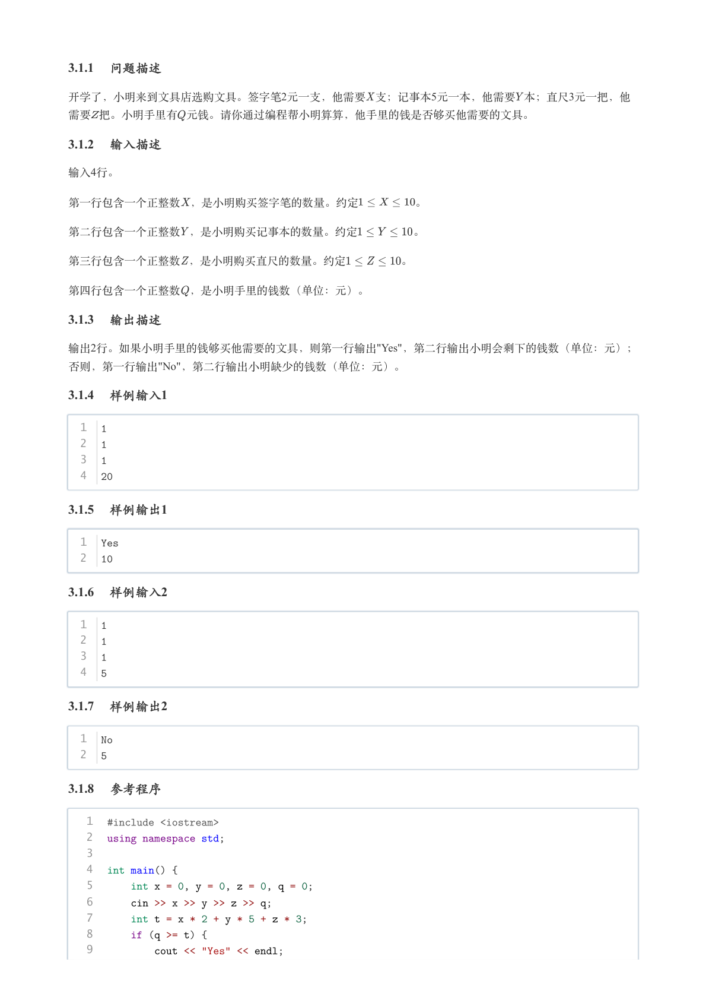
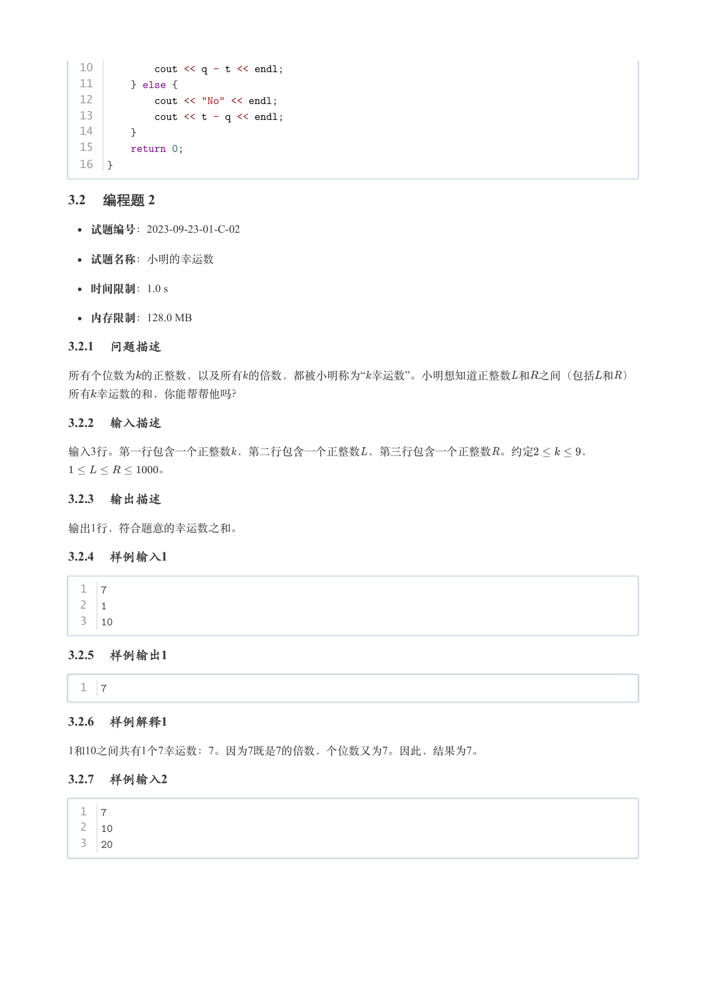
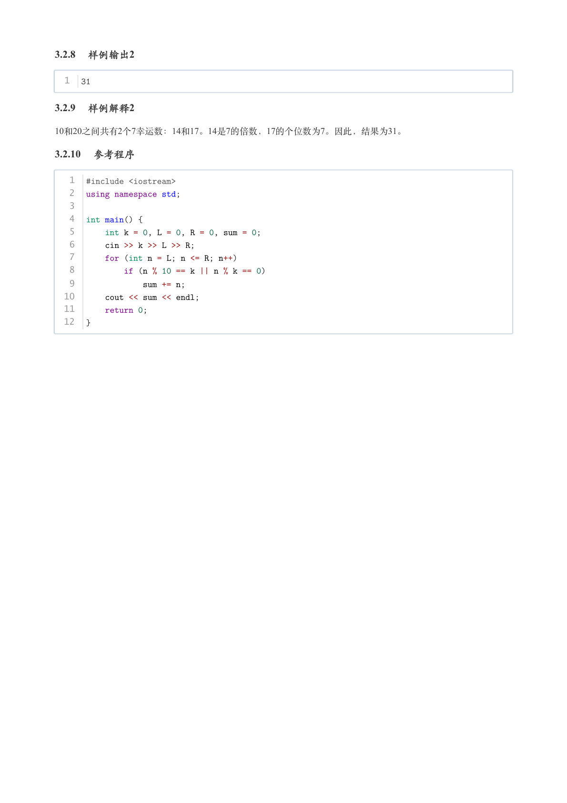

# 2023年9月-C++1级

- 原始 PDF：[`pdfs/2023年9月-C++1级.pdf`](../pdfs/2023年9月-C++1级.pdf)
- 页数：8
- 转换脚本：[`scripts/convert_pdfs_to_markdown.py`](../scripts/convert_pdfs_to_markdown.py)

> 为尽量避免信息丢失，每页均附带页面图片；文本提取结果保留原有顺序与换行特征，个别公式、图形、特殊排版请以页面图片为准。

## 第 1 页



### 提取文本

```
C++　一级

                       2023 年 9 月

1 单选题（每题 2 分，共 30 分）


            题号  1  2  3  4  5  6  7  8  9  10  11  12  13  14  15
            答案 C D B C D B A C A  C  B  B  D  D  A


第 1 题 我们通常说的“内存”属于计算机中的（ ）。

    A. 输出设备

    B. 输入设备

    C. 存储设备

    D. 打印设备

第 2 题 以下C++不可以作为变量的名称的是（ ）。

    A. redStar

    B. RedStar

    C. red_star

    D. red star

第 3 题 C++表达式2 - 1 && 2 % 10 的值是（ ）。

    A. 0

    B. 1

    C. 2

    D. 3

第 4 题 下面C++代码段执行后的输出是（ ）。


    A. 3+4= 7

    B. 3+4=7

    C. a+b=7

    D. a+b=a+b
```

## 第 2 页



### 提取文本

```
第 5 题 在C++语言中，int 类型的变量x 、y 、z 的值分别为2 、4 、6 ，以下表达式的值为真的是（ ）。

    A. x > y || x > z

    B. x != z - y

    C. z > y + x

    D. x < y || !x < z

第 6 题 对int 类型的变量a 、b 、c ，下列语句不符合C++语法是（ ）。

    A. c += 5;

    B. b = c % 2.5;

    C. a = (b = 3, c = 4, b + c);

    D. a -= a = (b = 6) / (c = 2);

第 7 题 下面C++代码执行后的输出是（ ）。


    A. 都是偶数

    B. 都是奇数

    C. 不都是偶数或奇数

    D. 以上说法都不正确

第 8 题 下面C++代码执行后的输出是（ ）。


    A. 都是偶数

    B. 都是奇数

    C. 不都是偶数或奇数
```

## 第 3 页



### 提取文本

```
D. 以上说法都不正确

第 9 题 下面C++代码执行后的输出是（ ）。


    A. 0

    B. 1

    C. 2

    D. 3

第 10 题 下面C++代码段执行后的输出是（ ）。


    A. 1

    B. 4

    C. 5

    D. 10

第 11 题 下面C++代码执行后的输出是（ ）。


    A. 2

    B. 4

    C. 9

    D. 10

第 12 题 下面C++代码执行后的输出是（ ）。
```

## 第 4 页



### 提取文本

```
A. 3

    B. 4

    C. 6

    D. 7

第 13 题 下面C++代码用于求正整数的所有因数，即输出所有能整除一个正整数的数。如，输入10，则输出为1、
2、5、10；输入12，则输出为1、2、3、4、6、12；输入17，则输出为1、17。在横线处应填入代码是（ ）。


    A. int i = 1; i < n; i + 1

    B. int i = 1; i < n + 1; i + 1

    C. int i = 1; i < n; i++

    D. int i = 1; i < n + 1; i++

第 14 题 在下列代码的横线处填写（ ），可以使得输出是正整数1234 各位数字的平方和。


    A. n / 10

    B. (n / 10) * (n / 10)

    C. n % 10

    D. (n % 10) * (n % 10)

第 15 题 执行以下C++语言程序后，输出结果是（ ）。
```

## 第 5 页



### 提取文本

```
A. 1

    B. 0

    C. 120

    D. 无法确定

2 判断题（每题 2 分，共 20 分）

                 题号  1  2  3  4  5  6  7  8  9  10

                 答案


第 1 题 早期计算机内存不够大，可以将字库固化在一个包含只读存储器的扩展卡中插入计算机主板帮助处理汉字。

第 2 题 神威·太湖之光超级计算机是中国自主研制的超级计算机，在全球超级计算机TOP500排行榜中多次荣膺榜

首。

第 3 题 C++表达式int(3.14) 的值为3 。

第 4 题 C++语句cout << (2, 3, "23") 的输出为2, 3, 23 。

第 5 题 C++的循环语句for (int i = 0; i < 10; i += 2) 表示i 从0 开始到10 结束但不包含10 ，间隔为

 2 。

第 6 题 C++表达式('1' + '1') 的值为'2' 。

第 7 题 在C++语言中，do-while 循环不可能导致死循环，但while 有可能。

第 8 题 在下面的C++代码中，由于循环中的continue 是无条件被执行，因此将导致死循环。


第 9 题 在C++代码中，不可以将变量命名为cout ，因为cout 是C++的关键字。

第 10 题 C++是一种高级程序设计语言。

3 编程题（每题 25 分，共 50 分）

3.1 编程题 1

   试题编号：2023-09-23-01-C-01


  试题名称：买文具

   时间限制：1.0 s

   内存限制：128.0 MB
```

## 第 6 页



### 提取文本

```
3.1.1 问题描述

开学了，小明来到文具店选购文具。签字笔2元一支，他需要 支；记事本5元一本，他需要本；直尺3元一把，他

需要把。小明手里有 元钱。请你通过编程帮小明算算，他手里的钱是否够买他需要的文具。

3.1.2 输入描述

输入4行。


第一行包含一个正整数 ，是小明购买签字笔的数量。约定     。


第二行包含一个正整数，是小明购买记事本的数量。约定     。


第三行包含一个正整数，是小明购买直尺的数量。约定     。


第四行包含一个正整数 ，是小明手里的钱数（单位：元）。

3.1.3 输出描述

输出2行。如果小明手里的钱够买他需要的文具，则第一行输出"Yes"，第二行输出小明会剩下的钱数（单位：元）；
否则，第一行输出"No"，第二行输出小明缺少的钱数（单位：元）。

3.1.4 样例输入1


  1  1
  2  1
  3  1
  4  20

3.1.5 样例输出1


  1  Yes
  2  10

3.1.6 样例输入2


  1  1
  2  1
  3  1
  4  5

3.1.7 样例输出2


  1  No
  2  5

3.1.8 参考程序


   1  #include <iostream>
   2  using namespace std;
   3
   4  int main() {
   5      int x = 0, y = 0, z = 0, q = 0;
   6      cin >> x >> y >> z >> q;
   7      int t = x * 2 + y * 5 + z * 3;
   8      if (q >= t) {
   9          cout << "Yes" << endl;
```

## 第 7 页



### 提取文本

```
10          cout << q - t << endl;
  11      } else {
  12          cout << "No" << endl;
  13          cout << t - q << endl;
  14      }
  15      return 0;
  16  }

3.2 编程题 2

   试题编号：2023-09-23-01-C-02


  试题名称：小明的幸运数

   时间限制：1.0 s

   内存限制：128.0 MB

3.2.1 问题描述

所有个位数为的正整数，以及所有的倍数，都被小明称为“ 幸运数”。小明想知道正整数和之间（包括和）

所有幸运数的和，你能帮帮他吗？

3.2.2 输入描述

输入3行。第一行包含一个正整数，第二行包含一个正整数，第三行包含一个正整数。约定    ，

        。

3.2.3 输出描述

输出1行，符合题意的幸运数之和。

3.2.4 样例输入1


  1  7
  2  1
  3  10

3.2.5 样例输出1


  1  7

3.2.6 样例解释1

1和10之间共有1个7幸运数：7。因为7既是7的倍数，个位数又为7。因此，结果为7。

3.2.7 样例输入2


  1  7
  2  10
  3  20
```

## 第 8 页



### 提取文本

```
3.2.8 样例输出2


  1  31

3.2.9 样例解释2

10和20之间共有2个7幸运数：14和17。14是7的倍数，17的个位数为7。因此，结果为31。

3.2.10 参考程序


   1  #include <iostream>
   2  using namespace std;
   3
   4  int main() {
   5      int k = 0, L = 0, R = 0, sum = 0;
   6      cin >> k >> L >> R;
   7      for (int n = L; n <= R; n++)
   8          if (n % 10 == k || n % k == 0)
   9              sum += n;
  10      cout << sum << endl;
  11      return 0;
  12  }
```
