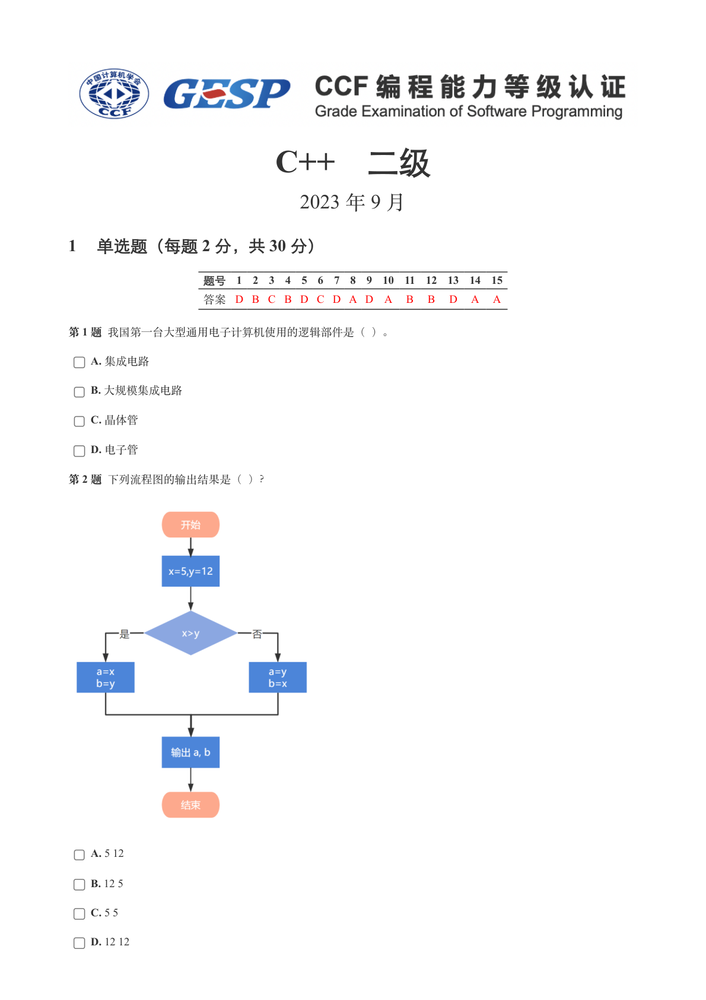
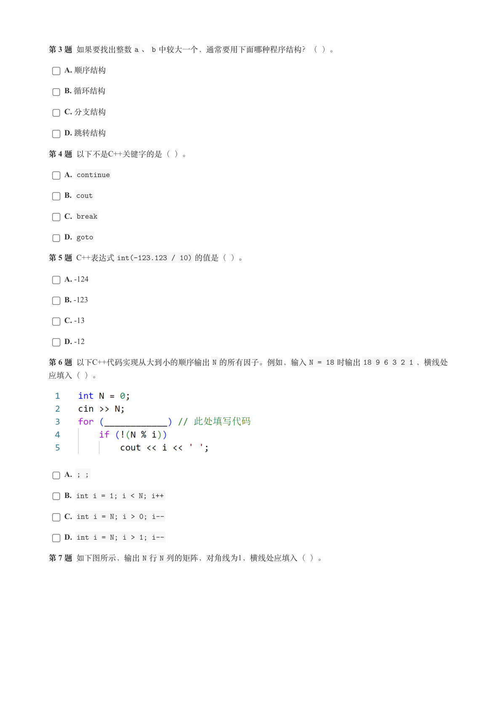
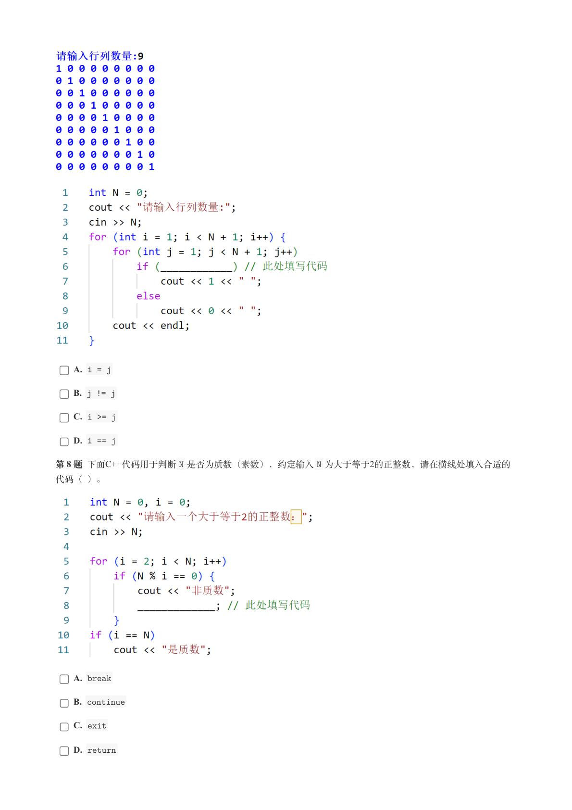
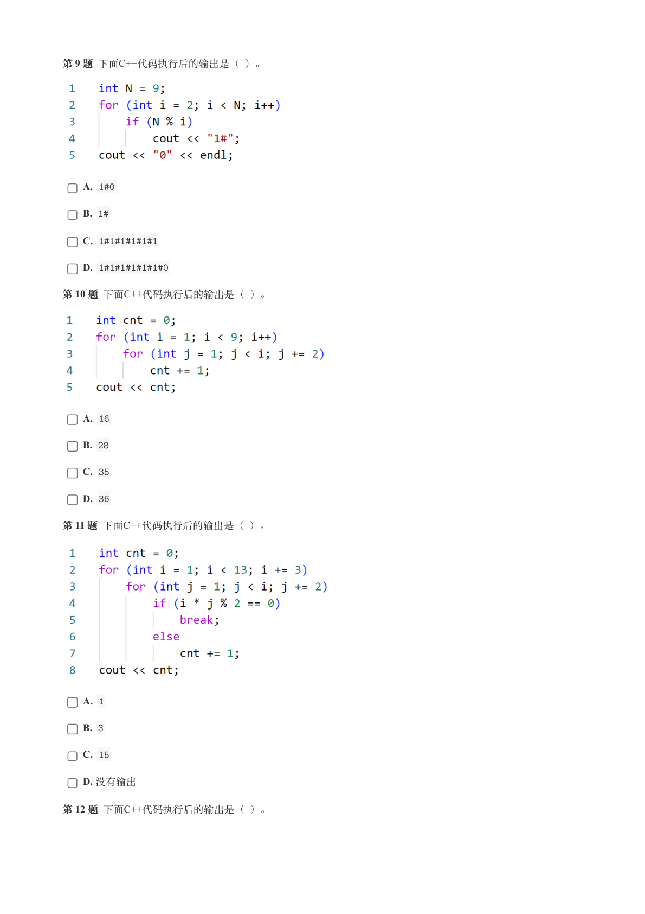
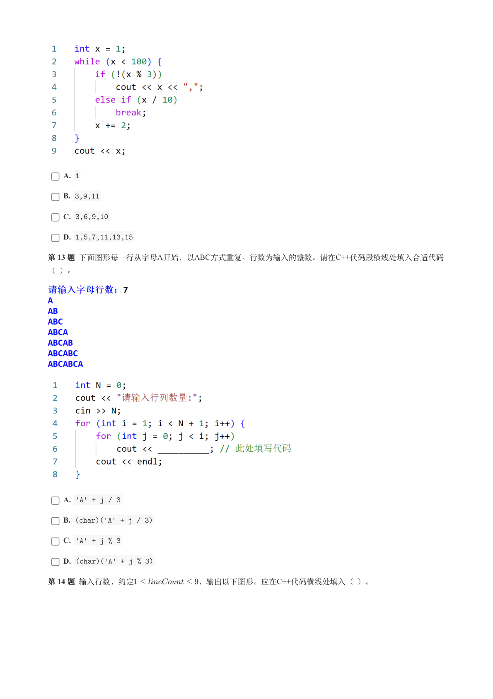
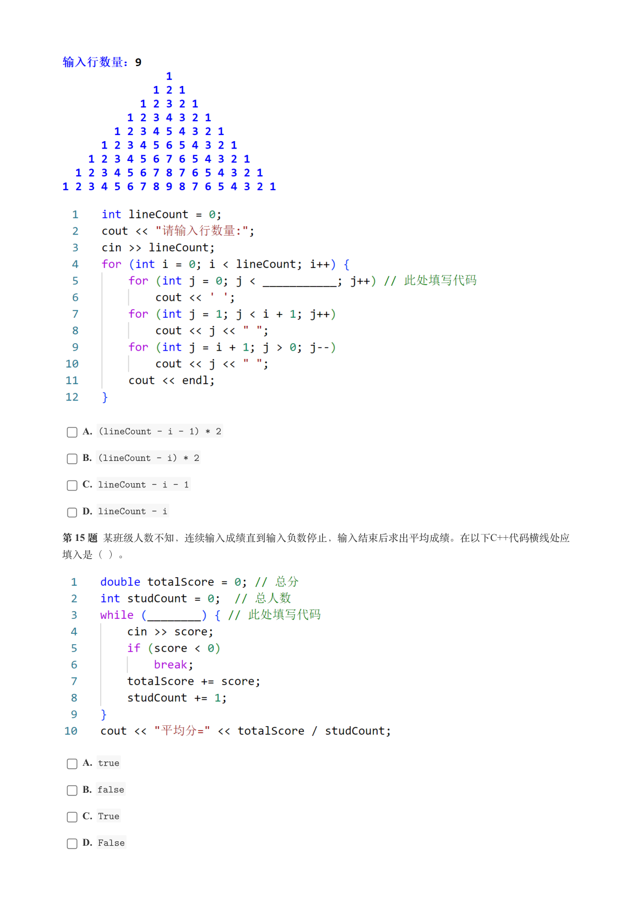
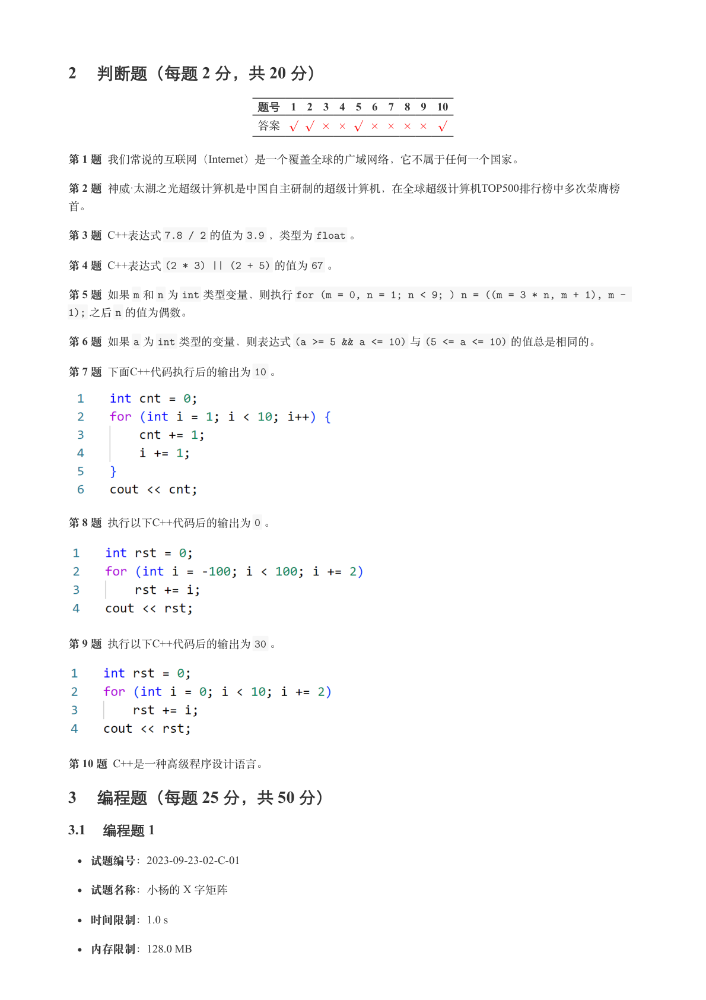
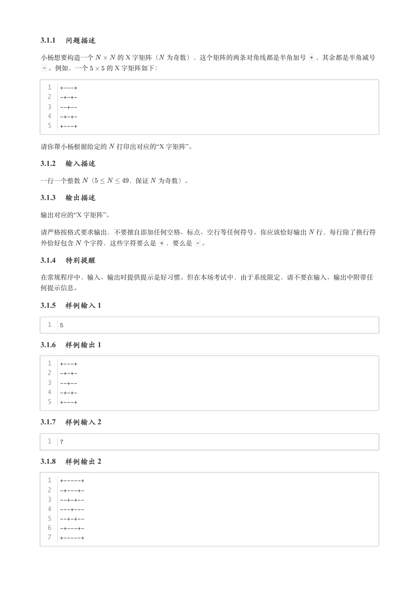
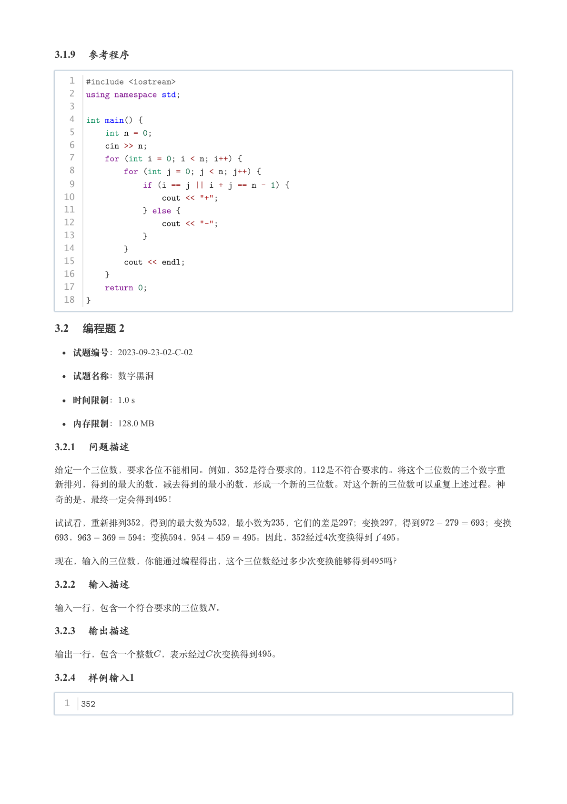
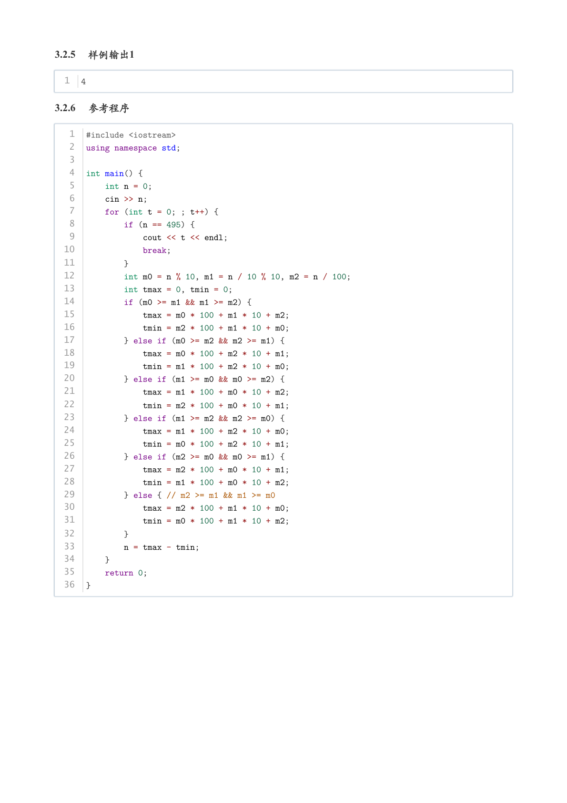

# 2023年9月-C++2级

- 原始 PDF：[`pdfs/2023年9月-C++2级.pdf`](../pdfs/2023年9月-C++2级.pdf)
- 页数：10
- 转换脚本：[`scripts/convert_pdfs_to_markdown.py`](../scripts/convert_pdfs_to_markdown.py)

> 为尽量避免信息丢失，每页均附带页面图片；文本提取结果保留原有顺序与换行特征，个别公式、图形、特殊排版请以页面图片为准。

## 第 1 页



### 提取文本

```
C++　二级

                       2023 年 9 月

1 单选题（每题 2 分，共 30 分）


            题号  1  2  3  4  5  6  7  8  9  10  11  12  13  14  15
            答案 D B C B D C D A D A  B  B  D  A  A


第 1 题 我国第一台大型通用电子计算机使用的逻辑部件是（ ）。

    A. 集成电路

    B. 大规模集成电路

    C. 晶体管

    D. 电子管

第 2 题 下列流程图的输出结果是（ ）？


    A. 5 12

    B. 12 5

    C. 5 5

    D. 12 12
```

## 第 2 页



### 提取文本

```
第 3 题 如果要找出整数a 、b 中较大一个，通常要用下面哪种程序结构？（ ）。

    A. 顺序结构

    B. 循环结构

    C. 分支结构

    D. 跳转结构

第 4 题 以下不是C++关键字的是（ ）。

    A. continue

    B. cout

    C. break

    D. goto

第 5 题 C++表达式int(-123.123 / 10) 的值是（ ）。

    A. -124

    B. -123

    C. -13

    D. -12

第 6 题 以下C++代码实现从大到小的顺序输出N 的所有因子。例如，输入N = 18 时输出18 9 6 3 2 1 ，横线处

应填入（ ）。


    A. ; ;

    B. int i = 1; i < N; i++

    C. int i = N; i > 0; i--

    D. int i = N; i > 1; i--

第 7 题 如下图所示，输出N 行N 列的矩阵，对角线为1，横线处应填入（ ）。
```

## 第 3 页



### 提取文本

```
A. i = j

    B. j != j

    C. i >= j

    D. i == j

第 8 题 下面C++代码用于判断N 是否为质数（素数），约定输入N 为大于等于2的正整数，请在横线处填入合适的

代码（ ）。


    A. break

    B. continue

    C. exit

    D. return
```

## 第 4 页



### 提取文本

```
第 9 题 下面C++代码执行后的输出是（ ）。


    A. 1#0

    B. 1#

    C. 1#1#1#1#1#1

    D. 1#1#1#1#1#1#0

第 10 题 下面C++代码执行后的输出是（ ）。


    A. 16

    B. 28

    C. 35

    D. 36

第 11 题 下面C++代码执行后的输出是（ ）。


    A. 1

    B. 3

    C. 15

    D. 没有输出

第 12 题 下面C++代码执行后的输出是（ ）。
```

## 第 5 页



### 提取文本

```
A. 1

    B. 3,9,11

    C. 3,6,9,10

    D. 1,5,7,11,13,15

第 13 题 下面图形每一行从字母A开始，以ABC方式重复。行数为输入的整数。请在C++代码段横线处填入合适代码

（ ）。


    A. 'A' + j / 3

    B. (char)('A' + j / 3)

    C. 'A' + j % 3

    D. (char)('A' + j % 3)

第 14 题 输入行数，约定         ，输出以下图形。应在C++代码横线处填入（ ）。
```

## 第 6 页



### 提取文本

```
A. (lineCount - i - 1) * 2

    B. (lineCount - i) * 2

    C. lineCount - i - 1

    D. lineCount - i

第 15 题 某班级人数不知，连续输入成绩直到输入负数停止，输入结束后求出平均成绩。在以下C++代码横线处应

填入是（ ）。


    A. true

    B. false

    C. True

    D. False
```

## 第 7 页



### 提取文本

```
2 判断题（每题 2 分，共 20 分）

                 题号  1  2  3  4  5  6  7  8  9  10

                 答案


第 1 题 我们常说的互联网（Internet）是一个覆盖全球的广域网络，它不属于任何一个国家。

第 2 题 神威·太湖之光超级计算机是中国自主研制的超级计算机，在全球超级计算机TOP500排行榜中多次荣膺榜

首。

第 3 题 C++表达式7.8 / 2 的值为3.9 ，类型为float 。

第 4 题 C++表达式(2 * 3) || (2 + 5) 的值为67 。

第 5 题 如果m 和n 为int 类型变量，则执行for (m = 0, n = 1; n < 9; ) n = ((m = 3 * n, m + 1), m -

1); 之后n 的值为偶数。

第 6 题 如果a 为int 类型的变量，则表达式(a >= 5 && a <= 10) 与(5 <= a <= 10) 的值总是相同的。

第 7 题 下面C++代码执行后的输出为10 。


第 8 题 执行以下C++代码后的输出为0 。


第 9 题 执行以下C++代码后的输出为30 。


第 10 题 C++是一种高级程序设计语言。

3 编程题（每题 25 分，共 50 分）

3.1 编程题 1

   试题编号：2023-09-23-02-C-01

  试题名称：小杨的 X 字矩阵

   时间限制：1.0 s

   内存限制：128.0 MB
```

## 第 8 页



### 提取文本

```
3.1.1 问题描述

小杨想要构造一个    的 X 字矩阵（ 为奇数），这个矩阵的两条对角线都是半角加号 + ，其余都是半角减号
 - 。例如，一个   的 X 字矩阵如下：


  1  +---+
  2  -+-+-
  3  --+--
  4  -+-+-
  5  +---+


请你帮小杨根据给定的  打印出对应的“X 字矩阵”。

3.1.2 输入描述

一行一个整数 （     ，保证 为奇数）。

3.1.3 输出描述

输出对应的“X 字矩阵”。


请严格按格式要求输出，不要擅自添加任何空格、标点、空行等任何符号。你应该恰好输出 行，每行除了换行符

外恰好包含 个字符，这些字符要么是 + ，要么是 - 。

3.1.4 特别提醒

在常规程序中，输入、输出时提供提示是好习惯。但在本场考试中，由于系统限定，请不要在输入、输出中附带任

何提示信息。

3.1.5 样例输入 1


  1  5

3.1.6 样例输出 1


  1  +---+
  2  -+-+-
  3  --+--
  4  -+-+-
  5  +---+

3.1.7 样例输入 2


  1  7

3.1.8 样例输出 2


  1  +-----+
  2  -+---+-
  3  --+-+--
  4  ---+---
  5  --+-+--
  6  -+---+-
  7  +-----+
```

## 第 9 页



### 提取文本

```
3.1.9 参考程序


   1  #include <iostream>
   2  using namespace std;
   3
   4  int main() {
   5      int n = 0;
   6      cin >> n;
   7      for (int i = 0; i < n; i++) {
   8          for (int j = 0; j < n; j++) {
   9              if (i == j || i + j == n - 1) {
  10                  cout << "+";
  11              } else {
  12                  cout << "-";
  13              }
  14          }
  15          cout << endl;
  16      }
  17      return 0;
  18  }

3.2 编程题 2

   试题编号：2023-09-23-02-C-02


  试题名称：数字黑洞

   时间限制：1.0 s

   内存限制：128.0 MB

3.2.1 问题描述

给定一个三位数，要求各位不能相同。例如，  是符合要求的，  是不符合要求的。将这个三位数的三个数字重

新排列，得到的最大的数，减去得到的最小的数，形成一个新的三位数。对这个新的三位数可以重复上述过程。神

奇的是，最终一定会得到  ！


试试看，重新排列  ，得到的最大数为  ，最小数为  ，它们的差是  ；变换  ，得到       ；变换
  ，       ；变换  ，       。因此，  经过4次变换得到了  。

现在，输入的三位数，你能通过编程得出，这个三位数经过多少次变换能够得到495吗？

3.2.2 输入描述

输入一行，包含一个符合要求的三位数 。

3.2.3 输出描述

输出一行，包含一个整数，表示经过次变换得到  。

3.2.4 样例输入1


  1  352
```

## 第 10 页



### 提取文本

```
3.2.5 样例输出1


  1  4

3.2.6 参考程序


   1  #include <iostream>
   2  using namespace std;
   3
   4  int main() {
   5      int n = 0;
   6      cin >> n;
   7      for (int t = 0; ; t++) {
   8          if (n == 495) {
   9              cout << t << endl;
  10              break;
  11          }
  12          int m0 = n % 10, m1 = n / 10 % 10, m2 = n / 100;
  13          int tmax = 0, tmin = 0;
  14          if (m0 >= m1 && m1 >= m2) {
  15              tmax = m0 * 100 + m1 * 10 + m2;
  16              tmin = m2 * 100 + m1 * 10 + m0;
  17          } else if (m0 >= m2 && m2 >= m1) {
  18              tmax = m0 * 100 + m2 * 10 + m1;
  19              tmin = m1 * 100 + m2 * 10 + m0;
  20          } else if (m1 >= m0 && m0 >= m2) {
  21              tmax = m1 * 100 + m0 * 10 + m2;
  22              tmin = m2 * 100 + m0 * 10 + m1;
  23          } else if (m1 >= m2 && m2 >= m0) {
  24              tmax = m1 * 100 + m2 * 10 + m0;
  25              tmin = m0 * 100 + m2 * 10 + m1;
  26          } else if (m2 >= m0 && m0 >= m1) {
  27              tmax = m2 * 100 + m0 * 10 + m1;
  28              tmin = m1 * 100 + m0 * 10 + m2;
  29          } else { // m2 >= m1 && m1 >= m0
  30              tmax = m2 * 100 + m1 * 10 + m0;
  31              tmin = m0 * 100 + m1 * 10 + m2;
  32          }
  33          n = tmax - tmin;
  34      }
  35      return 0;
  36  }
```
