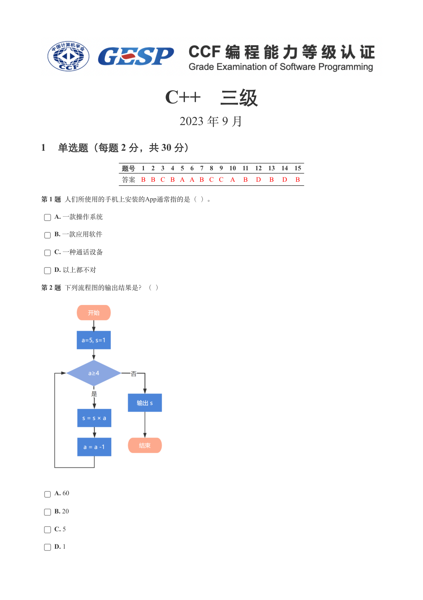
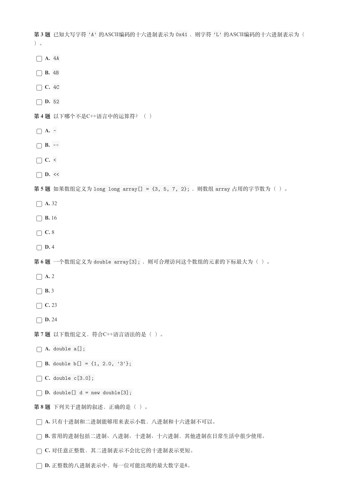
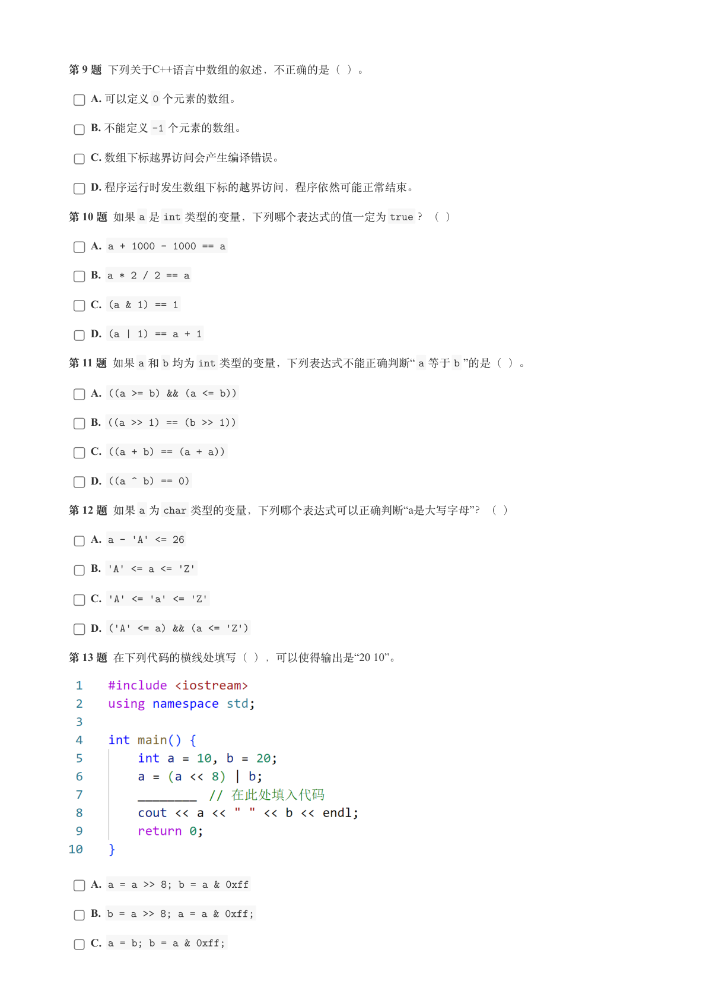
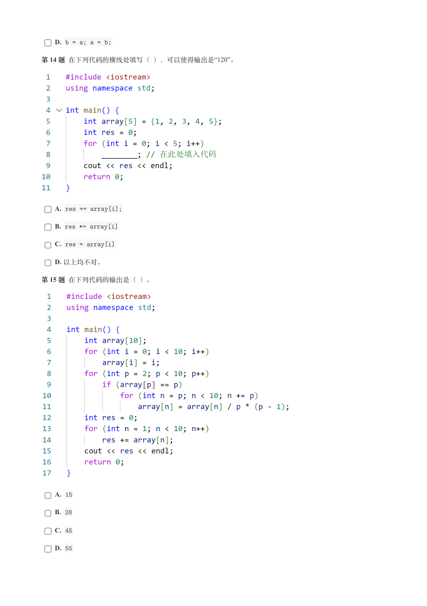
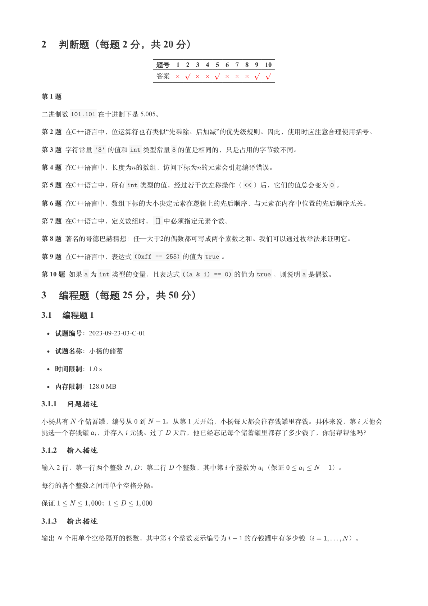
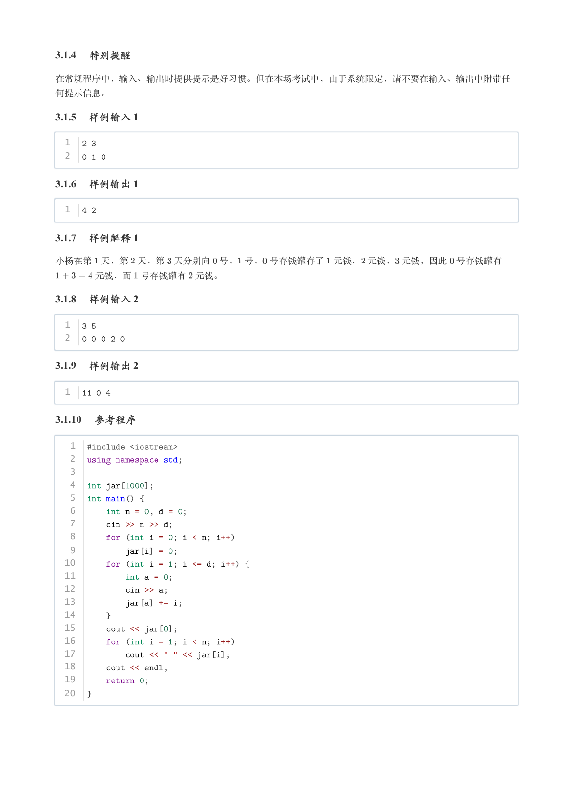
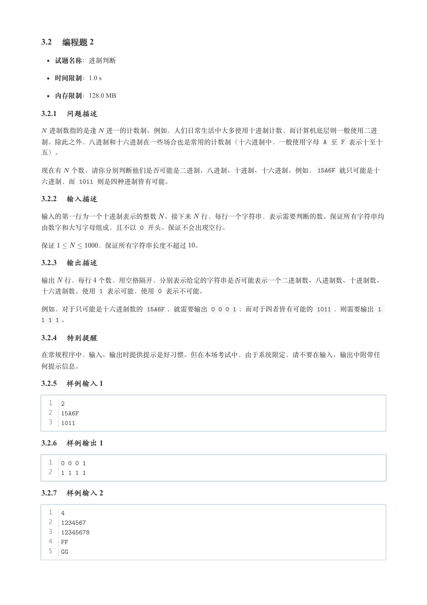
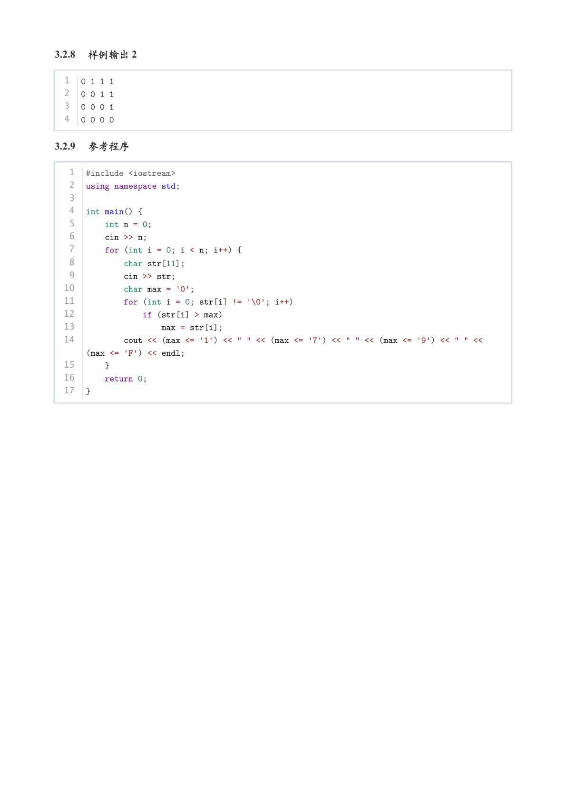

# 2023年9月-C++3级

- 原始 PDF：[`pdfs/2023年9月-C++3级.pdf`](../pdfs/2023年9月-C++3级.pdf)
- 页数：8
- 转换脚本：[`scripts/convert_pdfs_to_markdown.py`](../scripts/convert_pdfs_to_markdown.py)

> 为尽量避免信息丢失，每页均附带页面图片；文本提取结果保留原有顺序与换行特征，个别公式、图形、特殊排版请以页面图片为准。

## 第 1 页



### 提取文本

```
C++　三级

                       2023 年 9 月

1 单选题（每题 2 分，共 30 分）


            题号  1  2  3  4  5  6  7  8  9  10  11  12  13  14  15
            答案 B B C B A A B C C A  B  D  B  D  B


第 1 题 人们所使用的手机上安装的App通常指的是（ ）。

    A. 一款操作系统

    B. 一款应用软件

    C. 一种通话设备

    D. 以上都不对

第 2 题 下列流程图的输出结果是？（ ）


    A. 60

    B. 20

    C. 5

    D. 1
```

## 第 2 页



### 提取文本

```
第 3 题 已知大写字符'A' 的ASCII编码的十六进制表示为0x41 ，则字符'L' 的ASCII编码的十六进制表示为（

）。

    A. 4A

    B. 4B

    C. 4C

    D. 52

第 4 题 以下哪个不是C++语言中的运算符？（ ）

    A. ~

    B. ~~

    C. <

    D. <<

第 5 题 如果数组定义为long long array[] = {3, 5, 7, 2}; ，则数组array 占用的字节数为（ ）。

    A. 32

    B. 16

    C. 8

    D. 4

第 6 题 一个数组定义为double array[3]; ，则可合理访问这个数组的元素的下标最大为（ ）。

    A. 2

    B. 3

    C. 23

    D. 24

第 7 题 以下数组定义，符合C++语言语法的是（ ）。

    A. double a[];

    B. double b[] = {1, 2.0, '3'};

    C. double c[3.0];

    D. double[] d = new double[3];

第 8 题 下列关于进制的叙述，正确的是（ ）。

    A. 只有十进制和二进制能够用来表示小数，八进制和十六进制不可以。

    B. 常用的进制包括二进制、八进制、十进制、十六进制，其他进制在日常生活中很少使用。

    C. 对任意正整数，其二进制表示不会比它的十进制表示更短。

    D. 正整数的八进制表示中，每一位可能出现的最大数字是8。
```

## 第 3 页



### 提取文本

```
第 9 题 下列关于C++语言中数组的叙述，不正确的是（ ）。

    A. 可以定义0 个元素的数组。

    B. 不能定义-1 个元素的数组。

    C. 数组下标越界访问会产生编译错误。

    D. 程序运行时发生数组下标的越界访问，程序依然可能正常结束。

第 10 题 如果a 是int 类型的变量，下列哪个表达式的值一定为true ？（ ）

    A. a + 1000 - 1000 == a

    B. a * 2 / 2 == a

    C. (a & 1) == 1

    D. (a | 1) == a + 1

第 11 题 如果a 和b 均为int 类型的变量，下列表达式不能正确判断“ a 等于b ”的是（ ）。

    A. ((a >= b) && (a <= b))

    B. ((a >> 1) == (b >> 1))

    C. ((a + b) == (a + a))

    D. ((a ^ b) == 0)

第 12 题 如果a 为char 类型的变量，下列哪个表达式可以正确判断“a是大写字母”？（ ）

    A. a - 'A' <= 26

    B. 'A' <= a <= 'Z'

    C. 'A' <= 'a' <= 'Z'

    D. ('A' <= a) && (a <= 'Z')

第 13 题 在下列代码的横线处填写（ ），可以使得输出是“20 10”。


    A. a = a >> 8; b = a & 0xff

    B. b = a >> 8; a = a & 0xff;

    C. a = b; b = a & 0xff;
```

## 第 4 页



### 提取文本

```
D. b = a; a = b;

第 14 题 在下列代码的横线处填写（ ），可以使得输出是“120”。


    A. res += array[i];

    B. res *= array[i]

    C. res = array[i]

    D. 以上均不对。

第 15 题 在下列代码的输出是（ ）。


    A. 15

    B. 28

    C. 45

    D. 55
```

## 第 5 页



### 提取文本

```
2 判断题（每题 2 分，共 20 分）

                 题号  1  2  3  4  5  6  7  8  9  10

                 答案


第 1 题

二进制数101.101 在十进制下是 5.005。

第 2 题 在C++语言中，位运算符也有类似“先乘除、后加减”的优先级规则。因此，使用时应注意合理使用括号。

第 3 题 字符常量'3' 的值和int 类型常量3 的值是相同的，只是占用的字节数不同。

第 4 题 在C++语言中，长度为的数组，访问下标为的元素会引起编译错误。

第 5 题 在C++语言中，所有int 类型的值，经过若干次左移操作（<< ）后，它们的值总会变为0 。

第 6 题 在C++语言中，数组下标的大小决定元素在逻辑上的先后顺序，与元素在内存中位置的先后顺序无关。

第 7 题 在C++语言中，定义数组时，[] 中必须指定元素个数。

第 8 题 著名的哥德巴赫猜想：任一大于2的偶数都可写成两个素数之和。我们可以通过枚举法来证明它。

第 9 题 在C++语言中，表达式(0xff == 255) 的值为true 。

第 10 题 如果a 为int 类型的变量，且表达式((a & 1) == 0) 的值为true ，则说明a 是偶数。

3 编程题（每题 25 分，共 50 分）

3.1 编程题 1

   试题编号：2023-09-23-03-C-01


  试题名称：小杨的储蓄

   时间限制：1.0 s

   内存限制：128.0 MB

3.1.1 问题描述

小杨共有 个储蓄罐，编号从 到   。从第 1 天开始，小杨每天都会往存钱罐里存钱。具体来说，第 天他会

挑选一个存钱罐 ，并存入 元钱。过了 天后，他已经忘记每个储蓄罐里都存了多少钱了，你能帮帮他吗？

3.1.2 输入描述

输入 2 行，第一行两个整数  ；第二行 个整数，其中第 个整数为 （保证       ）。


每行的各个整数之间用单个空格分隔。


保证       ；

3.1.3 输出描述

输出 个用单个空格隔开的整数，其中第 个整数表示编号为   的存钱罐中有多少钱（     ）。
```

## 第 6 页



### 提取文本

```
3.1.4 特别提醒

在常规程序中，输入、输出时提供提示是好习惯。但在本场考试中，由于系统限定，请不要在输入、输出中附带任

何提示信息。

3.1.5 样例输入 1


  1  2 3
  2  0 1 0

3.1.6 样例输出 1


  1  4 2

3.1.7 样例解释 1

小杨在第 天、第 天、第 天分别向 号、 号、 号存钱罐存了 元钱、 元钱、 元钱，因此 号存钱罐有

    元钱，而 号存钱罐有 元钱。

3.1.8 样例输入 2


  1  3 5
  2  0 0 0 2 0

3.1.9 样例输出 2


  1  11 0 4

3.1.10 参考程序


   1  #include <iostream>
   2  using namespace std;
   3
   4  int jar[1000];
   5  int main() {
   6      int n = 0, d = 0;
   7      cin >> n >> d;
   8      for (int i = 0; i < n; i++)
   9          jar[i] = 0;
  10      for (int i = 1; i <= d; i++) {
  11          int a = 0;
  12          cin >> a;
  13          jar[a] += i;
  14      }
  15      cout << jar[0];
  16      for (int i = 1; i < n; i++)
  17          cout << " " << jar[i];
  18      cout << endl;
  19      return 0;
  20  }
```

## 第 7 页



### 提取文本

```
3.2 编程题 2


  试题名称：进制判断

   时间限制：1.0 s

   内存限制：128.0 MB

3.2.1 问题描述

 进制数指的是逢 进一的计数制。例如，人们日常生活中大多使用十进制计数，而计算机底层则一般使用二进

制。除此之外，八进制和十六进制在一些场合也是常用的计数制（十六进制中，一般使用字母 A 至 F 表示十至十

五）。


现在有 个数，请你分别判断他们是否可能是二进制、八进制、十进制、十六进制。例如，15A6F 就只可能是十

六进制，而 1011 则是四种进制皆有可能。

3.2.2 输入描述

输入的第一行为一个十进制表示的整数 。接下来 行，每行一个字符串，表示需要判断的数。保证所有字符串均

由数字和大写字母组成，且不以 0 开头。保证不会出现空行。


保证      ，保证所有字符串长度不超过 。

3.2.3 输出描述

输出 行，每行 个数，用空格隔开，分别表示给定的字符串是否可能表示一个二进制数、八进制数、十进制数、

十六进制数。使用 1 表示可能，使用 0 表示不可能。


例如，对于只可能是十六进制数的 15A6F ，就需要输出 0 0 0 1 ；而对于四者皆有可能的 1011 ，则需要输出 1

1 1 1 。

3.2.4 特别提醒

在常规程序中，输入、输出时提供提示是好习惯。但在本场考试中，由于系统限定，请不要在输入、输出中附带任

何提示信息。

3.2.5 样例输入 1


  1  2
  2  15A6F
  3  1011

3.2.6 样例输出 1


  1  0 0 0 1
  2  1 1 1 1

3.2.7 样例输入 2


  1  4
  2  1234567
  3  12345678
  4  FF
  5  GG
```

## 第 8 页



### 提取文本

```
3.2.8 样例输出 2


  1  0 1 1 1
  2  0 0 1 1
  3  0 0 0 1
  4  0 0 0 0

3.2.9 参考程序


   1  #include <iostream>
   2  using namespace std;
   3
   4  int main() {
   5      int n = 0;
   6      cin >> n;
   7      for (int i = 0; i < n; i++) {
   8          char str[11];
   9          cin >> str;
  10          char max = '0';
  11          for (int i = 0; str[i] != '\0'; i++)
  12              if (str[i] > max)
  13                  max = str[i];
  14          cout << (max <= '1') << " " << (max <= '7') << " " << (max <= '9') << " " <<
       (max <= 'F') << endl;
  15      }
  16      return 0;
  17  }
```
