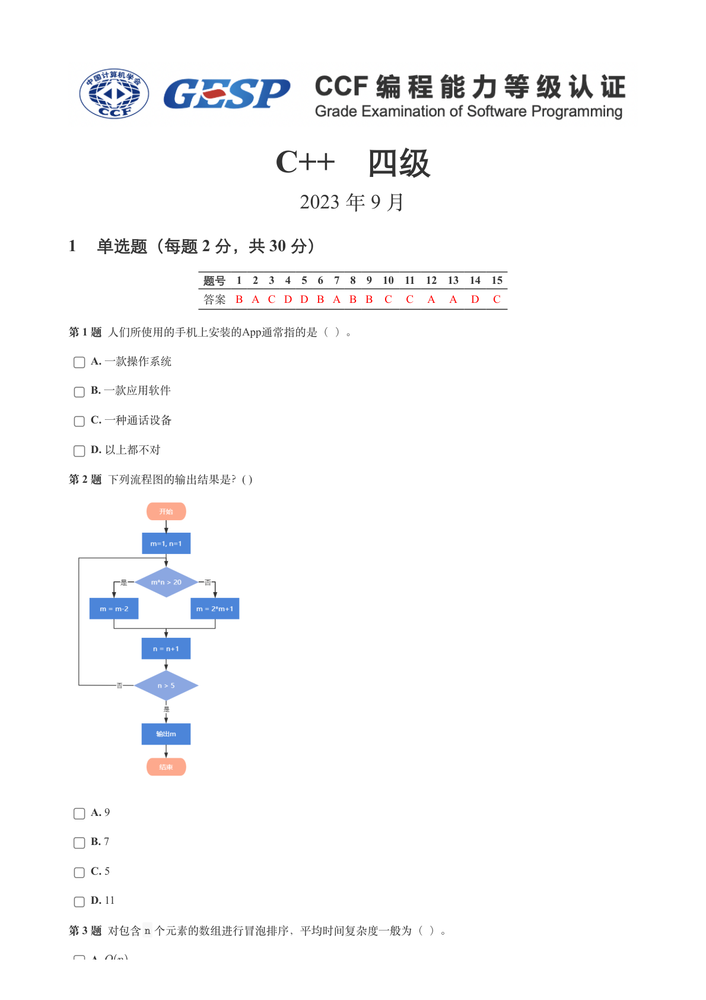
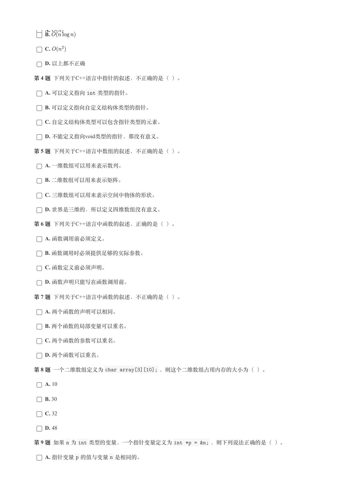
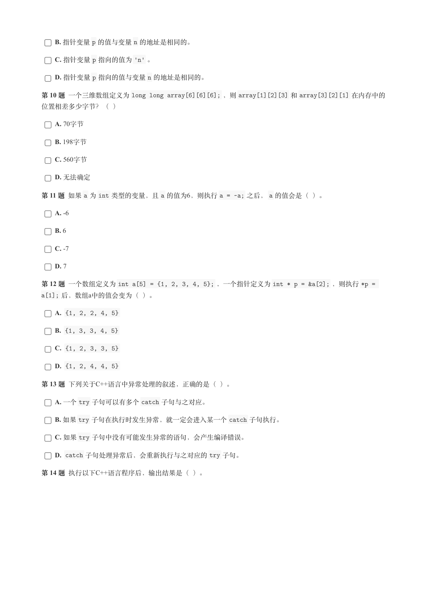
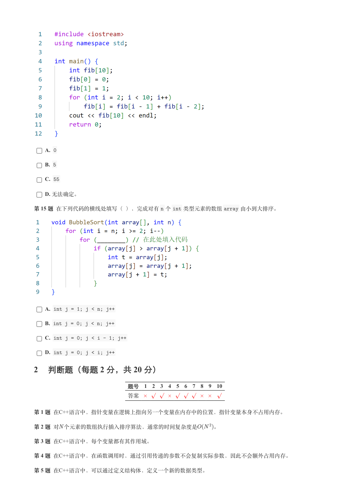
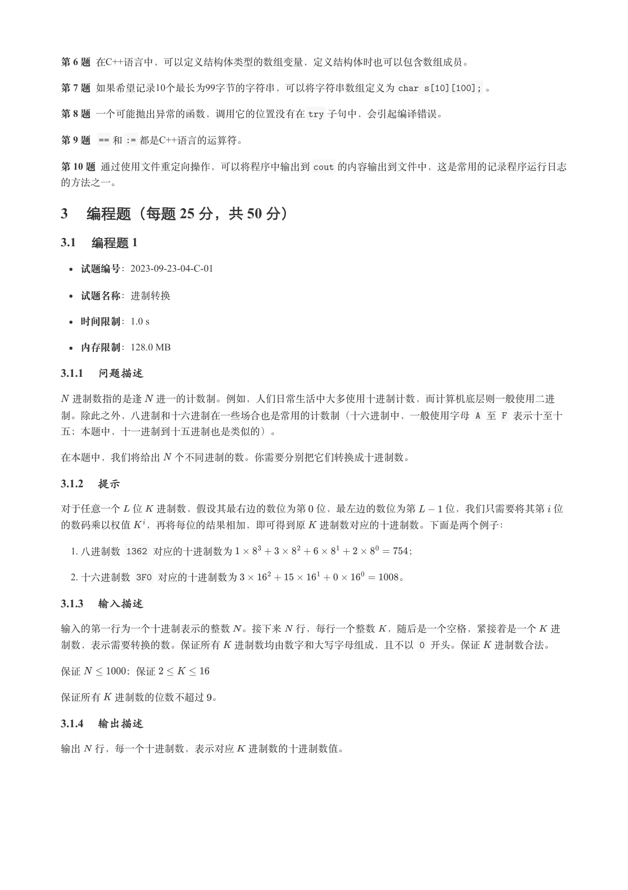
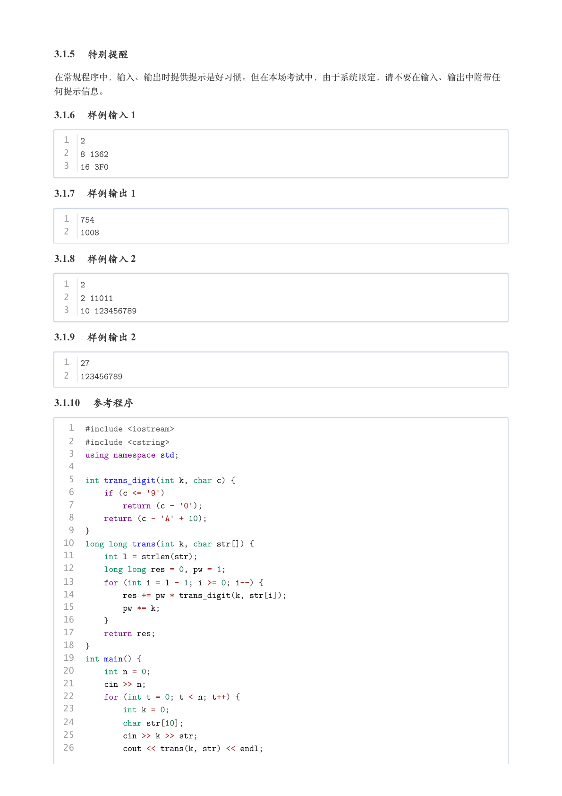
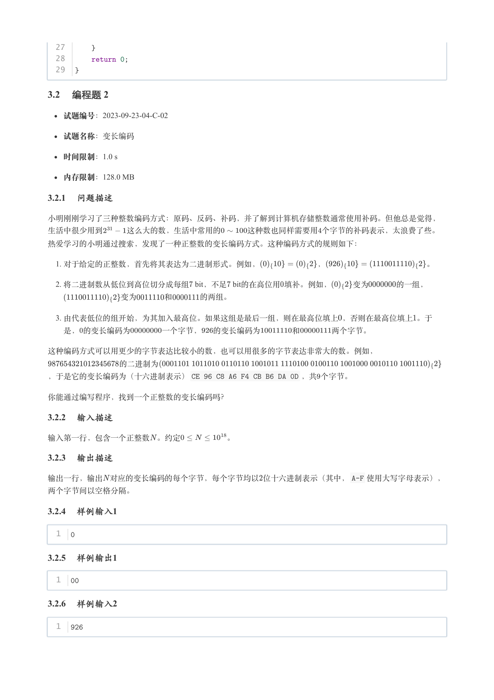
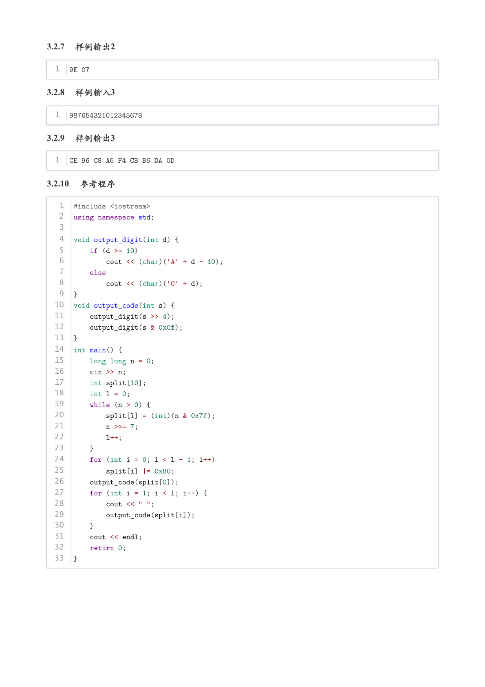

# 2023年9月-C++4级

- 原始 PDF：[`pdfs/2023年9月-C++4级.pdf`](../pdfs/2023年9月-C++4级.pdf)
- 页数：8
- 转换脚本：[`scripts/convert_pdfs_to_markdown.py`](../scripts/convert_pdfs_to_markdown.py)

> 为尽量避免信息丢失，每页均附带页面图片；文本提取结果保留原有顺序与换行特征，个别公式、图形、特殊排版请以页面图片为准。

## 第 1 页



### 提取文本

```
C++　四级

                       2023 年 9 月

1 单选题（每题 2 分，共 30 分）


            题号  1  2  3  4  5  6  7  8  9  10  11  12  13  14  15
            答案 B A C D D B A B B  C  C  A  A  D  C


第 1 题 人们所使用的手机上安装的App通常指的是（ ）。

    A. 一款操作系统

    B. 一款应用软件

    C. 一种通话设备

    D. 以上都不对

第 2 题 下列流程图的输出结果是？( )


    A. 9

    B. 7

    C. 5

    D. 11

第 3 题 对包含n 个元素的数组进行冒泡排序，平均时间复杂度一般为（ ）。

   A
```

## 第 2 页



### 提取文本

```
A.
    B.

    C.

    D. 以上都不正确

第 4 题 下列关于C++语言中指针的叙述，不正确的是（ ）。

    A. 可以定义指向int 类型的指针。

    B. 可以定义指向自定义结构体类型的指针。

    C. 自定义结构体类型可以包含指针类型的元素。

    D. 不能定义指向void类型的指针，那没有意义。

第 5 题 下列关于C++语言中数组的叙述，不正确的是（ ）。

    A. 一维数组可以用来表示数列。

    B. 二维数组可以用来表示矩阵。

    C. 三维数组可以用来表示空间中物体的形状。

    D. 世界是三维的，所以定义四维数组没有意义。

第 6 题 下列关于C++语言中函数的叙述，正确的是（ ）。

    A. 函数调用前必须定义。

    B. 函数调用时必须提供足够的实际参数。

    C. 函数定义前必须声明。

    D. 函数声明只能写在函数调用前。

第 7 题 下列关于C++语言中函数的叙述，不正确的是（ ）。

    A. 两个函数的声明可以相同。

    B. 两个函数的局部变量可以重名。

    C. 两个函数的参数可以重名。

    D. 两个函数可以重名。

第 8 题 一个二维数组定义为char array[3][10]; ，则这个二维数组占用内存的大小为（ ）。

    A. 10

    B. 30

    C. 32

    D. 48

第 9 题 如果n 为int 类型的变量，一个指针变量定义为int *p = &n; ，则下列说法正确的是（ ）。

    A. 指针变量p 的值与变量n 是相同的。
```

## 第 3 页



### 提取文本

```
B. 指针变量p 的值与变量n 的地址是相同的。

    C. 指针变量p 指向的值为'n' 。

    D. 指针变量p 指向的值与变量n 的地址是相同的。

第 10 题 一个三维数组定义为long long array[6][6][6]; ，则array[1][2][3] 和array[3][2][1] 在内存中的

位置相差多少字节？（ ）

    A. 70字节

    B. 198字节

    C. 560字节

    D. 无法确定

第 11 题 如果a 为int 类型的变量，且a 的值为6，则执行a = ~a; 之后，a 的值会是（ ）。

    A. -6

    B. 6

    C. -7

    D. 7

第 12 题 一个数组定义为int a[5] = {1, 2, 3, 4, 5}; ，一个指针定义为int * p = &a[2]; ，则执行*p =
a[1]; 后，数组a中的值会变为（ ）。

    A. {1, 2, 2, 4, 5}

    B. {1, 3, 3, 4, 5}

    C. {1, 2, 3, 3, 5}

    D. {1, 2, 4, 4, 5}

第 13 题 下列关于C++语言中异常处理的叙述，正确的是（ ）。

    A. 一个try 子句可以有多个catch 子句与之对应。

    B. 如果try 子句在执行时发生异常，就一定会进入某一个catch 子句执行。

    C. 如果try 子句中没有可能发生异常的语句，会产生编译错误。

    D. catch 子句处理异常后，会重新执行与之对应的try 子句。

第 14 题 执行以下C++语言程序后，输出结果是（ ）。
```

## 第 4 页



### 提取文本

```
A. 0

    B. 5

    C. 55

    D. 无法确定。

第 15 题 在下列代码的横线处填写（ ），完成对有n 个int 类型元素的数组array 由小到大排序。


    A. int j = 1; j < n; j++

    B. int j = 0; j < n; j++

    C. int j = 0; j < i - 1; j++

    D. int j = 0; j < i; j++

2 判断题（每题 2 分，共 20 分）

                 题号  1  2  3  4  5  6  7  8  9  10

                 答案


第 1 题 在C++语言中，指针变量在逻辑上指向另一个变量在内存中的位置，指针变量本身不占用内存。

第 2 题 对 个元素的数组执行插入排序算法，通常的时间复杂度是   。

第 3 题 在C++语言中，每个变量都有其作用域。

第 4 题 在C++语言中，在函数调用时，通过引用传递的参数不会复制实际参数，因此不会额外占用内存。

第 5 题 在C++语言中，可以通过定义结构体，定义一个新的数据类型。
```

## 第 5 页



### 提取文本

```
第 6 题 在C++语言中，可以定义结构体类型的数组变量，定义结构体时也可以包含数组成员。

第 7 题 如果希望记录10个最长为99字节的字符串，可以将字符串数组定义为char s[10][100]; 。

第 8 题 一个可能抛出异常的函数，调用它的位置没有在try 子句中，会引起编译错误。

第 9 题  == 和:= 都是C++语言的运算符。

第 10 题 通过使用文件重定向操作，可以将程序中输出到cout 的内容输出到文件中，这是常用的记录程序运行日志

的方法之一。

3 编程题（每题 25 分，共 50 分）

3.1 编程题 1

   试题编号：2023-09-23-04-C-01


  试题名称：进制转换

   时间限制：1.0 s

   内存限制：128.0 MB

3.1.1 问题描述

 进制数指的是逢 进一的计数制。例如，人们日常生活中大多使用十进制计数，而计算机底层则一般使用二进

制。除此之外，八进制和十六进制在一些场合也是常用的计数制（十六进制中，一般使用字母 A 至 F 表示十至十

五；本题中，十一进制到十五进制也是类似的）。


在本题中，我们将给出 个不同进制的数。你需要分别把它们转换成十进制数。

3.1.2 提示

对于任意一个 位 进制数，假设其最右边的数位为第 位，最左边的数位为第   位，我们只需要将其第 位

的数码乘以权值  ，再将每位的结果相加，即可得到原 进制数对应的十进制数。下面是两个例子：

   1. 八进制数 1362 对应的十进制数为                  ；

   2. 十六进制数 3F0 对应的十进制数为                。

3.1.3 输入描述

输入的第一行为一个十进制表示的整数 。接下来 行，每行一个整数 ，随后是一个空格，紧接着是一个 进

制数，表示需要转换的数。保证所有 进制数均由数字和大写字母组成，且不以 0 开头。保证 进制数合法。


保证     ；保证


保证所有 进制数的位数不超过 。

3.1.4 输出描述

输出 行，每一个十进制数，表示对应 进制数的十进制数值。
```

## 第 6 页



### 提取文本

```
3.1.5 特别提醒

在常规程序中，输入、输出时提供提示是好习惯。但在本场考试中，由于系统限定，请不要在输入、输出中附带任

何提示信息。

3.1.6 样例输入 1


  1  2
  2  8 1362
  3  16 3F0

3.1.7 样例输出 1


  1  754
  2  1008

3.1.8 样例输入 2


  1  2
  2  2 11011
  3  10 123456789

3.1.9 样例输出 2


  1  27
  2  123456789

3.1.10 参考程序


   1  #include <iostream>
   2  #include <cstring>
   3  using namespace std;
   4
   5  int trans_digit(int k, char c) {
   6      if (c <= '9')
   7          return (c - '0');
   8      return (c - 'A' + 10);
   9  }
  10  long long trans(int k, char str[]) {
  11      int l = strlen(str);
  12      long long res = 0, pw = 1;
  13      for (int i = l - 1; i >= 0; i--) {
  14          res += pw * trans_digit(k, str[i]);
  15          pw *= k;
  16      }
  17      return res;
  18  }
  19  int main() {
  20      int n = 0;
  21      cin >> n;
  22      for (int t = 0; t < n; t++) {
  23          int k = 0;
  24          char str[10];
  25          cin >> k >> str;
  26          cout << trans(k, str) << endl;
```

## 第 7 页



### 提取文本

```
27      }
  28      return 0;
  29  }

3.2 编程题 2

   试题编号：2023-09-23-04-C-02


  试题名称：变长编码

   时间限制：1.0 s

   内存限制：128.0 MB

3.2.1 问题描述

小明刚刚学习了三种整数编码方式：原码、反码、补码，并了解到计算机存储整数通常使用补码。但他总是觉得，

生活中很少用到   这么大的数，生活中常用的   这种数也同样需要用个字节的补码表示，太浪费了些。

热爱学习的小明通过搜索，发现了一种正整数的变长编码方式。这种编码方式的规则如下：

   1. 对于给定的正整数，首先将其表达为二进制形式。例如，       ，             。

   2. 将二进制数从低位到高位切分成每组 bit，不足 bit的在高位用填补。例如，   变为    的一组，

         变为    和    的两组。

   3. 由代表低位的组开始，为其加入最高位。如果这组是最后一组，则在最高位填上，否则在最高位填上。于

  是，的变长编码为    一个字节，  的变长编码为    和    两个字节。


这种编码方式可以用更少的字节表达比较小的数，也可以用很多的字节表达非常大的数。例如，

         的二进制为

，于是它的变长编码为（十六进制表示）CE 96 C8 A6 F4 CB B6 DA 0D ，共个字节。


你能通过编写程序，找到一个正整数的变长编码吗？

3.2.2 输入描述

输入第一行，包含一个正整数 。约定      。

3.2.3 输出描述

输出一行，输出 对应的变长编码的每个字节，每个字节均以位十六进制表示（其中，A-F 使用大写字母表示），

两个字节间以空格分隔。

3.2.4 样例输入1


  1  0

3.2.5 样例输出1


  1  00

3.2.6 样例输入2


  1  926
```

## 第 8 页



### 提取文本

```
3.2.7 样例输出2


  1  9E 07

3.2.8 样例输入3


  1  987654321012345678

3.2.9 样例输出3


  1  CE 96 C8 A6 F4 CB B6 DA 0D

3.2.10 参考程序


   1  #include <iostream>
   2  using namespace std;
   3
   4  void output_digit(int d) {
   5      if (d >= 10)
   6          cout << (char)('A' + d - 10);
   7      else
   8          cout << (char)('0' + d);
   9  }
  10  void output_code(int s) {
  11      output_digit(s >> 4);
  12      output_digit(s & 0x0f);
  13  }
  14  int main() {
  15      long long n = 0;
  16      cin >> n;
  17      int split[10];
  18      int l = 0;
  19      while (n > 0) {
  20          split[l] = (int)(n & 0x7f);
  21          n >>= 7;
  22          l++;
  23      }
  24      for (int i = 0; i < l - 1; i++)
  25          split[i] |= 0x80;
  26      output_code(split[0]);
  27      for (int i = 1; i < l; i++) {
  28          cout << " ";
  29          output_code(split[i]);
  30      }
  31      cout << endl;
  32      return 0;
  33  }
```
