# 2023年9月-C++5级

- 原始 PDF：[`pdfs/2023年9月-C++5级.pdf`](../pdfs/2023年9月-C++5级.pdf)
- 页数：13
- 转换脚本：[`scripts/convert_pdfs_to_markdown.py`](../scripts/convert_pdfs_to_markdown.py)

> 为尽量避免信息丢失，每页均附带页面图片；文本提取结果保留原有顺序与换行特征，个别公式、图形、特殊排版请以页面图片为准。

## 第 1 页

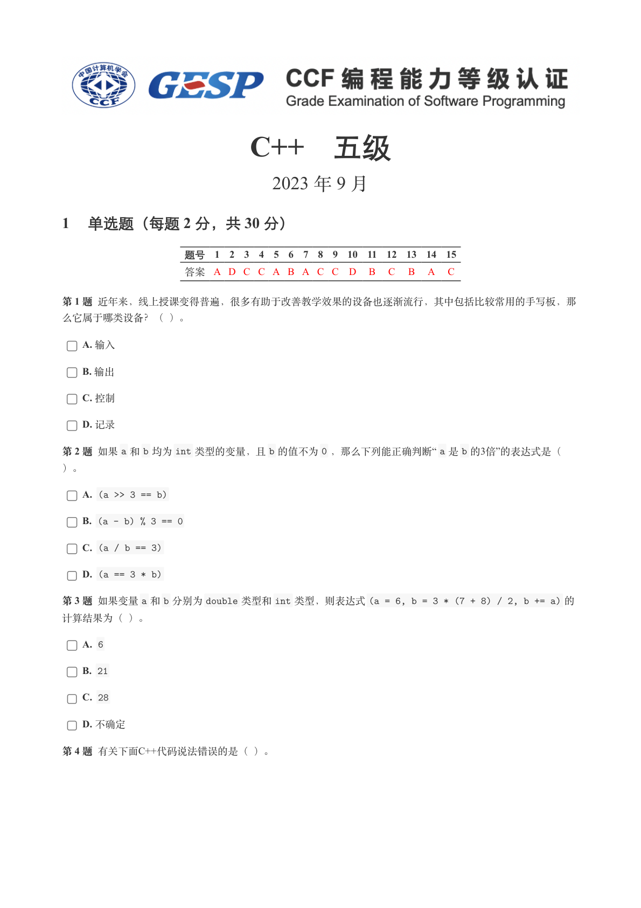

### 提取文本

```
C++　五级

                       2023 年 9 月

1 单选题（每题 2 分，共 30 分）


            题号  1  2  3  4  5  6  7  8  9  10  11  12  13  14  15
            答案 A D C C A B A C C D  B  C  B  A  C


第 1 题 近年来，线上授课变得普遍，很多有助于改善教学效果的设备也逐渐流行，其中包括比较常用的手写板，那

么它属于哪类设备？（ ）。

    A. 输入

    B. 输出

    C. 控制

    D. 记录

第 2 题 如果a 和b 均为int 类型的变量，且b 的值不为0 ，那么下列能正确判断“ a 是b 的3倍”的表达式是（

）。

    A. (a >> 3 == b)

    B. (a - b) % 3 == 0

    C. (a / b == 3)

    D. (a == 3 * b)

第 3 题 如果变量a 和b 分别为double 类型和int 类型，则表达式(a = 6, b = 3 * (7 + 8) / 2, b += a) 的

计算结果为（ ）。

    A. 6

    B. 21

    C. 28

    D. 不确定

第 4 题 有关下面C++代码说法错误的是（ ）。
```

## 第 2 页

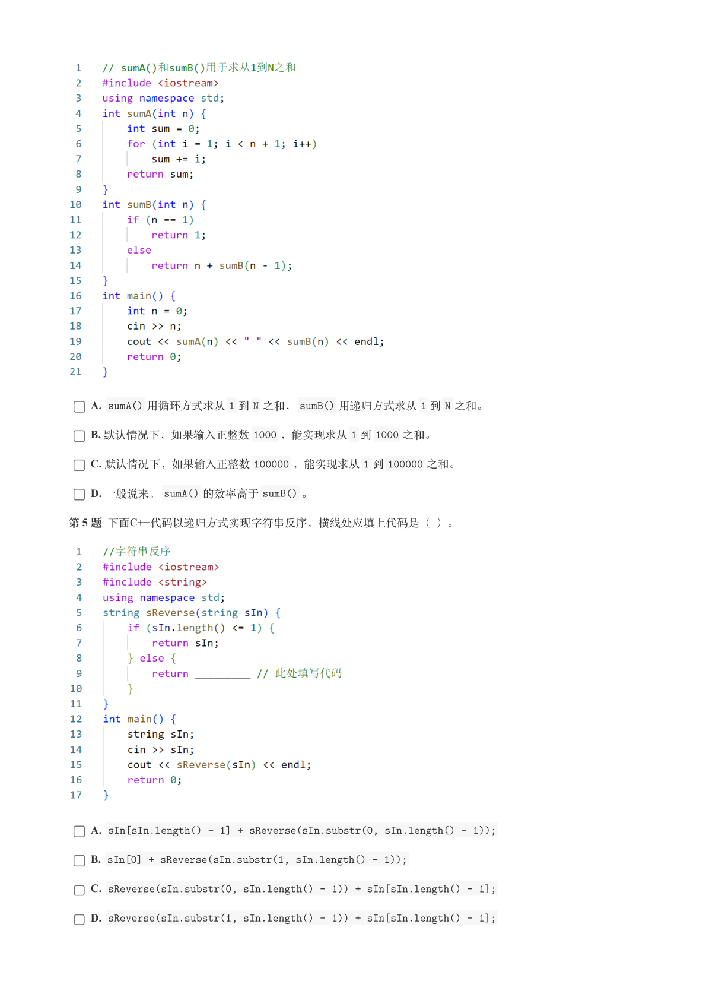

### 提取文本

```
A. sumA() 用循环方式求从1 到N 之和，sumB() 用递归方式求从1 到N 之和。

    B. 默认情况下，如果输入正整数1000 ，能实现求从1 到1000 之和。

    C. 默认情况下，如果输入正整数100000 ，能实现求从1 到100000 之和。

    D. 一般说来，sumA() 的效率高于sumB() 。

第 5 题 下面C++代码以递归方式实现字符串反序，横线处应填上代码是（ ）。


    A. sIn[sIn.length() - 1] + sReverse(sIn.substr(0, sIn.length() - 1));

    B. sIn[0] + sReverse(sIn.substr(1, sIn.length() - 1));

    C. sReverse(sIn.substr(0, sIn.length() - 1)) + sIn[sIn.length() - 1];

    D. sReverse(sIn.substr(1, sIn.length() - 1)) + sIn[sIn.length() - 1];
```

## 第 3 页

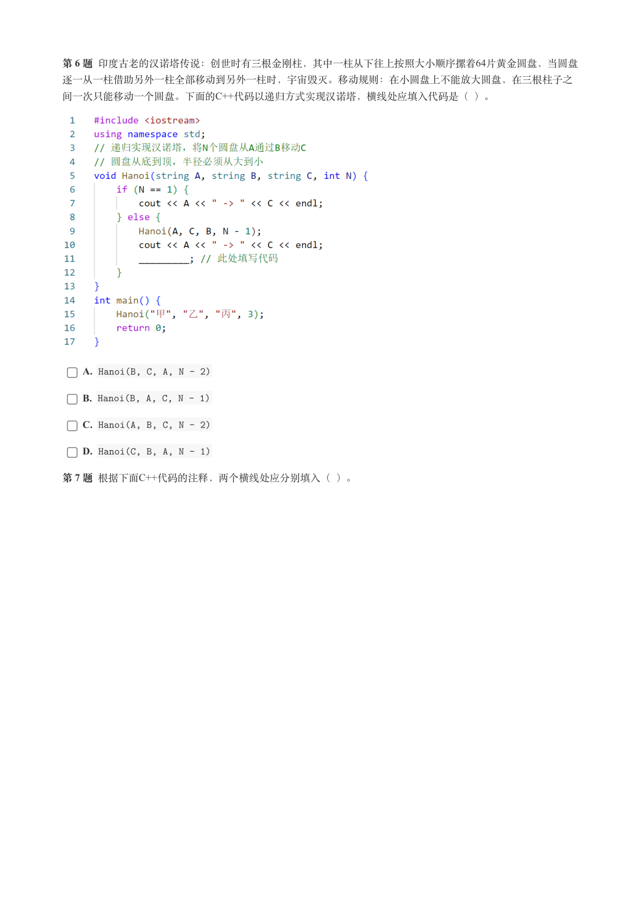

### 提取文本

```
第 6 题 印度古老的汉诺塔传说：创世时有三根金刚柱，其中一柱从下往上按照大小顺序摞着64片黄金圆盘，当圆盘

逐一从一柱借助另外一柱全部移动到另外一柱时，宇宙毁灭。移动规则：在小圆盘上不能放大圆盘，在三根柱子之

间一次只能移动一个圆盘。下面的C++代码以递归方式实现汉诺塔，横线处应填入代码是（ ）。


    A. Hanoi(B, C, A, N - 2)

    B. Hanoi(B, A, C, N - 1)

    C. Hanoi(A, B, C, N - 2)

    D. Hanoi(C, B, A, N - 1)

第 7 题 根据下面C++代码的注释，两个横线处应分别填入（ ）。
```

## 第 4 页

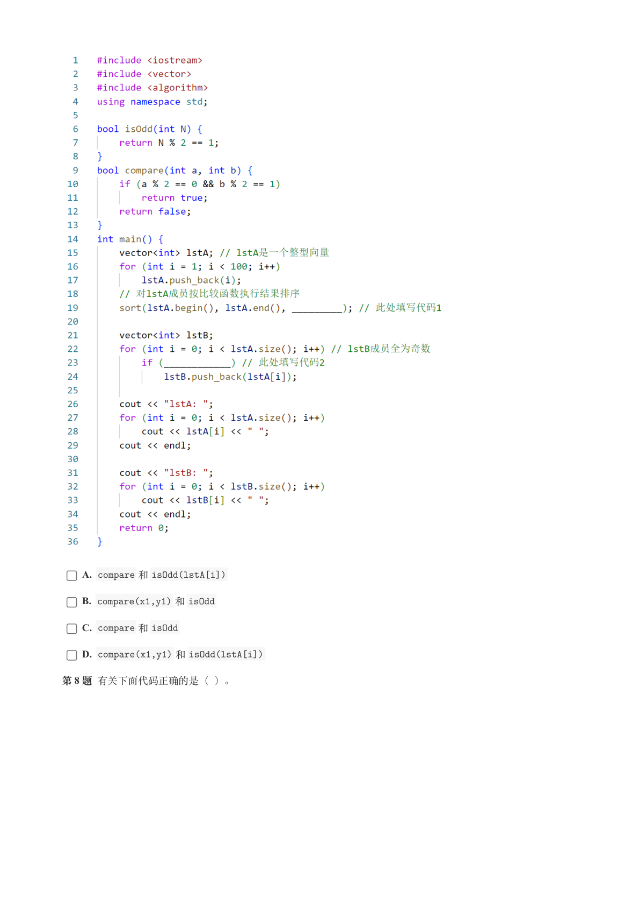

### 提取文本

```
A. compare 和isOdd(lstA[i])

    B. compare(x1,y1) 和isOdd

    C. compare 和isOdd

    D. compare(x1,y1) 和isOdd(lstA[i])

第 8 题 有关下面代码正确的是（ ）。
```

## 第 5 页

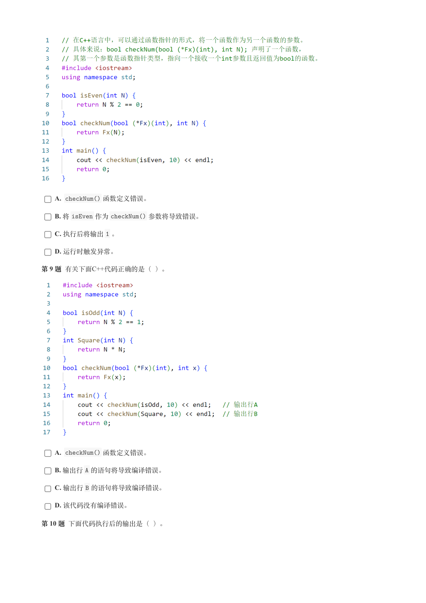

### 提取文本

```
A. checkNum() 函数定义错误。

    B. 将isEven 作为checkNum() 参数将导致错误。

    C. 执行后将输出1 。

    D. 运行时触发异常。

第 9 题 有关下面C++代码正确的是（ ）。


    A. checkNum() 函数定义错误。

    B. 输出行A 的语句将导致编译错误。

    C. 输出行B 的语句将导致编译错误。

    D. 该代码没有编译错误。

第 10 题 下面代码执行后的输出是（ ）。
```

## 第 6 页

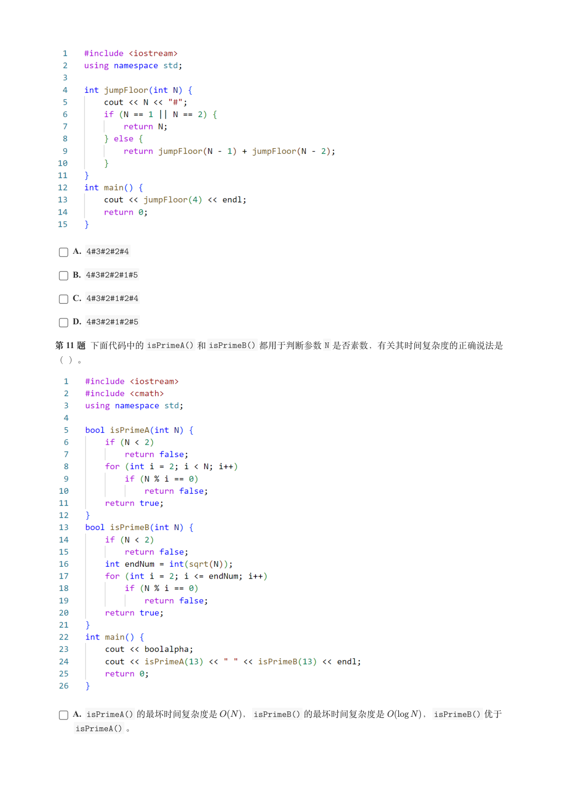

### 提取文本

```
A. 4#3#2#2#4

    B. 4#3#2#2#1#5

    C. 4#3#2#1#2#4

    D. 4#3#2#1#2#5

第 11 题 下面代码中的isPrimeA() 和isPrimeB() 都用于判断参数N 是否素数，有关其时间复杂度的正确说法是

（ ）。


    A. isPrimeA() 的最坏时间复杂度是     ，isPrimeB() 的最坏时间复杂度是       ，isPrimeB() 优于

    isPrimeA() 。
```

## 第 7 页

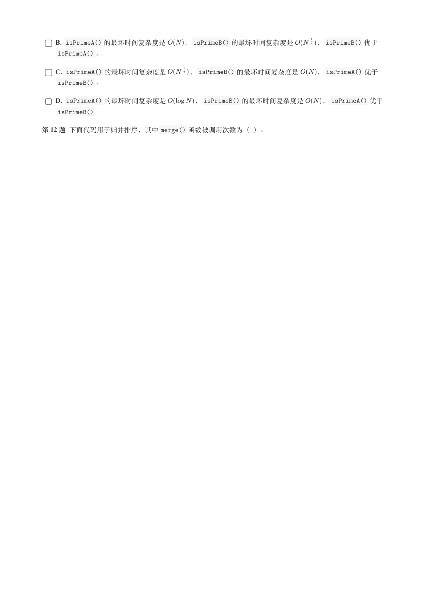

### 提取文本

```
B. isPrimeA() 的最坏时间复杂度是     ，isPrimeB() 的最坏时间复杂度是      ，isPrimeB() 优于

    isPrimeA() 。

    C. isPrimeA() 的最坏时间复杂度是      ，isPrimeB() 的最坏时间复杂度是     ，isPrimeA() 优于

    isPrimeB() 。

    D. isPrimeA() 的最坏时间复杂度是       ，isPrimeB() 的最坏时间复杂度是     ，isPrimeA() 优于

    isPrimeB()

第 12 题 下面代码用于归并排序，其中merge() 函数被调用次数为（ ）。
```

## 第 8 页

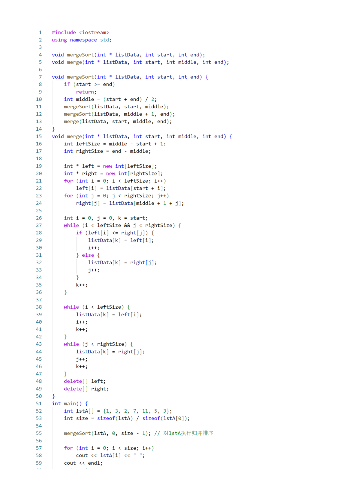

### 提取文本

```
[未提取到可用文本，请以本页图片为准。]
```

## 第 9 页

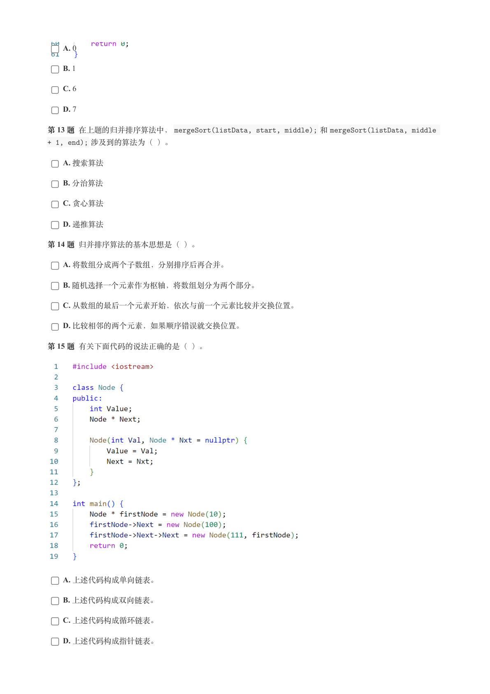

### 提取文本

```
A. 0

    B. 1

    C. 6

    D. 7

第 13 题 在上题的归并排序算法中，mergeSort(listData, start, middle); 和mergeSort(listData, middle

+ 1, end); 涉及到的算法为（ ）。

    A. 搜索算法

    B. 分治算法

    C. 贪心算法

    D. 递推算法

第 14 题 归并排序算法的基本思想是（ ）。

    A. 将数组分成两个子数组，分别排序后再合并。

    B. 随机选择一个元素作为枢轴，将数组划分为两个部分。

    C. 从数组的最后一个元素开始，依次与前一个元素比较并交换位置。

    D. 比较相邻的两个元素，如果顺序错误就交换位置。

第 15 题 有关下面代码的说法正确的是（ ）。


    A. 上述代码构成单向链表。

    B. 上述代码构成双向链表。

    C. 上述代码构成循环链表。

    D. 上述代码构成指针链表。
```

## 第 10 页

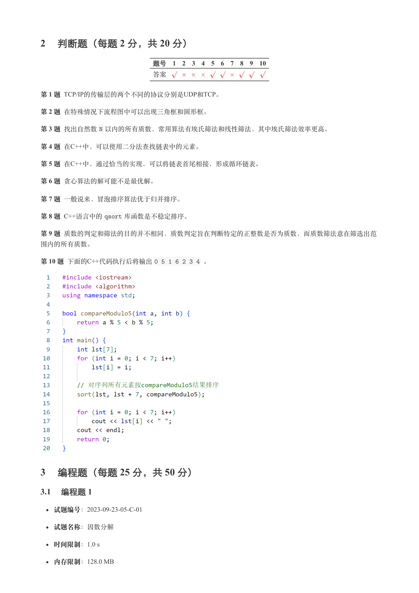

### 提取文本

```
2 判断题（每题 2 分，共 20 分）

                 题号  1  2  3  4  5  6  7  8  9  10

                 答案


第 1 题 TCP/IP的传输层的两个不同的协议分别是UDP和TCP。

第 2 题 在特殊情况下流程图中可以出现三角框和圆形框。

第 3 题 找出自然数N 以内的所有质数，常用算法有埃氏筛法和线性筛法，其中埃氏筛法效率更高。

第 4 题 在C++中，可以使用二分法查找链表中的元素。

第 5 题 在C++中，通过恰当的实现，可以将链表首尾相接，形成循环链表。

第 6 题 贪心算法的解可能不是最优解。

第 7 题 一般说来，冒泡排序算法优于归并排序。

第 8 题 C++语言中的qsort 库函数是不稳定排序。

第 9 题 质数的判定和筛法的目的并不相同，质数判定旨在判断特定的正整数是否为质数，而质数筛法意在筛选出范

围内的所有质数。

第 10 题 下面的C++代码执行后将输出0 5 1 6 2 3 4 。


3 编程题（每题 25 分，共 50 分）

3.1 编程题 1

   试题编号：2023-09-23-05-C-01


  试题名称：因数分解

   时间限制：1.0 s

   内存限制：128.0 MB
```

## 第 11 页

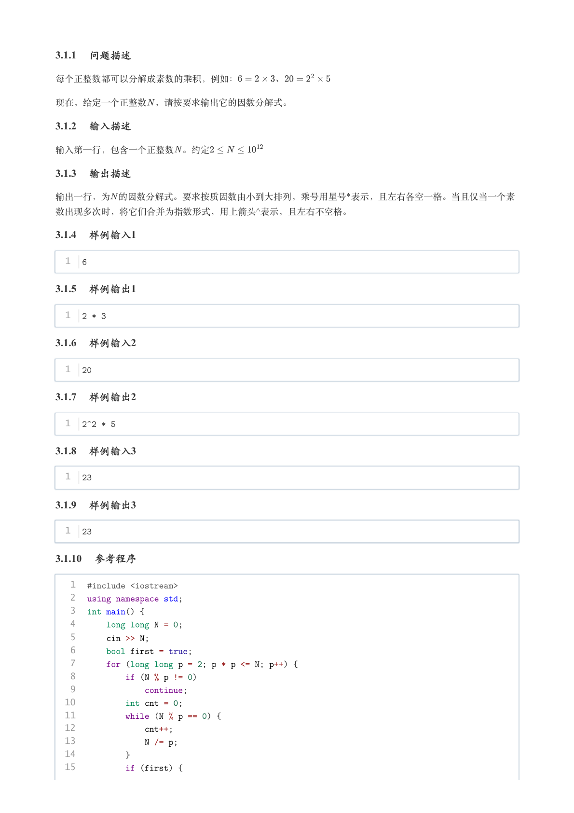

### 提取文本

```
3.1.1 问题描述

每个正整数都可以分解成素数的乘积，例如：    、


现在，给定一个正整数 ，请按要求输出它的因数分解式。

3.1.2 输入描述

输入第一行，包含一个正整数 。约定

3.1.3 输出描述

输出一行，为 的因数分解式。要求按质因数由小到大排列，乘号用星号*表示，且左右各空一格。当且仅当一个素
数出现多次时，将它们合并为指数形式，用上箭头^表示，且左右不空格。

3.1.4 样例输入1


  1  6

3.1.5 样例输出1


  1  2 * 3

3.1.6 样例输入2


  1  20

3.1.7 样例输出2


  1  2^2 * 5

3.1.8 样例输入3


  1  23

3.1.9 样例输出3


  1  23

3.1.10 参考程序


   1  #include <iostream>
   2  using namespace std;
   3  int main() {
   4      long long N = 0;
   5      cin >> N;
   6      bool first = true;
   7      for (long long p = 2; p * p <= N; p++) {
   8          if (N % p != 0)
   9              continue;
  10          int cnt = 0;
  11          while (N % p == 0) {
  12              cnt++;
  13              N /= p;
  14          }
  15          if (first) {
```

## 第 12 页

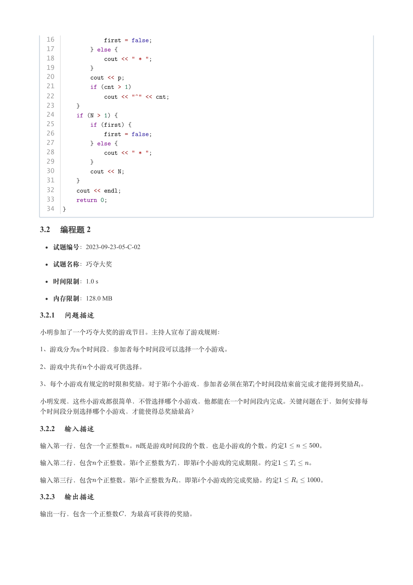

### 提取文本

```
16              first = false;
  17          } else {
  18              cout << " * ";
  19          }
  20          cout << p;
  21          if (cnt > 1)
  22              cout << "^" << cnt;
  23      }
  24      if (N > 1) {
  25          if (first) {
  26              first = false;
  27          } else {
  28              cout << " * ";
  29          }
  30          cout << N;
  31      }
  32      cout << endl;
  33      return 0;
  34  }

3.2 编程题 2

   试题编号：2023-09-23-05-C-02


  试题名称：巧夺大奖

   时间限制：1.0 s

   内存限制：128.0 MB

3.2.1 问题描述

小明参加了一个巧夺大奖的游戏节目。主持人宣布了游戏规则：

1、游戏分为个时间段，参加者每个时间段可以选择一个小游戏。

2、游戏中共有个小游戏可供选择。

3、每个小游戏有规定的时限和奖励。对于第个小游戏，参加者必须在第 个时间段结束前完成才能得到奖励 。


小明发现，这些小游戏都很简单，不管选择哪个小游戏，他都能在一个时间段内完成。关键问题在于，如何安排每

个时间段分别选择哪个小游戏，才能使得总奖励最高？

3.2.2 输入描述

输入第一行，包含一个正整数。既是游戏时间段的个数，也是小游戏的个数。约定     。


输入第二行，包含个正整数。第个正整数为 ，即第个小游戏的完成期限。约定     。


输入第三行，包含个正整数。第个正整数为 ，即第个小游戏的完成奖励。约定      。

3.2.3 输出描述

输出一行，包含一个正整数，为最高可获得的奖励。
```

## 第 13 页

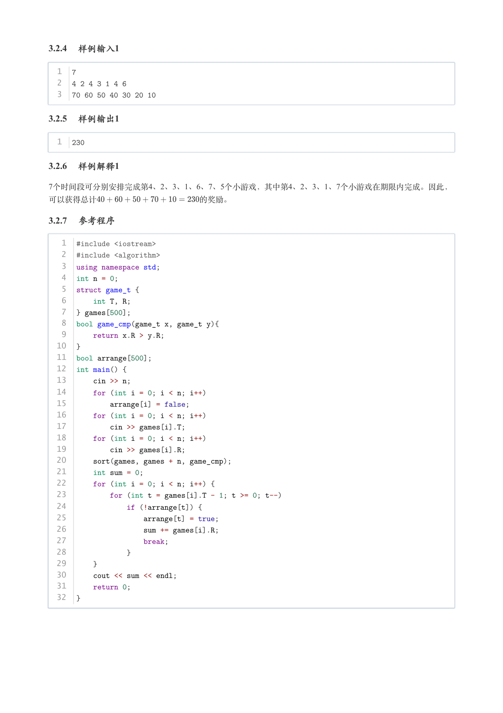

### 提取文本

```
3.2.4 样例输入1


  1  7
  2  4 2 4 3 1 4 6
  3  70 60 50 40 30 20 10

3.2.5 样例输出1


  1  230

3.2.6 样例解释1

7个时间段可分别安排完成第4、2、3、1、6、7、5个小游戏，其中第4、2、3、1、7个小游戏在期限内完成。因此，

可以获得总计             的奖励。

3.2.7 参考程序


   1  #include <iostream>
   2  #include <algorithm>
   3  using namespace std;
   4  int n = 0;
   5  struct game_t {
   6      int T, R;
   7  } games[500];
   8  bool game_cmp(game_t x, game_t y){
   9      return x.R > y.R;
  10  }
  11  bool arrange[500];
  12  int main() {
  13      cin >> n;
  14      for (int i = 0; i < n; i++)
  15          arrange[i] = false;
  16      for (int i = 0; i < n; i++)
  17          cin >> games[i].T;
  18      for (int i = 0; i < n; i++)
  19          cin >> games[i].R;
  20      sort(games, games + n, game_cmp);
  21      int sum = 0;
  22      for (int i = 0; i < n; i++) {
  23          for (int t = games[i].T - 1; t >= 0; t--)
  24              if (!arrange[t]) {
  25                  arrange[t] = true;
  26                  sum += games[i].R;
  27                  break;
  28              }
  29      }
  30      cout << sum << endl;
  31      return 0;
  32  }
```
