# 2023年9月-C++6级

- 原始 PDF：[`pdfs/2023年9月-C++6级.pdf`](../pdfs/2023年9月-C++6级.pdf)
- 页数：12
- 转换脚本：[`scripts/convert_pdfs_to_markdown.py`](../scripts/convert_pdfs_to_markdown.py)

> 为尽量避免信息丢失，每页均附带页面图片；文本提取结果保留原有顺序与换行特征，个别公式、图形、特殊排版请以页面图片为准。

## 第 1 页

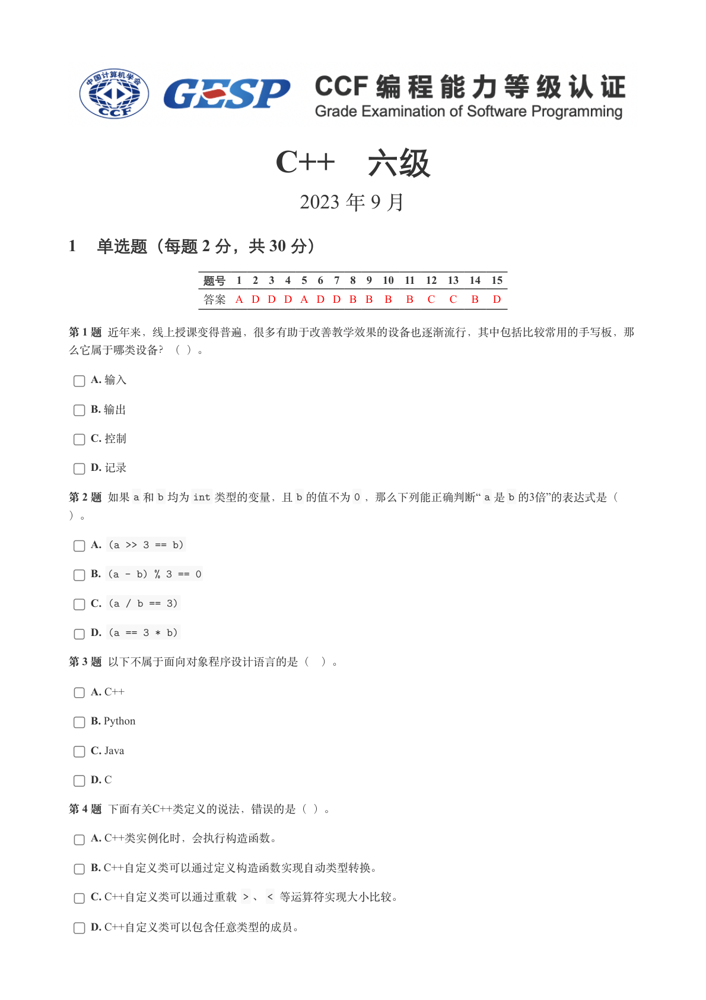

### 提取文本

```
C++　六级

                       2023 年 9 月

1 单选题（每题 2 分，共 30 分）


            题号  1  2  3  4  5  6  7  8  9  10  11  12  13  14  15
            答案 A D D D A D D B B  B  B  C  C  B  D


第 1 题 近年来，线上授课变得普遍，很多有助于改善教学效果的设备也逐渐流行，其中包括比较常用的手写板，那

么它属于哪类设备？（ ）。

    A. 输入

    B. 输出

    C. 控制

    D. 记录

第 2 题 如果a 和b 均为int 类型的变量，且b 的值不为0 ，那么下列能正确判断“ a 是b 的3倍”的表达式是（

）。

    A. (a >> 3 == b)

    B. (a - b) % 3 == 0

    C. (a / b == 3)

    D. (a == 3 * b)

第 3 题 以下不属于面向对象程序设计语言的是（ ）。

    A. C++

    B. Python

    C. Java

    D. C

第 4 题 下面有关C++类定义的说法，错误的是（ ）。

    A. C++类实例化时，会执行构造函数。

    B. C++自定义类可以通过定义构造函数实现自动类型转换。

    C. C++自定义类可以通过重载 > 、< 等运算符实现大小比较。

    D. C++自定义类可以包含任意类型的成员。
```

## 第 2 页

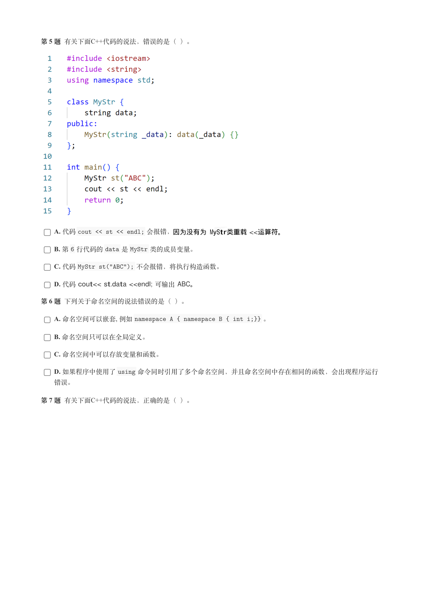

### 提取文本

```
第 5 题 有关下面C++代码的说法，错误的是（ ）。


    A. 代码cout << st << endl; 会报错，因为没有为 MyStr类重载 <<运算符。

    B. 第6 行代码的data 是MyStr 类的成员变量。

    C. 代码MyStr st("ABC"); 不会报错，将执行构造函数。

    D. 代码 cout<< st.data <<endl; 可输出 ABC。

第 6 题 下列关于命名空间的说法错误的是（ ）。

    A. 命名空间可以嵌套, 例如namespace A { namespace B { int i;}} 。

    B. 命名空间只可以在全局定义。

    C. 命名空间中可以存放变量和函数。

    D. 如果程序中使用了using 命令同时引用了多个命名空间，并且命名空间中存在相同的函数，会出现程序运行

  错误。

第 7 题 有关下面C++代码的说法，正确的是（ ）。
```

## 第 3 页

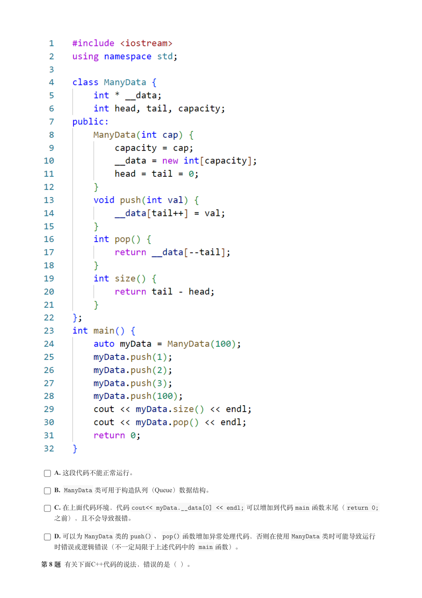

### 提取文本

```
A. 这段代码不能正常运行。

    B. ManyData 类可用于构造队列（Queue）数据结构。

    C. 在上面代码环境，代码cout<< myData.__data[0] << endl; 可以增加到代码main 函数末尾（return 0;

  之前），且不会导致报错。

    D. 可以为ManyData 类的push() 、pop() 函数增加异常处理代码，否则在使用ManyData 类时可能导致运行

  时错误或逻辑错误（不一定局限于上述代码中的 main 函数）。

第 8 题 有关下面C++代码的说法，错误的是（ ）。
```

## 第 4 页

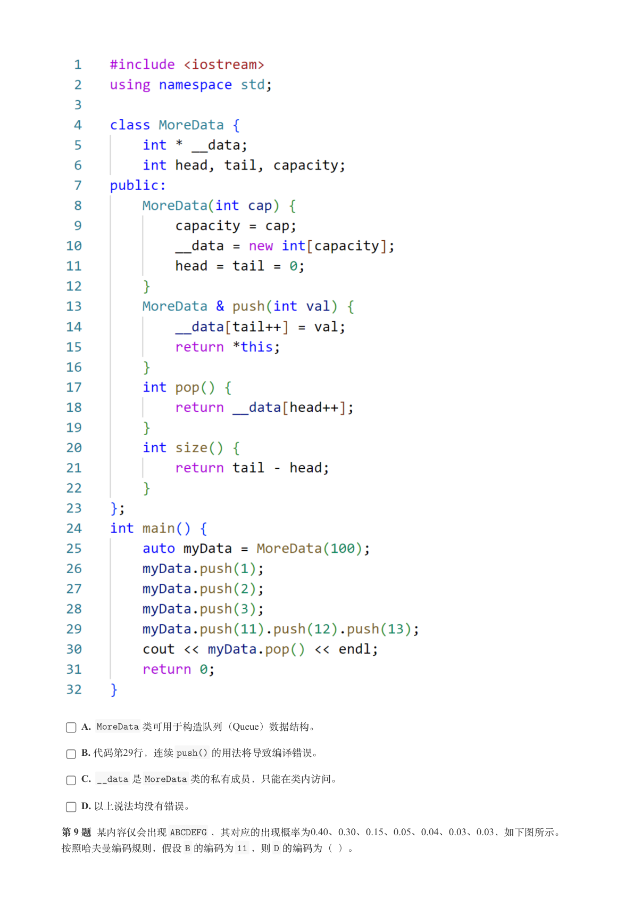

### 提取文本

```
A. MoreData 类可用于构造队列（Queue）数据结构。

    B. 代码第29行，连续push() 的用法将导致编译错误。

    C. __data 是MoreData 类的私有成员，只能在类内访问。

    D. 以上说法均没有错误。

第 9 题 某内容仅会出现ABCDEFG ，其对应的出现概率为0.40、0.30、0.15、0.05、0.04、0.03、0.03，如下图所示。

按照哈夫曼编码规则，假设B 的编码为11 ，则D 的编码为（ ）。
```

## 第 5 页

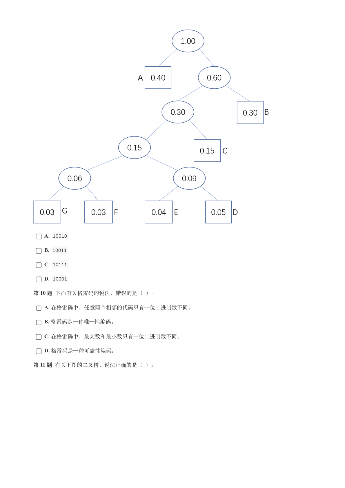

### 提取文本

```
A. 10010

    B. 10011

    C. 10111

    D. 10001

第 10 题 下面有关格雷码的说法，错误的是（ ）。

    A. 在格雷码中，任意两个相邻的代码只有一位二进制数不同。

    B. 格雷码是一种唯一性编码。

    C. 在格雷码中，最大数和最小数只有一位二进制数不同。

    D. 格雷码是一种可靠性编码。

第 11 题 有关下图的二叉树，说法正确的是（ ）。
```

## 第 6 页

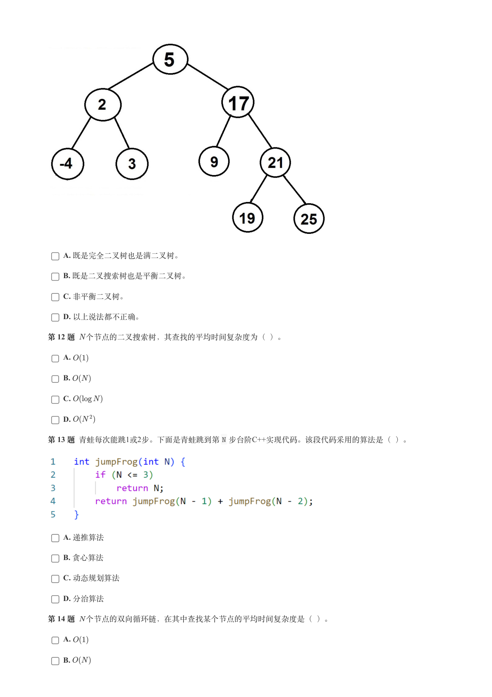

### 提取文本

```
A. 既是完全二叉树也是满二叉树。

    B. 既是二叉搜索树也是平衡二叉树。

    C. 非平衡二叉树。

    D. 以上说法都不正确。

第 12 题 个节点的二叉搜索树，其查找的平均时间复杂度为（ ）。

    A.

    B.

    C.

    D.

第 13 题 青蛙每次能跳1或2步。下面是青蛙跳到第N 步台阶C++实现代码。该段代码采用的算法是（ ）。


    A. 递推算法

    B. 贪心算法

    C. 动态规划算法

    D. 分治算法

第 14 题 个节点的双向循环链，在其中查找某个节点的平均时间复杂度是（ ）。

    A.

    B.
```

## 第 7 页

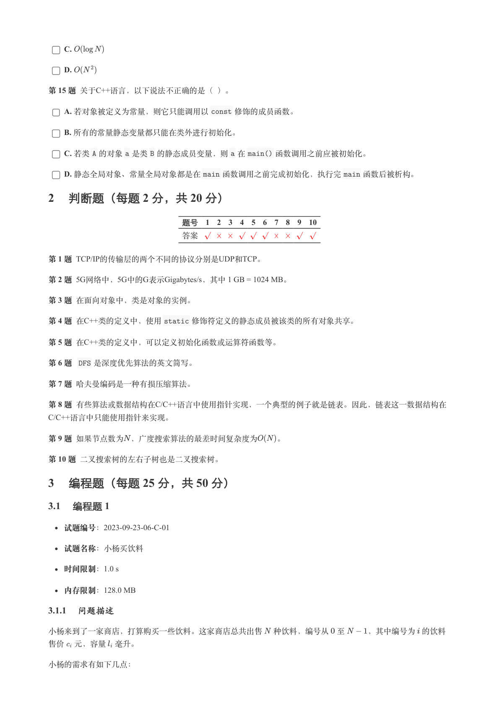

### 提取文本

```
C.

    D.

第 15 题 关于C++语言，以下说法不正确的是（ ）。

    A. 若对象被定义为常量，则它只能调用以const 修饰的成员函数。

    B. 所有的常量静态变量都只能在类外进行初始化。

    C. 若类A 的对象a 是类B 的静态成员变量，则a 在main() 函数调用之前应被初始化。

    D. 静态全局对象、常量全局对象都是在main 函数调用之前完成初始化，执行完main 函数后被析构。

2 判断题（每题 2 分，共 20 分）


                 题号  1  2  3  4  5  6  7  8  9  10

                 答案


第 1 题 TCP/IP的传输层的两个不同的协议分别是UDP和TCP。

第 2 题 5G网络中，5G中的G表示Gigabytes/s，其中 1 GB = 1024 MB。

第 3 题 在面向对象中，类是对象的实例。

第 4 题 在C++类的定义中，使用static 修饰符定义的静态成员被该类的所有对象共享。

第 5 题 在C++类的定义中，可以定义初始化函数或运算符函数等。

第 6 题  DFS 是深度优先算法的英文简写。

第 7 题 哈夫曼编码是一种有损压缩算法。

第 8 题 有些算法或数据结构在C/C++语言中使用指针实现，一个典型的例子就是链表。因此，链表这一数据结构在
C/C++语言中只能使用指针来实现。

第 9 题 如果节点数为 ，广度搜索算法的最差时间复杂度为  。

第 10 题 二叉搜索树的左右子树也是二叉搜索树。

3 编程题（每题 25 分，共 50 分）

3.1 编程题 1

   试题编号：2023-09-23-06-C-01


  试题名称：小杨买饮料

   时间限制：1.0 s

   内存限制：128.0 MB

3.1.1 问题描述

小杨来到了一家商店，打算购买一些饮料。这家商店总共出售 种饮料，编号从 至   ，其中编号为 的饮料

售价 元，容量 毫升。


小杨的需求有如下几点：
```

## 第 8 页

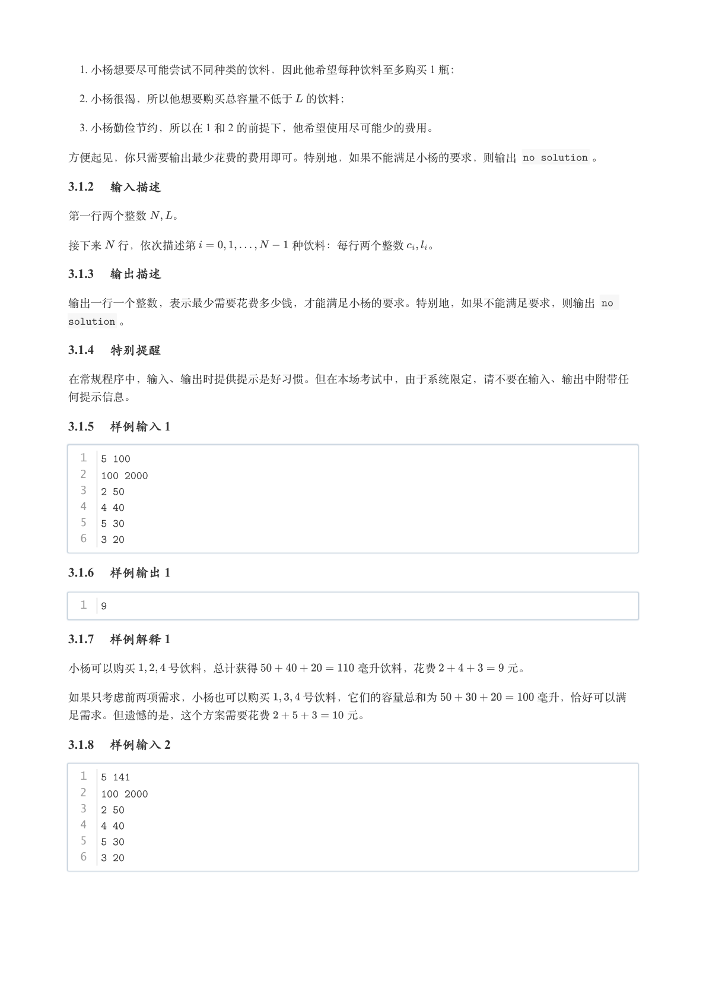

### 提取文本

```
1. 小杨想要尽可能尝试不同种类的饮料，因此他希望每种饮料至多购买 1 瓶；

   2. 小杨很渴，所以他想要购买总容量不低于 的饮料；

   3. 小杨勤俭节约，所以在 1 和 2 的前提下，他希望使用尽可能少的费用。


方便起见，你只需要输出最少花费的费用即可。特别地，如果不能满足小杨的要求，则输出 no solution 。

3.1.2 输入描述

第一行两个整数  。


接下来 行，依次描述第         种饮料：每行两个整数  。

3.1.3 输出描述

输出一行一个整数，表示最少需要花费多少钱，才能满足小杨的要求。特别地，如果不能满足要求，则输出 no

solution 。

3.1.4 特别提醒

在常规程序中，输入、输出时提供提示是好习惯。但在本场考试中，由于系统限定，请不要在输入、输出中附带任

何提示信息。

3.1.5 样例输入 1


  1  5 100
  2  100 2000
  3  2 50
  4  4 40
  5  5 30
  6  3 20

3.1.6 样例输出 1


  1  9

3.1.7 样例解释 1

小杨可以购买   号饮料，总计获得         毫升饮料，花费      元。


如果只考虑前两项需求，小杨也可以购买   号饮料，它们的容量总和为         毫升，恰好可以满

足需求。但遗憾的是，这个方案需要花费       元。

3.1.8 样例输入 2


  1  5 141
  2  100 2000
  3  2 50
  4  4 40
  5  5 30
  6  3 20
```

## 第 9 页

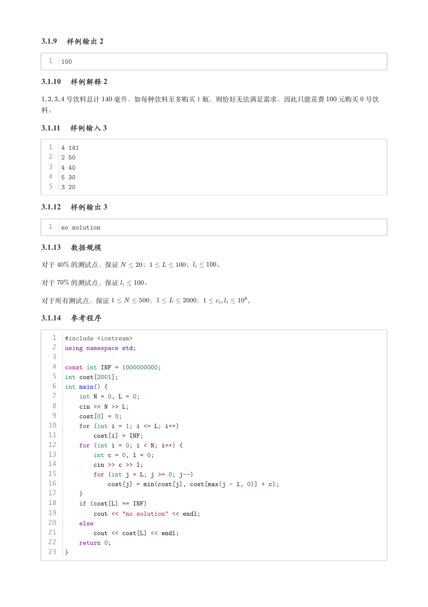

### 提取文本

```
3.1.9 样例输出 2


  1  100

3.1.10 样例解释 2

    号饮料总计  毫升，如每种饮料至多购买 1 瓶，则恰好无法满足需求，因此只能花费  元购买 号饮

料。

3.1.11 样例输入 3


  1  4 141
  2  2 50
  3  4 40
  4  5 30
  5  3 20

3.1.12 样例输出 3


  1  no solution

3.1.13 数据规模

对于  的测试点，保证    ；     ；   。


对于  的测试点，保证    。


对于所有测试点，保证      ；      ；       。

3.1.14 参考程序


   1  #include <iostream>
   2  using namespace std;
   3
   4  const int INF = 1000000000;
   5  int cost[2001];
   6  int main() {
   7      int N = 0, L = 0;
   8      cin >> N >> L;
   9      cost[0] = 0;
  10      for (int i = 1; i <= L; i++)
  11          cost[i] = INF;
  12      for (int i = 0; i < N; i++) {
  13          int c = 0, l = 0;
  14          cin >> c >> l;
  15          for (int j = L; j >= 0; j--)
  16              cost[j] = min(cost[j], cost[max(j - l, 0)] + c);
  17      }
  18      if (cost[L] == INF)
  19          cout << "no solution" << endl;
  20      else
  21          cout << cost[L] << endl;
  22      return 0;
  23  }
```

## 第 10 页

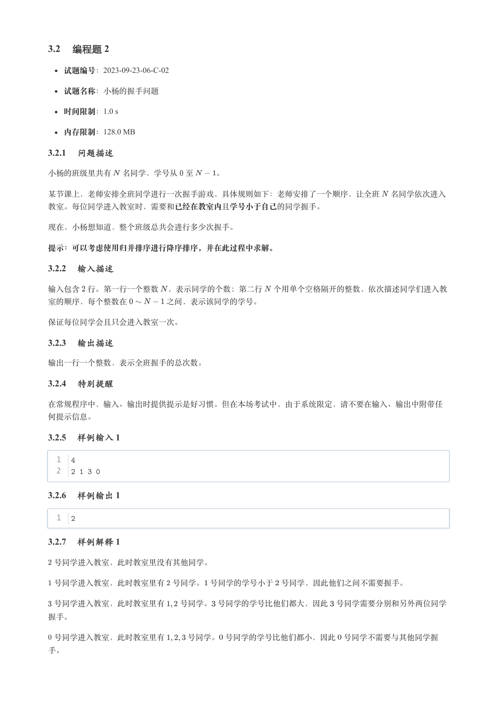

### 提取文本

```
3.2 编程题 2

   试题编号：2023-09-23-06-C-02


  试题名称：小杨的握手问题

   时间限制：1.0 s

   内存限制：128.0 MB

3.2.1 问题描述

小杨的班级里共有 名同学，学号从 至   。


某节课上，老师安排全班同学进行一次握手游戏，具体规则如下：老师安排了一个顺序，让全班 名同学依次进入

教室。每位同学进入教室时，需要和已经在教室内且学号小于自己的同学握手。


现在，小杨想知道，整个班级总共会进行多少次握手。


提示：可以考虑使用归并排序进行降序排序，并在此过程中求解。

3.2.2 输入描述

输入包含 行。第一行一个整数 ，表示同学的个数；第二行 个用单个空格隔开的整数，依次描述同学们进入教

室的顺序，每个整数在     之间，表示该同学的学号。


保证每位同学会且只会进入教室一次。

3.2.3 输出描述

输出一行一个整数，表示全班握手的总次数。

3.2.4 特别提醒

在常规程序中，输入、输出时提供提示是好习惯。但在本场考试中，由于系统限定，请不要在输入、输出中附带任

何提示信息。

3.2.5 样例输入 1


  1  4
  2  2 1 3 0

3.2.6 样例输出 1


  1  2

3.2.7 样例解释 1

 号同学进入教室，此时教室里没有其他同学。


 号同学进入教室，此时教室里有 号同学。 号同学的学号小于 号同学，因此他们之间不需要握手。


 号同学进入教室，此时教室里有  号同学。 号同学的学号比他们都大，因此 号同学需要分别和另外两位同学

握手。


 号同学进入教室，此时教室里有   号同学。 号同学的学号比他们都小，因此 号同学不需要与其他同学握

手。
```

## 第 11 页

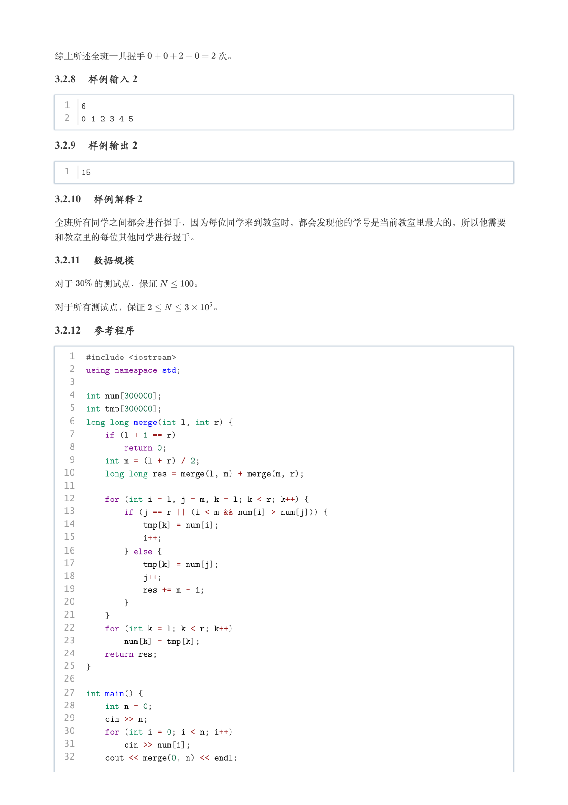

### 提取文本

```
综上所述全班一共握手        次。

3.2.8 样例输入 2


  1  6
  2  0 1 2 3 4 5

3.2.9 样例输出 2


  1  15

3.2.10 样例解释 2

全班所有同学之间都会进行握手，因为每位同学来到教室时，都会发现他的学号是当前教室里最大的，所以他需要

和教室里的每位其他同学进行握手。

3.2.11 数据规模

对于  的测试点，保证    。


对于所有测试点，保证        。

3.2.12 参考程序


   1  #include <iostream>
   2  using namespace std;
   3
   4  int num[300000];
   5  int tmp[300000];
   6  long long merge(int l, int r) {
   7      if (l + 1 == r)
   8          return 0;
   9      int m = (l + r) / 2;
  10      long long res = merge(l, m) + merge(m, r);
  11
  12      for (int i = l, j = m, k = l; k < r; k++) {
  13          if (j == r || (i < m && num[i] > num[j])) {
  14              tmp[k] = num[i];
  15              i++;
  16          } else {
  17              tmp[k] = num[j];
  18              j++;
  19              res += m - i;
  20          }
  21      }
  22      for (int k = l; k < r; k++)
  23          num[k] = tmp[k];
  24      return res;
  25  }
  26
  27  int main() {
  28      int n = 0;
  29      cin >> n;
  30      for (int i = 0; i < n; i++)
  31          cin >> num[i];
  32      cout << merge(0, n) << endl;
```

## 第 12 页

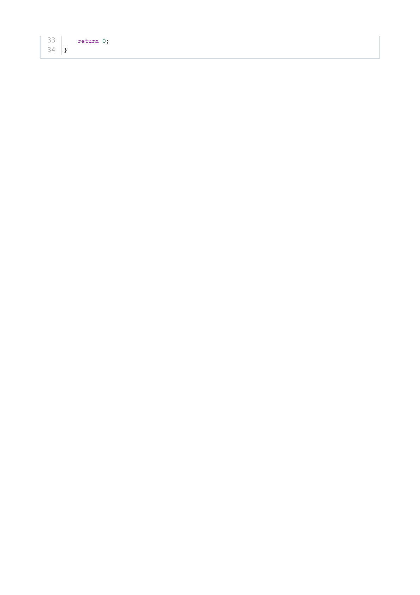

### 提取文本

```
33      return 0;
34  }
```
