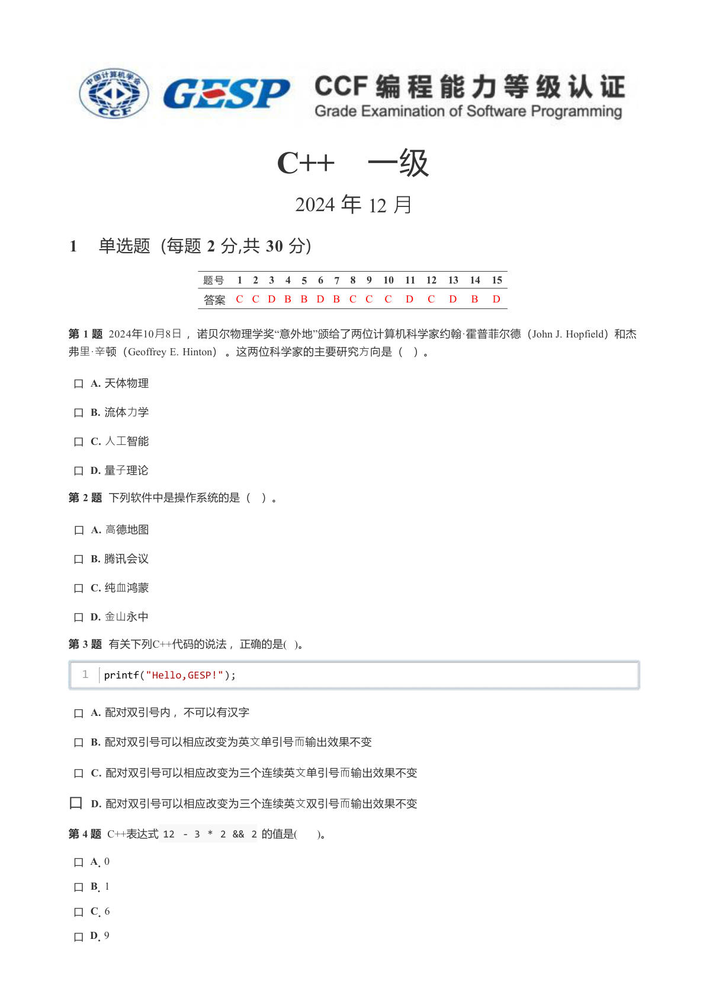
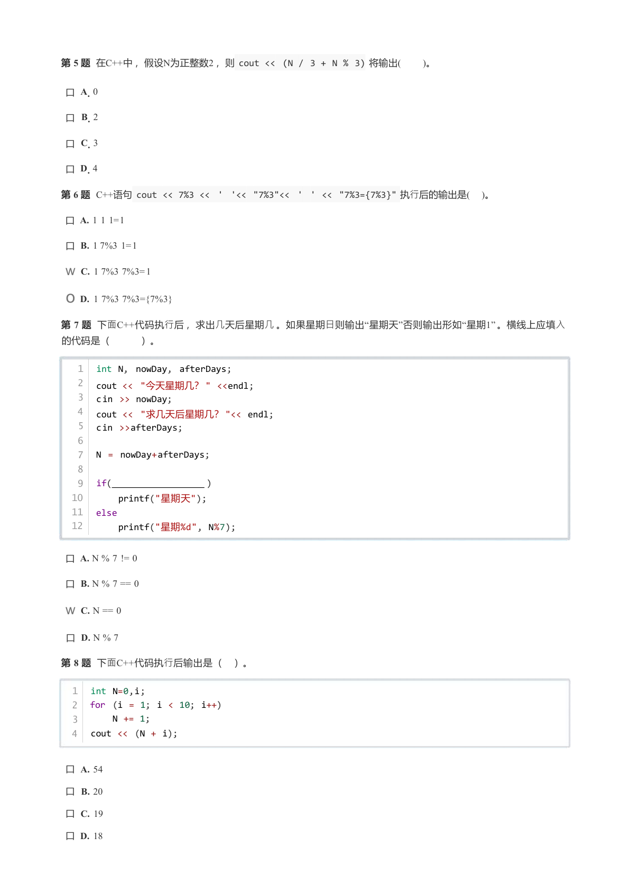
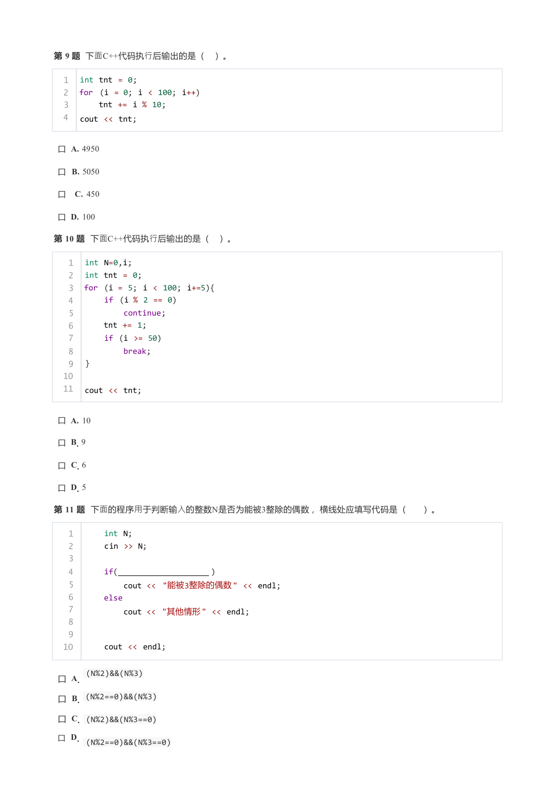
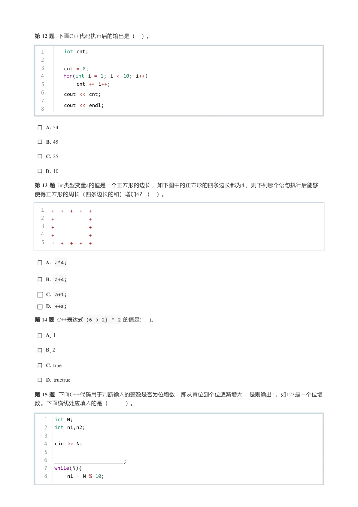
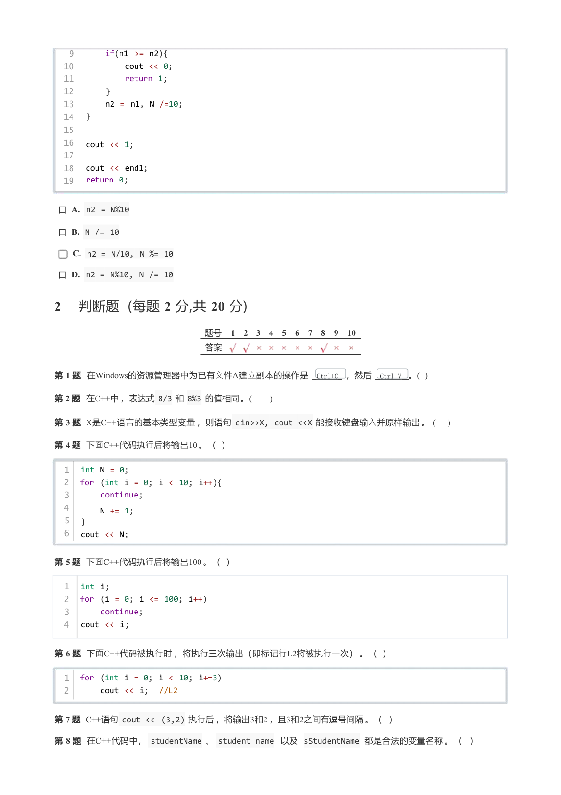
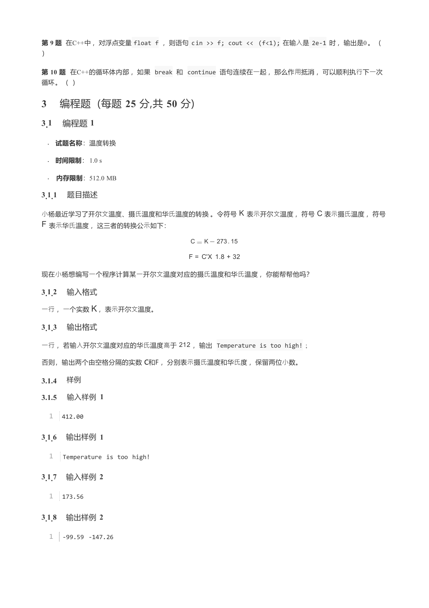
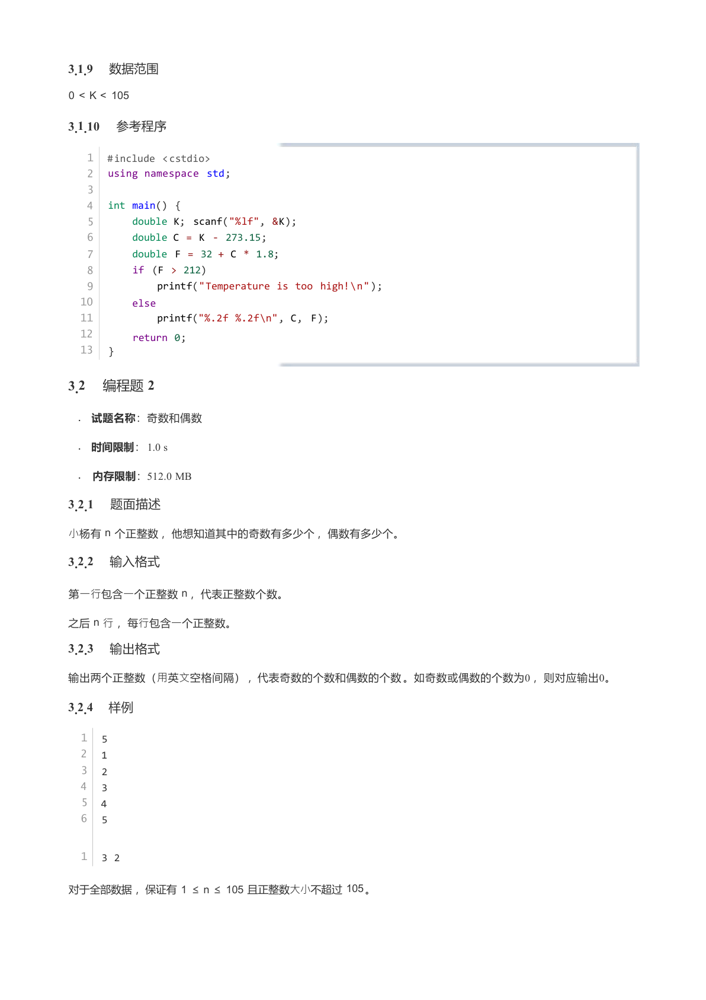
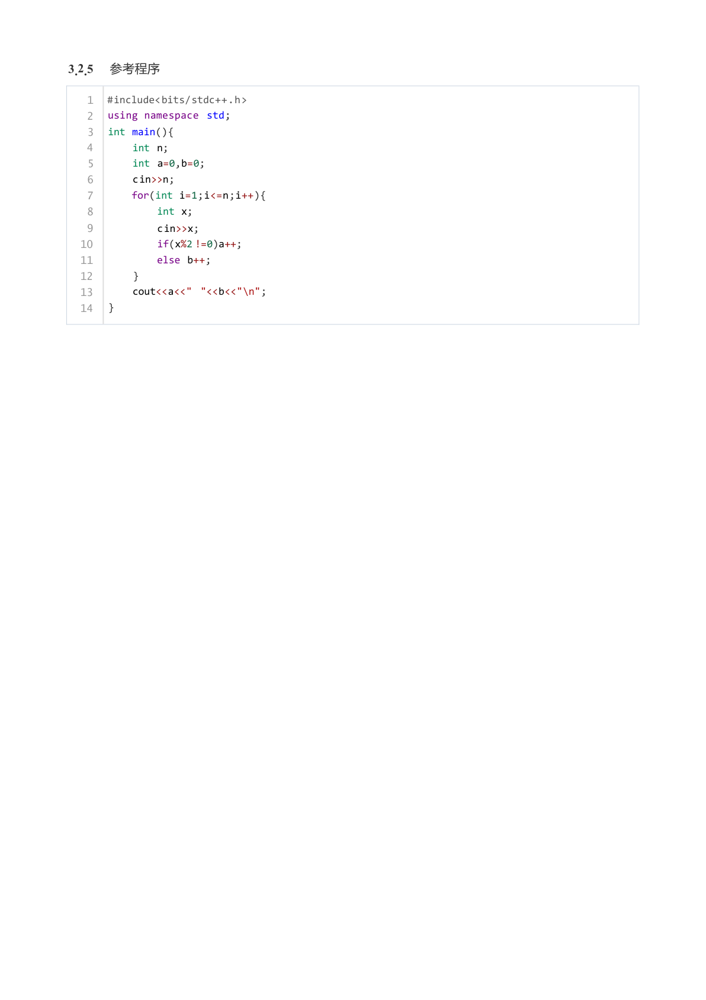

# 2024年12月-C++1级

- 原始 PDF：[`pdfs/2024年12月-C++1级.pdf`](../pdfs/2024年12月-C++1级.pdf)
- 页数：8
- 转换脚本：[`scripts/convert_pdfs_to_markdown.py`](../scripts/convert_pdfs_to_markdown.py)

> 为尽量避免信息丢失，每页均附带页面图片；文本提取结果保留原有顺序与换行特征，个别公式、图形、特殊排版请以页面图片为准。

## 第 1 页



### 提取文本

```
C++ 一级
                       2024 年 12 ⽉

1 单选题(每题2 分,共30 分)

             题号   1  2  3  4  5  6  7  8  9  10  11  12  13  14  15
             答案  C C D B B D B C C  C  D  C  D  B  D

第1 题2024年10⽉8⽇，诺贝尔物理学奖“意外地”颁给了两位计算机科学家约翰·霍普菲尔德（John J. Hopfield）和杰
弗⾥·⾟顿（Geoffrey E. Hinton）。这两位科学家的主要研究⽅向是（ ）。

 口A. 天体物理

 口B. 流体⼒学

 口C. ⼈⼯智能

 口D. 量⼦理论

第2 题下列软件中是操作系统的是（ ）。

 口A. ⾼德地图

 口B. 腾讯会议

 口C. 纯⾎鸿蒙

 口D. ⾦⼭永中

第3 题有关下列C++代码的说法，正确的是( )。

  1   printf("Hello,GESP!");


 口A. 配对双引号内，不可以有汉字

 口B. 配对双引号可以相应改变为英⽂单引号⽽输出效果不变

 口C. 配对双引号可以相应改变为三个连续英⽂单引号⽽输出效果不变

口D. 配对双引号可以相应改变为三个连续英⽂双引号⽽输出效果不变

第4 题C++表达式12 - 3 * 2 && 2 的值是(   )。

 口A. 0
 口B. 1
 口C. 6
 口D. 9
```

## 第 2 页



### 提取文本

```
第5 题在C++中，假设N为正整数2 ，则cout << (N / 3 + N % 3) 将输出(   )。

 口A. 0

 口B. 2

 口C. 3

 口D. 4

第6 题C++语句cout << 7%3 <<  '  '<< "7%3"<< ' ' << "7%3={7%3}" 执⾏后的输出是(  )。

 口A. 1 1 1=1

 口B. 1 7%3 1=1
w C. 1 7%3 7%3=1
 o D. 1 7%3 7%3={7%3}

第7 题下⾯C++代码执⾏后，求出⼏天后星期⼏。如果星期⽇则输出“星期天”否则输出形如“星期1” 。横线上应填⼊
的代码是（   ）。

   1  int N, nowDay, afterDays;
   2  cout << "今天星期几？" <<endl;
   3  cin >> nowDay;
   4   cout << "求几天后星期几？"<< endl;
   5  cin >>afterDays;
   6
   7  N = nowDay+afterDays;
   8
   9   if(                  )
  10      printf("星期天");
  11  else
  12      printf("星期%d", N%7);

 口A. N % 7 != 0

 口B. N % 7 == 0

w C. N == 0

 口D. N % 7

第8 题下⾯C++代码执⾏后输出是（ ）。

  1  int N=0,i;
  2  for (i = 1; i < 10; i++)
  3       N += 1;
  4   cout << (N + i);


 口A. 54

 口B. 20

 口C. 19

 口D. 18
```

## 第 3 页



### 提取文本

```
第9 题下⾯C++代码执⾏后输出的是（ ）。

  1  int tnt = 0;
  2  for (i = 0; i < 100; i++)
  3       tnt += i % 10;
  4   cout << tnt;


 口A. 4950

 口B. 5050

口  C. 450

 口D. 100

第10 题下⾯C++代码执⾏后输出的是（ ）。

   1  int N=0,i;
   2  int tnt = 0;
   3  for (i = 5; i < 100; i+=5){
   4       if (i % 2 == 0)
   5           continue;
   6       tnt += 1;
   7       if (i >= 50)
   8           break;
   9   }
  10
  11   cout << tnt;


 口A. 10

 口B. 9

 口C. 6

 口D. 5

第11 题下⾯的程序⽤于判断输⼊的整数N是否为能被3整除的偶数，横线处应填写代码是（  ）。

   1       int N;
   2       cin >> N;
   3
   4       if(                    )
   5           cout << "能被3整除的偶数" << endl;
   6       else
   7           cout << "其他情形" << endl;
   8
   9
  10       cout << endl;

       (N%2)&&(N%3)
 口A.
 口B. (N%2==0)&&(N%3)
 口C. (N%2)&&(N%3==0)
 口D.       (N%2==0)&&(N%3==0)
```

## 第 4 页



### 提取文本

```
第12 题下⾯C++代码执⾏后的输出是（ ）。

  1       int cnt;
  2
  3       cnt = 0;
  4       for(int i = 1; i < 10; i++)
  5           cnt += i++;
  6       cout << cnt;
  7
          cout << endl;
  8


 口A. 54

 口B. 45

 口C. 25

 口D. 10

第13 题int类型变量a的值是⼀个正⽅形的边长，如下图中的正⽅形的四条边长都为4 ，则下列哪个语句执⾏后能够
使得正⽅形的周长（四条边长的和）增加4？（ ）。

  1  +  +  +  +  +
  2  +            +
  3  +            +
  4  +            +
  5  +  +  +  +  +


 口A. a*4;

 口B. a+4;

    C. a+1;

    D. ++a;

第14 题C++表达式(6 > 2) * 2 的值是(  )。

 口A. 1

 口B. 2

 口C. true

 口D. truetrue

第15 题下⾯C++代码⽤于判断输⼊的整数是否为位增数，即从⾸位到个位逐渐增⼤，是则输出1 。如123是⼀个位增
数。下⾯横线处应填⼊的是（   ）。

   1  int N;
   2  int n1,n2;
   3
   4  cin >> N;
   5
   6                          ;
   7  while(N){
   8       n1 = N % 10;
```

## 第 5 页



### 提取文本

```
9       if(n1 >= n2){
  10           cout << 0;
  11           return 1;
  12       }
  13       n2 = n1, N /=10;
  14   }

  15
  16   cout << 1;
  17
  18   cout << endl;
  19   return 0;

 口A. n2 = N%10

 口B. N /= 10

     C. n2 = N/10, N %= 10

 口D. n2 = N%10, N /= 10

2 判断题(每题2 分,共20 分)

                  题号  1  2  3  4  5  6  7  8  9  10
                  答案

第1 题在Windows的资源管理器中为已有⽂件A建⽴副本的操作是  Ctrl+C ，然后  Ctrl+V 。(  )

第2 题在C++中，表达式8/3 和8%3 的值相同。(      )

第3 题X是C++语⾔的基本类型变量，则语句cin>>X, cout <<X 能接收键盘输⼊并原样输出。(    )

第4 题下⾯C++代码执⾏后将输出10 。(  )

  1  int N = 0;
  2  for (int i = 0; i < 10; i++){
  3      continue;
  4       N += 1;
  5  }
  6  cout << N;

第5 题下⾯C++代码执⾏后将输出100 。(  )

  1  int i;
  2  for (i = 0; i <= 100; i++)
  3      continue;
  4   cout << i;


第6 题下⾯C++代码被执⾏时，将执⾏三次输出（即标记⾏L2将被执⾏⼀次）。(  )

  1  for (int i = 0; i < 10; i+=3)
  2       cout << i;  //L2

第7 题C++语句cout << (3,2) 执⾏后，将输出3和2 ，且3和2之间有逗号间隔。(   )

第8 题在C++代码中，studentName 、student_name 以及sStudentName 都是合法的变量名称。(   )
```

## 第 6 页



### 提取文本

```
第9 题在C++中，对浮点变量float f ，则语句cin >> f; cout << (f<1); 在输⼊是2e-1 时，输出是0 。(
)

第10 题在C++的循环体内部，如果break 和continue 语句连续在⼀起，那么作⽤抵消，可以顺利执⾏下⼀次
循环。(  )

3 编程题(每题25 分,共50 分)
3.1 编程题1

   . 试题名称：温度转换

   . 时间限制：1.0 s

   . 内存限制：512.0 MB

3.1.1 题目描述

⼩杨最近学习了开尔⽂温度、摄⽒温度和华⽒温度的转换。令符号K 表⽰开尔⽂温度，符号C 表⽰摄⽒温度，符号
F 表⽰华⽒温度，这三者的转换公⽰如下：

                                  C  K   273. 15

                                     F = C'X 1.8 + 32

现在⼩杨想编写⼀个程序计算某⼀开尔⽂温度对应的摄⽒温度和华⽒温度，你能帮帮他吗？

3.1.2 输入格式
⼀⾏，⼀个实数K ，表⽰开尔⽂温度。

3.1.3 输出格式

⼀⾏，若输⼊开尔⽂温度对应的华⽒温度⾼于212 ，输出Temperature is too high!  ;

否则，输出两个由空格分隔的实数C和F ，分别表⽰摄⽒温度和华⽒度，保留两位⼩数。

3.1.4 样例
3.1.5 输入样例1

  1  412.00

3.1.6 输出样例1

  1   Temperature is too high!

3.1.7 输入样例2

  1   173.56

3.1.8 输出样例2

  1   -99.59 -147.26
```

## 第 7 页



### 提取文本

```
3.1.9 数据范围

0 < K < 105

3.1.10 参考程序

   1  #include <cstdio>
   2  using namespace std;
   3
   4   int main() {
   5       double K; scanf("%lf", &K);
   6       double C = K - 273.15;
   7       double F = 32 + C * 1.8;
   8       if (F > 212)
   9           printf("Temperature is too high!\n");
  10       else
  11           printf("%.2f %.2f\n", C, F);
  12       return 0;
  13   }

3.2 编程题2

   . 试题名称：奇数和偶数

   . 时间限制：1.0 s

   . 内存限制：512.0 MB

3.2.1 题面描述

⼩杨有n 个正整数，他想知道其中的奇数有多少个，偶数有多少个。

3.2.2 输入格式

第⼀⾏包含⼀个正整数n ，代表正整数个数。

之后n ⾏，每⾏包含⼀个正整数。

3.2.3 输出格式

输出两个正整数（⽤英⽂空格间隔），代表奇数的个数和偶数的个数。如奇数或偶数的个数为0 ，则对应输出0。

3.2.4 样例

  1  5
  2  1
  3  2
  4   3
  5  4
  6  5


  1  3 2

对于全部数据，保证有1 ≤n ≤105 且正整数⼤⼩不超过105。
```

## 第 8 页



### 提取文本

```
3.2.5 参考程序

   1  #include<bits/stdc++.h>
   2  using namespace std;
   3  int main(){
   4       int n;
   5       int a=0,b=0;
   6      cin>>n;
   7      for(int i=1;i<=n;i++){
   8           int x;
   9           cin>>x;
  10           if(x%2 !=0)a++;
  11           else b++;
  12       }
  13       cout<<a<<" "<<b<<"\n";
  14   }
```
