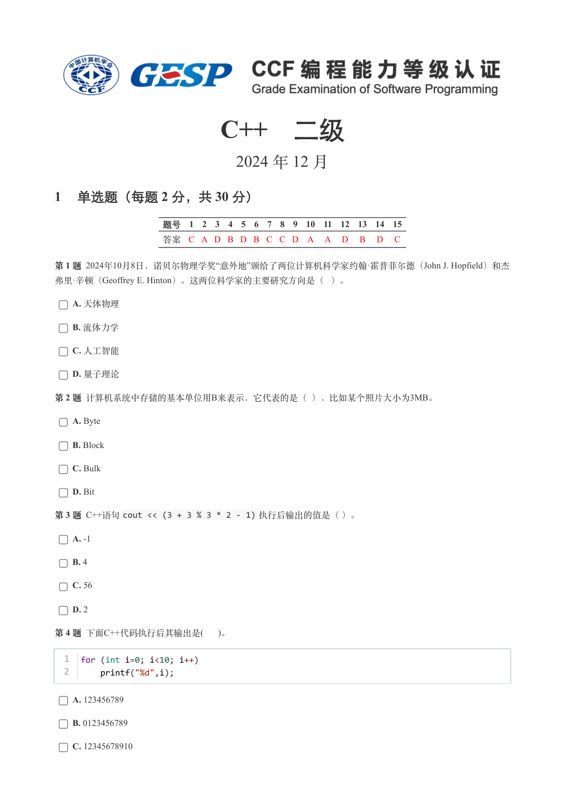
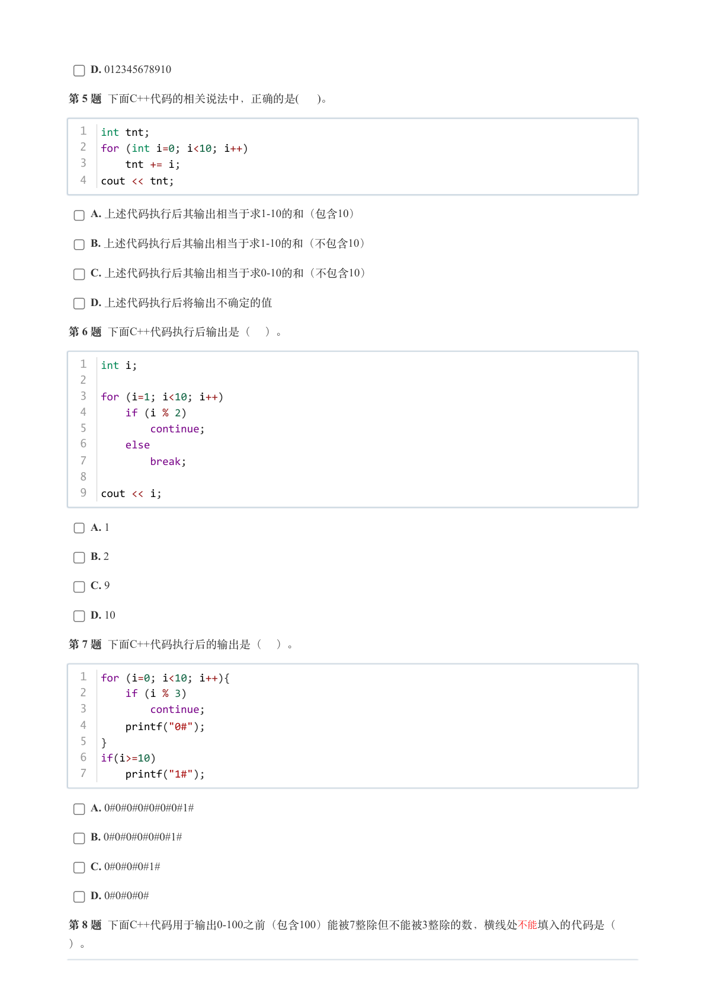
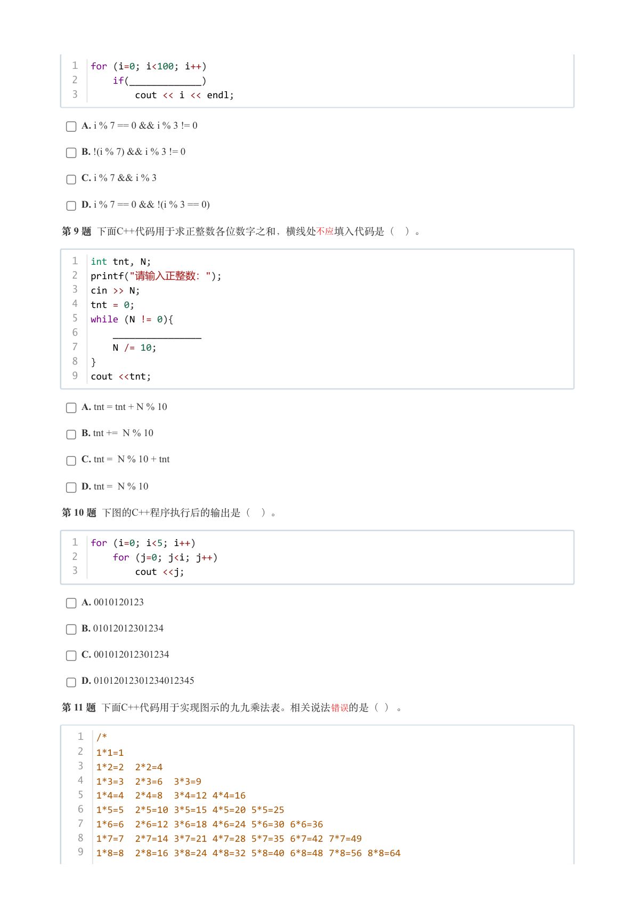
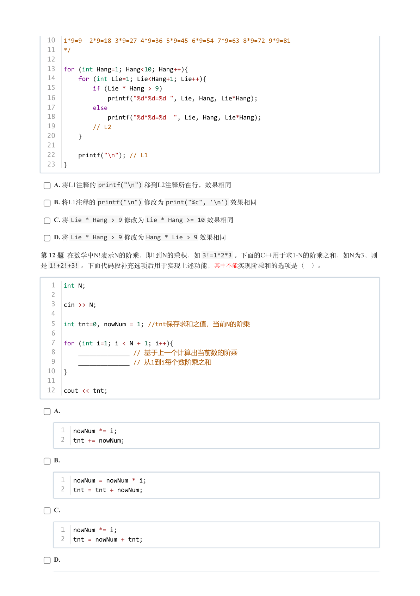
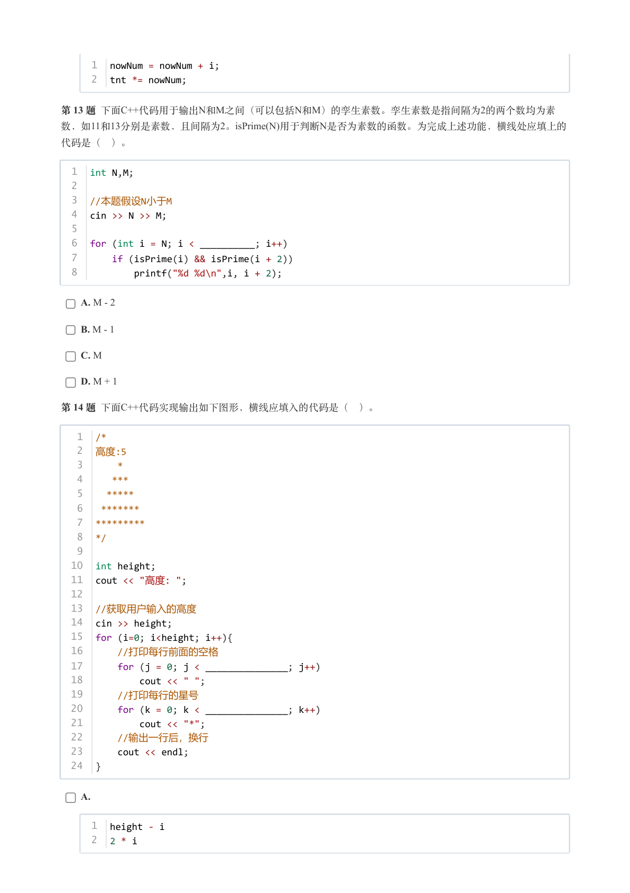
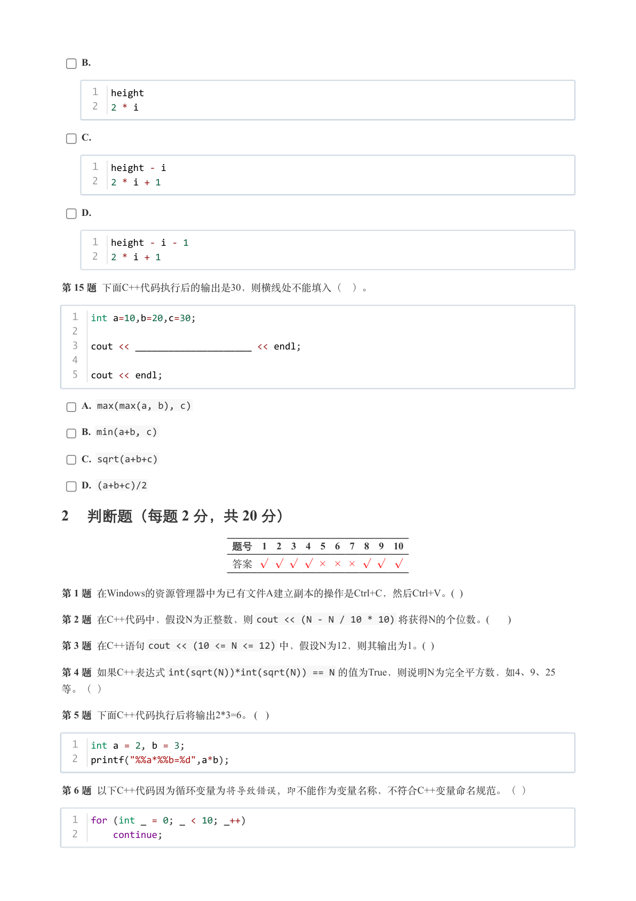
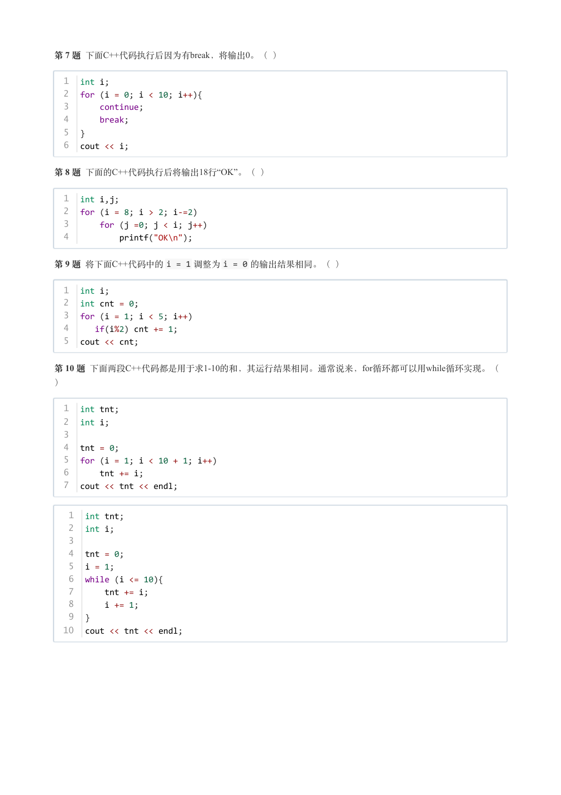
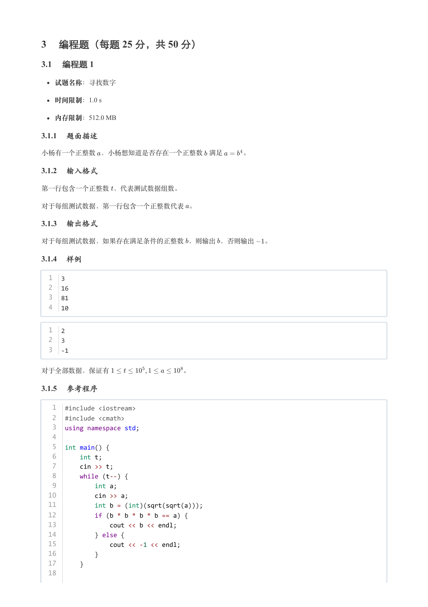
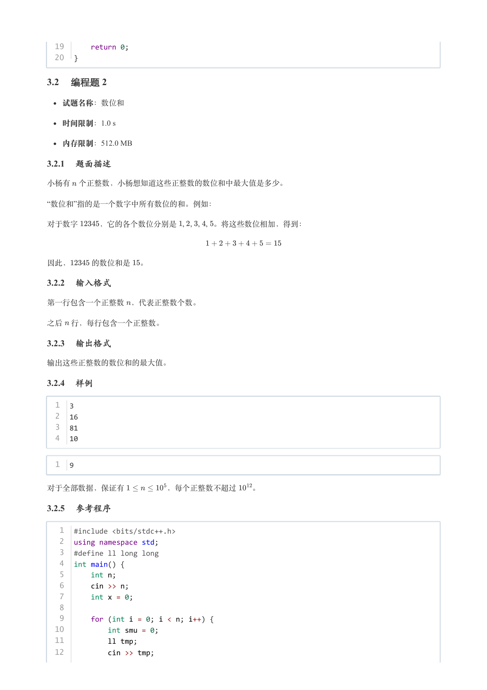
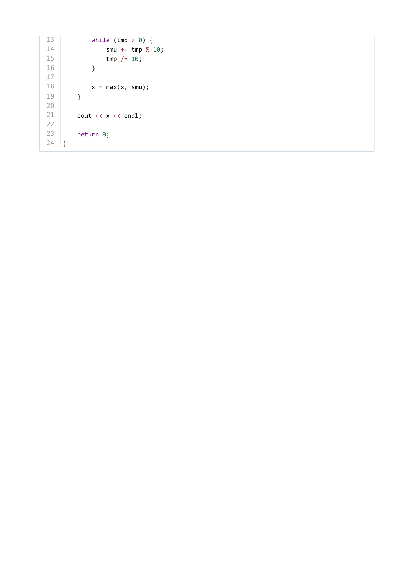

# 2024年12月-C++2级

- 原始 PDF：[`pdfs/2024年12月-C++2级.pdf`](../pdfs/2024年12月-C++2级.pdf)
- 页数：10
- 转换脚本：[`scripts/convert_pdfs_to_markdown.py`](../scripts/convert_pdfs_to_markdown.py)

> 为尽量避免信息丢失，每页均附带页面图片；文本提取结果保留原有顺序与换行特征，个别公式、图形、特殊排版请以页面图片为准。

## 第 1 页



### 提取文本

```
C++　二级

                      2024 年 12 月

1 单选题（每题 2 分，共 30 分）


            题号  1  2  3  4  5  6  7  8  9  10  11  12  13  14  15
            答案 C A D B D B C C D A  A  D  B  D  C


第 1 题 2024年10月8日，诺贝尔物理学奖“意外地”颁给了两位计算机科学家约翰·霍普菲尔德（John J. Hopfield）和杰
弗里·辛顿（Geoffrey E. Hinton）。这两位科学家的主要研究方向是（ ）。

    A. 天体物理

    B. 流体力学

    C. 人工智能

    D. 量子理论

第 2 题 计算机系统中存储的基本单位用B来表示，它代表的是（ ），比如某个照片大小为3MB。

    A. Byte

    B. Block

    C. Bulk

    D. Bit

第 3 题 C++语句cout << (3 + 3 % 3 * 2 - 1) 执行后输出的值是（ ）。

    A. -1

    B. 4

    C. 56

    D. 2

第 4 题 下面C++代码执行后其输出是(  )。


  1  for (int i=0; i<10; i++)
  2      printf("%d",i);


    A. 123456789

    B. 0123456789

    C. 12345678910
```

## 第 2 页



### 提取文本

```
D. 012345678910

第 5 题 下面C++代码的相关说法中，正确的是(  )。


  1  int tnt;
  2  for (int i=0; i<10; i++)
  3      tnt += i;
  4  cout << tnt;


    A. 上述代码执行后其输出相当于求1-10的和（包含10）

    B. 上述代码执行后其输出相当于求1-10的和（不包含10）

    C. 上述代码执行后其输出相当于求0-10的和（不包含10）

    D. 上述代码执行后将输出不确定的值

第 6 题 下面C++代码执行后输出是（ ）。


  1  int i;
  2
  3  for (i=1; i<10; i++)
  4      if (i % 2)
  5          continue;
  6      else
  7          break;
  8
  9  cout << i;


    A. 1

    B. 2

    C. 9

    D. 10

第 7 题 下面C++代码执行后的输出是（ ）。


  1  for (i=0; i<10; i++){
  2      if (i % 3)
  3          continue;
  4      printf("0#");
  5  }
  6  if(i>=10)
  7      printf("1#");


    A. 0#0#0#0#0#0#0#1#

    B. 0#0#0#0#0#0#1#

    C. 0#0#0#0#1#

    D. 0#0#0#0#

第 8 题 下面C++代码用于输出0-100之前（包含100）能被7整除但不能被3整除的数，横线处不能 填入的代码是（

）。
```

## 第 3 页



### 提取文本

```
1  for (i=0; i<100; i++)
  2      if(_____________)
  3          cout << i << endl;


    A. i % 7 == 0 && i % 3 != 0

    B. !(i % 7) && i % 3 != 0

    C. i % 7 && i % 3

    D. i % 7 == 0 && !(i % 3 == 0)

第 9 题 下面C++代码用于求正整数各位数字之和，横线处不应 填入代码是（ ）。


  1  int tnt, N;
  2  printf("请输入正整数：");
  3  cin >> N;
  4  tnt = 0;
  5  while (N != 0){
  6      ________________
  7      N /= 10;
  8  }
  9  cout <<tnt;


    A. tnt = tnt + N % 10

    B. tnt += N % 10

    C. tnt = N % 10 + tnt

    D. tnt = N % 10

第 10 题 下图的C++程序执行后的输出是（ ）。


  1  for (i=0; i<5; i++)
  2      for (j=0; j<i; j++)
  3          cout <<j;


    A. 0010120123

    B. 01012012301234

    C. 001012012301234

    D. 01012012301234012345

第 11 题 下面C++代码用于实现图示的九九乘法表。相关说法 错误的是（ ） 。


   1  /*
   2  1*1=1
   3  1*2=2  2*2=4
   4  1*3=3  2*3=6  3*3=9
   5  1*4=4  2*4=8  3*4=12 4*4=16
   6  1*5=5  2*5=10 3*5=15 4*5=20 5*5=25
   7  1*6=6  2*6=12 3*6=18 4*6=24 5*6=30 6*6=36
   8  1*7=7  2*7=14 3*7=21 4*7=28 5*7=35 6*7=42 7*7=49
   9  1*8=8  2*8=16 3*8=24 4*8=32 5*8=40 6*8=48 7*8=56 8*8=64
```

## 第 4 页



### 提取文本

```
10  1*9=9  2*9=18 3*9=27 4*9=36 5*9=45 6*9=54 7*9=63 8*9=72 9*9=81
  11  */
  12
  13  for (int Hang=1; Hang<10; Hang++){
  14      for (int Lie=1; Lie<Hang+1; Lie++){
  15          if (Lie * Hang > 9)
  16              printf("%d*%d=%d ", Lie, Hang, Lie*Hang);
  17          else
  18              printf("%d*%d=%d  ", Lie, Hang, Lie*Hang);
  19          // L2
  20      }
  21
  22      printf("\n"); // L1
  23  }


    A. 将L1注释的printf("\n") 移到L2注释所在行，效果相同

    B. 将L1注释的printf("\n") 修改为print("%c", '\n') 效果相同

    C. 将Lie * Hang > 9 修改为Lie * Hang >= 10 效果相同

    D. 将Lie * Hang > 9 修改为Hang * Lie > 9 效果相同

第 12 题 在数学中N!表示N的阶乘，即1到N的乘积，如3!=1*2*3 。下面的C++用于求1-N的阶乘之和，如N为3，则
是1!+2!+3! 。下面代码段补充选项后用于实现上述功能， 其中不能实现阶乘和的选项是（ ）。


   1  int N;
   2
   3  cin >> N;
   4
   5  int tnt=0, nowNum = 1; //tnt保存求和之值，当前N的阶乘
   6
   7  for (int i=1; i < N + 1; i++){
   8      ______________ // 基于上一个计算出当前数的阶乘
   9      ______________ // 从1到i每个数阶乘之和
  10  }
  11
  12  cout << tnt;


    A.


     1  nowNum *= i;
     2  tnt += nowNum;


    B.


     1  nowNum = nowNum * i;
     2  tnt = tnt + nowNum;


    C.


     1  nowNum *= i;
     2  tnt = nowNum + tnt;


    D.
```

## 第 5 页



### 提取文本

```
1  nowNum = nowNum + i;
     2  tnt *= nowNum;


第 13 题 下面C++代码用于输出N和M之间（可以包括N和M）的孪生素数。孪生素数是指间隔为2的两个数均为素
数，如11和13分别是素数，且间隔为2。isPrime(N)用于判断N是否为素数的函数。为完成上述功能，横线处应填上的

代码是（ ）。


  1  int N,M;
  2
  3  //本题假设N小于M
  4  cin >> N >> M;
  5
  6  for (int i = N; i < __________; i++)
  7      if (isPrime(i) && isPrime(i + 2))
  8          printf("%d %d\n",i, i + 2);


    A. M - 2

    B. M - 1

    C. M

    D. M + 1

第 14 题 下面C++代码实现输出如下图形，横线应填入的代码是（ ）。


   1  /*
   2  高度:5
   3      *
   4     ***
   5    *****
   6   *******
   7  *********
   8  */
   9
  10  int height;
  11  cout << "高度: ";
  12
  13 //获取用户输入的高度
  14  cin >> height;
  15  for (i=0; i<height; i++){
  16    //打印每行前面的空格
  17      for (j = 0; j < _______________; j++)
  18          cout << " ";
  19    //打印每行的星号
  20      for (k = 0; k < _______________; k++)
  21          cout << "*";
  22    //输出一行后，换行
  23      cout << endl;
  24  }


    A.


     1  height - i
     2  2 * i
```

## 第 6 页



### 提取文本

```
B.


     1  height
     2  2 * i


    C.


     1  height - i
     2  2 * i + 1


    D.


     1  height - i - 1
     2  2 * i + 1


第 15 题 下面C++代码执行后的输出是30，则横线处不能填入（ ）。


  1  int a=10,b=20,c=30;
  2
  3  cout << _____________________ << endl;
  4
  5  cout << endl;


    A. max(max(a, b), c)

    B. min(a+b, c)

    C. sqrt(a+b+c)

    D. (a+b+c)/2

2 判断题（每题 2 分，共 20 分）

                 题号  1  2  3  4  5  6  7  8  9  10

                 答案


第 1 题 在Windows的资源管理器中为已有文件A建立副本的操作是Ctrl+C，然后Ctrl+V。(  )

第 2 题 在C++代码中，假设N为正整数，则cout << (N - N / 10 * 10) 将获得N的个位数。(     )

第 3 题 在C++语句cout << (10 <= N <= 12) 中，假设N为12，则其输出为1。(  )

第 4 题 如果C++表达式int(sqrt(N))*int(sqrt(N)) == N 的值为True，则说明N为完全平方数，如4、9、25

等。（ ）

第 5 题 下面C++代码执行后将输出2*3=6。 (  )


  1  int a = 2, b = 3;
  2  printf("%%a*%%b=%d",a*b);


第 6 题 以下C++代码因为循环变量为将导致错误，即不能作为变量名称，不符合C++变量命名规范。（ ）


  1  for (int _ = 0; _ < 10; _++)
  2      continue;
```

## 第 7 页



### 提取文本

```
第 7 题 下面C++代码执行后因为有break，将输出0。（ ）


  1  int i;
  2  for (i = 0; i < 10; i++){
  3      continue;
  4      break;
  5  }
  6  cout << i;


第 8 题 下面的C++代码执行后将输出18行“OK”。（ ）


  1  int i,j;
  2  for (i = 8; i > 2; i-=2)
  3      for (j =0; j < i; j++)
  4          printf("OK\n");


第 9 题 将下面C++代码中的i = 1 调整为i = 0 的输出结果相同。（ ）


  1  int i;
  2  int cnt = 0;
  3  for (i = 1; i < 5; i++)
  4     if(i%2) cnt += 1;
  5  cout << cnt;


第 10 题 下面两段C++代码都是用于求1-10的和，其运行结果相同。通常说来，for循环都可以用while循环实现。（

）


  1  int tnt;
  2  int i;
  3
  4  tnt = 0;
  5  for (i = 1; i < 10 + 1; i++)
  6      tnt += i;
  7  cout << tnt << endl;


   1  int tnt;
   2  int i;
   3
   4  tnt = 0;
   5  i = 1;
   6  while (i <= 10){
   7      tnt += i;
   8      i += 1;
   9  }
  10  cout << tnt << endl;
```

## 第 8 页



### 提取文本

```
3 编程题（每题 25 分，共 50 分）

3.1 编程题 1


  试题名称：寻找数字

   时间限制：1.0 s

   内存限制：512.0 MB

3.1.1 题面描述

小杨有一个正整数 ，小杨想知道是否存在一个正整数 满足   。

3.1.2 输入格式

第一行包含一个正整数 ，代表测试数据组数。


对于每组测试数据，第一行包含一个正整数代表 。

3.1.3 输出格式

对于每组测试数据，如果存在满足条件的正整数 ，则输出 ，否则输出  。

3.1.4 样例

  1  3
  2  16
  3  81
  4  10


  1  2
  2  3
  3  -1


对于全部数据，保证有           。

3.1.5 参考程序

   1  #include <iostream>
   2  #include <cmath>
   3  using namespace std;
   4
   5  int main() {
   6      int t;
   7      cin >> t;
   8      while (t--) {
   9          int a;
  10          cin >> a;
  11          int b = (int)(sqrt(sqrt(a)));
  12          if (b * b * b * b == a) {
  13              cout << b << endl;
  14          } else {
  15              cout << -1 << endl;
  16          }
  17      }
  18
```

## 第 9 页



### 提取文本

```
19      return 0;
  20  }

3.2 编程题 2


  试题名称：数位和

   时间限制：1.0 s

   内存限制：512.0 MB

3.2.1 题面描述

小杨有 个正整数，小杨想知道这些正整数的数位和中最大值是多少。

“数位和”指的是一个数字中所有数位的和。例如：

对于数字   ，它的各个数位分别是   ,   ,   ,   , 。将这些数位相加，得到：


因此，   的数位和是 。

3.2.2 输入格式

第一行包含一个正整数 ，代表正整数个数。


之后 行，每行包含一个正整数。

3.2.3 输出格式

输出这些正整数的数位和的最大值。

3.2.4 样例

  1  3
  2  16
  3  81
  4  10


  1  9


对于全部数据，保证有      ，每个正整数不超过  。

3.2.5 参考程序

   1  #include <bits/stdc++.h>
   2  using namespace std;
   3  #define ll long long
   4  int main() {
   5      int n;
   6      cin >> n;
   7      int x = 0;
   8
   9      for (int i = 0; i < n; i++) {
  10          int smu = 0;
  11          ll tmp;
  12          cin >> tmp;
```

## 第 10 页



### 提取文本

```
13          while (tmp > 0) {
14              smu += tmp % 10;
15              tmp /= 10;
16          }
17
18          x = max(x, smu);
19      }
20
21      cout << x << endl;
22
23      return 0;
24  }
```
