# 2024年12月-C++3级

- 原始 PDF：[`pdfs/2024年12月-C++3级.pdf`](../pdfs/2024年12月-C++3级.pdf)
- 页数：11
- 转换脚本：[`scripts/convert_pdfs_to_markdown.py`](../scripts/convert_pdfs_to_markdown.py)

> 为尽量避免信息丢失，每页均附带页面图片；文本提取结果保留原有顺序与换行特征，个别公式、图形、特殊排版请以页面图片为准。

## 第 1 页

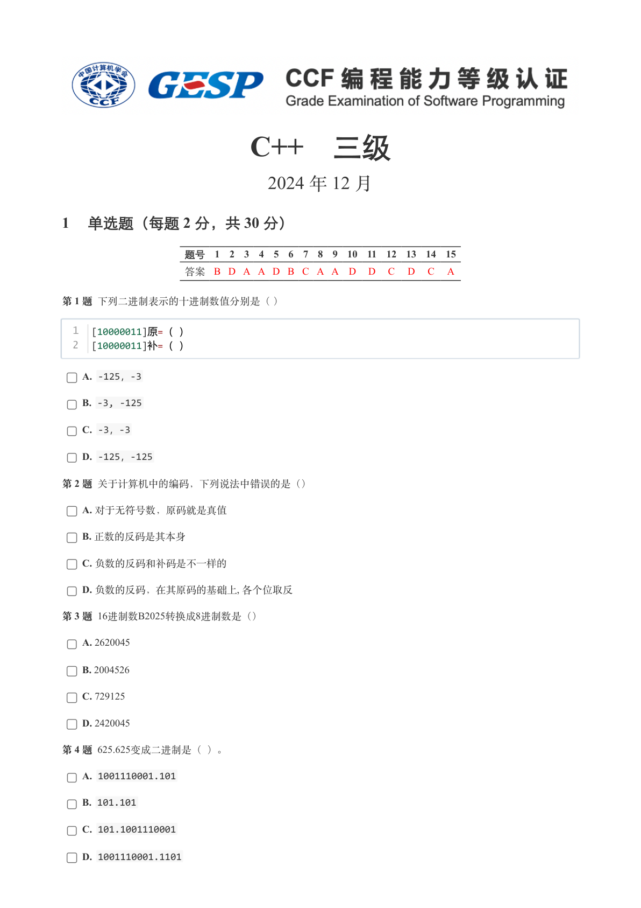

### 提取文本

```
C++　三级

                      2024 年 12 月

1 单选题（每题 2 分，共 30 分）


            题号  1  2  3  4  5  6  7  8  9  10  11  12  13  14  15
            答案 B D A A D B C A A D  D  C  D  C  A


第 1 题 下列二进制表示的十进制数值分别是（ ）

  1  [10000011]原=（ ）
  2  [10000011]补=（ ）

    A. -125，-3

    B. -3, -125

    C. -3，-3

    D. -125，-125

第 2 题 关于计算机中的编码，下列说法中错误的是（）

    A. 对于无符号数，原码就是真值

    B. 正数的反码是其本身

    C. 负数的反码和补码是不一样的

    D. 负数的反码，在其原码的基础上, 各个位取反

第 3 题 16进制数B2025转换成8进制数是（）

    A. 2620045

    B. 2004526

    C. 729125

    D. 2420045

第 4 题 625.625变成二进制是（ ）。

    A. 1001110001.101

    B. 101.101

    C. 101.1001110001

    D. 1001110001.1101
```

## 第 2 页

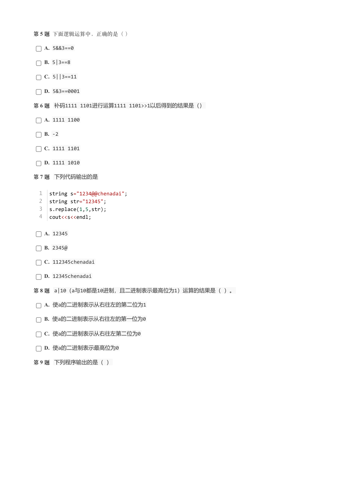

### 提取文本

```
第 5 题 下面逻辑运算中，正确的是（ ）

    A. 5&&3==0

    B. 5|3==8

    C. 5||3==11

    D. 5&3==0001

第 6 题 补码1111 1101进行运算1111 1101>>1以后得到的结果是（）

    A. 1111 1100

    B. -2

    C. 1111 1101

    D. 1111 1010

第 7 题 下列代码输出的是


  1  string s="1234@@chenadai";
  2  string str="12345";
  3  s.replace(1,5,str);
  4  cout<<s<<endl;


    A. 12345

    B. 2345@

    C. 112345chenadai

    D. 12345chenadai

第 8 题 a|10（a与10都是10进制，且二进制表示最高位为1）运算的结果是（ ）。

    A. 使a的二进制表示从右往左的第二位为1

    B. 使a的二进制表示从右往左的第一位为0

    C. 使a的二进制表示从右往左第二位为0

    D. 使a的二进制表示最高位为0

第 9 题 下列程序输出的是（ ）
```

## 第 3 页

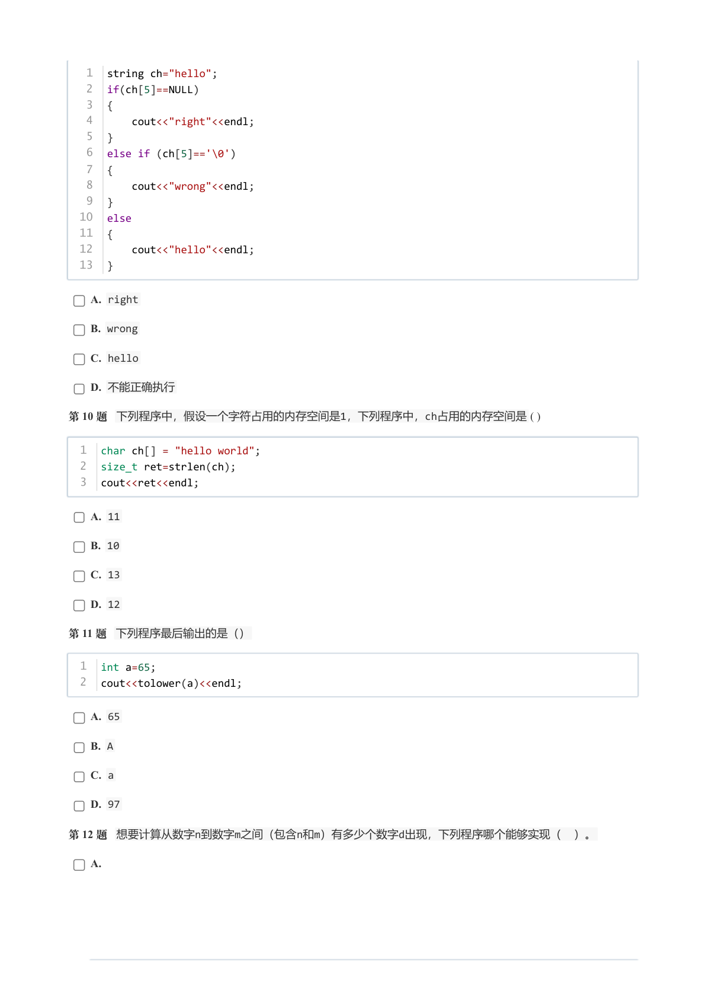

### 提取文本

```
1  string ch="hello";
   2  if(ch[5]==NULL)
   3  {
   4      cout<<"right"<<endl;
   5  }
   6  else if (ch[5]=='\0')
   7  {
   8      cout<<"wrong"<<endl;
   9  }
  10  else
  11  {
  12      cout<<"hello"<<endl;
  13  }


    A. right

    B. wrong

    C. hello

    D. 不能正确执行

第 10 题 下列程序中，假设一个字符占用的内存空间是1，下列程序中，ch占用的内存空间是( )


  1  char ch[] = "hello world";
  2  size_t ret=strlen(ch);
  3  cout<<ret<<endl;


    A. 11

    B. 10

    C. 13

    D. 12

第 11 题 下列程序最后输出的是（）


  1  int a=65;
  2  cout<<tolower(a)<<endl;


    A. 65

    B. A

    C. a

    D. 97

第 12 题 想要计算从数字n到数字m之间（包含n和m）有多少个数字d出现，下列程序哪个能够实现（ ）。

    A.
```

## 第 4 页

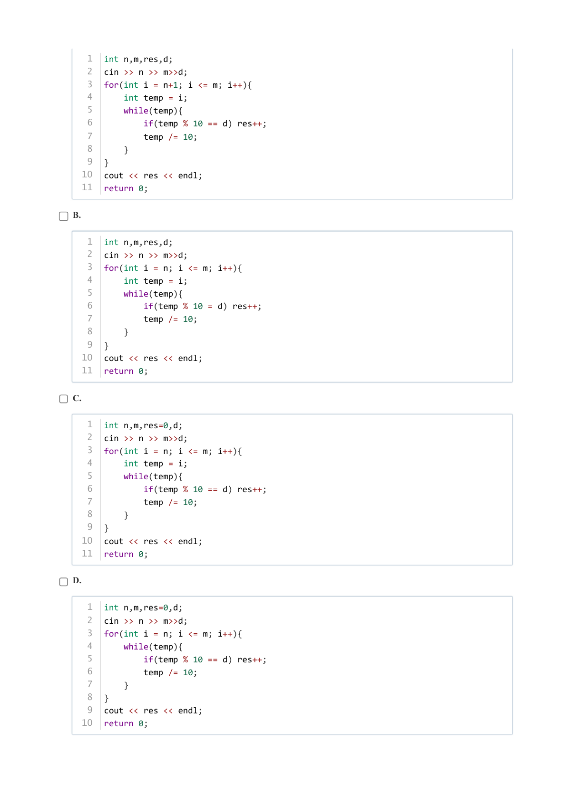

### 提取文本

```
1  int n,m,res,d;
   2  cin >> n >> m>>d;
   3  for(int i = n+1; i <= m; i++){
   4      int temp = i;
   5      while(temp){
   6          if(temp % 10 == d) res++;
   7          temp /= 10;
   8      }
   9  }
  10  cout << res << endl;
  11  return 0;


B.


   1  int n,m,res,d;
   2  cin >> n >> m>>d;
   3  for(int i = n; i <= m; i++){
   4      int temp = i;
   5      while(temp){
   6          if(temp % 10 = d) res++;
   7          temp /= 10;
   8      }
   9  }
  10  cout << res << endl;
  11  return 0;


C.


   1  int n,m,res=0,d;
   2  cin >> n >> m>>d;
   3  for(int i = n; i <= m; i++){
   4      int temp = i;
   5      while(temp){
   6          if(temp % 10 == d) res++;
   7          temp /= 10;
   8      }
   9  }
  10  cout << res << endl;
  11  return 0;


D.


   1  int n,m,res=0,d;
   2  cin >> n >> m>>d;
   3  for(int i = n; i <= m; i++){
   4      while(temp){
   5          if(temp % 10 == d) res++;
   6          temp /= 10;
   7      }
   8  }
   9  cout << res << endl;
  10  return 0;
```

## 第 5 页

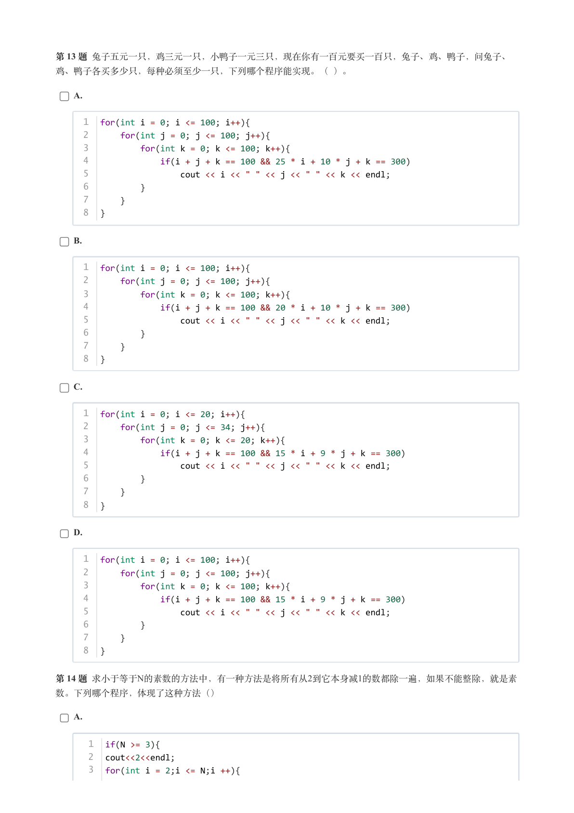

### 提取文本

```
第 13 题 兔子五元一只，鸡三元一只，小鸭子一元三只，现在你有一百元要买一百只，兔子、鸡、鸭子，问兔子、

鸡、鸭子各买多少只，每种必须至少一只，下列哪个程序能实现。（ ）。

    A.


     1  for(int i = 0; i <= 100; i++){
     2      for(int j = 0; j <= 100; j++){
     3          for(int k = 0; k <= 100; k++){
     4              if(i + j + k == 100 && 25 * i + 10 * j + k == 300)
     5                  cout << i << " " << j << " " << k << endl;
     6          }
     7      }
     8  }


    B.


     1  for(int i = 0; i <= 100; i++){
     2      for(int j = 0; j <= 100; j++){
     3          for(int k = 0; k <= 100; k++){
     4              if(i + j + k == 100 && 20 * i + 10 * j + k == 300)
     5                  cout << i << " " << j << " " << k << endl;
     6          }
     7      }
     8  }


    C.


     1  for(int i = 0; i <= 20; i++){
     2      for(int j = 0; j <= 34; j++){
     3          for(int k = 0; k <= 20; k++){
     4              if(i + j + k == 100 && 15 * i + 9 * j + k == 300)
     5                  cout << i << " " << j << " " << k << endl;
     6          }
     7      }
     8  }


    D.


     1  for(int i = 0; i <= 100; i++){
     2      for(int j = 0; j <= 100; j++){
     3          for(int k = 0; k <= 100; k++){
     4              if(i + j + k == 100 && 15 * i + 9 * j + k == 300)
     5                  cout << i << " " << j << " " << k << endl;
     6          }
     7      }
     8  }


第 14 题 求小于等于N的素数的方法中，有一种方法是将所有从2到它本身减1的数都除一遍，如果不能整除，就是素

数。下列哪个程序，体现了这种方法（）

    A.


      1  if(N >= 3){
      2  cout<<2<<endl;
      3  for(int i = 2;i <= N;i ++){
```

## 第 6 页

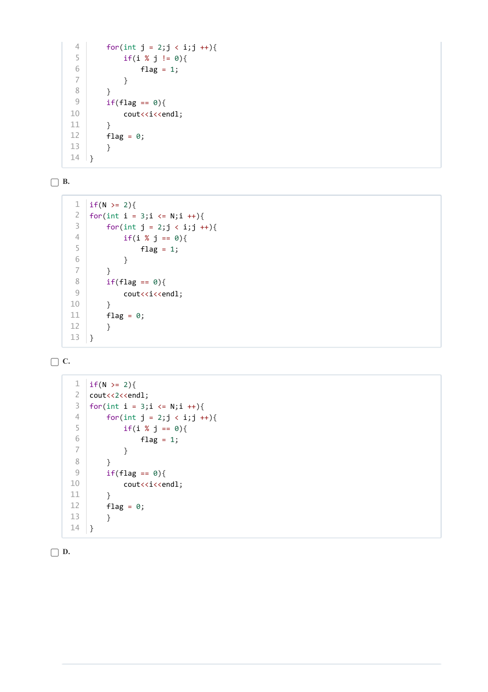

### 提取文本

```
4      for(int j = 2;j < i;j ++){
   5          if(i % j != 0){
   6              flag = 1;
   7          }
   8      }
   9      if(flag == 0){
  10          cout<<i<<endl;
  11      }
  12      flag = 0;
  13      }
  14  }


B.


   1  if(N >= 2){
   2  for(int i = 3;i <= N;i ++){
   3      for(int j = 2;j < i;j ++){
   4          if(i % j == 0){
   5              flag = 1;
   6          }
   7      }
   8      if(flag == 0){
   9          cout<<i<<endl;
  10      }
  11      flag = 0;
  12      }
  13  }


C.


   1  if(N >= 2){
   2  cout<<2<<endl;
   3  for(int i = 3;i <= N;i ++){
   4      for(int j = 2;j < i;j ++){
   5          if(i % j == 0){
   6              flag = 1;
   7          }
   8      }
   9      if(flag == 0){
  10          cout<<i<<endl;
  11      }
  12      flag = 0;
  13      }
  14  }


D.
```

## 第 7 页

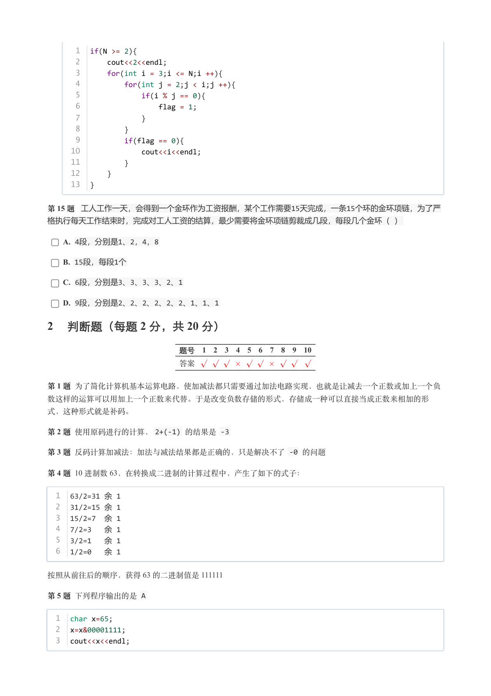

### 提取文本

```
1  if(N >= 2){
      2      cout<<2<<endl;
      3      for(int i = 3;i <= N;i ++){
      4          for(int j = 2;j < i;j ++){
      5              if(i % j == 0){
      6                  flag = 1;
      7              }
      8          }
      9          if(flag == 0){
     10              cout<<i<<endl;
     11          }
     12      }
     13  }

第 15 题 工人工作一天，会得到一个金环作为工资报酬，某个工作需要15天完成，一条15个环的金环项链，为了严
格执行每天工作结束时，完成对工人工资的结算，最少需要将金环项链剪裁成几段，每段几个金环（ ）

    A. 4段，分别是1、2，4，8

    B. 15段，每段1个

    C. 6段，分别是3、3、3、3、2、1

    D. 9段，分别是2、2、2、2、2、2、1、1、1

2 判断题（每题 2 分，共 20 分）


                 题号  1  2  3  4  5  6  7  8  9  10

                 答案


第 1 题 为了简化计算机基本运算电路，使加减法都只需要通过加法电路实现，也就是让减去一个正数或加上一个负

数这样的运算可以用加上一个正数来代替。于是改变负数存储的形式，存储成一种可以直接当成正数来相加的形

式，这种形式就是补码。

第 2 题 使用原码进行的计算，2+(-1) 的结果是 -3

第 3 题 反码计算加减法：加法与减法结果都是正确的，只是解决不了 -0 的问题

第 4 题 10 进制数 63，在转换成二进制的计算过程中，产生了如下的式子：

  1  63/2=31 余 1
  2  31/2=15 余 1
  3  15/2=7 余 1
  4  7/2=3  余 1
  5  3/2=1  余 1
  6  1/2=0  余 1


按照从前往后的顺序，获得 63 的二进制值是 111111

第 5 题 下列程序输出的是 A


  1  char x=65;
  2  x=x&00001111;
  3  cout<<x<<endl;
```

## 第 8 页

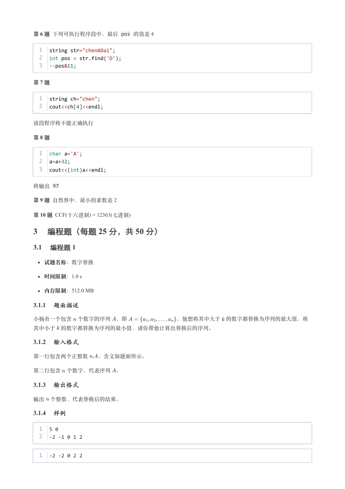

### 提取文本

```
第 6 题 下列可执行程序段中，最后 pos 的值是 4


  1  string str="chenADai";
  2  int pos = str.find('D');
  3  --pos&11;


第 7 题


  1  string ch="chen";
  2  cout<<ch[4]<<endl;


该段程序将不能正确执行

第 8 题


  1  char a='A';
  2  a=a+32;
  3  cout<<(int)a<<endl;

将输出 97

第 9 题 自然界中，最小的素数是 2

第 10 题 CCF(十六进制) = 12363(七进制)

3 编程题（每题 25 分，共 50 分）

3.1 编程题 1


  试题名称：数字替换

   时间限制：1.0 s

   内存限制：512.0 MB

3.1.1 题面描述

小杨有一个包含 个数字的序列 ，即         ，他想将其中大于 的数字都替换为序列的最大值，将

其中小于 的数字都替换为序列的最小值，请你帮他计算出替换后的序列。

3.1.2 输入格式

第一行包含两个正整数  ，含义如题面所示。


第二行包含 个数字，代表序列 。

3.1.3 输出格式

输出 个整数，代表替换后的结果。

3.1.4 样例

  1  5 0
  2  -2 -1 0 1 2


  1  -2 -2 0 2 2
```

## 第 9 页

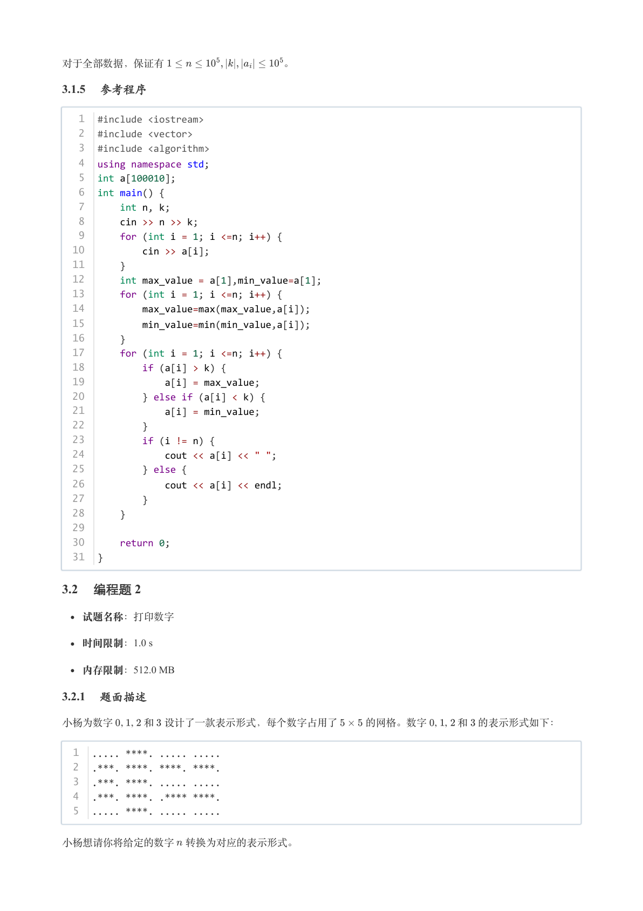

### 提取文本

```
对于全部数据，保证有            。

3.1.5 参考程序

   1  #include <iostream>
   2  #include <vector>
   3  #include <algorithm>
   4  using namespace std;
   5  int a[100010];
   6  int main() {
   7      int n, k;
   8      cin >> n >> k;
   9      for (int i = 1; i <=n; i++) {
  10          cin >> a[i];
  11      }
  12      int max_value = a[1],min_value=a[1];
  13      for (int i = 1; i <=n; i++) {
  14          max_value=max(max_value,a[i]);
  15          min_value=min(min_value,a[i]);
  16      }
  17      for (int i = 1; i <=n; i++) {
  18          if (a[i] > k) {
  19              a[i] = max_value;
  20          } else if (a[i] < k) {
  21              a[i] = min_value;
  22          }
  23          if (i != n) {
  24              cout << a[i] << " ";
  25          } else {
  26              cout << a[i] << endl;
  27          }
  28      }
  29
  30      return 0;
  31  }

3.2 编程题 2


  试题名称：打印数字

   时间限制：1.0 s

   内存限制：512.0 MB

3.2.1 题面描述

小杨为数字   ,   , 和 设计了一款表示形式，每个数字占用了   的网格。数字   ,   , 和 的表示形式如下：


  1  ..... ****. ..... .....
  2  .***. ****. ****. ****.
  3  .***. ****. ..... .....
  4  .***. ****. .**** ****.
  5  ..... ****. ..... .....


小杨想请你将给定的数字 转换为对应的表示形式。
```

## 第 10 页

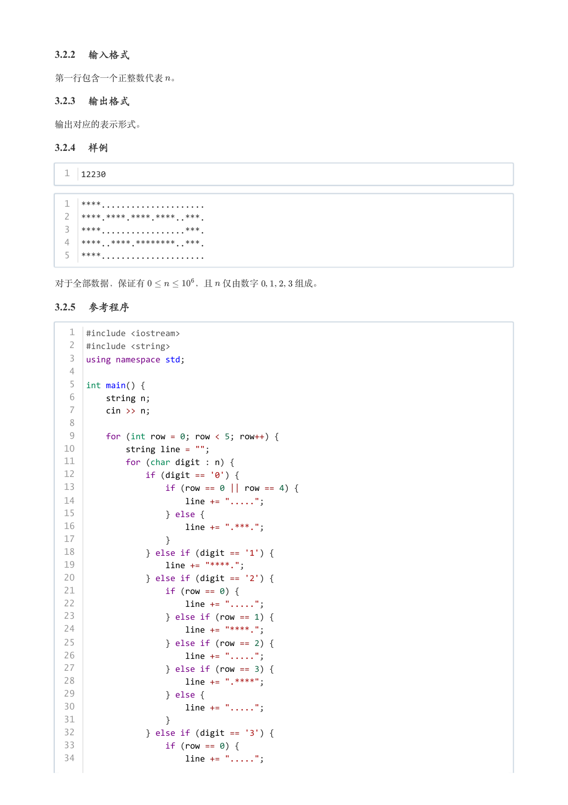

### 提取文本

```
3.2.2 输入格式

第一行包含一个正整数代表 。

3.2.3 输出格式

输出对应的表示形式。

3.2.4 样例

  1  12230


  1  ****.....................
  2  ****.****.****.****..***.
  3  ****.................***.
  4  ****..****.********..***.
  5  ****.....................


对于全部数据，保证有      ，且 仅由数字   ,   ,   , 组成。

3.2.5 参考程序

   1  #include <iostream>
   2  #include <string>
   3  using namespace std;
   4
   5  int main() {
   6      string n;
   7      cin >> n;
   8
   9      for (int row = 0; row < 5; row++) {
  10          string line = "";
  11          for (char digit : n) {
  12              if (digit == '0') {
  13                  if (row == 0 || row == 4) {
  14                      line += ".....";
  15                  } else {
  16                      line += ".***.";
  17                  }
  18              } else if (digit == '1') {
  19                  line += "****.";
  20              } else if (digit == '2') {
  21                  if (row == 0) {
  22                      line += ".....";
  23                  } else if (row == 1) {
  24                      line += "****.";
  25                  } else if (row == 2) {
  26                      line += ".....";
  27                  } else if (row == 3) {
  28                      line += ".****";
  29                  } else {
  30                      line += ".....";
  31                  }
  32              } else if (digit == '3') {
  33                  if (row == 0) {
  34                      line += ".....";
```

## 第 11 页

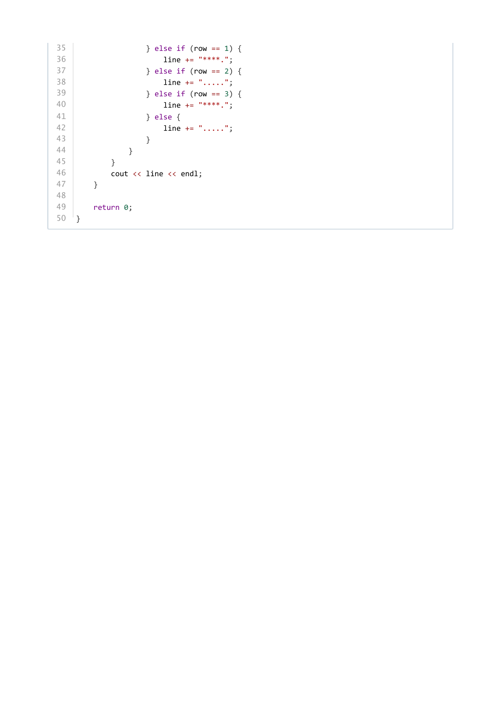

### 提取文本

```
35                  } else if (row == 1) {
36                      line += "****.";
37                  } else if (row == 2) {
38                      line += ".....";
39                  } else if (row == 3) {
40                      line += "****.";
41                  } else {
42                      line += ".....";
43                  }
44              }
45          }
46          cout << line << endl;
47      }
48
49      return 0;
50  }
```
