# 2024年12月-C++4级

- 原始 PDF：[`pdfs/2024年12月-C++4级.pdf`](../pdfs/2024年12月-C++4级.pdf)
- 页数：11
- 转换脚本：[`scripts/convert_pdfs_to_markdown.py`](../scripts/convert_pdfs_to_markdown.py)

> 为尽量避免信息丢失，每页均附带页面图片；文本提取结果保留原有顺序与换行特征，个别公式、图形、特殊排版请以页面图片为准。

## 第 1 页

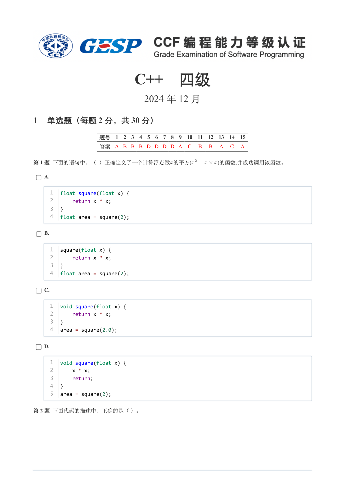

### 提取文本

```
C++　四级

                      2024 年 12 月

1 单选题（每题 2 分，共 30 分）


            题号  1  2  3  4  5  6  7  8  9  10  11  12  13  14  15
            答案 A B B B D D D D A  C  B  B  A  C  A


第 1 题 下面的语句中，（ ）正确定义了一个计算浮点数的平方(     )的函数,并成功调用该函数。

    A.


     1  float square(float x) {
     2      return x * x;
     3  }
     4  float area = square(2);


    B.


     1  square(float x) {
     2      return x * x;
     3  }
     4  float area = square(2);


    C.


     1  void square(float x) {
     2      return x * x;
     3  }
     4  area = square(2.0);


    D.


     1  void square(float x) {
     2      x * x;
     3      return;
     4  }
     5  area = square(2);


第 2 题 下面代码的描述中，正确的是（ ）。
```

## 第 2 页

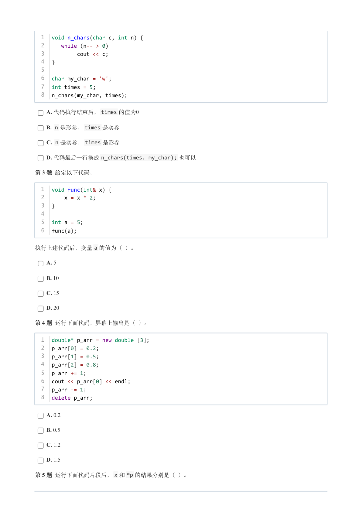

### 提取文本

```
1  void n_chars(char c, int n) {
  2     while (n-- > 0)
  3          cout << c;
  4  }
  5
  6  char my_char = 'w';
  7  int times = 5;
  8  n_chars(my_char, times);

    A. 代码执行结束后，times 的值为0

    B. n 是形参，times 是实参

    C. n 是实参，times 是形参

    D. 代码最后一行换成n_chars(times, my_char); 也可以

第 3 题 给定以下代码，


  1  void func(int& x) {
  2      x = x * 2;
  3  }
  4
  5  int a = 5;
  6  func(a);

执行上述代码后，变量a 的值为（ ）。

    A. 5

    B. 10

    C. 15

    D. 20

第 4 题 运行下面代码，屏幕上输出是（ ）。


  1  double* p_arr = new double [3];
  2  p_arr[0] = 0.2;
  3  p_arr[1] = 0.5;
  4  p_arr[2] = 0.8;
  5  p_arr += 1;
  6  cout << p_arr[0] << endl;
  7  p_arr -= 1;
  8  delete p_arr;


    A. 0.2

    B. 0.5

    C. 1.2

    D. 1.5

第 5 题 运行下面代码片段后，x 和*p 的结果分别是（ ）。
```

## 第 3 页

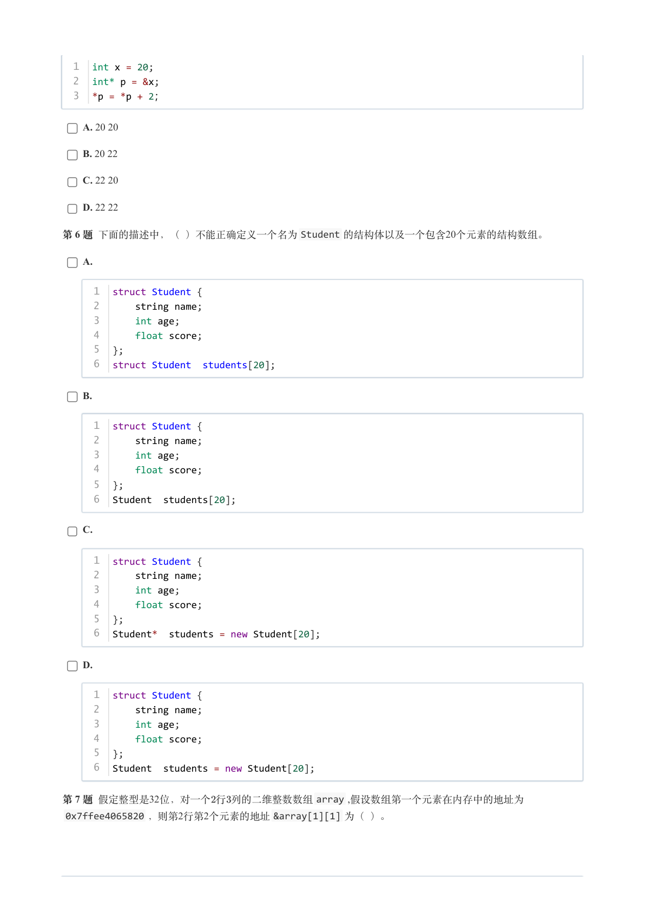

### 提取文本

```
1  int x = 20;
  2  int* p = &x;
  3  *p = *p + 2；


    A. 20 20

    B. 20 22

    C. 22 20

    D. 22 22

第 6 题 下面的描述中，（ ）不能正确定义一个名为Student 的结构体以及一个包含20个元素的结构数组。

    A.


     1  struct Student {
     2      string name;
     3      int age;
     4      float score;
     5  };
     6  struct Student  students[20];


    B.


     1  struct Student {
     2      string name;
     3      int age;
     4      float score;
     5  };
     6  Student  students[20];


    C.


     1  struct Student {
     2      string name;
     3      int age;
     4      float score;
     5  };
     6  Student*  students = new Student[20];


    D.


     1  struct Student {
     2      string name;
     3      int age;
     4      float score;
     5  };
     6  Student  students = new Student[20];


第 7 题 假定整型是32位，对一个行列的二维整数数组array ,假设数组第一个元素在内存中的地址为
 0x7ffee4065820 ，则第2行第2个元素的地址&array[1][1] 为（ ）。
```

## 第 4 页

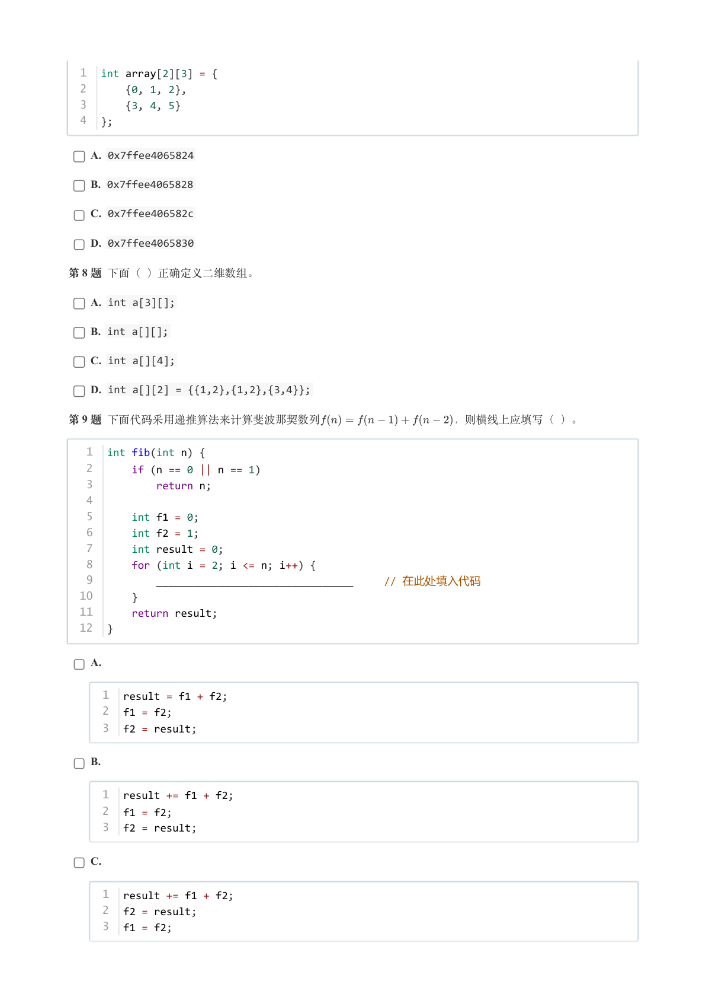

### 提取文本

```
1  int array[2][3] = {
  2      {0, 1, 2},
  3      {3, 4, 5}
  4  };


    A. 0x7ffee4065824

    B. 0x7ffee4065828

    C. 0x7ffee406582c

    D. 0x7ffee4065830

第 8 题 下面（ ）正确定义二维数组。

    A. int a[3][];

    B. int a[][];

    C. int a[][4];

    D. int a[][2] = {{1,2},{1,2},{3,4}};

第 9 题 下面代码采用递推算法来计算斐波那契数列            ，则横线上应填写（ ）。


   1  int fib(int n) {
   2      if (n == 0 || n == 1)
   3          return n;
   4
   5      int f1 = 0;
   6      int f2 = 1;
   7      int result = 0;
   8      for (int i = 2; i <= n; i++) {
   9          ________________________________     // 在此处填入代码
  10      }
  11      return result;
  12  }


    A.


     1  result = f1 + f2;
     2  f1 = f2;
     3  f2 = result;


    B.


     1  result += f1 + f2;
     2  f1 = f2;
     3  f2 = result;


    C.


     1  result += f1 + f2;
     2  f2 = result;
     3  f1 = f2;
```

## 第 5 页

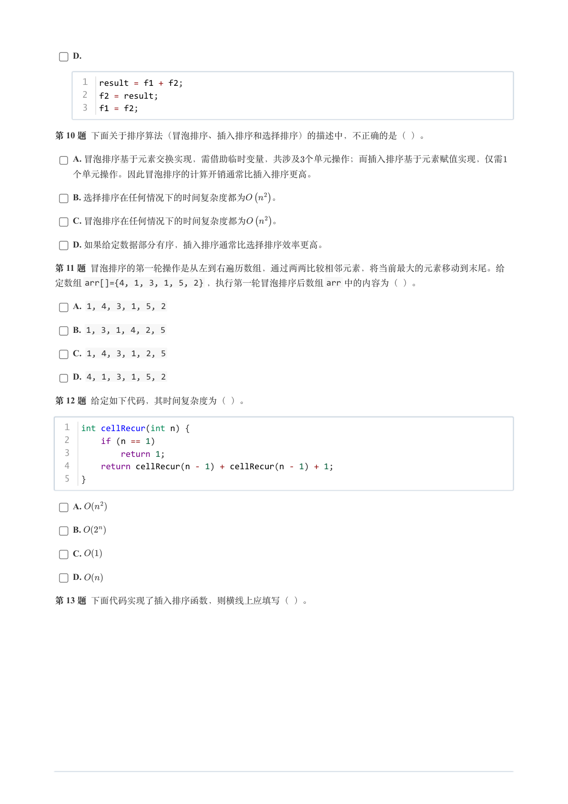

### 提取文本

```
D.


     1  result = f1 + f2;
     2  f2 = result;
     3  f1 = f2;


第 10 题 下面关于排序算法（冒泡排序、插入排序和选择排序）的描述中，不正确的是（ ）。

    A. 冒泡排序基于元素交换实现，需借助临时变量，共涉及个单元操作；而插入排序基于元素赋值实现，仅需

  个单元操作。因此冒泡排序的计算开销通常比插入排序更高。

    B. 选择排序在任何情况下的时间复杂度都为   。

    C. 冒泡排序在任何情况下的时间复杂度都为   。

    D. 如果给定数据部分有序，插入排序通常比选择排序效率更高。

第 11 题 冒泡排序的第一轮操作是从左到右遍历数组，通过两两比较相邻元素，将当前最大的元素移动到末尾。给
定数组arr[]={4, 1, 3, 1, 5, 2} ，执行第一轮冒泡排序后数组arr 中的内容为（ ）。

    A. 1, 4, 3, 1, 5, 2

    B. 1, 3, 1, 4, 2, 5

    C. 1, 4, 3, 1, 2, 5

    D. 4, 1, 3, 1, 5, 2

第 12 题 给定如下代码，其时间复杂度为（ ）。


  1  int cellRecur(int n) {
  2      if (n == 1)
  3          return 1;
  4      return cellRecur(n - 1) + cellRecur(n - 1) + 1;
  5  }


    A.

    B.

    C.

    D.

第 13 题 下面代码实现了插入排序函数，则横线上应填写（ ）。
```

## 第 6 页

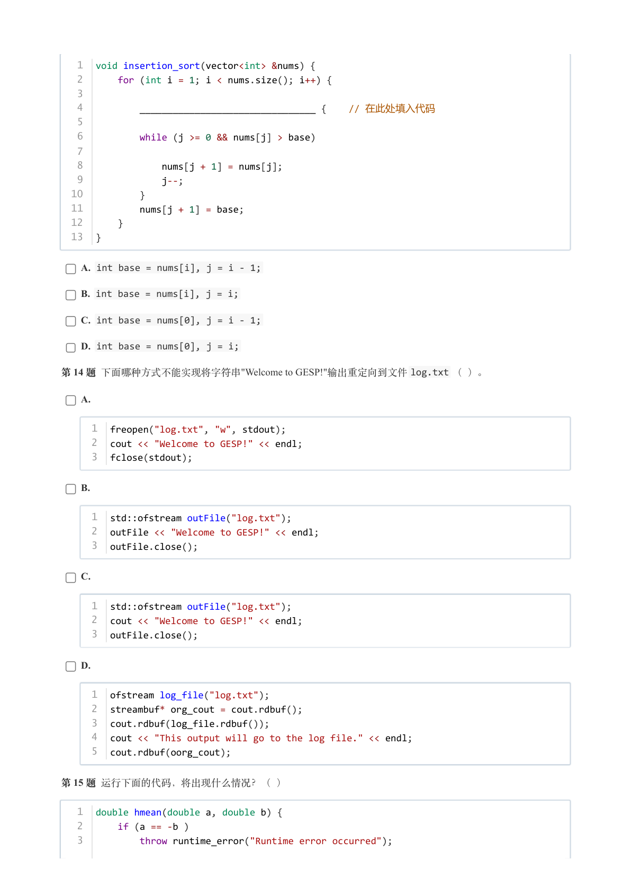

### 提取文本

```
1  void insertion_sort(vector<int> &nums) {
   2      for (int i = 1; i < nums.size(); i++) {
   3
   4          ________________________________ {    // 在此处填入代码
   5
   6          while (j >= 0 && nums[j] > base)
   7
   8              nums[j + 1] = nums[j];
   9              j--;
  10          }
  11          nums[j + 1] = base;
  12      }
  13  }


    A. int base = nums[i], j = i - 1;

    B. int base = nums[i], j = i;

    C. int base = nums[0], j = i - 1;

    D. int base = nums[0], j = i;

第 14 题 下面哪种方式不能实现将字符串"Welcome to GESP!"输出重定向到文件log.txt （ ）。

    A.


     1  freopen("log.txt", "w", stdout);
     2  cout << "Welcome to GESP!" << endl;
     3  fclose(stdout);


    B.


     1  std::ofstream outFile("log.txt");
     2  outFile << "Welcome to GESP!" << endl;
     3  outFile.close();


    C.


     1  std::ofstream outFile("log.txt");
     2  cout << "Welcome to GESP!" << endl;
     3  outFile.close();


    D.


     1  ofstream log_file("log.txt");
     2  streambuf* org_cout = cout.rdbuf();
     3  cout.rdbuf(log_file.rdbuf());
     4  cout << "This output will go to the log file." << endl;
     5  cout.rdbuf(oorg_cout);


第 15 题 运行下面的代码，将出现什么情况？（ ）


   1  double hmean(double a, double b) {
   2      if (a == -b )
   3          throw runtime_error("Runtime error occurred");
```

## 第 7 页

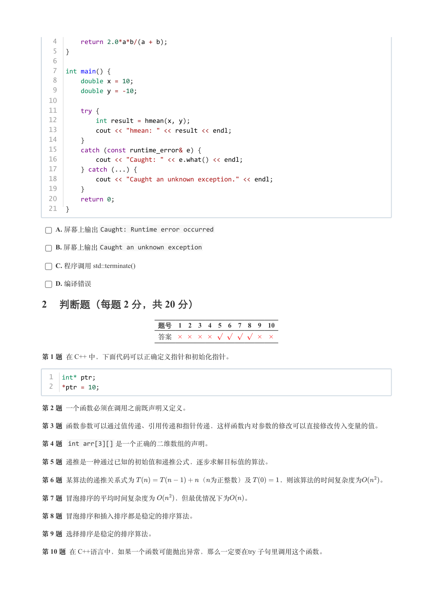

### 提取文本

```
4      return 2.0*a*b/(a + b);
   5  }
   6
   7  int main() {
   8      double x = 10;
   9      double y = -10;
  10
  11      try {
  12          int result = hmean(x, y);
  13          cout << "hmean: " << result << endl;
  14      }
  15      catch (const runtime_error& e) {
  16          cout << "Caught: " << e.what() << endl;
  17      } catch (...) {
  18          cout << "Caught an unknown exception." << endl;
  19      }
  20      return 0;
  21  }

    A. 屏幕上输出Caught: Runtime error occurred

    B. 屏幕上输出Caught an unknown exception

    C. 程序调用 std::terminate()

    D. 编译错误

2 判断题（每题 2 分，共 20 分）


                 题号  1  2  3  4  5  6  7  8  9  10

                 答案


第 1 题 在 C++ 中，下面代码可以正确定义指针和初始化指针。


  1  int* ptr;
  2  *ptr = 10;


第 2 题 一个函数必须在调用之前既声明又定义。

第 3 题 函数参数可以通过值传递、引用传递和指针传递，这样函数内对参数的修改可以直接修改传入变量的值。

第 4 题 int arr[3][] 是一个正确的二维数组的声明。

第 5 题 递推是一种通过已知的初始值和递推公式，逐步求解目标值的算法。

第 6 题 某算法的递推关系式为         （为正整数）及    ，则该算法的时间复杂度为   。

第 7 题 冒泡排序的平均时间复杂度为   ，但最优情况下为  。

第 8 题 冒泡排序和插入排序都是稳定的排序算法。

第 9 题 选择排序是稳定的排序算法。

第 10 题 在 C++语言中，如果一个函数可能抛出异常，那么一定要在try 子句里调用这个函数。
```

## 第 8 页

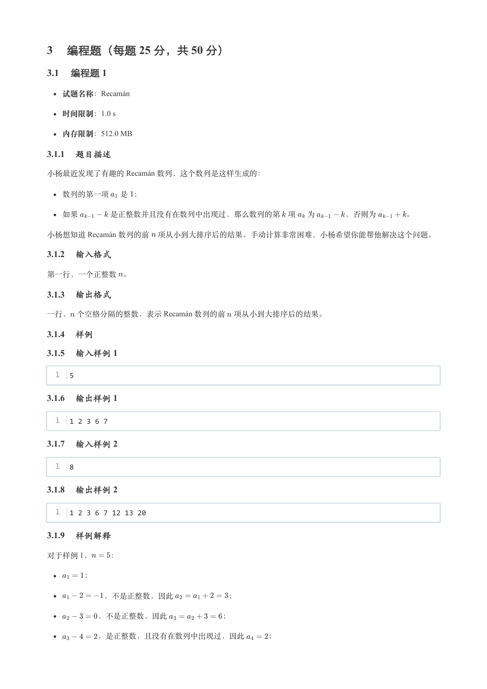

### 提取文本

```
3 编程题（每题 25 分，共 50 分）

3.1 编程题 1

   试题名称：Recamán

   时间限制：1.0 s

   内存限制：512.0 MB

3.1.1 题目描述

小杨最近发现了有趣的 Recamán 数列，这个数列是这样生成的：


  数列的第一项 是 ；


  如果    是正整数并且没有在数列中出现过，那么数列的第 项 为    ，否则为    。

小杨想知道 Recamán 数列的前 项从小到大排序后的结果。手动计算非常困难，小杨希望你能帮他解决这个问题。

3.1.2 输入格式

第一行，一个正整数 。

3.1.3 输出格式

一行， 个空格分隔的整数，表示 Recamán 数列的前 项从小到大排序后的结果。

3.1.4 样例

3.1.5 输入样例 1

  1  5

3.1.6 输出样例 1

  1  1 2 3 6 7

3.1.7 输入样例 2

  1  8

3.1.8 输出样例 2

  1  1 2 3 6 7 12 13 20

3.1.9 样例解释

对于样例 1，  ：


     ；


       ，不是正整数，因此       ；


       ，不是正整数，因此       ；


       ，是正整数，且没有在数列中出现过，因此   ；
```

## 第 9 页

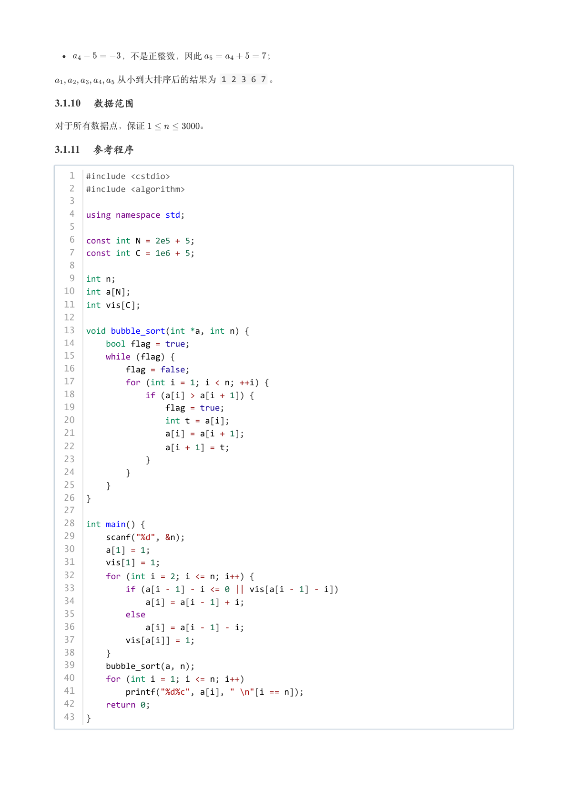

### 提取文本

```
，不是正整数，因此       ；

       从小到大排序后的结果为 1 2 3 6 7 。

3.1.10 数据范围

对于所有数据点，保证      。

3.1.11 参考程序

   1  #include <cstdio>
   2  #include <algorithm>
   3
   4  using namespace std;
   5
   6  const int N = 2e5 + 5;
   7  const int C = 1e6 + 5;
   8
   9  int n;
  10  int a[N];
  11  int vis[C];
  12
  13  void bubble_sort(int *a, int n) {
  14      bool flag = true;
  15      while (flag) {
  16          flag = false;
  17          for (int i = 1; i < n; ++i) {
  18              if (a[i] > a[i + 1]) {
  19                  flag = true;
  20                  int t = a[i];
  21                  a[i] = a[i + 1];
  22                  a[i + 1] = t;
  23              }
  24          }
  25      }
  26  }
  27
  28  int main() {
  29      scanf("%d", &n);
  30      a[1] = 1;
  31      vis[1] = 1;
  32      for (int i = 2; i <= n; i++) {
  33          if (a[i - 1] - i <= 0 || vis[a[i - 1] - i])
  34              a[i] = a[i - 1] + i;
  35          else
  36              a[i] = a[i - 1] - i;
  37          vis[a[i]] = 1;
  38      }
  39      bubble_sort(a, n);
  40      for (int i = 1; i <= n; i++)
  41          printf("%d%c", a[i], " \n"[i == n]);
  42      return 0;
  43  }
```

## 第 10 页

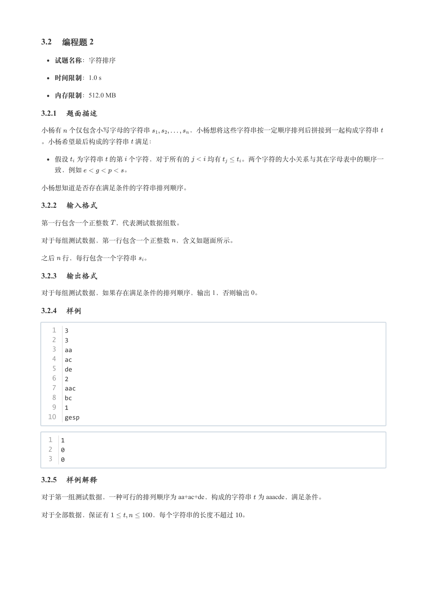

### 提取文本

```
3.2 编程题 2


  试题名称：字符排序

   时间限制：1.0 s

   内存限制：512.0 MB

3.2.1 题面描述

小杨有 个仅包含小写字母的字符串      ，小杨想将这些字符串按一定顺序排列后拼接到一起构成字符串

。小杨希望最后构成的字符串 满足：


  假设 为字符串 的第 个字符，对于所有的   均有   。两个字符的大小关系与其在字母表中的顺序一

  致，例如      。


小杨想知道是否存在满足条件的字符串排列顺序。

3.2.2 输入格式

第一行包含一个正整数 ，代表测试数据组数。


对于每组测试数据，第一行包含一个正整数 ，含义如题面所示。


之后 行，每行包含一个字符串 。

3.2.3 输出格式

对于每组测试数据，如果存在满足条件的排列顺序，输出 1，否则输出 0。

3.2.4 样例

   1  3
   2  3
   3  aa
   4  ac
   5  de
   6  2
   7  aac
   8  bc
   9  1
  10  gesp


  1  1
  2  0
  3  0

3.2.5 样例解释

对于第一组测试数据，一种可行的排列顺序为 aa+ac+de，构成的字符串 为 aaacde，满足条件。


对于全部数据，保证有      ，每个字符串的长度不超过 。
```

## 第 11 页

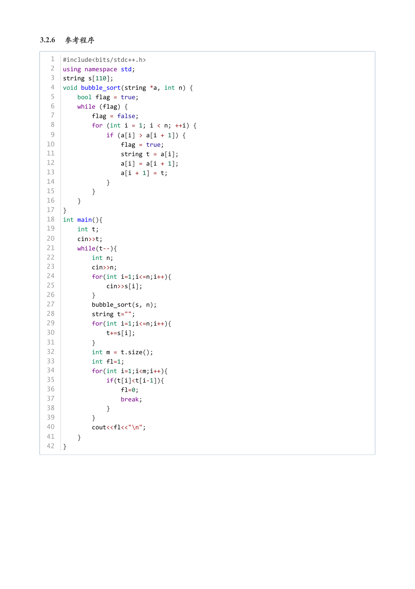

### 提取文本

```
3.2.6 参考程序

   1  #include<bits/stdc++.h>
   2  using namespace std;
   3  string s[110];
   4  void bubble_sort(string *a, int n) {
   5      bool flag = true;
   6      while (flag) {
   7          flag = false;
   8          for (int i = 1; i < n; ++i) {
   9              if (a[i] > a[i + 1]) {
  10                  flag = true;
  11                  string t = a[i];
  12                  a[i] = a[i + 1];
  13                  a[i + 1] = t;
  14              }
  15          }
  16      }
  17  }
  18  int main(){
  19      int t;
  20      cin>>t;
  21      while(t--){
  22          int n;
  23          cin>>n;
  24          for(int i=1;i<=n;i++){
  25              cin>>s[i];
  26          }
  27          bubble_sort(s, n);
  28          string t="";
  29          for(int i=1;i<=n;i++){
  30              t+=s[i];
  31          }
  32          int m = t.size();
  33          int fl=1;
  34          for(int i=1;i<m;i++){
  35              if(t[i]<t[i-1]){
  36                  fl=0;
  37                  break;
  38              }
  39          }
  40          cout<<fl<<"\n";
  41      }
  42  }
```
