# 2024年12月-C++5级

- 原始 PDF：[`pdfs/2024年12月-C++5级.pdf`](../pdfs/2024年12月-C++5级.pdf)
- 页数：12
- 转换脚本：[`scripts/convert_pdfs_to_markdown.py`](../scripts/convert_pdfs_to_markdown.py)

> 为尽量避免信息丢失，每页均附带页面图片；文本提取结果保留原有顺序与换行特征，个别公式、图形、特殊排版请以页面图片为准。

## 第 1 页

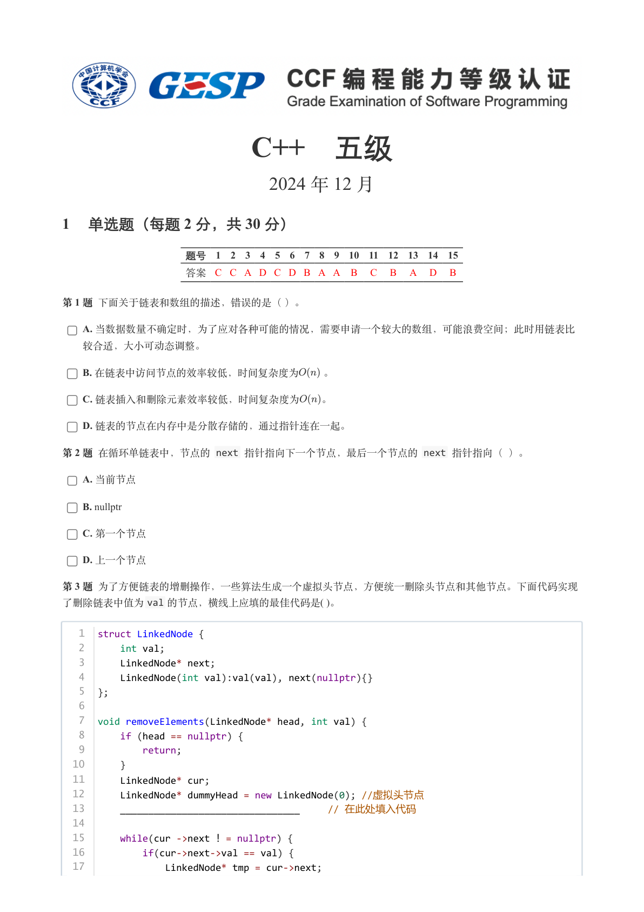

### 提取文本

```
C++　五级

                      2024 年 12 月

1 单选题（每题 2 分，共 30 分）


            题号  1  2  3  4  5  6  7  8  9  10  11  12  13  14  15
            答案 C C A D C D B A A  B  C  B  A  D  B


第 1 题 下面关于链表和数组的描述，错误的是（ ）。

    A. 当数据数量不确定时，为了应对各种可能的情况，需要申请一个较大的数组，可能浪费空间；此时用链表比

  较合适，大小可动态调整。

    B. 在链表中访问节点的效率较低，时间复杂度为  。

    C. 链表插入和删除元素效率较低，时间复杂度为  。

    D. 链表的节点在内存中是分散存储的，通过指针连在一起。

第 2 题 在循环单链表中，节点的 next 指针指向下一个节点，最后一个节点的 next 指针指向（ ）。

    A. 当前节点

    B. nullptr

    C. 第一个节点

    D. 上一个节点

第 3 题 为了方便链表的增删操作，一些算法生成一个虚拟头节点，方便统一删除头节点和其他节点。下面代码实现
了删除链表中值为val 的节点，横线上应填的最佳代码是( )。


   1  struct LinkedNode {
   2      int val;
   3      LinkedNode* next;
   4      LinkedNode(int val):val(val), next(nullptr){}
   5  };
   6
   7  void removeElements(LinkedNode* head, int val) {
   8      if (head == nullptr) {
   9          return;
  10      }
  11      LinkedNode* cur;
  12      LinkedNode* dummyHead = new LinkedNode(0); //虚拟头节点
  13      ________________________________     // 在此处填入代码
  14
  15      while(cur ->next ！= nullptr) {
  16          if(cur->next->val == val) {
  17              LinkedNode* tmp = cur->next;
```

## 第 2 页

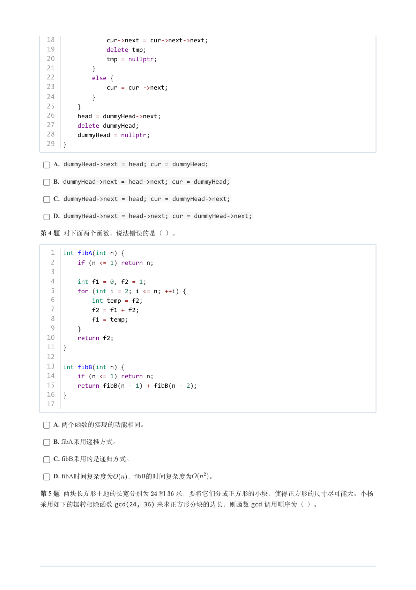

### 提取文本

```
18              cur->next = cur->next->next;
  19              delete tmp;
  20              tmp = nullptr;
  21          }
  22          else {
  23              cur = cur ->next;
  24          }
  25      }
  26      head = dummyHead->next;
  27      delete dummyHead;
  28      dummyHead = nullptr;
  29  }


    A. dummyHead->next = head; cur = dummyHead;

    B. dummyHead->next = head->next; cur = dummyHead;

    C. dummyHead->next = head; cur = dummyHead->next;

    D. dummyHead->next = head->next; cur = dummyHead->next;

第 4 题 对下面两个函数，说法错误的是（ ）。


   1  int fibA(int n) {
   2      if (n <= 1) return n;
   3
   4      int f1 = 0, f2 = 1;
   5      for (int i = 2; i <= n; ++i) {
   6          int temp = f2;
   7          f2 = f1 + f2;
   8          f1 = temp;
   9      }
  10      return f2;
  11  }
  12
  13  int fibB(int n) {
  14      if (n <= 1) return n;
  15      return fibB(n - 1) + fibB(n - 2);
  16  }
  17


    A. 两个函数的实现的功能相同。

    B. fibA采用递推方式。

    C. fibB采用的是递归方式。

    D. fibA时间复杂度为   ，fibB的时间复杂度为   。

第 5 题 两块长方形土地的长宽分别为  和  米，要将它们分成正方形的小块，使得正方形的尺寸尽可能大。小杨
采用如下的辗转相除函数gcd(24, 36) 来求正方形分块的边长，则函数gcd 调用顺序为（ ）。
```

## 第 3 页

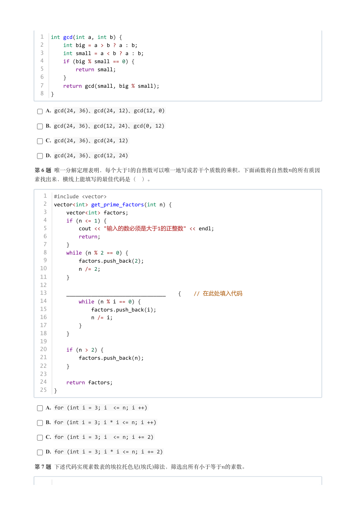

### 提取文本

```
1  int gcd(int a, int b) {
  2      int big = a > b ? a : b;
  3      int small = a < b ? a : b;
  4      if (big % small == 0) {
  5          return small;
  6      }
  7      return gcd(small, big % small);
  8  }

    A. gcd(24, 36)、gcd(24, 12)、gcd(12, 0)

    B. gcd(24, 36)、gcd(12, 24)、gcd(0, 12)

    C. gcd(24, 36)、gcd(24, 12)

    D. gcd(24, 36)、gcd(12, 24)

第 6 题 唯一分解定理表明，每个大于1的自然数可以唯一地写成若干个质数的乘积。下面函数将自然数的所有质因

素找出来，横线上能填写的最佳代码是（ ）。


   1  #include <vector>
   2  vector<int> get_prime_factors(int n) {
   3      vector<int> factors;
   4      if (n <= 1) {
   5          cout << "输入的数必须是大于1的正整数" << endl;
   6          return;
   7      }
   8      while (n % 2 == 0) {
   9          factors.push_back(2);
  10          n /= 2;
  11      }
  12
  13      ________________________________    {    // 在此处填入代码
  14          while (n % i == 0) {
  15              factors.push_back(i);
  16              n /= i;
  17          }
  18      }
  19
  20      if (n > 2) {
  21          factors.push_back(n);
  22      }
  23
  24      return factors;
  25  }


    A. for (int i = 3; i  <= n; i ++)

    B. for (int i = 3; i * i <= n; i ++)

    C. for (int i = 3; i  <= n; i += 2)

    D. for (int i = 3; i * i <= n; i += 2)

第 7 题 下述代码实现素数表的埃拉托色尼(埃氏)筛法，筛选出所有小于等于的素数。
```

## 第 4 页

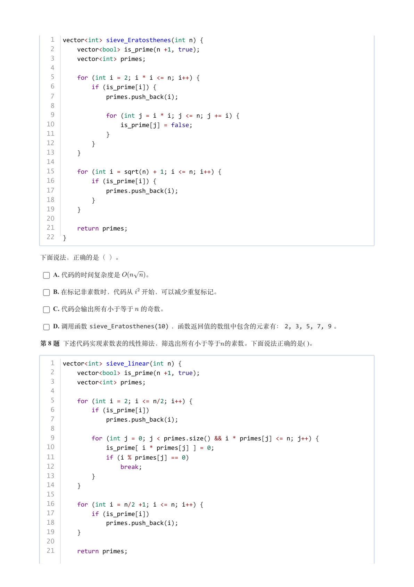

### 提取文本

```
1  vector<int> sieve_Eratosthenes(int n) {
   2      vector<bool> is_prime(n +1, true);
   3      vector<int> primes;
   4
   5      for (int i = 2; i * i <= n; i++) {
   6          if (is_prime[i]) {
   7              primes.push_back(i);
   8
   9              for (int j = i * i; j <= n; j += i) {
  10                  is_prime[j] = false;
  11              }
  12          }
  13      }
  14
  15      for (int i = sqrt(n) + 1; i <= n; i++) {
  16          if (is_prime[i]) {
  17              primes.push_back(i);
  18          }
  19      }
  20
  21      return primes;
  22  }


下面说法，正确的是（ ）。

    A. 代码的时间复杂度是    。

    B. 在标记非素数时，代码从 开始，可以减少重复标记。

    C. 代码会输出所有小于等于 的奇数。

    D. 调用函数sieve_Eratosthenes(10) ，函数返回值的数组中包含的元素有：2, 3, 5, 7, 9 。

第 8 题 下述代码实现素数表的线性筛法，筛选出所有小于等于的素数。下面说法正确的是( )。


   1  vector<int> sieve_linear(int n) {
   2      vector<bool> is_prime(n +1, true);
   3      vector<int> primes;
   4
   5      for (int i = 2; i <= n/2; i++) {
   6          if (is_prime[i])
   7              primes.push_back(i);
   8
   9          for (int j = 0; j < primes.size() && i * primes[j] <= n; j++) {
  10              is_prime[ i * primes[j] ] = 0;
  11              if (i % primes[j] == 0)
  12                  break;
  13          }
  14      }
  15
  16      for (int i = n/2 +1; i <= n; i++) {
  17          if (is_prime[i])
  18              primes.push_back(i);
  19      }
  20
  21      return primes;
```

## 第 5 页

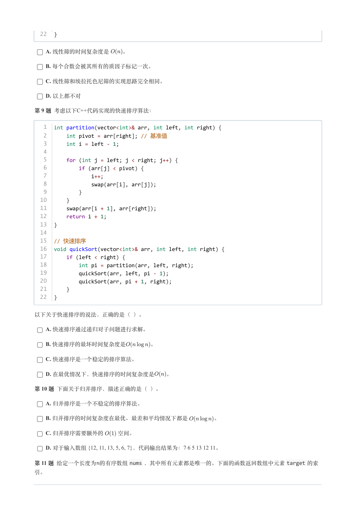

### 提取文本

```
22  }


    A. 线性筛的时间复杂度是  。

    B. 每个合数会被其所有的质因子标记一次。

    C. 线性筛和埃拉托色尼筛的实现思路完全相同。

    D. 以上都不对

第 9 题 考虑以下C++代码实现的快速排序算法：


   1  int partition(vector<int>& arr, int left, int right) {
   2      int pivot = arr[right]; // 基准值
   3      int i = left - 1;
   4
   5      for (int j = left; j < right; j++) {
   6          if (arr[j] < pivot) {
   7              i++;
   8              swap(arr[i], arr[j]);
   9          }
  10      }
  11      swap(arr[i + 1], arr[right]);
  12      return i + 1;
  13  }
  14
  15  // 快速排序
  16  void quickSort(vector<int>& arr, int left, int right) {
  17      if (left < right) {
  18          int pi = partition(arr, left, right);
  19          quickSort(arr, left, pi - 1);
  20          quickSort(arr, pi + 1, right);
  21      }
  22  }


以下关于快速排序的说法，正确的是（ ）。

    A. 快速排序通过递归对子问题进行求解。

    B. 快速排序的最坏时间复杂度是    。

    C. 快速排序是一个稳定的排序算法。

    D. 在最优情况下，快速排序的时间复杂度是  。

第 10 题 下面关于归并排序，描述正确的是（ ）。

    A. 归并排序是一个不稳定的排序算法。

    B. 归并排序的时间复杂度在最优、最差和平均情况下都是     。

    C. 归并排序需要额外的   空间。

    D. 对于输入数组 {12, 11, 13, 5, 6, 7}，代码输出结果为：7 6 5 13 12 11。

第 11 题 给定一个长度为的有序数组nums ，其中所有元素都是唯一的。下面的函数返回数组中元素target 的索

引。
```

## 第 6 页

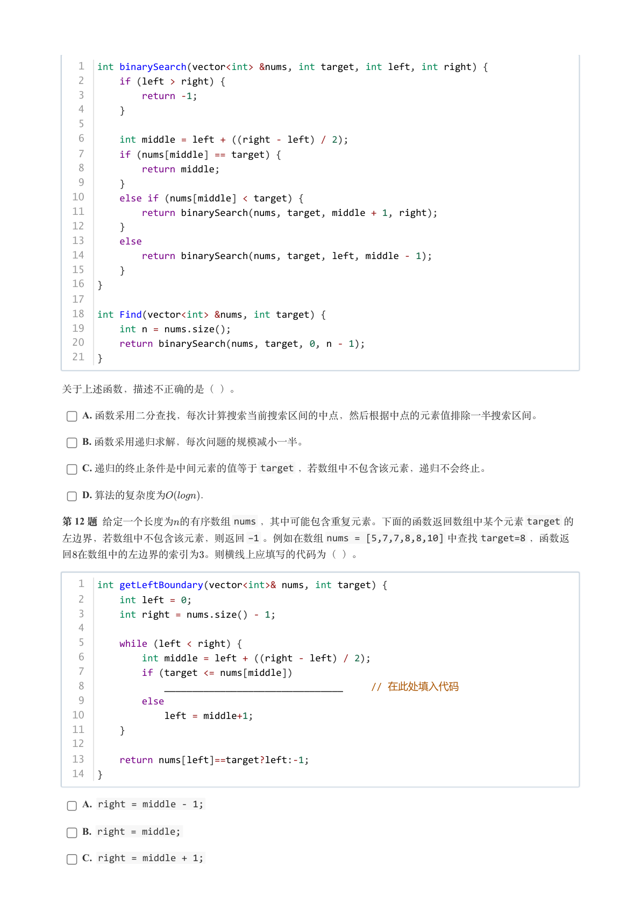

### 提取文本

```
1  int binarySearch(vector<int> &nums, int target, int left, int right) {
   2      if (left > right) {
   3          return -1;
   4      }
   5
   6      int middle = left + ((right - left) / 2);
   7      if (nums[middle] == target) {
   8          return middle;
   9      }
  10      else if (nums[middle] < target) {
  11          return binarySearch(nums, target, middle + 1, right);
  12      }
  13      else
  14          return binarySearch(nums, target, left, middle - 1);
  15      }
  16  }
  17
  18  int Find(vector<int> &nums, int target) {
  19      int n = nums.size();
  20      return binarySearch(nums, target, 0, n - 1);
  21  }


关于上述函数，描述不正确的是（ ）。

    A. 函数采用二分查找，每次计算搜索当前搜索区间的中点，然后根据中点的元素值排除一半搜索区间。

    B. 函数采用递归求解，每次问题的规模减小一半。

    C. 递归的终止条件是中间元素的值等于target ，若数组中不包含该元素，递归不会终止。

    D. 算法的复杂度为              .

第 12 题 给定一个长度为的有序数组nums ，其中可能包含重复元素。下面的函数返回数组中某个元素target 的
左边界，若数组中不包含该元素，则返回−1 。例如在数组nums = [5,7,7,8,8,10] 中查找target=8 ，函数返

回在数组中的左边界的索引为。则横线上应填写的代码为（ ）。


   1  int getLeftBoundary(vector<int>& nums, int target) {
   2      int left = 0;
   3      int right = nums.size() - 1;
   4
   5      while (left < right) {
   6          int middle = left + ((right - left) / 2);
   7          if (target <= nums[middle])
   8              ________________________________     // 在此处填入代码
   9          else
  10              left = middle+1;
  11      }
  12
  13      return nums[left]==target?left:-1;
  14  }

    A. right = middle - 1;

    B. right = middle;

    C. right = middle + 1;
```

## 第 7 页

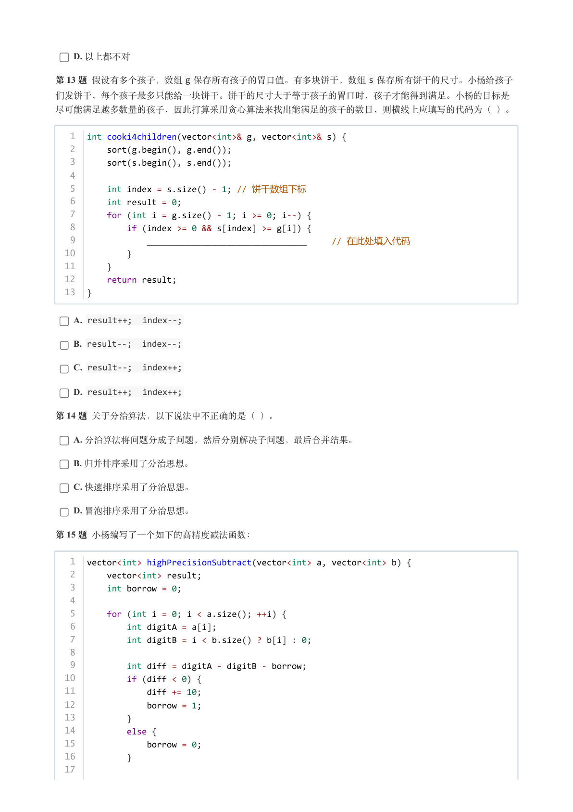

### 提取文本

```
D. 以上都不对

第 13 题 假设有多个孩子，数组g 保存所有孩子的胃口值。有多块饼干，数组s 保存所有饼干的尺寸。小杨给孩子

们发饼干，每个孩子最多只能给一块饼干。饼干的尺寸大于等于孩子的胃口时，孩子才能得到满足。小杨的目标是

尽可能满足越多数量的孩子，因此打算采用贪心算法来找出能满足的孩子的数目，则横线上应填写的代码为（ ）。


   1  int cooki4children(vector<int>& g, vector<int>& s) {
   2      sort(g.begin(), g.end());
   3      sort(s.begin(), s.end());
   4
   5      int index = s.size() - 1; // 饼干数组下标
   6      int result = 0;
   7      for (int i = g.size() - 1; i >= 0; i--) {
   8          if (index >= 0 && s[index] >= g[i]) {
   9              ________________________________     // 在此处填入代码
  10          }
  11      }
  12      return result;
  13  }


    A. result++;  index--;

    B. result--;  index--;

    C. result--;  index++;

    D. result++;  index++;

第 14 题 关于分治算法，以下说法中不正确的是（ ）。

    A. 分治算法将问题分成子问题，然后分别解决子问题，最后合并结果。

    B. 归并排序采用了分治思想。

    C. 快速排序采用了分治思想。

    D. 冒泡排序采用了分治思想。

第 15 题 小杨编写了一个如下的高精度减法函数：


   1  vector<int> highPrecisionSubtract(vector<int> a, vector<int> b) {
   2      vector<int> result;
   3      int borrow = 0;
   4
   5      for (int i = 0; i < a.size(); ++i) {
   6          int digitA = a[i];
   7          int digitB = i < b.size() ? b[i] : 0;
   8
   9          int diff = digitA - digitB - borrow;
  10          if (diff < 0) {
  11              diff += 10;
  12              borrow = 1;
  13          }
  14          else {
  15              borrow = 0;
  16          }
  17
```

## 第 8 页

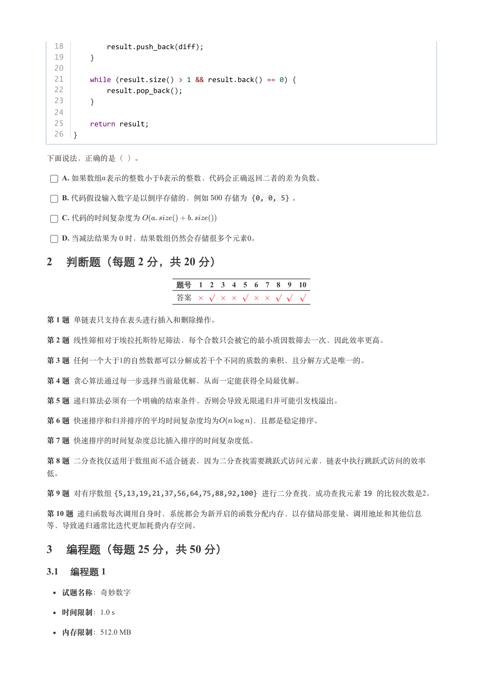

### 提取文本

```
18          result.push_back(diff);
  19      }
  20
  21      while (result.size() > 1 && result.back() == 0) {
  22          result.pop_back();
  23      }
  24
  25      return result;
  26  }


下面说法，正确的是（ ）。

    A. 如果数组表示的整数小于表示的整数，代码会正确返回二者的差为负数。

    B. 代码假设输入数字是以倒序存储的，例如  存储为 {0, 0, 5} 。

    C. 代码的时间复杂度为

    D. 当减法结果为 时，结果数组仍然会存储很多个元素。

2 判断题（每题 2 分，共 20 分）

                 题号  1  2  3  4  5  6  7  8  9  10

                 答案


第 1 题 单链表只支持在表头进行插入和删除操作。

第 2 题 线性筛相对于埃拉托斯特尼筛法，每个合数只会被它的最小质因数筛去一次，因此效率更高。

第 3 题 任何一个大于1的自然数都可以分解成若干个不同的质数的乘积，且分解方式是唯一的。

第 4 题 贪心算法通过每一步选择当前最优解，从而一定能获得全局最优解。

第 5 题 递归算法必须有一个明确的结束条件，否则会导致无限递归并可能引发栈溢出。

第 6 题 快速排序和归并排序的平均时间复杂度均为    ，且都是稳定排序。

第 7 题 快速排序的时间复杂度总比插入排序的时间复杂度低。

第 8 题 二分查找仅适用于数组而不适合链表，因为二分查找需要跳跃式访问元素，链表中执行跳跃式访问的效率

低。

第 9 题 对有序数组{5,13,19,21,37,56,64,75,88,92,100} 进行二分查找，成功查找元素19 的比较次数是2。

第 10 题 递归函数每次调用自身时，系统都会为新开启的函数分配内存，以存储局部变量、调用地址和其他信息

等，导致递归通常比迭代更加耗费内存空间。

3 编程题（每题 25 分，共 50 分）

3.1 编程题 1


  试题名称：奇妙数字

   时间限制：1.0 s

   内存限制：512.0 MB
```

## 第 9 页

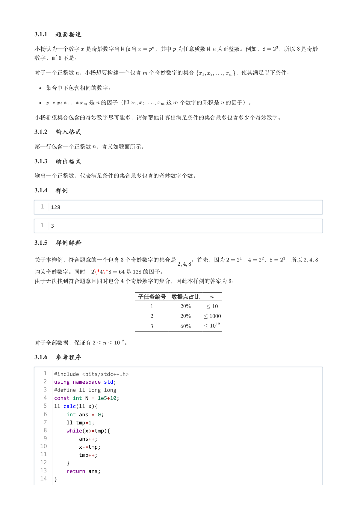

### 提取文本

```
3.1.1 题面描述

小杨认为一个数字 是奇妙数字当且仅当   ，其中 为任意质数且 为正整数。例如，   ，所以 是奇妙

数字，而 不是。


对于一个正整数 ，小杨想要构建一个包含 个奇妙数字的集合       ，使其满足以下条件：


  集合中不包含相同的数字。

          是 的因子（即     ,     ,      ,  这 个数字的乘积是 的因子）。


小杨希望集合包含的奇妙数字尽可能多，请你帮他计算出满足条件的集合最多包含多少个奇妙数字。

3.1.2 输入格式

第一行包含一个正整数 ，含义如题面所示。

3.1.3 输出格式

输出一个正整数，代表满足条件的集合最多包含的奇妙数字个数。

3.1.4 样例

  1  128


  1  3

3.1.5 样例解释


关于本样例，符合题意的一个包含 个奇妙数字的集合是   。首先，因为   ，   ，   ，所以   ,   ,

均为奇妙数字。同时，      是  的因子。

由于无法找到符合题意且同时包含 个奇妙数字的集合，因此本样例的答案为 。


                  子任务编号 数据点占比

                                         1        20%

                                         2        20%

                                         3        60%


对于全部数据，保证有      。

3.1.6 参考程序

   1  #include <bits/stdc++.h>
   2  using namespace std;
   3  #define ll long long
   4  const int N = 1e5+10;
   5  ll calc(ll x){
   6      int ans = 0;
   7      ll tmp=1;
   8      while(x>=tmp){
   9          ans++;
  10          x-=tmp;
  11          tmp++;
  12      }
  13      return ans;
  14  }
```

## 第 10 页

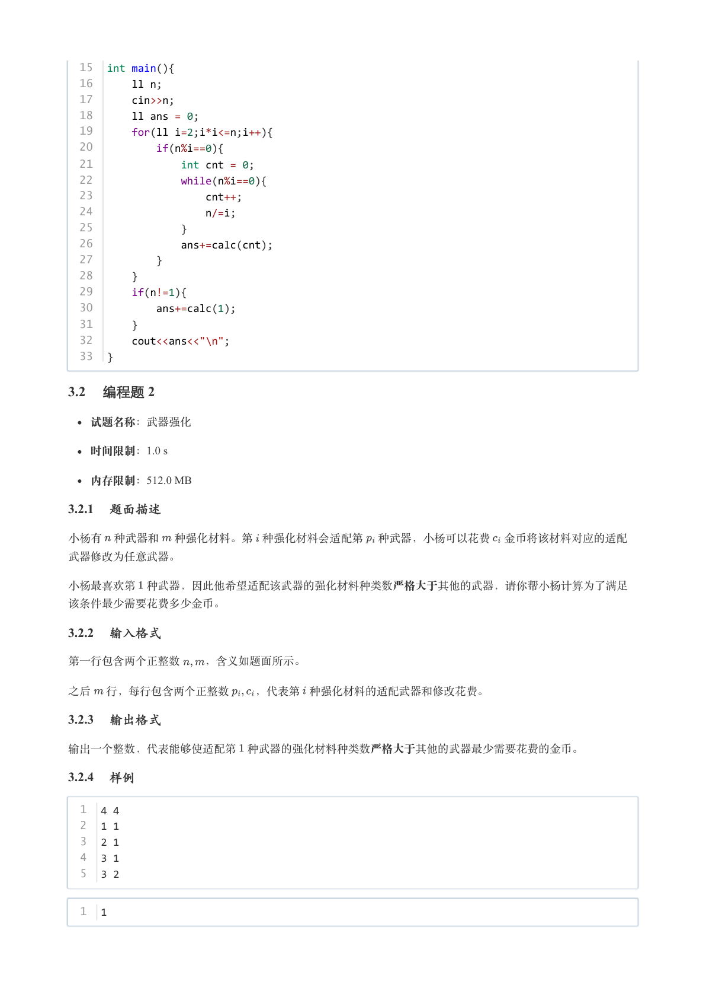

### 提取文本

```
15  int main(){
  16      ll n;
  17      cin>>n;
  18      ll ans = 0;
  19      for(ll i=2;i*i<=n;i++){
  20          if(n%i==0){
  21              int cnt = 0;
  22              while(n%i==0){
  23                  cnt++;
  24                  n/=i;
  25              }
  26              ans+=calc(cnt);
  27          }
  28      }
  29      if(n!=1){
  30          ans+=calc(1);
  31      }
  32      cout<<ans<<"\n";
  33  }

3.2 编程题 2


  试题名称：武器强化

   时间限制：1.0 s

   内存限制：512.0 MB

3.2.1 题面描述

小杨有 种武器和 种强化材料。第 种强化材料会适配第 种武器，小杨可以花费 金币将该材料对应的适配

武器修改为任意武器。


小杨最喜欢第 种武器，因此他希望适配该武器的强化材料种类数严格大于其他的武器，请你帮小杨计算为了满足

该条件最少需要花费多少金币。

3.2.2 输入格式

第一行包含两个正整数  ，含义如题面所示。


之后 行，每行包含两个正整数  ，代表第 种强化材料的适配武器和修改花费。

3.2.3 输出格式

输出一个整数，代表能够使适配第 种武器的强化材料种类数严格大于其他的武器最少需要花费的金币。

3.2.4 样例

  1  4 4
  2  1 1
  3  2 1
  4  3 1
  5  3 2


  1  1
```

## 第 11 页

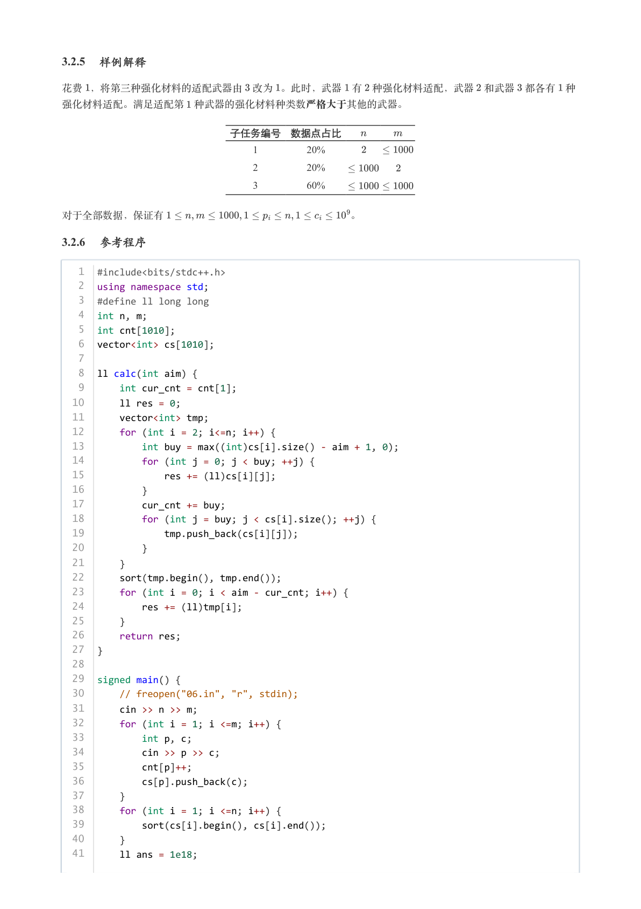

### 提取文本

```
3.2.5 样例解释

花费 ，将第三种强化材料的适配武器由 改为 。此时，武器 有 种强化材料适配，武器 和武器 都各有 种

强化材料适配。满足适配第 种武器的强化材料种类数严格大于其他的武器。


                 子任务编号 数据点占比

                                      1        20%

                                      2        20%

                                      3        60%


对于全部数据，保证有                  。

3.2.6 参考程序

   1  #include<bits/stdc++.h>
   2  using namespace std;
   3  #define ll long long
   4  int n, m;
   5  int cnt[1010];
   6  vector<int> cs[1010];
   7
   8  ll calc(int aim) {
   9      int cur_cnt = cnt[1];
  10      ll res = 0;
  11      vector<int> tmp;
  12      for (int i = 2; i<=n; i++) {
  13          int buy = max((int)cs[i].size() - aim + 1, 0);
  14          for (int j = 0; j < buy; ++j) {
  15              res += (ll)cs[i][j];
  16          }
  17          cur_cnt += buy;
  18          for (int j = buy; j < cs[i].size(); ++j) {
  19              tmp.push_back(cs[i][j]);
  20          }
  21      }
  22      sort(tmp.begin(), tmp.end());
  23      for (int i = 0; i < aim - cur_cnt; i++) {
  24          res += (ll)tmp[i];
  25      }
  26      return res;
  27  }
  28
  29  signed main() {
  30      // freopen("06.in", "r", stdin);
  31      cin >> n >> m;
  32      for (int i = 1; i <=m; i++) {
  33          int p, c;
  34          cin >> p >> c;
  35          cnt[p]++;
  36          cs[p].push_back(c);
  37      }
  38      for (int i = 1; i <=n; i++) {
  39          sort(cs[i].begin(), cs[i].end());
  40      }
  41      ll ans = 1e18;
```

## 第 12 页

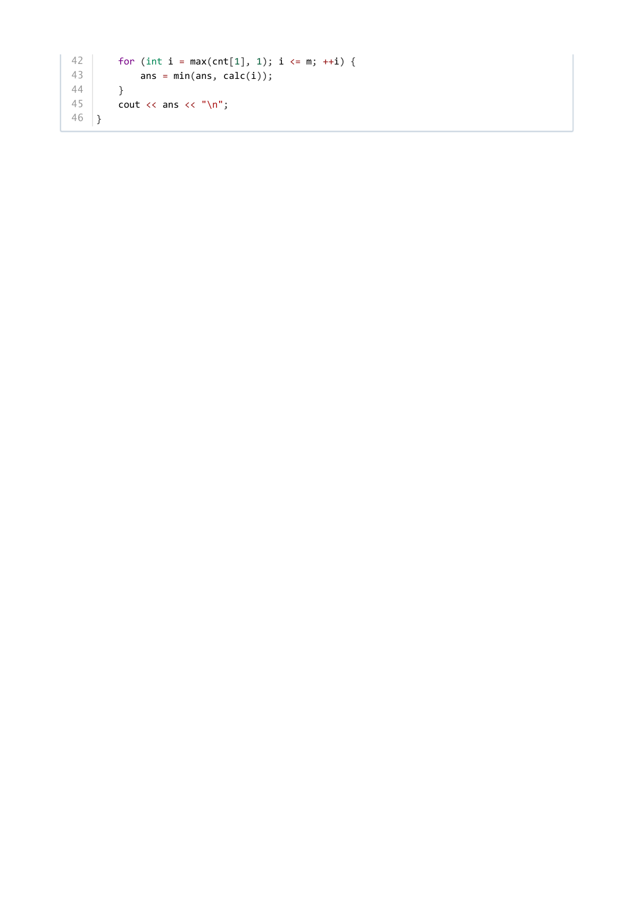

### 提取文本

```
42      for (int i = max(cnt[1], 1); i <= m; ++i) {
43          ans = min(ans, calc(i));
44      }
45      cout << ans << "\n";
46  }
```
