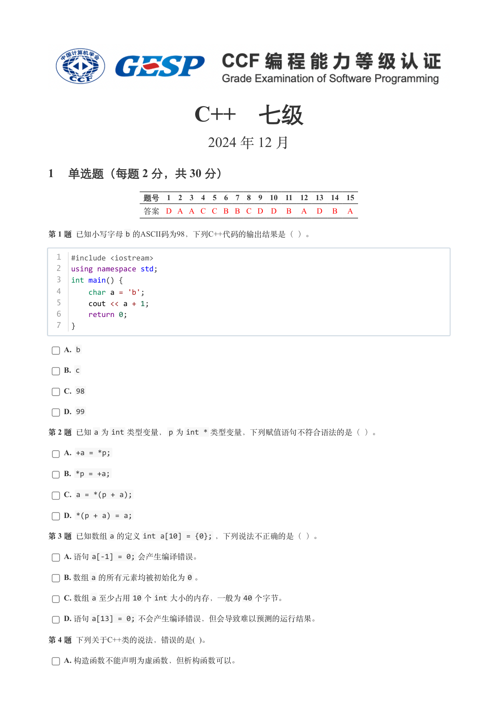
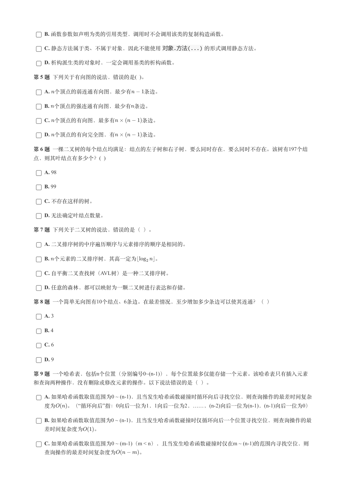
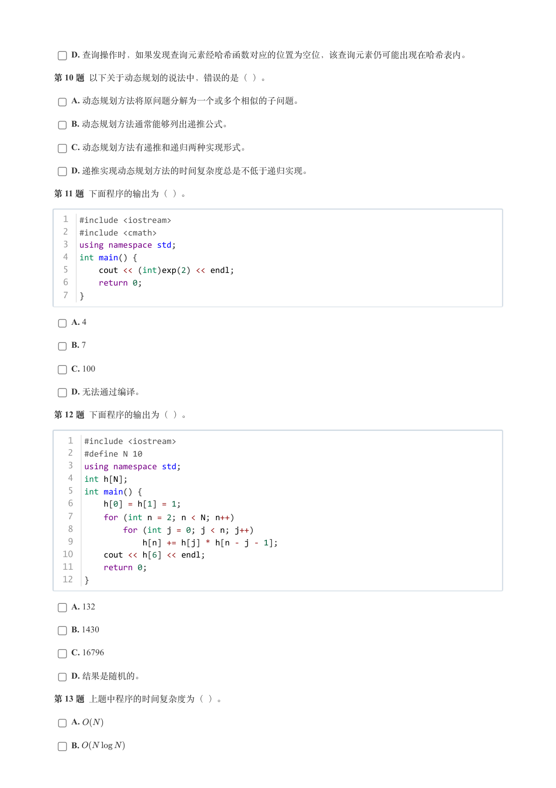
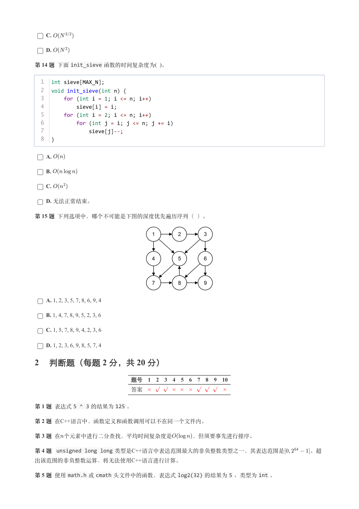
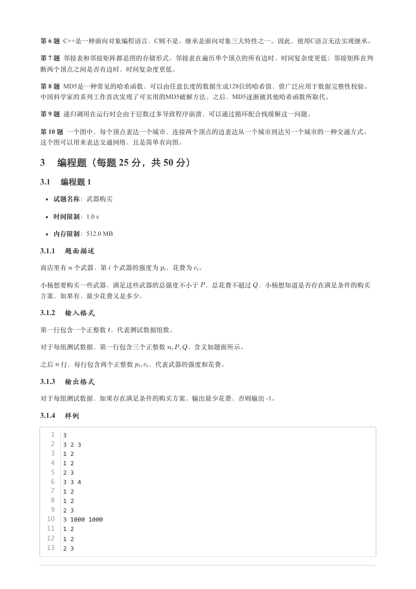
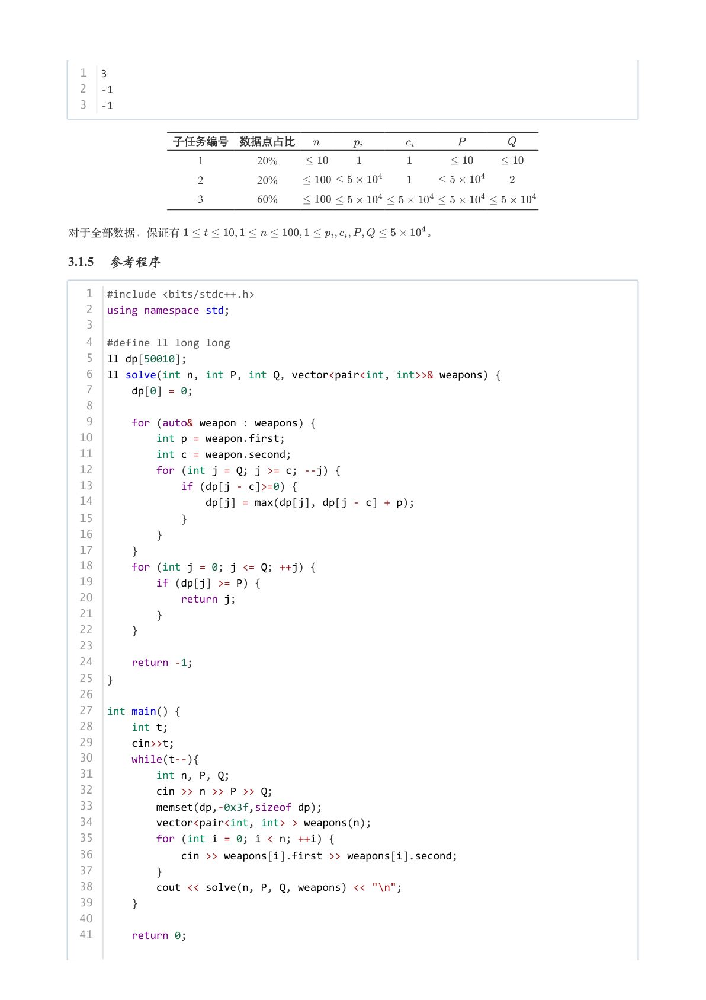
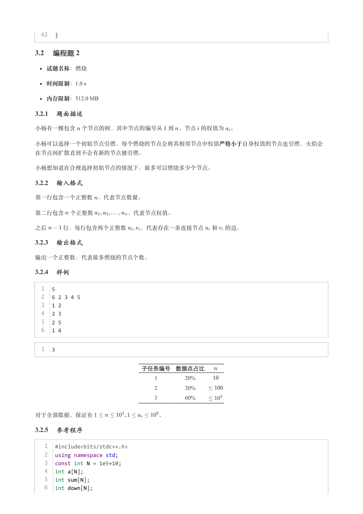
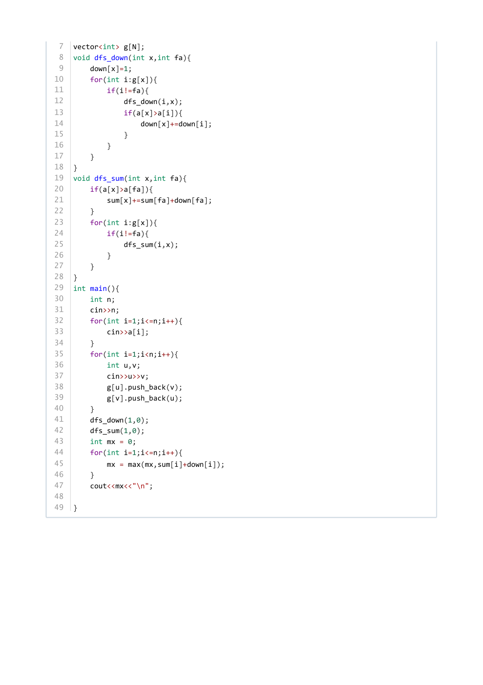

# 2024年12月-C++7级

- 原始 PDF：[`pdfs/2024年12月-C++7级.pdf`](../pdfs/2024年12月-C++7级.pdf)
- 页数：8
- 转换脚本：[`scripts/convert_pdfs_to_markdown.py`](../scripts/convert_pdfs_to_markdown.py)

> 为尽量避免信息丢失，每页均附带页面图片；文本提取结果保留原有顺序与换行特征，个别公式、图形、特殊排版请以页面图片为准。

## 第 1 页



### 提取文本

```
C++　七级

                      2024 年 12 月

1 单选题（每题 2 分，共 30 分）


            题号  1  2  3  4  5  6  7  8  9  10  11  12  13  14  15
            答案 D A A C C B B C D D  B  A  D  B  A


第 1 题 已知小写字母b 的ASCII码为98，下列C++代码的输出结果是（ ）。


  1  #include <iostream>
  2  using namespace std;
  3  int main() {
  4      char a = 'b';
  5      cout << a + 1;
  6      return 0;
  7  }


    A. b

    B. c

    C. 98

    D. 99

第 2 题 已知a 为int 类型变量，p 为int * 类型变量，下列赋值语句不符合语法的是（ ）。

    A. +a = *p;

    B. *p = +a;

    C. a = *(p + a);

    D. *(p + a) = a;

第 3 题 已知数组a 的定义int a[10] = {0}; ，下列说法不正确的是（ ）。

    A. 语句a[-1] = 0; 会产生编译错误。

    B. 数组a 的所有元素均被初始化为0 。

    C. 数组a 至少占用10 个int 大小的内存，一般为40 个字节。

    D. 语句a[13] = 0; 不会产生编译错误，但会导致难以预测的运行结果。

第 4 题 下列关于C++类的说法，错误的是( )。

    A. 构造函数不能声明为虚函数，但析构函数可以。
```

## 第 2 页



### 提取文本

```
B. 函数参数如声明为类的引用类型，调用时不会调用该类的复制构造函数。

    C. 静态方法属于类、不属于对象，因此不能使用对象.方法(...) 的形式调用静态方法。

    D. 析构派生类的对象时，一定会调用基类的析构函数。

第 5 题 下列关于有向图的说法，错误的是( )。

    A. 个顶点的弱连通有向图，最少有  条边。

    B. 个顶点的强连通有向图，最少有条边。

    C. 个顶点的有向图，最多有     条边。

    D. 个顶点的有向完全图，有     条边。

第 6 题 一棵二叉树的每个结点均满足：结点的左子树和右子树，要么同时存在，要么同时不存在。该树有197个结
点，则其叶结点有多少个？(  )

    A. 98

    B. 99

    C. 不存在这样的树。

    D. 无法确定叶结点数量。

第 7 题 下列关于二叉树的说法，错误的是（ ）。

    A. 二叉排序树的中序遍历顺序与元素排序的顺序是相同的。

    B. 个元素的二叉排序树，其高一定为   。

    C. 自平衡二叉查找树（AVL树）是一种二叉排序树。

    D. 任意的森林，都可以映射为一颗二叉树进行表达和存储。

第 8 题 一个简单无向图有10个结点、6条边。在最差情况，至少增加多少条边可以使其连通？（ ）

    A. 3

    B. 4

    C. 6

    D. 9

第 9 题 一个哈希表，包括n个位置（分别编号0~(n-1)），每个位置最多仅能存储一个元素。该哈希表只有插入元素

和查询两种操作，没有删除或修改元素的操作。以下说法错误的是（ ）。

    A. 如果哈希函数取值范围为0 ~ (n-1)，且当发生哈希函数碰撞时循环向后寻找空位，则查询操作的最差时间复杂
  度为   。（“循环向后”指：0向后一位为1，1向后一位为2，……，(n-2)向后一位为(n-1)，(n-1)向后一位为0）

    B. 如果哈希函数取值范围为0 ~ (n-1)，且当发生哈希函数碰撞时仅循环向后一个位置寻找空位，则查询操作的最

  差时间复杂度为  。

    C. 如果哈希函数取值范围为0 ~ (m-1)（m < n），且当发生哈希函数碰撞时仅在m ~ (n-1)的范围内寻找空位，则

  查询操作的最差时间复杂度为    。
```

## 第 3 页



### 提取文本

```
D. 查询操作时，如果发现查询元素经哈希函数对应的位置为空位，该查询元素仍可能出现在哈希表内。

第 10 题 以下关于动态规划的说法中，错误的是（ ）。

    A. 动态规划方法将原问题分解为一个或多个相似的子问题。

    B. 动态规划方法通常能够列出递推公式。

    C. 动态规划方法有递推和递归两种实现形式。

    D. 递推实现动态规划方法的时间复杂度总是不低于递归实现。

第 11 题 下面程序的输出为（ ）。


  1  #include <iostream>
  2  #include <cmath>
  3  using namespace std;
  4  int main() {
  5      cout << (int)exp(2) << endl;
  6      return 0;
  7  }


    A. 4

    B. 7

    C. 100

    D. 无法通过编译。

第 12 题 下面程序的输出为（ ）。


   1  #include <iostream>
   2  #define N 10
   3  using namespace std;
   4  int h[N];
   5  int main() {
   6      h[0] = h[1] = 1;
   7      for (int n = 2; n < N; n++)
   8          for (int j = 0; j < n; j++)
   9              h[n] += h[j] * h[n - j - 1];
  10      cout << h[6] << endl;
  11      return 0;
  12  }


    A. 132

    B. 1430

    C. 16796

    D. 结果是随机的。

第 13 题 上题中程序的时间复杂度为（ ）。

    A.

    B.
```

## 第 4 页



### 提取文本

```
C.

    D.

第 14 题 下面init_sieve 函数的时间复杂度为( )。


  1  int sieve[MAX_N];
  2  void init_sieve(int n) {
  3      for (int i = 1; i <= n; i++)
  4          sieve[i] = i;
  5      for (int i = 2; i <= n; i++)
  6          for (int j = i; j <= n; j += i)
  7              sieve[j]--;
  8  }


    A.

    B.

    C.

    D. 无法正常结束。

第 15 题 下列选项中，哪个不可能是下图的深度优先遍历序列（ ）。


    A. 1, 2, 3, 5, 7, 8, 6, 9, 4

    B. 1, 4, 7, 8, 9, 5, 2, 3, 6

    C. 1, 5, 7, 8, 9, 4, 2, 3, 6

    D. 1, 2, 3, 6, 9, 8, 5, 7, 4

2 判断题（每题 2 分，共 20 分）

                 题号  1  2  3  4  5  6  7  8  9  10

                 答案


第 1 题 表达式5 ^ 3 的结果为125 。

第 2 题 在C++语言中，函数定义和函数调用可以不在同一个文件内。

第 3 题 在个元素中进行二分查找，平均时间复杂度是    ，但须要事先进行排序。

第 4 题 unsigned long long 类型是C++语言中表达范围最大的非负整数类型之一，其表达范围是     。超
出该范围的非负整数运算，将无法使用C++语言进行计算。

第 5 题 使用math.h 或cmath 头文件中的函数，表达式log2(32) 的结果为5 、类型为int 。
```

## 第 5 页



### 提取文本

```
第 6 题 C++是一种面向对象编程语言，C则不是。继承是面向对象三大特性之一。因此，使用C语言无法实现继承。

第 7 题 邻接表和邻接矩阵都是图的存储形式。邻接表在遍历单个顶点的所有边时，时间复杂度更低；邻接矩阵在判

断两个顶点之间是否有边时，时间复杂度更低。

第 8 题 MD5是一种常见的哈希函数，可以由任意长度的数据生成128位的哈希值，曾广泛应用于数据完整性校验。
中国科学家的系列工作首次发现了可实用的MD5破解方法。之后，MD5逐渐被其他哈希函数所取代。

第 9 题 递归调用在运行时会由于层数过多导致程序崩溃，可以通过循环配合栈缓解这一问题。

第 10 题 一个图中，每个顶点表达一个城市，连接两个顶点的边表达从一个城市到达另一个城市的一种交通方式。

这个图可以用来表达交通网络，且是简单有向图。

3 编程题（每题 25 分，共 50 分）

3.1 编程题 1

  试题名称：武器购买

   时间限制：1.0 s

   内存限制：512.0 MB

3.1.1 题面描述

商店里有 个武器，第 个武器的强度为 ，花费为 。


小杨想要购买一些武器，满足这些武器的总强度不小于 ，总花费不超过 ，小杨想知道是否存在满足条件的购买

方案，如果有，最少花费又是多少。

3.1.2 输入格式

第一行包含一个正整数 ，代表测试数据组数。


对于每组测试数据，第一行包含三个正整数   ，含义如题面所示。


之后 行，每行包含两个正整数  ，代表武器的强度和花费。

3.1.3 输出格式

对于每组测试数据，如果存在满足条件的购买方案，输出最少花费，否则输出 -1。

3.1.4 样例

   1  3
   2  3 2 3
   3  1 2
   4  1 2
   5  2 3
   6  3 3 4
   7  1 2
   8  1 2
   9  2 3
  10  3 1000 1000
  11  1 2
  12  1 2
  13  2 3
```

## 第 6 页



### 提取文本

```
1  3
  2  -1
  3  -1


         子任务编号 数据点占比

                       1        20%

                       2        20%

                       3        60%


对于全部数据，保证有                      。

3.1.5 参考程序

   1  #include <bits/stdc++.h>
   2  using namespace std;
   3
   4  #define ll long long
   5  ll dp[50010];
   6  ll solve(int n, int P, int Q, vector<pair<int, int>>& weapons) {
   7      dp[0] = 0;
   8
   9      for (auto& weapon : weapons) {
  10          int p = weapon.first;
  11          int c = weapon.second;
  12          for (int j = Q; j >= c; --j) {
  13              if (dp[j - c]>=0) {
  14                  dp[j] = max(dp[j], dp[j - c] + p);
  15              }
  16          }
  17      }
  18      for (int j = 0; j <= Q; ++j) {
  19          if (dp[j] >= P) {
  20              return j;
  21          }
  22      }
  23
  24      return -1;
  25  }
  26
  27  int main() {
  28      int t;
  29      cin>>t;
  30      while(t--){
  31          int n, P, Q;
  32          cin >> n >> P >> Q;
  33          memset(dp,-0x3f,sizeof dp);
  34          vector<pair<int, int> > weapons(n);
  35          for (int i = 0; i < n; ++i) {
  36              cin >> weapons[i].first >> weapons[i].second;
  37          }
  38          cout << solve(n, P, Q, weapons) << "\n";
  39      }
  40
  41      return 0;
```

## 第 7 页



### 提取文本

```
42  }

3.2 编程题 2


  试题名称：燃烧

   时间限制：1.0 s

   内存限制：512.0 MB

3.2.1 题面描述

小杨有一棵包含 个节点的树，其中节点的编号从 到 。节点 的权值为 。


小杨可以选择一个初始节点引燃，每个燃烧的节点会将其相邻节点中权值严格小于自身权值的节点也引燃，火焰会

在节点间扩散直到不会有新的节点被引燃。


小杨想知道在合理选择初始节点的情况下，最多可以燃烧多少个节点。

3.2.2 输入格式

第一行包含一个正整数 ，代表节点数量。


第二行包含 个正整数      ，代表节点权值。


之后   行，每行包含两个正整数  ，代表存在一条连接节点 和 的边。

3.2.3 输出格式

输出一个正整数，代表最多燃烧的节点个数。

3.2.4 样例

  1  5
  2  6 2 3 4 5
  3  1 2
  4  2 3
  5  2 5
  6  1 4


  1  3


                   子任务编号 数据点占比

                                          1        20%

                                          2        20%

                                          3        60%


对于全部数据，保证有           。

3.2.5 参考程序

   1  #include<bits/stdc++.h>
   2  using namespace std;
   3  const int N = 1e5+10;
   4  int a[N];
   5  int sum[N];
   6  int down[N];
```

## 第 8 页



### 提取文本

```
7  vector<int> g[N];
 8  void dfs_down(int x,int fa){
 9      down[x]=1;
10      for(int i:g[x]){
11          if(i!=fa){
12              dfs_down(i,x);
13              if(a[x]>a[i]){
14                  down[x]+=down[i];
15              }
16          }
17      }
18  }
19  void dfs_sum(int x,int fa){
20      if(a[x]>a[fa]){
21          sum[x]+=sum[fa]+down[fa];
22      }
23      for(int i:g[x]){
24          if(i!=fa){
25              dfs_sum(i,x);
26          }
27      }
28  }
29  int main(){
30      int n;
31      cin>>n;
32      for(int i=1;i<=n;i++){
33          cin>>a[i];
34      }
35      for(int i=1;i<n;i++){
36          int u,v;
37          cin>>u>>v;
38          g[u].push_back(v);
39          g[v].push_back(u);
40      }
41      dfs_down(1,0);
42      dfs_sum(1,0);
43      int mx = 0;
44      for(int i=1;i<=n;i++){
45          mx = max(mx,sum[i]+down[i]);
46      }
47      cout<<mx<<"\n";
48
49  }
```
