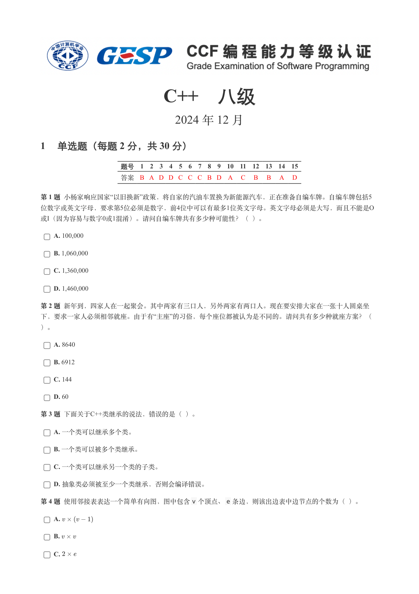
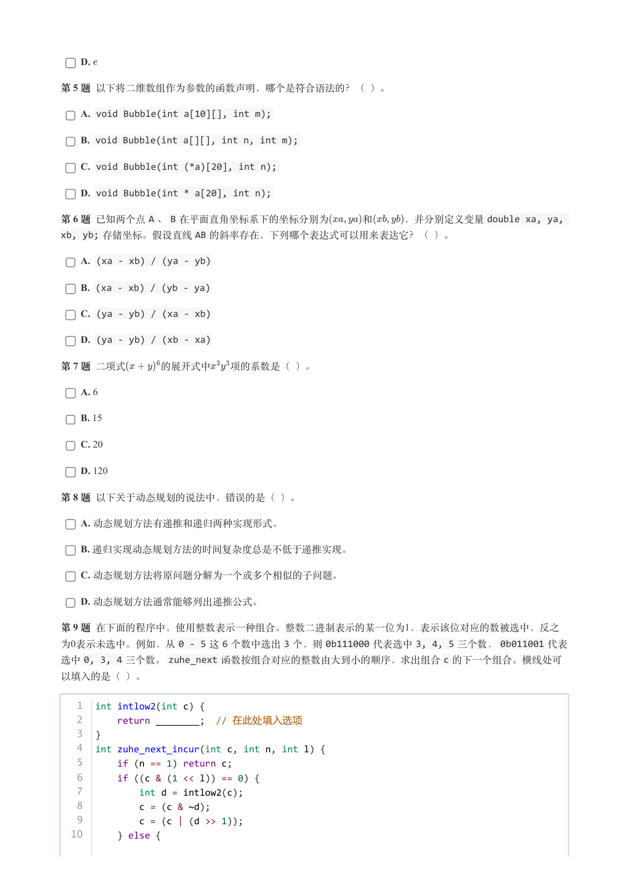
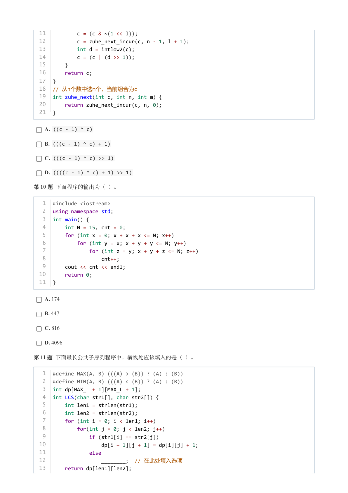
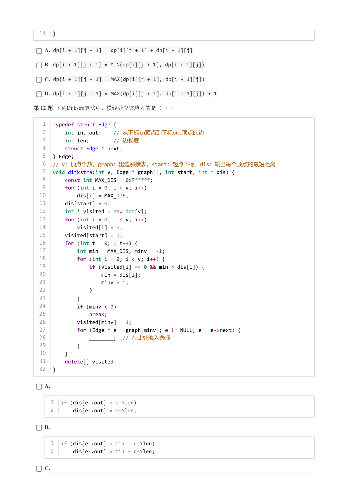
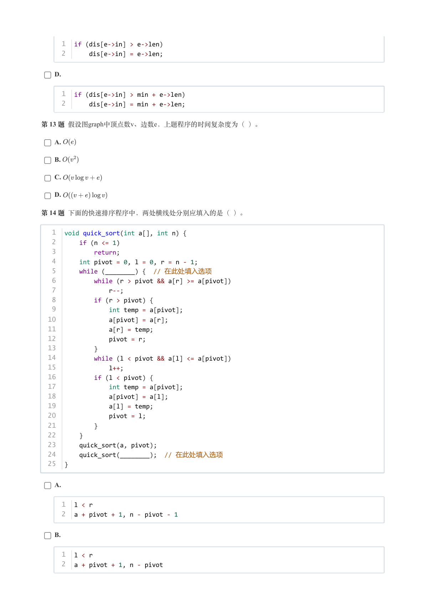
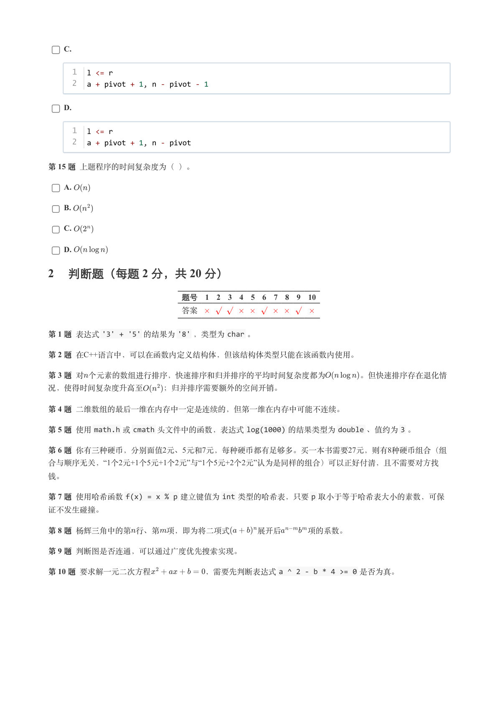
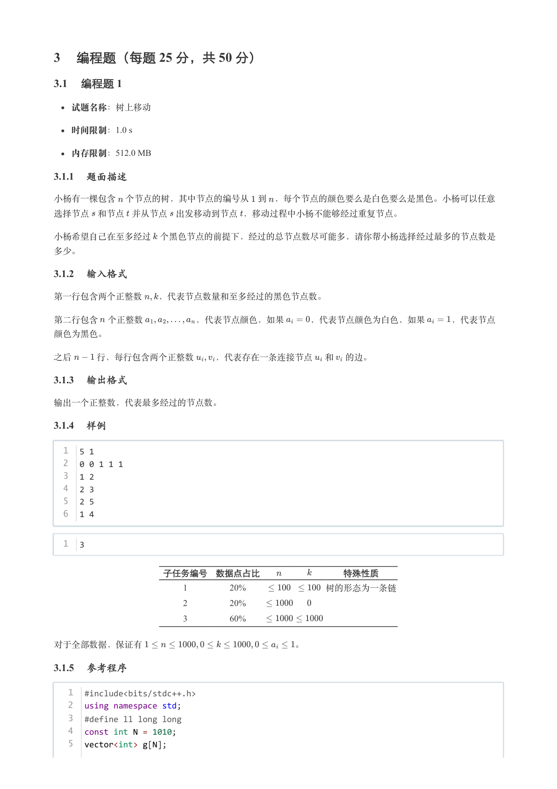
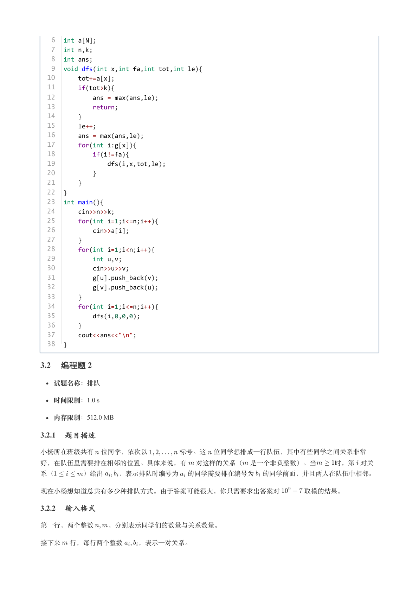
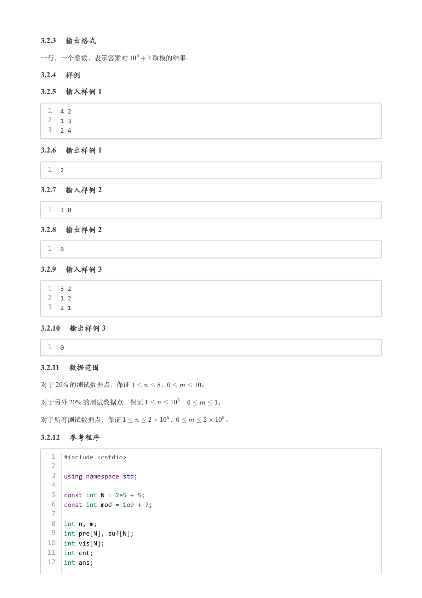
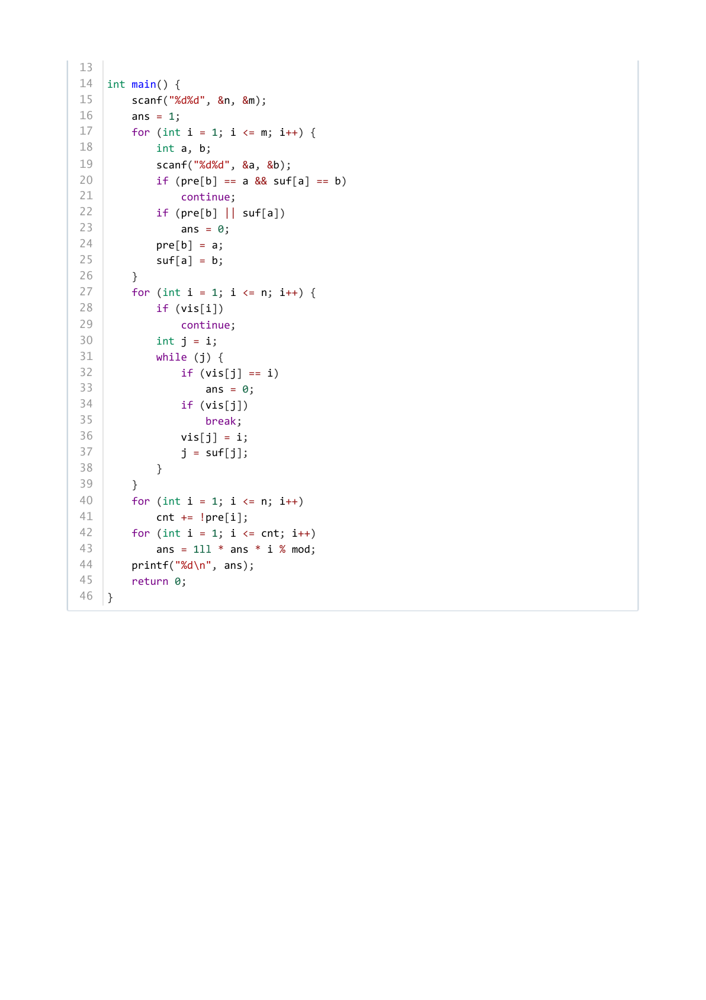

# 2024年12月-C++8级

- 原始 PDF：[`pdfs/2024年12月-C++8级.pdf`](../pdfs/2024年12月-C++8级.pdf)
- 页数：10
- 转换脚本：[`scripts/convert_pdfs_to_markdown.py`](../scripts/convert_pdfs_to_markdown.py)

> 为尽量避免信息丢失，每页均附带页面图片；文本提取结果保留原有顺序与换行特征，个别公式、图形、特殊排版请以页面图片为准。

## 第 1 页



### 提取文本

```
C++　八级

                      2024 年 12 月

1 单选题（每题 2 分，共 30 分）


            题号  1  2  3  4  5  6  7  8  9  10  11  12  13  14  15
            答案 B A D D C C C B D A  C  B  B  A  D


第 1 题 小杨家响应国家“以旧换新”政策，将自家的汽油车置换为新能源汽车，正在准备自编车牌。自编车牌包括5
位数字或英文字母，要求第5位必须是数字，前4位中可以有最多1位英文字母。英文字母必须是大写，而且不能是O
或I（因为容易与数字0或1混淆）。请问自编车牌共有多少种可能性？（ ）。

    A. 100,000

    B. 1,060,000

    C. 1,360,000

    D. 1,460,000

第 2 题 新年到，四家人在一起聚会。其中两家有三口人，另外两家有两口人。现在要安排大家在一张十人圆桌坐
下，要求一家人必须相邻就座。由于有“主座”的习俗，每个座位都被认为是不同的。请问共有多少种就座方案？（

）。

    A. 8640

    B. 6912

    C. 144

    D. 60

第 3 题 下面关于C++类继承的说法，错误的是（ ）。

    A. 一个类可以继承多个类。

    B. 一个类可以被多个类继承。

    C. 一个类可以继承另一个类的子类。

    D. 抽象类必须被至少一个类继承，否则会编译错误。

第 4 题 使用邻接表表达一个简单有向图，图中包含v 个顶点、e 条边，则该出边表中边节点的个数为（ ）。

    A.

    B.

    C.
```

## 第 2 页



### 提取文本

```
D.

第 5 题 以下将二维数组作为参数的函数声明，哪个是符合语法的？（ ）。

    A. void Bubble(int a[10][], int m);

    B. void Bubble(int a[][], int n, int m);

    C. void Bubble(int (*a)[20], int n);

    D. void Bubble(int * a[20], int n);

第 6 题 已知两个点A 、B 在平面直角坐标系下的坐标分别为   和    ，并分别定义变量double xa, ya,
xb, yb; 存储坐标。假设直线AB 的斜率存在，下列哪个表达式可以用来表达它？（ ）。

    A. (xa - xb) / (ya - yb)

    B. (xa - xb) / (yb - ya)

    C. (ya - yb) / (xa - xb)

    D. (ya - yb) / (xb - xa)

第 7 题 二项式    的展开式中  项的系数是（ ）。

    A. 6

    B. 15

    C. 20

    D. 120

第 8 题 以下关于动态规划的说法中，错误的是（ ）。

    A. 动态规划方法有递推和递归两种实现形式。

    B. 递归实现动态规划方法的时间复杂度总是不低于递推实现。

    C. 动态规划方法将原问题分解为一个或多个相似的子问题。

    D. 动态规划方法通常能够列出递推公式。

第 9 题 在下面的程序中，使用整数表示一种组合。整数二进制表示的某一位为1，表示该位对应的数被选中，反之
为0表示未选中。例如，从0 - 5 这6 个数中选出3 个，则0b111000 代表选中3, 4, 5 三个数，0b011001 代表
选中0, 3, 4 三个数。zuhe_next 函数按组合对应的整数由大到小的顺序，求出组合c 的下一个组合。横线处可

以填入的是（ ）。


   1  int intlow2(int c) {
   2      return ________;  // 在此处填入选项
   3  }
   4  int zuhe_next_incur(int c, int n, int l) {
   5      if (n == 1) return c;
   6      if ((c & (1 << l)) == 0) {
   7          int d = intlow2(c);
   8          c = (c & ~d);
   9          c = (c | (d >> 1));
  10      } else {
```

## 第 3 页



### 提取文本

```
11          c = (c & ~(1 << l));
  12          c = zuhe_next_incur(c, n - 1, l + 1);
  13          int d = intlow2(c);
  14          c = (c | (d >> 1));
  15      }
  16      return c;
  17  }
  18  // 从n个数中选m个，当前组合为c
  19  int zuhe_next(int c, int n, int m) {
  20      return zuhe_next_incur(c, n, 0);
  21  }


    A. ((c - 1) ^ c)

    B. (((c - 1) ^ c) + 1)

    C. (((c - 1) ^ c) >> 1)

    D. ((((c - 1) ^ c) + 1) >> 1)

第 10 题 下面程序的输出为（ ）。


   1  #include <iostream>
   2  using namespace std;
   3  int main() {
   4      int N = 15, cnt = 0;
   5      for (int x = 0; x + x + x <= N; x++)
   6          for (int y = x; x + y + y <= N; y++)
   7              for (int z = y; x + y + z <= N; z++)
   8                  cnt++;
   9      cout << cnt << endl;
  10      return 0;
  11  }


    A. 174

    B. 447

    C. 816

    D. 4096

第 11 题 下面最长公共子序列程序中，横线处应该填入的是（ ）。


   1  #define MAX(A, B) (((A) > (B)) ? (A) : (B))
   2  #define MIN(A, B) (((A) < (B)) ? (A) : (B))
   3  int dp[MAX_L + 1][MAX_L + 1];
   4  int LCS(char str1[], char str2[]) {
   5      int len1 = strlen(str1);
   6      int len2 = strlen(str2);
   7      for (int i = 0; i < len1; i++)
   8          for(int j = 0; j < len2; j++)
   9              if (str1[i] == str2[j])
  10                  dp[i + 1][j + 1] = dp[i][j] + 1;
  11              else
  12                  ________;  // 在此处填入选项
  13      return dp[len1][len2];
```

## 第 4 页



### 提取文本

```
14  }


    A. dp[i + 1][j + 1] = dp[i][j + 1] + dp[i + 1][j]

    B. dp[i + 1][j + 1] = MIN(dp[i][j + 1], dp[i + 1][j])

    C. dp[i + 1][j + 1] = MAX(dp[i][j + 1], dp[i + 1][j])

    D. dp[i + 1][j + 1] = MAX(dp[i][j + 1], dp[i + 1][j]) + 1

第 12 题 下列Dijkstra算法中，横线处应该填入的是（ ）。


   1  typedef struct Edge {
   2      int in, out;    // 从下标in顶点到下标out顶点的边
   3      int len;        // 边长度
   4      struct Edge * next;
   5  } Edge;
   6  // v：顶点个数，graph：出边邻接表，start：起点下标，dis：输出每个顶点的最短距离
   7  void dijkstra(int v, Edge * graph[], int start, int * dis) {
   8      const int MAX_DIS = 0x7fffff;
   9      for (int i = 0; i < v; i++)
  10          dis[i] = MAX_DIS;
  11      dis[start] = 0;
  12      int * visited = new int[v];
  13      for (int i = 0; i < v; i++)
  14          visited[i] = 0;
  15      visited[start] = 1;
  16      for (int t = 0; ; t++) {
  17          int min = MAX_DIS, minv = -1;
  18          for (int i = 0; i < v; i++) {
  19              if (visited[i] == 0 && min > dis[i]) {
  20                  min = dis[i];
  21                  minv = i;
  22              }
  23          }
  24          if (minv < 0)
  25              break;
  26          visited[minv] = 1;
  27          for (Edge * e = graph[minv]; e != NULL; e = e->next) {
  28              ________;  // 在此处填入选项
  29          }
  30      }
  31      delete[] visited;
  32  }


    A.


     1  if (dis[e->out] > e->len)
     2      dis[e->out] = e->len;


    B.


     1  if (dis[e->out] > min + e->len)
     2      dis[e->out] = min + e->len;


    C.
```

## 第 5 页



### 提取文本

```
1  if (dis[e->in] > e->len)
     2      dis[e->in] = e->len;


    D.


     1  if (dis[e->in] > min + e->len)
     2      dis[e->in] = min + e->len;


第 13 题 假设图graph中顶点数v、边数e，上题程序的时间复杂度为（ ）。

    A.

    B.

    C.

    D.

第 14 题 下面的快速排序程序中，两处横线处分别应填入的是（ ）。


   1  void quick_sort(int a[], int n) {
   2      if (n <= 1)
   3          return;
   4      int pivot = 0, l = 0, r = n - 1;
   5      while (________) {  // 在此处填入选项
   6          while (r > pivot && a[r] >= a[pivot])
   7              r--;
   8          if (r > pivot) {
   9              int temp = a[pivot];
  10              a[pivot] = a[r];
  11              a[r] = temp;
  12              pivot = r;
  13          }
  14          while (l < pivot && a[l] <= a[pivot])
  15              l++;
  16          if (l < pivot) {
  17              int temp = a[pivot];
  18              a[pivot] = a[l];
  19              a[l] = temp;
  20              pivot = l;
  21          }
  22      }
  23      quick_sort(a, pivot);
  24      quick_sort(________);  // 在此处填入选项
  25  }


    A.


     1  l < r
     2  a + pivot + 1, n - pivot - 1


    B.


     1  l < r
     2  a + pivot + 1, n - pivot
```

## 第 6 页



### 提取文本

```
C.


     1  l <= r
     2  a + pivot + 1, n - pivot - 1


    D.


     1  l <= r
     2  a + pivot + 1, n - pivot


第 15 题 上题程序的时间复杂度为（ ）。

    A.

    B.

    C.

    D.

2 判断题（每题 2 分，共 20 分）

                 题号  1  2  3  4  5  6  7  8  9  10

                 答案


第 1 题 表达式'3' + '5' 的结果为'8' ，类型为char 。

第 2 题 在C++语言中，可以在函数内定义结构体，但该结构体类型只能在该函数内使用。

第 3 题 对个元素的数组进行排序，快速排序和归并排序的平均时间复杂度都为    。但快速排序存在退化情

况，使得时间复杂度升高至   ；归并排序需要额外的空间开销。

第 4 题 二维数组的最后一维在内存中一定是连续的，但第一维在内存中可能不连续。

第 5 题 使用math.h 或cmath 头文件中的函数，表达式log(1000) 的结果类型为double 、值约为3 。

第 6 题 你有三种硬币，分别面值2元、5元和7元，每种硬币都有足够多。买一本书需要27元，则有8种硬币组合（组
合与顺序无关，“1个2元+1个5元+1个2元”与“1个5元+2个2元”认为是同样的组合）可以正好付清，且不需要对方找

钱。

第 7 题 使用哈希函数f(x) = x % p 建立键值为int 类型的哈希表，只要p 取小于等于哈希表大小的素数，可保

证不发生碰撞。

第 8 题 杨辉三角中的第行、第 项，即为将二项式    展开后   项的系数。

第 9 题 判断图是否连通，可以通过广度优先搜索实现。

第 10 题 要求解一元二次方程       ，需要先判断表达式a ^ 2 - b * 4 >= 0 是否为真。
```

## 第 7 页



### 提取文本

```
3 编程题（每题 25 分，共 50 分）

3.1 编程题 1


  试题名称：树上移动

   时间限制：1.0 s

   内存限制：512.0 MB

3.1.1 题面描述

小杨有一棵包含 个节点的树，其中节点的编号从 到 ，每个节点的颜色要么是白色要么是黑色。小杨可以任意

选择节点 和节点 并从节点 出发移动到节点 ，移动过程中小杨不能够经过重复节点。


小杨希望自己在至多经过 个黑色节点的前提下，经过的总节点数尽可能多，请你帮小杨选择经过最多的节点数是

多少。

3.1.2 输入格式

第一行包含两个正整数  ，代表节点数量和至多经过的黑色节点数。


第二行包含 个正整数      ，代表节点颜色，如果   ，代表节点颜色为白色，如果   ，代表节点

颜色为黑色。


之后   行，每行包含两个正整数  ，代表存在一条连接节点 和 的边。

3.1.3 输出格式

输出一个正整数，代表最多经过的节点数。

3.1.4 样例

  1  5 1
  2  0 0 1 1 1
  3  1 2
  4  2 3
  5  2 5
  6  1 4


  1  3


            子任务编号 数据点占比         特殊性质

                             1        20%         树的形态为一条链

                             2        20%

                             3        60%


对于全部数据，保证有                 。

3.1.5 参考程序

   1  #include<bits/stdc++.h>
   2  using namespace std;
   3  #define ll long long
   4  const int N = 1010;
   5  vector<int> g[N];
```

## 第 8 页



### 提取文本

```
6  int a[N];
   7  int n,k;
   8  int ans;
   9  void dfs(int x,int fa,int tot,int le){
  10      tot+=a[x];
  11      if(tot>k){
  12          ans = max(ans,le);
  13          return;
  14      }
  15      le++;
  16      ans = max(ans,le);
  17      for(int i:g[x]){
  18          if(i!=fa){
  19              dfs(i,x,tot,le);
  20          }
  21      }
  22  }
  23  int main(){
  24      cin>>n>>k;
  25      for(int i=1;i<=n;i++){
  26          cin>>a[i];
  27      }
  28      for(int i=1;i<n;i++){
  29          int u,v;
  30          cin>>u>>v;
  31          g[u].push_back(v);
  32          g[v].push_back(u);
  33      }
  34      for(int i=1;i<=n;i++){
  35          dfs(i,0,0,0);
  36      }
  37      cout<<ans<<"\n";
  38  }

3.2 编程题 2


  试题名称：排队

   时间限制：1.0 s

   内存限制：512.0 MB

3.2.1 题目描述

小杨所在班级共有 位同学，依次以     标号。这 位同学想排成一行队伍，其中有些同学之间关系非常

好，在队伍里需要排在相邻的位置。具体来说，有 对这样的关系（ 是一个非负整数）。当   时，第 对关

系（    ）给出  ，表示排队时编号为 的同学需要排在编号为 的同学前面，并且两人在队伍中相邻。


现在小杨想知道总共有多少种排队方式。由于答案可能很大，你只需要求出答案对    取模的结果。

3.2.2 输入格式

第一行，两个整数  ，分别表示同学们的数量与关系数量。


接下来 行，每行两个整数  ，表示一对关系。
```

## 第 9 页



### 提取文本

```
3.2.3 输出格式

一行，一个整数，表示答案对    取模的结果。

3.2.4 样例

3.2.5 输入样例 1

  1  4 2
  2  1 3
  3  2 4

3.2.6 输出样例 1

  1  2

3.2.7 输入样例 2

  1  3 0

3.2.8 输出样例 2

  1  6

3.2.9 输入样例 3

  1  3 2
  2  1 2
  3  2 1

3.2.10 输出样例 3

  1  0

3.2.11 数据范围

对于 20% 的测试数据点，保证     ，     。

对于另外 20% 的测试数据点，保证      ，     。


对于所有测试数据点，保证       ，       。

3.2.12 参考程序

   1  #include <cstdio>
   2
   3  using namespace std;
   4
   5  const int N = 2e5 + 5;
   6  const int mod = 1e9 + 7;
   7
   8  int n, m;
   9  int pre[N], suf[N];
  10  int vis[N];
  11  int cnt;
  12  int ans;
```

## 第 10 页



### 提取文本

```
13
14  int main() {
15      scanf("%d%d", &n, &m);
16      ans = 1;
17      for (int i = 1; i <= m; i++) {
18          int a, b;
19          scanf("%d%d", &a, &b);
20          if (pre[b] == a && suf[a] == b)
21              continue;
22          if (pre[b] || suf[a])
23              ans = 0;
24          pre[b] = a;
25          suf[a] = b;
26      }
27      for (int i = 1; i <= n; i++) {
28          if (vis[i])
29              continue;
30          int j = i;
31          while (j) {
32              if (vis[j] == i)
33                  ans = 0;
34              if (vis[j])
35                  break;
36              vis[j] = i;
37              j = suf[j];
38          }
39      }
40      for (int i = 1; i <= n; i++)
41          cnt += !pre[i];
42      for (int i = 1; i <= cnt; i++)
43          ans = 1ll * ans * i % mod;
44      printf("%d\n", ans);
45      return 0;
46  }
```
