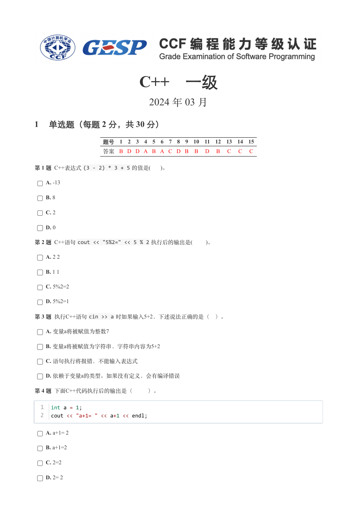
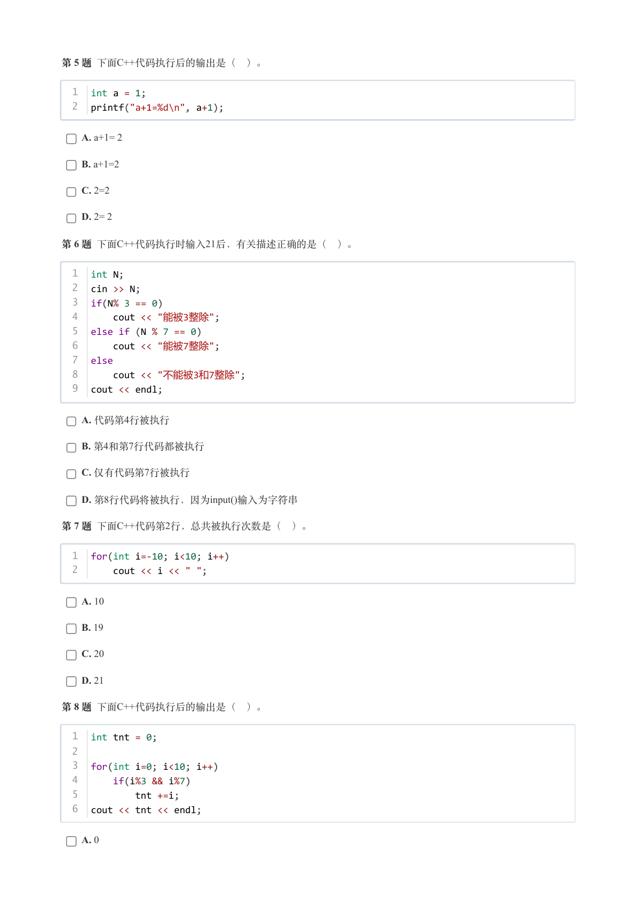
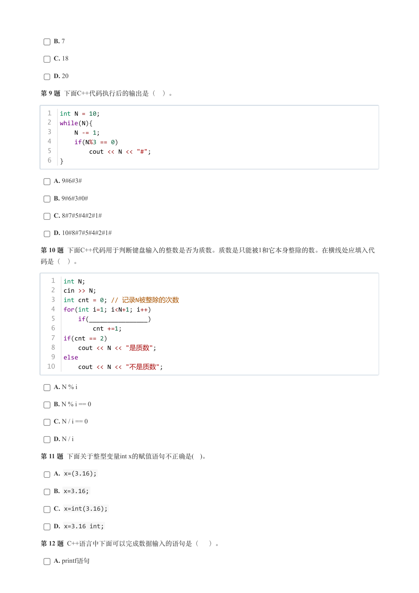
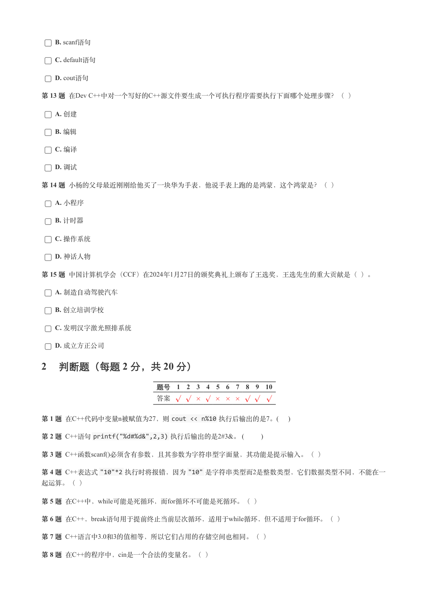
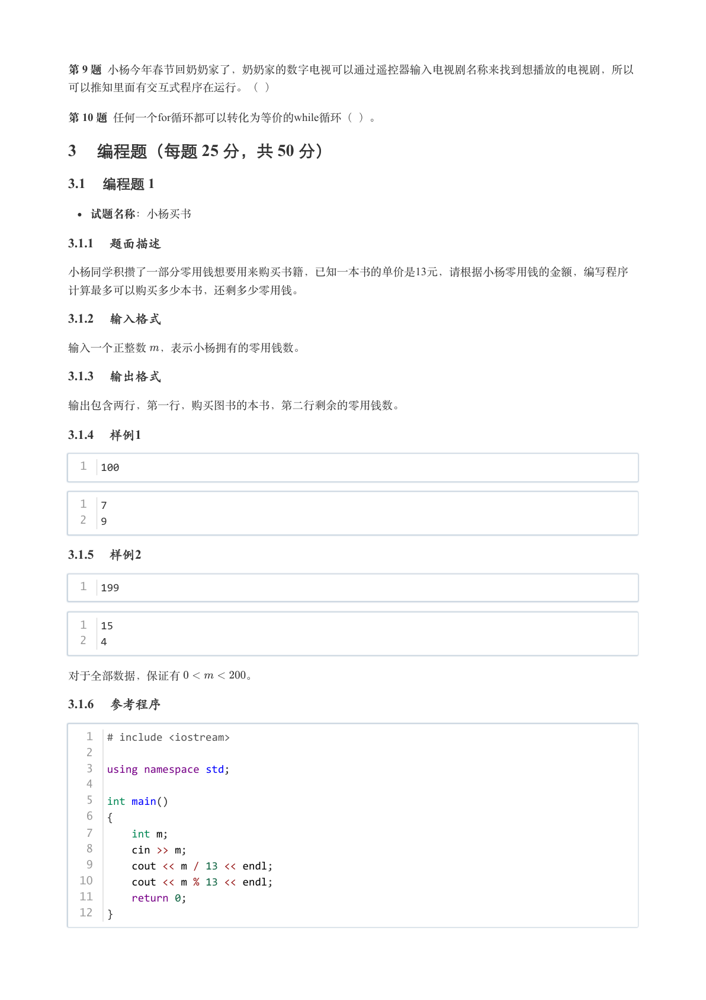
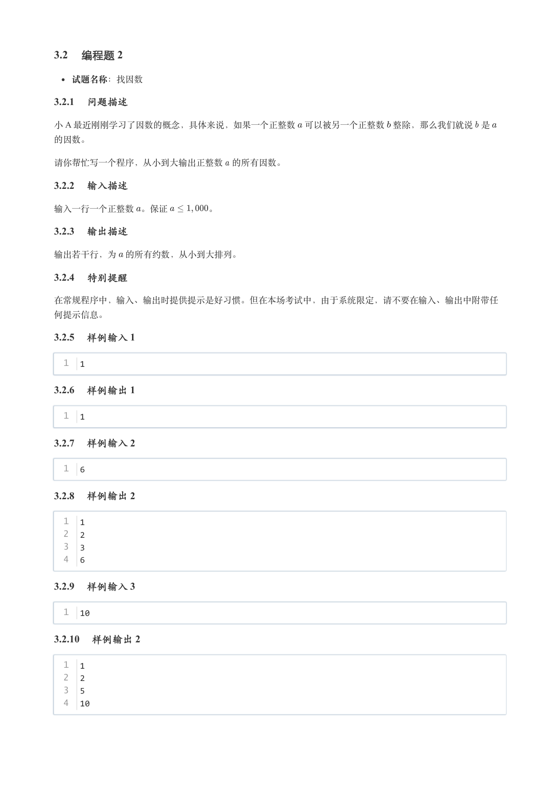
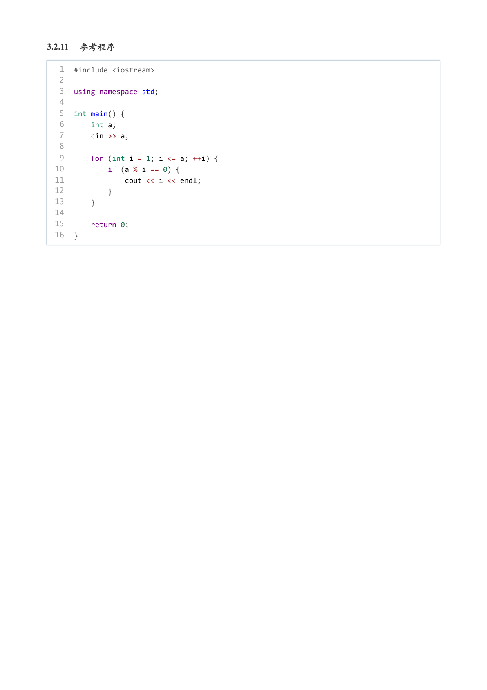

# 2024年3月-C++1级

- 原始 PDF：[`pdfs/2024年3月-C++1级.pdf`](../pdfs/2024年3月-C++1级.pdf)
- 页数：7
- 转换脚本：[`scripts/convert_pdfs_to_markdown.py`](../scripts/convert_pdfs_to_markdown.py)

> 为尽量避免信息丢失，每页均附带页面图片；文本提取结果保留原有顺序与换行特征，个别公式、图形、特殊排版请以页面图片为准。

## 第 1 页



### 提取文本

```
C++　一级

                      2024 年 03 月

1 单选题（每题 2 分，共 30 分）


            题号  1  2  3  4  5  6  7  8  9  10  11  12  13  14  15
            答案 B D D A B A C D B  B  D  B  C  C  C


第 1 题 C++表达式(3 - 2) * 3 + 5 的值是(   )。

    A. -13

    B. 8

    C. 2

    D. 0

第 2 题 C++语句cout << "5%2=" << 5 % 2 执行后的输出是(    )。

    A. 2 2

    B. 1 1

    C. 5%2=2

    D. 5%2=1

第 3 题 执行C++语句cin >> a 时如果输入5+2，下述说法正确的是（ ）。

    A. 变量a将被赋值为整数7

    B. 变量a将被赋值为字符串，字符串内容为5+2

    C. 语句执行将报错，不能输入表达式

    D. 依赖于变量a的类型。如果没有定义，会有编译错误

第 4 题 下面C++代码执行后的输出是（   ）。


  1  int a = 1;
  2  cout << "a+1= " << a+1 << endl;


    A. a+1= 2

    B. a+1=2

    C. 2=2

    D. 2= 2
```

## 第 2 页



### 提取文本

```
第 5 题 下面C++代码执行后的输出是（ ）。


  1  int a = 1;
  2  printf("a+1=%d\n", a+1);


    A. a+1= 2

    B. a+1=2

    C. 2=2

    D. 2= 2

第 6 题 下面C++代码执行时输入21后，有关描述正确的是（ ）。


  1  int N;
  2  cin >> N;
  3  if(N% 3 == 0)
  4      cout << "能被3整除";
  5  else if (N % 7 == 0)
  6      cout << "能被7整除";
  7  else
  8      cout << "不能被3和7整除";
  9  cout << endl;


    A. 代码第4行被执行

    B. 第4和第7行代码都被执行

    C. 仅有代码第7行被执行

    D. 第8行代码将被执行，因为input()输入为字符串

第 7 题 下面C++代码第2行，总共被执行次数是（ ）。


  1  for(int i=-10; i<10; i++)
  2      cout << i << " ";


    A. 10

    B. 19

    C. 20

    D. 21

第 8 题 下面C++代码执行后的输出是（ ）。


  1  int tnt = 0;
  2
  3  for(int i=0; i<10; i++)
  4      if(i%3 && i%7)
  5          tnt +=i;
  6  cout << tnt << endl;


    A. 0
```

## 第 3 页



### 提取文本

```
B. 7

    C. 18

    D. 20

第 9 题 下面C++代码执行后的输出是（ ）。


  1  int N = 10;
  2  while(N){
  3      N -= 1;
  4      if(N%3 == 0)
  5          cout << N << "#";
  6  }


    A. 9#6#3#

    B. 9#6#3#0#

    C. 8#7#5#4#2#1#

    D. 10#8#7#5#4#2#1#

第 10 题 下面C++代码用于判断键盘输入的整数是否为质数。质数是只能被1和它本身整除的数。在横线处应填入代

码是（ ）。


   1  int N;
   2  cin >> N;
   3  int cnt = 0; // 记录N被整除的次数
   4  for(int i=1; i<N+1; i++)
   5      if(________________)
   6          cnt +=1;
   7  if(cnt == 2)
   8      cout << N << "是质数";
   9  else
  10      cout << N << "不是质数";


    A. N % i

    B. N % i == 0

    C. N / i == 0

    D. N / i

第 11 题 下面关于整型变量int x的赋值语句不正确是( )。

    A. x=(3.16);

    B. x=3.16;

    C. x=int(3.16);

    D. x=3.16 int;

第 12 题 C++语言中下面可以完成数据输入的语句是（ ）。

    A. printf语句
```

## 第 4 页



### 提取文本

```
B. scanf语句

    C. default语句

    D. cout语句

第 13 题 在Dev C++中对一个写好的C++源文件要生成一个可执行程序需要执行下面哪个处理步骤？（ ）

    A. 创建

    B. 编辑

    C. 编译

    D. 调试

第 14 题 小杨的父母最近刚刚给他买了一块华为手表，他说手表上跑的是鸿蒙，这个鸿蒙是？（ ）

    A. 小程序

    B. 计时器

    C. 操作系统

    D. 神话人物

第 15 题 中国计算机学会（CCF）在2024年1月27日的颁奖典礼上颁布了王选奖，王选先生的重大贡献是（ ）。

    A. 制造自动驾驶汽车

    B. 创立培训学校

    C. 发明汉字激光照排系统

    D. 成立方正公司

2 判断题（每题 2 分，共 20 分）

                 题号  1  2  3  4  5  6  7  8  9  10

                 答案


第 1 题 在C++代码中变量n被赋值为27，则cout << n%10 执行后输出的是7。(    )

第 2 题 C++语句printf("%d#%d&",2,3) 执行后输出的是2#3&。 (       )

第 3 题 C++函数scanf()必须含有参数，且其参数为字符串型字面量，其功能是提示输入。（ ）

第 4 题 C++表达式"10"*2 执行时将报错，因为"10" 是字符串类型而2是整数类型，它们数据类型不同，不能在一

起运算。（ ）

第 5 题 在C++中，while可能是死循环，而for循环不可能是死循环。（ ）

第 6 题 在C++，break语句用于提前终止当前层次循环，适用于while循环，但不适用于for循环。（ ）

第 7 题 C++语言中3.0和3的值相等，所以它们占用的存储空间也相同。（ ）

第 8 题 在C++的程序中，cin是一个合法的变量名。（ ）
```

## 第 5 页



### 提取文本

```
第 9 题 小杨今年春节回奶奶家了，奶奶家的数字电视可以通过遥控器输入电视剧名称来找到想播放的电视剧，所以

可以推知里面有交互式程序在运行。（ ）

第 10 题 任何一个for循环都可以转化为等价的while循环（ ）。

3 编程题（每题 25 分，共 50 分）

3.1 编程题 1


  试题名称：小杨买书

3.1.1 题面描述

小杨同学积攒了一部分零用钱想要用来购买书籍，已知一本书的单价是13元，请根据小杨零用钱的金额，编写程序

计算最多可以购买多少本书，还剩多少零用钱。

3.1.2 输入格式

输入一个正整数 ，表示小杨拥有的零用钱数。

3.1.3 输出格式

输出包含两行，第一行，购买图书的本书，第二行剩余的零用钱数。

3.1.4 样例1

  1  100


  1  7
  2  9

3.1.5 样例2

  1  199


  1  15
  2  4


对于全部数据，保证有      。

3.1.6 参考程序

   1  # include <iostream>
   2
   3  using namespace std;
   4
   5  int main()
   6  {
   7      int m;
   8      cin >> m;
   9      cout << m / 13 << endl;
  10      cout << m % 13 << endl;
  11      return 0;
  12  }
```

## 第 6 页



### 提取文本

```
3.2 编程题 2


  试题名称：找因数

3.2.1 问题描述

小 A 最近刚刚学习了因数的概念，具体来说，如果一个正整数 可以被另一个正整数 整除，那么我们就说 是

的因数。


请你帮忙写一个程序，从小到大输出正整数 的所有因数。

3.2.2 输入描述

输入一行一个正整数 。保证     。

3.2.3 输出描述

输出若干行，为 的所有约数，从小到大排列。

3.2.4 特别提醒

在常规程序中，输入、输出时提供提示是好习惯。但在本场考试中，由于系统限定，请不要在输入、输出中附带任

何提示信息。

3.2.5 样例输入 1

  1  1

3.2.6 样例输出 1

  1  1

3.2.7 样例输入 2

  1  6

3.2.8 样例输出 2

  1  1
  2  2
  3  3
  4  6

3.2.9 样例输入 3

  1  10

3.2.10 样例输出 2

  1  1
  2  2
  3  5
  4  10
```

## 第 7 页



### 提取文本

```
3.2.11 参考程序

   1  #include <iostream>
   2
   3  using namespace std;
   4
   5  int main() {
   6      int a;
   7      cin >> a;
   8
   9      for (int i = 1; i <= a; ++i) {
  10          if (a % i == 0) {
  11              cout << i << endl;
  12          }
  13      }
  14
  15      return 0;
  16  }
```
