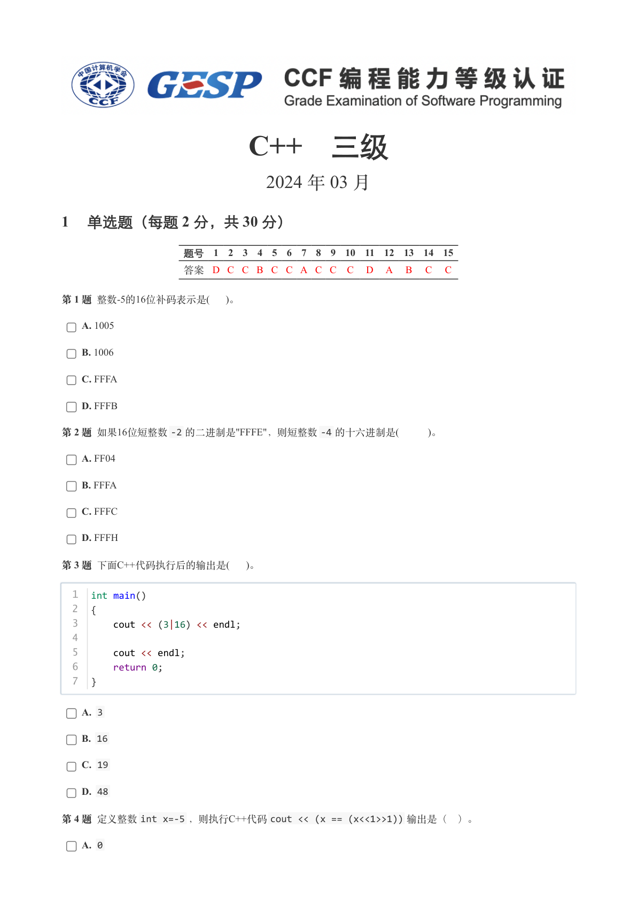
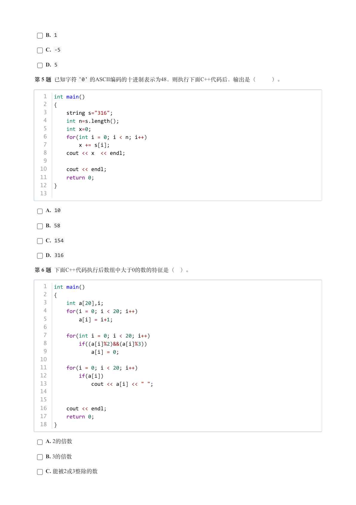
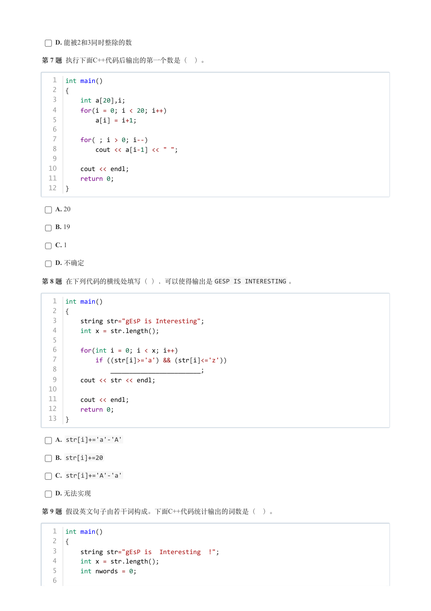
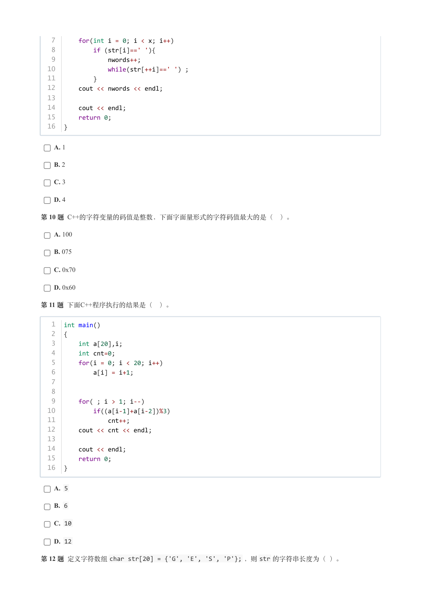
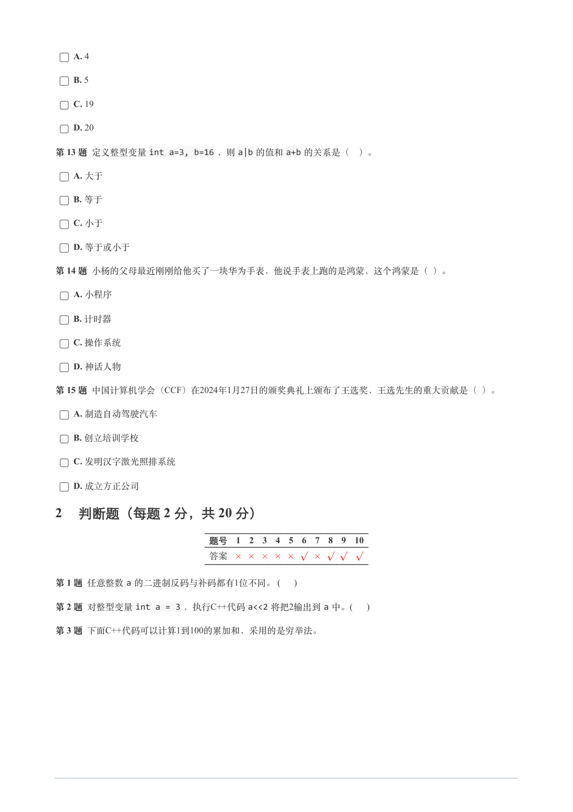
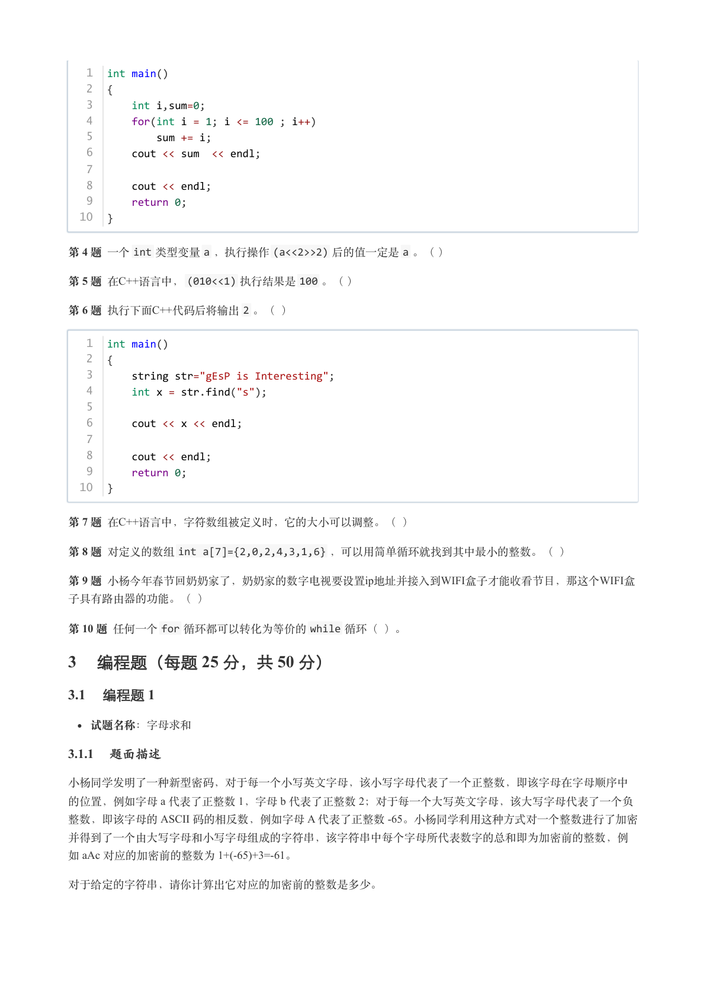
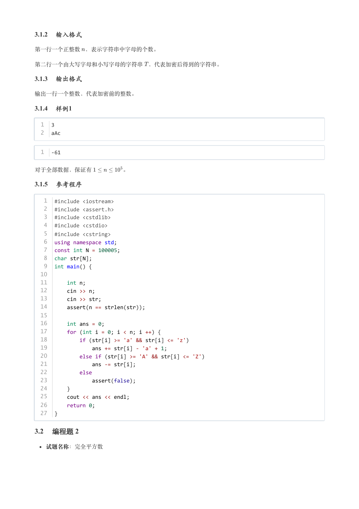
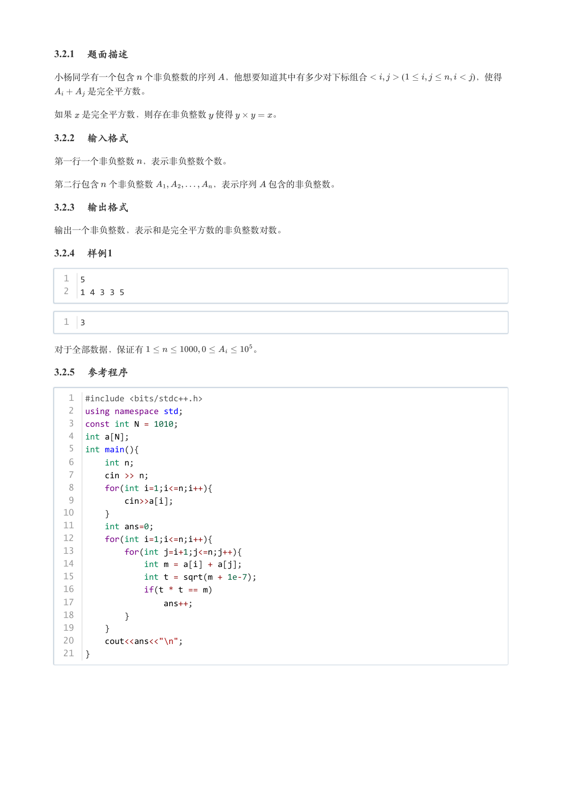

# 2024年3月-C++3级

- 原始 PDF：[`pdfs/2024年3月-C++3级.pdf`](../pdfs/2024年3月-C++3级.pdf)
- 页数：8
- 转换脚本：[`scripts/convert_pdfs_to_markdown.py`](../scripts/convert_pdfs_to_markdown.py)

> 为尽量避免信息丢失，每页均附带页面图片；文本提取结果保留原有顺序与换行特征，个别公式、图形、特殊排版请以页面图片为准。

## 第 1 页



### 提取文本

```
C++　三级

                      2024 年 03 月

1 单选题（每题 2 分，共 30 分）


            题号  1  2  3  4  5  6  7  8  9  10  11  12  13  14  15
            答案 D C C B C C A C C  C  D  A  B  C  C


第 1 题 整数-5的16位补码表示是(  )。

    A. 1005

    B. 1006

    C. FFFA

    D. FFFB

第 2 题 如果16位短整数-2 的二进制是"FFFE"，则短整数-4 的十六进制是(    )。

    A. FF04

    B. FFFA

    C. FFFC

    D. FFFH

第 3 题 下面C++代码执行后的输出是(  )。


  1  int main()
  2  {
  3      cout << (3|16) << endl;
  4
  5      cout << endl;
  6      return 0;
  7  }


    A. 3

    B. 16

    C. 19

    D. 48

第 4 题 定义整数int x=-5 ，则执行C++代码cout << (x == (x<<1>>1)) 输出是（ ）。

    A. 0
```

## 第 2 页



### 提取文本

```
B. 1

    C. -5

    D. 5

第 5 题 已知字符'0' 的ASCII编码的十进制表示为48，则执行下面C++代码后，输出是（   ）。


   1  int main()
   2  {
   3      string s="316";
   4      int n=s.length();
   5      int x=0;
   6      for(int i = 0; i < n; i++)
   7          x += s[i];
   8      cout << x  << endl;
   9
  10      cout << endl;
  11      return 0;
  12  }
  13


    A. 10

    B. 58

    C. 154

    D. 316

第 6 题 下面C++代码执行后数组中大于0的数的特征是（ ）。


   1  int main()
   2  {
   3      int a[20],i;
   4      for(i = 0; i < 20; i++)
   5          a[i] = i+1;
   6
   7      for(int i = 0; i < 20; i++)
   8          if((a[i]%2)&&(a[i]%3))
   9              a[i] = 0;
  10
  11      for(i = 0; i < 20; i++)
  12          if(a[i])
  13              cout << a[i] << " ";
  14
  15
  16      cout << endl;
  17      return 0;
  18  }


    A. 2的倍数

    B. 3的倍数

    C. 能被2或3整除的数
```

## 第 3 页



### 提取文本

```
D. 能被2和3同时整除的数

第 7 题 执行下面C++代码后输出的第一个数是（ ）。


   1  int main()
   2  {
   3      int a[20],i;
   4      for(i = 0; i < 20; i++)
   5          a[i] = i+1;
   6
   7      for( ; i > 0; i--)
   8          cout << a[i-1] << " ";
   9
  10      cout << endl;
  11      return 0;
  12  }


    A. 20

    B. 19

    C. 1

    D. 不确定

第 8 题 在下列代码的横线处填写（ ），可以使得输出是GESP IS INTERESTING 。


   1  int main()
   2  {
   3      string str="gEsP is Interesting";
   4      int x = str.length();
   5
   6      for(int i = 0; i < x; i++)
   7          if ((str[i]>='a') && (str[i]<='z'))
   8              ________________________;
   9      cout << str << endl;
  10
  11      cout << endl;
  12      return 0;
  13  }


    A. str[i]+='a'-'A'

    B. str[i]+=20

    C. str[i]+='A'-'a'

    D. 无法实现

第 9 题 假设英文句子由若干词构成。下面C++代码统计输出的词数是（ ）。


   1  int main()
   2  {
   3      string str="gEsP is  Interesting  !";
   4      int x = str.length();
   5      int nwords = 0;
   6
```

## 第 4 页



### 提取文本

```
7      for(int i = 0; i < x; i++)
   8          if (str[i]==' '){
   9              nwords++;
  10              while(str[++i]==' ') ;
  11          }
  12      cout << nwords << endl;
  13
  14      cout << endl;
  15      return 0;
  16  }


    A. 1

    B. 2

    C. 3

    D. 4

第 10 题 C++的字符变量的码值是整数，下面字面量形式的字符码值最大的是（ ）。

    A. 100

    B. 075

    C. 0x70

    D. 0x60

第 11 题 下面C++程序执行的结果是（ ）。


   1  int main()
   2  {
   3      int a[20],i;
   4      int cnt=0;
   5      for(i = 0; i < 20; i++)
   6          a[i] = i+1;
   7
   8
   9      for( ; i > 1; i--)
  10          if((a[i-1]+a[i-2])%3)
  11              cnt++;
  12      cout << cnt << endl;
  13
  14      cout << endl;
  15      return 0;
  16  }


    A. 5

    B. 6

    C. 10

    D. 12

第 12 题 定义字符数组char str[20] = {'G', 'E', 'S', 'P'}; ，则str 的字符串长度为（ ）。
```

## 第 5 页



### 提取文本

```
A. 4

    B. 5

    C. 19

    D. 20

第 13 题 定义整型变量int a=3, b=16 ，则a|b 的值和a+b 的关系是（ ）。

    A. 大于

    B. 等于

    C. 小于

    D. 等于或小于

第 14 题 小杨的父母最近刚刚给他买了一块华为手表，他说手表上跑的是鸿蒙，这个鸿蒙是（ ）。

    A. 小程序

    B. 计时器

    C. 操作系统

    D. 神话人物

第 15 题 中国计算机学会（CCF）在2024年1月27日的颁奖典礼上颁布了王选奖，王选先生的重大贡献是（ ）。

    A. 制造自动驾驶汽车

    B. 创立培训学校

    C. 发明汉字激光照排系统

    D. 成立方正公司

2 判断题（每题 2 分，共 20 分）

                 题号  1  2  3  4  5  6  7  8  9  10

                 答案


第 1 题 任意整数a 的二进制反码与补码都有1位不同。 (    )

第 2 题 对整型变量int a = 3 ，执行C++代码a<<2 将把2输出到a 中。(     )

第 3 题 下面C++代码可以计算1到100的累加和，采用的是穷举法。
```

## 第 6 页



### 提取文本

```
1  int main()
   2  {
   3      int i,sum=0;
   4      for(int i = 1; i <= 100 ; i++)
   5          sum += i;
   6      cout << sum  << endl;
   7
   8      cout << endl;
   9      return 0;
  10  }


第 4 题 一个int 类型变量a ，执行操作(a<<2>>2) 后的值一定是a 。（ ）

第 5 题 在C++语言中，(010<<1) 执行结果是100 。（ ）

第 6 题 执行下面C++代码后将输出2 。（ ）


   1  int main()
   2  {
   3      string str="gEsP is Interesting";
   4      int x = str.find("s");
   5
   6      cout << x << endl;
   7
   8      cout << endl;
   9      return 0;
  10  }


第 7 题 在C++语言中，字符数组被定义时，它的大小可以调整。（ ）

第 8 题 对定义的数组int a[7]={2,0,2,4,3,1,6} ，可以用简单循环就找到其中最小的整数。（ ）

第 9 题 小杨今年春节回奶奶家了，奶奶家的数字电视要设置ip地址并接入到WIFI盒子才能收看节目，那这个WIFI盒

子具有路由器的功能。（ ）

第 10 题 任何一个for 循环都可以转化为等价的while 循环（ ）。

3 编程题（每题 25 分，共 50 分）

3.1 编程题 1


  试题名称：字母求和

3.1.1 题面描述

小杨同学发明了一种新型密码，对于每一个小写英文字母，该小写字母代表了一个正整数，即该字母在字母顺序中

的位置，例如字母 a 代表了正整数 1，字母 b 代表了正整数 2；对于每一个大写英文字母，该大写字母代表了一个负
整数，即该字母的 ASCII 码的相反数，例如字母 A 代表了正整数 -65。小杨同学利用这种方式对一个整数进行了加密

并得到了一个由大写字母和小写字母组成的字符串，该字符串中每个字母所代表数字的总和即为加密前的整数，例
如 aAc 对应的加密前的整数为 1+(-65)+3=-61。


对于给定的字符串，请你计算出它对应的加密前的整数是多少。
```

## 第 7 页



### 提取文本

```
3.1.2 输入格式

第一行一个正整数 ，表示字符串中字母的个数。


第二行一个由大写字母和小写字母的字符串 ，代表加密后得到的字符串。

3.1.3 输出格式

输出一行一个整数，代表加密前的整数。

3.1.4 样例1

  1  3
  2  aAc


  1  -61


对于全部数据，保证有      。

3.1.5 参考程序

   1  #include <iostream>
   2  #include <assert.h>
   3  #include <cstdlib>
   4  #include <cstdio>
   5  #include <cstring>
   6  using namespace std;
   7  const int N = 100005;
   8  char str[N];
   9  int main() {
  10
  11      int n;
  12      cin >> n;
  13      cin >> str;
  14      assert(n == strlen(str));
  15
  16      int ans = 0;
  17      for (int i = 0; i < n; i ++) {
  18          if (str[i] >= 'a' && str[i] <= 'z')
  19              ans += str[i] - 'a' + 1;
  20          else if (str[i] >= 'A' && str[i] <= 'Z')
  21              ans -= str[i];
  22          else
  23              assert(false);
  24      }
  25      cout << ans << endl;
  26      return 0;
  27  }

3.2 编程题 2


  试题名称：完全平方数
```

## 第 8 页



### 提取文本

```
3.2.1 题面描述

小杨同学有一个包含 个非负整数的序列 ，他想要知道其中有多少对下标组合            (         )，使得

    是完全平方数。


如果 是完全平方数，则存在非负整数 使得    。

3.2.2 输入格式

第一行一个非负整数 ，表示非负整数个数。


第二行包含 个非负整数       ，表示序列 包含的非负整数。

3.2.3 输出格式

输出一个非负整数，表示和是完全平方数的非负整数对数。

3.2.4 样例1

  1  5
  2  1 4 3 3 5


  1  3


对于全部数据，保证有            。

3.2.5 参考程序

   1  #include <bits/stdc++.h>
   2  using namespace std;
   3  const int N = 1010;
   4  int a[N];
   5  int main(){
   6      int n;
   7      cin >> n;
   8      for(int i=1;i<=n;i++){
   9          cin>>a[i];
  10      }
  11      int ans=0;
  12      for(int i=1;i<=n;i++){
  13          for(int j=i+1;j<=n;j++){
  14              int m = a[i] + a[j];
  15              int t = sqrt(m + 1e-7);
  16              if(t * t == m)
  17                  ans++;
  18          }
  19      }
  20      cout<<ans<<"\n";
  21  }
```
