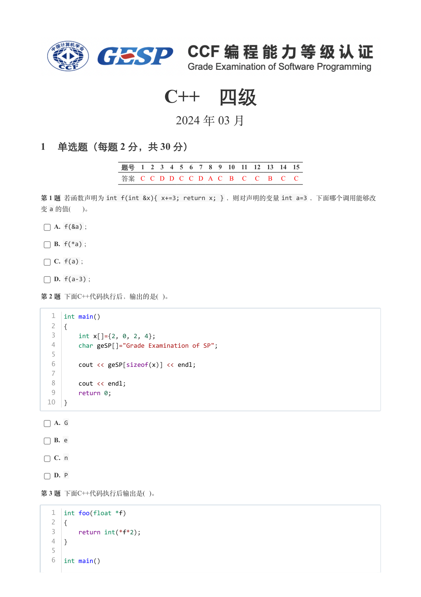
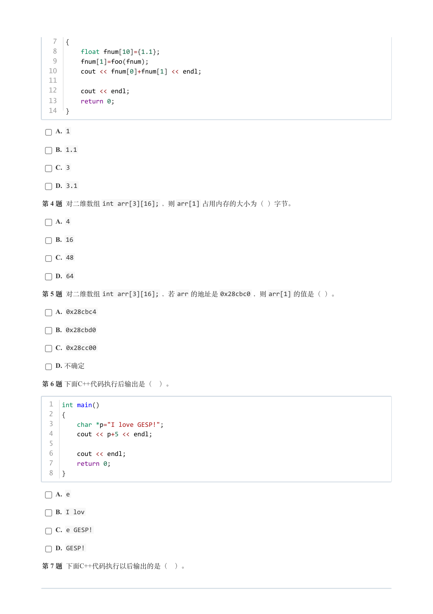
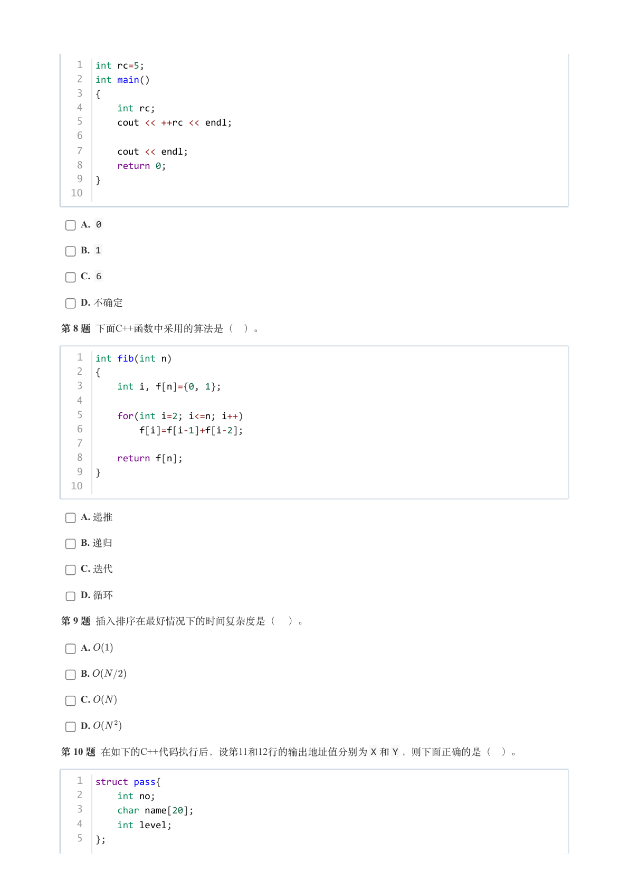
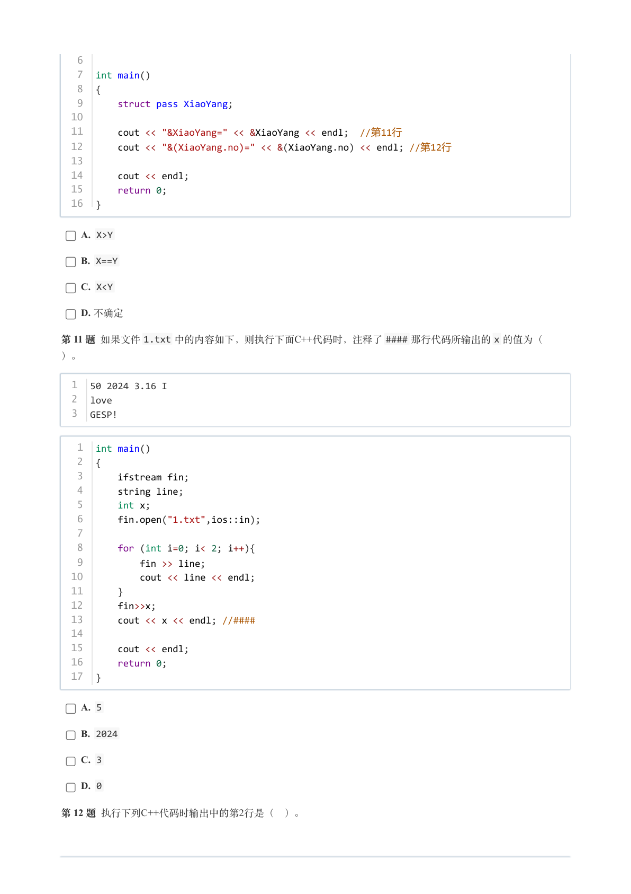
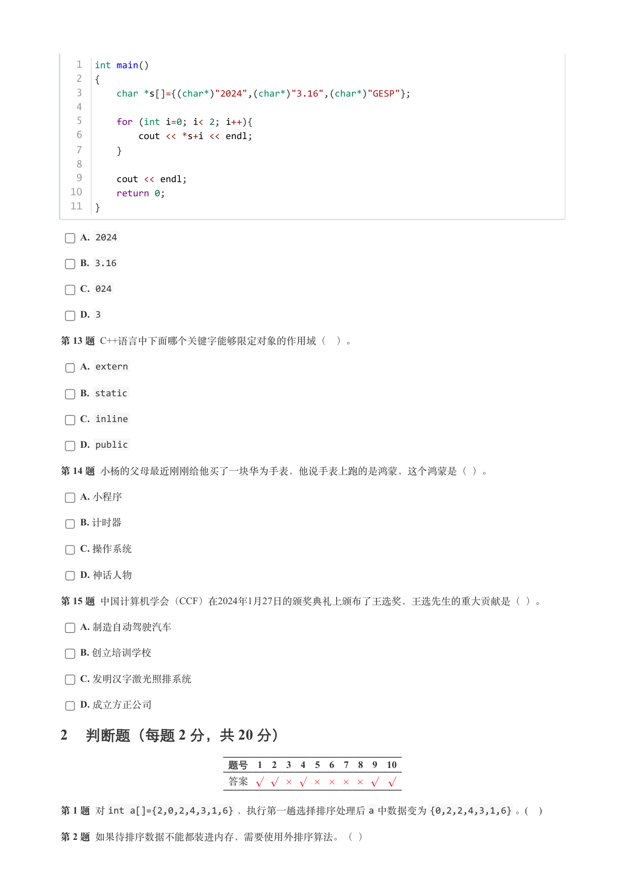
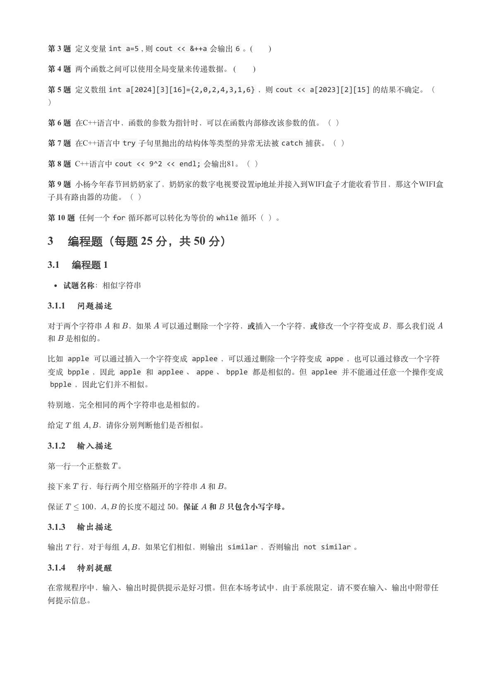
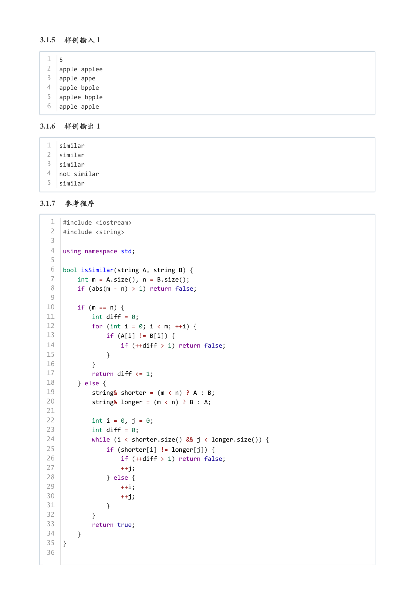
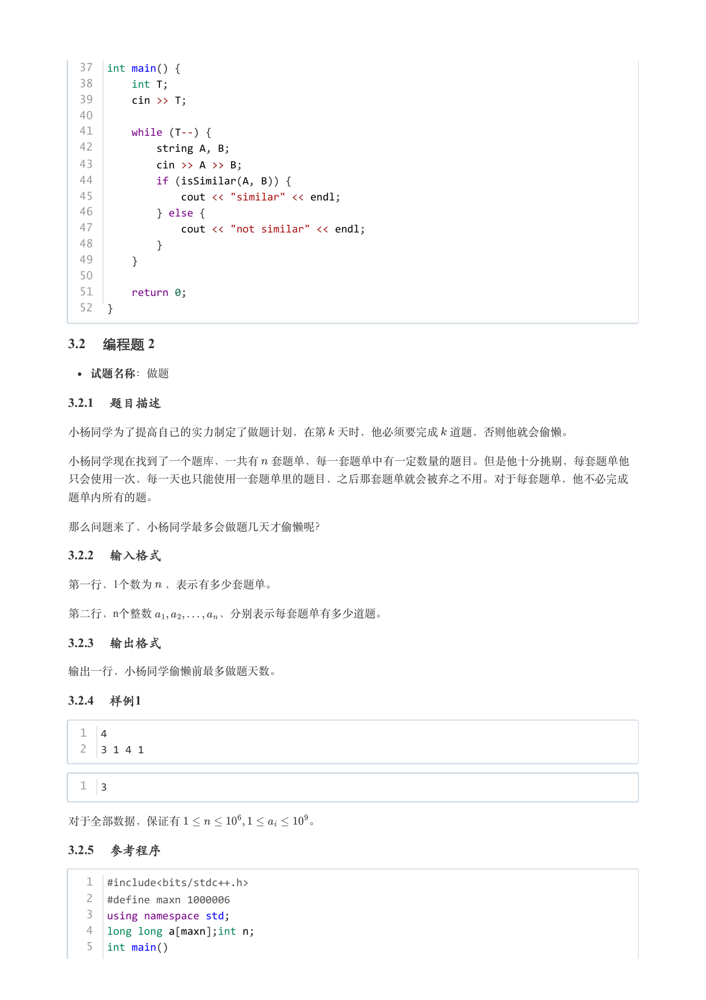
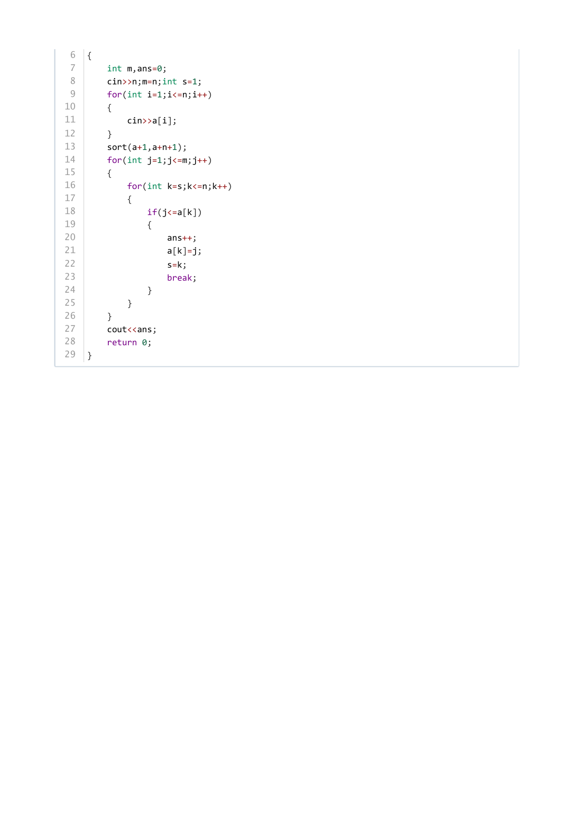

# 2024年3月-C++4级

- 原始 PDF：[`pdfs/2024年3月-C++4级.pdf`](../pdfs/2024年3月-C++4级.pdf)
- 页数：9
- 转换脚本：[`scripts/convert_pdfs_to_markdown.py`](../scripts/convert_pdfs_to_markdown.py)

> 为尽量避免信息丢失，每页均附带页面图片；文本提取结果保留原有顺序与换行特征，个别公式、图形、特殊排版请以页面图片为准。

## 第 1 页



### 提取文本

```
C++　四级

                      2024 年 03 月

1 单选题（每题 2 分，共 30 分）


            题号  1  2  3  4  5  6  7  8  9  10  11  12  13  14  15
            答案 C C D D C C D A C  B  C  C  B  C  C


第 1 题 若函数声明为int f(int &x){ x+=3; return x; } ，则对声明的变量int a=3 ，下面哪个调用能够改
变a 的值(   )。

    A. f(&a) ;

    B. f(*a) ;

    C. f(a) ;

    D. f(a-3) ;

第 2 题 下面C++代码执行后，输出的是( )。


   1  int main()
   2  {
   3      int x[]={2, 0, 2, 4};
   4      char geSP[]="Grade Examination of SP";
   5
   6      cout << geSP[sizeof(x)] << endl;
   7
   8      cout << endl;
   9      return 0;
  10  }


    A. G

    B. e

    C. n

    D. P

第 3 题 下面C++代码执行后输出是( )。


   1  int foo(float *f)
   2  {
   3      return int(*f*2);
   4  }
   5
   6  int main()
```

## 第 2 页



### 提取文本

```
7  {
   8      float fnum[10]={1.1};
   9      fnum[1]=foo(fnum);
  10      cout << fnum[0]+fnum[1] << endl;
  11
  12      cout << endl;
  13      return 0;
  14  }

    A. 1

    B. 1.1

    C. 3

    D. 3.1

第 4 题 对二维数组int arr[3][16]; ，则arr[1] 占用内存的大小为（ ）字节。

    A. 4

    B. 16

    C. 48

    D. 64

第 5 题 对二维数组int arr[3][16]; ，若arr 的地址是0x28cbc0 ，则arr[1] 的值是（ ）。

    A. 0x28cbc4

    B. 0x28cbd0

    C. 0x28cc00

    D. 不确定

第 6 题 下面C++代码执行后输出是（ ）。


  1  int main()
  2  {
  3      char *p="I love GESP!";
  4      cout << p+5 << endl;
  5
  6      cout << endl;
  7      return 0;
  8  }


    A. e

    B. I lov

    C. e GESP!

    D. GESP!

第 7 题 下面C++代码执行以后输出的是（ ）。
```

## 第 3 页



### 提取文本

```
1  int rc=5;
   2  int main()
   3  {
   4      int rc;
   5      cout << ++rc << endl;
   6
   7      cout << endl;
   8      return 0;
   9  }
  10


    A. 0

    B. 1

    C. 6

    D. 不确定

第 8 题 下面C++函数中采用的算法是（ ）。


   1  int fib(int n)
   2  {
   3      int i, f[n]={0, 1};
   4
   5      for(int i=2; i<=n; i++)
   6          f[i]=f[i-1]+f[i-2];
   7
   8      return f[n];
   9  }
  10


    A. 递推

    B. 递归

    C. 迭代

    D. 循环

第 9 题 插入排序在最好情况下的时间复杂度是（ ）。

    A.

    B.

    C.

    D.

第 10 题 在如下的C++代码执行后，设第11和12行的输出地址值分别为X 和Y ，则下面正确的是（ ）。


   1  struct pass{
   2      int no;
   3      char name[20];
   4      int level;
   5  };
```

## 第 4 页



### 提取文本

```
6
   7  int main()
   8  {
   9      struct pass XiaoYang;
  10
  11      cout << "&XiaoYang=" << &XiaoYang << endl;  //第11行
  12      cout << "&(XiaoYang.no)=" << &(XiaoYang.no) << endl; //第12行
  13
  14      cout << endl;
  15      return 0;
  16  }


    A. X>Y

    B. X==Y

    C. X<Y

    D. 不确定

第 11 题 如果文件1.txt 中的内容如下，则执行下面C++代码时，注释了#### 那行代码所输出的x 的值为（

）。


  1  50 2024 3.16 I
  2  love
  3  GESP!


   1  int main()
   2  {
   3      ifstream fin;
   4      string line;
   5      int x;
   6      fin.open("1.txt",ios::in);
   7
   8      for (int i=0; i< 2; i++){
   9          fin >> line;
  10          cout << line << endl;
  11      }
  12      fin>>x;
  13      cout << x << endl; //####
  14
  15      cout << endl;
  16      return 0;
  17  }


    A. 5

    B. 2024

    C. 3

    D. 0

第 12 题 执行下列C++代码时输出中的第2行是（ ）。
```

## 第 5 页



### 提取文本

```
1  int main()
   2  {
   3      char *s[]={(char*)"2024",(char*)"3.16",(char*)"GESP"};
   4
   5      for (int i=0; i< 2; i++){
   6          cout << *s+i << endl;
   7      }
   8
   9      cout << endl;
  10      return 0;
  11  }


    A. 2024

    B. 3.16

    C. 024

    D. 3

第 13 题 C++语言中下面哪个关键字能够限定对象的作用域（ ）。

    A. extern

    B. static

    C. inline

    D. public

第 14 题 小杨的父母最近刚刚给他买了一块华为手表，他说手表上跑的是鸿蒙，这个鸿蒙是（ ）。

    A. 小程序

    B. 计时器

    C. 操作系统

    D. 神话人物

第 15 题 中国计算机学会（CCF）在2024年1月27日的颁奖典礼上颁布了王选奖，王选先生的重大贡献是（ ）。

    A. 制造自动驾驶汽车

    B. 创立培训学校

    C. 发明汉字激光照排系统

    D. 成立方正公司

2 判断题（每题 2 分，共 20 分）

                 题号  1  2  3  4  5  6  7  8  9  10

                 答案


第 1 题 对int a[]={2,0,2,4,3,1,6} ，执行第一趟选择排序处理后a 中数据变为{0,2,2,4,3,1,6} 。(   )

第 2 题 如果待排序数据不能都装进内存，需要使用外排序算法。（ ）
```

## 第 6 页



### 提取文本

```
第 3 题 定义变量int a=5 , 则cout << &++a 会输出6 。(      )

第 4 题 两个函数之间可以使用全局变量来传递数据。 (       )

第 5 题 定义数组int a[2024][3][16]={2,0,2,4,3,1,6} ，则cout << a[2023][2][15] 的结果不确定。（

）

第 6 题 在C++语言中，函数的参数为指针时，可以在函数内部修改该参数的值。（ ）

第 7 题 在C++语言中try 子句里抛出的结构体等类型的异常无法被catch 捕获。（ ）

第 8 题 C++语言中cout << 9^2 << endl; 会输出81。（ ）

第 9 题 小杨今年春节回奶奶家了，奶奶家的数字电视要设置ip地址并接入到WIFI盒子才能收看节目，那这个WIFI盒

子具有路由器的功能。（ ）

第 10 题 任何一个for 循环都可以转化为等价的while 循环（ ）。

3 编程题（每题 25 分，共 50 分）

3.1 编程题 1

  试题名称：相似字符串

3.1.1 问题描述

对于两个字符串 和 ，如果 可以通过删除一个字符，或插入一个字符，或修改一个字符变成 ，那么我们说

和 是相似的。

比如 apple 可以通过插入一个字符变成 applee ，可以通过删除一个字符变成 appe ，也可以通过修改一个字符
变成 bpple ，因此 apple 和 applee 、appe 、bpple 都是相似的。但 applee 并不能通过任意一个操作变成
 bpple ，因此它们并不相似。


特别地，完全相同的两个字符串也是相似的。


给定 组  ，请你分别判断他们是否相似。

3.1.2 输入描述

第一行一个正整数 。


接下来 行，每行两个用空格隔开的字符串 和 。


保证    ，  的长度不超过 。保证 和 只包含小写字母。

3.1.3 输出描述

输出 行，对于每组  ，如果它们相似，则输出 similar ，否则输出 not similar 。

3.1.4 特别提醒

在常规程序中，输入、输出时提供提示是好习惯。但在本场考试中，由于系统限定，请不要在输入、输出中附带任

何提示信息。
```

## 第 7 页



### 提取文本

```
3.1.5 样例输入 1

  1  5
  2  apple applee
  3  apple appe
  4  apple bpple
  5  applee bpple
  6  apple apple

3.1.6 样例输出 1

  1  similar
  2  similar
  3  similar
  4  not similar
  5  similar

3.1.7 参考程序

   1  #include <iostream>
   2  #include <string>
   3
   4  using namespace std;
   5
   6  bool isSimilar(string A, string B) {
   7      int m = A.size(), n = B.size();
   8      if (abs(m - n) > 1) return false;
   9
  10      if (m == n) {
  11          int diff = 0;
  12          for (int i = 0; i < m; ++i) {
  13              if (A[i] != B[i]) {
  14                  if (++diff > 1) return false;
  15              }
  16          }
  17          return diff <= 1;
  18      } else {
  19          string& shorter = (m < n) ? A : B;
  20          string& longer = (m < n) ? B : A;
  21
  22          int i = 0, j = 0;
  23          int diff = 0;
  24          while (i < shorter.size() && j < longer.size()) {
  25              if (shorter[i] != longer[j]) {
  26                  if (++diff > 1) return false;
  27                  ++j;
  28              } else {
  29                  ++i;
  30                  ++j;
  31              }
  32          }
  33          return true;
  34      }
  35  }
  36
```

## 第 8 页



### 提取文本

```
37  int main() {
  38      int T;
  39      cin >> T;
  40
  41      while (T--) {
  42          string A, B;
  43          cin >> A >> B;
  44          if (isSimilar(A, B)) {
  45              cout << "similar" << endl;
  46          } else {
  47              cout << "not similar" << endl;
  48          }
  49      }
  50
  51      return 0;
  52  }

3.2 编程题 2

  试题名称：做题

3.2.1 题目描述

小杨同学为了提高自己的实力制定了做题计划，在第 天时，他必须要完成 道题，否则他就会偷懒。


小杨同学现在找到了一个题库，一共有 套题单，每一套题单中有一定数量的题目。但是他十分挑剔，每套题单他

只会使用一次，每一天也只能使用一套题单里的题目，之后那套题单就会被弃之不用。对于每套题单，他不必完成

题单内所有的题。


那么问题来了，小杨同学最多会做题几天才偷懒呢？

3.2.2 输入格式

第一行，1个数为 ，表示有多少套题单。

第二行，n个整数      ，分别表示每套题单有多少道题。

3.2.3 输出格式

输出一行，小杨同学偷懒前最多做题天数。

3.2.4 样例1

  1  4
  2  3 1 4 1


  1  3


对于全部数据，保证有           。

3.2.5 参考程序

   1  #include<bits/stdc++.h>
   2  #define maxn 1000006
   3  using namespace std;
   4  long long a[maxn];int n;
   5  int main()
```

## 第 9 页



### 提取文本

```
6  {
 7      int m,ans=0;
 8      cin>>n;m=n;int s=1;
 9      for(int i=1;i<=n;i++)
10      {
11          cin>>a[i];
12      }
13      sort(a+1,a+n+1);
14      for(int j=1;j<=m;j++)
15      {
16          for(int k=s;k<=n;k++)
17          {
18              if(j<=a[k])
19              {
20                  ans++;
21                  a[k]=j;
22                  s=k;
23                  break;
24              }
25          }
26      }
27      cout<<ans;
28      return 0;
29  }
```
