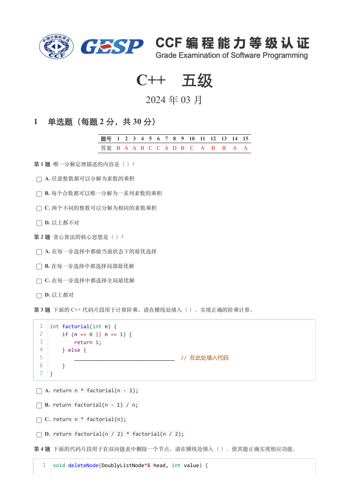
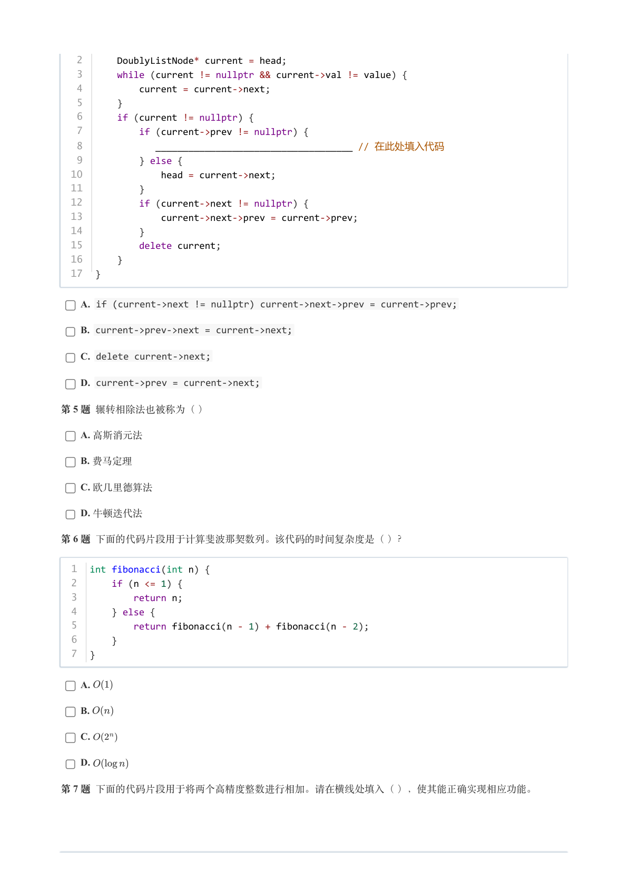
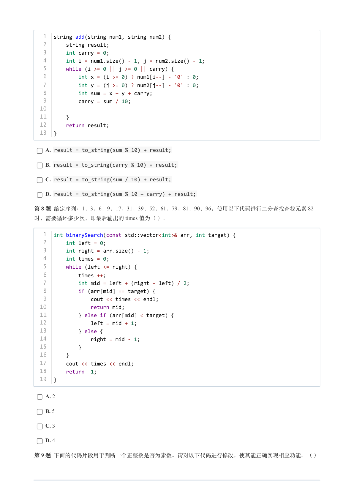
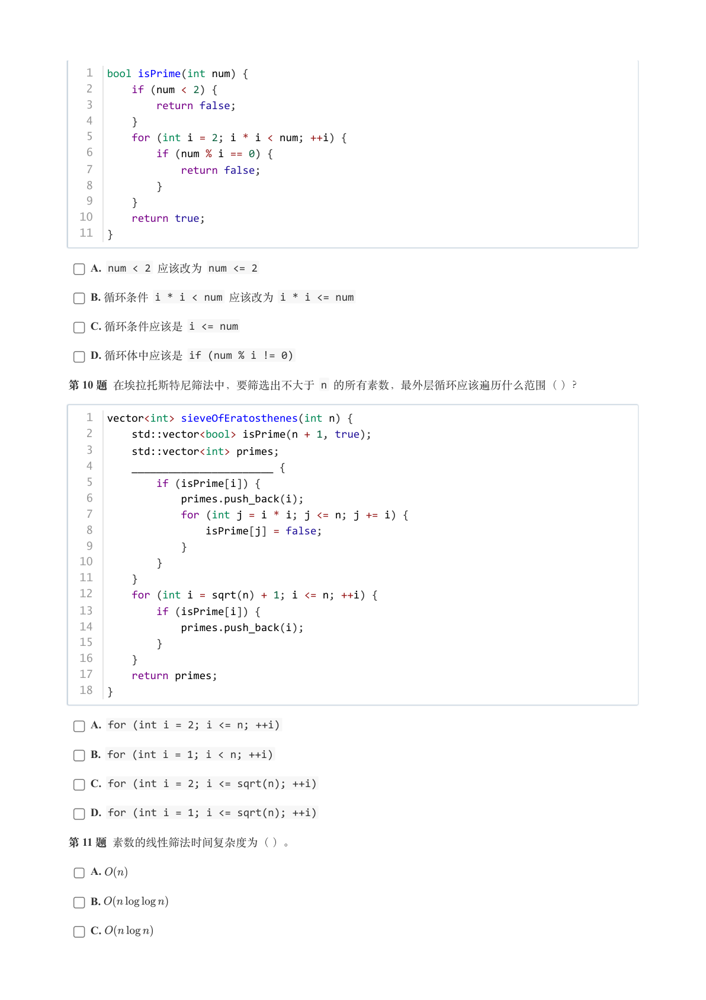
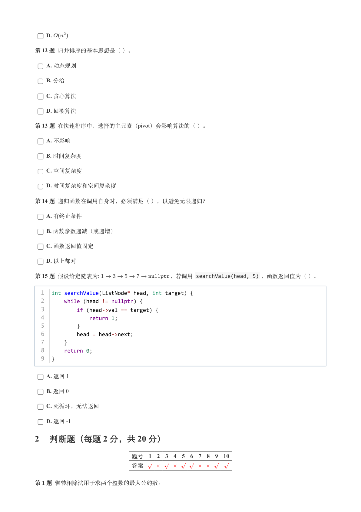
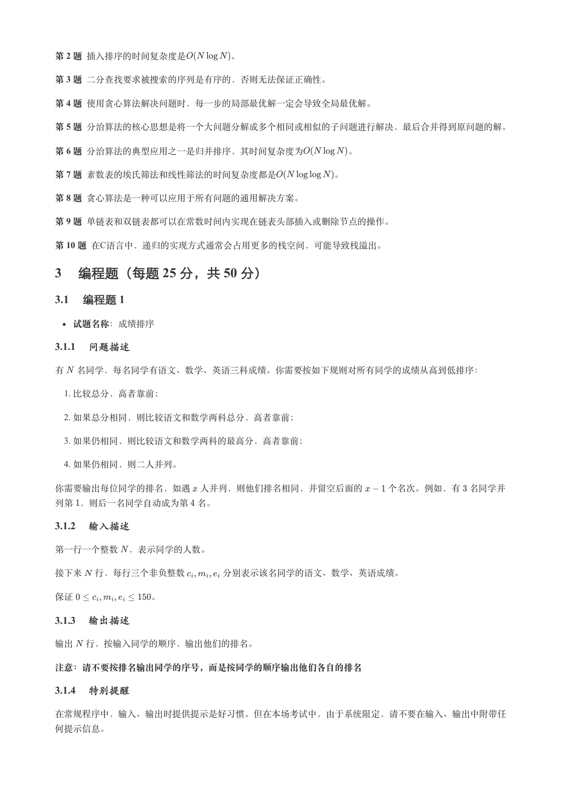
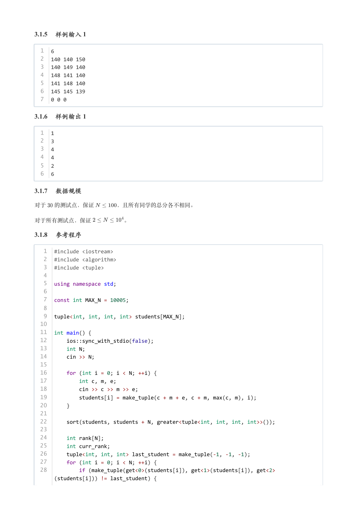
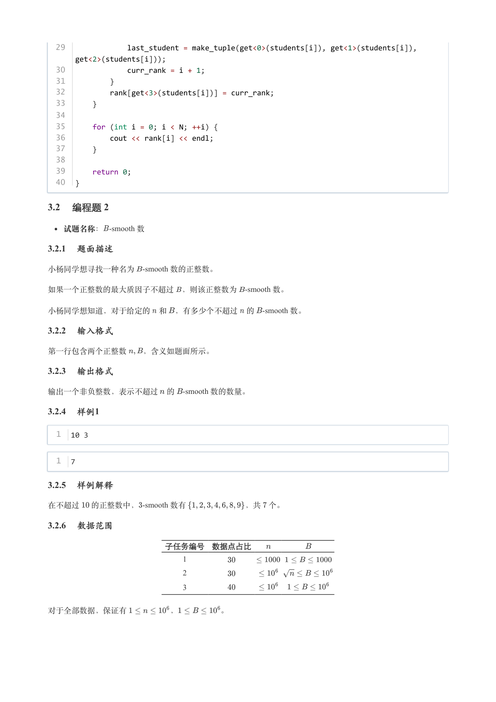
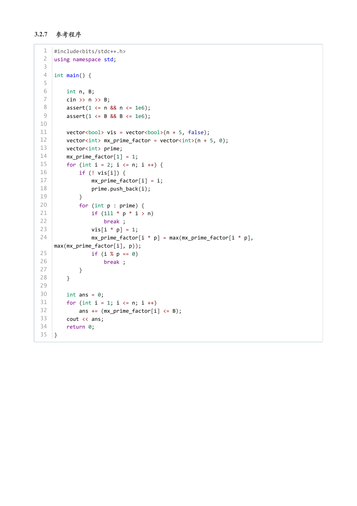

# 2024年3月-C++5级

- 原始 PDF：[`pdfs/2024年3月-C++5级.pdf`](../pdfs/2024年3月-C++5级.pdf)
- 页数：9
- 转换脚本：[`scripts/convert_pdfs_to_markdown.py`](../scripts/convert_pdfs_to_markdown.py)

> 为尽量避免信息丢失，每页均附带页面图片；文本提取结果保留原有顺序与换行特征，个别公式、图形、特殊排版请以页面图片为准。

## 第 1 页



### 提取文本

```
C++　五级

                      2024 年 03 月

1 单选题（每题 2 分，共 30 分）


            题号  1  2  3  4  5  6  7  8  9  10  11  12  13  14  15
            答案 B A A B C C A D B  C  A  B  B  A  A


第 1 题 唯一分解定理描述的内容是（ ）？

    A. 任意整数都可以分解为素数的乘积

    B. 每个合数都可以唯一分解为一系列素数的乘积

    C. 两个不同的整数可以分解为相同的素数乘积

    D. 以上都不对

第 2 题 贪心算法的核心思想是（ ）？

    A. 在每一步选择中都做当前状态下的最优选择

    B. 在每一步选择中都选择局部最优解

    C. 在每一步选择中都选择全局最优解

    D. 以上都对

第 3 题 下面的 C++ 代码片段用于计算阶乘。请在横线处填入（ ），实现正确的阶乘计算。


  1  int factorial(int n) {
  2      if (n == 0 || n == 1) {
  3          return 1;
  4      } else {
  5          _________________________________  // 在此处填入代码
  6      }
  7  }


    A. return n * factorial(n - 1);

    B. return factorial(n - 1) / n;

    C. return n * factorial(n);

    D. return factorial(n / 2) * factorial(n / 2);

第 4 题 下面的代码片段用于在双向链表中删除一个节点。请在横线处填入（ ），使其能正确实现相应功能。


   1  void deleteNode(DoublyListNode*& head, int value) {
```

## 第 2 页



### 提取文本

```
2      DoublyListNode* current = head;
   3      while (current != nullptr && current->val != value) {
   4          current = current->next;
   5      }
   6      if (current != nullptr) {
   7          if (current->prev != nullptr) {
   8             ____________________________________ // 在此处填入代码
   9          } else {
  10              head = current->next;
  11          }
  12          if (current->next != nullptr) {
  13              current->next->prev = current->prev;
  14          }
  15          delete current;
  16      }
  17  }


    A. if (current->next != nullptr) current->next->prev = current->prev;

    B. current->prev->next = current->next;

    C. delete current->next;

    D. current->prev = current->next;

第 5 题 辗转相除法也被称为（ ）

    A. 高斯消元法

    B. 费马定理

    C. 欧几里德算法

    D. 牛顿迭代法

第 6 题 下面的代码片段用于计算斐波那契数列。该代码的时间复杂度是（ ）？


  1  int fibonacci(int n) {
  2      if (n <= 1) {
  3          return n;
  4      } else {
  5          return fibonacci(n - 1) + fibonacci(n - 2);
  6      }
  7  }


    A.

    B.

    C.

    D.

第 7 题 下面的代码片段用于将两个高精度整数进行相加。请在横线处填入（ ），使其能正确实现相应功能。
```

## 第 3 页



### 提取文本

```
1  string add(string num1, string num2) {
   2      string result;
   3      int carry = 0;
   4      int i = num1.size() - 1, j = num2.size() - 1;
   5      while (i >= 0 || j >= 0 || carry) {
   6          int x = (i >= 0) ? num1[i--] - '0' : 0;
   7          int y = (j >= 0) ? num2[j--] - '0' : 0;
   8          int sum = x + y + carry;
   9          carry = sum / 10;
  10          _______________________________________
  11      }
  12      return result;
  13  }


    A. result = to_string(sum % 10) + result;

    B. result = to_string(carry % 10) + result;

    C. result = to_string(sum / 10) + result;

    D. result = to_string(sum % 10 + carry) + result;

第 8 题 给定序列：1，3，6，9，17，31，39，52，61，79，81，90，96。使用以下代码进行二分查找查找元素 82
时，需要循环多少次，即最后输出的 times 值为（ ）。


   1  int binarySearch(const std::vector<int>& arr, int target) {
   2      int left = 0;
   3      int right = arr.size() - 1;
   4      int times = 0;
   5      while (left <= right) {
   6          times ++;
   7          int mid = left + (right - left) / 2;
   8          if (arr[mid] == target) {
   9              cout << times << endl;
  10              return mid;
  11          } else if (arr[mid] < target) {
  12              left = mid + 1;
  13          } else {
  14              right = mid - 1;
  15          }
  16      }
  17      cout << times << endl;
  18      return -1;
  19  }


    A. 2

    B. 5

    C. 3

    D. 4

第 9 题 下面的代码片段用于判断一个正整数是否为素数。请对以下代码进行修改，使其能正确实现相应功能。（ ）
```

## 第 4 页



### 提取文本

```
1  bool isPrime(int num) {
   2      if (num < 2) {
   3          return false;
   4      }
   5      for (int i = 2; i * i < num; ++i) {
   6          if (num % i == 0) {
   7              return false;
   8          }
   9      }
  10      return true;
  11  }


    A. num < 2 应该改为 num <= 2

    B. 循环条件 i * i < num 应该改为 i * i <= num

    C. 循环条件应该是 i <= num

    D. 循环体中应该是 if (num % i != 0)

第 10 题 在埃拉托斯特尼筛法中，要筛选出不大于 n 的所有素数，最外层循环应该遍历什么范围（ ）？


   1  vector<int> sieveOfEratosthenes(int n) {
   2      std::vector<bool> isPrime(n + 1, true);
   3      std::vector<int> primes;
   4      _______________________ {
   5          if (isPrime[i]) {
   6              primes.push_back(i);
   7              for (int j = i * i; j <= n; j += i) {
   8                  isPrime[j] = false;
   9              }
  10          }
  11      }
  12      for (int i = sqrt(n) + 1; i <= n; ++i) {
  13          if (isPrime[i]) {
  14              primes.push_back(i);
  15          }
  16      }
  17      return primes;
  18  }


    A. for (int i = 2; i <= n; ++i)

    B. for (int i = 1; i < n; ++i)

    C. for (int i = 2; i <= sqrt(n); ++i)

    D. for (int i = 1; i <= sqrt(n); ++i)

第 11 题 素数的线性筛法时间复杂度为（ ）。

    A.

    B.

    C.
```

## 第 5 页



### 提取文本

```
D.

第 12 题 归并排序的基本思想是（ ）。

    A. 动态规划

    B. 分治

    C. 贪心算法

    D. 回溯算法

第 13 题 在快速排序中，选择的主元素（pivot）会影响算法的（ ）。

    A. 不影响

    B. 时间复杂度

    C. 空间复杂度

    D. 时间复杂度和空间复杂度

第 14 题 递归函数在调用自身时，必须满足（ ），以避免无限递归？

    A. 有终止条件

    B. 函数参数递减（或递增）

    C. 函数返回值固定

    D. 以上都对

第 15 题 假设给定链表为:            ，若调用 searchValue(head, 5) ，函数返回值为（ ）。


  1  int searchValue(ListNode* head, int target) {
  2      while (head != nullptr) {
  3          if (head->val == target) {
  4              return 1;
  5          }
  6          head = head->next;
  7      }
  8      return 0;
  9  }


    A. 返回 1

    B. 返回 0

    C. 死循环，无法返回

    D. 返回 -1

2 判断题（每题 2 分，共 20 分）

                 题号  1  2  3  4  5  6  7  8  9  10

                 答案


第 1 题 辗转相除法用于求两个整数的最大公约数。
```

## 第 6 页



### 提取文本

```
第 2 题 插入排序的时间复杂度是     。

第 3 题 二分查找要求被搜索的序列是有序的，否则无法保证正确性。

第 4 题 使用贪心算法解决问题时，每一步的局部最优解一定会导致全局最优解。

第 5 题 分治算法的核心思想是将一个大问题分解成多个相同或相似的子问题进行解决，最后合并得到原问题的解。

第 6 题 分治算法的典型应用之一是归并排序，其时间复杂度为     。

第 7 题 素数表的埃氏筛法和线性筛法的时间复杂度都是      。

第 8 题 贪心算法是一种可以应用于所有问题的通用解决方案。

第 9 题 单链表和双链表都可以在常数时间内实现在链表头部插入或删除节点的操作。

第 10 题 在C语言中，递归的实现方式通常会占用更多的栈空间，可能导致栈溢出。

3 编程题（每题 25 分，共 50 分）

3.1 编程题 1


  试题名称：成绩排序

3.1.1 问题描述

有 名同学，每名同学有语文、数学、英语三科成绩。你需要按如下规则对所有同学的成绩从高到低排序：

   1. 比较总分，高者靠前；

   2. 如果总分相同，则比较语文和数学两科总分，高者靠前；

   3. 如果仍相同，则比较语文和数学两科的最高分，高者靠前；

   4. 如果仍相同，则二人并列。


你需要输出每位同学的排名，如遇 人并列，则他们排名相同，并留空后面的   个名次。例如，有 名同学并

列第 ，则后一名同学自动成为第 名。

3.1.2 输入描述

第一行一个整数 ，表示同学的人数。


接下来 行，每行三个非负整数    分别表示该名同学的语文、数学、英语成绩。


保证         。

3.1.3 输出描述

输出 行，按输入同学的顺序，输出他们的排名。


注意：请不要按排名输出同学的序号，而是按同学的顺序输出他们各自的排名

3.1.4 特别提醒

在常规程序中，输入、输出时提供提示是好习惯。但在本场考试中，由于系统限定，请不要在输入、输出中附带任

何提示信息。
```

## 第 7 页



### 提取文本

```
3.1.5 样例输入 1

  1  6
  2  140 140 150
  3  140 149 140
  4  148 141 140
  5  141 148 140
  6  145 145 139
  7  0 0 0

3.1.6 样例输出 1

  1  1
  2  3
  3  4
  4  4
  5  2
  6  6

3.1.7 数据规模

对于  的测试点，保证    ，且所有同学的总分各不相同。


对于所有测试点，保证      。

3.1.8 参考程序

   1  #include <iostream>
   2  #include <algorithm>
   3  #include <tuple>
   4
   5  using namespace std;
   6
   7  const int MAX_N = 10005;
   8
   9  tuple<int, int, int, int> students[MAX_N];
  10
  11  int main() {
  12      ios::sync_with_stdio(false);
  13      int N;
  14      cin >> N;
  15
  16      for (int i = 0; i < N; ++i) {
  17          int c, m, e;
  18          cin >> c >> m >> e;
  19          students[i] = make_tuple(c + m + e, c + m, max(c, m), i);
  20      }
  21
  22      sort(students, students + N, greater<tuple<int, int, int, int>>());
  23
  24      int rank[N];
  25      int curr_rank;
  26      tuple<int, int, int> last_student = make_tuple(-1, -1, -1);
  27      for (int i = 0; i < N; ++i) {
  28          if (make_tuple(get<0>(students[i]), get<1>(students[i]), get<2>
      (students[i])) != last_student) {
```

## 第 8 页



### 提取文本

```
29              last_student = make_tuple(get<0>(students[i]), get<1>(students[i]),
      get<2>(students[i]));
  30              curr_rank = i + 1;
  31          }
  32          rank[get<3>(students[i])] = curr_rank;
  33      }
  34
  35      for (int i = 0; i < N; ++i) {
  36          cout << rank[i] << endl;
  37      }
  38
  39      return 0;
  40  }

3.2 编程题 2

   试题名称：-smooth 数

3.2.1 题面描述

小杨同学想寻找一种名为  -smooth 数的正整数。

如果一个正整数的最大质因子不超过 ，则该正整数为  -smooth 数。

小杨同学想知道，对于给定的 和 ，有多少个不超过 的  -smooth 数。

3.2.2 输入格式

第一行包含两个正整数  ，含义如题面所示。

3.2.3 输出格式

输出一个非负整数，表示不超过 的  -smooth 数的数量。

3.2.4 样例1

  1  10 3


  1  7

3.2.5 样例解释

在不超过  的正整数中，-smooth 数有        ，共 个。

3.2.6 数据范围

               子任务编号 数据点占比

                                  1

                                  2

                                  3


对于全部数据，保证有      ，     。
```

## 第 9 页



### 提取文本

```
3.2.7 参考程序

   1  #include<bits/stdc++.h>
   2  using namespace std;
   3
   4  int main() {
   5
   6      int n, B;
   7      cin >> n >> B;
   8      assert(1 <= n && n <= 1e6);
   9      assert(1 <= B && B <= 1e6);
  10
  11      vector<bool> vis = vector<bool>(n + 5, false);
  12      vector<int> mx_prime_factor = vector<int>(n + 5, 0);
  13      vector<int> prime;
  14      mx_prime_factor[1] = 1;
  15      for (int i = 2; i <= n; i ++) {
  16          if (! vis[i]) {
  17              mx_prime_factor[i] = i;
  18              prime.push_back(i);
  19          }
  20          for (int p : prime) {
  21              if (1ll * p * i > n)
  22                  break ;
  23              vis[i * p] = 1;
  24              mx_prime_factor[i * p] = max(mx_prime_factor[i * p],
      max(mx_prime_factor[i], p));
  25              if (i % p == 0)
  26                  break ;
  27          }
  28      }
  29
  30      int ans = 0;
  31      for (int i = 1; i <= n; i ++)
  32          ans += (mx_prime_factor[i] <= B);
  33      cout << ans;
  34      return 0;
  35  }
```
