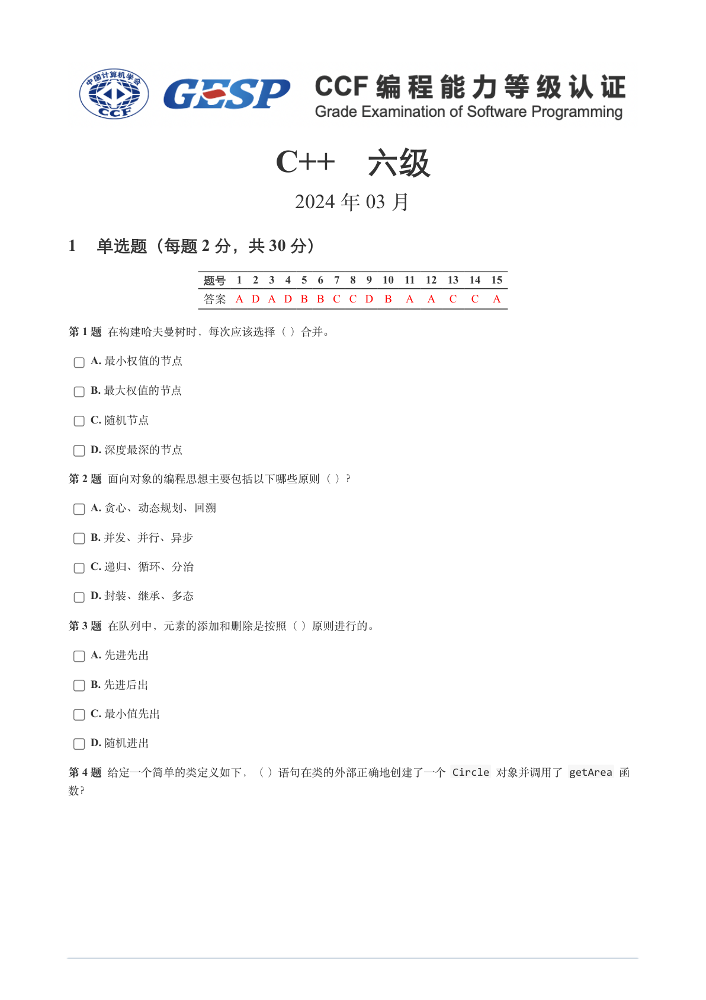
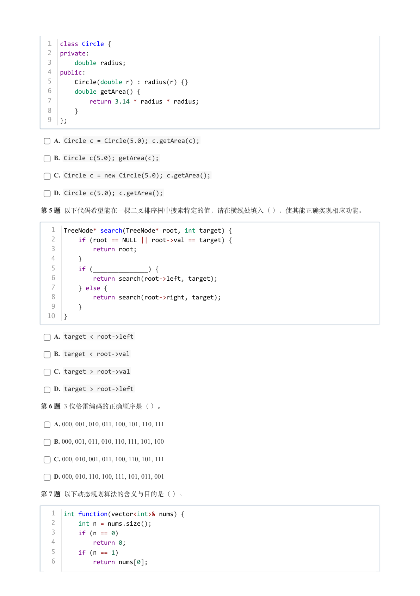
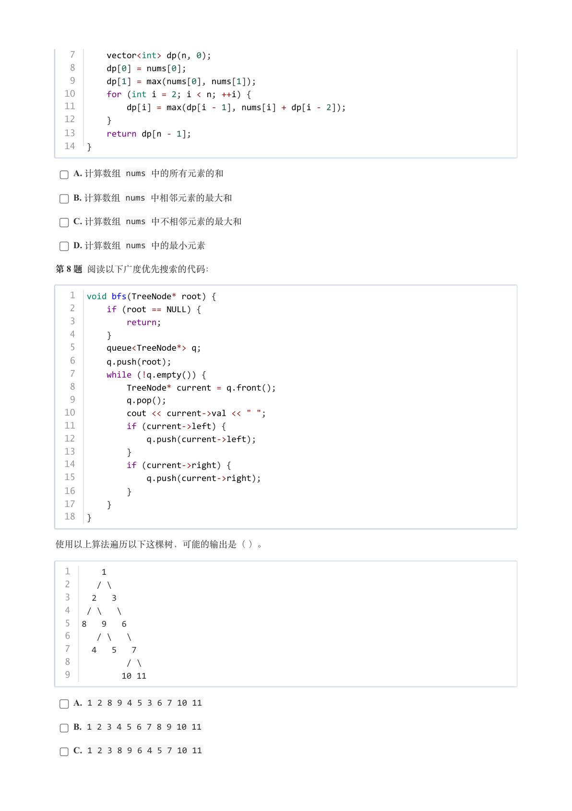
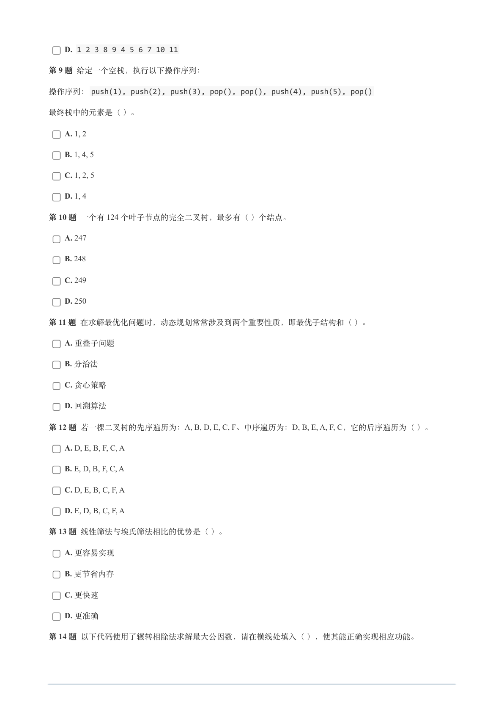
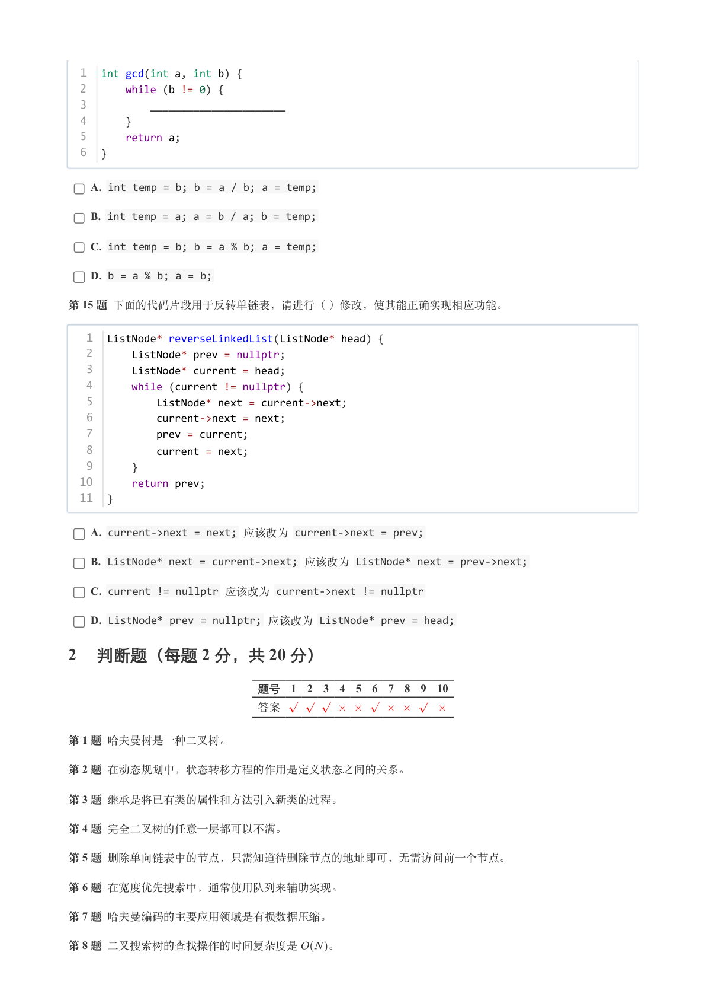
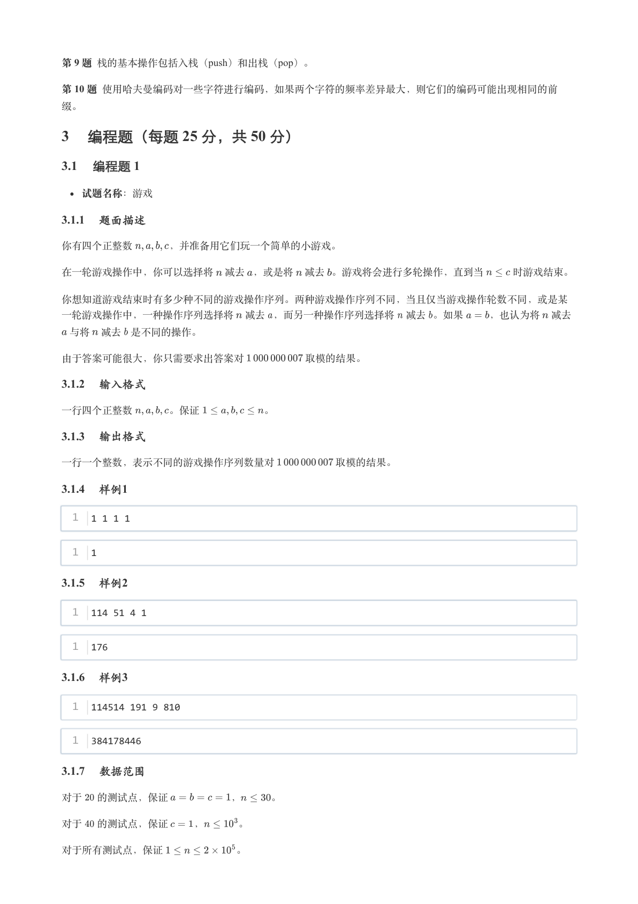
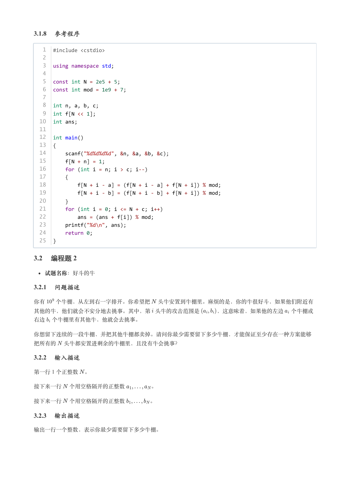
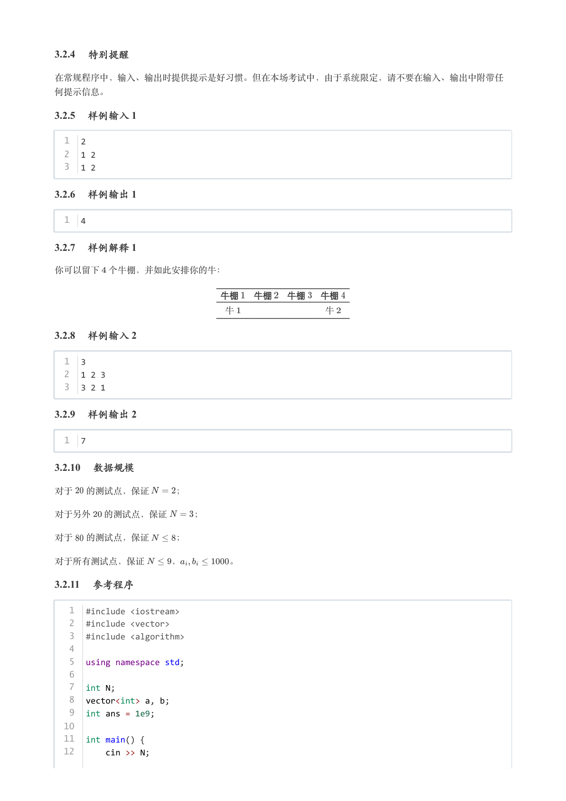
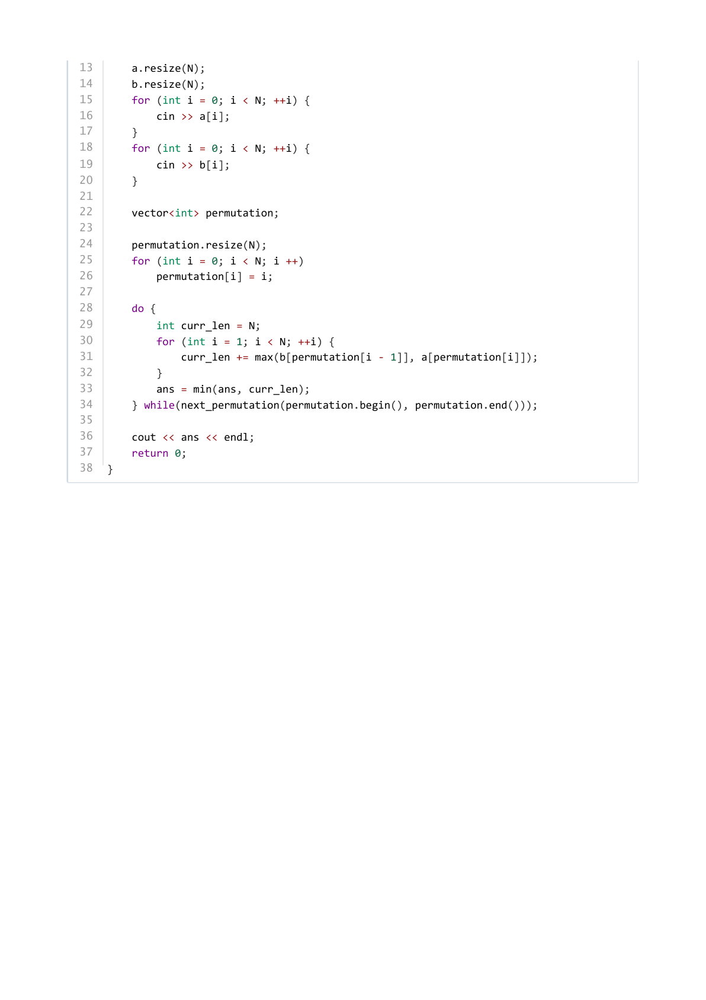

# 2024年3月-C++6级

- 原始 PDF：[`pdfs/2024年3月-C++6级.pdf`](../pdfs/2024年3月-C++6级.pdf)
- 页数：9
- 转换脚本：[`scripts/convert_pdfs_to_markdown.py`](../scripts/convert_pdfs_to_markdown.py)

> 为尽量避免信息丢失，每页均附带页面图片；文本提取结果保留原有顺序与换行特征，个别公式、图形、特殊排版请以页面图片为准。

## 第 1 页



### 提取文本

```
C++　六级

                      2024 年 03 月

1 单选题（每题 2 分，共 30 分）


            题号  1  2  3  4  5  6  7  8  9  10  11  12  13  14  15
            答案 A D A D B B C C D  B  A  A  C  C  A


第 1 题 在构建哈夫曼树时，每次应该选择（ ）合并。

    A. 最小权值的节点

    B. 最大权值的节点

    C. 随机节点

    D. 深度最深的节点

第 2 题 面向对象的编程思想主要包括以下哪些原则（ ）？

    A. 贪心、动态规划、回溯

    B. 并发、并行、异步

    C. 递归、循环、分治

    D. 封装、继承、多态

第 3 题 在队列中，元素的添加和删除是按照（ ）原则进行的。

    A. 先进先出

    B. 先进后出

    C. 最小值先出

    D. 随机进出

第 4 题 给定一个简单的类定义如下，（ ）语句在类的外部正确地创建了一个 Circle 对象并调用了 getArea 函

数？
```

## 第 2 页



### 提取文本

```
1  class Circle {
  2  private:
  3      double radius;
  4  public:
  5      Circle(double r) : radius(r) {}
  6      double getArea() {
  7          return 3.14 * radius * radius;
  8      }
  9  };


    A. Circle c = Circle(5.0); c.getArea(c);

    B. Circle c(5.0); getArea(c);

    C. Circle c = new Circle(5.0); c.getArea();

    D. Circle c(5.0); c.getArea();

第 5 题 以下代码希望能在一棵二叉排序树中搜索特定的值，请在横线处填入（ ），使其能正确实现相应功能。


   1  TreeNode* search(TreeNode* root, int target) {
   2      if (root == NULL || root->val == target) {
   3          return root;
   4      }
   5      if (_______________) {
   6          return search(root->left, target);
   7      } else {
   8          return search(root->right, target);
   9      }
  10  }


    A. target < root->left

    B. target < root->val

    C. target > root->val

    D. target > root->left

第 6 题 3 位格雷编码的正确顺序是（ ）。

    A. 000, 001, 010, 011, 100, 101, 110, 111

    B. 000, 001, 011, 010, 110, 111, 101, 100

    C. 000, 010, 001, 011, 100, 110, 101, 111

    D. 000, 010, 110, 100, 111, 101, 011, 001

第 7 题 以下动态规划算法的含义与目的是（ ）。


   1  int function(vector<int>& nums) {
   2      int n = nums.size();
   3      if (n == 0)
   4          return 0;
   5      if (n == 1)
   6          return nums[0];
```

## 第 3 页



### 提取文本

```
7      vector<int> dp(n, 0);
   8      dp[0] = nums[0];
   9      dp[1] = max(nums[0], nums[1]);
  10      for (int i = 2; i < n; ++i) {
  11          dp[i] = max(dp[i - 1], nums[i] + dp[i - 2]);
  12      }
  13      return dp[n - 1];
  14  }

    A. 计算数组 nums 中的所有元素的和

    B. 计算数组 nums 中相邻元素的最大和

    C. 计算数组 nums 中不相邻元素的最大和

    D. 计算数组 nums 中的最小元素

第 8 题 阅读以下广度优先搜索的代码：


   1  void bfs(TreeNode* root) {
   2      if (root == NULL) {
   3          return;
   4      }
   5      queue<TreeNode*> q;
   6      q.push(root);
   7      while (!q.empty()) {
   8          TreeNode* current = q.front();
   9          q.pop();
  10          cout << current->val << " ";
  11          if (current->left) {
  12              q.push(current->left);
  13          }
  14          if (current->right) {
  15              q.push(current->right);
  16          }
  17      }
  18  }


使用以上算法遍历以下这棵树，可能的输出是（ ）。


  1      1
  2     / \
  3    2   3
  4   / \   \
  5  8   9   6
  6     / \   \
  7    4   5   7
  8           / \
  9          10 11


    A. 1 2 8 9 4 5 3 6 7 10 11

    B. 1 2 3 4 5 6 7 8 9 10 11

    C. 1 2 3 8 9 6 4 5 7 10 11
```

## 第 4 页



### 提取文本

```
D. 1 2 3 8 9 4 5 6 7 10 11

第 9 题 给定一个空栈，执行以下操作序列：

操作序列：push(1), push(2), push(3), pop(), pop(), push(4), push(5), pop()


最终栈中的元素是（ ）。

    A. 1, 2

    B. 1, 4, 5

    C. 1, 2, 5

    D. 1, 4

第 10 题 一个有 124 个叶子节点的完全二叉树，最多有（ ）个结点。

    A. 247

    B. 248

    C. 249

    D. 250

第 11 题 在求解最优化问题时，动态规划常常涉及到两个重要性质，即最优子结构和（ ）。

    A. 重叠子问题

    B. 分治法

    C. 贪心策略

    D. 回溯算法

第 12 题 若一棵二叉树的先序遍历为：A, B, D, E, C, F、中序遍历为：D, B, E, A, F, C，它的后序遍历为（ ）。

    A. D, E, B, F, C, A

    B. E, D, B, F, C, A

    C. D, E, B, C, F, A

    D. E, D, B, C, F, A

第 13 题 线性筛法与埃氏筛法相比的优势是（ ）。

    A. 更容易实现

    B. 更节省内存

    C. 更快速

    D. 更准确

第 14 题 以下代码使用了辗转相除法求解最大公因数，请在横线处填入（ ），使其能正确实现相应功能。
```

## 第 5 页



### 提取文本

```
1  int gcd(int a, int b) {
  2      while (b != 0) {
  3          ______________________
  4      }
  5      return a;
  6  }


    A. int temp = b; b = a / b; a = temp;

    B. int temp = a; a = b / a; b = temp;

    C. int temp = b; b = a % b; a = temp;

    D. b = a % b; a = b;

第 15 题 下面的代码片段用于反转单链表，请进行（ ）修改，使其能正确实现相应功能。


   1  ListNode* reverseLinkedList(ListNode* head) {
   2      ListNode* prev = nullptr;
   3      ListNode* current = head;
   4      while (current != nullptr) {
   5          ListNode* next = current->next;
   6          current->next = next;
   7          prev = current;
   8          current = next;
   9      }
  10      return prev;
  11  }


    A. current->next = next; 应该改为 current->next = prev;

    B. ListNode* next = current->next; 应该改为 ListNode* next = prev->next;

    C. current != nullptr 应该改为 current->next != nullptr

    D. ListNode* prev = nullptr; 应该改为 ListNode* prev = head;

2 判断题（每题 2 分，共 20 分）

                 题号  1  2  3  4  5  6  7  8  9  10

                 答案


第 1 题 哈夫曼树是一种二叉树。

第 2 题 在动态规划中，状态转移方程的作用是定义状态之间的关系。

第 3 题 继承是将已有类的属性和方法引入新类的过程。

第 4 题 完全二叉树的任意一层都可以不满。

第 5 题 删除单向链表中的节点，只需知道待删除节点的地址即可，无需访问前一个节点。

第 6 题 在宽度优先搜索中，通常使用队列来辅助实现。

第 7 题 哈夫曼编码的主要应用领域是有损数据压缩。

第 8 题 二叉搜索树的查找操作的时间复杂度是   。
```

## 第 6 页



### 提取文本

```
第 9 题 栈的基本操作包括入栈（push）和出栈（pop）。

第 10 题 使用哈夫曼编码对一些字符进行编码，如果两个字符的频率差异最大，则它们的编码可能出现相同的前

缀。

3 编程题（每题 25 分，共 50 分）

3.1 编程题 1


  试题名称：游戏

3.1.1 题面描述

你有四个正整数    ，并准备用它们玩一个简单的小游戏。


在一轮游戏操作中，你可以选择将 减去 ，或是将 减去 。游戏将会进行多轮操作，直到当   时游戏结束。


你想知道游戏结束时有多少种不同的游戏操作序列。两种游戏操作序列不同，当且仅当游戏操作轮数不同，或是某

一轮游戏操作中，一种操作序列选择将 减去 ，而另一种操作序列选择将 减去 。如果   ，也认为将 减去

 与将 减去 是不同的操作。


由于答案可能很大，你只需要求出答案对      取模的结果。

3.1.2 输入格式

一行四个正整数    。保证      。

3.1.3 输出格式

一行一个整数，表示不同的游戏操作序列数量对      取模的结果。

3.1.4 样例1

  1  1 1 1 1


  1  1

3.1.5 样例2

  1  114 51 4 1


  1  176

3.1.6 样例3

  1  114514 191 9 810


  1  384178446

3.1.7 数据范围

对于  的测试点，保证      ，   。


对于  的测试点，保证   ，   。


对于所有测试点，保证       。
```

## 第 7 页



### 提取文本

```
3.1.8 参考程序

   1  #include <cstdio>
   2
   3  using namespace std;
   4
   5  const int N = 2e5 + 5;
   6  const int mod = 1e9 + 7;
   7
   8  int n, a, b, c;
   9  int f[N << 1];
  10  int ans;
  11
  12  int main()
  13  {
  14      scanf("%d%d%d%d", &n, &a, &b, &c);
  15      f[N + n] = 1;
  16      for (int i = n; i > c; i--)
  17      {
  18          f[N + i - a] = (f[N + i - a] + f[N + i]) % mod;
  19          f[N + i - b] = (f[N + i - b] + f[N + i]) % mod;
  20      }
  21      for (int i = 0; i <= N + c; i++)
  22          ans = (ans + f[i]) % mod;
  23      printf("%d\n", ans);
  24      return 0;
  25  }

3.2 编程题 2


  试题名称：好斗的牛

3.2.1 问题描述

你有  个牛棚，从左到右一字排开。你希望把 头牛安置到牛棚里。麻烦的是，你的牛很好斗，如果他们附近有

其他的牛，他们就会不安分地去挑事。其中，第 头牛的攻击范围是   ，这意味着，如果他的左边 个牛棚或

右边 个牛棚里有其他牛，他就会去挑事。


你想留下连续的一段牛棚，并把其他牛棚都卖掉。请问你最少需要留下多少牛棚，才能保证至少存在一种方案能够

把所有的 头牛都安置进剩余的牛棚里，且没有牛会挑事？

3.2.2 输入描述

第一行 1 个正整数 。


接下来一行 个用空格隔开的正整数     。


接下来一行 个用空格隔开的正整数     。

3.2.3 输出描述

输出一行一个整数，表示你最少需要留下多少牛棚。
```

## 第 8 页



### 提取文本

```
3.2.4 特别提醒

在常规程序中，输入、输出时提供提示是好习惯。但在本场考试中，由于系统限定，请不要在输入、输出中附带任

何提示信息。

3.2.5 样例输入 1

  1  2
  2  1 2
  3  1 2

3.2.6 样例输出 1

  1  4

3.2.7 样例解释 1

你可以留下 个牛棚，并如此安排你的牛：


                  牛棚  牛棚  牛棚  牛棚

                   牛          牛

3.2.8 样例输入 2

  1  3
  2  1 2 3
  3  3 2 1

3.2.9 样例输出 2

  1  7

3.2.10 数据规模

对于  的测试点，保证   ；


对于另外  的测试点，保证   ；


对于  的测试点，保证   ；


对于所有测试点，保证   ，     。

3.2.11 参考程序

   1  #include <iostream>
   2  #include <vector>
   3  #include <algorithm>
   4
   5  using namespace std;
   6
   7  int N;
   8  vector<int> a, b;
   9  int ans = 1e9;
  10
  11  int main() {
  12      cin >> N;
```

## 第 9 页



### 提取文本

```
13      a.resize(N);
14      b.resize(N);
15      for (int i = 0; i < N; ++i) {
16          cin >> a[i];
17      }
18      for (int i = 0; i < N; ++i) {
19          cin >> b[i];
20      }
21
22      vector<int> permutation;
23
24      permutation.resize(N);
25      for (int i = 0; i < N; i ++)
26          permutation[i] = i;
27
28      do {
29          int curr_len = N;
30          for (int i = 1; i < N; ++i) {
31              curr_len += max(b[permutation[i - 1]], a[permutation[i]]);
32          }
33          ans = min(ans, curr_len);
34      } while(next_permutation(permutation.begin(), permutation.end()));
35
36      cout << ans << endl;
37      return 0;
38  }
```
