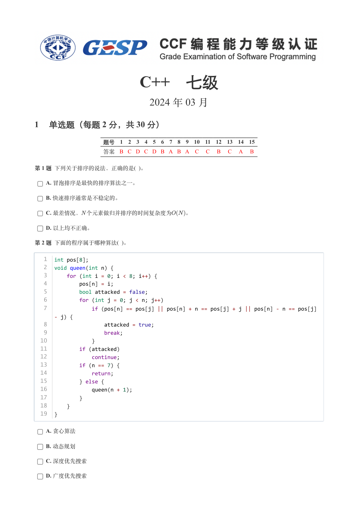
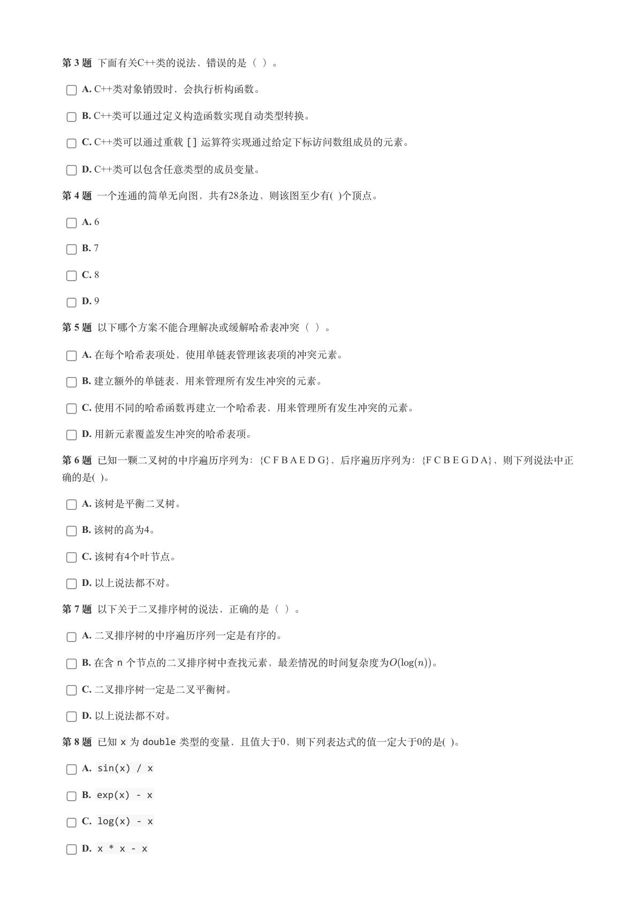
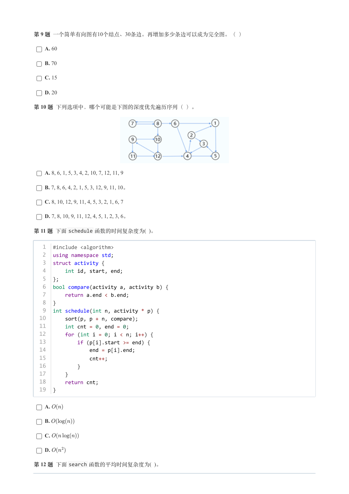
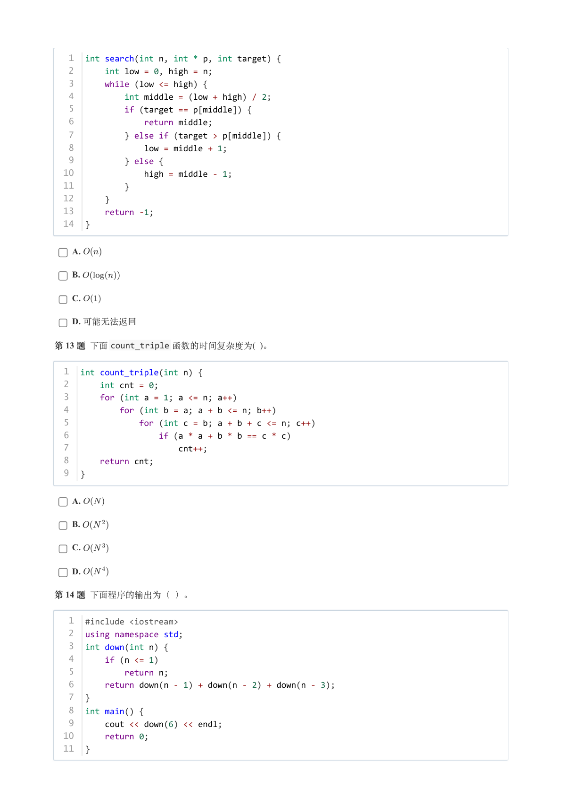
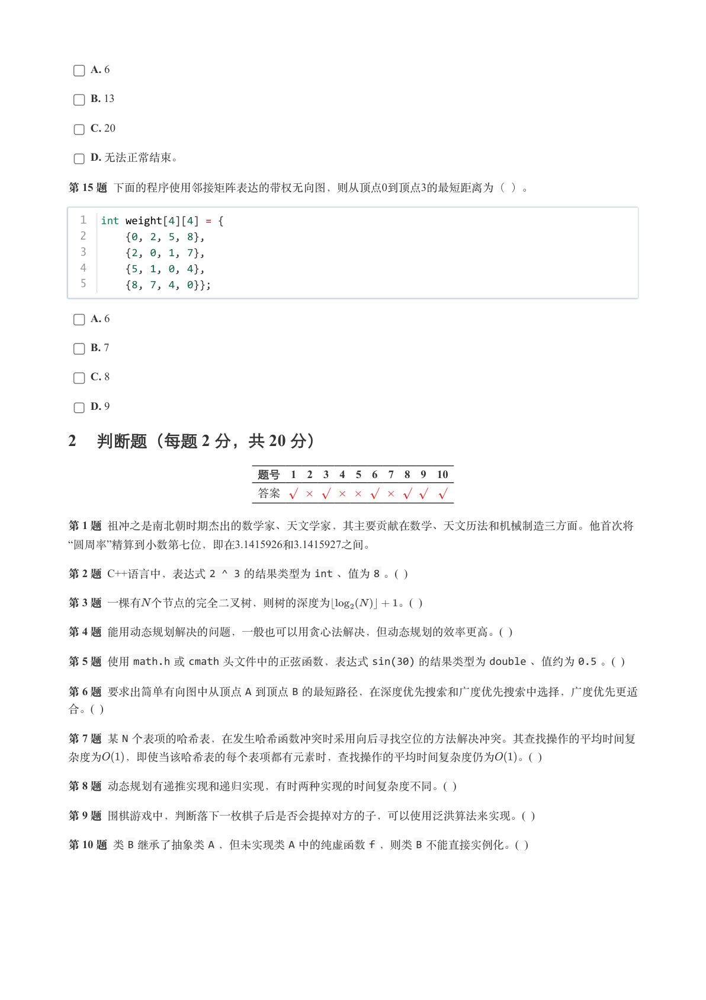
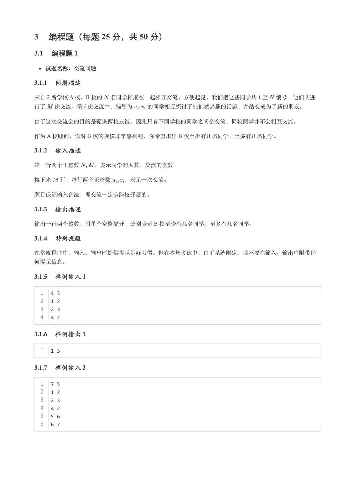
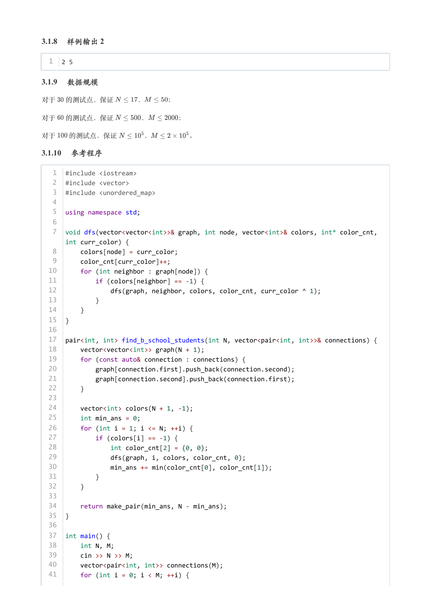
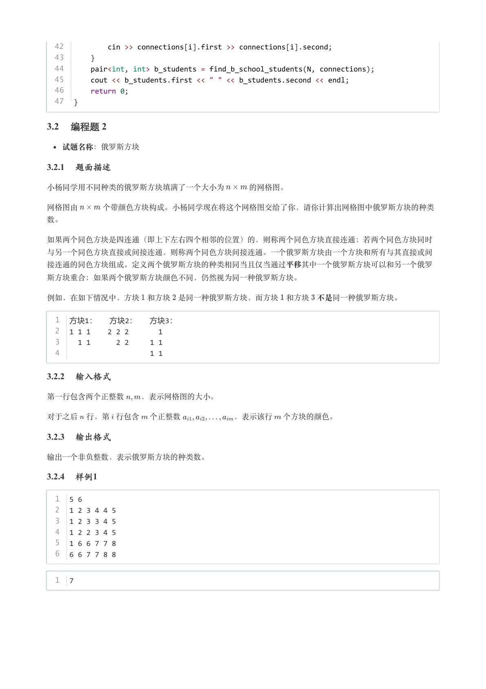
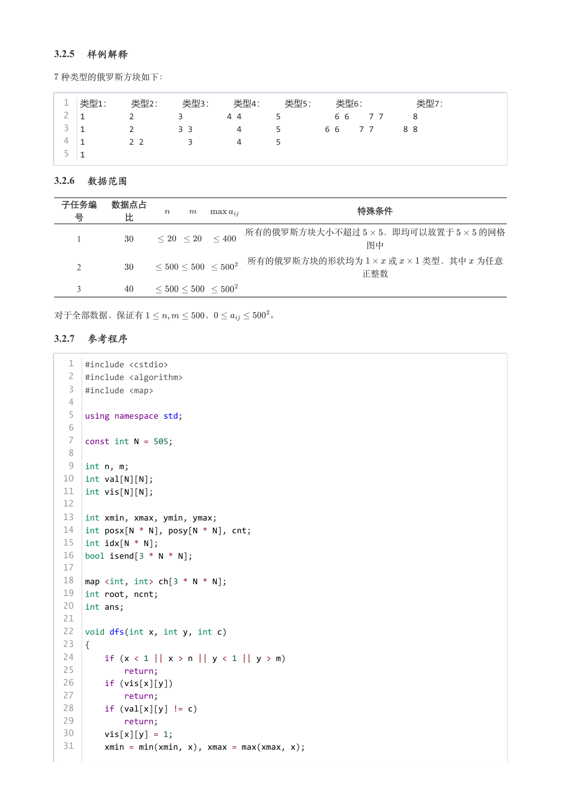
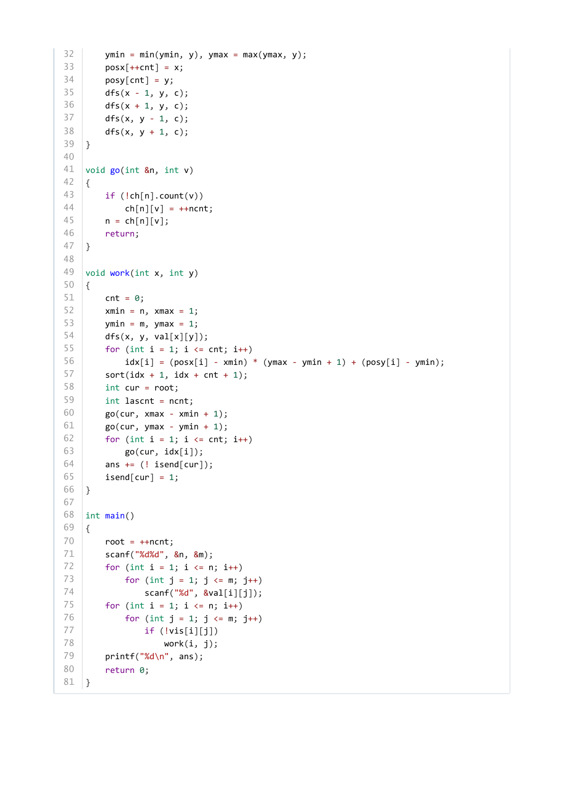

# 2024年3月-C++7级

- 原始 PDF：[`pdfs/2024年3月-C++7级.pdf`](../pdfs/2024年3月-C++7级.pdf)
- 页数：10
- 转换脚本：[`scripts/convert_pdfs_to_markdown.py`](../scripts/convert_pdfs_to_markdown.py)

> 为尽量避免信息丢失，每页均附带页面图片；文本提取结果保留原有顺序与换行特征，个别公式、图形、特殊排版请以页面图片为准。

## 第 1 页



### 提取文本

```
C++　七级

                      2024 年 03 月

1 单选题（每题 2 分，共 30 分）


            题号  1  2  3  4  5  6  7  8  9  10  11  12  13  14  15
            答案 B C D C D B A B A  C  C  B  C  A  B


第 1 题 下列关于排序的说法，正确的是( )。

    A. 冒泡排序是最快的排序算法之一。

    B. 快速排序通常是不稳定的。

    C. 最差情况， 个元素做归并排序的时间复杂度为  。

    D. 以上均不正确。

第 2 题 下面的程序属于哪种算法( )。


   1  int pos[8];
   2  void queen(int n) {
   3      for (int i = 0; i < 8; i++) {
   4          pos[n] = i;
   5          bool attacked = false;
   6          for (int j = 0; j < n; j++)
   7              if (pos[n] == pos[j] || pos[n] + n == pos[j] + j || pos[n] - n == pos[j]
      - j) {
   8                  attacked = true;
   9                  break;
  10              }
  11          if (attacked)
  12              continue;
  13          if (n == 7) {
  14              return;
  15          } else {
  16              queen(n + 1);
  17          }
  18      }
  19  }


    A. 贪心算法

    B. 动态规划

    C. 深度优先搜索

    D. 广度优先搜索
```

## 第 2 页



### 提取文本

```
第 3 题 下面有关C++类的说法，错误的是（ ）。

    A. C++类对象销毁时，会执行析构函数。

    B. C++类可以通过定义构造函数实现自动类型转换。

    C. C++类可以通过重载[] 运算符实现通过给定下标访问数组成员的元素。

    D. C++类可以包含任意类型的成员变量。

第 4 题 一个连通的简单无向图，共有28条边，则该图至少有( )个顶点。

    A. 6

    B. 7

    C. 8

    D. 9

第 5 题 以下哪个方案不能合理解决或缓解哈希表冲突（ ）。

    A. 在每个哈希表项处，使用单链表管理该表项的冲突元素。

    B. 建立额外的单链表，用来管理所有发生冲突的元素。

    C. 使用不同的哈希函数再建立一个哈希表，用来管理所有发生冲突的元素。

    D. 用新元素覆盖发生冲突的哈希表项。

第 6 题 已知一颗二叉树的中序遍历序列为：{C F B A E D G}，后序遍历序列为：{F C B E G D A}，则下列说法中正
确的是( )。

    A. 该树是平衡二叉树。

    B. 该树的高为4。

    C. 该树有4个叶节点。

    D. 以上说法都不对。

第 7 题 以下关于二叉排序树的说法，正确的是（ ）。

    A. 二叉排序树的中序遍历序列一定是有序的。

    B. 在含n 个节点的二叉排序树中查找元素，最差情况的时间复杂度为    。

    C. 二叉排序树一定是二叉平衡树。

    D. 以上说法都不对。

第 8 题 已知x 为double 类型的变量，且值大于0，则下列表达式的值一定大于0的是( )。

    A. sin(x) / x

    B. exp(x) - x

    C. log(x) - x

    D. x * x - x
```

## 第 3 页



### 提取文本

```
第 9 题 一个简单有向图有10个结点、30条边。再增加多少条边可以成为完全图。（ ）

    A. 60

    B. 70

    C. 15

    D. 20

第 10 题 下列选项中，哪个可能是下图的深度优先遍历序列（ ）。


    A. 8, 6, 1, 5, 3, 4, 2, 10, 7, 12, 11, 9

    B. 7, 8, 6, 4, 2, 1, 5, 3, 12, 9, 11, 10。

    C. 8, 10, 12, 9, 11, 4, 5, 3, 2, 1, 6, 7

    D. 7, 8, 10, 9, 11, 12, 4, 5, 1, 2, 3, 6。

第 11 题 下面schedule 函数的时间复杂度为( )。


   1  #include <algorithm>
   2  using namespace std;
   3  struct activity {
   4      int id, start, end;
   5  };
   6  bool compare(activity a, activity b) {
   7      return a.end < b.end;
   8  }
   9  int schedule(int n, activity * p) {
  10      sort(p, p + n, compare);
  11      int cnt = 0, end = 0;
  12      for (int i = 0; i < n; i++) {
  13          if (p[i].start >= end) {
  14              end = p[i].end;
  15              cnt++;
  16          }
  17      }
  18      return cnt;
  19  }


    A.

    B.

    C.

    D.

第 12 题 下面search 函数的平均时间复杂度为( )。
```

## 第 4 页



### 提取文本

```
1  int search(int n, int * p, int target) {
   2      int low = 0, high = n;
   3      while (low <= high) {
   4          int middle = (low + high) / 2;
   5          if (target == p[middle]) {
   6              return middle;
   7          } else if (target > p[middle]) {
   8              low = middle + 1;
   9          } else {
  10              high = middle - 1;
  11          }
  12      }
  13      return -1;
  14  }


    A.

    B.

    C.

    D. 可能无法返回

第 13 题 下面count_triple 函数的时间复杂度为( )。


  1  int count_triple(int n) {
  2      int cnt = 0;
  3      for (int a = 1; a <= n; a++)
  4          for (int b = a; a + b <= n; b++)
  5              for (int c = b; a + b + c <= n; c++)
  6                  if (a * a + b * b == c * c)
  7                      cnt++;
  8      return cnt;
  9  }


    A.

    B.

    C.

    D.

第 14 题 下面程序的输出为（ ）。


   1  #include <iostream>
   2  using namespace std;
   3  int down(int n) {
   4      if (n <= 1)
   5          return n;
   6      return down(n - 1) + down(n - 2) + down(n - 3);
   7  }
   8  int main() {
   9      cout << down(6) << endl;
  10      return 0;
  11  }
```

## 第 5 页



### 提取文本

```
A. 6

    B. 13

    C. 20

    D. 无法正常结束。

第 15 题 下面的程序使用邻接矩阵表达的带权无向图，则从顶点0到顶点3的最短距离为（ ）。


  1  int weight[4][4] = {
  2      {0, 2, 5, 8},
  3      {2, 0, 1, 7},
  4      {5, 1, 0, 4},
  5      {8, 7, 4, 0}};


    A. 6

    B. 7

    C. 8

    D. 9

2 判断题（每题 2 分，共 20 分）

                 题号  1  2  3  4  5  6  7  8  9  10

                 答案


第 1 题 祖冲之是南北朝时期杰出的数学家、天文学家，其主要贡献在数学、天文历法和机械制造三方面。他首次将
“圆周率”精算到小数第七位，即在3.1415926和3.1415927之间。

第 2 题 C++语言中，表达式2 ^ 3 的结果类型为int 、值为8 。(  )

第 3 题 一棵有 个节点的完全二叉树，则树的深度为         。(  )

第 4 题 能用动态规划解决的问题，一般也可以用贪心法解决，但动态规划的效率更高。(  )

第 5 题 使用math.h 或cmath 头文件中的正弦函数，表达式sin(30) 的结果类型为double 、值约为0.5 。(  )

第 6 题 要求出简单有向图中从顶点A 到顶点B 的最短路径，在深度优先搜索和广度优先搜索中选择，广度优先更适
合。(  )

第 7 题 某N 个表项的哈希表，在发生哈希函数冲突时采用向后寻找空位的方法解决冲突。其查找操作的平均时间复
杂度为  ，即使当该哈希表的每个表项都有元素时，查找操作的平均时间复杂度仍为   。(  )

第 8 题 动态规划有递推实现和递归实现，有时两种实现的时间复杂度不同。(  )

第 9 题 围棋游戏中，判断落下一枚棋子后是否会提掉对方的子，可以使用泛洪算法来实现。(  )

第 10 题 类B 继承了抽象类A ，但未实现类A 中的纯虚函数f ，则类B 不能直接实例化。(  )
```

## 第 6 页



### 提取文本

```
3 编程题（每题 25 分，共 50 分）

3.1 编程题 1


  试题名称：交流问题

3.1.1 问题描述

来自 2 所学校 A 校、B 校的 名同学相聚在一起相互交流，方便起见，我们把这些同学从 至 编号。他们共进

行了  次交流，第 次交流中，编号为   的同学相互探讨了他们感兴趣的话题，并结交成为了新的朋友。


由于这次交流会的目的是促进两校友谊，因此只有不同学校的同学之间会交流，同校同学并不会相互交流。

作为 A 校顾问，你对 B 校的规模非常感兴趣，你希望求出 B 校至少有几名同学、至多有几名同学。

3.1.2 输入描述

第一行两个正整数   ，表示同学的人数，交流的次数。


接下来  行，每行两个正整数  ，表示一次交流。


题目保证输入合法，即交流一定是跨校开展的。

3.1.3 输出描述

输出一行两个整数，用单个空格隔开，分别表示 B 校至少有几名同学、至多有几名同学。

3.1.4 特别提醒

在常规程序中，输入、输出时提供提示是好习惯。但在本场考试中，由于系统限定，请不要在输入、输出中附带任

何提示信息。

3.1.5 样例输入 1

  1  4 3
  2  1 2
  3  2 3
  4  4 2

3.1.6 样例输出 1

  1  1 3

3.1.7 样例输入 2

  1  7 5
  2  1 2
  3  2 3
  4  4 2
  5  5 6
  6  6 7
```

## 第 7 页



### 提取文本

```
3.1.8 样例输出 2

  1  2 5

3.1.9 数据规模

对于  的测试点，保证    ，   ；


对于  的测试点，保证    ，    ；


对于  的测试点，保证    ，      。

3.1.10 参考程序

   1  #include <iostream>
   2  #include <vector>
   3  #include <unordered_map>
   4
   5  using namespace std;
   6
   7  void dfs(vector<vector<int>>& graph, int node, vector<int>& colors, int* color_cnt,
      int curr_color) {
   8      colors[node] = curr_color;
   9      color_cnt[curr_color]++;
  10      for (int neighbor : graph[node]) {
  11          if (colors[neighbor] == -1) {
  12              dfs(graph, neighbor, colors, color_cnt, curr_color ^ 1);
  13          }
  14      }
  15  }
  16
  17  pair<int, int> find_b_school_students(int N, vector<pair<int, int>>& connections) {
  18      vector<vector<int>> graph(N + 1);
  19      for (const auto& connection : connections) {
  20          graph[connection.first].push_back(connection.second);
  21          graph[connection.second].push_back(connection.first);
  22      }
  23
  24      vector<int> colors(N + 1, -1);
  25      int min_ans = 0;
  26      for (int i = 1; i <= N; ++i) {
  27          if (colors[i] == -1) {
  28              int color_cnt[2] = {0, 0};
  29              dfs(graph, i, colors, color_cnt, 0);
  30              min_ans += min(color_cnt[0], color_cnt[1]);
  31          }
  32      }
  33
  34      return make_pair(min_ans, N - min_ans);
  35  }
  36
  37  int main() {
  38      int N, M;
  39      cin >> N >> M;
  40      vector<pair<int, int>> connections(M);
  41      for (int i = 0; i < M; ++i) {
```

## 第 8 页



### 提取文本

```
42          cin >> connections[i].first >> connections[i].second;
  43      }
  44      pair<int, int> b_students = find_b_school_students(N, connections);
  45      cout << b_students.first << " " << b_students.second << endl;
  46      return 0;
  47  }

3.2 编程题 2

  试题名称：俄罗斯方块

3.2.1 题面描述

小杨同学用不同种类的俄罗斯方块填满了一个大小为   的网格图。


网格图由   个带颜色方块构成。小杨同学现在将这个网格图交给了你，请你计算出网格图中俄罗斯方块的种类

数。


如果两个同色方块是四连通（即上下左右四个相邻的位置）的，则称两个同色方块直接连通；若两个同色方块同时

与另一个同色方块直接或间接连通，则称两个同色方块间接连通。一个俄罗斯方块由一个方块和所有与其直接或间

接连通的同色方块组成。定义两个俄罗斯方块的种类相同当且仅当通过平移其中一个俄罗斯方块可以和另一个俄罗

斯方块重合；如果两个俄罗斯方块颜色不同，仍然视为同一种俄罗斯方块。


例如，在如下情况中，方块 和方块 是同一种俄罗斯方块，而方块 和方块 不是同一种俄罗斯方块。

  1 方块1：  方块2：  方块3：
  2  1 1 1    2 2 2       1
  3    1 1      2 2     1 1
  4                     1 1

3.2.2 输入格式

第一行包含两个正整数  ，表示网格图的大小。


对于之后 行，第 行包含 个正整数       ，表示该行 个方块的颜色。

3.2.3 输出格式

输出一个非负整数，表示俄罗斯方块的种类数。

3.2.4 样例1

  1  5 6
  2  1 2 3 4 4 5
  3  1 2 3 3 4 5
  4  1 2 2 3 4 5
  5  1 6 6 7 7 8
  6  6 6 7 7 8 8


  1  7
```

## 第 9 页



### 提取文本

```
3.2.5 样例解释

 种类型的俄罗斯方块如下：

  1 类型1：  类型2：  类型3：  类型4：  类型5：  类型6：      类型7：
  2  1         2         3         4 4       5           6 6    7 7      8
  3  1         2         3 3         4       5         6 6    7 7      8 8
  4  1         2 2         3         4       5
  5  1

3.2.6 数据范围

 子任务编  数据点占
                                  特殊条件
  号     比

                     所有的俄罗斯方块大小不超过  ，即均可以放置于   的网格
     1
                                   图中

                      所有的俄罗斯方块的形状均为   或   类型，其中 为任意
     2
                                   正整数

     3


对于全部数据，保证有       ，      。

3.2.7 参考程序

   1  #include <cstdio>
   2  #include <algorithm>
   3  #include <map>
   4
   5  using namespace std;
   6
   7  const int N = 505;
   8
   9  int n, m;
  10  int val[N][N];
  11  int vis[N][N];
  12
  13  int xmin, xmax, ymin, ymax;
  14  int posx[N * N], posy[N * N], cnt;
  15  int idx[N * N];
  16  bool isend[3 * N * N];
  17
  18  map <int, int> ch[3 * N * N];
  19  int root, ncnt;
  20  int ans;
  21
  22  void dfs(int x, int y, int c)
  23  {
  24      if (x < 1 || x > n || y < 1 || y > m)
  25          return;
  26      if (vis[x][y])
  27          return;
  28      if (val[x][y] != c)
  29          return;
  30      vis[x][y] = 1;
  31      xmin = min(xmin, x), xmax = max(xmax, x);
```

## 第 10 页



### 提取文本

```
32      ymin = min(ymin, y), ymax = max(ymax, y);
33      posx[++cnt] = x;
34      posy[cnt] = y;
35      dfs(x - 1, y, c);
36      dfs(x + 1, y, c);
37      dfs(x, y - 1, c);
38      dfs(x, y + 1, c);
39  }
40
41  void go(int &n, int v)
42  {
43      if (!ch[n].count(v))
44          ch[n][v] = ++ncnt;
45      n = ch[n][v];
46      return;
47  }
48
49  void work(int x, int y)
50  {
51      cnt = 0;
52      xmin = n, xmax = 1;
53      ymin = m, ymax = 1;
54      dfs(x, y, val[x][y]);
55      for (int i = 1; i <= cnt; i++)
56          idx[i] = (posx[i] - xmin) * (ymax - ymin + 1) + (posy[i] - ymin);
57      sort(idx + 1, idx + cnt + 1);
58      int cur = root;
59      int lascnt = ncnt;
60      go(cur, xmax - xmin + 1);
61      go(cur, ymax - ymin + 1);
62      for (int i = 1; i <= cnt; i++)
63          go(cur, idx[i]);
64      ans += (! isend[cur]);
65      isend[cur] = 1;
66  }
67
68  int main()
69  {
70      root = ++ncnt;
71      scanf("%d%d", &n, &m);
72      for (int i = 1; i <= n; i++)
73          for (int j = 1; j <= m; j++)
74              scanf("%d", &val[i][j]);
75      for (int i = 1; i <= n; i++)
76          for (int j = 1; j <= m; j++)
77              if (!vis[i][j])
78                  work(i, j);
79      printf("%d\n", ans);
80      return 0;
81  }
```
