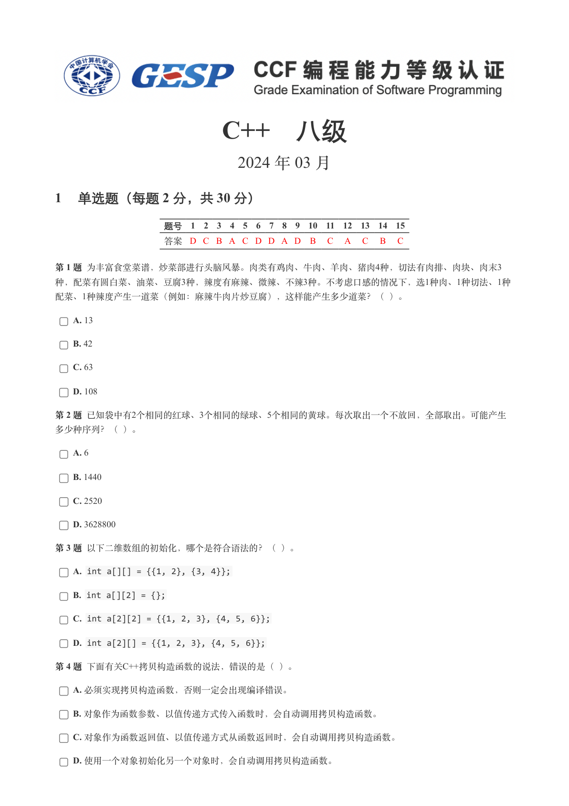
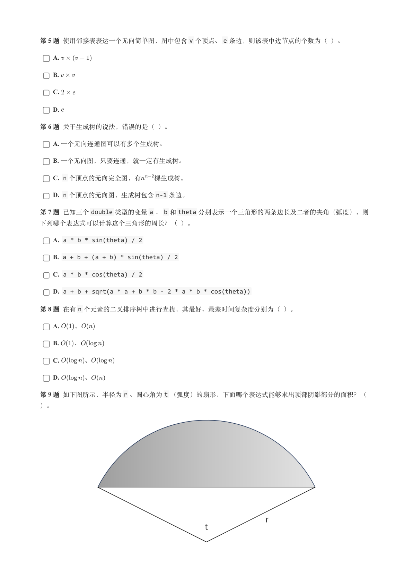
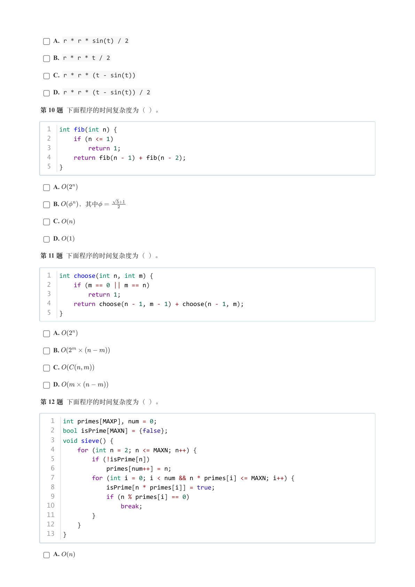
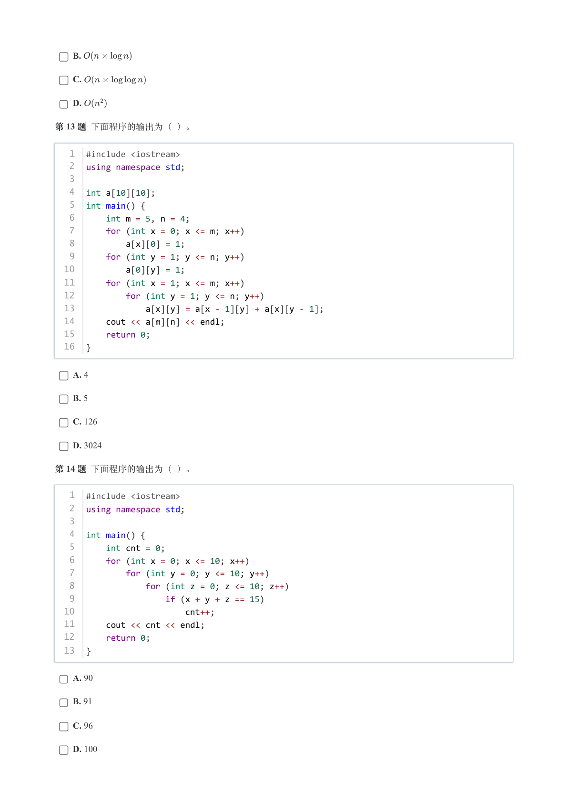
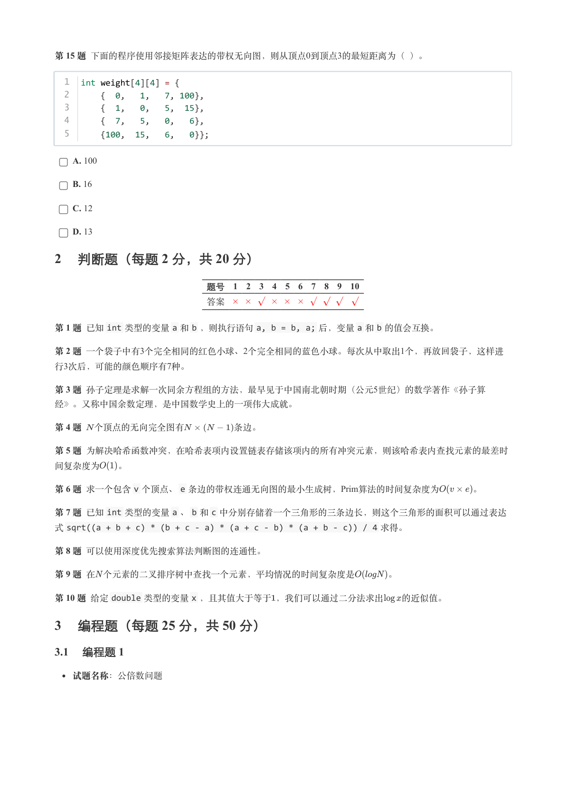
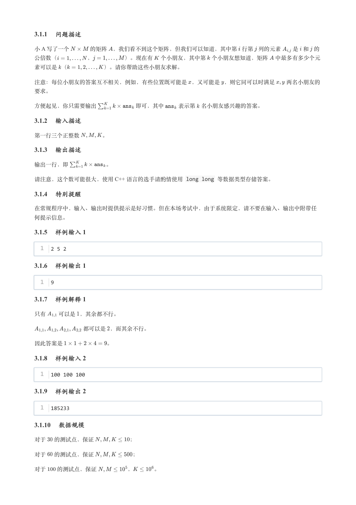
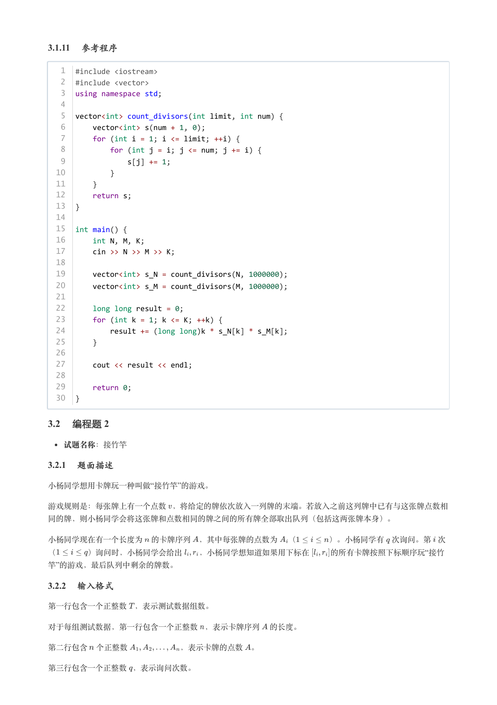
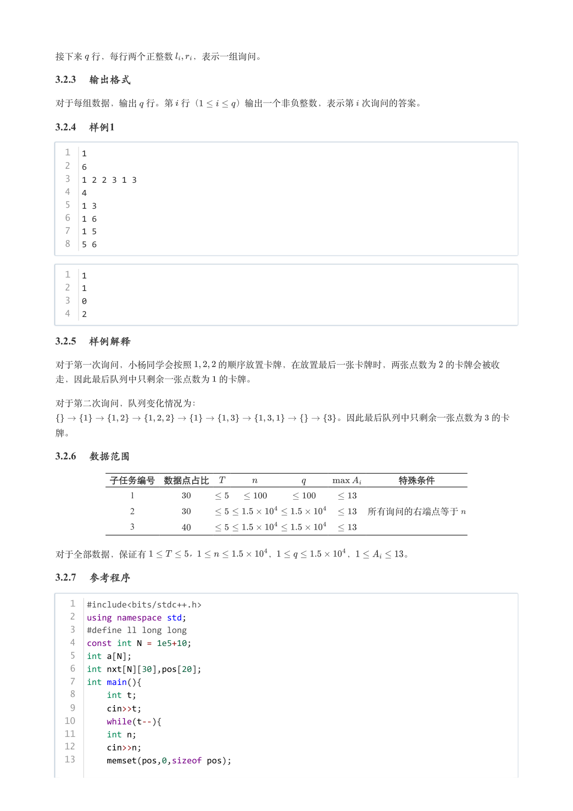
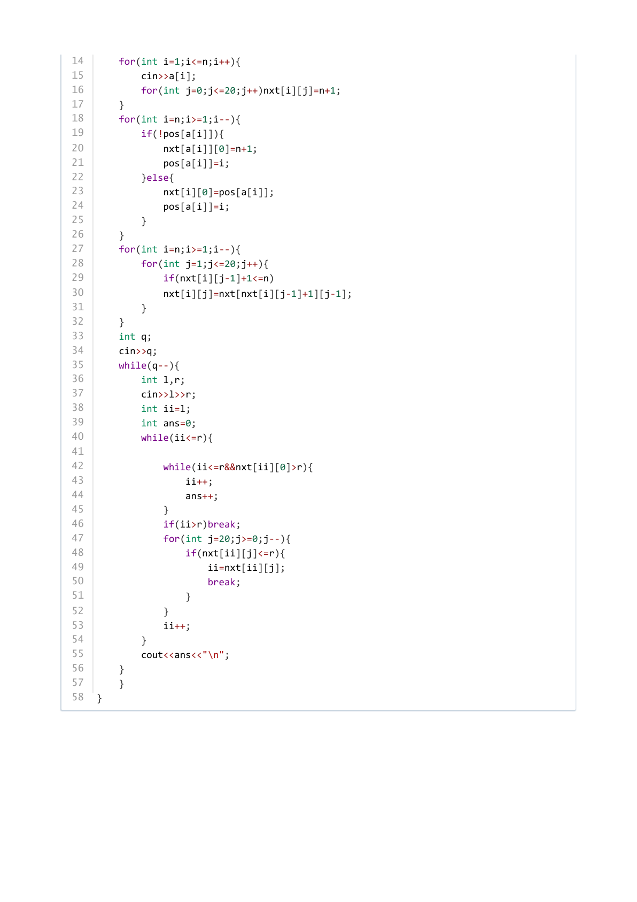

# 2024年3月-C++8级

- 原始 PDF：[`pdfs/2024年3月-C++8级.pdf`](../pdfs/2024年3月-C++8级.pdf)
- 页数：9
- 转换脚本：[`scripts/convert_pdfs_to_markdown.py`](../scripts/convert_pdfs_to_markdown.py)

> 为尽量避免信息丢失，每页均附带页面图片；文本提取结果保留原有顺序与换行特征，个别公式、图形、特殊排版请以页面图片为准。

## 第 1 页



### 提取文本

```
C++　八级

                      2024 年 03 月

1 单选题（每题 2 分，共 30 分）


            题号  1  2  3  4  5  6  7  8  9  10  11  12  13  14  15
            答案 D C B A C D D A D  B  C  A  C  B  C


第 1 题 为丰富食堂菜谱，炒菜部进行头脑风暴。肉类有鸡肉、牛肉、羊肉、猪肉4种，切法有肉排、肉块、肉末3
种，配菜有圆白菜、油菜、豆腐3种，辣度有麻辣、微辣、不辣3种。不考虑口感的情况下，选1种肉、1种切法、1种
配菜、1种辣度产生一道菜（例如：麻辣牛肉片炒豆腐），这样能产生多少道菜？（ ）。

    A. 13

    B. 42

    C. 63

    D. 108

第 2 题 已知袋中有2个相同的红球、3个相同的绿球、5个相同的黄球。每次取出一个不放回，全部取出。可能产生

多少种序列？（ ）。

    A. 6

    B. 1440

    C. 2520

    D. 3628800

第 3 题 以下二维数组的初始化，哪个是符合语法的？（ ）。

    A. int a[][] = {{1, 2}, {3, 4}};

    B. int a[][2] = {};

    C. int a[2][2] = {{1, 2, 3}, {4, 5, 6}};

    D. int a[2][] = {{1, 2, 3}, {4, 5, 6}};

第 4 题 下面有关C++拷贝构造函数的说法，错误的是（ ）。

    A. 必须实现拷贝构造函数，否则一定会出现编译错误。

    B. 对象作为函数参数、以值传递方式传入函数时，会自动调用拷贝构造函数。

    C. 对象作为函数返回值、以值传递方式从函数返回时，会自动调用拷贝构造函数。

    D. 使用一个对象初始化另一个对象时，会自动调用拷贝构造函数。
```

## 第 2 页



### 提取文本

```
第 5 题 使用邻接表表达一个无向简单图，图中包含v 个顶点、e 条边，则该表中边节点的个数为（ ）。

    A.

    B.

    C.

    D.

第 6 题 关于生成树的说法，错误的是（ ）。

    A. 一个无向连通图可以有多个生成树。

    B. 一个无向图，只要连通，就一定有生成树。

    C. n 个顶点的无向完全图，有  棵生成树。

    D. n 个顶点的无向图，生成树包含n-1 条边。

第 7 题 已知三个double 类型的变量a 、b 和theta 分别表示一个三角形的两条边长及二者的夹角（弧度），则

下列哪个表达式可以计算这个三角形的周长？（ ）。

    A. a * b * sin(theta) / 2

    B. a + b + (a + b) * sin(theta) / 2

    C. a * b * cos(theta) / 2

    D. a + b + sqrt(a * a + b * b - 2 * a * b * cos(theta))

第 8 题 在有n 个元素的二叉排序树中进行查找，其最好、最差时间复杂度分别为（ ）。

    A.  、

    B.  、

    C.    、

    D.    、

第 9 题 如下图所示，半径为r 、圆心角为t （弧度）的扇形，下面哪个表达式能够求出顶部阴影部分的面积？（

）。
```

## 第 3 页



### 提取文本

```
A. r * r * sin(t) / 2

    B. r * r * t / 2

    C. r * r * (t - sin(t))

    D. r * r * (t - sin(t)) / 2

第 10 题 下面程序的时间复杂度为（ ）。


  1  int fib(int n) {
  2      if (n <= 1)
  3          return 1;
  4      return fib(n - 1) + fib(n - 2);
  5  }


    A.

    B.   ，其中

    C.

    D.

第 11 题 下面程序的时间复杂度为（ ）。


  1  int choose(int n, int m) {
  2      if (m == 0 || m == n)
  3          return 1;
  4      return choose(n - 1, m - 1) + choose(n - 1, m);
  5  }


    A.

    B.

    C.

    D.

第 12 题 下面程序的时间复杂度为（ ）。


   1  int primes[MAXP], num = 0;
   2  bool isPrime[MAXN] = {false};
   3  void sieve() {
   4      for (int n = 2; n <= MAXN; n++) {
   5          if (!isPrime[n])
   6              primes[num++] = n;
   7          for (int i = 0; i < num && n * primes[i] <= MAXN; i++) {
   8              isPrime[n * primes[i]] = true;
   9              if (n % primes[i] == 0)
  10                  break;
  11          }
  12      }
  13  }


    A.
```

## 第 4 页



### 提取文本

```
B.

    C.

    D.

第 13 题 下面程序的输出为（ ）。


   1  #include <iostream>
   2  using namespace std;
   3
   4  int a[10][10];
   5  int main() {
   6      int m = 5, n = 4;
   7      for (int x = 0; x <= m; x++)
   8          a[x][0] = 1;
   9      for (int y = 1; y <= n; y++)
  10          a[0][y] = 1;
  11      for (int x = 1; x <= m; x++)
  12          for (int y = 1; y <= n; y++)
  13              a[x][y] = a[x - 1][y] + a[x][y - 1];
  14      cout << a[m][n] << endl;
  15      return 0;
  16  }


    A. 4

    B. 5

    C. 126

    D. 3024

第 14 题 下面程序的输出为（ ）。


   1  #include <iostream>
   2  using namespace std;
   3
   4  int main() {
   5      int cnt = 0;
   6      for (int x = 0; x <= 10; x++)
   7          for (int y = 0; y <= 10; y++)
   8              for (int z = 0; z <= 10; z++)
   9                  if (x + y + z == 15)
  10                      cnt++;
  11      cout << cnt << endl;
  12      return 0;
  13  }


    A. 90

    B. 91

    C. 96

    D. 100
```

## 第 5 页



### 提取文本

```
第 15 题 下面的程序使用邻接矩阵表达的带权无向图，则从顶点0到顶点3的最短距离为（ ）。


  1  int weight[4][4] = {
  2      {  0,   1,   7, 100},
  3      {  1,   0,   5,  15},
  4      {  7,   5,   0,   6},
  5      {100,  15,   6,   0}};


    A. 100

    B. 16

    C. 12

    D. 13

2 判断题（每题 2 分，共 20 分）


                 题号  1  2  3  4  5  6  7  8  9  10

                 答案


第 1 题 已知int 类型的变量a 和b ，则执行语句a, b = b, a; 后，变量a 和b 的值会互换。

第 2 题 一个袋子中有3个完全相同的红色小球、2个完全相同的蓝色小球。每次从中取出1个，再放回袋子，这样进
行3次后，可能的颜色顺序有7种。

第 3 题 孙子定理是求解一次同余方程组的方法，最早见于中国南北朝时期（公元5世纪）的数学著作《孙子算

经》。又称中国余数定理，是中国数学史上的一项伟大成就。

第 4 题 个顶点的无向完全图有      条边。

第 5 题 为解决哈希函数冲突，在哈希表项内设置链表存储该项内的所有冲突元素，则该哈希表内查找元素的最差时

间复杂度为  。

第 6 题 求一个包含v 个顶点、e 条边的带权连通无向图的最小生成树，Prim算法的时间复杂度为    。

第 7 题 已知int 类型的变量a 、b 和c 中分别存储着一个三角形的三条边长，则这个三角形的面积可以通过表达
式sqrt((a + b + c) * (b + c - a) * (a + c - b) * (a + b - c)) / 4 求得。

第 8 题 可以使用深度优先搜索算法判断图的连通性。

第 9 题 在 个元素的二叉排序树中查找一个元素，平均情况的时间复杂度是    。

第 10 题 给定double 类型的变量x ，且其值大于等于，我们可以通过二分法求出  的近似值。

3 编程题（每题 25 分，共 50 分）

3.1 编程题 1

  试题名称：公倍数问题
```

## 第 6 页



### 提取文本

```
3.1.1 问题描述

小 A 写了一个    的矩阵 ，我们看不到这个矩阵，但我们可以知道，其中第 行第 列的元素  是 和 的

公倍数（     ，      ）。现在有 个小朋友，其中第 个小朋友想知道，矩阵 中最多有多少个元

素可以是 （      ）。请你帮助这些小朋友求解。


注意：每位小朋友的答案互不相关，例如，有些位置既可能是 ，又可能是 ，则它同可以时满足  两名小朋友的

要求。


方便起见，你只需要输出       即可，其中   表示第 名小朋友感兴趣的答案。

3.1.2 输入描述

第一行三个正整数    。

3.1.3 输出描述

输出一行，即       。

请注意，这个数可能很大，使用 C++ 语言的选手请酌情使用 long long 等数据类型存储答案。

3.1.4 特别提醒

在常规程序中，输入、输出时提供提示是好习惯。但在本场考试中，由于系统限定，请不要在输入、输出中附带任

何提示信息。

3.1.5 样例输入 1

  1  2 5 2

3.1.6 样例输出 1

  1  9

3.1.7 样例解释 1

只有  可以是 ，其余都不行。


         都可以是 ，而其余不行。


因此答案是        。

3.1.8 样例输入 2

  1  100 100 100

3.1.9 样例输出 2

  1  185233

3.1.10 数据规模

对于  的测试点，保证      ；


对于  的测试点，保证       ；


对于  的测试点，保证     ，    。
```

## 第 7 页



### 提取文本

```
3.1.11 参考程序

   1  #include <iostream>
   2  #include <vector>
   3  using namespace std;
   4
   5  vector<int> count_divisors(int limit, int num) {
   6      vector<int> s(num + 1, 0);
   7      for (int i = 1; i <= limit; ++i) {
   8          for (int j = i; j <= num; j += i) {
   9              s[j] += 1;
  10          }
  11      }
  12      return s;
  13  }
  14
  15  int main() {
  16      int N, M, K;
  17      cin >> N >> M >> K;
  18
  19      vector<int> s_N = count_divisors(N, 1000000);
  20      vector<int> s_M = count_divisors(M, 1000000);
  21
  22      long long result = 0;
  23      for (int k = 1; k <= K; ++k) {
  24          result += (long long)k * s_N[k] * s_M[k];
  25      }
  26
  27      cout << result << endl;
  28
  29      return 0;
  30  }

3.2 编程题 2

  试题名称：接竹竿

3.2.1 题面描述

小杨同学想用卡牌玩一种叫做“接竹竿”的游戏。


游戏规则是：每张牌上有一个点数 ，将给定的牌依次放入一列牌的末端。若放入之前这列牌中已有与这张牌点数相

同的牌，则小杨同学会将这张牌和点数相同的牌之间的所有牌全部取出队列（包括这两张牌本身）。


小杨同学现在有一个长度为 的卡牌序列 ，其中每张牌的点数为 （    ）。小杨同学有 次询问。第 次

（    ）询问时，小杨同学会给出  ，小杨同学想知道如果用下标在   的所有卡牌按照下标顺序玩“接竹
竿”的游戏，最后队列中剩余的牌数。

3.2.2 输入格式

第一行包含一个正整数 ，表示测试数据组数。


对于每组测试数据，第一行包含一个正整数 ，表示卡牌序列 的长度。


第二行包含 个正整数       ，表示卡牌的点数 。


第三行包含一个正整数 ，表示询问次数。
```

## 第 8 页



### 提取文本

```
接下来 行，每行两个正整数  ，表示一组询问。

3.2.3 输出格式

对于每组数据，输出 行。第 行（    ）输出一个非负整数，表示第 次询问的答案。

3.2.4 样例1

  1  1
  2  6
  3  1 2 2 3 1 3
  4  4
  5  1 3
  6  1 6
  7  1 5
  8  5 6


  1  1
  2  1
  3  0
  4  2

3.2.5 样例解释

对于第一次询问，小杨同学会按照   的顺序放置卡牌，在放置最后一张卡牌时，两张点数为 的卡牌会被收

走，因此最后队列中只剩余一张点数为 的卡牌。


对于第二次询问，队列变化情况为：

                               。因此最后队列中只剩余一张点数为 的卡

牌。

3.2.6 数据范围

      子任务编号 数据点占比                     特殊条件

                1

                2                          所有询问的右端点等于

                3


对于全部数据，保证有     ，        ，        ，     。

3.2.7 参考程序

   1  #include<bits/stdc++.h>
   2  using namespace std;
   3  #define ll long long
   4  const int N = 1e5+10;
   5  int a[N];
   6  int nxt[N][30],pos[20];
   7  int main(){
   8      int t;
   9      cin>>t;
  10      while(t--){
  11      int n;
  12      cin>>n;
  13      memset(pos,0,sizeof pos);
```

## 第 9 页



### 提取文本

```
14      for(int i=1;i<=n;i++){
15          cin>>a[i];
16          for(int j=0;j<=20;j++)nxt[i][j]=n+1;
17      }
18      for(int i=n;i>=1;i--){
19          if(!pos[a[i]]){
20              nxt[a[i]][0]=n+1;
21              pos[a[i]]=i;
22          }else{
23              nxt[i][0]=pos[a[i]];
24              pos[a[i]]=i;
25          }
26      }
27      for(int i=n;i>=1;i--){
28          for(int j=1;j<=20;j++){
29              if(nxt[i][j-1]+1<=n)
30              nxt[i][j]=nxt[nxt[i][j-1]+1][j-1];
31          }
32      }
33      int q;
34      cin>>q;
35      while(q--){
36          int l,r;
37          cin>>l>>r;
38          int ii=l;
39          int ans=0;
40          while(ii<=r){
41
42              while(ii<=r&&nxt[ii][0]>r){
43                  ii++;
44                  ans++;
45              }
46              if(ii>r)break;
47              for(int j=20;j>=0;j--){
48                  if(nxt[ii][j]<=r){
49                      ii=nxt[ii][j];
50                      break;
51                  }
52              }
53              ii++;
54          }
55          cout<<ans<<"\n";
56      }
57      }
58  }
```
