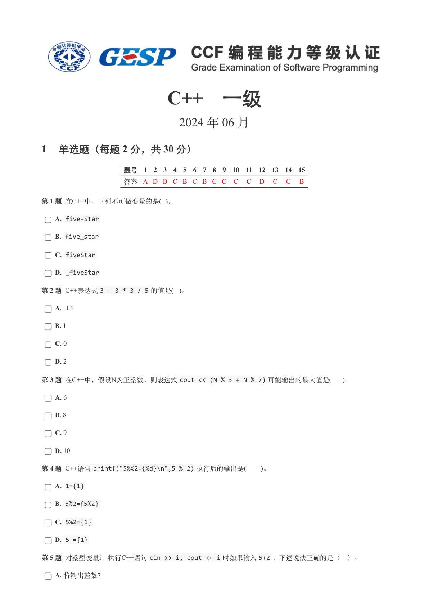
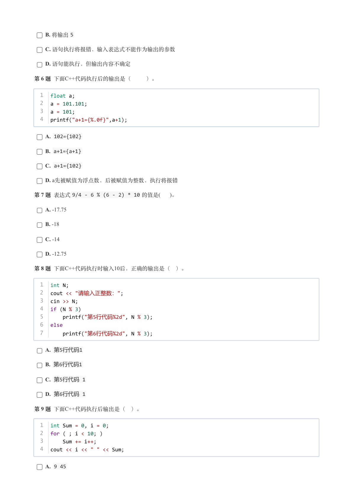
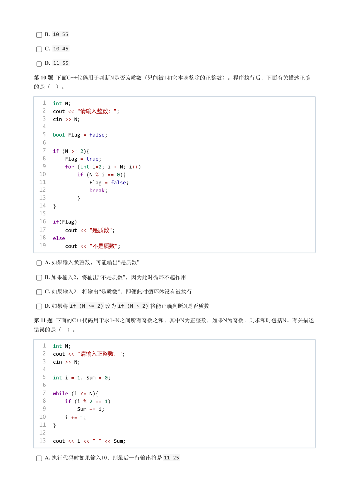
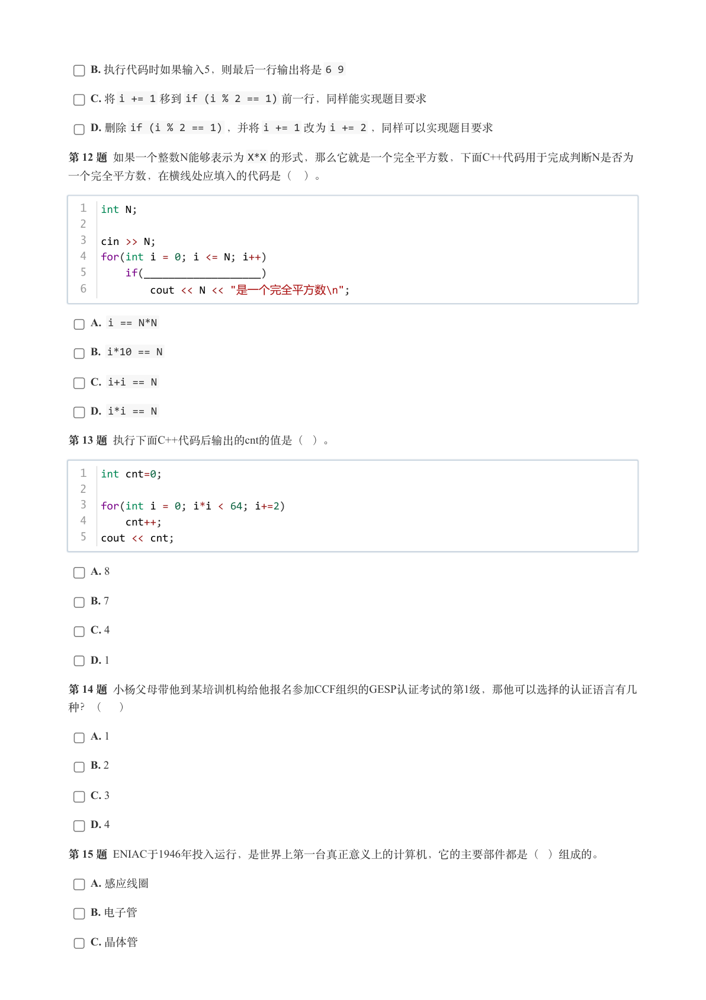
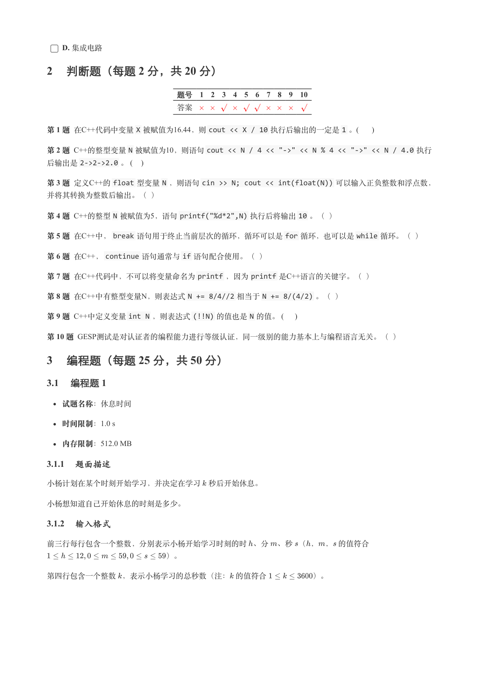
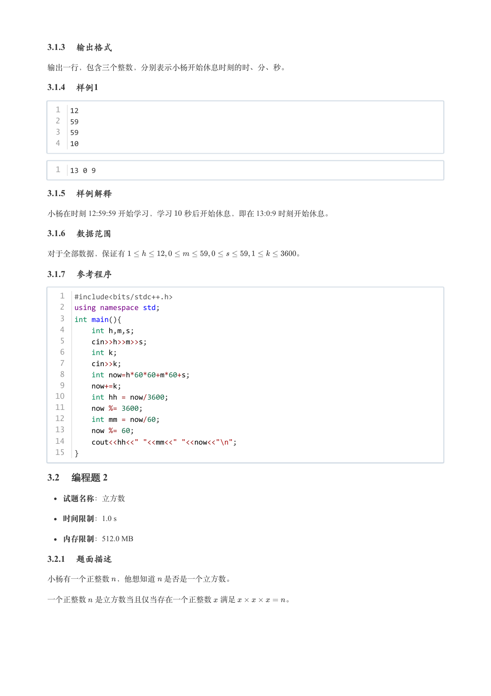
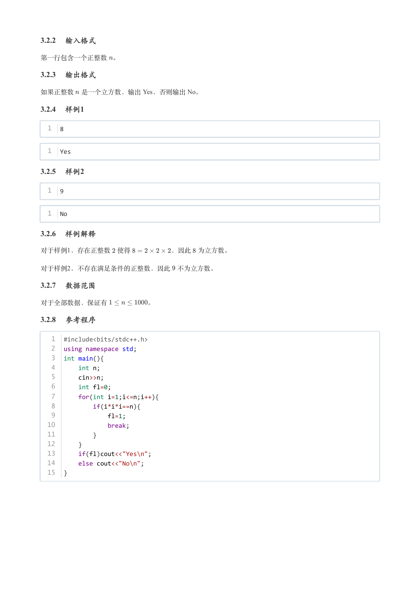

# 2024年6月-C++1级

- 原始 PDF：[`pdfs/2024年6月-C++1级.pdf`](../pdfs/2024年6月-C++1级.pdf)
- 页数：7
- 转换脚本：[`scripts/convert_pdfs_to_markdown.py`](../scripts/convert_pdfs_to_markdown.py)

> 为尽量避免信息丢失，每页均附带页面图片；文本提取结果保留原有顺序与换行特征，个别公式、图形、特殊排版请以页面图片为准。

## 第 1 页



### 提取文本

```
C++　一级

                      2024 年 06 月

1 单选题（每题 2 分，共 30 分）


            题号  1  2  3  4  5  6  7  8  9  10  11  12  13  14  15
            答案 A D B C B C B C C  C  C  D  C  C  B


第 1 题 在C++中，下列不可做变量的是( )。

    A. five-Star

    B. five_star

    C. fiveStar

    D. _fiveStar

第 2 题 C++表达式3 - 3 * 3 / 5 的值是( )。

    A. -1.2

    B. 1

    C. 0

    D. 2

第 3 题 在C++中，假设N为正整数，则表达式cout << (N % 3 + N % 7) 可能输出的最大值是(  )。

    A. 6

    B. 8

    C. 9

    D. 10

第 4 题 C++语句printf("5%%2={%d}\n",5 % 2) 执行后的输出是(   )。

    A. 1={1}

    B. 5%2={5%2}

    C. 5%2={1}

    D. 5 ={1}

第 5 题 对整型变量i，执行C++语句cin >> i, cout << i 时如果输入5+2 ，下述说法正确的是（ ）。

    A. 将输出整数7
```

## 第 2 页



### 提取文本

```
B. 将输出5

    C. 语句执行将报错，输入表达式不能作为输出的参数

    D. 语句能执行，但输出内容不确定

第 6 题 下面C++代码执行后的输出是（   ）。


  1  float a;
  2  a = 101.101;
  3  a = 101;
  4  printf("a+1={%.0f}",a+1);


    A. 102={102}

    B. a+1={a+1}

    C. a+1={102}

    D. a先被赋值为浮点数，后被赋值为整数，执行将报错

第 7 题 表达式9/4 - 6 % (6 - 2) * 10 的值是(   )。

    A. -17.75

    B. -18

    C. -14

    D. -12.75

第 8 题 下面C++代码执行时输入10后，正确的输出是（ ）。


  1  int N;
  2  cout << "请输入正整数：";
  3  cin >> N;
  4  if (N % 3)
  5     printf("第5行代码%2d", N % 3);
  6  else
  7     printf("第6行代码%2d", N % 3);

    A. 第5行代码1

    B. 第6行代码1

    C. 第5行代码 1

    D. 第6行代码 1

第 9 题 下面C++代码执行后输出是（ ）。


  1  int Sum = 0, i = 0;
  2  for ( ; i < 10; )
  3      Sum += i++;
  4  cout << i << " " << Sum;


    A. 9 45
```

## 第 3 页



### 提取文本

```
B. 10 55

    C. 10 45

    D. 11 55

第 10 题 下面C++代码用于判断N是否为质数（只能被1和它本身整除的正整数）。程序执行后，下面有关描述正确

的是（ ）。


   1  int N;
   2  cout << "请输入整数：";
   3  cin >> N;
   4
   5  bool Flag = false;
   6
   7  if (N >= 2){
   8      Flag = true;
   9      for (int i=2; i < N; i++)
  10          if (N % i == 0){
  11              Flag = false;
  12              break;
  13          }
  14  }
  15
  16  if(Flag)
  17      cout << "是质数";
  18  else
  19      cout << "不是质数";


    A. 如果输入负整数，可能输出“是质数”

    B. 如果输入2，将输出“不是质数”，因为此时循环不起作用

    C. 如果输入2，将输出“是质数”，即便此时循环体没有被执行

    D. 如果将if (N >= 2) 改为if (N > 2) 将能正确判断N是否质数

第 11 题 下面的C++代码用于求1~N之间所有奇数之和，其中N为正整数，如果N为奇数，则求和时包括N。有关描述

错误的是（ ）。


   1  int N;
   2  cout << "请输入正整数：";
   3  cin >> N;
   4
   5  int i = 1, Sum = 0;
   6
   7  while (i <= N){
   8      if (i % 2 == 1)
   9          Sum += i;
  10      i += 1;
  11  }
  12
  13  cout << i << " " << Sum;


    A. 执行代码时如果输入10，则最后一行输出将是11 25
```

## 第 4 页



### 提取文本

```
B. 执行代码时如果输入5，则最后一行输出将是6 9

    C. 将i += 1 移到if (i % 2 == 1) 前一行，同样能实现题目要求

    D. 删除if (i % 2 == 1) ，并将i += 1 改为i += 2 ，同样可以实现题目要求

第 12 题 如果一个整数N能够表示为X*X 的形式，那么它就是一个完全平方数，下面C++代码用于完成判断N是否为

一个完全平方数，在横线处应填入的代码是（ ）。


  1  int N;
  2
  3  cin >> N;
  4  for(int i = 0; i <= N; i++)
  5      if(___________________)
  6          cout << N << "是一个完全平方数\n";

    A. i == N*N

    B. i*10 == N

    C. i+i == N

    D. i*i == N

第 13 题 执行下面C++代码后输出的cnt的值是（ ）。


  1  int cnt=0;
  2
  3  for(int i = 0; i*i < 64; i+=2)
  4      cnt++;
  5  cout << cnt;


    A. 8

    B. 7

    C. 4

    D. 1

第 14 题 小杨父母带他到某培训机构给他报名参加CCF组织的GESP认证考试的第1级，那他可以选择的认证语言有几

种？（ ）

    A. 1

    B. 2

    C. 3

    D. 4

第 15 题 ENIAC于1946年投入运行，是世界上第一台真正意义上的计算机，它的主要部件都是（ ）组成的。

    A. 感应线圈

    B. 电子管

    C. 晶体管
```

## 第 5 页



### 提取文本

```
D. 集成电路

2 判断题（每题 2 分，共 20 分）


                 题号  1  2  3  4  5  6  7  8  9  10

                 答案


第 1 题 在C++代码中变量X 被赋值为16.44，则cout << X / 10 执行后输出的一定是1 。(     )

第 2 题 C++的整型变量N 被赋值为10，则语句cout << N / 4 << "->" << N % 4 << "->" << N / 4.0 执行
后输出是2->2->2.0 。 (   )

第 3 题 定义C++的float 型变量N ，则语句cin >> N; cout << int(float(N)) 可以输入正负整数和浮点数，

并将其转换为整数后输出。（ ）

第 4 题 C++的整型N 被赋值为5，语句printf("%d*2",N) 执行后将输出10 。（ ）

第 5 题 在C++中，break 语句用于终止当前层次的循环，循环可以是for 循环，也可以是while 循环。（ ）

第 6 题 在C++，continue 语句通常与if 语句配合使用。（ ）

第 7 题 在C++代码中，不可以将变量命名为printf ，因为printf 是C++语言的关键字。（ ）

第 8 题 在C++中有整型变量N，则表达式N += 8/4//2 相当于N += 8/(4/2) 。（ ）

第 9 题 C++中定义变量int N ，则表达式(!!N) 的值也是N 的值。 (    )

第 10 题 GESP测试是对认证者的编程能力进行等级认证，同一级别的能力基本上与编程语言无关。（ ）

3 编程题（每题 25 分，共 50 分）

3.1 编程题 1


  试题名称：休息时间

   时间限制：1.0 s

   内存限制：512.0 MB

3.1.1 题面描述

小杨计划在某个时刻开始学习，并决定在学习 秒后开始休息。


小杨想知道自己开始休息的时刻是多少。

3.1.2 输入格式

前三行每行包含一个整数，分别表示小杨开始学习时刻的时 、分 、秒 （， ， 的值符合

               ）。


第四行包含一个整数 ，表示小杨学习的总秒数（注： 的值符合      ）。
```

## 第 6 页



### 提取文本

```
3.1.3 输出格式

输出一行，包含三个整数，分别表示小杨开始休息时刻的时、分、秒。

3.1.4 样例1

  1  12
  2  59
  3  59
  4  10


  1  13 0 9

3.1.5 样例解释

小杨在时刻 12:59:59 开始学习，学习  秒后开始休息，即在 13:0:9 时刻开始休息。

3.1.6 数据范围

对于全部数据，保证有                      。

3.1.7 参考程序

   1  #include<bits/stdc++.h>
   2  using namespace std;
   3  int main(){
   4      int h,m,s;
   5      cin>>h>>m>>s;
   6      int k;
   7      cin>>k;
   8      int now=h*60*60+m*60+s;
   9      now+=k;
  10      int hh = now/3600;
  11      now %= 3600;
  12      int mm = now/60;
  13      now %= 60;
  14      cout<<hh<<" "<<mm<<" "<<now<<"\n";
  15  }

3.2 编程题 2


  试题名称：立方数

   时间限制：1.0 s

   内存限制：512.0 MB

3.2.1 题面描述

小杨有一个正整数 ，他想知道 是否是一个立方数。


一个正整数 是立方数当且仅当存在一个正整数 满足      。
```

## 第 7 页



### 提取文本

```
3.2.2 输入格式

第一行包含一个正整数 。

3.2.3 输出格式

如果正整数 是一个立方数，输出 Yes，否则输出 No。

3.2.4 样例1

  1  8


  1  Yes

3.2.5 样例2

  1  9


  1  No

3.2.6 样例解释

对于样例1，存在正整数 使得      ，因此 为立方数。

对于样例2，不存在满足条件的正整数，因此 不为立方数。

3.2.7 数据范围

对于全部数据，保证有      。

3.2.8 参考程序

   1  #include<bits/stdc++.h>
   2  using namespace std;
   3  int main(){
   4      int n;
   5      cin>>n;
   6      int fl=0;
   7      for(int i=1;i<=n;i++){
   8          if(i*i*i==n){
   9              fl=1;
  10              break;
  11          }
  12      }
  13      if(fl)cout<<"Yes\n";
  14      else cout<<"No\n";
  15  }
```
