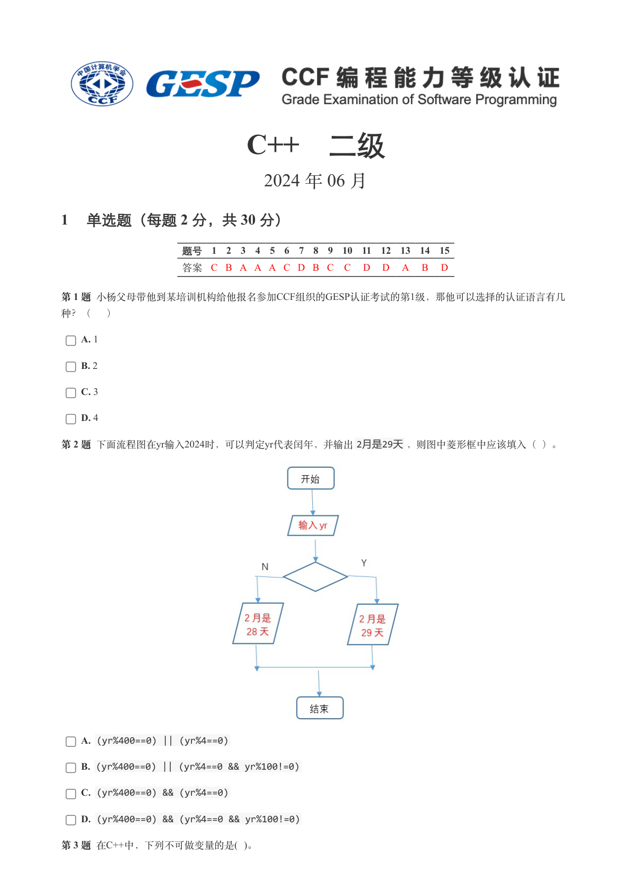
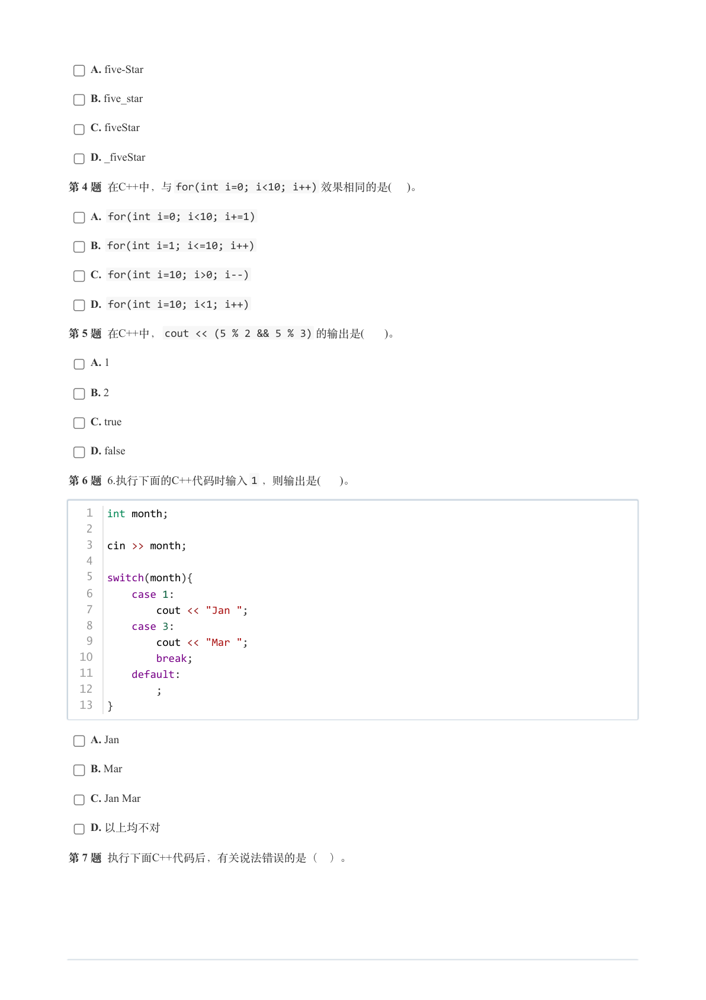
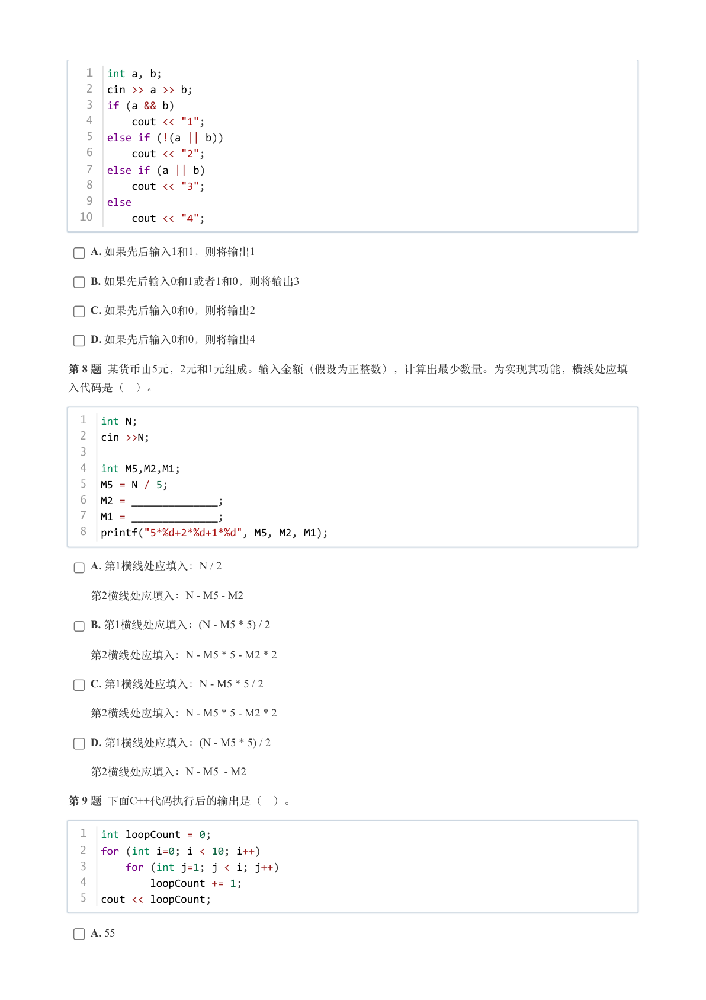
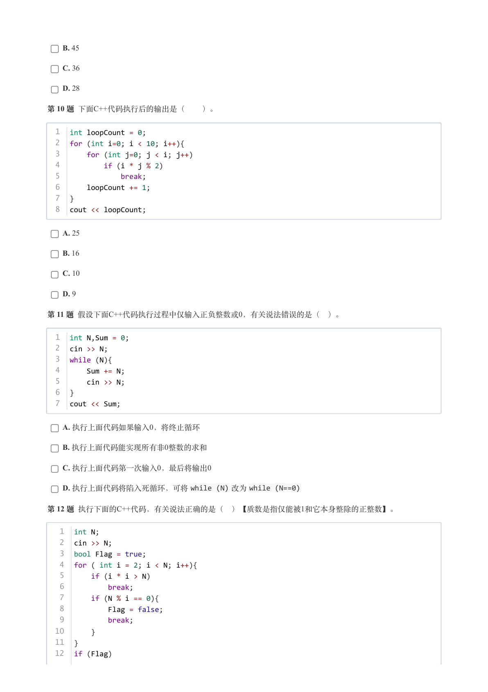
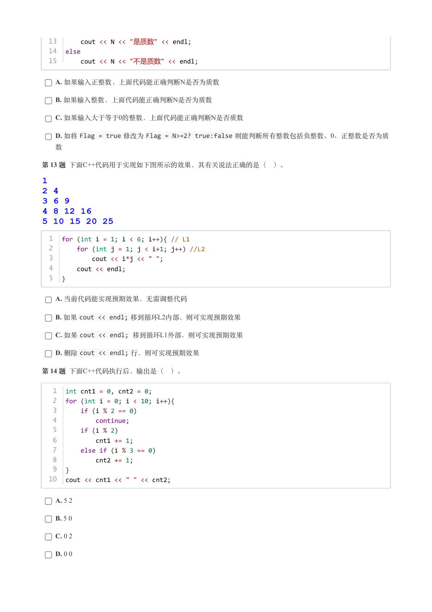
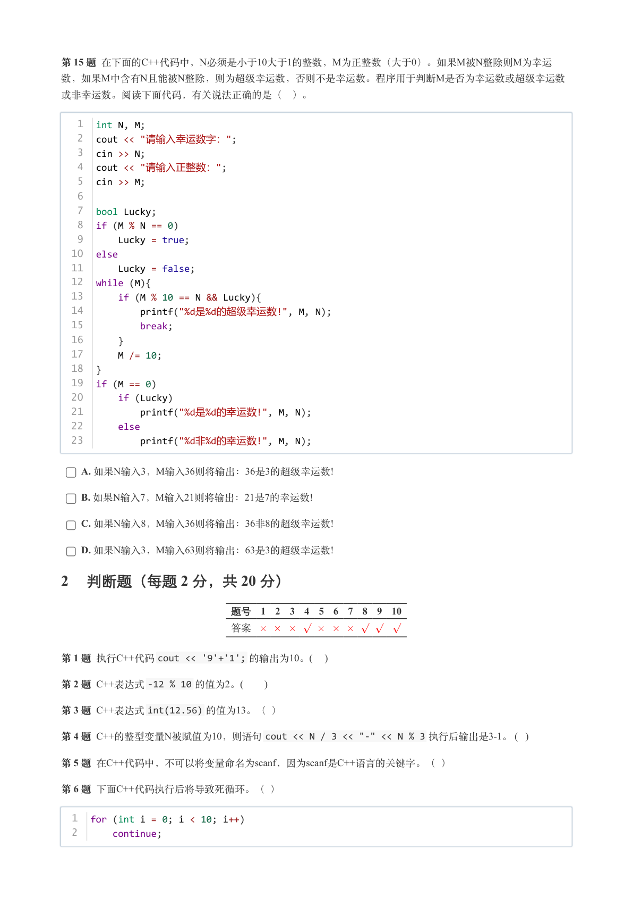
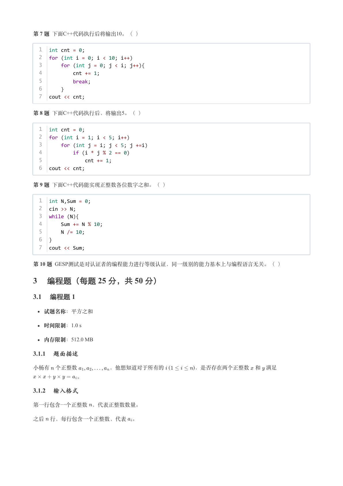
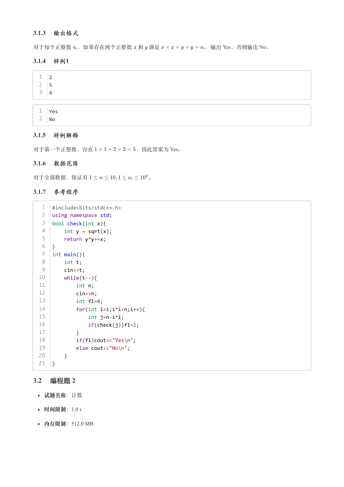
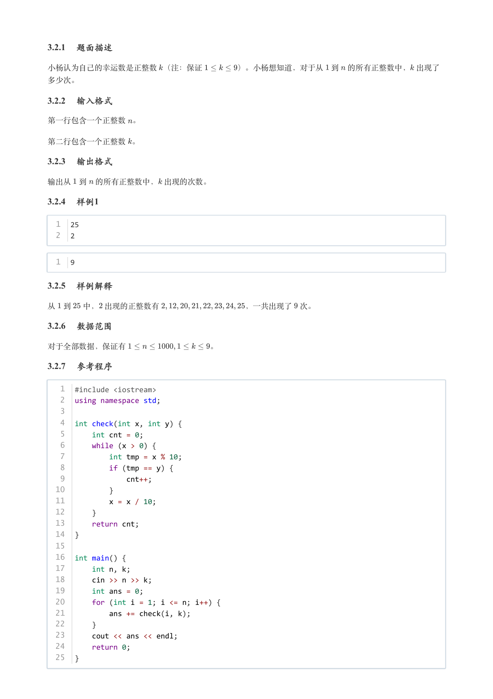

# 2024年6月-C++2级

- 原始 PDF：[`pdfs/2024年6月-C++2级.pdf`](../pdfs/2024年6月-C++2级.pdf)
- 页数：9
- 转换脚本：[`scripts/convert_pdfs_to_markdown.py`](../scripts/convert_pdfs_to_markdown.py)

> 为尽量避免信息丢失，每页均附带页面图片；文本提取结果保留原有顺序与换行特征，个别公式、图形、特殊排版请以页面图片为准。

## 第 1 页



### 提取文本

```
C++　二级

                      2024 年 06 月

1 单选题（每题 2 分，共 30 分）


            题号  1  2  3  4  5  6  7  8  9  10  11  12  13  14  15
            答案 C B A A A C D B C  C  D  D  A  B  D


第 1 题 小杨父母带他到某培训机构给他报名参加CCF组织的GESP认证考试的第1级，那他可以选择的认证语言有几

种？（ ）

    A. 1

    B. 2

    C. 3

    D. 4

第 2 题 下面流程图在yr输入2024时，可以判定yr代表闰年，并输出2月是29天，则图中菱形框中应该填入（ ）。


    A. (yr%400==0) || (yr%4==0)

    B. (yr%400==0) || (yr%4==0 && yr%100!=0)

    C. (yr%400==0) && (yr%4==0)

    D. (yr%400==0) && (yr%4==0 && yr%100!=0)

第 3 题 在C++中，下列不可做变量的是( )。
```

## 第 2 页



### 提取文本

```
A. five-Star

    B. five_star

    C. fiveStar

    D. _fiveStar

第 4 题 在C++中，与for(int i=0; i<10; i++) 效果相同的是(  )。

    A. for(int i=0; i<10; i+=1)

    B. for(int i=1; i<=10; i++)

    C. for(int i=10; i>0; i--)

    D. for(int i=10; i<1; i++)

第 5 题 在C++中，cout << (5 % 2 && 5 % 3) 的输出是(   )。

    A. 1

    B. 2

    C. true

    D. false

第 6 题 6.执行下面的C++代码时输入1 ，则输出是(   )。


   1  int month;
   2
   3  cin >> month;
   4
   5  switch(month){
   6      case 1:
   7          cout << "Jan ";
   8      case 3:
   9          cout << "Mar ";
  10          break;
  11      default:
  12          ;
  13  }


    A. Jan

    B. Mar

    C. Jan Mar

    D. 以上均不对

第 7 题 执行下面C++代码后，有关说法错误的是（ ）。
```

## 第 3 页



### 提取文本

```
1  int a, b;
   2  cin >> a >> b;
   3  if (a && b)
   4      cout << "1";
   5  else if (!(a || b))
   6      cout << "2";
   7  else if (a || b)
   8      cout << "3";
   9  else
  10      cout << "4";


    A. 如果先后输入1和1，则将输出1

    B. 如果先后输入0和1或者1和0，则将输出3

    C. 如果先后输入0和0，则将输出2

    D. 如果先后输入0和0，则将输出4

第 8 题 某货币由5元，2元和1元组成。输入金额（假设为正整数），计算出最少数量。为实现其功能，横线处应填

入代码是（ ）。


  1  int N;
  2  cin >>N;
  3
  4  int M5,M2,M1;
  5  M5 = N / 5;
  6  M2 = ______________;
  7  M1 = ______________;
  8  printf("5*%d+2*%d+1*%d", M5, M2, M1);


    A. 第1横线处应填入：N / 2

  第2横线处应填入：N - M5 - M2

    B. 第1横线处应填入：(N - M5 * 5) / 2

  第2横线处应填入：N - M5 * 5 - M2 * 2

    C. 第1横线处应填入：N - M5 * 5 / 2

  第2横线处应填入：N - M5 * 5 - M2 * 2

    D. 第1横线处应填入：(N - M5 * 5) / 2

  第2横线处应填入：N - M5  - M2

第 9 题 下面C++代码执行后的输出是（ ）。


  1  int loopCount = 0;
  2  for (int i=0; i < 10; i++)
  3      for (int j=1; j < i; j++)
  4          loopCount += 1;
  5  cout << loopCount;


    A. 55
```

## 第 4 页



### 提取文本

```
B. 45

    C. 36

    D. 28

第 10 题 下面C++代码执行后的输出是（  ）。


  1  int loopCount = 0;
  2  for (int i=0; i < 10; i++){
  3      for (int j=0; j < i; j++)
  4          if (i * j % 2)
  5              break;
  6      loopCount += 1;
  7  }
  8  cout << loopCount;


    A. 25

    B. 16

    C. 10

    D. 9

第 11 题 假设下面C++代码执行过程中仅输入正负整数或0，有关说法错误的是（ ）。


  1  int N,Sum = 0;
  2  cin >> N;
  3  while (N){
  4      Sum += N;
  5      cin >> N;
  6  }
  7  cout << Sum;


    A. 执行上面代码如果输入0，将终止循环

    B. 执行上面代码能实现所有非0整数的求和

    C. 执行上面代码第一次输入0，最后将输出0

    D. 执行上面代码将陷入死循环，可将while (N) 改为while (N==0)

第 12 题 执行下面的C++代码，有关说法正确的是（ ）【质数是指仅能被1和它本身整除的正整数】。


   1  int N;
   2  cin >> N;
   3  bool Flag = true;
   4  for ( int i = 2; i < N; i++){
   5      if (i * i > N)
   6          break;
   7      if (N % i == 0){
   8          Flag = false;
   9          break;
  10      }
  11  }
  12  if (Flag)
```

## 第 5 页



### 提取文本

```
13      cout << N << "是质数" << endl;
  14  else
  15      cout << N << "不是质数" << endl;


    A. 如果输入正整数，上面代码能正确判断N是否为质数

    B. 如果输入整数，上面代码能正确判断N是否为质数

    C. 如果输入大于等于0的整数，上面代码能正确判断N是否质数

    D. 如将Flag = true 修改为Flag = N>=2? true:false 则能判断所有整数包括负整数、0、正整数是否为质

  数

第 13 题 下面C++代码用于实现如下图所示的效果，其有关说法正确的是（ ）。


  1  for (int i = 1; i < 6; i++){ // L1
  2      for (int j = 1; j < i+1; j++) //L2
  3          cout << i*j << " ";
  4      cout << endl;
  5  }


    A. 当前代码能实现预期效果，无需调整代码

    B. 如果cout << endl; 移到循环L2内部，则可实现预期效果

    C. 如果cout << endl; 移到循环L1外部，则可实现预期效果

    D. 删除cout << endl; 行，则可实现预期效果

第 14 题 下面C++代码执行后，输出是（ ）。


   1  int cnt1 = 0, cnt2 = 0;
   2  for (int i = 0; i < 10; i++){
   3      if (i % 2 == 0)
   4          continue;
   5      if (i % 2)
   6          cnt1 += 1;
   7      else if (i % 3 == 0)
   8          cnt2 += 1;
   9  }
  10  cout << cnt1 << " " << cnt2;


    A. 5 2

    B. 5 0

    C. 0 2

    D. 0 0
```

## 第 6 页



### 提取文本

```
第 15 题 在下面的C++代码中，N必须是小于10大于1的整数，M为正整数（大于0）。如果M被N整除则M为幸运
数，如果M中含有N且能被N整除，则为超级幸运数，否则不是幸运数。程序用于判断M是否为幸运数或超级幸运数

或非幸运数。阅读下面代码，有关说法正确的是（ ）。


   1  int N, M;
   2  cout << "请输入幸运数字：";
   3  cin >> N;
   4  cout << "请输入正整数：";
   5  cin >> M;
   6
   7  bool Lucky;
   8  if (M % N == 0)
   9      Lucky = true;
  10  else
  11      Lucky = false;
  12  while (M){
  13      if (M % 10 == N && Lucky){
  14        printf("%d是%d的超级幸运数!", M, N);
  15          break;
  16      }
  17      M /= 10;
  18  }
  19  if (M == 0)
  20      if (Lucky)
  21         printf("%d是%d的幸运数!", M, N);
  22      else
  23         printf("%d非%d的幸运数!", M, N);


    A. 如果N输入3，M输入36则将输出：36是3的超级幸运数!

    B. 如果N输入7，M输入21则将输出：21是7的幸运数!

    C. 如果N输入8，M输入36则将输出：36非8的超级幸运数!

    D. 如果N输入3，M输入63则将输出：63是3的超级幸运数!

2 判断题（每题 2 分，共 20 分）

                 题号  1  2  3  4  5  6  7  8  9  10

                 答案


第 1 题 执行C++代码cout << '9'+'1'; 的输出为10。(    )

第 2 题 C++表达式-12 % 10 的值为2。(      )

第 3 题 C++表达式int(12.56) 的值为13。（ ）

第 4 题 C++的整型变量N被赋值为10，则语句cout << N / 3 << "-" << N % 3 执行后输出是3-1。 (  )

第 5 题 在C++代码中，不可以将变量命名为scanf，因为scanf是C++语言的关键字。（ ）

第 6 题 下面C++代码执行后将导致死循环。（ ）


  1  for (int i = 0; i < 10; i++)
  2      continue;
```

## 第 7 页



### 提取文本

```
第 7 题 下面C++代码执行后将输出10。（ ）


  1  int cnt = 0;
  2  for (int i = 0; i < 10; i++)
  3      for (int j = 0; j < i; j++){
  4          cnt += 1;
  5          break;
  6      }
  7  cout << cnt;


第 8 题 下面C++代码执行后，将输出5。（ ）


  1  int cnt = 0;
  2  for (int i = 1; i < 5; i++)
  3      for (int j = i; j < 5; j +=i)
  4          if (i * j % 2 == 0)
  5              cnt += 1;
  6  cout << cnt;


第 9 题 下面C++代码能实现正整数各位数字之和。（ ）


  1  int N,Sum = 0;
  2  cin >> N;
  3  while (N){
  4      Sum += N % 10;
  5      N /= 10;
  6  }
  7  cout << Sum;


第 10 题 GESP测试是对认证者的编程能力进行等级认证，同一级别的能力基本上与编程语言无关。（ ）

3 编程题（每题 25 分，共 50 分）

3.1 编程题 1


  试题名称：平方之和

   时间限制：1.0 s

   内存限制：512.0 MB

3.1.1 题面描述

小杨有 个正整数      ，他想知道对于所有的   (    )，是否存在两个正整数 和 满足

        。

3.1.2 输入格式

第一行包含一个正整数 ，代表正整数数量。


之后 行，每行包含一个正整数，代表 。
```

## 第 8 页



### 提取文本

```
3.1.3 输出格式

对于每个正整数 ，如果存在两个正整数 和 满足        ，输出 Yes，否则输出 No。

3.1.4 样例1

  1  2
  2  5
  3  4


  1  Yes
  2  No

3.1.5 样例解释

对于第一个正整数，存在        ，因此答案为 Yes。

3.1.6 数据范围

对于全部数据，保证有           。

3.1.7 参考程序

   1  #include<bits/stdc++.h>
   2  using namespace std;
   3  bool check(int x){
   4      int y = sqrt(x);
   5      return y*y==x;
   6  }
   7  int main(){
   8      int t;
   9      cin>>t;
  10      while(t--){
  11          int n;
  12          cin>>n;
  13          int fl=0;
  14          for(int i=1;i*i<n;i++){
  15              int j=n-i*i;
  16              if(check(j))fl=1;
  17          }
  18          if(fl)cout<<"Yes\n";
  19          else cout<<"No\n";
  20      }
  21  }

3.2 编程题 2


  试题名称：计数

   时间限制：1.0 s

   内存限制：512.0 MB
```

## 第 9 页



### 提取文本

```
3.2.1 题面描述

小杨认为自己的幸运数是正整数 （注：保证    ）。小杨想知道，对于从 到 的所有正整数中， 出现了

多少次。

3.2.2 输入格式

第一行包含一个正整数 。


第二行包含一个正整数 。

3.2.3 输出格式

输出从 到 的所有正整数中， 出现的次数。

3.2.4 样例1

  1  25
  2  2


  1  9

3.2.5 样例解释

从 到  中， 出现的正整数有           ，一共出现了 次。

3.2.6 数据范围

对于全部数据，保证有           。

3.2.7 参考程序

   1  #include <iostream>
   2  using namespace std;
   3
   4  int check(int x, int y) {
   5      int cnt = 0;
   6      while (x > 0) {
   7          int tmp = x % 10;
   8          if (tmp == y) {
   9              cnt++;
  10          }
  11          x = x / 10;
  12      }
  13      return cnt;
  14  }
  15
  16  int main() {
  17      int n, k;
  18      cin >> n >> k;
  19      int ans = 0;
  20      for (int i = 1; i <= n; i++) {
  21          ans += check(i, k);
  22      }
  23      cout << ans << endl;
  24      return 0;
  25  }
```
