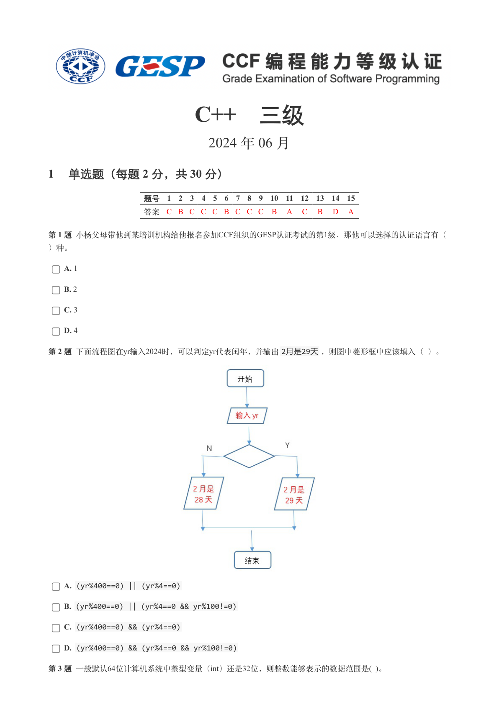
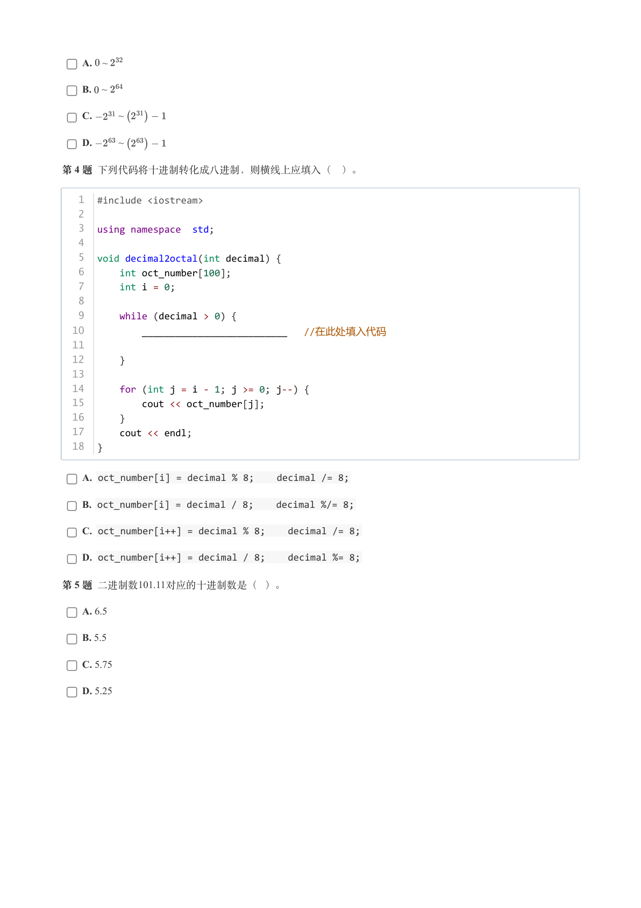
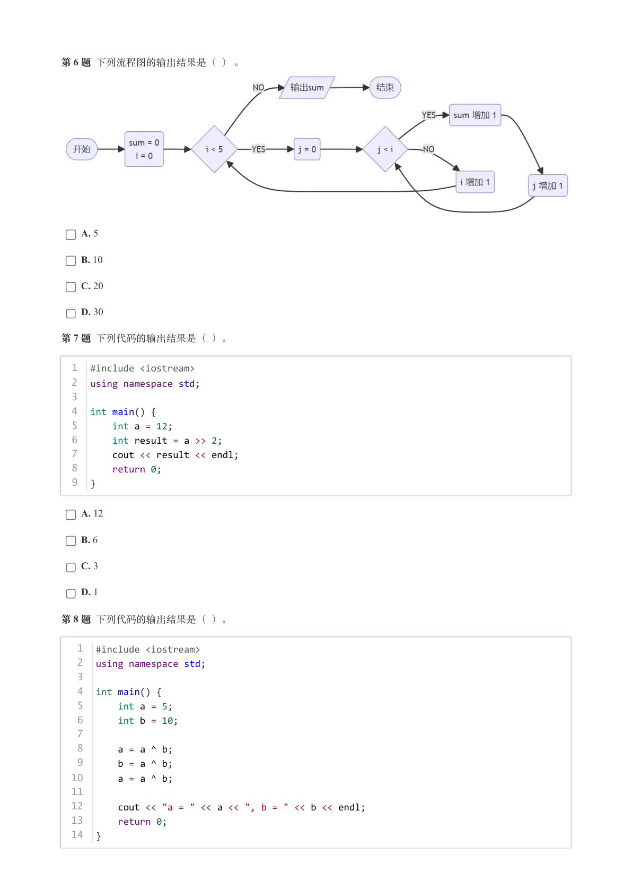
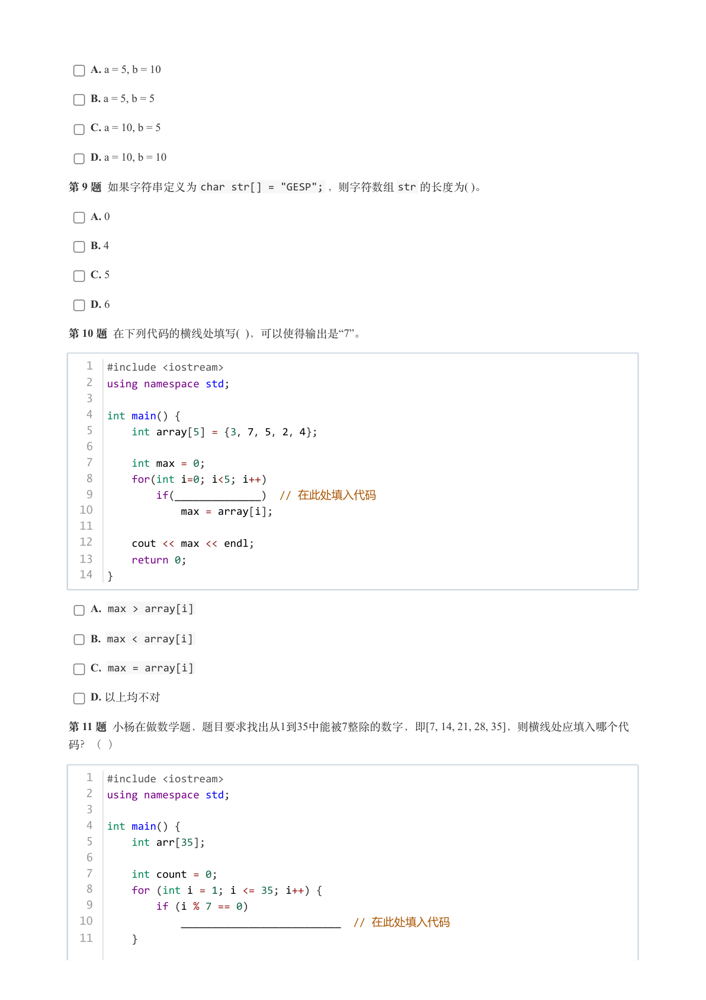
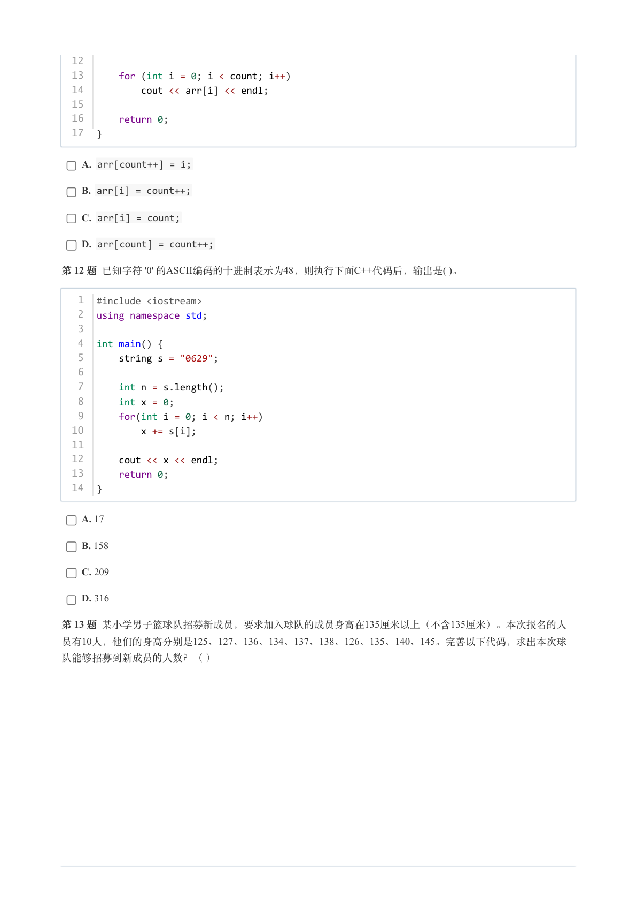
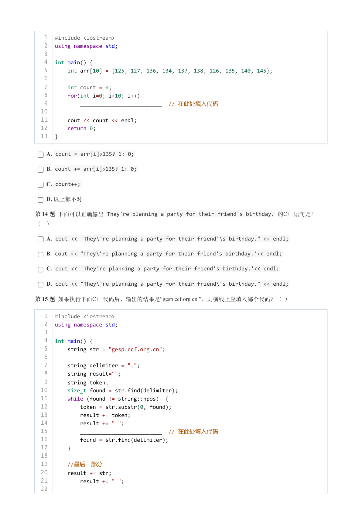
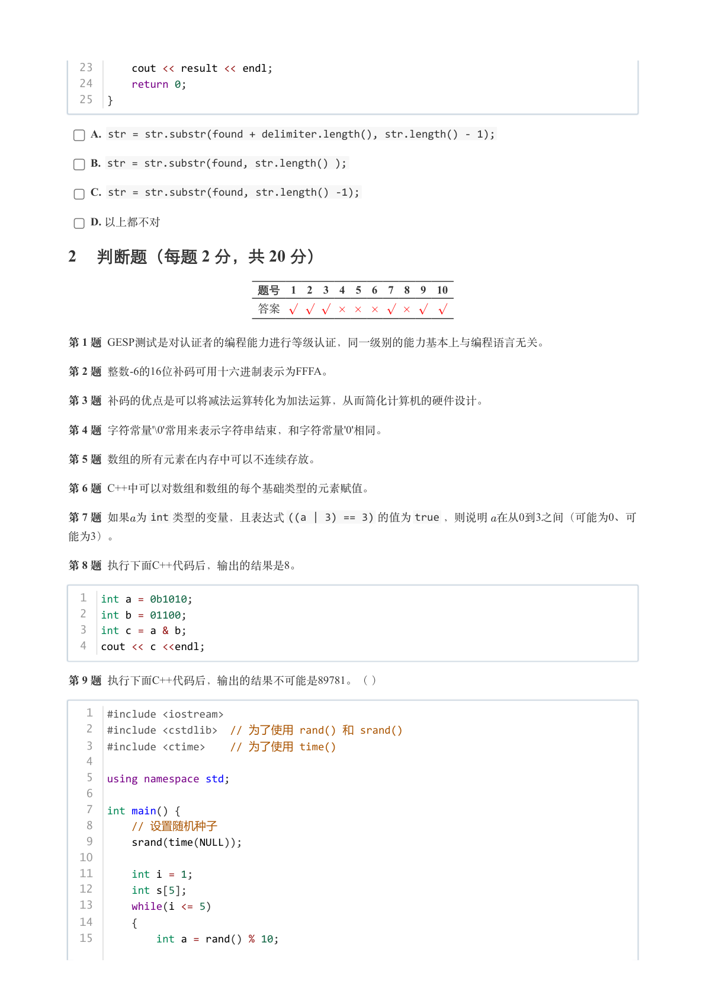
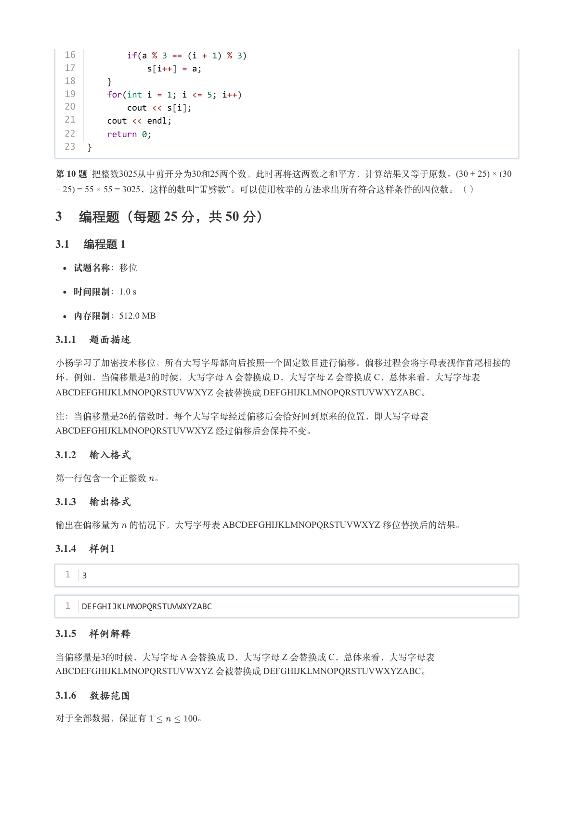
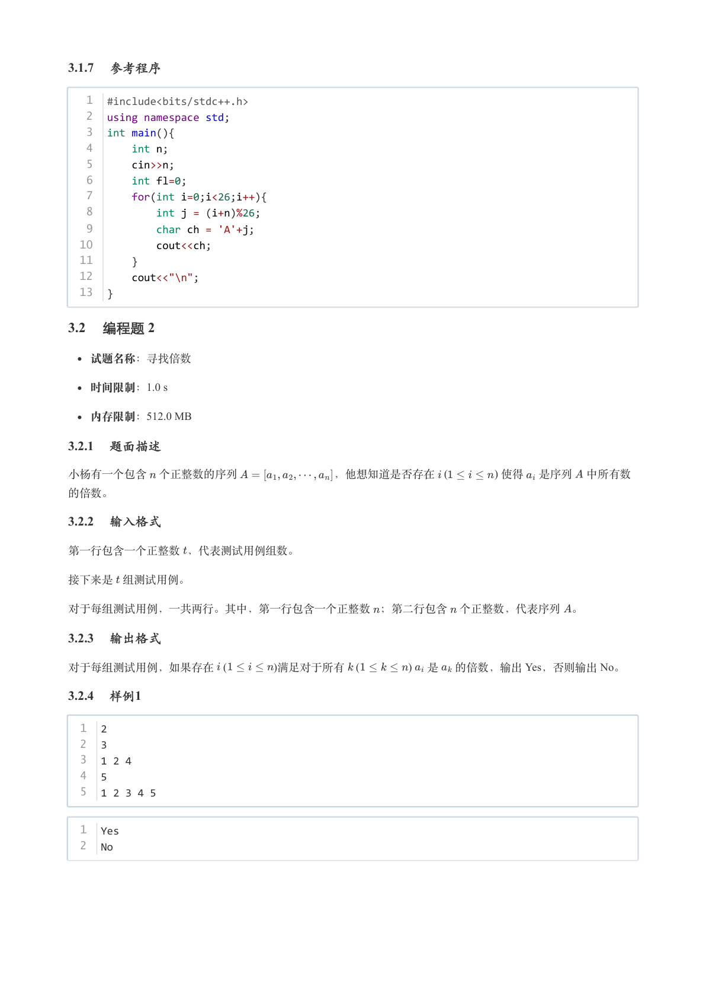
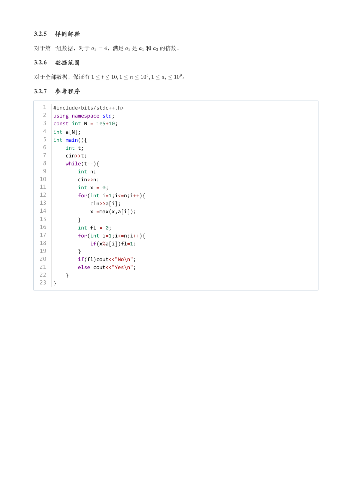

# 2024年6月-C++3级

- 原始 PDF：[`pdfs/2024年6月-C++3级.pdf`](../pdfs/2024年6月-C++3级.pdf)
- 页数：10
- 转换脚本：[`scripts/convert_pdfs_to_markdown.py`](../scripts/convert_pdfs_to_markdown.py)

> 为尽量避免信息丢失，每页均附带页面图片；文本提取结果保留原有顺序与换行特征，个别公式、图形、特殊排版请以页面图片为准。

## 第 1 页



### 提取文本

```
C++　三级

                      2024 年 06 月

1 单选题（每题 2 分，共 30 分）


            题号  1  2  3  4  5  6  7  8  9  10  11  12  13  14  15
            答案 C B C C C B C C C  B  A  C  B  D  A


第 1 题 小杨父母带他到某培训机构给他报名参加CCF组织的GESP认证考试的第1级，那他可以选择的认证语言有（

）种。

    A. 1

    B. 2

    C. 3

    D. 4

第 2 题 下面流程图在yr输入2024时，可以判定yr代表闰年，并输出2月是29天，则图中菱形框中应该填入（ ）。


    A. (yr%400==0) || (yr%4==0)

    B. (yr%400==0) || (yr%4==0 && yr%100!=0)

    C. (yr%400==0) && (yr%4==0)

    D. (yr%400==0) && (yr%4==0 && yr%100!=0)

第 3 题 一般默认64位计算机系统中整型变量（int）还是32位，则整数能够表示的数据范围是( )。
```

## 第 2 页



### 提取文本

```
A.  ~

    B.  ~

    C.     ~

    D.     ~

第 4 题 下列代码将十进制转化成八进制，则横线上应填入（　）。


   1  #include <iostream>
   2
   3  using namespace  std;
   4
   5  void decimal2octal(int decimal) {
   6      int oct_number[100];
   7      int i = 0;
   8
   9      while (decimal > 0) {
  10          __________________________  //在此处填入代码
  11
  12      }
  13
  14      for (int j = i - 1; j >= 0; j--) {
  15          cout << oct_number[j];
  16      }
  17      cout << endl;
  18  }


    A. oct_number[i] = decimal % 8;    decimal /= 8;

    B. oct_number[i] = decimal / 8;    decimal %/= 8;

    C. oct_number[i++] = decimal % 8;    decimal /= 8;

    D. oct_number[i++] = decimal / 8;    decimal %= 8;

第 5 题 二进制数101.11对应的十进制数是（ ）。

    A. 6.5

    B. 5.5

    C. 5.75

    D. 5.25
```

## 第 3 页



### 提取文本

```
第 6 题 下列流程图的输出结果是（ ） 。


    A. 5

    B. 10

    C. 20

    D. 30

第 7 题 下列代码的输出结果是（ ）。


  1  #include <iostream>
  2  using namespace std;
  3
  4  int main() {
  5      int a = 12;
  6      int result = a >> 2;
  7      cout << result << endl;
  8      return 0;
  9  }


    A. 12

    B. 6

    C. 3

    D. 1

第 8 题 下列代码的输出结果是（ ）。


   1  #include <iostream>
   2  using namespace std;
   3
   4  int main() {
   5      int a = 5;
   6      int b = 10;
   7
   8      a = a ^ b;
   9      b = a ^ b;
  10      a = a ^ b;
  11
  12      cout << "a = " << a << ", b = " << b << endl;
  13      return 0;
  14  }
```

## 第 4 页



### 提取文本

```
A. a = 5, b = 10

    B. a = 5, b = 5

    C. a = 10, b = 5

    D. a = 10, b = 10

第 9 题 如果字符串定义为char str[] = "GESP"; ，则字符数组str 的长度为( )。

    A. 0

    B. 4

    C. 5

    D. 6

第 10 题 在下列代码的横线处填写( )，可以使得输出是“7”。


   1  #include <iostream>
   2  using namespace std;
   3
   4  int main() {
   5      int array[5] = {3，7，5，2，4};
   6
   7      int max = 0;
   8      for(int i=0; i<5; i++)
   9          if(______________)  // 在此处填入代码
  10              max = array[i];
  11
  12      cout << max << endl;
  13      return 0;
  14  }

    A. max > array[i]

    B. max < array[i]

    C. max = array[i]

    D. 以上均不对

第 11 题 小杨在做数学题，题目要求找出从1到35中能被7整除的数字，即[7, 14, 21, 28, 35]，则横线处应填入哪个代

码？（ ）


   1  #include <iostream>
   2  using namespace std;
   3
   4  int main() {
   5      int arr[35];
   6
   7      int count = 0;
   8      for (int i = 1; i <= 35; i++) {
   9          if (i % 7 == 0)
  10              __________________________  // 在此处填入代码
  11      }
```

## 第 5 页



### 提取文本

```
12
  13      for (int i = 0; i < count; i++)
  14          cout << arr[i] << endl;
  15
  16      return 0;
  17  }


    A. arr[count++] = i;

    B. arr[i] = count++;

    C. arr[i] = count;

    D. arr[count] = count++;

第 12 题 已知字符 '0' 的ASCII编码的十进制表示为48，则执行下面C++代码后，输出是( )。


   1  #include <iostream>
   2  using namespace std;
   3
   4  int main() {
   5      string s = "0629";
   6
   7      int n = s.length();
   8      int x = 0;
   9      for(int i = 0; i < n; i++)
  10          x += s[i];
  11
  12      cout << x << endl;
  13      return 0;
  14  }


    A. 17

    B. 158

    C. 209

    D. 316

第 13 题 某小学男子篮球队招募新成员，要求加入球队的成员身高在135厘米以上（不含135厘米）。本次报名的人
员有10人，他们的身高分别是125、127、136、134、137、138、126、135、140、145。完善以下代码，求出本次球

队能够招募到新成员的人数？（ ）
```

## 第 6 页



### 提取文本

```
1  #include <iostream>
   2  using namespace std;
   3
   4  int main() {
   5      int arr[10] = {125, 127, 136, 134, 137, 138, 126, 135, 140, 145};
   6
   7      int count = 0;
   8      for(int i=0; i<10; i++)
   9          __________________________  // 在此处填入代码
  10
  11      cout << count << endl;
  12      return 0;
  13  }


    A. count = arr[i]>135? 1: 0;

    B. count += arr[i]>135? 1: 0;

    C. count++;

    D. 以上都不对

第 14 题 下面可以正确输出 They're planning a party for their friend's birthday. 的C++语句是？

（　）

    A. cout << 'They\'re planning a party for their friend'\s birthday." << endl;

    B. cout << "They\'re planning a party for their friend's birthday.'<< endl;

    C. cout << 'They're planning a party for their friend's birthday.'<< endl;

    D. cout << "They\'re planning a party for their friend\'s birthday." << endl;

第 15 题 如果执行下面C++代码后，输出的结果是“gesp ccf org cn ”，则横线上应填入哪个代码？（ ）


   1  #include <iostream>
   2  using namespace std;
   3
   4  int main() {
   5      string str = "gesp.ccf.org.cn";
   6
   7      string delimiter = ".";
   8      string result="";
   9      string token;
  10      size_t found = str.find(delimiter);
  11      while (found != string::npos)  {
  12          token = str.substr(0, found);
  13          result += token;
  14          result += " ";
  15          __________________________  // 在此处填入代码
  16          found = str.find(delimiter);
  17      }
  18
  19    //最后一部分
  20      result += str;
  21          result += " ";
  22
```

## 第 7 页



### 提取文本

```
23      cout << result << endl;
  24      return 0;
  25  }


    A. str = str.substr(found + delimiter.length(), str.length() - 1);

    B. str = str.substr(found, str.length() );

    C. str = str.substr(found, str.length() -1);

    D. 以上都不对

2 判断题（每题 2 分，共 20 分）

                 题号  1  2  3  4  5  6  7  8  9  10

                 答案


第 1 题 GESP测试是对认证者的编程能力进行等级认证，同一级别的能力基本上与编程语言无关。

第 2 题 整数-6的16位补码可用十六进制表示为FFFA。

第 3 题 补码的优点是可以将减法运算转化为加法运算，从而简化计算机的硬件设计。

第 4 题 字符常量'\0'常用来表示字符串结束，和字符常量'0'相同。

第 5 题 数组的所有元素在内存中可以不连续存放。

第 6 题 C++中可以对数组和数组的每个基础类型的元素赋值。

第 7 题 如果为int 类型的变量，且表达式((a | 3) == 3) 的值为true ，则说明 在从0到3之间（可能为0、可
能为3）。

第 8 题 执行下面C++代码后，输出的结果是8。


  1  int a = 0b1010;
  2  int b = 01100;
  3  int c = a & b;
  4  cout << c <<endl;


第 9 题 执行下面C++代码后，输出的结果不可能是89781。（ ）


   1  #include <iostream>
   2  #include <cstdlib>  // 为了使用 rand() 和 srand()
   3  #include <ctime>    // 为了使用 time()
   4
   5  using namespace std;
   6
   7  int main() {
   8      // 设置随机种子
   9      srand(time(NULL));
  10
  11      int i = 1;
  12      int s[5];
  13      while(i <= 5)
  14      {
  15          int a = rand() % 10;
```

## 第 8 页



### 提取文本

```
16          if(a % 3 == (i + 1) % 3)
  17              s[i++] = a;
  18      }
  19      for(int i = 1; i <= 5; i++)
  20          cout << s[i];
  21      cout << endl;
  22      return 0;
  23  }


第 10 题 把整数3025从中剪开分为30和25两个数，此时再将这两数之和平方，计算结果又等于原数。(30 + 25) × (30
+ 25) = 55 × 55 = 3025，这样的数叫“雷劈数”。可以使用枚举的方法求出所有符合这样条件的四位数。（ ）

3 编程题（每题 25 分，共 50 分）

3.1 编程题 1

  试题名称：移位

   时间限制：1.0 s

   内存限制：512.0 MB

3.1.1 题面描述

小杨学习了加密技术移位，所有大写字母都向后按照一个固定数目进行偏移。偏移过程会将字母表视作首尾相接的
环，例如，当偏移量是3的时候，大写字母 A 会替换成 D，大写字母 Z 会替换成 C，总体来看，大写字母表
ABCDEFGHIJKLMNOPQRSTUVWXYZ 会被替换成 DEFGHIJKLMNOPQRSTUVWXYZABC。

注：当偏移量是26的倍数时，每个大写字母经过偏移后会恰好回到原来的位置，即大写字母表
ABCDEFGHIJKLMNOPQRSTUVWXYZ 经过偏移后会保持不变。

3.1.2 输入格式

第一行包含一个正整数 。

3.1.3 输出格式

输出在偏移量为 的情况下，大写字母表 ABCDEFGHIJKLMNOPQRSTUVWXYZ 移位替换后的结果。

3.1.4 样例1

  1  3


  1  DEFGHIJKLMNOPQRSTUVWXYZABC

3.1.5 样例解释

当偏移量是3的时候，大写字母 A 会替换成 D，大写字母 Z 会替换成 C，总体来看，大写字母表
ABCDEFGHIJKLMNOPQRSTUVWXYZ 会被替换成 DEFGHIJKLMNOPQRSTUVWXYZABC。

3.1.6 数据范围

对于全部数据，保证有      。
```

## 第 9 页



### 提取文本

```
3.1.7 参考程序

   1  #include<bits/stdc++.h>
   2  using namespace std;
   3  int main(){
   4      int n;
   5      cin>>n;
   6      int fl=0;
   7      for(int i=0;i<26;i++){
   8          int j = (i+n)%26;
   9          char ch = 'A'+j;
  10          cout<<ch;
  11      }
  12      cout<<"\n";
  13  }

3.2 编程题 2


  试题名称：寻找倍数

   时间限制：1.0 s

   内存限制：512.0 MB

3.2.1 题面描述

小杨有一个包含 个正整数的序列         ，他想知道是否存在   (            ) 使得 是序列 中所有数

的倍数。

3.2.2 输入格式

第一行包含一个正整数 ，代表测试用例组数。


接下来是 组测试用例。


对于每组测试用例，一共两行。其中，第一行包含一个正整数 ；第二行包含 个正整数，代表序列 。

3.2.3 输出格式

对于每组测试用例，如果存在   (     )满足对于所有   (             ) 是 的倍数，输出 Yes，否则输出 No。

3.2.4 样例1

  1  2
  2  3
  3  1 2 4
  4  5
  5  1 2 3 4 5


  1  Yes
  2  No
```

## 第 10 页



### 提取文本

```
3.2.5 样例解释

对于第一组数据，对于   ，满足 是 和 的倍数。

3.2.6 数据范围

对于全部数据，保证有                 。

3.2.7 参考程序

   1  #include<bits/stdc++.h>
   2  using namespace std;
   3  const int N = 1e5+10;
   4  int a[N];
   5  int main(){
   6      int t;
   7      cin>>t;
   8      while(t--){
   9          int n;
  10          cin>>n;
  11          int x = 0;
  12          for(int i=1;i<=n;i++){
  13              cin>>a[i];
  14              x =max(x,a[i]);
  15          }
  16          int fl = 0;
  17          for(int i=1;i<=n;i++){
  18              if(x%a[i])fl=1;
  19          }
  20          if(fl)cout<<"No\n";
  21          else cout<<"Yes\n";
  22      }
  23  }
```
