# 2024年6月-C++4级

- 原始 PDF：[`pdfs/2024年6月-C++4级.pdf`](../pdfs/2024年6月-C++4级.pdf)
- 页数：12
- 转换脚本：[`scripts/convert_pdfs_to_markdown.py`](../scripts/convert_pdfs_to_markdown.py)

> 为尽量避免信息丢失，每页均附带页面图片；文本提取结果保留原有顺序与换行特征，个别公式、图形、特殊排版请以页面图片为准。

## 第 1 页

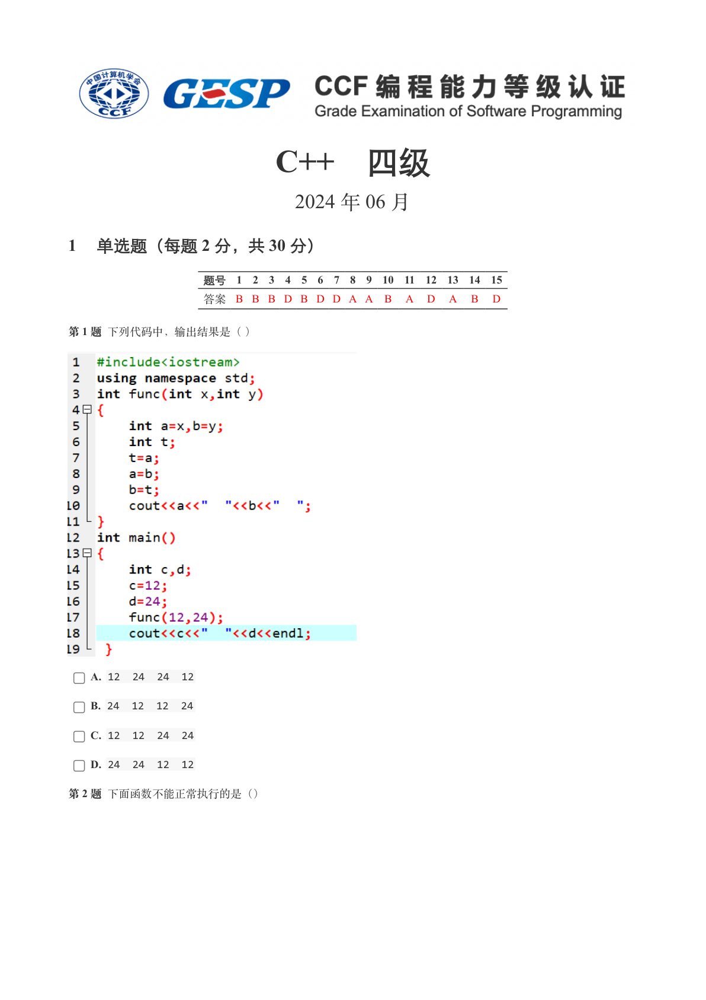

### 提取文本

```
C++　四级

                      2024 年 06 月

1 单选题（每题 2 分，共 30 分）


            题号  1  2  3  4  5  6  7  8  9  10  11  12  13  14  15
            答案 B B B D B D D A A  B  A  D  A  B  D


第 1 题 下列代码中，输出结果是（ ）


    A. 12  24  24  12

    B. 24  12  12  24

    C. 12  12  24  24

    D. 24  24  12  12

第 2 题 下面函数不能正常执行的是（）
```

## 第 2 页

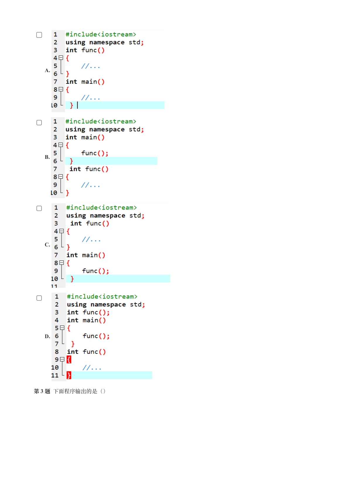

### 提取文本

```
A.


    B.


    C.


    D.


第 3 题 下面程序输出的是（）
```

## 第 3 页

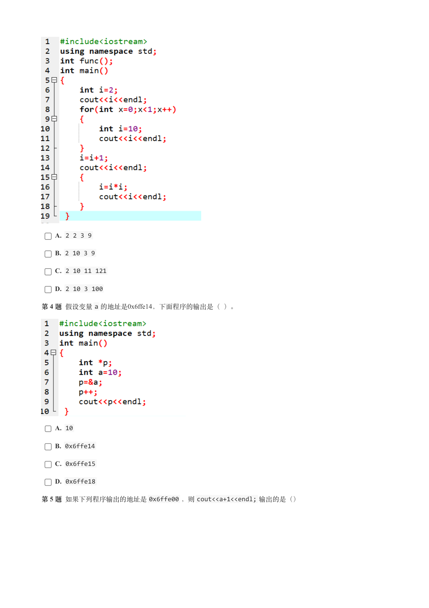

### 提取文本

```
A. 2 2 3 9

    B. 2 10 3 9

    C. 2 10 11 121

    D. 2 10 3 100

第 4 题 假设变量a 的地址是0x6ffe14，下面程序的输出是（ ）。


    A. 10

    B. 0x6ffe14

    C. 0x6ffe15

    D. 0x6ffe18

第 5 题 如果下列程序输出的地址是0x6ffe00 ，则cout<<a+1<<endl; 输出的是（）
```

## 第 4 页

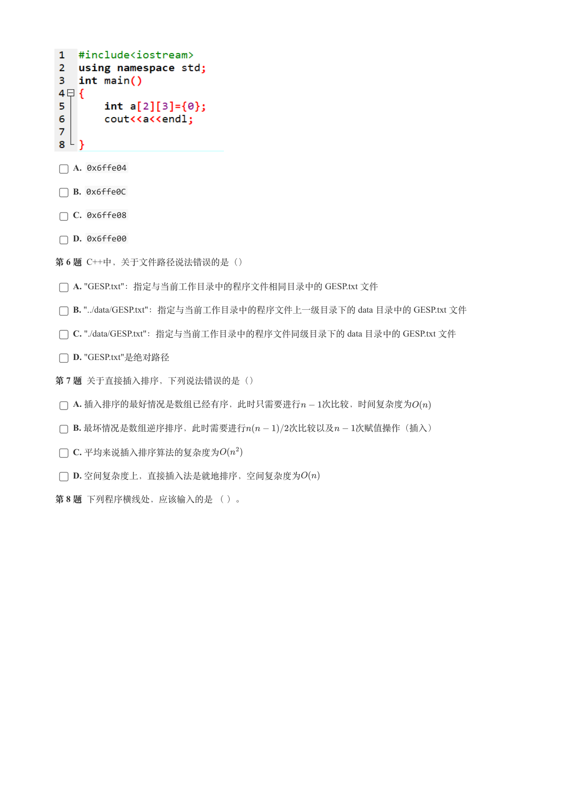

### 提取文本

```
A. 0x6ffe04

    B. 0x6ffe0C

    C. 0x6ffe08

    D. 0x6ffe00

第 6 题 C++中，关于文件路径说法错误的是（）

    A. "GESP.txt"：指定与当前工作目录中的程序文件相同目录中的 GESP.txt 文件

    B. "../data/GESP.txt"：指定与当前工作目录中的程序文件上一级目录下的 data 目录中的 GESP.txt 文件

    C. "./data/GESP.txt"：指定与当前工作目录中的程序文件同级目录下的 data 目录中的 GESP.txt 文件

    D. "GESP.txt"是绝对路径

第 7 题 关于直接插入排序，下列说法错误的是（）

    A. 插入排序的最好情况是数组已经有序，此时只需要进行  次比较，时间复杂度为

    B. 最坏情况是数组逆序排序，此时需要进行     次比较以及  次赋值操作（插入）

    C. 平均来说插入排序算法的复杂度为

    D. 空间复杂度上，直接插入法是就地排序，空间复杂度为

第 8 题 下列程序横线处，应该输入的是 （ ）。
```

## 第 5 页

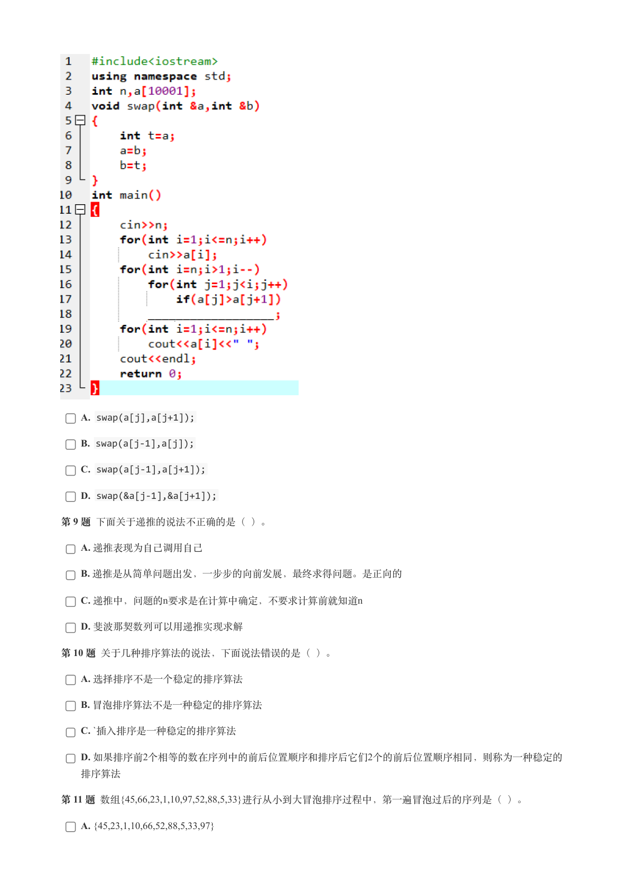

### 提取文本

```
A. swap(a[j],a[j+1]);

    B. swap(a[j-1],a[j]);

    C. swap(a[j-1],a[j+1]);

    D. swap(&a[j-1],&a[j+1]);

第 9 题 下面关于递推的说法不正确的是（ ）。

    A. 递推表现为自己调用自己

    B. 递推是从简单问题出发，一步步的向前发展，最终求得问题。是正向的

    C. 递推中，问题的n要求是在计算中确定，不要求计算前就知道n

    D. 斐波那契数列可以用递推实现求解

第 10 题 关于几种排序算法的说法，下面说法错误的是（ ）。

    A. 选择排序不是一个稳定的排序算法

    B. 冒泡排序算法不是一种稳定的排序算法

    C. `插入排序是一种稳定的排序算法

    D. 如果排序前2个相等的数在序列中的前后位置顺序和排序后它们2个的前后位置顺序相同，则称为一种稳定的

  排序算法

第 11 题 数组{45,66,23,1,10,97,52,88,5,33}进行从小到大冒泡排序过程中，第一遍冒泡过后的序列是（ ）。

    A. {45,23,1,10,66,52,88,5,33,97}
```

## 第 6 页

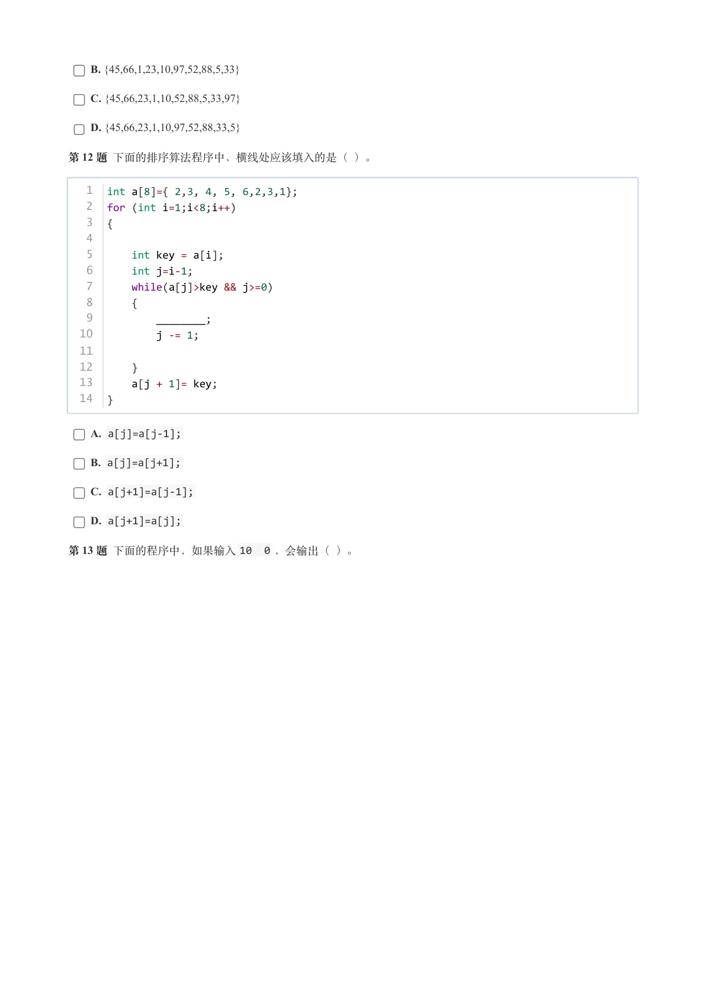

### 提取文本

```
B. {45,66,1,23,10,97,52,88,5,33}

    C. {45,66,23,1,10,52,88,5,33,97}

    D. {45,66,23,1,10,97,52,88,33,5}

第 12 题 下面的排序算法程序中，横线处应该填入的是（ ）。


   1  int a[8]={ 2,3, 4, 5, 6,2,3,1};
   2  for (int i=1;i<8;i++)
   3  {
   4
   5      int key = a[i];
   6      int j=i-1;
   7      while(a[j]>key && j>=0)
   8      {
   9          ________;
  10          j -= 1;
  11
  12      }
  13      a[j + 1]= key;
  14  }


    A. a[j]=a[j-1];

    B. a[j]=a[j+1];

    C. a[j+1]=a[j-1];

    D. a[j+1]=a[j];

第 13 题 下面的程序中，如果输入10  0 ，会输出（ ）。
```

## 第 7 页

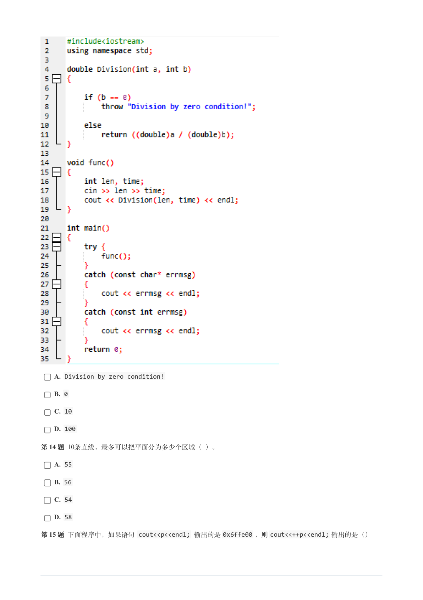

### 提取文本

```
A. Division by zero condition!

    B. 0

    C. 10

    D. 100

第 14 题 10条直线，最多可以把平面分为多少个区域（ ）。

    A. 55

    B. 56

    C. 54

    D. 58

第 15 题 下面程序中，如果语句 cout<<p<<endl; 输出的是0x6ffe00 ，则cout<<++p<<endl; 输出的是（）
```

## 第 8 页

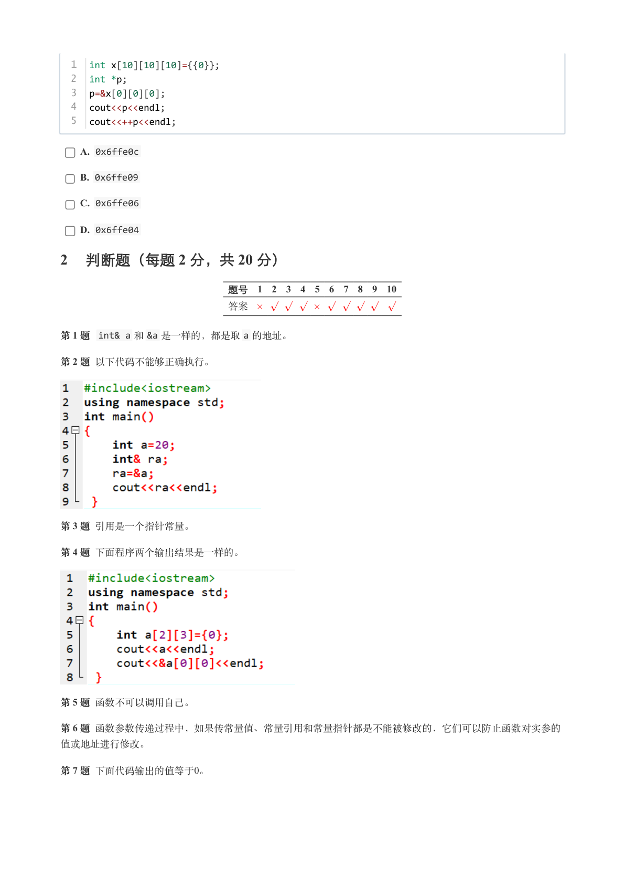

### 提取文本

```
1  int x[10][10][10]={{0}};
  2  int *p;
  3  p=&x[0][0][0];
  4  cout<<p<<endl;
  5  cout<<++p<<endl;


    A. 0x6ffe0c

    B. 0x6ffe09

    C. 0x6ffe06

    D. 0x6ffe04

2 判断题（每题 2 分，共 20 分）

                 题号  1  2  3  4  5  6  7  8  9  10

                 答案


第 1 题 int& a 和&a 是一样的，都是取a 的地址。

第 2 题 以下代码不能够正确执行。


第 3 题 引用是一个指针常量。

第 4 题 下面程序两个输出结果是一样的。


第 5 题 函数不可以调用自己。

第 6 题 函数参数传递过程中，如果传常量值、常量引用和常量指针都是不能被修改的，它们可以防止函数对实参的

值或地址进行修改。

第 7 题 下面代码输出的值等于0。
```

## 第 9 页

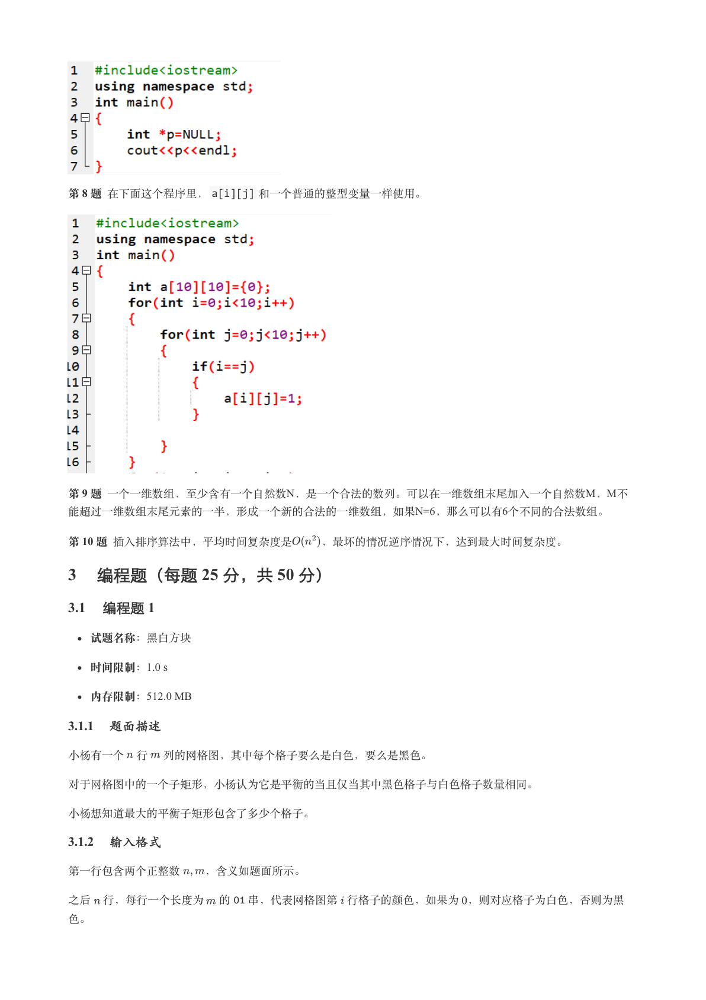

### 提取文本

```
第 8 题 在下面这个程序里，a[i][j] 和一个普通的整型变量一样使用。


第 9 题 一个一维数组，至少含有一个自然数N，是一个合法的数列。可以在一维数组末尾加入一个自然数M，M不
能超过一维数组末尾元素的一半，形成一个新的合法的一维数组，如果N=6，那么可以有6个不同的合法数组。

第 10 题 插入排序算法中，平均时间复杂度是   ，最坏的情况逆序情况下，达到最大时间复杂度。

3 编程题（每题 25 分，共 50 分）

3.1 编程题 1


  试题名称：黑白方块

   时间限制：1.0 s

   内存限制：512.0 MB

3.1.1 题面描述

小杨有一个 行 列的网格图，其中每个格子要么是白色，要么是黑色。


对于网格图中的一个子矩形，小杨认为它是平衡的当且仅当其中黑色格子与白色格子数量相同。


小杨想知道最大的平衡子矩形包含了多少个格子。

3.1.2 输入格式

第一行包含两个正整数  ，含义如题面所示。


之后 行，每行一个长度为 的  串，代表网格图第 行格子的颜色，如果为 ，则对应格子为白色，否则为黑

色。
```

## 第 10 页

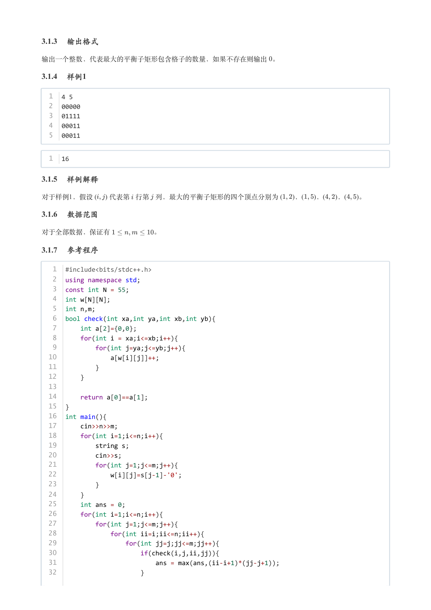

### 提取文本

```
3.1.3 输出格式

输出一个整数，代表最大的平衡子矩形包含格子的数量，如果不存在则输出 。

3.1.4 样例1

  1  4 5
  2  00000
  3  01111
  4  00011
  5  00011


  1  16

3.1.5 样例解释

对于样例1，假设 (    ) 代表第 行第 列，最大的平衡子矩形的四个顶点分别为 (   )，(   )，(   )，(  )。

3.1.6 数据范围

对于全部数据，保证有      。

3.1.7 参考程序

   1  #include<bits/stdc++.h>
   2  using namespace std;
   3  const int N = 55;
   4  int w[N][N];
   5  int n,m;
   6  bool check(int xa,int ya,int xb,int yb){
   7      int a[2]={0,0};
   8      for(int i = xa;i<=xb;i++){
   9          for(int j=ya;j<=yb;j++){
  10              a[w[i][j]]++;
  11          }
  12      }
  13
  14      return a[0]==a[1];
  15  }
  16  int main(){
  17      cin>>n>>m;
  18      for(int i=1;i<=n;i++){
  19          string s;
  20          cin>>s;
  21          for(int j=1;j<=m;j++){
  22              w[i][j]=s[j-1]-'0';
  23          }
  24      }
  25      int ans = 0;
  26      for(int i=1;i<=n;i++){
  27          for(int j=1;j<=m;j++){
  28              for(int ii=i;ii<=n;ii++){
  29                  for(int jj=j;jj<=m;jj++){
  30                      if(check(i,j,ii,jj)){
  31                          ans = max(ans,(ii-i+1)*(jj-j+1));
  32                      }
```

## 第 11 页

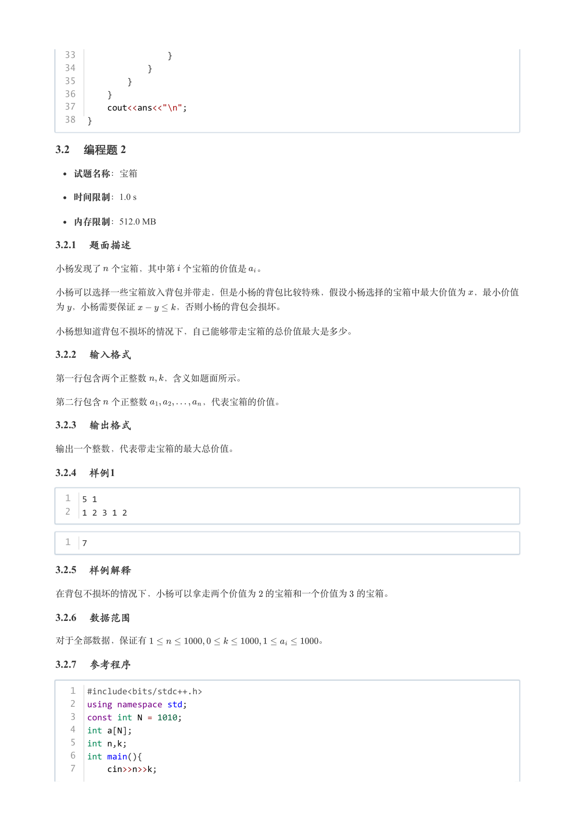

### 提取文本

```
33                  }
  34              }
  35          }
  36      }
  37      cout<<ans<<"\n";
  38  }

3.2 编程题 2

  试题名称：宝箱

   时间限制：1.0 s

   内存限制：512.0 MB

3.2.1 题面描述

小杨发现了 个宝箱，其中第 个宝箱的价值是 。


小杨可以选择一些宝箱放入背包并带走，但是小杨的背包比较特殊，假设小杨选择的宝箱中最大价值为 ，最小价值

为 ，小杨需要保证    ，否则小杨的背包会损坏。


小杨想知道背包不损坏的情况下，自己能够带走宝箱的总价值最大是多少。

3.2.2 输入格式

第一行包含两个正整数  ，含义如题面所示。


第二行包含 个正整数      ，代表宝箱的价值。

3.2.3 输出格式

输出一个整数，代表带走宝箱的最大总价值。

3.2.4 样例1

  1  5 1
  2  1 2 3 1 2


  1  7

3.2.5 样例解释

在背包不损坏的情况下，小杨可以拿走两个价值为 的宝箱和一个价值为 的宝箱。

3.2.6 数据范围

对于全部数据，保证有                   。

3.2.7 参考程序

   1  #include<bits/stdc++.h>
   2  using namespace std;
   3  const int N = 1010;
   4  int a[N];
   5  int n,k;
   6  int main(){
   7      cin>>n>>k;
```

## 第 12 页

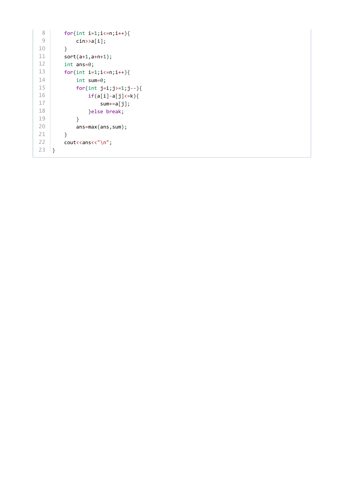

### 提取文本

```
8      for(int i=1;i<=n;i++){
 9          cin>>a[i];
10      }
11      sort(a+1,a+n+1);
12      int ans=0;
13      for(int i=1;i<=n;i++){
14          int sum=0;
15          for(int j=i;j>=1;j--){
16              if(a[i]-a[j]<=k){
17                  sum+=a[j];
18              }else break;
19          }
20          ans=max(ans,sum);
21      }
22      cout<<ans<<"\n";
23  }
```
