# 2024年6月-C++5级

- 原始 PDF：[`pdfs/2024年6月-C++5级.pdf`](../pdfs/2024年6月-C++5级.pdf)
- 页数：11
- 转换脚本：[`scripts/convert_pdfs_to_markdown.py`](../scripts/convert_pdfs_to_markdown.py)

> 为尽量避免信息丢失，每页均附带页面图片；文本提取结果保留原有顺序与换行特征，个别公式、图形、特殊排版请以页面图片为准。

## 第 1 页

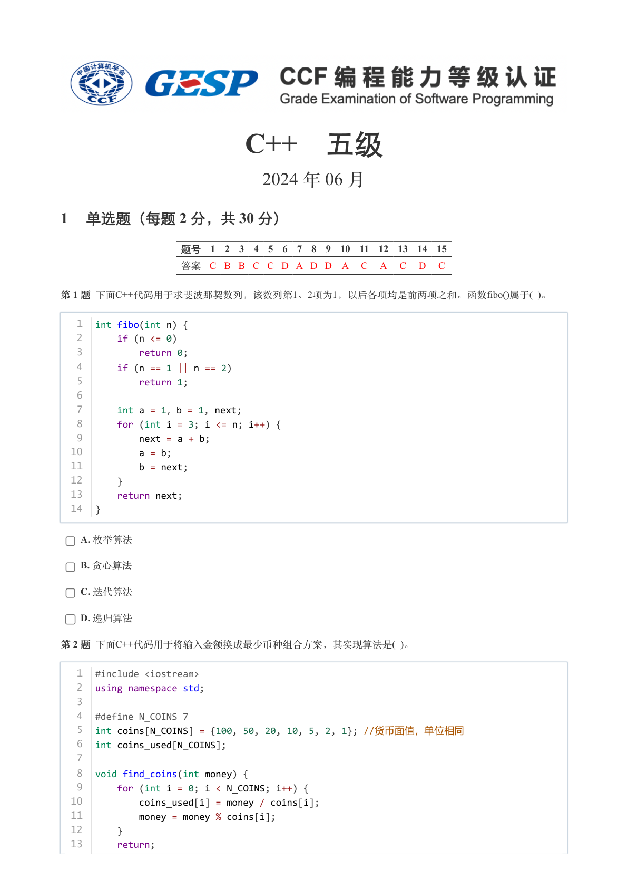

### 提取文本

```
C++　五级

                      2024 年 06 月

1 单选题（每题 2 分，共 30 分）


            题号  1  2  3  4  5  6  7  8  9  10  11  12  13  14  15
            答案 C B B C C D A D D A  C  A  C  D  C


第 1 题 下面C++代码用于求斐波那契数列，该数列第1、2项为1，以后各项均是前两项之和。函数fibo()属于( )。


   1  int fibo(int n) {
   2      if (n <= 0)
   3          return 0;
   4      if (n == 1 || n == 2)
   5          return 1;
   6
   7      int a = 1，b = 1, next;
   8      for (int i = 3; i <= n; i++) {
   9          next = a + b;
  10          a = b;
  11          b = next;
  12      }
  13      return next;
  14  }


    A. 枚举算法

    B. 贪心算法

    C. 迭代算法

    D. 递归算法

第 2 题 下面C++代码用于将输入金额换成最少币种组合方案，其实现算法是( )。


   1  #include <iostream>
   2  using namespace std;
   3
   4  #define N_COINS 7
   5  int coins[N_COINS] = {100, 50, 20, 10, 5, 2, 1}; //货币面值，单位相同
   6  int coins_used[N_COINS];
   7
   8  void find_coins(int money) {
   9      for (int i = 0; i < N_COINS; i++) {
  10          coins_used[i] = money / coins[i];
  11          money = money % coins[i];
  12      }
  13      return;
```

## 第 2 页

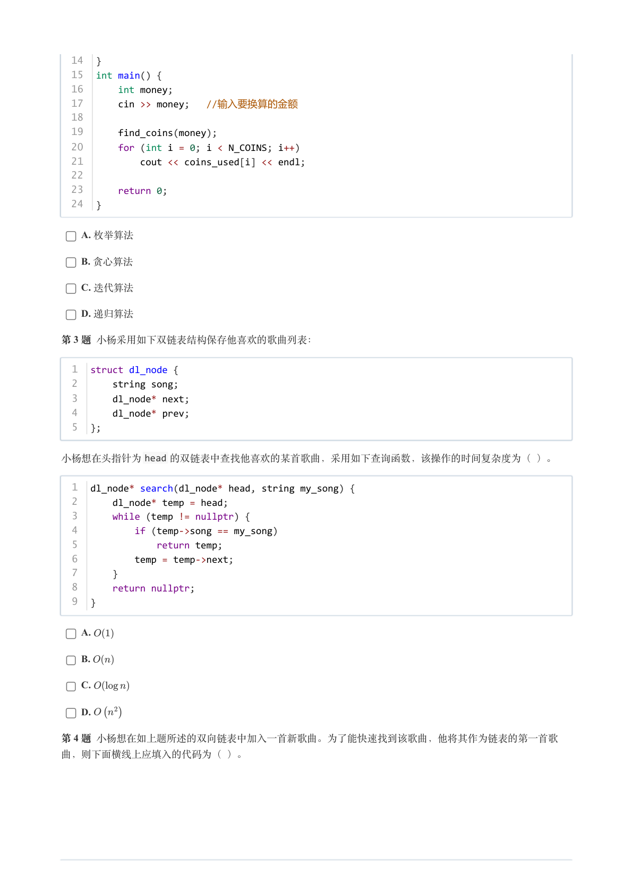

### 提取文本

```
14  }
  15  int main() {
  16      int money;
  17      cin >> money;  //输入要换算的金额
  18
  19      find_coins(money);
  20      for (int i = 0; i < N_COINS; i++)
  21          cout << coins_used[i] << endl;
  22
  23      return 0;
  24  }


    A. 枚举算法

    B. 贪心算法

    C. 迭代算法

    D. 递归算法

第 3 题 小杨采用如下双链表结构保存他喜欢的歌曲列表：


  1  struct dl_node {
  2      string song;
  3      dl_node* next;
  4      dl_node* prev;
  5  };


小杨想在头指针为head 的双链表中查找他喜欢的某首歌曲，采用如下查询函数，该操作的时间复杂度为（ ）。


  1  dl_node* search(dl_node* head, string my_song) {
  2      dl_node* temp = head;
  3      while (temp != nullptr) {
  4          if (temp->song == my_song)
  5              return temp;
  6          temp = temp->next;
  7      }
  8      return nullptr;
  9  }


    A.

    B.

    C.

    D.

第 4 题 小杨想在如上题所述的双向链表中加入一首新歌曲。为了能快速找到该歌曲，他将其作为链表的第一首歌

曲，则下面横线上应填入的代码为（ ）。
```

## 第 3 页

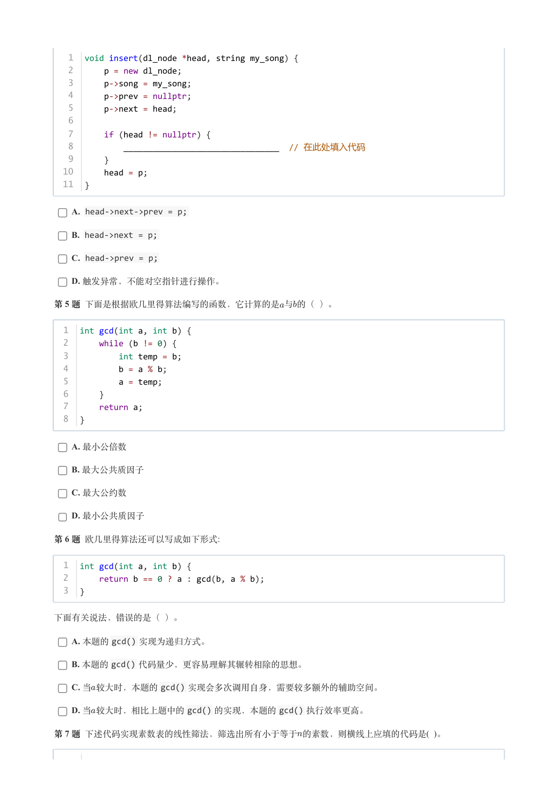

### 提取文本

```
1  void insert(dl_node *head, string my_song) {
   2      p = new dl_node;
   3      p->song = my_song;
   4      p->prev = nullptr;
   5      p->next = head;
   6
   7      if (head != nullptr) {
   8          ________________________________  // 在此处填入代码
   9      }
  10      head = p;
  11  }


    A. head->next->prev = p;

    B. head->next = p;

    C. head->prev = p;

    D. 触发异常，不能对空指针进行操作。

第 5 题 下面是根据欧几里得算法编写的函数，它计算的是与的（ ）。


  1  int gcd(int a, int b) {
  2      while (b != 0) {
  3          int temp = b;
  4          b = a % b;
  5          a = temp;
  6      }
  7      return a;
  8  }


    A. 最小公倍数

    B. 最大公共质因子

    C. 最大公约数

    D. 最小公共质因子

第 6 题 欧几里得算法还可以写成如下形式:


  1  int gcd(int a, int b) {
  2      return b == 0 ? a : gcd(b, a % b);
  3  }


下面有关说法，错误的是（ ）。

    A. 本题的gcd() 实现为递归方式。

    B. 本题的gcd() 代码量少，更容易理解其辗转相除的思想。

    C. 当较大时，本题的gcd() 实现会多次调用自身，需要较多额外的辅助空间。

    D. 当较大时，相比上题中的gcd() 的实现，本题的gcd() 执行效率更高。

第 7 题 下述代码实现素数表的线性筛法，筛选出所有小于等于的素数，则横线上应填的代码是( )。
```

## 第 4 页

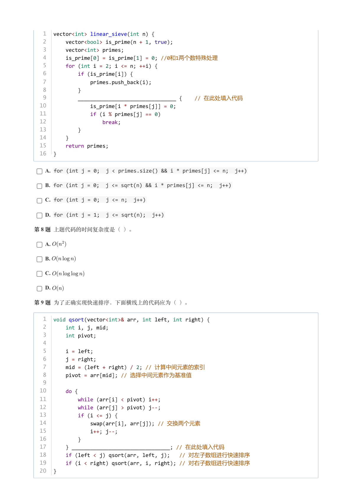

### 提取文本

```
1  vector<int> linear_sieve(int n) {
   2      vector<bool> is_prime(n + 1, true);
   3      vector<int> primes;
   4      is_prime[0] = is_prime[1] = 0; //0和1两个数特殊处理
   5      for (int i = 2; i <= n; ++i) {
   6          if (is_prime[i]) {
   7              primes.push_back(i);
   8          }
   9          ________________________________ {    // 在此处填入代码
  10              is_prime[i * primes[j]] = 0;
  11              if (i % primes[j] == 0)
  12                  break;
  13          }
  14      }
  15      return primes;
  16  }


    A. for (int j = 0;  j < primes.size() && i * primes[j] <= n;  j++)

    B. for (int j = 0;  j <= sqrt(n) && i * primes[j] <= n;  j++)

    C. for (int j = 0;  j <= n;  j++)

    D. for (int j = 1;  j <= sqrt(n);  j++)

第 8 题 上题代码的时间复杂度是（ ）。

    A.

    B.

    C.

    D.

第 9 题 为了正确实现快速排序，下面横线上的代码应为（ ）。


   1  void qsort(vector<int>& arr, int left, int right) {
   2      int i, j, mid;
   3      int pivot;
   4
   5      i = left;
   6      j = right;
   7      mid = (left + right) / 2; // 计算中间元素的索引
   8      pivot = arr[mid]; // 选择中间元素作为基准值
   9
  10      do {
  11          while (arr[i] < pivot) i++;
  12          while (arr[j] > pivot) j--;
  13          if (i <= j) {
  14              swap(arr[i], arr[j]); // 交换两个元素
  15              i++; j--;
  16          }
  17      } ________________________________; // 在此处填入代码
  18      if (left < j) qsort(arr, left, j);   // 对左子数组进行快速排序
  19      if (i < right) qsort(arr, i, right); // 对右子数组进行快速排序
  20  }
```

## 第 5 页

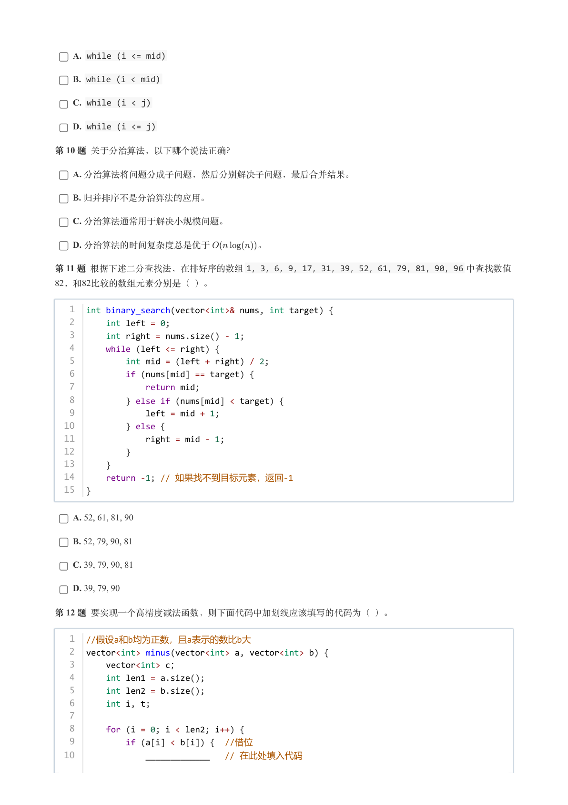

### 提取文本

```
A. while (i <= mid)

    B. while (i < mid)

    C. while (i < j)

    D. while (i <= j)

第 10 题 关于分治算法，以下哪个说法正确？

    A. 分治算法将问题分成子问题，然后分别解决子问题，最后合并结果。

    B. 归并排序不是分治算法的应用。

    C. 分治算法通常用于解决小规模问题。

    D. 分治算法的时间复杂度总是优于     。

第 11 题 根据下述二分查找法，在排好序的数组1，3，6，9，17，31，39，52，61，79，81，90，96 中查找数值
82，和82比较的数组元素分别是（ ）。


   1  int binary_search(vector<int>& nums, int target) {
   2      int left = 0;
   3      int right = nums.size() - 1;
   4      while (left <= right) {
   5          int mid = (left + right) / 2;
   6          if (nums[mid] == target) {
   7              return mid;
   8          } else if (nums[mid] < target) {
   9              left = mid + 1;
  10          } else {
  11              right = mid - 1;
  12          }
  13      }
  14      return -1; // 如果找不到目标元素，返回-1
  15  }


    A. 52, 61, 81, 90

    B. 52, 79, 90, 81

    C. 39, 79, 90, 81

    D. 39, 79, 90

第 12 题 要实现一个高精度减法函数，则下面代码中加划线应该填写的代码为（ ）。

   1 //假设a和b均为正数，且a表示的数比b大
   2  vector<int> minus(vector<int> a, vector<int> b) {
   3      vector<int> c；
   4      int len1 = a.size();
   5      int len2 = b.size();
   6      int i, t;
   7
   8      for (i = 0; i < len2; i++) {
   9          if (a[i] < b[i]) { //借位
  10              _____________   // 在此处填入代码
```

## 第 6 页

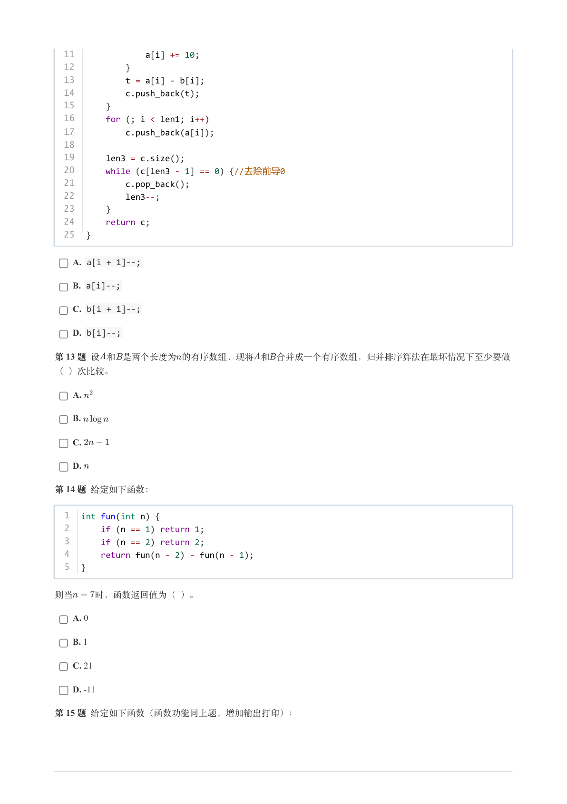

### 提取文本

```
11              a[i] += 10;
  12          }
  13          t = a[i] - b[i];
  14          c.push_back(t);
  15      }
  16      for (; i < len1; i++)
  17          c.push_back(a[i]);
  18
  19      len3 = c.size();
  20      while (c[len3 - 1] == 0) {//去除前导0
  21          c.pop_back();
  22          len3--;
  23      }
  24      return c;
  25  }


    A. a[i + 1]--;

    B. a[i]--;

    C. b[i + 1]--;

    D. b[i]--;

第 13 题 设和是两个长度为的有序数组，现将和合并成一个有序数组，归并排序算法在最坏情况下至少要做

（ ）次比较。

    A.

    B.

    C.

    D.

第 14 题 给定如下函数：


  1  int fun(int n) {
  2      if (n == 1) return 1;
  3      if (n == 2) return 2;
  4      return fun(n - 2) - fun(n - 1);
  5  }


则当  时，函数返回值为（ ）。

    A. 0

    B. 1

    C. 21

    D. -11

第 15 题 给定如下函数（函数功能同上题，增加输出打印）：
```

## 第 7 页

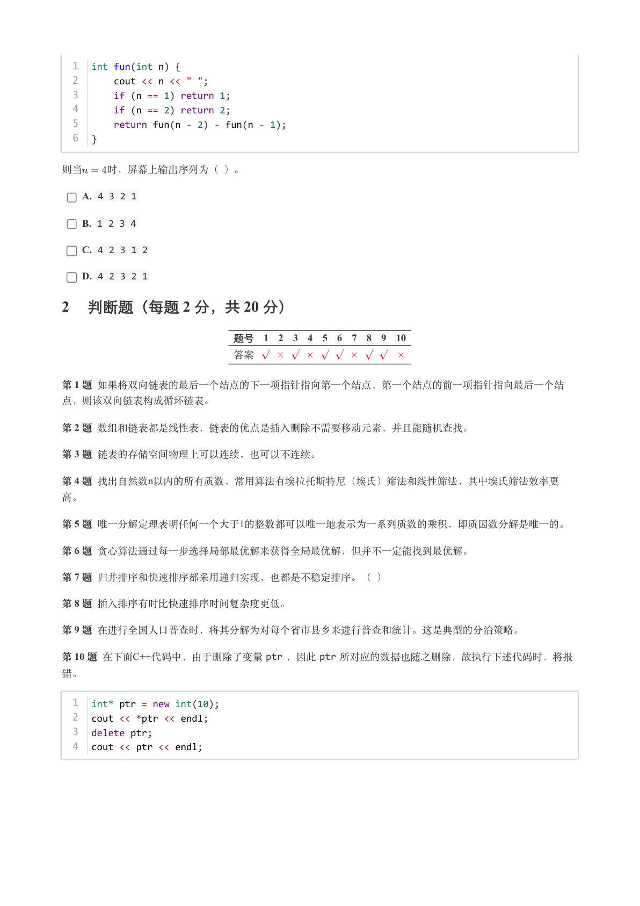

### 提取文本

```
1  int fun(int n) {
  2      cout << n << " ";
  3      if (n == 1) return 1;
  4      if (n == 2) return 2;
  5      return fun(n - 2) - fun(n - 1);
  6  }


则当  时，屏幕上输出序列为（ ）。

    A. 4 3 2 1

    B. 1 2 3 4

    C. 4 2 3 1 2

    D. 4 2 3 2 1

2 判断题（每题 2 分，共 20 分）


                 题号  1  2  3  4  5  6  7  8  9  10

                 答案


第 1 题 如果将双向链表的最后一个结点的下一项指针指向第一个结点，第一个结点的前一项指针指向最后一个结

点，则该双向链表构成循环链表。

第 2 题 数组和链表都是线性表，链表的优点是插入删除不需要移动元素，并且能随机查找。

第 3 题 链表的存储空间物理上可以连续，也可以不连续。

第 4 题 找出自然数n以内的所有质数，常用算法有埃拉托斯特尼（埃氏）筛法和线性筛法，其中埃氏筛法效率更

高。

第 5 题 唯一分解定理表明任何一个大于1的整数都可以唯一地表示为一系列质数的乘积，即质因数分解是唯一的。

第 6 题 贪心算法通过每一步选择局部最优解来获得全局最优解，但并不一定能找到最优解。

第 7 题 归并排序和快速排序都采用递归实现，也都是不稳定排序。（ ）

第 8 题 插入排序有时比快速排序时间复杂度更低。

第 9 题 在进行全国人口普查时，将其分解为对每个省市县乡来进行普查和统计。这是典型的分治策略。

第 10 题 在下面C++代码中，由于删除了变量ptr ，因此ptr 所对应的数据也随之删除，故执行下述代码时，将报

错。


  1  int* ptr = new int(10);
  2  cout << *ptr << endl;
  3  delete ptr;
  4  cout << ptr << endl;
```

## 第 8 页

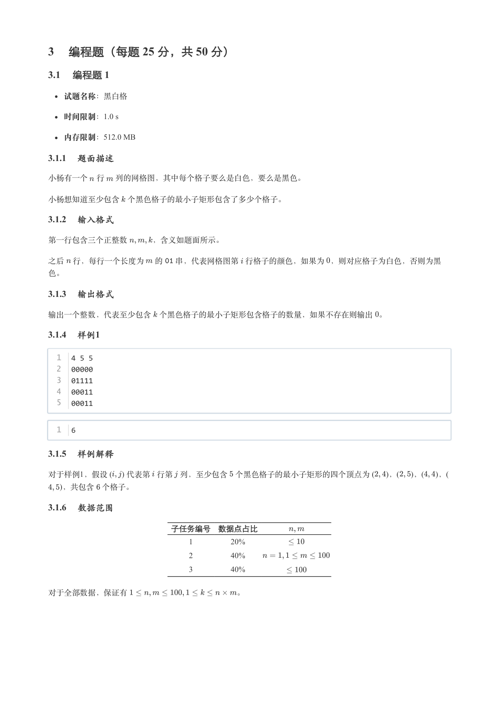

### 提取文本

```
3 编程题（每题 25 分，共 50 分）

3.1 编程题 1


  试题名称：黑白格

   时间限制：1.0 s

   内存限制：512.0 MB

3.1.1 题面描述

小杨有一个 行 列的网格图，其中每个格子要么是白色，要么是黑色。


小杨想知道至少包含 个黑色格子的最小子矩形包含了多少个格子。

3.1.2 输入格式

第一行包含三个正整数   ，含义如题面所示。


之后 行，每行一个长度为 的  串，代表网格图第 行格子的颜色，如果为 ，则对应格子为白色，否则为黑

色。

3.1.3 输出格式

输出一个整数，代表至少包含 个黑色格子的最小子矩形包含格子的数量，如果不存在则输出 。

3.1.4 样例1

  1  4 5 5
  2  00000
  3  01111
  4  00011
  5  00011


  1  6

3.1.5 样例解释

对于样例1，假设 (    ) 代表第 行第 列，至少包含 个黑色格子的最小子矩形的四个顶点为 (   )，(   )，(   )，(
  )，共包含 个格子。

3.1.6 数据范围

                子任务编号 数据点占比

                                    1        20%

                                    2        40%

                                    3        40%


对于全部数据，保证有              。
```

## 第 9 页

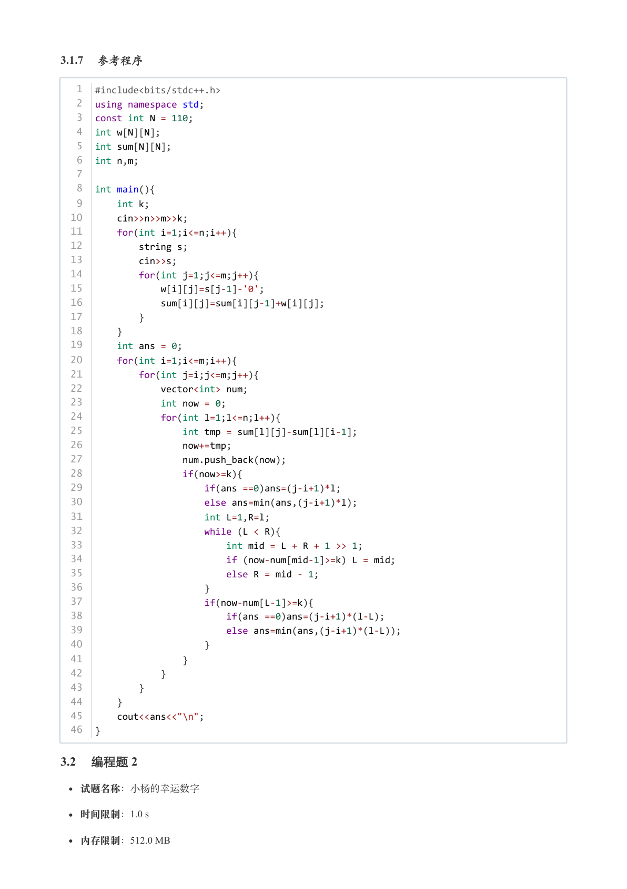

### 提取文本

```
3.1.7 参考程序

   1  #include<bits/stdc++.h>
   2  using namespace std;
   3  const int N = 110;
   4  int w[N][N];
   5  int sum[N][N];
   6  int n,m;
   7
   8  int main(){
   9      int k;
  10      cin>>n>>m>>k;
  11      for(int i=1;i<=n;i++){
  12          string s;
  13          cin>>s;
  14          for(int j=1;j<=m;j++){
  15              w[i][j]=s[j-1]-'0';
  16              sum[i][j]=sum[i][j-1]+w[i][j];
  17          }
  18      }
  19      int ans = 0;
  20      for(int i=1;i<=m;i++){
  21          for(int j=i;j<=m;j++){
  22              vector<int> num;
  23              int now = 0;
  24              for(int l=1;l<=n;l++){
  25                  int tmp = sum[l][j]-sum[l][i-1];
  26                  now+=tmp;
  27                  num.push_back(now);
  28                  if(now>=k){
  29                      if(ans ==0)ans=(j-i+1)*l;
  30                      else ans=min(ans,(j-i+1)*l);
  31                      int L=1,R=l;
  32                      while (L < R){
  33                          int mid = L + R + 1 >> 1;
  34                          if (now-num[mid-1]>=k) L = mid;
  35                          else R = mid - 1;
  36                      }
  37                      if(now-num[L-1]>=k){
  38                          if(ans ==0)ans=(j-i+1)*(l-L);
  39                          else ans=min(ans,(j-i+1)*(l-L));
  40                      }
  41                  }
  42              }
  43          }
  44      }
  45      cout<<ans<<"\n";
  46  }

3.2 编程题 2


  试题名称：小杨的幸运数字

   时间限制：1.0 s

   内存限制：512.0 MB
```

## 第 10 页

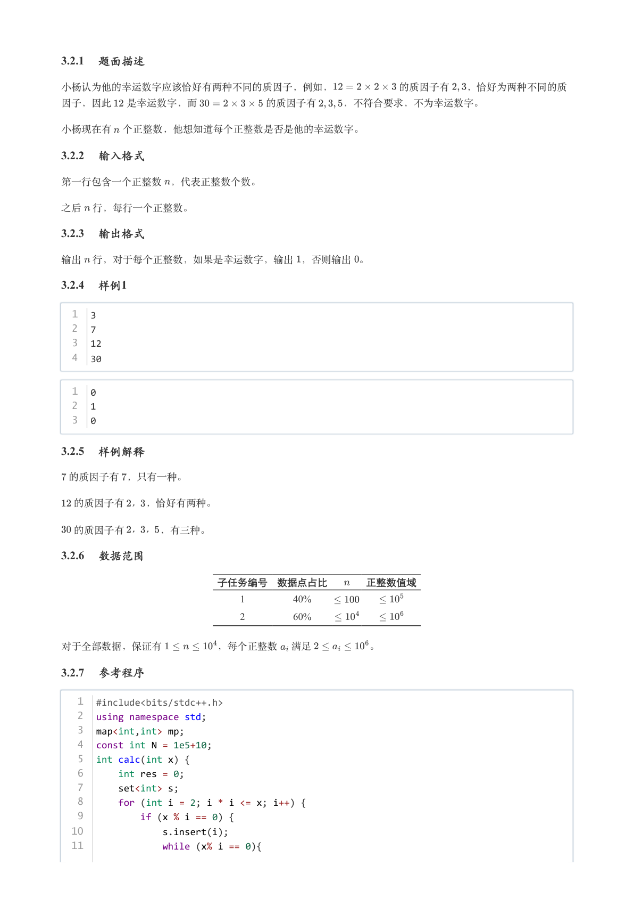

### 提取文本

```
3.2.1 题面描述

小杨认为他的幸运数字应该恰好有两种不同的质因子，例如，       的质因子有  ，恰好为两种不同的质

因子，因此  是幸运数字，而       的质因子有   ，不符合要求，不为幸运数字。


小杨现在有 个正整数，他想知道每个正整数是否是他的幸运数字。

3.2.2 输入格式

第一行包含一个正整数 ，代表正整数个数。


之后 行，每行一个正整数。

3.2.3 输出格式

输出 行，对于每个正整数，如果是幸运数字，输出 ，否则输出 。

3.2.4 样例1

  1  3
  2  7
  3  12
  4  30


  1  0
  2  1
  3  0

3.2.5 样例解释

 的质因子有 ，只有一种。


 的质因子有 ， ，恰好有两种。


 的质因子有 ，， ，有三种。

3.2.6 数据范围

                子任务编号 数据点占比    正整数值域

                                    1        40%

                                    2        60%


对于全部数据，保证有      ，每个正整数 满足      。

3.2.7 参考程序

   1  #include<bits/stdc++.h>
   2  using namespace std;
   3  map<int,int> mp;
   4  const int N = 1e5+10;
   5  int calc(int x) {
   6      int res = 0;
   7      set<int> s;
   8      for (int i = 2; i * i <= x; i++) {
   9          if (x % i == 0) {
  10              s.insert(i);
  11              while (x% i == 0){
```

## 第 11 页

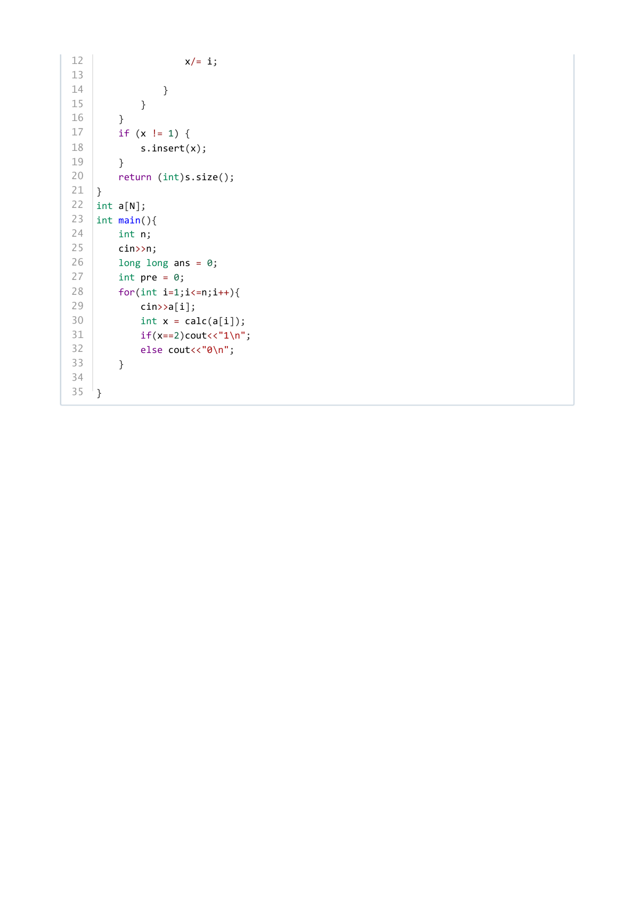

### 提取文本

```
12                  x/= i;
13
14              }
15          }
16      }
17      if (x != 1) {
18          s.insert(x);
19      }
20      return (int)s.size();
21  }
22  int a[N];
23  int main(){
24      int n;
25      cin>>n;
26      long long ans = 0;
27      int pre = 0;
28      for(int i=1;i<=n;i++){
29          cin>>a[i];
30          int x = calc(a[i]);
31          if(x==2)cout<<"1\n";
32          else cout<<"0\n";
33      }
34
35  }
```
