# 2024年6月-C++6级

- 原始 PDF：[`pdfs/2024年6月-C++6级.pdf`](../pdfs/2024年6月-C++6级.pdf)
- 页数：12
- 转换脚本：[`scripts/convert_pdfs_to_markdown.py`](../scripts/convert_pdfs_to_markdown.py)

> 为尽量避免信息丢失，每页均附带页面图片；文本提取结果保留原有顺序与换行特征，个别公式、图形、特殊排版请以页面图片为准。

## 第 1 页

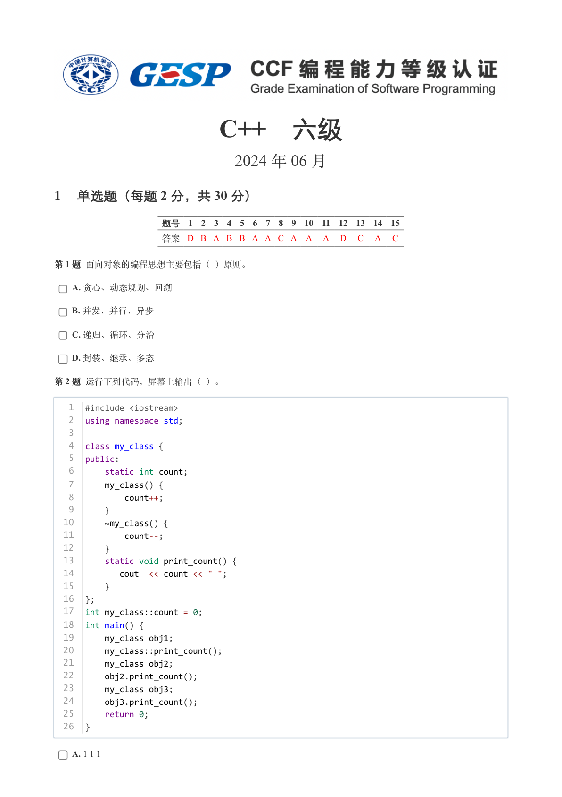

### 提取文本

```
C++　六级

                      2024 年 06 月

1 单选题（每题 2 分，共 30 分）


            题号  1  2  3  4  5  6  7  8  9  10  11  12  13  14  15
            答案 D B A B B A A C A A  A  D  C  A  C


第 1 题 面向对象的编程思想主要包括（ ）原则。

    A. 贪心、动态规划、回溯

    B. 并发、并行、异步

    C. 递归、循环、分治

    D. 封装、继承、多态

第 2 题 运行下列代码，屏幕上输出（ ）。


   1  #include <iostream>
   2  using namespace std;
   3
   4  class my_class {
   5  public:
   6      static int count;
   7      my_class() {
   8          count++;
   9      }
  10      ~my_class() {
  11          count--;
  12      }
  13      static void print_count() {
  14         cout  << count << " ";
  15      }
  16  };
  17  int my_class::count = 0;
  18  int main() {
  19      my_class obj1;
  20      my_class::print_count();
  21      my_class obj2;
  22      obj2.print_count();
  23      my_class obj3;
  24      obj3.print_count();
  25      return 0;
  26  }


    A. 1 1 1
```

## 第 2 页

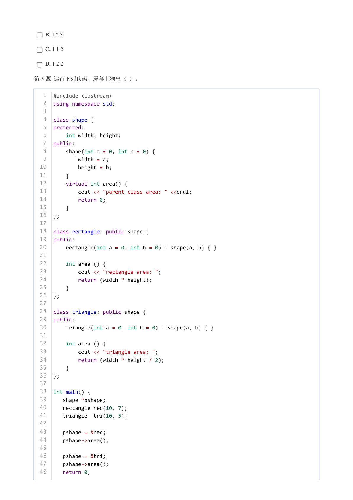

### 提取文本

```
B. 1 2 3

    C. 1 1 2

    D. 1 2 2

第 3 题 运行下列代码，屏幕上输出（ ）。


   1  #include <iostream>
   2  using namespace std;
   3
   4  class shape {
   5  protected:
   6      int width, height;
   7  public:
   8      shape(int a = 0, int b = 0) {
   9          width = a;
  10          height = b;
  11      }
  12      virtual int area() {
  13          cout << "parent class area: " <<endl;
  14          return 0;
  15      }
  16  };
  17
  18  class rectangle: public shape {
  19  public:
  20      rectangle(int a = 0, int b = 0) : shape(a, b) { }
  21
  22      int area () {
  23          cout << "rectangle area: ";
  24          return (width * height);
  25      }
  26  };
  27
  28  class triangle: public shape {
  29  public:
  30      triangle(int a = 0, int b = 0) : shape(a, b) { }
  31
  32      int area () {
  33          cout << "triangle area: ";
  34          return (width * height / 2);
  35      }
  36  };
  37
  38  int main() {
  39     shape *pshape;
  40     rectangle rec(10, 7);
  41     triangle  tri(10, 5);
  42
  43     pshape = &rec;
  44     pshape->area();
  45
  46     pshape = &tri;
  47     pshape->area();
  48     return 0;
```

## 第 3 页

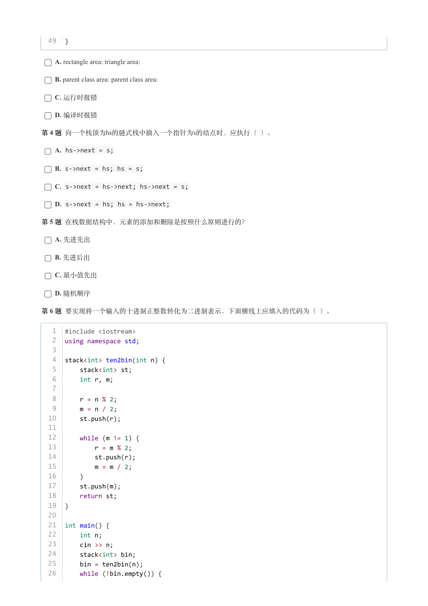

### 提取文本

```
49  }


    A. rectangle area: triangle area:

    B. parent class area: parent class area:

    C. 运行时报错

    D. 编译时报错

第 4 题 向一个栈顶为hs的链式栈中插入一个指针为s的结点时，应执行（ ）。

    A. hs->next = s;

    B. s->next = hs; hs = s;

    C. s->next = hs->next; hs->next = s;

    D. s->next = hs; hs = hs->next;

第 5 题 在栈数据结构中，元素的添加和删除是按照什么原则进行的？

    A. 先进先出

    B. 先进后出

    C. 最小值先出

    D. 随机顺序

第 6 题 要实现将一个输入的十进制正整数转化为二进制表示，下面横线上应填入的代码为（ ）。


   1  #include <iostream>
   2  using namespace std;
   3
   4  stack<int> ten2bin(int n) {
   5      stack<int> st;
   6      int r, m;
   7
   8      r = n % 2;
   9      m = n / 2;
  10      st.push(r);
  11
  12      while (m != 1) {
  13          r = m % 2;
  14          st.push(r);
  15          m = m / 2;
  16      }
  17      st.push(m);
  18      return st;
  19  }
  20
  21  int main() {
  22      int n;
  23      cin >> n;
  24      stack<int> bin;
  25      bin = ten2bin(n);
  26      while (!bin.empty()) {
```

## 第 4 页

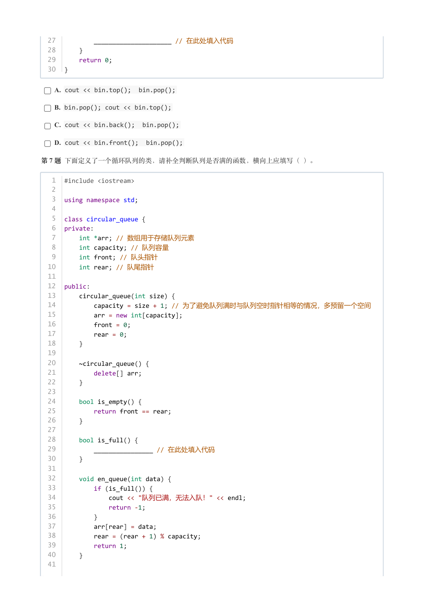

### 提取文本

```
27          _____________________ // 在此处填入代码
  28      }
  29      return 0;
  30  }


    A. cout << bin.top();  bin.pop();

    B. bin.pop(); cout << bin.top();

    C. cout << bin.back();  bin.pop();

    D. cout << bin.front();  bin.pop();

第 7 题 下面定义了一个循环队列的类，请补全判断队列是否满的函数，横向上应填写（ ）。


   1  #include <iostream>
   2
   3  using namespace std;
   4
   5  class circular_queue {
   6  private:
   7      int *arr; // 数组用于存储队列元素
   8      int capacity; // 队列容量
   9      int front; // 队头指针
  10      int rear; // 队尾指针
  11
  12  public:
  13      circular_queue(int size) {
  14          capacity = size + 1; // 为了避免队列满时与队列空时指针相等的情况，多预留一个空间
  15          arr = new int[capacity];
  16          front = 0;
  17          rear = 0;
  18      }
  19
  20      ~circular_queue() {
  21          delete[] arr;
  22      }
  23
  24      bool is_empty() {
  25          return front == rear;
  26      }
  27
  28      bool is_full() {
  29          ________________ // 在此处填入代码
  30      }
  31
  32      void en_queue(int data) {
  33          if (is_full()) {
  34              cout << "队列已满，无法入队！" << endl;
  35              return -1;
  36          }
  37          arr[rear] = data;
  38          rear = (rear + 1) % capacity;
  39          return 1;
  40      }
  41
```

## 第 5 页

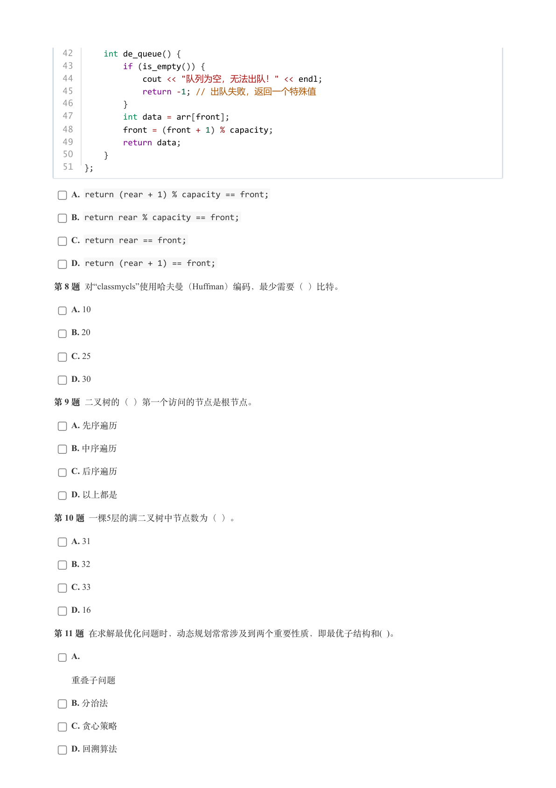

### 提取文本

```
42      int de_queue() {
  43          if (is_empty()) {
  44              cout << "队列为空，无法出队！" << endl;
  45              return -1; // 出队失败，返回一个特殊值
  46          }
  47          int data = arr[front];
  48          front = (front + 1) % capacity;
  49          return data;
  50      }
  51  };


    A. return (rear + 1) % capacity == front;

    B. return rear % capacity == front;

    C. return rear == front;

    D. return (rear + 1) == front;

第 8 题 对“classmycls”使用哈夫曼（Huffman）编码，最少需要（ ）比特。

    A. 10

    B. 20

    C. 25

    D. 30

第 9 题 二叉树的（ ）第一个访问的节点是根节点。

    A. 先序遍历

    B. 中序遍历

    C. 后序遍历

    D. 以上都是

第 10 题 一棵5层的满二叉树中节点数为（ ）。

    A. 31

    B. 32

    C. 33

    D. 16

第 11 题 在求解最优化问题时，动态规划常常涉及到两个重要性质，即最优子结构和( )。

    A.


  重叠子问题

    B. 分治法

    C. 贪心策略

    D. 回溯算法
```

## 第 6 页

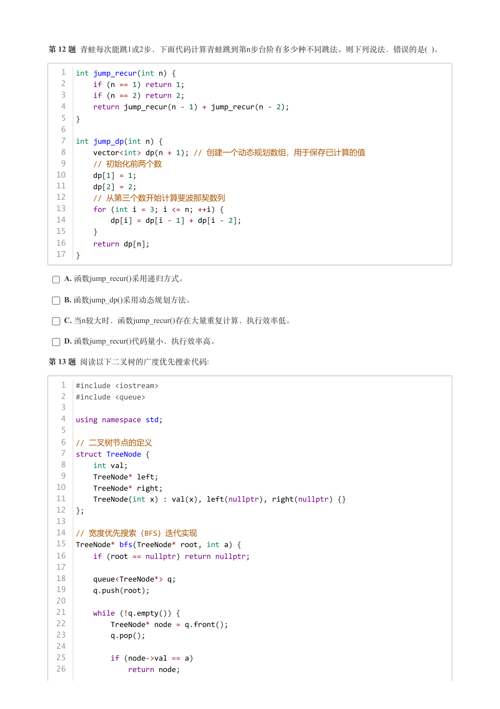

### 提取文本

```
第 12 题 青蛙每次能跳1或2步，下面代码计算青蛙跳到第n步台阶有多少种不同跳法。则下列说法，错误的是( )。


   1  int jump_recur(int n) {
   2      if (n == 1) return 1;
   3      if (n == 2) return 2;
   4      return jump_recur(n - 1) + jump_recur(n - 2);
   5  }
   6
   7  int jump_dp(int n) {
   8      vector<int> dp(n + 1); // 创建一个动态规划数组，用于保存已计算的值
   9      // 初始化前两个数
  10      dp[1] = 1;
  11      dp[2] = 2;
  12      // 从第三个数开始计算斐波那契数列
  13      for (int i = 3; i <= n; ++i) {
  14          dp[i] = dp[i - 1] + dp[i - 2];
  15      }
  16      return dp[n];
  17  }


    A. 函数jump_recur()采用递归方式。

    B. 函数jump_dp()采用动态规划方法。

    C. 当n较大时，函数jump_recur()存在大量重复计算，执行效率低。

    D. 函数jump_recur()代码量小，执行效率高。

第 13 题 阅读以下二叉树的广度优先搜索代码:


   1  #include <iostream>
   2  #include <queue>
   3
   4  using namespace std;
   5
   6  // 二叉树节点的定义
   7  struct TreeNode {
   8      int val;
   9      TreeNode* left;
  10      TreeNode* right;
  11      TreeNode(int x) : val(x), left(nullptr), right(nullptr) {}
  12  };
  13
  14  // 宽度优先搜索（BFS）迭代实现
  15  TreeNode* bfs(TreeNode* root, int a) {
  16      if (root == nullptr) return nullptr;
  17
  18      queue<TreeNode*> q;
  19      q.push(root);
  20
  21      while (!q.empty()) {
  22          TreeNode* node = q.front();
  23          q.pop();
  24
  25          if (node->val == a)
  26              return node;
```

## 第 7 页

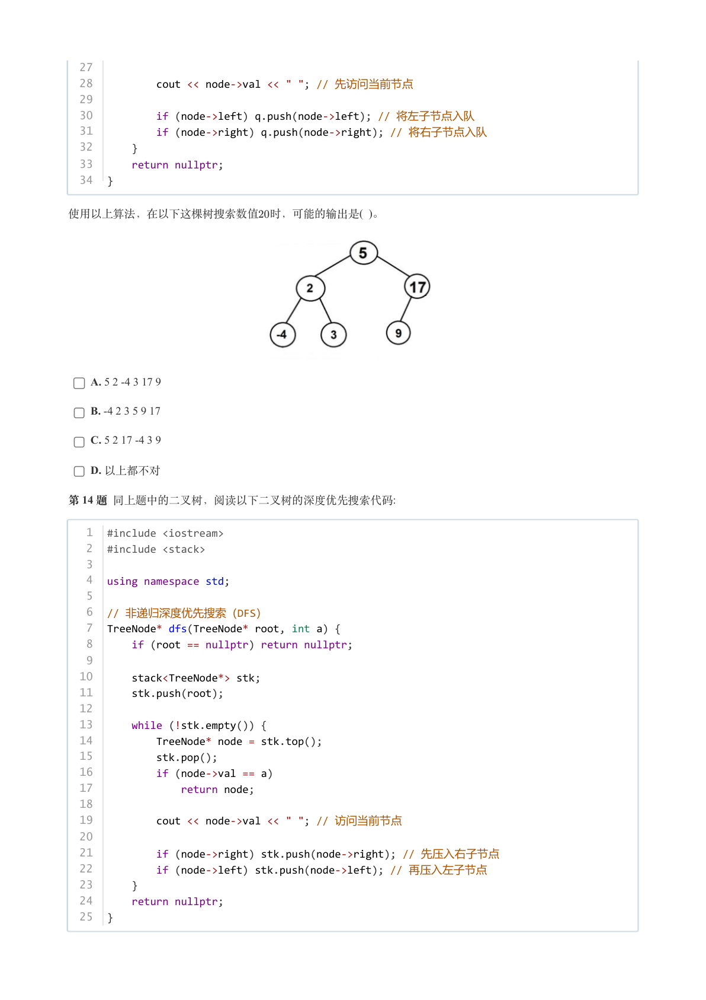

### 提取文本

```
27
  28          cout << node->val << " "; // 先访问当前节点
  29
  30          if (node->left) q.push(node->left); // 将左子节点入队
  31          if (node->right) q.push(node->right); // 将右子节点入队
  32      }
  33      return nullptr;
  34  }


使用以上算法，在以下这棵树搜索数值 时，可能的输出是( )。


    A. 5 2 -4 3 17 9

    B. -4 2 3 5 9 17

    C. 5 2 17 -4 3 9

    D. 以上都不对

第 14 题 同上题中的二叉树，阅读以下二叉树的深度优先搜索代码:


   1  #include <iostream>
   2  #include <stack>
   3
   4  using namespace std;
   5
   6  // 非递归深度优先搜索（DFS）
   7  TreeNode* dfs(TreeNode* root, int a) {
   8      if (root == nullptr) return nullptr;
   9
  10      stack<TreeNode*> stk;
  11      stk.push(root);
  12
  13      while (!stk.empty()) {
  14          TreeNode* node = stk.top();
  15          stk.pop();
  16          if (node->val == a)
  17              return node;
  18
  19          cout << node->val << " "; // 访问当前节点
  20
  21          if (node->right) stk.push(node->right); // 先压入右子节点
  22          if (node->left) stk.push(node->left); // 再压入左子节点
  23      }
  24      return nullptr;
  25  }
```

## 第 8 页

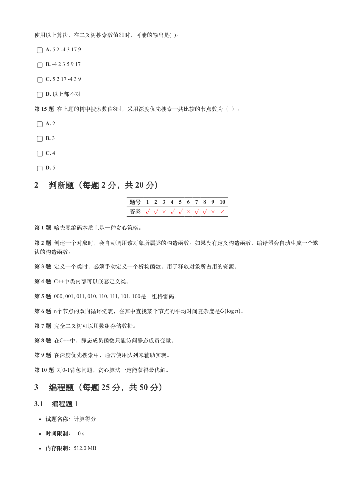

### 提取文本

```
使用以上算法，在二叉树搜索数值 时，可能的输出是( )。

    A. 5 2 -4 3 17 9

    B. -4 2 3 5 9 17

    C. 5 2 17 -4 3 9

    D. 以上都不对

第 15 题 在上题的树中搜索数值时，采用深度优先搜索一共比较的节点数为（ ）。

    A. 2

    B. 3

    C. 4

    D. 5

2 判断题（每题 2 分，共 20 分）

                 题号  1  2  3  4  5  6  7  8  9  10

                 答案


第 1 题 哈夫曼编码本质上是一种贪心策略。

第 2 题 创建一个对象时，会自动调用该对象所属类的构造函数。如果没有定义构造函数，编译器会自动生成一个默

认的构造函数。

第 3 题 定义一个类时，必须手动定义一个析构函数，用于释放对象所占用的资源。

第 4 题 C++中类内部可以嵌套定义类。

第 5 题 000, 001, 011, 010, 110, 111, 101, 100是一组格雷码。

第 6 题 n个节点的双向循环链表，在其中查找某个节点的平均时间复杂度是    。

第 7 题 完全二叉树可以用数组存储数据。

第 8 题 在C++中，静态成员函数只能访问静态成员变量。

第 9 题 在深度优先搜索中，通常使用队列来辅助实现。

第 10 题 对0-1背包问题，贪心算法一定能获得最优解。

3 编程题（每题 25 分，共 50 分）

3.1 编程题 1


  试题名称：计算得分

   时间限制：1.0 s

   内存限制：512.0 MB
```

## 第 9 页

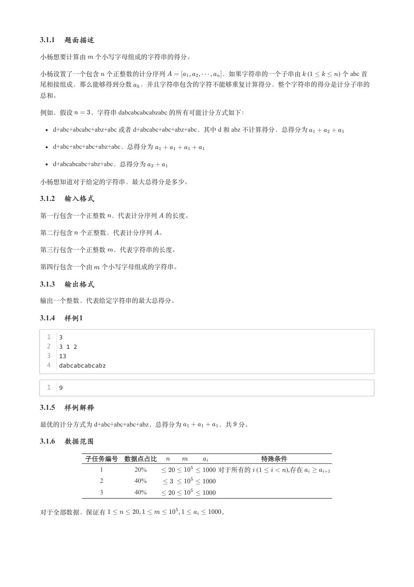

### 提取文本

```
3.1.1 题面描述

小杨想要计算由 个小写字母组成的字符串的得分。

小杨设置了一个包含 个正整数的计分序列         ，如果字符串的一个子串由   (             ) 个 abc 首

尾相接组成，那么能够得到分数 ，并且字符串包含的字符不能够重复计算得分，整个字符串的得分是计分子串的

总和。

例如，假设   ，字符串 dabcabcabcabzabc 的所有可能计分方式如下：

    d+abc+abcabc+abz+abc 或者 d+abcabc+abc+abz+abc，其中 d 和 abz 不计算得分，总得分为

   d+abc+abc+abc+abz+abc，总得分为

   d+abcabcabc+abz+abc，总得分为


小杨想知道对于给定的字符串，最大总得分是多少。

3.1.2 输入格式

第一行包含一个正整数 ，代表计分序列 的长度。


第二行包含 个正整数，代表计分序列 。


第三行包含一个正整数 ，代表字符串的长度。


第四行包含一个由 个小写字母组成的字符串。

3.1.3 输出格式

输出一个整数，代表给定字符串的最大总得分。

3.1.4 样例1

  1  3
  2  3 1 2
  3  13
  4  dabcabcabcabz


  1  9

3.1.5 样例解释

最优的计分方式为 d+abc+abc+abc+abz，总得分为      ，共 分。

3.1.6 数据范围

       子任务编号 数据点占比                特殊条件

                  1        20%           对于所有的   (      ),存在

                  2        40%

                  3        40%


对于全部数据，保证有                  。
```

## 第 10 页

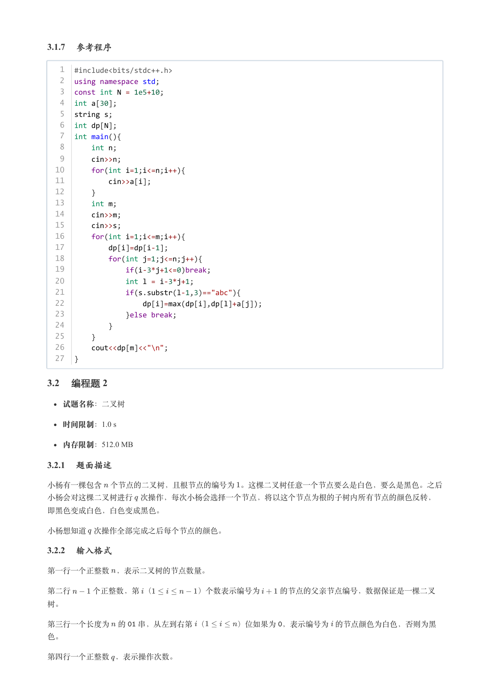

### 提取文本

```
3.1.7 参考程序

   1  #include<bits/stdc++.h>
   2  using namespace std;
   3  const int N = 1e5+10;
   4  int a[30];
   5  string s;
   6  int dp[N];
   7  int main(){
   8      int n;
   9      cin>>n;
  10      for(int i=1;i<=n;i++){
  11          cin>>a[i];
  12      }
  13      int m;
  14      cin>>m;
  15      cin>>s;
  16      for(int i=1;i<=m;i++){
  17          dp[i]=dp[i-1];
  18          for(int j=1;j<=n;j++){
  19              if(i-3*j+1<=0)break;
  20              int l = i-3*j+1;
  21              if(s.substr(l-1,3)=="abc"){
  22                  dp[i]=max(dp[i],dp[l]+a[j]);
  23              }else break;
  24          }
  25      }
  26      cout<<dp[m]<<"\n";
  27  }

3.2 编程题 2


  试题名称：二叉树

   时间限制：1.0 s

   内存限制：512.0 MB

3.2.1 题面描述

小杨有一棵包含 个节点的二叉树，且根节点的编号为 。这棵二叉树任意一个节点要么是白色，要么是黑色。之后

小杨会对这棵二叉树进行 次操作，每次小杨会选择一个节点，将以这个节点为根的子树内所有节点的颜色反转，

即黑色变成白色，白色变成黑色。


小杨想知道 次操作全部完成之后每个节点的颜色。

3.2.2 输入格式

第一行一个正整数 ，表示二叉树的节点数量。


第二行   个正整数，第 （      ）个数表示编号为   的节点的父亲节点编号，数据保证是一棵二叉

树。


第三行一个长度为 的  串，从左到右第 （    ）位如果为 ，表示编号为 的节点颜色为白色，否则为黑

色。


第四行一个正整数 ，表示操作次数。
```

## 第 11 页

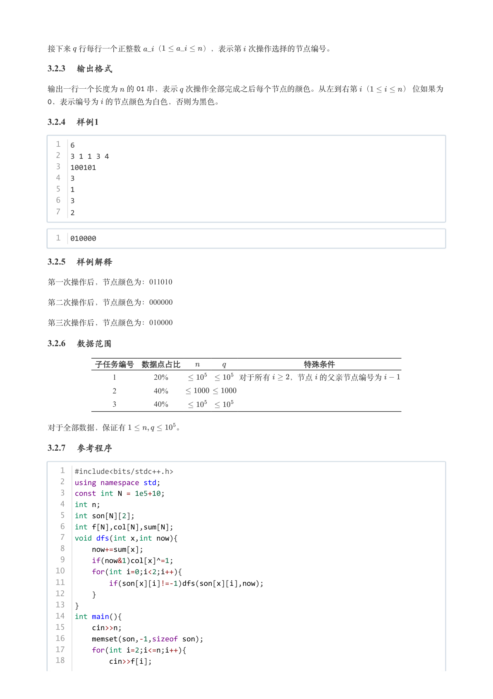

### 提取文本

```
接下来 行每行一个正整数  （     ），表示第 次操作选择的节点编号。

3.2.3 输出格式

输出一行一个长度为 的  串，表示 次操作全部完成之后每个节点的颜色。从左到右第 （    ） 位如果为

 ，表示编号为 的节点颜色为白色，否则为黑色。

3.2.4 样例1

  1  6
  2  3 1 1 3 4
  3  100101
  4  3
  5  1
  6  3
  7  2


  1  010000

3.2.5 样例解释

第一次操作后，节点颜色为：011010

第二次操作后，节点颜色为：000000

第三次操作后，节点颜色为：010000

3.2.6 数据范围

      子任务编号 数据点占比                特殊条件

                 1        20%         对于所有  ，节点 的父亲节点编号为

                 2        40%

                 3        40%


对于全部数据，保证有      。

3.2.7 参考程序

   1  #include<bits/stdc++.h>
   2  using namespace std;
   3  const int N = 1e5+10;
   4  int n;
   5  int son[N][2];
   6  int f[N],col[N],sum[N];
   7  void dfs(int x,int now){
   8      now+=sum[x];
   9      if(now&1)col[x]^=1;
  10      for(int i=0;i<2;i++){
  11          if(son[x][i]!=-1)dfs(son[x][i],now);
  12      }
  13  }
  14  int main(){
  15      cin>>n;
  16      memset(son,-1,sizeof son);
  17      for(int i=2;i<=n;i++){
  18          cin>>f[i];
```

## 第 12 页

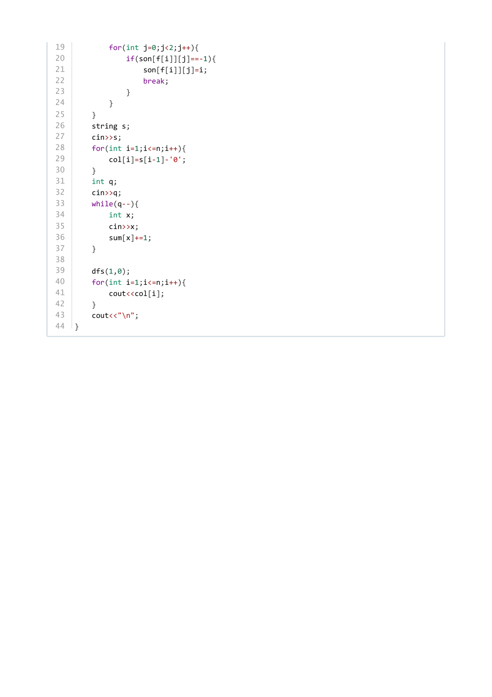

### 提取文本

```
19          for(int j=0;j<2;j++){
20              if(son[f[i]][j]==-1){
21                  son[f[i]][j]=i;
22                  break;
23              }
24          }
25      }
26      string s;
27      cin>>s;
28      for(int i=1;i<=n;i++){
29          col[i]=s[i-1]-'0';
30      }
31      int q;
32      cin>>q;
33      while(q--){
34          int x;
35          cin>>x;
36          sum[x]+=1;
37      }
38
39      dfs(1,0);
40      for(int i=1;i<=n;i++){
41          cout<<col[i];
42      }
43      cout<<"\n";
44  }
```
