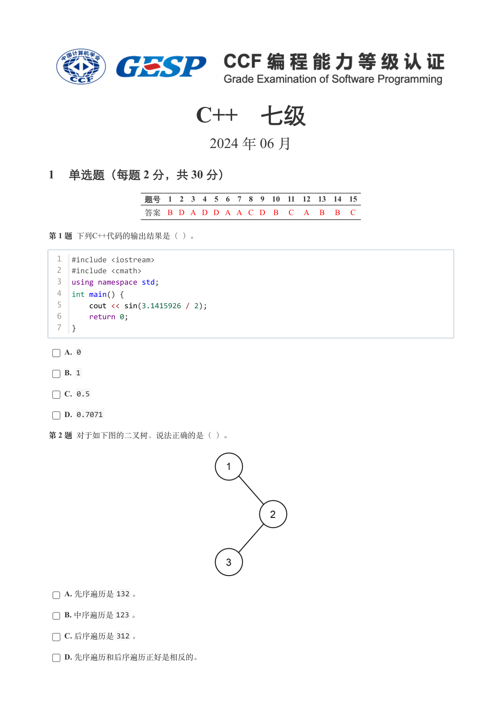
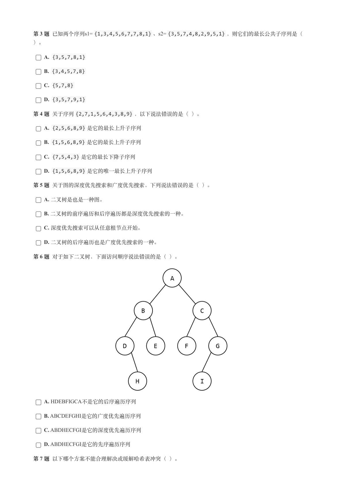
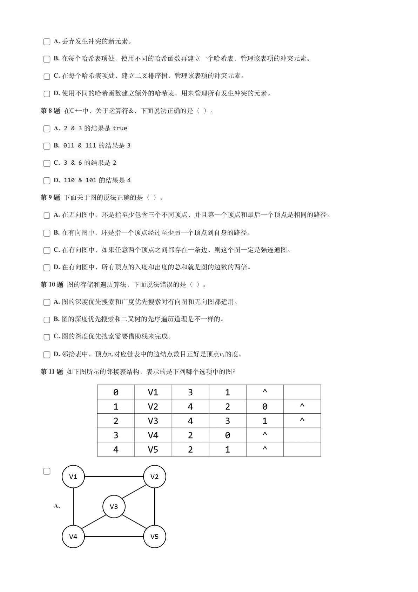
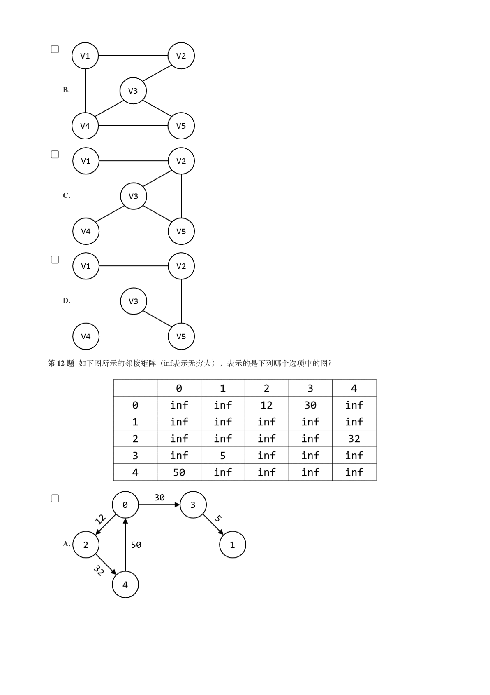
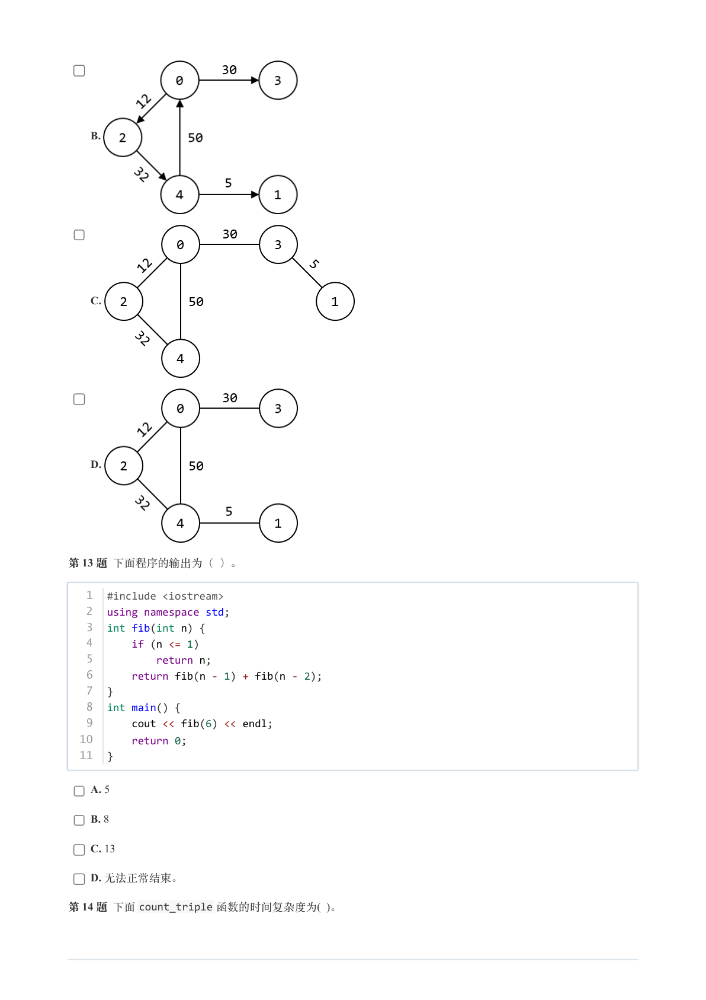
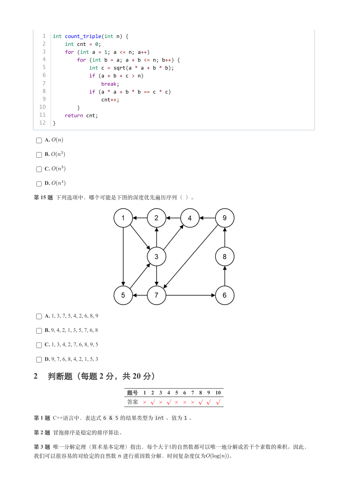
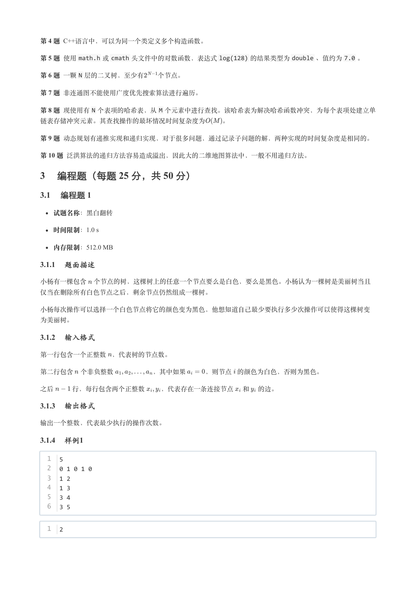
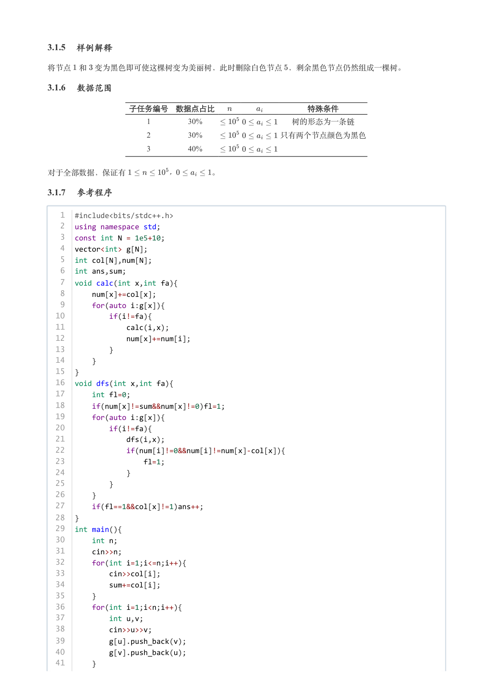
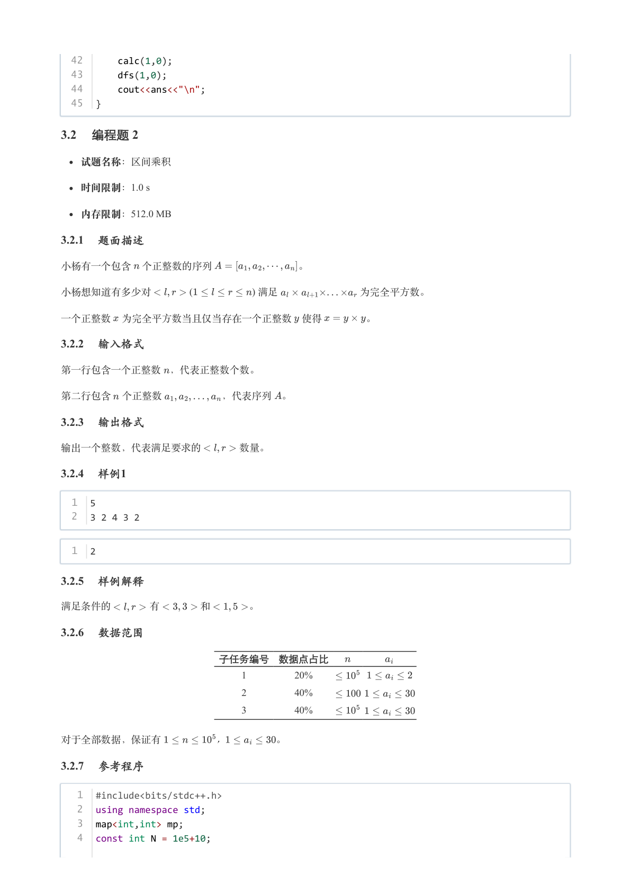
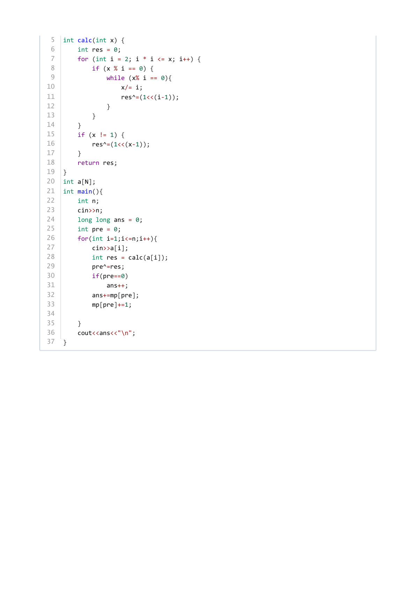

# 2024年6月-C++7级

- 原始 PDF：[`pdfs/2024年6月-C++7级.pdf`](../pdfs/2024年6月-C++7级.pdf)
- 页数：10
- 转换脚本：[`scripts/convert_pdfs_to_markdown.py`](../scripts/convert_pdfs_to_markdown.py)

> 为尽量避免信息丢失，每页均附带页面图片；文本提取结果保留原有顺序与换行特征，个别公式、图形、特殊排版请以页面图片为准。

## 第 1 页



### 提取文本

```
C++　七级

                      2024 年 06 月

1 单选题（每题 2 分，共 30 分）


            题号  1  2  3  4  5  6  7  8  9  10  11  12  13  14  15
            答案 B D A D D A A C D  B  C  A  B  B  C


第 1 题 下列C++代码的输出结果是（ ）。


  1  #include <iostream>
  2  #include <cmath>
  3  using namespace std;
  4  int main() {
  5      cout << sin(3.1415926 / 2);
  6      return 0;
  7  }


    A. 0

    B. 1

    C. 0.5

    D. 0.7071

第 2 题 对于如下图的二叉树，说法正确的是（ ）。


    A. 先序遍历是132 。

    B. 中序遍历是123 。

    C. 后序遍历是312 。

    D. 先序遍历和后序遍历正好是相反的。
```

## 第 2 页



### 提取文本

```
第 3 题 已知两个序列s1= {1,3,4,5,6,7,7,8,1} 、s2= {3,5,7,4,8,2,9,5,1} ，则它们的最长公共子序列是（

）。

    A. {3,5,7,8,1}

    B. {3,4,5,7,8}

    C. {5,7,8}

    D. {3,5,7,9,1}

第 4 题 关于序列{2,7,1,5,6,4,3,8,9} ，以下说法错误的是（ ）。

    A. {2,5,6,8,9} 是它的最长上升子序列

    B. {1,5,6,8,9} 是它的最长上升子序列

    C. {7,5,4,3} 是它的最长下降子序列

    D. {1,5,6,8,9} 是它的唯一最长上升子序列

第 5 题 关于图的深度优先搜索和广度优先搜索，下列说法错误的是（ ）。

    A. 二叉树是也是一种图。

    B. 二叉树的前序遍历和后序遍历都是深度优先搜索的一种。

    C. 深度优先搜索可以从任意根节点开始。

    D. 二叉树的后序遍历也是广度优先搜索的一种。

第 6 题 对于如下二叉树，下面访问顺序说法错误的是（ ）。


    A. HDEBFIGCA不是它的后序遍历序列

    B. ABCDEFGHI是它的广度优先遍历序列

    C. ABDHECFGI是它的深度优先遍历序列

    D. ABDHECFGI是它的先序遍历序列

第 7 题 以下哪个方案不能合理解决或缓解哈希表冲突（ ）。
```

## 第 3 页



### 提取文本

```
A. 丢弃发生冲突的新元素。

    B. 在每个哈希表项处，使用不同的哈希函数再建立一个哈希表，管理该表项的冲突元素。

    C. 在每个哈希表项处，建立二叉排序树，管理该表项的冲突元素。

    D. 使用不同的哈希函数建立额外的哈希表，用来管理所有发生冲突的元素。

第 8 题 在C++中，关于运算符&，下面说法正确的是（ ）。

    A. 2 & 3 的结果是true

    B. 011 & 111 的结果是3

    C. 3 & 6 的结果是2

    D. 110 & 101 的结果是4

第 9 题 下面关于图的说法正确的是（ ）。

    A. 在无向图中，环是指至少包含三个不同顶点，并且第一个顶点和最后一个顶点是相同的路径。

    B. 在有向图中，环是指一个顶点经过至少另一个顶点到自身的路径。

    C. 在有向图中，如果任意两个顶点之间都存在一条边，则这个图一定是强连通图。

    D. 在有向图中，所有顶点的入度和出度的总和就是图的边数的两倍。

第 10 题 图的存储和遍历算法，下面说法错误的是（ ）。

    A. 图的深度优先搜索和广度优先搜索对有向图和无向图都适用。

    B. 图的深度优先搜索和二叉树的先序遍历道理是不一样的。

    C. 图的深度优先搜索需要借助栈来完成。

    D. 邻接表中，顶点 对应链表中的边结点数目正好是顶点 的度。

第 11 题 如下图所示的邻接表结构，表示的是下列哪个选项中的图？


    A.
```

## 第 4 页



### 提取文本

```
B.


    C.


    D.


第 12 题 如下图所示的邻接矩阵（inf表示无穷大），表示的是下列哪个选项中的图？


    A.
```

## 第 5 页



### 提取文本

```
B.


    C.


    D.


第 13 题 下面程序的输出为（ ）。


   1  #include <iostream>
   2  using namespace std;
   3  int fib(int n) {
   4      if (n <= 1)
   5          return n;
   6      return fib(n - 1) + fib(n - 2);
   7  }
   8  int main() {
   9      cout << fib(6) << endl;
  10      return 0;
  11  }


    A. 5

    B. 8

    C. 13

    D. 无法正常结束。

第 14 题 下面count_triple 函数的时间复杂度为( )。
```

## 第 6 页



### 提取文本

```
1  int count_triple(int n) {
   2      int cnt = 0;
   3      for (int a = 1; a <= n; a++)
   4          for (int b = a; a + b <= n; b++) {
   5              int c = sqrt(a * a + b * b);
   6              if (a + b + c > n)
   7                  break;
   8              if (a * a + b * b == c * c)
   9                  cnt++;
  10          }
  11      return cnt;
  12  }


    A.

    B.

    C.

    D.

第 15 题 下列选项中，哪个可能是下图的深度优先遍历序列（ ）。


    A. 1, 3, 7, 5, 4, 2, 6, 8, 9

    B. 9, 4, 2, 1, 3, 5, 7, 6, 8

    C. 1, 3, 4, 2, 7, 6, 8, 9, 5

    D. 9, 7, 6, 8, 4, 2, 1, 5, 3

2 判断题（每题 2 分，共 20 分）

                 题号  1  2  3  4  5  6  7  8  9  10

                 答案


第 1 题 C++语言中，表达式6 & 5 的结果类型为int 、值为1 。

第 2 题 冒泡排序是稳定的排序算法。

第 3 题 唯一分解定理（算术基本定理）指出，每个大于1的自然数都可以唯一地分解成若干个素数的乘积。因此，
我们可以很容易的对给定的自然数n 进行质因数分解，时间复杂度仅为    。
```

## 第 7 页



### 提取文本

```
第 4 题 C++语言中，可以为同一个类定义多个构造函数。

第 5 题 使用math.h 或cmath 头文件中的对数函数，表达式log(128) 的结果类型为double 、值约为7.0 。

第 6 题 一颗N 层的二叉树，至少有  个节点。

第 7 题 非连通图不能使用广度优先搜索算法进行遍历。

第 8 题 现使用有N 个表项的哈希表，从M 个元素中进行查找。该哈希表为解决哈希函数冲突，为每个表项处建立单

链表存储冲突元素。其查找操作的最坏情况时间复杂度为   。

第 9 题 动态规划有递推实现和递归实现，对于很多问题，通过记录子问题的解，两种实现的时间复杂度是相同的。

第 10 题 泛洪算法的递归方法容易造成溢出，因此大的二维地图算法中，一般不用递归方法。

3 编程题（每题 25 分，共 50 分）

3.1 编程题 1


  试题名称：黑白翻转

   时间限制：1.0 s

   内存限制：512.0 MB

3.1.1 题面描述

小杨有一棵包含 个节点的树，这棵树上的任意一个节点要么是白色，要么是黑色。小杨认为一棵树是美丽树当且

仅当在删除所有白色节点之后，剩余节点仍然组成一棵树。


小杨每次操作可以选择一个白色节点将它的颜色变为黑色，他想知道自己最少要执行多少次操作可以使得这棵树变

为美丽树。

3.1.2 输入格式

第一行包含一个正整数 ，代表树的节点数。


第二行包含 个非负整数      ，其中如果   ，则节点 的颜色为白色，否则为黑色。


之后   行，每行包含两个正整数  ，代表存在一条连接节点 和 的边。

3.1.3 输出格式

输出一个整数，代表最少执行的操作次数。

3.1.4 样例1

  1  5
  2  0 1 0 1 0
  3  1 2
  4  1 3
  5  3 4
  6  3 5


  1  2
```

## 第 8 页



### 提取文本

```
3.1.5 样例解释

将节点 和 变为黑色即可使这棵树变为美丽树，此时删除白色节点 ，剩余黑色节点仍然组成一棵树。

3.1.6 数据范围

          子任务编号 数据点占比            特殊条件

                         1        30%           树的形态为一条链

                         2        30%          只有两个节点颜色为黑色

                         3        40%


对于全部数据，保证有      ，     。

3.1.7 参考程序

   1  #include<bits/stdc++.h>
   2  using namespace std;
   3  const int N = 1e5+10;
   4  vector<int> g[N];
   5  int col[N],num[N];
   6  int ans,sum;
   7  void calc(int x,int fa){
   8      num[x]+=col[x];
   9      for(auto i:g[x]){
  10          if(i!=fa){
  11              calc(i,x);
  12              num[x]+=num[i];
  13          }
  14      }
  15  }
  16  void dfs(int x,int fa){
  17      int fl=0;
  18      if(num[x]!=sum&&num[x]!=0)fl=1;
  19      for(auto i:g[x]){
  20          if(i!=fa){
  21              dfs(i,x);
  22              if(num[i]!=0&&num[i]!=num[x]-col[x]){
  23                  fl=1;
  24              }
  25          }
  26      }
  27      if(fl==1&&col[x]!=1)ans++;
  28  }
  29  int main(){
  30      int n;
  31      cin>>n;
  32      for(int i=1;i<=n;i++){
  33          cin>>col[i];
  34          sum+=col[i];
  35      }
  36      for(int i=1;i<n;i++){
  37          int u,v;
  38          cin>>u>>v;
  39          g[u].push_back(v);
  40          g[v].push_back(u);
  41      }
```

## 第 9 页



### 提取文本

```
42      calc(1,0);
  43      dfs(1,0);
  44      cout<<ans<<"\n";
  45  }

3.2 编程题 2


  试题名称：区间乘积

   时间限制：1.0 s

   内存限制：512.0 MB

3.2.1 题面描述

小杨有一个包含 个正整数的序列         。

小杨想知道有多少对            (                  ) 满足        为完全平方数。


一个正整数 为完全平方数当且仅当存在一个正整数 使得    。

3.2.2 输入格式

第一行包含一个正整数 ，代表正整数个数。


第二行包含 个正整数      ，代表序列 。

3.2.3 输出格式

输出一个整数，代表满足要求的    数量。

3.2.4 样例1

  1  5
  2  3 2 4 3 2


  1  2

3.2.5 样例解释

满足条件的    有    和    。

3.2.6 数据范围

                子任务编号 数据点占比

                                    1        20%

                                    2        40%

                                    3        40%


对于全部数据，保证有      ，     。

3.2.7 参考程序

   1  #include<bits/stdc++.h>
   2  using namespace std;
   3  map<int,int> mp;
   4  const int N = 1e5+10;
```

## 第 10 页



### 提取文本

```
5  int calc(int x) {
 6      int res = 0;
 7      for (int i = 2; i * i <= x; i++) {
 8          if (x % i == 0) {
 9              while (x% i == 0){
10                  x/= i;
11                  res^=(1<<(i-1));
12              }
13          }
14      }
15      if (x != 1) {
16          res^=(1<<(x-1));
17      }
18      return res;
19  }
20  int a[N];
21  int main(){
22      int n;
23      cin>>n;
24      long long ans = 0;
25      int pre = 0;
26      for(int i=1;i<=n;i++){
27          cin>>a[i];
28          int res = calc(a[i]);
29          pre^=res;
30          if(pre==0)
31              ans++;
32          ans+=mp[pre];
33          mp[pre]+=1;
34
35      }
36      cout<<ans<<"\n";
37  }
```
