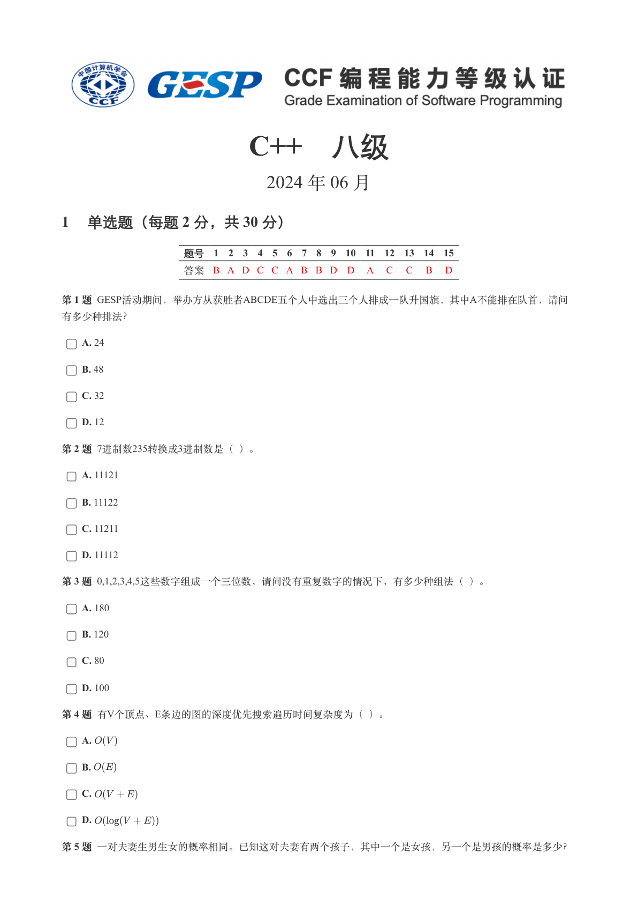
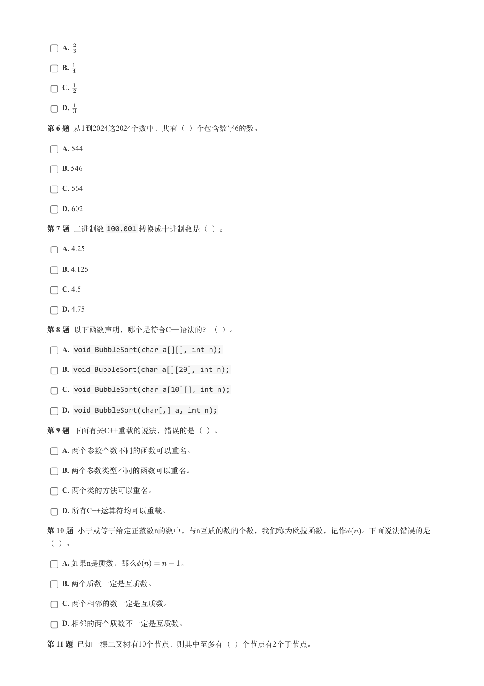
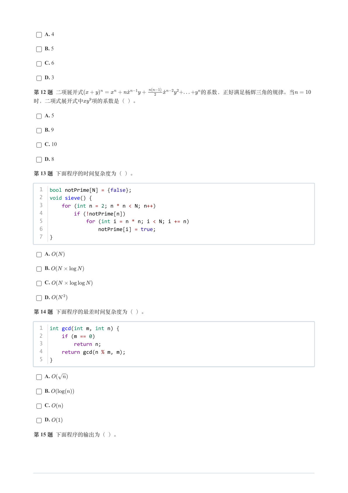
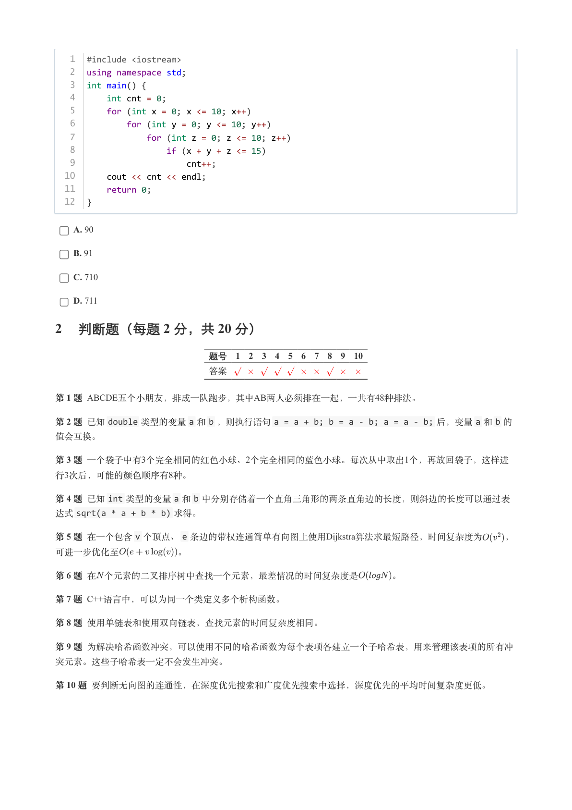
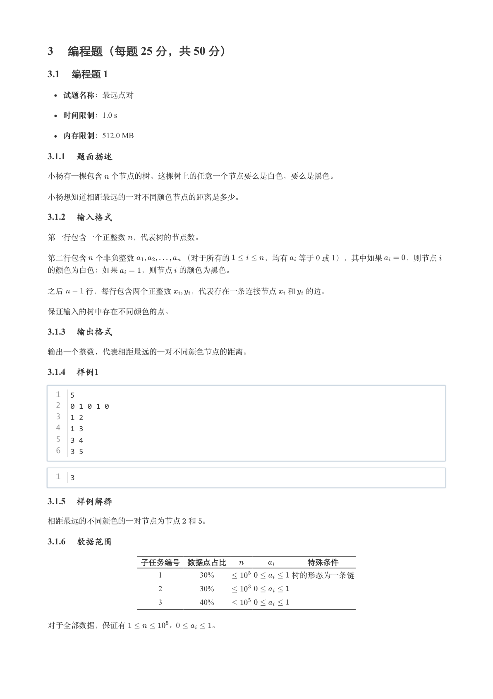
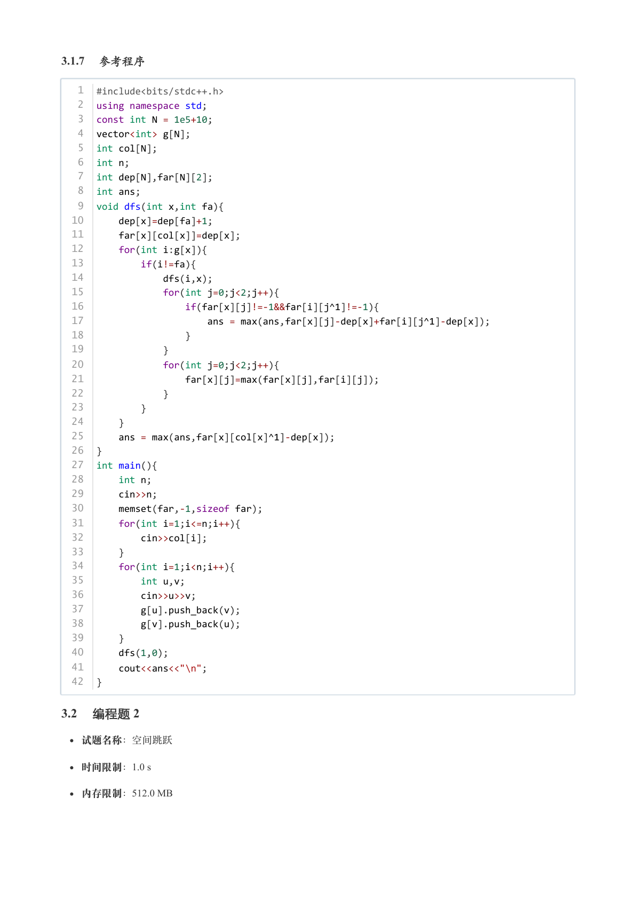
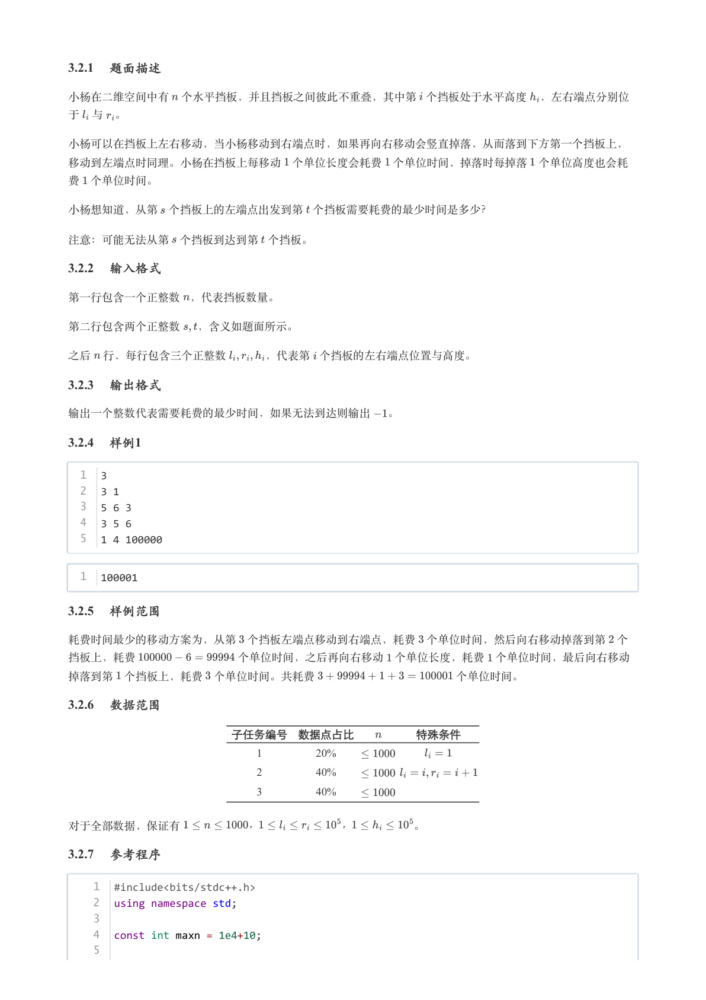
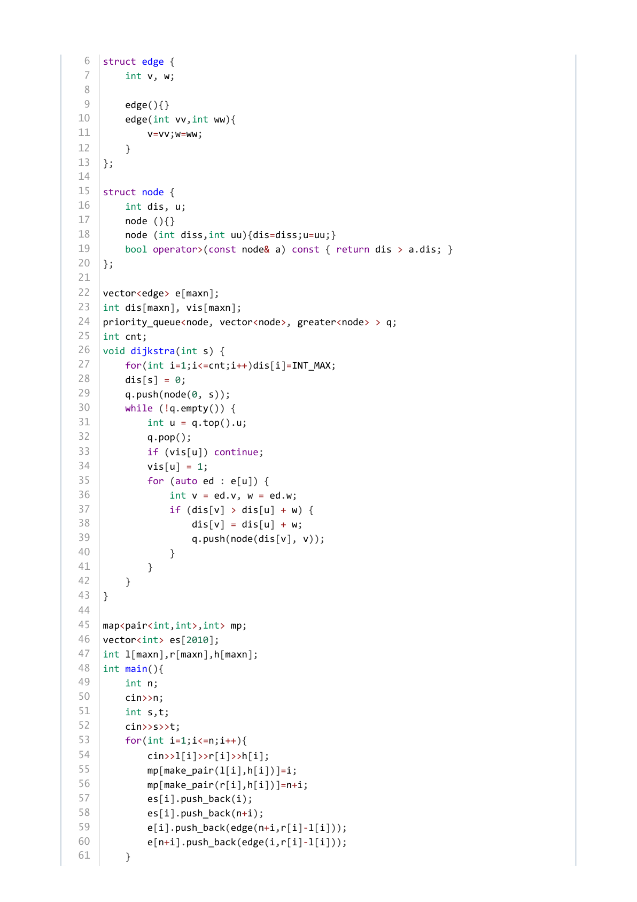
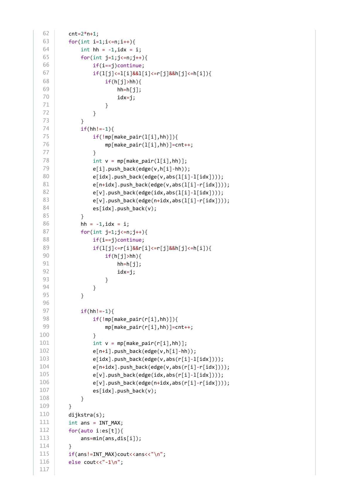

# 2024年6月-C++8级

- 原始 PDF：[`pdfs/2024年6月-C++8级.pdf`](../pdfs/2024年6月-C++8级.pdf)
- 页数：10
- 转换脚本：[`scripts/convert_pdfs_to_markdown.py`](../scripts/convert_pdfs_to_markdown.py)

> 为尽量避免信息丢失，每页均附带页面图片；文本提取结果保留原有顺序与换行特征，个别公式、图形、特殊排版请以页面图片为准。

## 第 1 页



### 提取文本

```
C++　八级

                      2024 年 06 月

1 单选题（每题 2 分，共 30 分）


            题号  1  2  3  4  5  6  7  8  9  10  11  12  13  14  15
            答案 B A D C C A B B D D  A  C  C  B  D


第 1 题 GESP活动期间，举办方从获胜者ABCDE五个人中选出三个人排成一队升国旗，其中A不能排在队首，请问

有多少种排法？

    A. 24

    B. 48

    C. 32

    D. 12

第 2 题 7进制数235转换成3进制数是（ ）。

    A. 11121

    B. 11122

    C. 11211

    D. 11112

第 3 题 0,1,2,3,4,5这些数字组成一个三位数，请问没有重复数字的情况下，有多少种组法（ ）。

    A. 180

    B. 120

    C. 80

    D. 100

第 4 题 有V个顶点、E条边的图的深度优先搜索遍历时间复杂度为（ ）。

    A.

    B.

    C.

    D.

第 5 题 一对夫妻生男生女的概率相同。已知这对夫妻有两个孩子，其中一个是女孩，另一个是男孩的概率是多少？
```

## 第 2 页



### 提取文本

```
A.

    B.

    C.

    D.

第 6 题 从1到2024这2024个数中，共有（ ）个包含数字6的数。

    A. 544

    B. 546

    C. 564

    D. 602

第 7 题 二进制数100.001 转换成十进制数是（ ）。

    A. 4.25

    B. 4.125

    C. 4.5

    D. 4.75

第 8 题 以下函数声明，哪个是符合C++语法的？（ ）。

    A. void BubbleSort(char a[][], int n);

    B. void BubbleSort(char a[][20], int n);

    C. void BubbleSort(char a[10][], int n);

    D. void BubbleSort(char[,] a, int n);

第 9 题 下面有关C++重载的说法，错误的是（ ）。

    A. 两个参数个数不同的函数可以重名。

    B. 两个参数类型不同的函数可以重名。

    C. 两个类的方法可以重名。

    D. 所有C++运算符均可以重载。

第 10 题 小于或等于给定正整数n的数中，与n互质的数的个数，我们称为欧拉函数，记作  。下面说法错误的是

（ ）。

    A. 如果n是质数，那么      。

    B. 两个质数一定是互质数。

    C. 两个相邻的数一定是互质数。

    D. 相邻的两个质数不一定是互质数。

第 11 题 已知一棵二叉树有10个节点，则其中至多有（ ）个节点有2个子节点。
```

## 第 3 页



### 提取文本

```
A. 4

    B. 5

    C. 6

    D. 3

第 12 题 二项展开式                     的系数，正好满足杨辉三角的规律。当

时，二项式展开式中  项的系数是（ ）。

    A. 5

    B. 9

    C. 10

    D. 8

第 13 题 下面程序的时间复杂度为（ ）。


  1  bool notPrime[N] = {false};
  2  void sieve() {
  3      for (int n = 2; n * n < N; n++)
  4          if (!notPrime[n])
  5              for (int i = n * n; i < N; i += n)
  6                  notPrime[i] = true;
  7  }


    A.

    B.

    C.

    D.

第 14 题 下面程序的最差时间复杂度为（ ）。


  1  int gcd(int m, int n) {
  2      if (m == 0)
  3          return n;
  4      return gcd(n % m, m);
  5  }


    A.

    B.

    C.

    D.

第 15 题 下面程序的输出为（ ）。
```

## 第 4 页



### 提取文本

```
1  #include <iostream>
   2  using namespace std;
   3  int main() {
   4      int cnt = 0;
   5      for (int x = 0; x <= 10; x++)
   6          for (int y = 0; y <= 10; y++)
   7              for (int z = 0; z <= 10; z++)
   8                  if (x + y + z <= 15)
   9                      cnt++;
  10      cout << cnt << endl;
  11      return 0;
  12  }


    A. 90

    B. 91

    C. 710

    D. 711

2 判断题（每题 2 分，共 20 分）

                 题号  1  2  3  4  5  6  7  8  9  10

                 答案


第 1 题 ABCDE五个小朋友，排成一队跑步，其中AB两人必须排在一起，一共有48种排法。

第 2 题 已知double 类型的变量a 和b ，则执行语句a = a + b; b = a - b; a = a - b; 后，变量a 和b 的

值会互换。

第 3 题 一个袋子中有3个完全相同的红色小球、2个完全相同的蓝色小球。每次从中取出1个，再放回袋子，这样进
行3次后，可能的颜色顺序有8种。

第 4 题 已知int 类型的变量a 和b 中分别存储着一个直角三角形的两条直角边的长度，则斜边的长度可以通过表
达式sqrt(a * a + b * b) 求得。

第 5 题 在一个包含v 个顶点、e 条边的带权连通简单有向图上使用Dijkstra算法求最短路径，时间复杂度为  ，

可进一步优化至      。

第 6 题 在 个元素的二叉排序树中查找一个元素，最差情况的时间复杂度是    。

第 7 题 C++语言中，可以为同一个类定义多个析构函数。

第 8 题 使用单链表和使用双向链表，查找元素的时间复杂度相同。

第 9 题 为解决哈希函数冲突，可以使用不同的哈希函数为每个表项各建立一个子哈希表，用来管理该表项的所有冲

突元素。这些子哈希表一定不会发生冲突。

第 10 题 要判断无向图的连通性，在深度优先搜索和广度优先搜索中选择，深度优先的平均时间复杂度更低。
```

## 第 5 页



### 提取文本

```
3 编程题（每题 25 分，共 50 分）

3.1 编程题 1


  试题名称：最远点对

   时间限制：1.0 s

   内存限制：512.0 MB

3.1.1 题面描述

小杨有一棵包含 个节点的树，这棵树上的任意一个节点要么是白色，要么是黑色。


小杨想知道相距最远的一对不同颜色节点的距离是多少。

3.1.2 输入格式

第一行包含一个正整数 ，代表树的节点数。

第二行包含 个非负整数      （对于所有的    ，均有 等于 0 或 1），其中如果   ，则节点

的颜色为白色；如果   ，则节点 的颜色为黑色。


之后   行，每行包含两个正整数  ，代表存在一条连接节点 和 的边。


保证输入的树中存在不同颜色的点。

3.1.3 输出格式

输出一个整数，代表相距最远的一对不同颜色节点的距离。

3.1.4 样例1

  1  5
  2  0 1 0 1 0
  3  1 2
  4  1 3
  5  3 4
  6  3 5


  1  3

3.1.5 样例解释

相距最远的不同颜色的一对节点为节点 和 。

3.1.6 数据范围

            子任务编号 数据点占比          特殊条件

                            1        30%          树的形态为一条链

                            2        30%

                            3        40%


对于全部数据，保证有      ，     。
```

## 第 6 页



### 提取文本

```
3.1.7 参考程序

   1  #include<bits/stdc++.h>
   2  using namespace std;
   3  const int N = 1e5+10;
   4  vector<int> g[N];
   5  int col[N];
   6  int n;
   7  int dep[N],far[N][2];
   8  int ans;
   9  void dfs(int x,int fa){
  10      dep[x]=dep[fa]+1;
  11      far[x][col[x]]=dep[x];
  12      for(int i:g[x]){
  13          if(i!=fa){
  14              dfs(i,x);
  15              for(int j=0;j<2;j++){
  16                  if(far[x][j]!=-1&&far[i][j^1]!=-1){
  17                      ans = max(ans,far[x][j]-dep[x]+far[i][j^1]-dep[x]);
  18                  }
  19              }
  20              for(int j=0;j<2;j++){
  21                  far[x][j]=max(far[x][j],far[i][j]);
  22              }
  23          }
  24      }
  25      ans = max(ans,far[x][col[x]^1]-dep[x]);
  26  }
  27  int main(){
  28      int n;
  29      cin>>n;
  30      memset(far,-1,sizeof far);
  31      for(int i=1;i<=n;i++){
  32          cin>>col[i];
  33      }
  34      for(int i=1;i<n;i++){
  35          int u,v;
  36          cin>>u>>v;
  37          g[u].push_back(v);
  38          g[v].push_back(u);
  39      }
  40      dfs(1,0);
  41      cout<<ans<<"\n";
  42  }

3.2 编程题 2

  试题名称：空间跳跃

   时间限制：1.0 s

   内存限制：512.0 MB
```

## 第 7 页



### 提取文本

```
3.2.1 题面描述

小杨在二维空间中有 个水平挡板，并且挡板之间彼此不重叠，其中第 个挡板处于水平高度 ，左右端点分别位

于 与 。


小杨可以在挡板上左右移动，当小杨移动到右端点时，如果再向右移动会竖直掉落，从而落到下方第一个挡板上，

移动到左端点时同理。小杨在挡板上每移动 个单位长度会耗费 个单位时间，掉落时每掉落 个单位高度也会耗

费 个单位时间。


小杨想知道，从第 个挡板上的左端点出发到第 个挡板需要耗费的最少时间是多少？


注意：可能无法从第 个挡板到达到第 个挡板。

3.2.2 输入格式

第一行包含一个正整数 ，代表挡板数量。


第二行包含两个正整数  ，含义如题面所示。


之后 行，每行包含三个正整数   ，代表第 个挡板的左右端点位置与高度。

3.2.3 输出格式

输出一个整数代表需要耗费的最少时间，如果无法到达则输出  。

3.2.4 样例1

  1  3
  2  3 1
  3  5 6 3
  4  3 5 6
  5  1 4 100000


  1  100001

3.2.5 样例范围

耗费时间最少的移动方案为，从第 个挡板左端点移动到右端点，耗费 个单位时间，然后向右移动掉落到第 个

挡板上，耗费         个单位时间，之后再向右移动 个单位长度，耗费 个单位时间，最后向右移动

掉落到第 个挡板上，耗费 个单位时间。共耗费             个单位时间。

3.2.6 数据范围

               子任务编号 数据点占比      特殊条件

                                  1        20%

                                  2        40%

                                  3        40%


对于全部数据，保证有       ，        ，      。

3.2.7 参考程序

    1  #include<bits/stdc++.h>
    2  using namespace std;
    3
    4  const int maxn = 1e4+10;
    5
```

## 第 8 页



### 提取文本

```
6  struct edge {
 7      int v, w;
 8
 9      edge(){}
10      edge(int vv,int ww){
11          v=vv;w=ww;
12      }
13  };
14
15  struct node {
16      int dis, u;
17      node (){}
18      node (int diss,int uu){dis=diss;u=uu;}
19      bool operator>(const node& a) const { return dis > a.dis; }
20  };
21
22  vector<edge> e[maxn];
23  int dis[maxn], vis[maxn];
24  priority_queue<node, vector<node>, greater<node> > q;
25  int cnt;
26  void dijkstra(int s) {
27      for(int i=1;i<=cnt;i++)dis[i]=INT_MAX;
28      dis[s] = 0;
29      q.push(node(0, s));
30      while (!q.empty()) {
31          int u = q.top().u;
32          q.pop();
33          if (vis[u]) continue;
34          vis[u] = 1;
35          for (auto ed : e[u]) {
36              int v = ed.v, w = ed.w;
37              if (dis[v] > dis[u] + w) {
38                  dis[v] = dis[u] + w;
39                  q.push(node(dis[v], v));
40              }
41          }
42      }
43  }
44
45  map<pair<int,int>,int> mp;
46  vector<int> es[2010];
47  int l[maxn],r[maxn],h[maxn];
48  int main(){
49      int n;
50      cin>>n;
51      int s,t;
52      cin>>s>>t;
53      for(int i=1;i<=n;i++){
54          cin>>l[i]>>r[i]>>h[i];
55          mp[make_pair(l[i],h[i])]=i;
56          mp[make_pair(r[i],h[i])]=n+i;
57          es[i].push_back(i);
58          es[i].push_back(n+i);
59          e[i].push_back(edge(n+i,r[i]-l[i]));
60          e[n+i].push_back(edge(i,r[i]-l[i]));
61      }
```

## 第 9 页



### 提取文本

```
62      cnt=2*n+1;
 63      for(int i=1;i<=n;i++){
 64          int hh = -1,idx = i;
 65          for(int j=1;j<=n;j++){
 66              if(i==j)continue;
 67              if(l[j]<=l[i]&&l[i]<=r[j]&&h[j]<=h[i]){
 68                  if(h[j]>hh){
 69                      hh=h[j];
 70                      idx=j;
 71                  }
 72              }
 73          }
 74          if(hh!=-1){
 75              if(!mp[make_pair(l[i],hh)]){
 76                  mp[make_pair(l[i],hh)]=cnt++;
 77              }
 78              int v = mp[make_pair(l[i],hh)];
 79              e[i].push_back(edge(v,h[i]-hh));
 80              e[idx].push_back(edge(v,abs(l[i]-l[idx])));
 81              e[n+idx].push_back(edge(v,abs(l[i]-r[idx])));
 82              e[v].push_back(edge(idx,abs(l[i]-l[idx])));
 83              e[v].push_back(edge(n+idx,abs(l[i]-r[idx])));
 84              es[idx].push_back(v);
 85          }
 86          hh = -1,idx = i;
 87          for(int j=1;j<=n;j++){
 88              if(i==j)continue;
 89              if(l[j]<=r[i]&&r[i]<=r[j]&&h[j]<=h[i]){
 90                  if(h[j]>hh){
 91                      hh=h[j];
 92                      idx=j;
 93                  }
 94              }
 95          }
 96
 97          if(hh!=-1){
 98              if(!mp[make_pair(r[i],hh)]){
 99                  mp[make_pair(r[i],hh)]=cnt++;
100              }
101              int v = mp[make_pair(r[i],hh)];
102              e[n+i].push_back(edge(v,h[i]-hh));
103              e[idx].push_back(edge(v,abs(r[i]-l[idx])));
104              e[n+idx].push_back(edge(v,abs(r[i]-r[idx])));
105              e[v].push_back(edge(idx,abs(r[i]-l[idx])));
106              e[v].push_back(edge(n+idx,abs(r[i]-r[idx])));
107              es[idx].push_back(v);
108          }
109      }
110      dijkstra(s);
111      int ans = INT_MAX;
112      for(auto i:es[t]){
113          ans=min(ans,dis[i]);
114      }
115      if(ans!=INT_MAX)cout<<ans<<"\n";
116      else cout<<"-1\n";
117
```

## 第 10 页


### 提取文本

```
118  }
```
