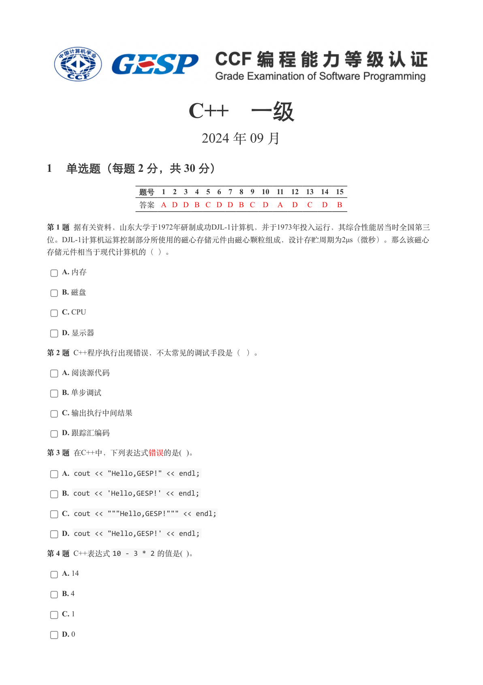
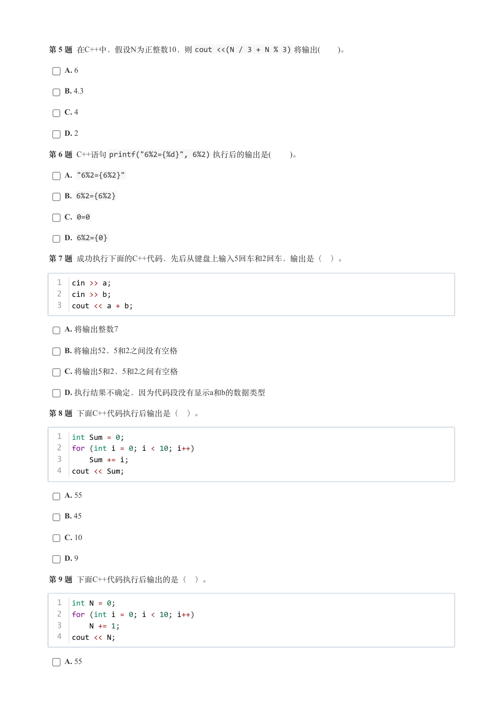
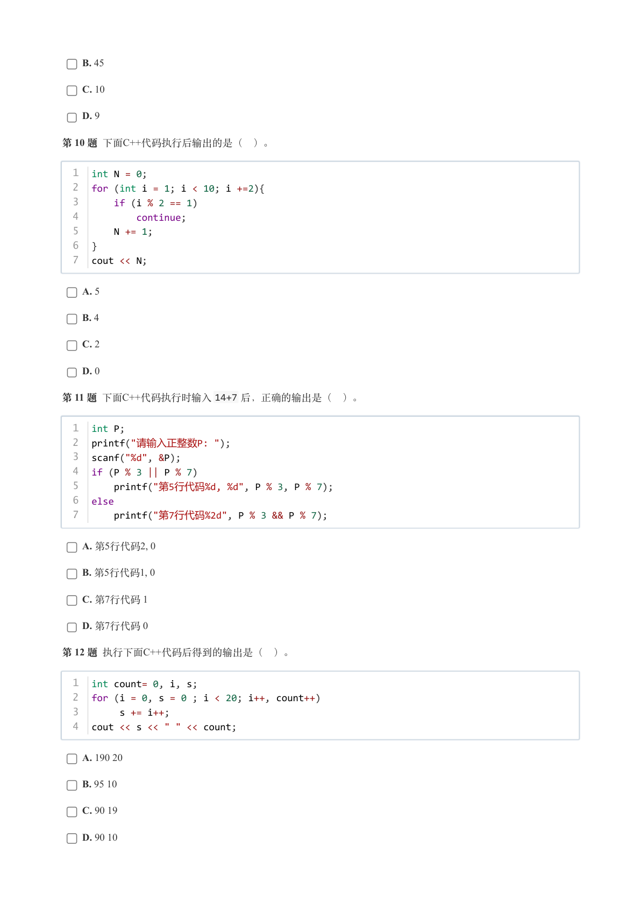
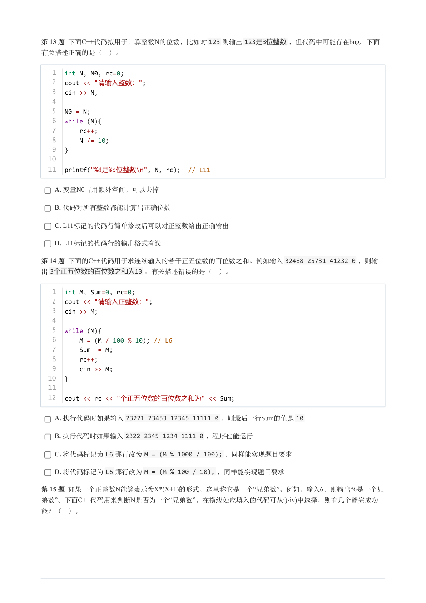
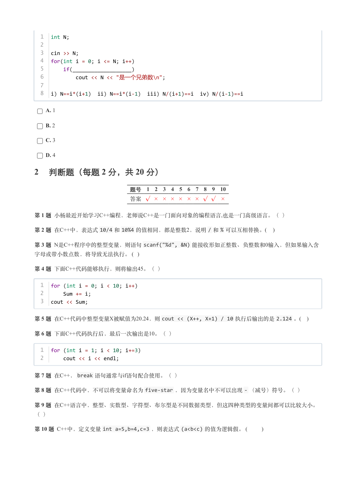
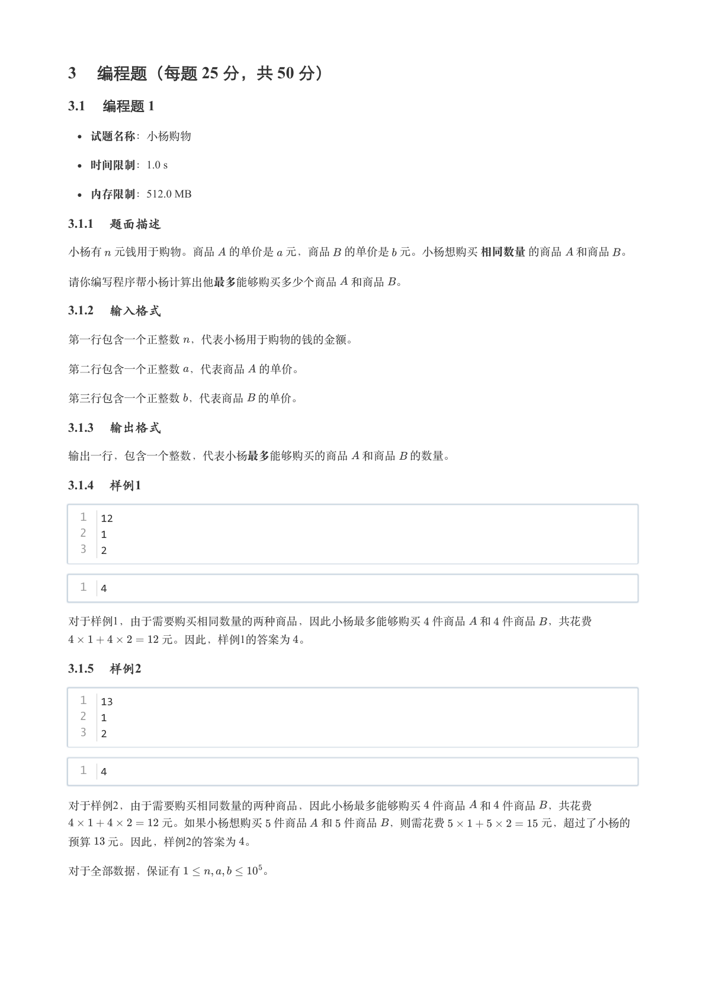
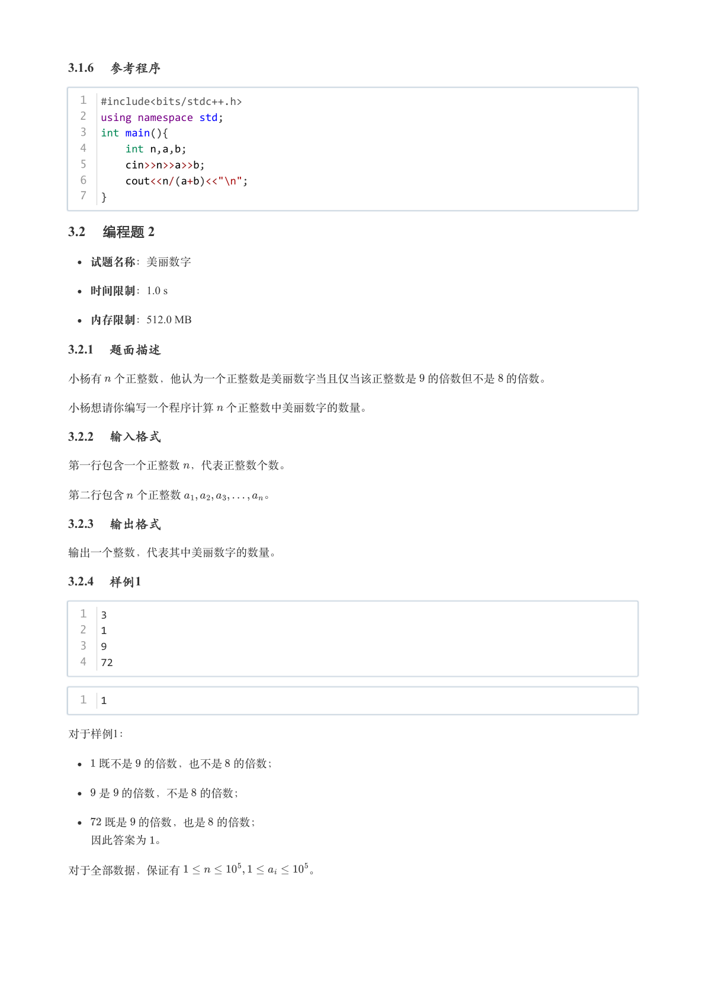
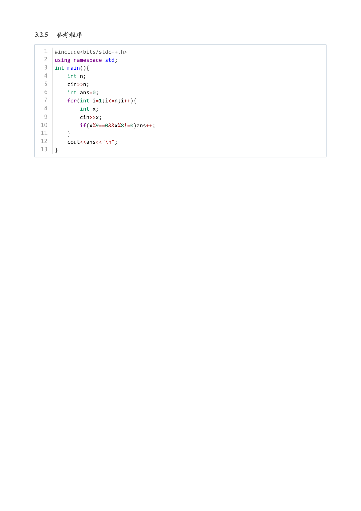

# 2024年9月-C++1级

- 原始 PDF：[`pdfs/2024年9月-C++1级.pdf`](../pdfs/2024年9月-C++1级.pdf)
- 页数：8
- 转换脚本：[`scripts/convert_pdfs_to_markdown.py`](../scripts/convert_pdfs_to_markdown.py)

> 为尽量避免信息丢失，每页均附带页面图片；文本提取结果保留原有顺序与换行特征，个别公式、图形、特殊排版请以页面图片为准。

## 第 1 页



### 提取文本

```
C++　一级

                      2024 年 09 月

1 单选题（每题 2 分，共 30 分）


            题号  1  2  3  4  5  6  7  8  9  10  11  12  13  14  15
            答案 A D D B C D D B C D  A  D  C  D  B


第 1 题 据有关资料，山东大学于1972年研制成功DJL-1计算机，并于1973年投入运行，其综合性能居当时全国第三
位。DJL-1计算机运算控制部分所使用的磁心存储元件由磁心颗粒组成，设计存贮周期为2μs（微秒）。那么该磁心

存储元件相当于现代计算机的（ ）。

    A. 内存

    B. 磁盘

    C. CPU

    D. 显示器

第 2 题 C++程序执行出现错误，不太常见的调试手段是（ ）。

    A. 阅读源代码

    B. 单步调试

    C. 输出执行中间结果

    D. 跟踪汇编码

第 3 题 在C++中，下列表达式错误的是( )。

    A. cout << "Hello,GESP!" << endl;

    B. cout << 'Hello,GESP!' << endl;

    C. cout << """Hello,GESP!""" << endl;

    D. cout << "Hello,GESP!' << endl;

第 4 题 C++表达式10 - 3 * 2 的值是( )。

    A. 14

    B. 4

    C. 1

    D. 0
```

## 第 2 页



### 提取文本

```
第 5 题 在C++中，假设N为正整数10，则cout <<(N / 3 + N % 3) 将输出(   )。

    A. 6

    B. 4.3

    C. 4

    D. 2

第 6 题 C++语句printf("6%2={%d}", 6%2) 执行后的输出是(    )。

    A. "6%2={6%2}"

    B. 6%2={6%2}

    C. 0=0

    D. 6%2={0}

第 7 题 成功执行下面的C++代码，先后从键盘上输入5回车和2回车，输出是（ ）。


  1  cin >> a;
  2  cin >> b;
  3  cout << a + b;


    A. 将输出整数7

    B. 将输出52，5和2之间没有空格

    C. 将输出5和2，5和2之间有空格

    D. 执行结果不确定，因为代码段没有显示a和b的数据类型

第 8 题 下面C++代码执行后输出是（ ）。


  1  int Sum = 0;
  2  for (int i = 0; i < 10; i++)
  3      Sum += i;
  4  cout << Sum;


    A. 55

    B. 45

    C. 10

    D. 9

第 9 题 下面C++代码执行后输出的是（ ）。


  1  int N = 0;
  2  for (int i = 0; i < 10; i++)
  3      N += 1;
  4  cout << N;


    A. 55
```

## 第 3 页



### 提取文本

```
B. 45

    C. 10

    D. 9

第 10 题 下面C++代码执行后输出的是（ ）。


  1  int N = 0;
  2  for (int i = 1; i < 10; i +=2){
  3      if (i % 2 == 1)
  4          continue;
  5      N += 1;
  6  }
  7  cout << N;


    A. 5

    B. 4

    C. 2

    D. 0

第 11 题 下面C++代码执行时输入14+7 后，正确的输出是（ ）。


  1  int P;
  2  printf("请输入正整数P: ");
  3  scanf("%d", &P);
  4  if (P % 3 || P % 7)
  5     printf("第5行代码%d, %d", P % 3, P % 7);
  6  else
  7     printf("第7行代码%2d", P % 3 && P % 7);


    A. 第5行代码2, 0

    B. 第5行代码1, 0

    C. 第7行代码 1

    D. 第7行代码 0

第 12 题 执行下面C++代码后得到的输出是（ ）。


  1  int count= 0, i, s;
  2  for (i = 0, s = 0 ; i < 20; i++, count++)
  3       s += i++;
  4  cout << s << " " << count;


    A. 190 20

    B. 95 10

    C. 90 19

    D. 90 10
```

## 第 4 页



### 提取文本

```
第 13 题 下面C++代码拟用于计算整数N的位数，比如对123 则输出123是3位整数，但代码中可能存在bug。下面

有关描述正确的是（ ）。


   1  int N, N0, rc=0;
   2  cout << "请输入整数：";
   3  cin >> N;
   4
   5  N0 = N;
   6  while (N){
   7      rc++;
   8      N /= 10;
   9  }
  10
  11  printf("%d是%d位整数\n", N, rc);  // L11


    A. 变量N0占用额外空间，可以去掉

    B. 代码对所有整数都能计算出正确位数

    C. L11标记的代码行简单修改后可以对正整数给出正确输出

    D. L11标记的代码行的输出格式有误

第 14 题 下面的C++代码用于求连续输入的若干正五位数的百位数之和。例如输入32488 25731 41232 0 ，则输
出3个正五位数的百位数之和为13 。有关描述错误的是（ ）。


   1  int M, Sum=0, rc=0;
   2  cout << "请输入正整数：";
   3  cin >> M;
   4
   5  while (M){
   6      M = (M / 100 % 10); // L6
   7      Sum += M;
   8      rc++;
   9      cin >> M;
  10  }
  11
  12  cout << rc << "个正五位数的百位数之和为" << Sum;

    A. 执行代码时如果输入23221 23453 12345 11111 0 ，则最后一行Sum的值是10

    B. 执行代码时如果输入2322 2345 1234 1111 0 ，程序也能运行

    C. 将代码标记为L6 那行改为M = (M % 1000 / 100); ，同样能实现题目要求

    D. 将代码标记为L6 那行改为M = (M % 100 / 10); ，同样能实现题目要求

第 15 题 如果一个正整数N能够表示为X*(X+1)的形式，这里称它是一个“兄弟数”。例如，输入6，则输出“6是一个兄
弟数”。下面C++代码用来判断N是否为一个“兄弟数”，在横线处应填入的代码可从i)-iv)中选择，则有几个能完成功

能？（ ）。
```

## 第 5 页



### 提取文本

```
1  int N;
  2
  3  cin >> N;
  4  for(int i = 0; i <= N; i++)
  5      if(___________________)
  6          cout << N << "是一个兄弟数\n";
  7
  8  i) N==i*(i+1)  ii) N==i*(i-1)  iii) N/(i+1)==i  iv) N/(i-1)==i


    A. 1

    B. 2

    C. 3

    D. 4

2 判断题（每题 2 分，共 20 分）


                 题号  1  2  3  4  5  6  7  8  9  10

                 答案


第 1 题 小杨最近开始学习C++编程，老师说C++是一门面向对象的编程语言,也是一门高级语言。（ ）

第 2 题 在C++中，表达式10/4 和10%4 的值相同，都是整数2，说明/ 和% 可以互相替换。(   )

第 3 题 N是C++程序中的整型变量，则语句scanf("%d", &N) 能接收形如正整数、负整数和0输入，但如果输入含
字母或带小数点数，将导致无法执行。 (  )

第 4 题 下面C++代码能够执行，则将输出45。（ ）


  1  for (int i = 0; i < 10; i++)
  2      Sum += i;
  3  cout << Sum;


第 5 题 在C++代码中整型变量X被赋值为20.24，则cout << (X++, X+1) / 10 执行后输出的是2.124 。(   )

第 6 题 下面C++代码执行后，最后一次输出是10。（ ）


  1  for (int i = 1; i < 10; i+=3)
  2      cout << i << endl;


第 7 题 在C++，break 语句通常与if语句配合使用。（ ）

第 8 题 在C++代码中，不可以将变量命名为five-star ，因为变量名中不可以出现- （减号）符号。（ ）

第 9 题 在C++语言中，整型、实数型、字符型、布尔型是不同数据类型，但这四种类型的变量间都可以比较大小。

（ ）

第 10 题 C++中，定义变量int a=5,b=4,c=3 ，则表达式(a<b<c) 的值为逻辑假。 (        )
```

## 第 6 页



### 提取文本

```
3 编程题（每题 25 分，共 50 分）

3.1 编程题 1


  试题名称：小杨购物

   时间限制：1.0 s

   内存限制：512.0 MB

3.1.1 题面描述

小杨有 元钱用于购物。商品 的单价是 元，商品 的单价是 元。小杨想购买 相同数量 的商品 和商品 。


请你编写程序帮小杨计算出他最多能够购买多少个商品 和商品 。

3.1.2 输入格式

第一行包含一个正整数 ，代表小杨用于购物的钱的金额。


第二行包含一个正整数 ，代表商品 的单价。


第三行包含一个正整数 ，代表商品 的单价。

3.1.3 输出格式

输出一行，包含一个整数，代表小杨最多能够购买的商品 和商品 的数量。

3.1.4 样例1

  1  12
  2  1
  3  2


  1  4


对于样例1，由于需要购买相同数量的两种商品，因此小杨最多能够购买 件商品 和 件商品 ，共花费
         元。因此，样例1的答案为 。

3.1.5 样例2

  1  13
  2  1
  3  2


  1  4


对于样例2，由于需要购买相同数量的两种商品，因此小杨最多能够购买 件商品 和 件商品 ，共花费

        元。如果小杨想购买 件商品 和 件商品 ，则需花费         元，超过了小杨的

预算  元。因此，样例2的答案为 。


对于全部数据，保证有       。
```

## 第 7 页



### 提取文本

```
3.1.6 参考程序

  1  #include<bits/stdc++.h>
  2  using namespace std;
  3  int main(){
  4      int n,a,b;
  5      cin>>n>>a>>b;
  6      cout<<n/(a+b)<<"\n";
  7  }

3.2 编程题 2


  试题名称：美丽数字

   时间限制：1.0 s

   内存限制：512.0 MB

3.2.1 题面描述

小杨有 个正整数，他认为一个正整数是美丽数字当且仅当该正整数是 的倍数但不是 的倍数。


小杨想请你编写一个程序计算 个正整数中美丽数字的数量。

3.2.2 输入格式

第一行包含一个正整数 ，代表正整数个数。


第二行包含 个正整数       。

3.2.3 输出格式

输出一个整数，代表其中美丽数字的数量。

3.2.4 样例1

  1  3
  2  1
  3  9
  4  72


  1  1


对于样例1：


   既不是 的倍数，也不是 的倍数；


   是 的倍数，不是 的倍数；


   既是 的倍数，也是 的倍数；

  因此答案为 。


对于全部数据，保证有           。
```

## 第 8 页



### 提取文本

```
3.2.5 参考程序

   1  #include<bits/stdc++.h>
   2  using namespace std;
   3  int main(){
   4      int n;
   5      cin>>n;
   6      int ans=0;
   7      for(int i=1;i<=n;i++){
   8          int x;
   9          cin>>x;
  10          if(x%9==0&&x%8!=0)ans++;
  11      }
  12      cout<<ans<<"\n";
  13  }
```
