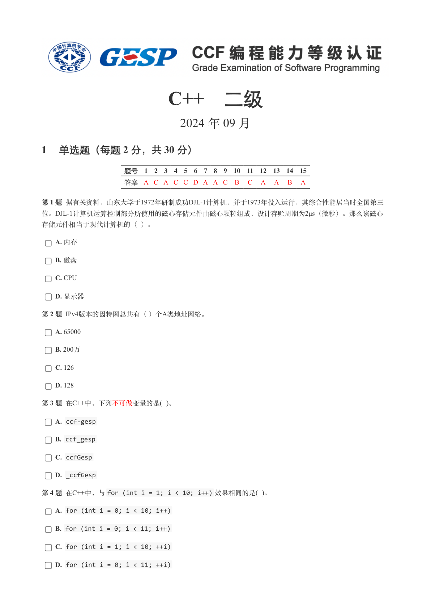
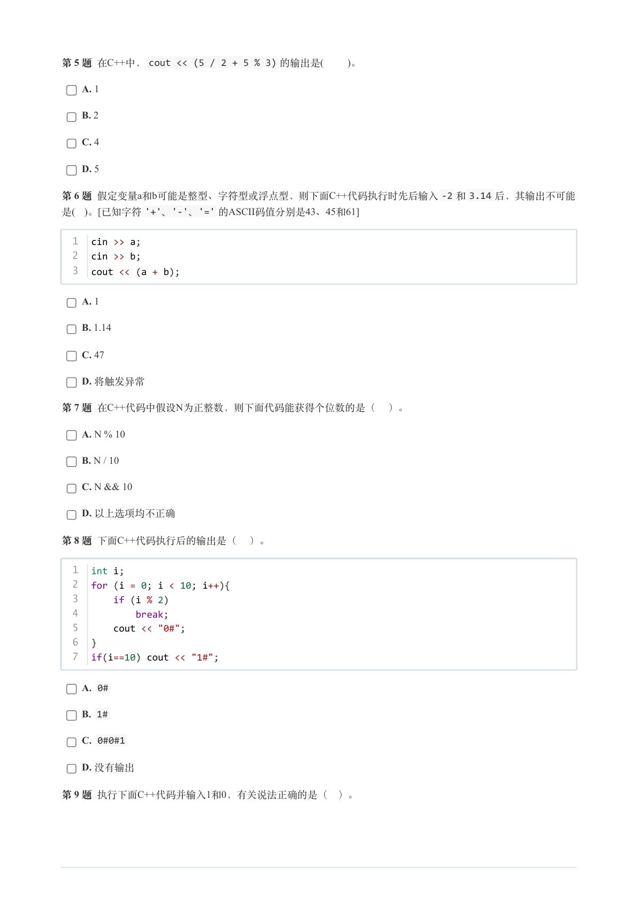
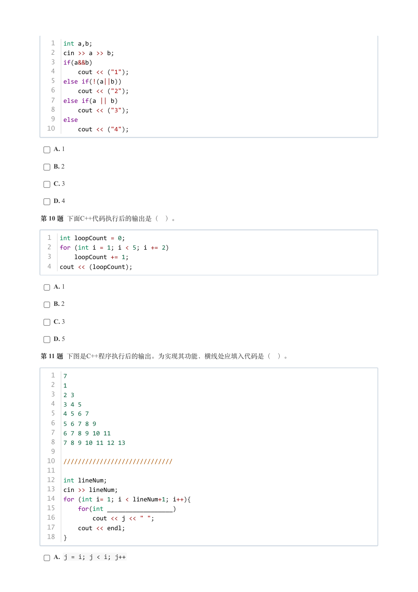
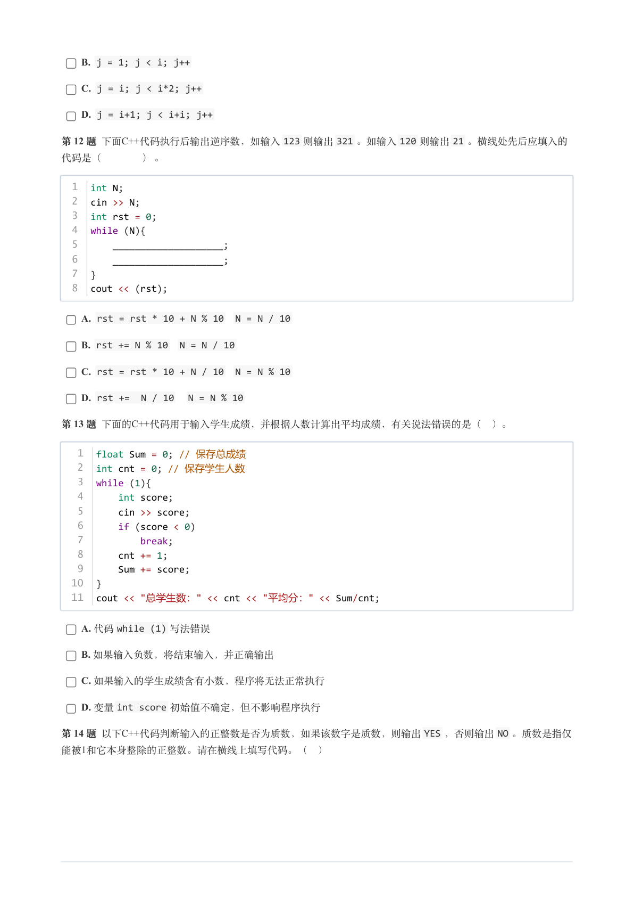
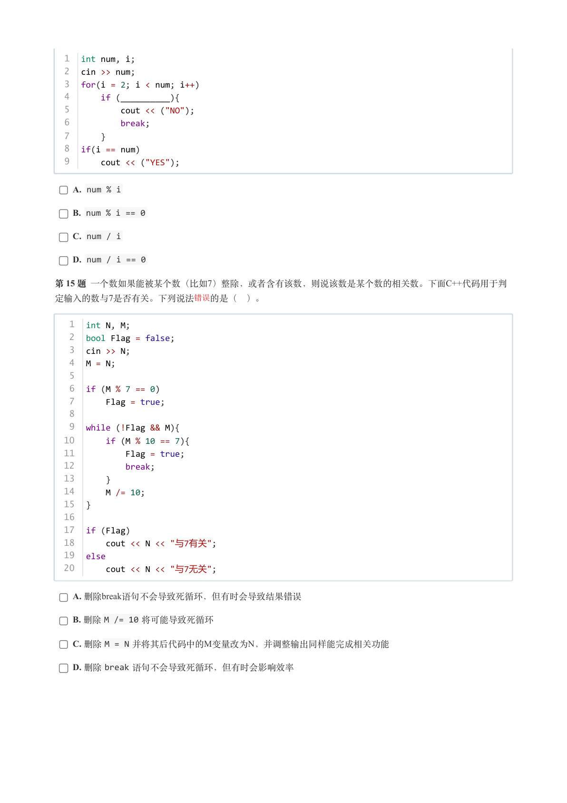
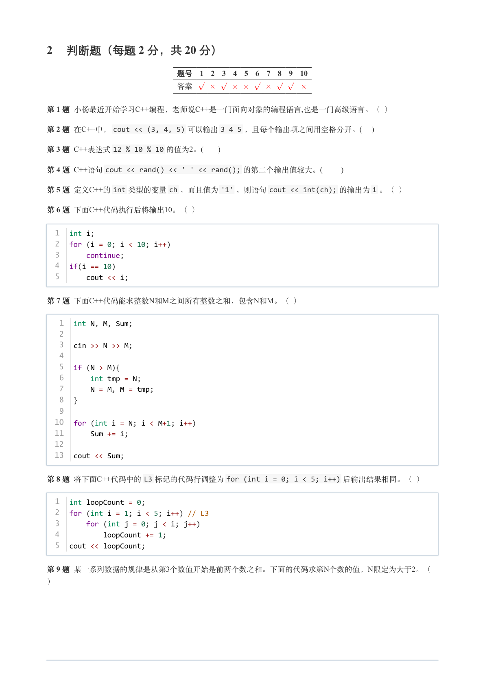
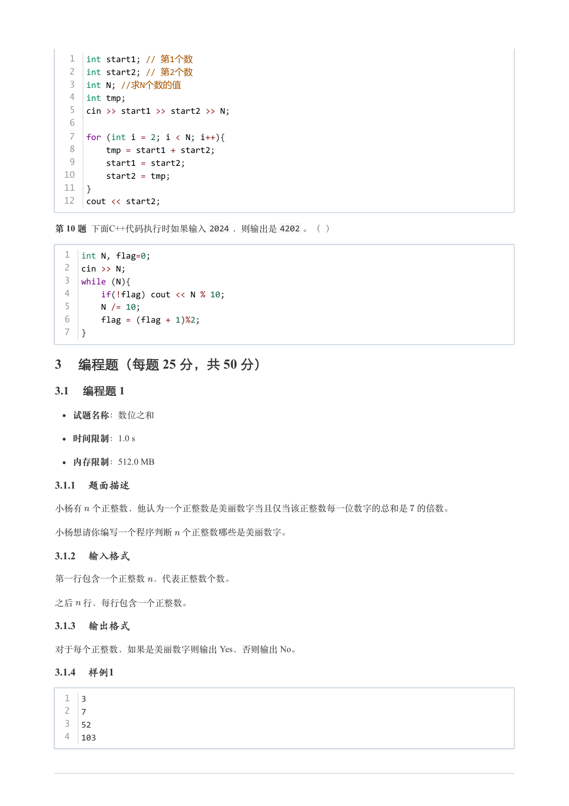
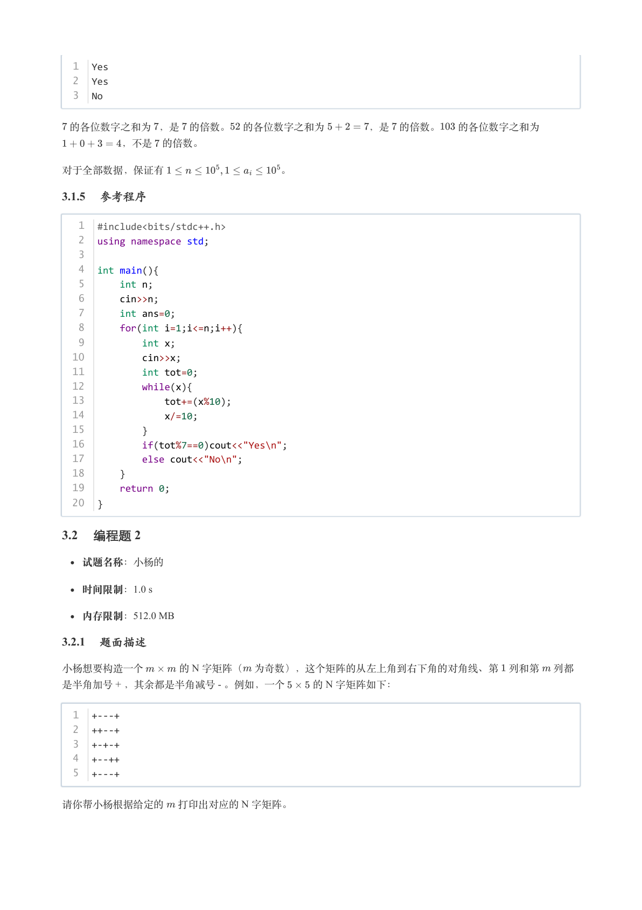
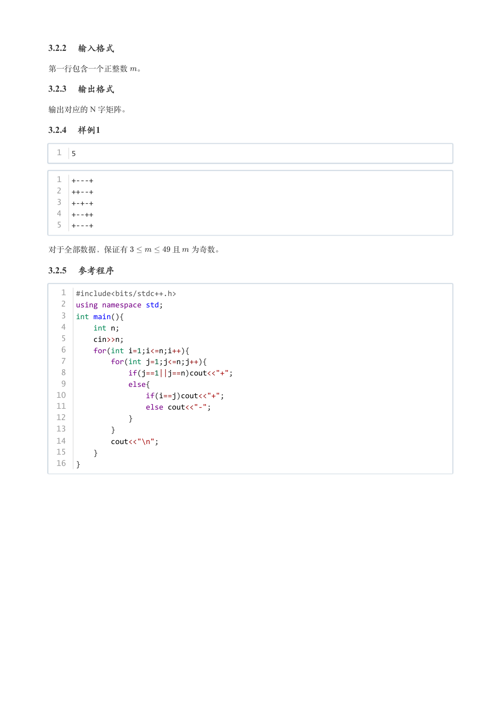

# 2024年9月-C++2级

- 原始 PDF：[`pdfs/2024年9月-C++2级.pdf`](../pdfs/2024年9月-C++2级.pdf)
- 页数：9
- 转换脚本：[`scripts/convert_pdfs_to_markdown.py`](../scripts/convert_pdfs_to_markdown.py)

> 为尽量避免信息丢失，每页均附带页面图片；文本提取结果保留原有顺序与换行特征，个别公式、图形、特殊排版请以页面图片为准。

## 第 1 页



### 提取文本

```
C++　二级

                      2024 年 09 月

1 单选题（每题 2 分，共 30 分）


            题号  1  2  3  4  5  6  7  8  9  10  11  12  13  14  15
            答案 A C A C C D A A C  B  C  A  A  B  A


第 1 题 据有关资料，山东大学于1972年研制成功DJL-1计算机，并于1973年投入运行，其综合性能居当时全国第三
位。DJL-1计算机运算控制部分所使用的磁心存储元件由磁心颗粒组成，设计存贮周期为2μs（微秒）。那么该磁心

存储元件相当于现代计算机的（ ）。

    A. 内存

    B. 磁盘

    C. CPU

    D. 显示器

第 2 题 IPv4版本的因特网总共有（ ）个A类地址网络。

    A. 65000

    B. 200万

    C. 126

    D. 128

第 3 题 在C++中，下列不可做变量的是( )。

    A. ccf-gesp

    B. ccf_gesp

    C. ccfGesp

    D. _ccfGesp

第 4 题 在C++中，与for (int i = 1; i < 10; i++) 效果相同的是( )。

    A. for (int i = 0; i < 10; i++)

    B. for (int i = 0; i < 11; i++)

    C. for (int i = 1; i < 10; ++i)

    D. for (int i = 0; i < 11; ++i)
```

## 第 2 页



### 提取文本

```
第 5 题 在C++中，cout << (5 / 2 + 5 % 3) 的输出是(    )。

    A. 1

    B. 2

    C. 4

    D. 5

第 6 题 假定变量a和b可能是整型、字符型或浮点型，则下面C++代码执行时先后输入-2 和3.14 后，其输出不可能
是( )。[已知字符'+'、'-'、'=' 的ASCII码值分别是43、45和61]


  1  cin >> a;
  2  cin >> b;
  3  cout << (a + b);


    A. 1

    B. 1.14

    C. 47

    D. 将触发异常

第 7 题 在C++代码中假设N为正整数，则下面代码能获得个位数的是（ ）。

    A. N % 10

    B. N / 10

    C. N && 10

    D. 以上选项均不正确

第 8 题 下面C++代码执行后的输出是（ ）。


  1  int i;
  2  for (i = 0; i < 10; i++){
  3      if (i % 2)
  4          break;
  5      cout << "0#";
  6  }
  7  if(i==10) cout << "1#";


    A. 0#

    B. 1#

    C. 0#0#1

    D. 没有输出

第 9 题 执行下面C++代码并输入1和0，有关说法正确的是（ ）。
```

## 第 3 页



### 提取文本

```
1  int a,b;
   2  cin >> a >> b;
   3  if(a&&b)
   4      cout << ("1");
   5  else if(!(a||b))
   6      cout << ("2");
   7  else if(a || b)
   8      cout << ("3");
   9  else
  10      cout << ("4");


    A. 1

    B. 2

    C. 3

    D. 4

第 10 题 下面C++代码执行后的输出是（ ）。


  1  int loopCount = 0;
  2  for (int i = 1; i < 5; i += 2)
  3      loopCount += 1;
  4  cout << (loopCount);


    A. 1

    B. 2

    C. 3

    D. 5

第 11 题 下图是C++程序执行后的输出。为实现其功能，横线处应填入代码是（ ）。


   1  7
   2  1
   3  2 3
   4  3 4 5
   5  4 5 6 7
   6  5 6 7 8 9
   7  6 7 8 9 10 11
   8  7 8 9 10 11 12 13
   9
  10  //////////////////////////////
  11
  12  int lineNum;
  13  cin >> lineNum;
  14  for (int i= 1; i < lineNum+1; i++){
  15      for(int __________________)
  16          cout << j << " ";
  17      cout << endl;
  18  }

    A. j = i; j < i; j++
```

## 第 4 页



### 提取文本

```
B. j = 1; j < i; j++

    C. j = i; j < i*2; j++

    D. j = i+1; j < i+i; j++

第 12 题 下面C++代码执行后输出逆序数，如输入123 则输出321 。如输入120 则输出21 。横线处先后应填入的

代码是（    ） 。


  1  int N;
  2  cin >> N;
  3  int rst = 0;
  4  while (N){
  5      ____________________;
  6      ____________________;
  7  }
  8  cout << (rst);

    A. rst = rst * 10 + N % 10  N = N / 10

    B. rst += N % 10  N = N / 10

    C. rst = rst * 10 + N / 10  N = N % 10

    D. rst +=  N / 10   N = N % 10

第 13 题 下面的C++代码用于输入学生成绩，并根据人数计算出平均成绩，有关说法错误的是（ ）。

   1  float Sum = 0; // 保存总成绩
   2  int cnt = 0; // 保存学生人数
   3  while (1){
   4      int score;
   5      cin >> score;
   6      if (score < 0)
   7          break;
   8      cnt += 1;
   9      Sum += score;
  10  }
  11  cout << "总学生数：" << cnt << "平均分：" << Sum/cnt;


    A. 代码while (1) 写法错误

    B. 如果输入负数，将结束输入，并正确输出

    C. 如果输入的学生成绩含有小数，程序将无法正常执行

    D. 变量int score 初始值不确定，但不影响程序执行

第 14 题 以下C++代码判断输入的正整数是否为质数，如果该数字是质数，则输出YES ，否则输出NO 。质数是指仅
能被1和它本身整除的正整数。请在横线上填写代码。（ ）
```

## 第 5 页



### 提取文本

```
1  int num, i;
  2  cin >> num;
  3  for(i = 2; i < num; i++)
  4      if (__________){
  5          cout << ("NO");
  6          break;
  7      }
  8  if(i == num)
  9      cout << ("YES");


    A. num % i

    B. num % i == 0

    C. num / i

    D. num / i == 0

第 15 题 一个数如果能被某个数（比如7）整除，或者含有该数，则说该数是某个数的相关数。下面C++代码用于判
定输入的数与7是否有关。下列说法错误 的是（ ）。


   1  int N, M;
   2  bool Flag = false;
   3  cin >> N;
   4  M = N;
   5
   6  if (M % 7 == 0)
   7      Flag = true;
   8
   9  while (!Flag && M){
  10      if (M % 10 == 7){
  11          Flag = true;
  12          break;
  13      }
  14      M /= 10;
  15  }
  16
  17  if (Flag)
  18      cout << N << "与7有关";
  19  else
  20      cout << N << "与7无关";


    A. 删除break语句不会导致死循环，但有时会导致结果错误

    B. 删除M /= 10 将可能导致死循环

    C. 删除M = N 并将其后代码中的M变量改为N，并调整输出同样能完成相关功能

    D. 删除break 语句不会导致死循环，但有时会影响效率
```

## 第 6 页



### 提取文本

```
2 判断题（每题 2 分，共 20 分）

                 题号  1  2  3  4  5  6  7  8  9  10

                 答案


第 1 题 小杨最近开始学习C++编程，老师说C++是一门面向对象的编程语言,也是一门高级语言。（ ）

第 2 题 在C++中，cout << (3, 4, 5) 可以输出3 4 5 ，且每个输出项之间用空格分开。(    )

第 3 题 C++表达式12 % 10 % 10 的值为2。(      )

第 4 题 C++语句cout << rand() << ' ' << rand(); 的第二个输出值较大。(       )

第 5 题 定义C++的int 类型的变量ch ，而且值为'1' ，则语句cout << int(ch); 的输出为1 。（ ）

第 6 题 下面C++代码执行后将输出10。（ ）


  1  int i;
  2  for (i = 0; i < 10; i++)
  3      continue;
  4  if(i == 10)
  5      cout << i;


第 7 题 下面C++代码能求整数N和M之间所有整数之和，包含N和M。（ ）


   1  int N, M, Sum;
   2
   3  cin >> N >> M;
   4
   5  if (N > M){
   6      int tmp = N;
   7      N = M, M = tmp;
   8  }
   9
  10  for (int i = N; i < M+1; i++)
  11      Sum += i;
  12
  13  cout << Sum;


第 8 题 将下面C++代码中的L3 标记的代码行调整为for (int i = 0; i < 5; i++) 后输出结果相同。（ ）


  1  int loopCount = 0;
  2  for (int i = 1; i < 5; i++) // L3
  3      for (int j = 0; j < i; j++)
  4          loopCount += 1;
  5  cout << loopCount;


第 9 题 某一系列数据的规律是从第3个数值开始是前两个数之和。下面的代码求第N个数的值，N限定为大于2。（

）
```

## 第 7 页



### 提取文本

```
1  int start1; // 第1个数
   2  int start2; // 第2个数
   3  int N; //求N个数的值
   4  int tmp;
   5  cin >> start1 >> start2 >> N;
   6
   7  for (int i = 2; i < N; i++){
   8      tmp = start1 + start2;
   9      start1 = start2;
  10      start2 = tmp;
  11  }
  12  cout << start2;


第 10 题 下面C++代码执行时如果输入2024 ，则输出是4202 。（ ）


  1  int N, flag=0;
  2  cin >> N;
  3  while (N){
  4      if(!flag) cout << N % 10;
  5      N /= 10;
  6      flag = (flag + 1)%2;
  7  }

3 编程题（每题 25 分，共 50 分）

3.1 编程题 1


  试题名称：数位之和

   时间限制：1.0 s

   内存限制：512.0 MB

3.1.1 题面描述

小杨有 个正整数，他认为一个正整数是美丽数字当且仅当该正整数每一位数字的总和是 的倍数。


小杨想请你编写一个程序判断 个正整数哪些是美丽数字。

3.1.2 输入格式

第一行包含一个正整数 ，代表正整数个数。


之后 行，每行包含一个正整数。

3.1.3 输出格式

对于每个正整数，如果是美丽数字则输出 Yes，否则输出 No。

3.1.4 样例1

  1  3
  2  7
  3  52
  4  103
```

## 第 8 页



### 提取文本

```
1  Yes
  2  Yes
  3  No


 的各位数字之和为 ，是 的倍数。 的各位数字之和为    ，是 的倍数。  的各位数字之和为

      ，不是 的倍数。


对于全部数据，保证有           。

3.1.5 参考程序

   1  #include<bits/stdc++.h>
   2  using namespace std;
   3
   4  int main(){
   5      int n;
   6      cin>>n;
   7      int ans=0;
   8      for(int i=1;i<=n;i++){
   9          int x;
  10          cin>>x;
  11          int tot=0;
  12          while(x){
  13              tot+=(x%10);
  14              x/=10;
  15          }
  16          if(tot%7==0)cout<<"Yes\n";
  17          else cout<<"No\n";
  18      }
  19      return 0;
  20  }

3.2 编程题 2

  试题名称：小杨的

   时间限制：1.0 s

   内存限制：512.0 MB

3.2.1 题面描述

小杨想要构造一个    的 N 字矩阵（ 为奇数），这个矩阵的从左上角到右下角的对角线、第 列和第 列都
是半角加号 + ，其余都是半角减号 - 。例如，一个   的 N 字矩阵如下：


  1  +---+
  2  ++--+
  3  +-+-+
  4  +--++
  5  +---+


请你帮小杨根据给定的 打印出对应的 N 字矩阵。
```

## 第 9 页



### 提取文本

```
3.2.2 输入格式

第一行包含一个正整数 。

3.2.3 输出格式

输出对应的 N 字矩阵。

3.2.4 样例1

  1  5


  1  +---+
  2  ++--+
  3  +-+-+
  4  +--++
  5  +---+


对于全部数据，保证有      且 为奇数。

3.2.5 参考程序

   1  #include<bits/stdc++.h>
   2  using namespace std;
   3  int main(){
   4      int n;
   5      cin>>n;
   6      for(int i=1;i<=n;i++){
   7          for(int j=1;j<=n;j++){
   8              if(j==1||j==n)cout<<"+";
   9              else{
  10                  if(i==j)cout<<"+";
  11                  else cout<<"-";
  12              }
  13          }
  14          cout<<"\n";
  15      }
  16  }
```
