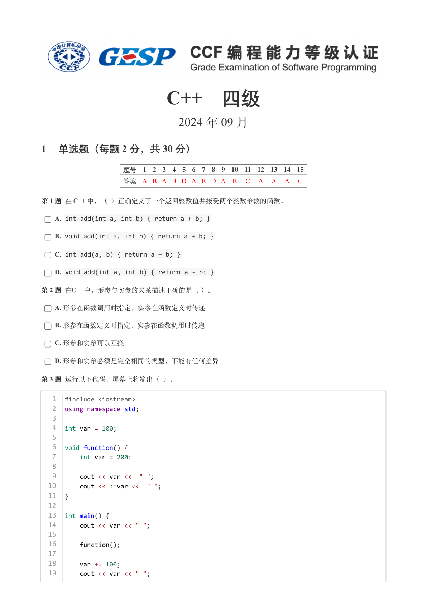
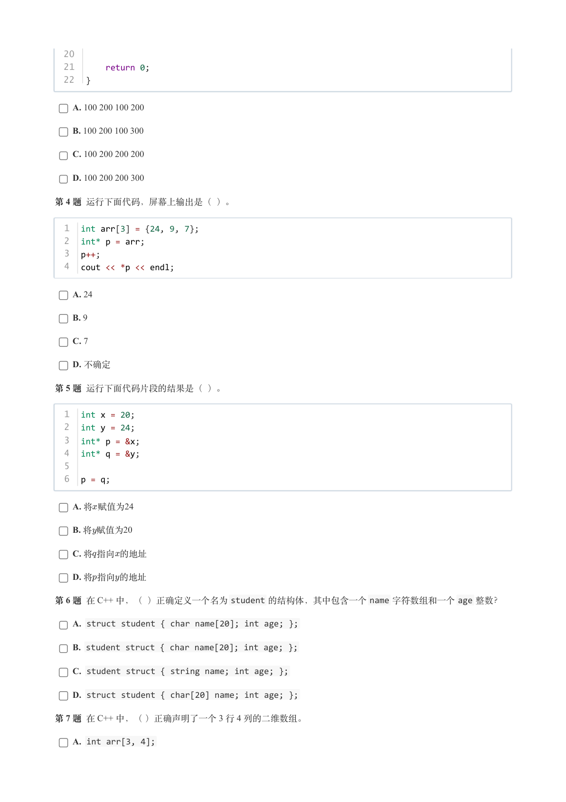
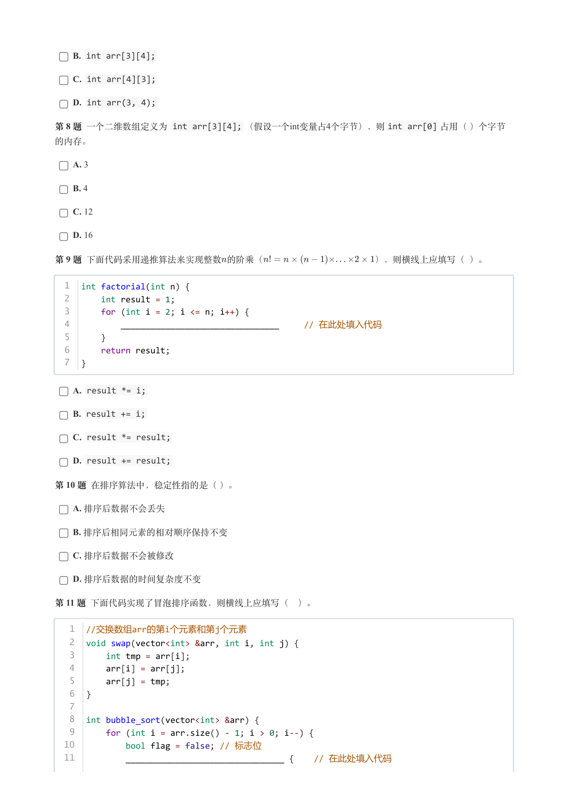
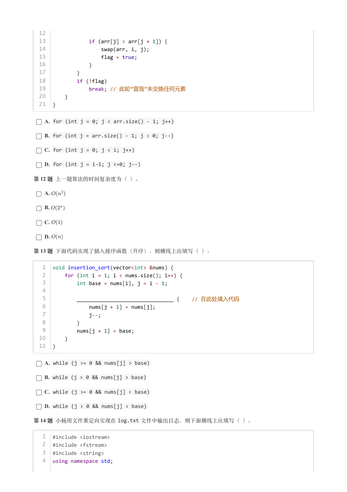
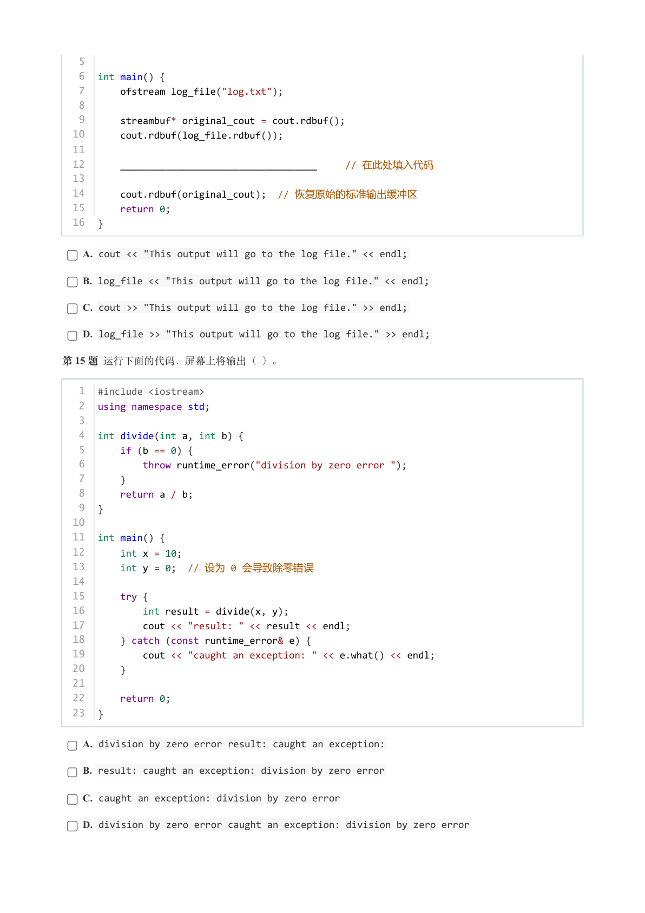
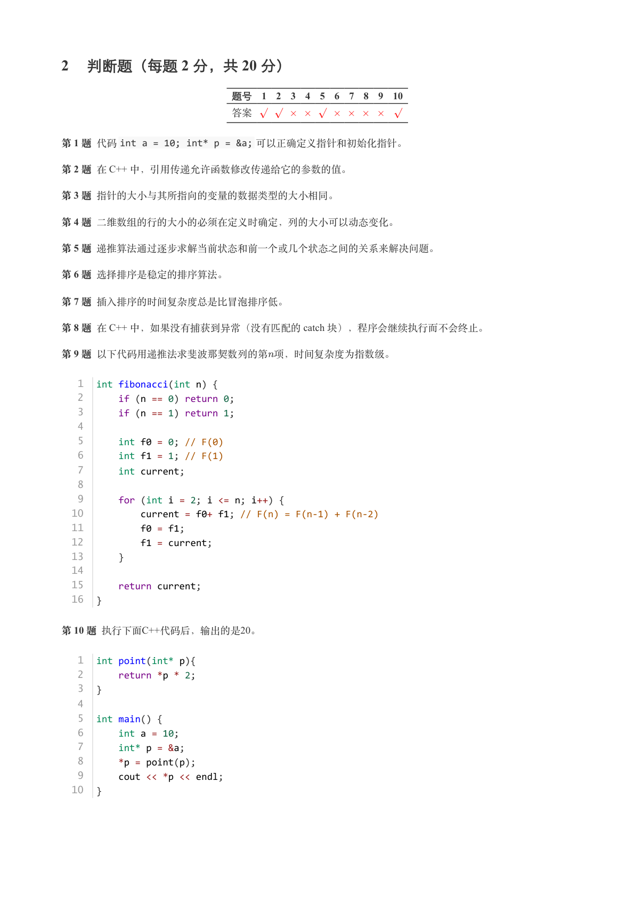
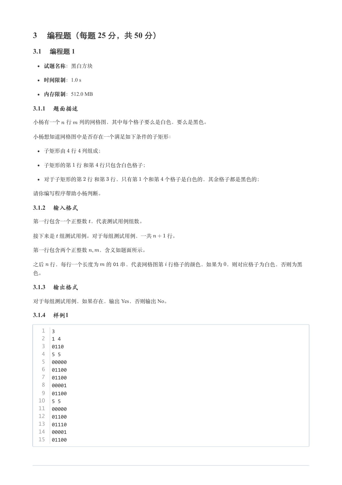
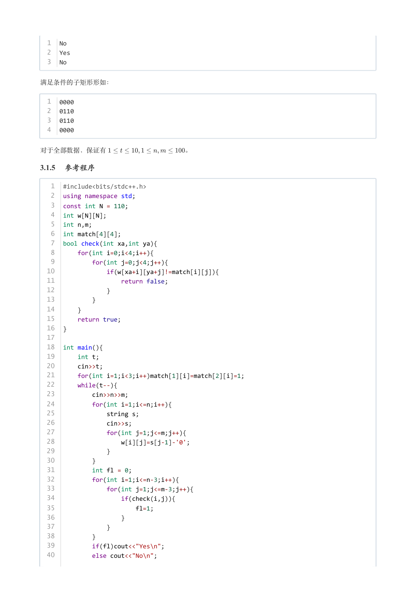
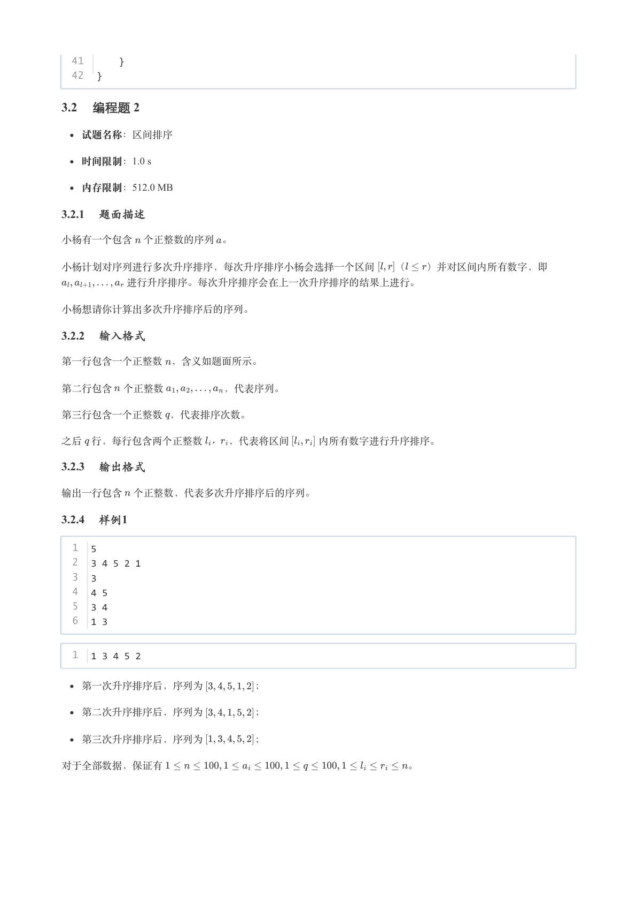
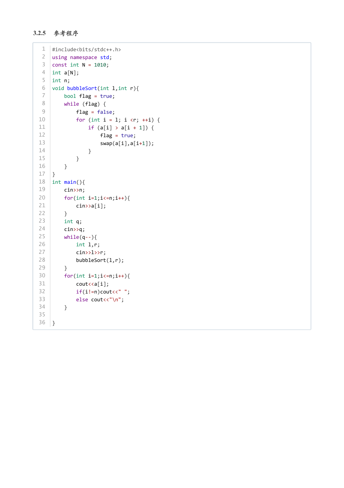

# 2024年9月-C++4级

- 原始 PDF：[`pdfs/2024年9月-C++4级.pdf`](../pdfs/2024年9月-C++4级.pdf)
- 页数：10
- 转换脚本：[`scripts/convert_pdfs_to_markdown.py`](../scripts/convert_pdfs_to_markdown.py)

> 为尽量避免信息丢失，每页均附带页面图片；文本提取结果保留原有顺序与换行特征，个别公式、图形、特殊排版请以页面图片为准。

## 第 1 页



### 提取文本

```
C++　四级

                      2024 年 09 月

1 单选题（每题 2 分，共 30 分）


            题号  1  2  3  4  5  6  7  8  9  10  11  12  13  14  15
            答案 A B A B D A B D A  B  C  A  A  A  C


第 1 题 在 C++ 中，（ ）正确定义了一个返回整数值并接受两个整数参数的函数。

    A. int add(int a, int b) { return a + b; }

    B. void add(int a, int b) { return a + b; }

    C. int add(a, b) { return a + b; }

    D. void add(int a, int b) { return a - b; }

第 2 题 在C++中，形参与实参的关系描述正确的是（ ）。

    A. 形参在函数调用时指定，实参在函数定义时传递

    B. 形参在函数定义时指定，实参在函数调用时传递

    C. 形参和实参可以互换

    D. 形参和实参必须是完全相同的类型，不能有任何差异。

第 3 题 运行以下代码，屏幕上将输出（ ）。


   1  #include <iostream>
   2  using namespace std;
   3
   4  int var = 100;
   5
   6  void function() {
   7      int var = 200;
   8
   9      cout << var <<  " ";
  10      cout << ::var <<  " ";
  11  }
  12
  13  int main() {
  14      cout << var << " ";
  15
  16      function();
  17
  18      var += 100;
  19      cout << var << " ";
```

## 第 2 页



### 提取文本

```
20
  21      return 0;
  22  }


    A. 100 200 100 200

    B. 100 200 100 300

    C. 100 200 200 200

    D. 100 200 200 300

第 4 题 运行下面代码，屏幕上输出是（ ）。


  1  int arr[3] = {24, 9, 7};
  2  int* p = arr;
  3  p++;
  4  cout << *p << endl;


    A. 24

    B. 9

    C. 7

    D. 不确定

第 5 题 运行下面代码片段的结果是（ ）。


  1  int x = 20;
  2  int y = 24;
  3  int* p = &x;
  4  int* q = &y;
  5
  6  p = q;


    A. 将赋值为24

    B. 将赋值为20

    C. 将指向的地址

    D. 将指向的地址

第 6 题 在 C++ 中，（ ）正确定义一个名为student 的结构体，其中包含一个name 字符数组和一个age 整数？

    A. struct student { char name[20]; int age; };

    B. student struct { char name[20]; int age; };

    C. student struct { string name; int age; };

    D. struct student { char[20] name; int age; };

第 7 题 在 C++ 中，（ ）正确声明了一个 3 行 4 列的二维数组。

    A. int arr[3, 4];
```

## 第 3 页



### 提取文本

```
B. int arr[3][4];

    C. int arr[4][3];

    D. int arr(3, 4);

第 8 题 一个二维数组定义为 int arr[3][4]; （假设一个int变量占4个字节），则int arr[0] 占用（ ）个字节

的内存。

    A. 3

    B. 4

    C. 12

    D. 16

第 9 题 下面代码采用递推算法来实现整数的阶乘（            ），则横线上应填写（ ）。


  1  int factorial(int n) {
  2      int result = 1;
  3      for (int i = 2; i <= n; i++) {
  4          ________________________________     // 在此处填入代码
  5      }
  6      return result;
  7  }


    A. result *= i;

    B. result += i;

    C. result *= result;

    D. result += result;

第 10 题 在排序算法中，稳定性指的是（ ）。

    A. 排序后数据不会丢失

    B. 排序后相同元素的相对顺序保持不变

    C. 排序后数据不会被修改

    D. 排序后数据的时间复杂度不变

第 11 题 下面代码实现了冒泡排序函数，则横线上应填写（ ）。

   1 //交换数组arr的第i个元素和第j个元素
   2  void swap(vector<int> &arr, int i, int j) {
   3      int tmp = arr[i];
   4      arr[i] = arr[j];
   5      arr[j] = tmp;
   6  }
   7
   8  int bubble_sort(vector<int> &arr) {
   9      for (int i = arr.size() - 1; i > 0; i--) {
  10          bool flag = false; // 标志位
  11          ________________________________ {    // 在此处填入代码
```

## 第 4 页



### 提取文本

```
12
  13              if (arr[j] > arr[j + 1]) {
  14                  swap(arr, i, j);
  15                  flag = true;
  16              }
  17          }
  18          if (!flag)
  19              break; // 此轮“冒泡”未交换任何元素
  20      }
  21  }


    A. for (int j = 0; j < arr.size() - 1; j++)

    B. for (int j = arr.size() - 1; j > 0; j--)

    C. for (int j = 0; j < i; j++)

    D. for (int j = i-1; j <=0; j--)

第 12 题 上一题算法的时间复杂度为（ ）。

    A.

    B.

    C.

    D.

第 13 题 下面代码实现了插入排序函数（升序），则横线上应填写（ ）。


   1  void insertion_sort(vector<int> &nums) {
   2      for (int i = 1; i < nums.size(); i++) {
   3          int base = nums[i], j = i - 1;
   4
   5          ________________________________ {    // 在此处填入代码
   6              nums[j + 1] = nums[j];
   7              j--;
   8          }
   9          nums[j + 1] = base;
  10      }
  11  }


    A. while (j >= 0 && nums[j] > base)

    B. while (j > 0 && nums[j] > base)

    C. while (j >= 0 && nums[j] < base)

    D. while (j > 0 && nums[j] < base)

第 14 题 小杨用文件重定向实现在log.txt 文件中输出日志，则下面横线上应填写（ ）。


   1  #include <iostream>
   2  #include <fstream>
   3  #include <string>
   4  using namespace std;
```

## 第 5 页



### 提取文本

```
5
   6  int main() {
   7      ofstream log_file("log.txt");
   8
   9      streambuf* original_cout = cout.rdbuf();
  10      cout.rdbuf(log_file.rdbuf());
  11
  12      ___________________________________     // 在此处填入代码
  13
  14      cout.rdbuf(original_cout);  // 恢复原始的标准输出缓冲区
  15      return 0;
  16  }


    A. cout << "This output will go to the log file." << endl;

    B. log_file << "This output will go to the log file." << endl;

    C. cout >> "This output will go to the log file." >> endl;

    D. log_file >> "This output will go to the log file." >> endl;

第 15 题 运行下面的代码，屏幕上将输出（ ）。


   1  #include <iostream>
   2  using namespace std;
   3
   4  int divide(int a, int b) {
   5      if (b == 0) {
   6          throw runtime_error("division by zero error ");
   7      }
   8      return a / b;
   9  }
  10
  11  int main() {
  12      int x = 10;
  13      int y = 0;  // 设为 0 会导致除零错误
  14
  15      try {
  16          int result = divide(x, y);
  17          cout << "result: " << result << endl;
  18      } catch (const runtime_error& e) {
  19          cout << "caught an exception: " << e.what() << endl;
  20      }
  21
  22      return 0;
  23  }

    A. division by zero error result: caught an exception:

    B. result: caught an exception: division by zero error

    C. caught an exception: division by zero error

    D. division by zero error caught an exception: division by zero error
```

## 第 6 页



### 提取文本

```
2 判断题（每题 2 分，共 20 分）

                 题号  1  2  3  4  5  6  7  8  9  10

                 答案


第 1 题 代码int a = 10; int* p = &a; 可以正确定义指针和初始化指针。

第 2 题 在 C++ 中，引用传递允许函数修改传递给它的参数的值。

第 3 题 指针的大小与其所指向的变量的数据类型的大小相同。

第 4 题 二维数组的行的大小的必须在定义时确定，列的大小可以动态变化。

第 5 题 递推算法通过逐步求解当前状态和前一个或几个状态之间的关系来解决问题。

第 6 题 选择排序是稳定的排序算法。

第 7 题 插入排序的时间复杂度总是比冒泡排序低。

第 8 题 在 C++ 中，如果没有捕获到异常（没有匹配的 catch 块），程序会继续执行而不会终止。

第 9 题 以下代码用递推法求斐波那契数列的第项，时间复杂度为指数级。


   1  int fibonacci(int n) {
   2      if (n == 0) return 0;
   3      if (n == 1) return 1;
   4
   5      int f0 = 0; // F(0)
   6      int f1 = 1; // F(1)
   7      int current;
   8
   9      for (int i = 2; i <= n; i++) {
  10          current = f0+ f1; // F(n) = F(n-1) + F(n-2)
  11          f0 = f1;
  12          f1 = current;
  13      }
  14
  15      return current ;
  16  }


第 10 题 执行下面C++代码后，输出的是20。


   1  int point(int* p){
   2      return *p * 2;
   3  }
   4
   5  int main() {
   6      int a = 10;
   7      int* p = &a;
   8      *p = point(p);
   9      cout << *p << endl;
  10  }
```

## 第 7 页



### 提取文本

```
3 编程题（每题 25 分，共 50 分）

3.1 编程题 1


  试题名称：黑白方块

   时间限制：1.0 s

   内存限制：512.0 MB

3.1.1 题面描述

小杨有一个 行 列的网格图，其中每个格子要么是白色，要么是黑色。


小杨想知道网格图中是否存在一个满足如下条件的子矩形：


  子矩形由 行 列组成；


  子矩形的第 行 和第 行只包含白色格子；


  对于子矩形的第 行 和第 行，只有第 个和第 个格子是白色的，其余格子都是黑色的；


请你编写程序帮助小杨判断。

3.1.2 输入格式

第一行包含一个正整数 ，代表测试用例组数。


接下来是 组测试用例。对于每组测试用例，一共   行。


第一行包含两个正整数  ，含义如题面所示。


之后 行，每行一个长度为 的  串，代表网格图第 行格子的颜色，如果为 ，则对应格子为白色，否则为黑

色。

3.1.3 输出格式

对于每组测试用例，如果存在，输出 Yes，否则输出 No。

3.1.4 样例1

   1  3
   2  1 4
   3  0110
   4  5 5
   5  00000
   6  01100
   7  01100
   8  00001
   9  01100
  10  5 5
  11  00000
  12  01100
  13  01110
  14  00001
  15  01100
```

## 第 8 页



### 提取文本

```
1  No
  2  Yes
  3  No


满足条件的子矩形形如：


  1  0000
  2  0110
  3  0110
  4  0000


对于全部数据，保证有            。

3.1.5 参考程序

   1  #include<bits/stdc++.h>
   2  using namespace std;
   3  const int N = 110;
   4  int w[N][N];
   5  int n,m;
   6  int match[4][4];
   7  bool check(int xa,int ya){
   8      for(int i=0;i<4;i++){
   9          for(int j=0;j<4;j++){
  10              if(w[xa+i][ya+j]!=match[i][j]){
  11                  return false;
  12              }
  13          }
  14      }
  15      return true;
  16  }
  17
  18  int main(){
  19      int t;
  20      cin>>t;
  21      for(int i=1;i<3;i++)match[1][i]=match[2][i]=1;
  22      while(t--){
  23          cin>>n>>m;
  24          for(int i=1;i<=n;i++){
  25              string s;
  26              cin>>s;
  27              for(int j=1;j<=m;j++){
  28                  w[i][j]=s[j-1]-'0';
  29              }
  30          }
  31          int fl = 0;
  32          for(int i=1;i<=n-3;i++){
  33              for(int j=1;j<=m-3;j++){
  34                  if(check(i,j)){
  35                      fl=1;
  36                  }
  37              }
  38          }
  39          if(fl)cout<<"Yes\n";
  40          else cout<<"No\n";
```

## 第 9 页



### 提取文本

```
41      }
  42  }

3.2 编程题 2


  试题名称：区间排序

   时间限制：1.0 s

   内存限制：512.0 MB

3.2.1 题面描述

小杨有一个包含 个正整数的序列 。


小杨计划对序列进行多次升序排序，每次升序排序小杨会选择一个区间  （  ）并对区间内所有数字，即

      进行升序排序。每次升序排序会在上一次升序排序的结果上进行。


小杨想请你计算出多次升序排序后的序列。

3.2.2 输入格式

第一行包含一个正整数 ，含义如题面所示。


第二行包含 个正整数      ，代表序列。


第三行包含一个正整数 ，代表排序次数。


之后 行，每行包含两个正整数 ， ，代表将区间   内所有数字进行升序排序。

3.2.3 输出格式

输出一行包含 个正整数，代表多次升序排序后的序列。

3.2.4 样例1

  1  5
  2  3 4 5 2 1
  3  3
  4  4 5
  5  3 4
  6  1 3


  1  1 3 4 5 2


  第一次升序排序后，序列为     ；


  第二次升序排序后，序列为     ；


  第三次升序排序后，序列为     ；


对于全部数据，保证有                        。
```

## 第 10 页



### 提取文本

```
3.2.5 参考程序

   1  #include<bits/stdc++.h>
   2  using namespace std;
   3  const int N = 1010;
   4  int a[N];
   5  int n;
   6  void bubbleSort(int l,int r){
   7      bool flag = true;
   8      while (flag) {
   9          flag = false;
  10          for (int i = l; i <r; ++i) {
  11              if (a[i] > a[i + 1]) {
  12                  flag = true;
  13                  swap(a[i],a[i+1]);
  14              }
  15          }
  16      }
  17  }
  18  int main(){
  19      cin>>n;
  20      for(int i=1;i<=n;i++){
  21          cin>>a[i];
  22      }
  23      int q;
  24      cin>>q;
  25      while(q--){
  26          int l,r;
  27          cin>>l>>r;
  28          bubbleSort(l,r);
  29      }
  30      for(int i=1;i<=n;i++){
  31          cout<<a[i];
  32          if(i!=n)cout<<" ";
  33          else cout<<"\n";
  34      }
  35
  36  }
```
