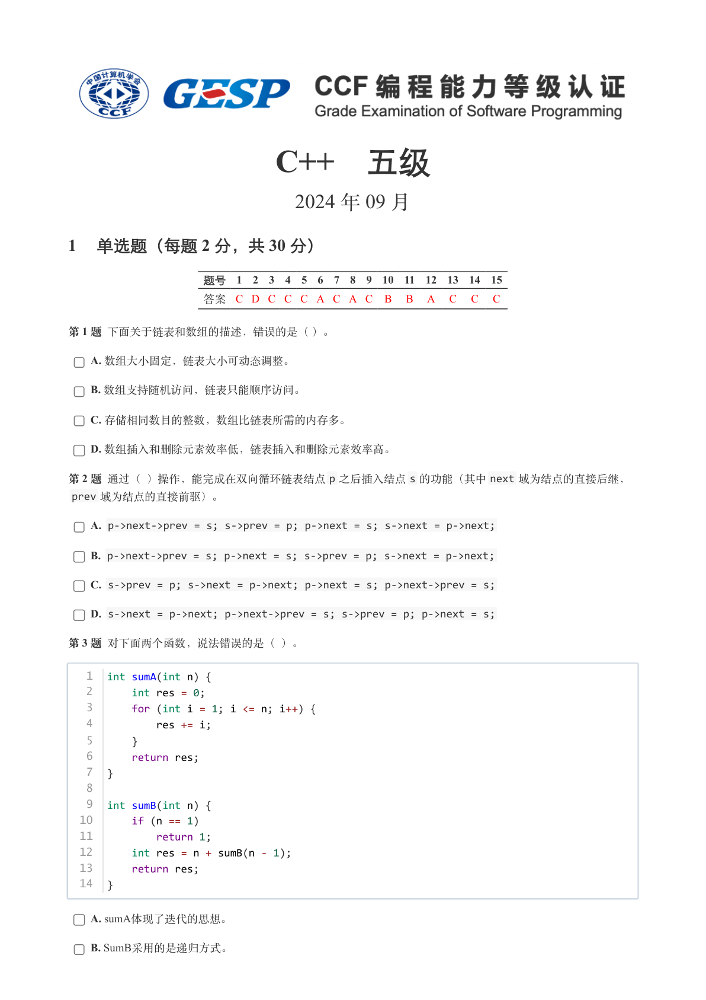
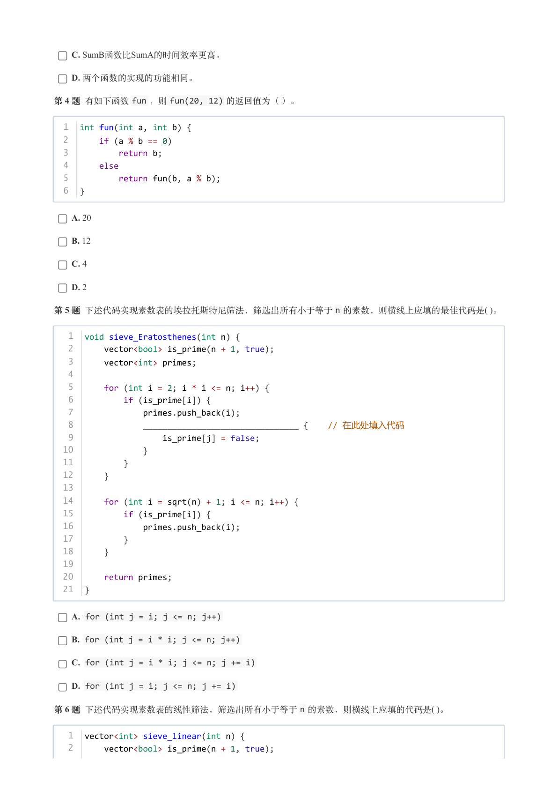
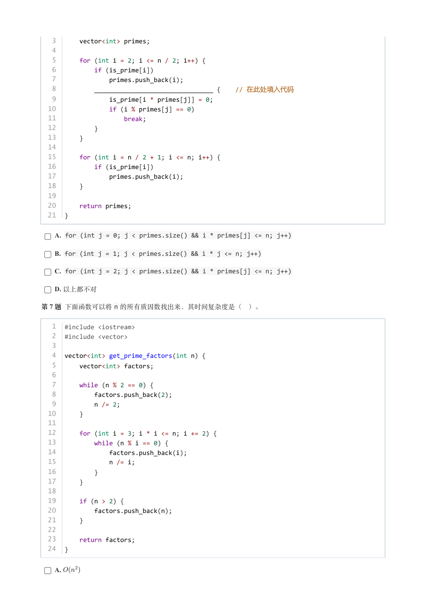
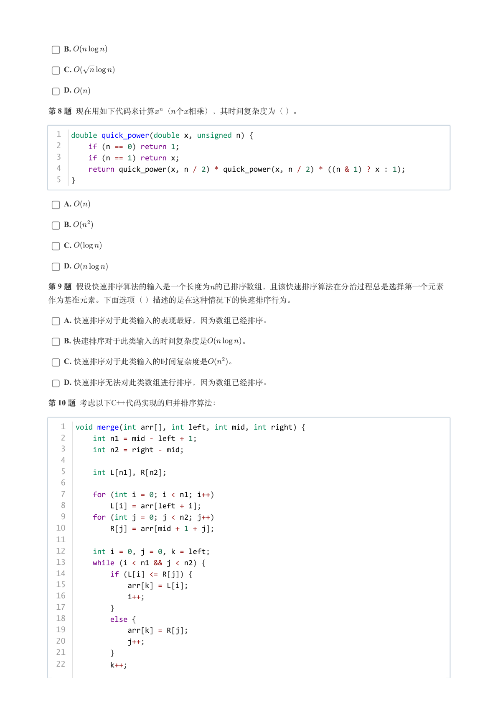
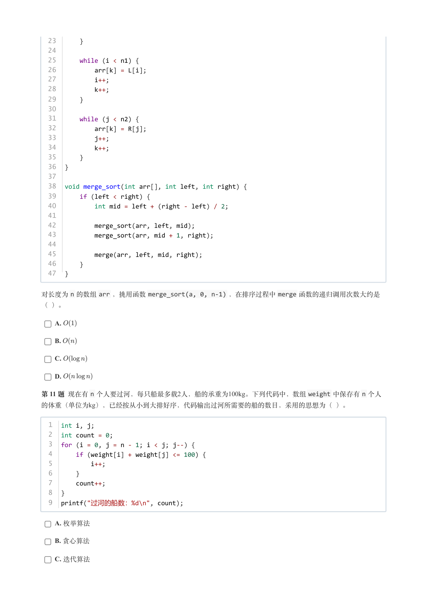
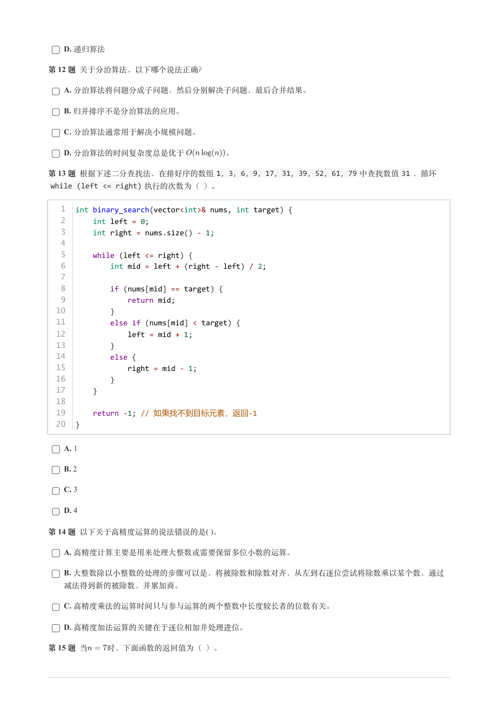
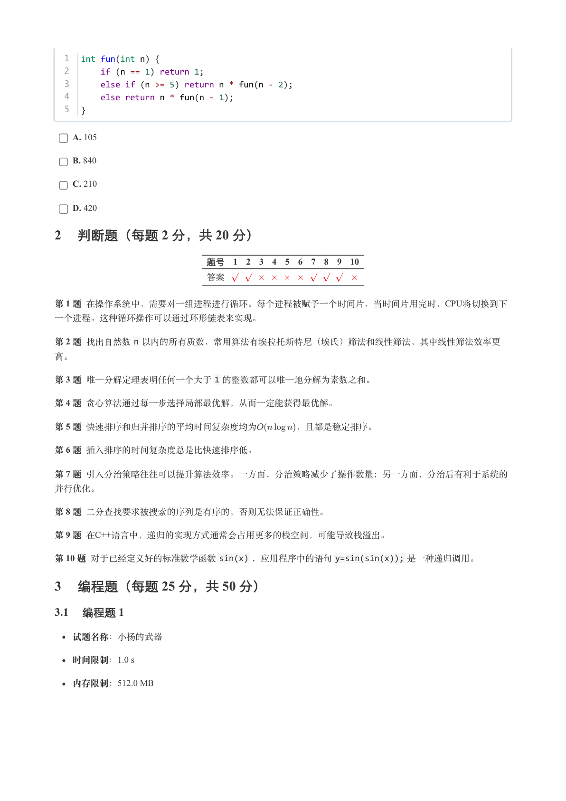
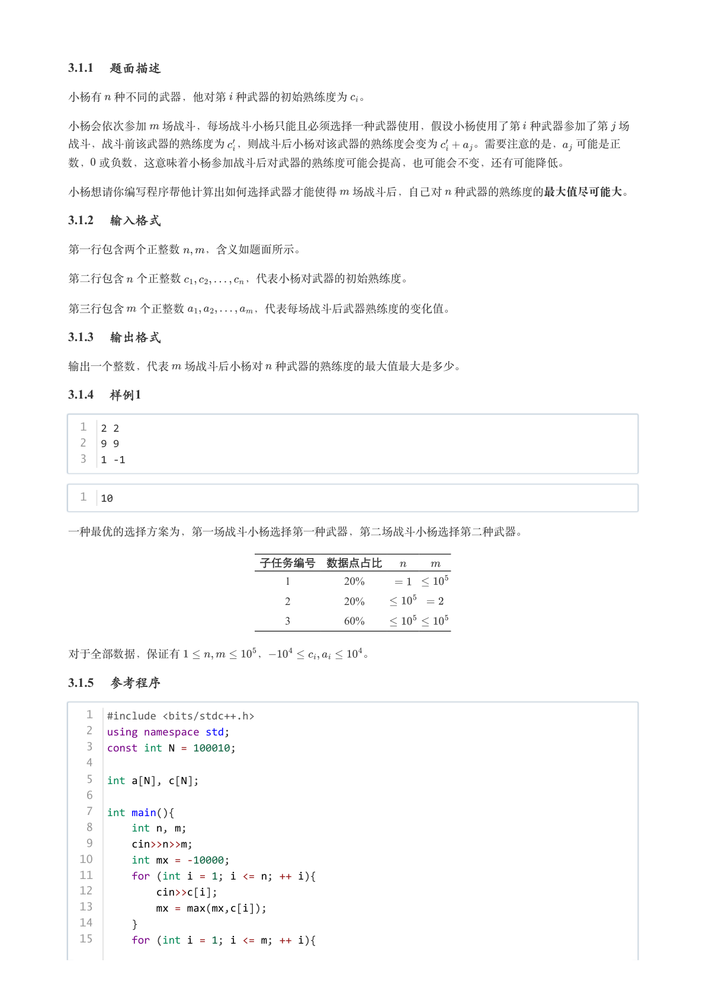
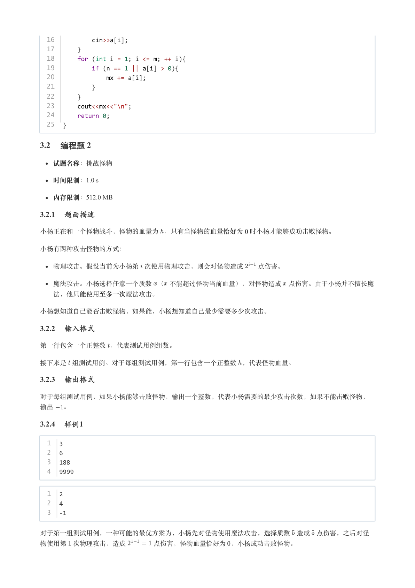
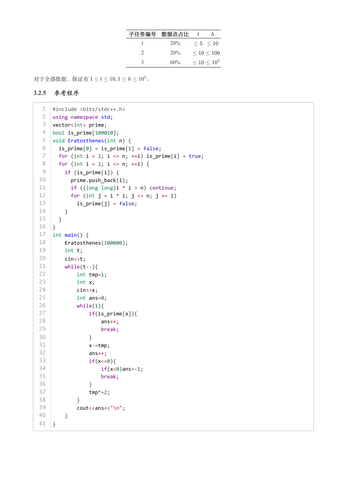

# 2024年9月-C++5级

- 原始 PDF：[`pdfs/2024年9月-C++5级.pdf`](../pdfs/2024年9月-C++5级.pdf)
- 页数：10
- 转换脚本：[`scripts/convert_pdfs_to_markdown.py`](../scripts/convert_pdfs_to_markdown.py)

> 为尽量避免信息丢失，每页均附带页面图片；文本提取结果保留原有顺序与换行特征，个别公式、图形、特殊排版请以页面图片为准。

## 第 1 页



### 提取文本

```
C++　五级

                      2024 年 09 月

1 单选题（每题 2 分，共 30 分）


            题号  1  2  3  4  5  6  7  8  9  10  11  12  13  14  15
            答案 C D C C C A C A C  B  B  A  C  C  C


第 1 题 下面关于链表和数组的描述，错误的是（ ）。

    A. 数组大小固定，链表大小可动态调整。

    B. 数组支持随机访问，链表只能顺序访问。

    C. 存储相同数目的整数，数组比链表所需的内存多。

    D. 数组插入和删除元素效率低，链表插入和删除元素效率高。

第 2 题 通过（ ）操作，能完成在双向循环链表结点p 之后插入结点s 的功能（其中next 域为结点的直接后继，
 prev 域为结点的直接前驱）。

    A. p->next->prev = s; s->prev = p; p->next = s; s->next = p->next;

    B. p->next->prev = s; p->next = s; s->prev = p; s->next = p->next;

    C. s->prev = p; s->next = p->next; p->next = s; p->next->prev = s;

    D. s->next = p->next; p->next->prev = s; s->prev = p; p->next = s;

第 3 题 对下面两个函数，说法错误的是（ ）。


   1  int sumA(int n) {
   2      int res = 0;
   3      for (int i = 1; i <= n; i++) {
   4          res += i;
   5      }
   6      return res;
   7  }
   8
   9  int sumB(int n) {
  10      if (n == 1)
  11          return 1;
  12      int res = n + sumB(n - 1);
  13      return res;
  14  }


    A. sumA体现了迭代的思想。

    B. SumB采用的是递归方式。
```

## 第 2 页



### 提取文本

```
C. SumB函数比SumA的时间效率更高。

    D. 两个函数的实现的功能相同。

第 4 题 有如下函数fun ，则fun(20, 12) 的返回值为（ ）。


  1  int fun(int a, int b) {
  2      if (a % b == 0)
  3          return b;
  4      else
  5          return fun(b, a % b);
  6  }


    A. 20

    B. 12

    C. 4

    D. 2

第 5 题 下述代码实现素数表的埃拉托斯特尼筛法，筛选出所有小于等于n 的素数，则横线上应填的最佳代码是( )。


   1  void sieve_Eratosthenes(int n) {
   2      vector<bool> is_prime(n + 1, true);
   3      vector<int> primes;
   4
   5      for (int i = 2; i * i <= n; i++) {
   6          if (is_prime[i]) {
   7              primes.push_back(i);
   8              ________________________________ {    // 在此处填入代码
   9                  is_prime[j] = false;
  10              }
  11          }
  12      }
  13
  14      for (int i = sqrt(n) + 1; i <= n; i++) {
  15          if (is_prime[i]) {
  16              primes.push_back(i);
  17          }
  18      }
  19
  20      return primes;
  21  }


    A. for (int j = i; j <= n; j++)

    B. for (int j = i * i; j <= n; j++)

    C. for (int j = i * i; j <= n; j += i)

    D. for (int j = i; j <= n; j += i)

第 6 题 下述代码实现素数表的线性筛法，筛选出所有小于等于n 的素数，则横线上应填的代码是( )。


   1  vector<int> sieve_linear(int n) {
   2      vector<bool> is_prime(n + 1, true);
```

## 第 3 页



### 提取文本

```
3      vector<int> primes;
   4
   5      for (int i = 2; i <= n / 2; i++) {
   6          if (is_prime[i])
   7              primes.push_back(i);
   8          ________________________________ {    // 在此处填入代码
   9              is_prime[i * primes[j]] = 0;
  10              if (i % primes[j] == 0)
  11                  break;
  12          }
  13      }
  14
  15      for (int i = n / 2 + 1; i <= n; i++) {
  16          if (is_prime[i])
  17              primes.push_back(i);
  18      }
  19
  20      return primes;
  21  }

    A. for (int j = 0; j < primes.size() && i * primes[j] <= n; j++)

    B. for (int j = 1; j < primes.size() && i * j <= n; j++)

    C. for (int j = 2; j < primes.size() && i * primes[j] <= n; j++)

    D. 以上都不对

第 7 题 下面函数可以将n 的所有质因数找出来，其时间复杂度是（ ）。


   1  #include <iostream>
   2  #include <vector>
   3
   4  vector<int> get_prime_factors(int n) {
   5      vector<int> factors;
   6
   7      while (n % 2 == 0) {
   8          factors.push_back(2);
   9          n /= 2;
  10      }
  11
  12      for (int i = 3; i * i <= n; i += 2) {
  13          while (n % i == 0) {
  14              factors.push_back(i);
  15              n /= i;
  16          }
  17      }
  18
  19      if (n > 2) {
  20          factors.push_back(n);
  21      }
  22
  23      return factors;
  24  }


    A.
```

## 第 4 页



### 提取文本

```
B.

    C.

    D.

第 8 题 现在用如下代码来计算 （个相乘），其时间复杂度为（ ）。


  1  double quick_power(double x, unsigned n) {
  2      if (n == 0) return 1;
  3      if (n == 1) return x;
  4      return quick_power(x, n / 2) * quick_power(x, n / 2) * ((n & 1) ? x : 1);
  5  }


    A.

    B.

    C.

    D.

第 9 题 假设快速排序算法的输入是一个长度为的已排序数组，且该快速排序算法在分治过程总是选择第一个元素

作为基准元素。下面选项（ ）描述的是在这种情况下的快速排序行为。

    A. 快速排序对于此类输入的表现最好，因为数组已经排序。

    B. 快速排序对于此类输入的时间复杂度是    。

    C. 快速排序对于此类输入的时间复杂度是   。

    D. 快速排序无法对此类数组进行排序，因为数组已经排序。

第 10 题 考虑以下C++代码实现的归并排序算法：


   1  void merge(int arr[], int left, int mid, int right) {
   2      int n1 = mid - left + 1;
   3      int n2 = right - mid;
   4
   5      int L[n1], R[n2];
   6
   7      for (int i = 0; i < n1; i++)
   8          L[i] = arr[left + i];
   9      for (int j = 0; j < n2; j++)
  10          R[j] = arr[mid + 1 + j];
  11
  12      int i = 0, j = 0, k = left;
  13      while (i < n1 && j < n2) {
  14          if (L[i] <= R[j]) {
  15              arr[k] = L[i];
  16              i++;
  17          }
  18          else {
  19              arr[k] = R[j];
  20              j++;
  21          }
  22          k++;
```

## 第 5 页



### 提取文本

```
23      }
  24
  25      while (i < n1) {
  26          arr[k] = L[i];
  27          i++;
  28          k++;
  29      }
  30
  31      while (j < n2) {
  32          arr[k] = R[j];
  33          j++;
  34          k++;
  35      }
  36  }
  37
  38  void merge_sort(int arr[], int left, int right) {
  39      if (left < right) {
  40          int mid = left + (right - left) / 2;
  41
  42          merge_sort(arr, left, mid);
  43          merge_sort(arr, mid + 1, right);
  44
  45          merge(arr, left, mid, right);
  46      }
  47  }


对长度为n 的数组arr ，挑用函数merge_sort(a, 0, n-1) ，在排序过程中merge 函数的递归调用次数大约是

（ ）。

    A.

    B.

    C.

    D.

第 11 题 现在有n 个人要过河，每只船最多载2人，船的承重为100kg。下列代码中，数组weight 中保存有n 个人
的体重（单位为kg），已经按从小到大排好序，代码输出过河所需要的船的数目，采用的思想为（ ）。


  1  int i, j;
  2  int count = 0;
  3  for (i = 0, j = n - 1; i < j; j--) {
  4      if (weight[i] + weight[j] <= 100) {
  5          i++;
  6      }
  7      count++;
  8  }
  9  printf("过河的船数：%d\n", count);


    A. 枚举算法

    B. 贪心算法

    C. 迭代算法
```

## 第 6 页



### 提取文本

```
D. 递归算法

第 12 题 关于分治算法，以下哪个说法正确？

    A. 分治算法将问题分成子问题，然后分别解决子问题，最后合并结果。

    B. 归并排序不是分治算法的应用。

    C. 分治算法通常用于解决小规模问题。

    D. 分治算法的时间复杂度总是优于     。

第 13 题 根据下述二分查找法，在排好序的数组1，3，6，9，17，31，39，52，61，79 中查找数值31 ，循环
 while (left <= right) 执行的次数为（ ）。


   1  int binary_search(vector<int>& nums, int target) {
   2      int left = 0;
   3      int right = nums.size() - 1;
   4
   5      while (left <= right) {
   6          int mid = left + (right - left) / 2;
   7
   8          if (nums[mid] == target) {
   9              return mid;
  10          }
  11          else if (nums[mid] < target) {
  12              left = mid + 1;
  13          }
  14          else {
  15              right = mid - 1;
  16          }
  17      }
  18
  19      return -1; // 如果找不到目标元素，返回-1
  20  }


    A. 1

    B. 2

    C. 3

    D. 4

第 14 题 以下关于高精度运算的说法错误的是( )。

    A. 高精度计算主要是用来处理大整数或需要保留多位小数的运算。

    B. 大整数除以小整数的处理的步骤可以是，将被除数和除数对齐，从左到右逐位尝试将除数乘以某个数，通过

  减法得到新的被除数，并累加商。

    C. 高精度乘法的运算时间只与参与运算的两个整数中长度较长者的位数有关。

    D. 高精度加法运算的关键在于逐位相加并处理进位。

第 15 题 当  时，下面函数的返回值为（ ）。
```

## 第 7 页



### 提取文本

```
1  int fun(int n) {
  2      if (n == 1) return 1;
  3      else if (n >= 5) return n * fun(n - 2);
  4      else return n * fun(n - 1);
  5  }


    A. 105

    B. 840

    C. 210

    D. 420

2 判断题（每题 2 分，共 20 分）

                 题号  1  2  3  4  5  6  7  8  9  10

                 答案


第 1 题 在操作系统中，需要对一组进程进行循环。每个进程被赋予一个时间片，当时间片用完时，CPU将切换到下

一个进程。这种循环操作可以通过环形链表来实现。

第 2 题 找出自然数n 以内的所有质数，常用算法有埃拉托斯特尼（埃氏）筛法和线性筛法，其中线性筛法效率更

高。

第 3 题 唯一分解定理表明任何一个大于1 的整数都可以唯一地分解为素数之和。

第 4 题 贪心算法通过每一步选择局部最优解，从而一定能获得最优解。

第 5 题 快速排序和归并排序的平均时间复杂度均为    ，且都是稳定排序。

第 6 题 插入排序的时间复杂度总是比快速排序低。

第 7 题 引入分治策略往往可以提升算法效率。一方面，分治策略减少了操作数量；另一方面，分治后有利于系统的

并行优化。

第 8 题 二分查找要求被搜索的序列是有序的，否则无法保证正确性。

第 9 题 在C++语言中，递归的实现方式通常会占用更多的栈空间，可能导致栈溢出。

第 10 题 对于已经定义好的标准数学函数sin(x) ，应用程序中的语句y=sin(sin(x)); 是一种递归调用。

3 编程题（每题 25 分，共 50 分）

3.1 编程题 1


  试题名称：小杨的武器

   时间限制：1.0 s

   内存限制：512.0 MB
```

## 第 8 页



### 提取文本

```
3.1.1 题面描述

小杨有 种不同的武器，他对第 种武器的初始熟练度为 。


小杨会依次参加 场战斗，每场战斗小杨只能且必须选择一种武器使用，假设小杨使用了第 种武器参加了第 场

战斗，战斗前该武器的熟练度为 ，则战斗后小杨对该武器的熟练度会变为   。需要注意的是， 可能是正

数， 或负数，这意味着小杨参加战斗后对武器的熟练度可能会提高，也可能会不变，还有可能降低。


小杨想请你编写程序帮他计算出如何选择武器才能使得 场战斗后，自己对 种武器的熟练度的最大值尽可能大。

3.1.2 输入格式

第一行包含两个正整数  ，含义如题面所示。


第二行包含 个正整数      ，代表小杨对武器的初始熟练度。


第三行包含 个正整数      ，代表每场战斗后武器熟练度的变化值。

3.1.3 输出格式

输出一个整数，代表 场战斗后小杨对 种武器的熟练度的最大值最大是多少。

3.1.4 样例1

  1  2 2
  2  9 9
  3  1 -1


  1  10


一种最优的选择方案为，第一场战斗小杨选择第一种武器，第二场战斗小杨选择第二种武器。


                 子任务编号 数据点占比

                                       1        20%

                                       2        20%

                                       3        60%


对于全部数据，保证有       ，        。

3.1.5 参考程序

   1  #include <bits/stdc++.h>
   2  using namespace std;
   3  const int N = 100010;
   4
   5  int a[N], c[N];
   6
   7  int main(){
   8      int n, m;
   9      cin>>n>>m;
  10      int mx = -10000;
  11      for (int i = 1; i <= n; ++ i){
  12          cin>>c[i];
  13          mx = max(mx,c[i]);
  14      }
  15      for (int i = 1; i <= m; ++ i){
```

## 第 9 页



### 提取文本

```
16          cin>>a[i];
  17      }
  18      for (int i = 1; i <= m; ++ i){
  19          if (n == 1 || a[i] > 0){
  20              mx += a[i];
  21          }
  22      }
  23      cout<<mx<<"\n";
  24      return 0;
  25  }

3.2 编程题 2


  试题名称：挑战怪物

   时间限制：1.0 s

   内存限制：512.0 MB

3.2.1 题面描述

小杨正在和一个怪物战斗，怪物的血量为 ，只有当怪物的血量恰好为 时小杨才能够成功击败怪物。


小杨有两种攻击怪物的方式：


  物理攻击。假设当前为小杨第 次使用物理攻击，则会对怪物造成  点伤害。


  魔法攻击。小杨选择任意一个质数 （ 不能超过怪物当前血量），对怪物造成 点伤害。由于小杨并不擅长魔

  法，他只能使用至多一次魔法攻击。


小杨想知道自己能否击败怪物，如果能，小杨想知道自己最少需要多少次攻击。

3.2.2 输入格式

第一行包含一个正整数 ，代表测试用例组数。


接下来是 组测试用例。对于每组测试用例，第一行包含一个正整数 ，代表怪物血量。

3.2.3 输出格式

对于每组测试用例，如果小杨能够击败怪物，输出一个整数，代表小杨需要的最少攻击次数，如果不能击败怪物，

输出  。

3.2.4 样例1

  1  3
  2  6
  3  188
  4  9999


  1  2
  2  4
  3  -1


对于第一组测试用例，一种可能的最优方案为，小杨先对怪物使用魔法攻击，选择质数 造成 点伤害，之后对怪

物使用第 次物理攻击，造成    点伤害，怪物血量恰好为 ，小杨成功击败怪物。
```

## 第 10 页



### 提取文本

```
子任务编号 数据点占比

                                       1        20%

                                       2        20%

                                       3        60%


对于全部数据，保证有           。

3.2.5 参考程序

   1  #include <bits/stdc++.h>
   2  using namespace std;
   3  vector<int> prime;
   4  bool is_prime[100010];
   5  void Eratosthenes(int n) {
   6    is_prime[0] = is_prime[1] = false;
   7    for (int i = 2; i <= n; ++i) is_prime[i] = true;
   8    for (int i = 2; i <= n; ++i) {
   9      if (is_prime[i]) {
  10        prime.push_back(i);
  11        if ((long long)i * i > n) continue;
  12        for (int j = i * i; j <= n; j += i)
  13          is_prime[j] = false;
  14      }
  15    }
  16  }
  17  int main() {
  18      Eratosthenes(100000);
  19      int t;
  20      cin>>t;
  21      while(t--){
  22          int tmp=1;
  23          int x;
  24          cin>>x;
  25          int ans=0;
  26          while(1){
  27              if(is_prime[x]){
  28                  ans++;
  29                  break;
  30              }
  31              x-=tmp;
  32              ans++;
  33              if(x<=0){
  34                  if(x<0)ans=-1;
  35                  break;
  36              }
  37              tmp*=2;
  38          }
  39          cout<<ans<<"\n";
  40      }
  41  }
```
