# 2024年9月-C++6级

- 原始 PDF：[`pdfs/2024年9月-C++6级.pdf`](../pdfs/2024年9月-C++6级.pdf)
- 页数：12
- 转换脚本：[`scripts/convert_pdfs_to_markdown.py`](../scripts/convert_pdfs_to_markdown.py)

> 为尽量避免信息丢失，每页均附带页面图片；文本提取结果保留原有顺序与换行特征，个别公式、图形、特殊排版请以页面图片为准。

## 第 1 页

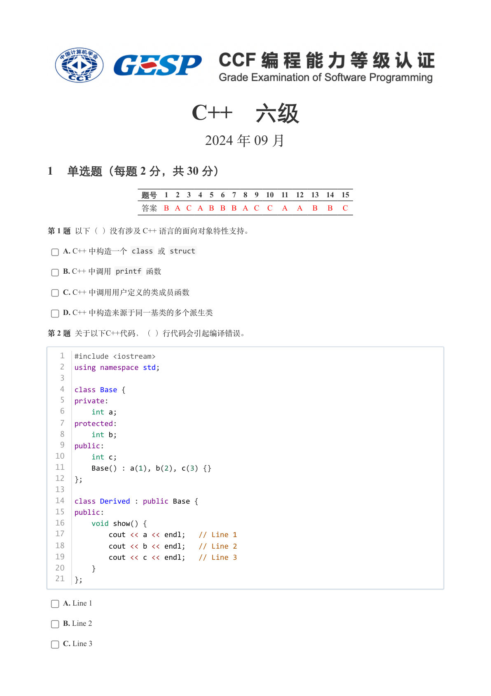

### 提取文本

```
C++　六级

                      2024 年 09 月

1 单选题（每题 2 分，共 30 分）


            题号  1  2  3  4  5  6  7  8  9  10  11  12  13  14  15
            答案 B A C A B B B A C  C  A  A  B  B  C


第 1 题 以下（ ）没有涉及 C++ 语言的面向对象特性支持。

    A. C++ 中构造一个 class 或 struct

    B. C++ 中调用 printf 函数

    C. C++ 中调用用户定义的类成员函数

    D. C++ 中构造来源于同一基类的多个派生类

第 2 题 关于以下C++代码，（ ）行代码会引起编译错误。


   1  #include <iostream>
   2  using namespace std;
   3
   4  class Base {
   5  private:
   6      int a;
   7  protected:
   8      int b;
   9  public:
  10      int c;
  11      Base() : a(1), b(2), c(3) {}
  12  };
  13
  14  class Derived : public Base {
  15  public:
  16      void show() {
  17          cout << a << endl;   // Line 1
  18          cout << b << endl;   // Line 2
  19          cout << c << endl;   // Line 3
  20      }
  21  };


    A. Line 1

    B. Line 2

    C. Line 3
```

## 第 2 页

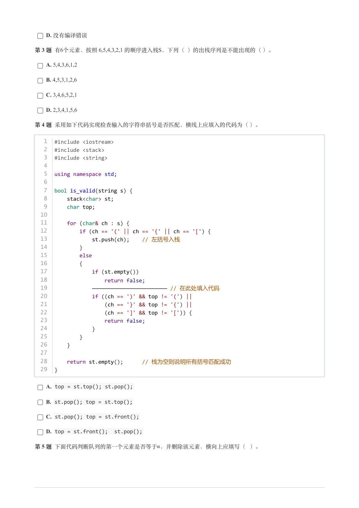

### 提取文本

```
D. 没有编译错误

第 3 题 有6个元素，按照 6,5,4,3,2,1 的顺序进入栈S，下列（ ）的出栈序列是不能出现的（ ）。

    A. 5,4,3,6,1,2

    B. 4,5,3,1,2,6

    C. 3,4,6,5,2,1

    D. 2,3,4,1,5,6

第 4 题 采用如下代码实现检查输入的字符串括号是否匹配，横线上应填入的代码为（ ）。


   1  #include <iostream>
   2  #include <stack>
   3  #include <string>
   4
   5  using namespace std;
   6
   7  bool is_valid(string s) {
   8      stack<char> st;
   9      char top;
  10
  11      for (char& ch : s) {
  12          if (ch == '(' || ch == '{' || ch == '[') {
  13              st.push(ch);    // 左括号入栈
  14          }
  15          else
  16          {
  17              if (st.empty())
  18                  return false;
  19              ———————————————————————— // 在此处填入代码
  20              if ((ch == ')' && top != '(') ||
  21                  (ch == '}' && top != '{') ||
  22                  (ch == ']' && top != '[')) {
  23                  return false;
  24              }
  25          }
  26      }
  27
  28      return st.empty();      // 栈为空则说明所有括号匹配成功
  29  }

    A. top = st.top(); st.pop();

    B. st.pop(); top = st.top();

    C. st.pop(); top = st.front();

    D. top = st.front();  st.pop();

第 5 题 下面代码判断队列的第一个元素是否等于，并删除该元素，横向上应填写（ ）。
```

## 第 3 页

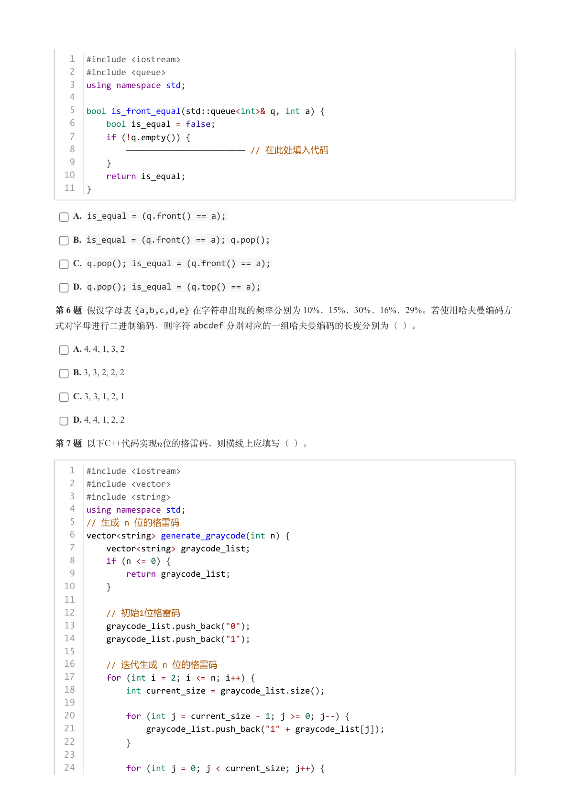

### 提取文本

```
1  #include <iostream>
   2  #include <queue>
   3  using namespace std;
   4
   5  bool is_front_equal(std::queue<int>& q, int a) {
   6      bool is_equal = false;
   7      if (!q.empty()) {
   8          ———————————————————————— // 在此处填入代码
   9      }
  10      return is_equal;
  11  }


    A. is_equal = (q.front() == a);

    B. is_equal = (q.front() == a); q.pop();

    C. q.pop(); is_equal = (q.front() == a);

    D. q.pop(); is_equal = (q.top() == a);

第 6 题 假设字母表{a,b,c,d,e} 在字符串出现的频率分别为 10%，15%，30%，16%，29%。若使用哈夫曼编码方
式对字母进行二进制编码，则字符abcdef 分别对应的一组哈夫曼编码的长度分别为（ ）。

    A. 4, 4, 1, 3, 2

    B. 3, 3, 2, 2, 2

    C. 3, 3, 1, 2, 1

    D. 4, 4, 1, 2, 2

第 7 题 以下C++代码实现位的格雷码，则横线上应填写（ ）。


   1  #include <iostream>
   2  #include <vector>
   3  #include <string>
   4  using namespace std;
   5  // 生成 n 位的格雷码
   6  vector<string> generate_graycode(int n) {
   7      vector<string> graycode_list;
   8      if (n <= 0) {
   9          return graycode_list;
  10      }
  11
  12      // 初始1位格雷码
  13      graycode_list.push_back("0");
  14      graycode_list.push_back("1");
  15
  16      // 迭代生成 n 位的格雷码
  17      for (int i = 2; i <= n; i++) {
  18          int current_size = graycode_list.size();
  19
  20          for (int j = current_size - 1; j >= 0; j--) {
  21              graycode_list.push_back("1" + graycode_list[j]);
  22          }
  23
  24          for (int j = 0; j < current_size; j++) {
```

## 第 4 页

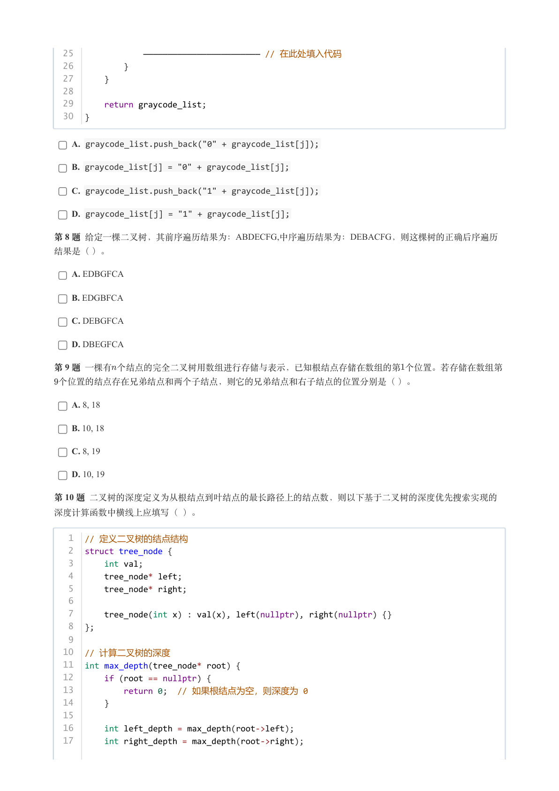

### 提取文本

```
25              ———————————————————————— // 在此处填入代码
  26          }
  27      }
  28
  29      return graycode_list;
  30  }


    A. graycode_list.push_back("0" + graycode_list[j]);

    B. graycode_list[j] = "0" + graycode_list[j];

    C. graycode_list.push_back("1" + graycode_list[j]);

    D. graycode_list[j] = "1" + graycode_list[j];

第 8 题 给定一棵二叉树，其前序遍历结果为：ABDECFG,中序遍历结果为：DEBACFG，则这棵树的正确后序遍历

结果是（ ）。

    A. EDBGFCA

    B. EDGBFCA

    C. DEBGFCA

    D. DBEGFCA

第 9 题 一棵有个结点的完全二叉树用数组进行存储与表示，已知根结点存储在数组的第个位置。若存储在数组第

 个位置的结点存在兄弟结点和两个子结点，则它的兄弟结点和右子结点的位置分别是（ ）。

    A. 8, 18

    B. 10, 18

    C. 8, 19

    D. 10, 19

第 10 题 二叉树的深度定义为从根结点到叶结点的最长路径上的结点数，则以下基于二叉树的深度优先搜索实现的

深度计算函数中横线上应填写（ ）。

   1  // 定义二叉树的结点结构
   2  struct tree_node {
   3      int val;
   4      tree_node* left;
   5      tree_node* right;
   6
   7      tree_node(int x) : val(x), left(nullptr), right(nullptr) {}
   8  };
   9
  10  // 计算二叉树的深度
  11  int max_depth(tree_node* root) {
  12      if (root == nullptr) {
  13          return 0;  // 如果根结点为空，则深度为 0
  14      }
  15
  16      int left_depth = max_depth(root->left);
  17      int right_depth = max_depth(root->right);
```

## 第 5 页

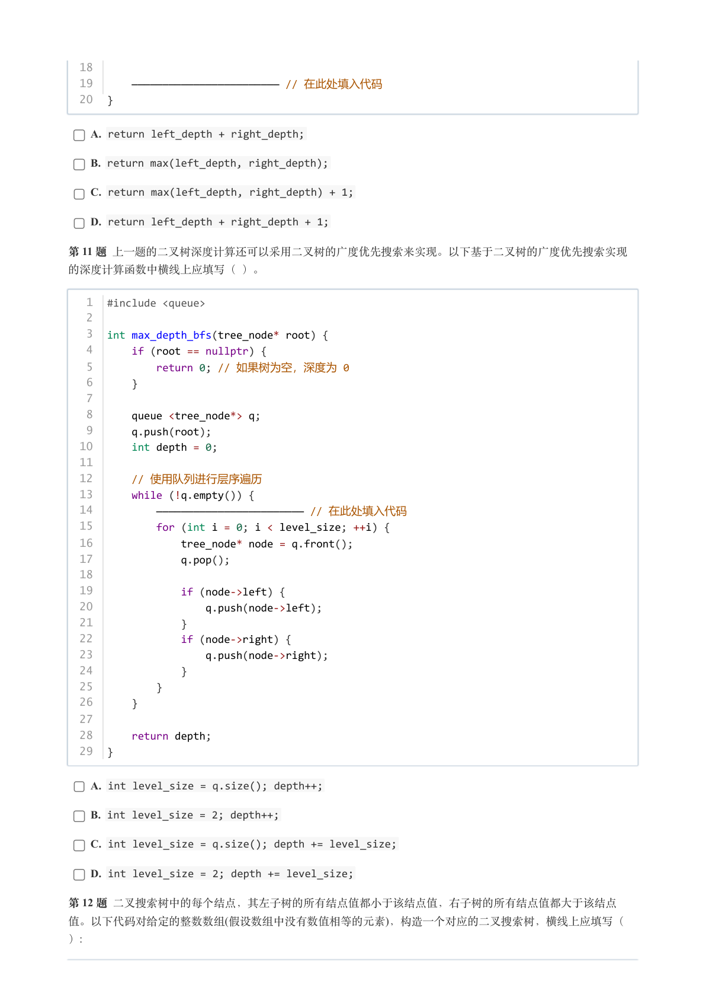

### 提取文本

```
18
  19      ———————————————————————— // 在此处填入代码
  20  }


    A. return left_depth + right_depth;

    B. return max(left_depth, right_depth);

    C. return max(left_depth, right_depth) + 1;

    D. return left_depth + right_depth + 1;

第 11 题 上一题的二叉树深度计算还可以采用二叉树的广度优先搜索来实现。以下基于二叉树的广度优先搜索实现

的深度计算函数中横线上应填写（ ）。


   1  #include <queue>
   2
   3  int max_depth_bfs(tree_node* root) {
   4      if (root == nullptr) {
   5          return 0; // 如果树为空，深度为 0
   6      }
   7
   8      queue <tree_node*> q;
   9      q.push(root);
  10      int depth = 0;
  11
  12      // 使用队列进行层序遍历
  13      while (!q.empty()) {
  14          ———————————————————————— // 在此处填入代码
  15          for (int i = 0; i < level_size; ++i) {
  16              tree_node* node = q.front();
  17              q.pop();
  18
  19              if (node->left) {
  20                  q.push(node->left);
  21              }
  22              if (node->right) {
  23                  q.push(node->right);
  24              }
  25          }
  26      }
  27
  28      return depth;
  29  }


    A. int level_size = q.size(); depth++;

    B. int level_size = 2; depth++;

    C. int level_size = q.size(); depth += level_size;

    D. int level_size = 2; depth += level_size;

第 12 题 二叉搜索树中的每个结点，其左子树的所有结点值都小于该结点值，右子树的所有结点值都大于该结点
值。以下代码对给定的整数数组(假设数组中没有数值相等的元素)，构造一个对应的二叉搜索树，横线上应填写（
）:
```

## 第 6 页

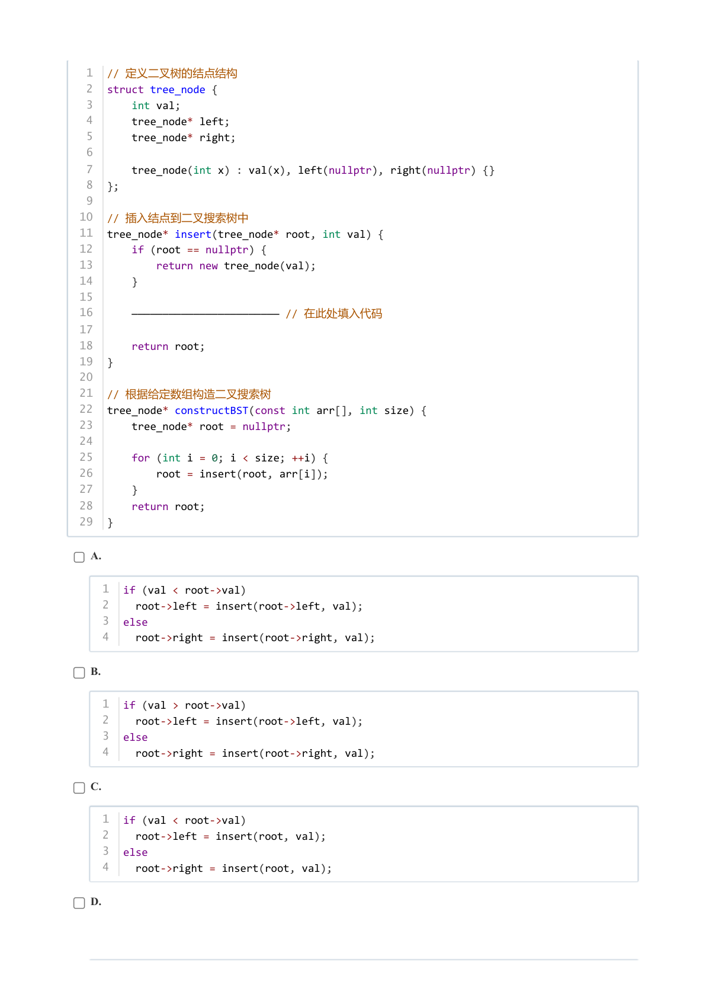

### 提取文本

```
1  // 定义二叉树的结点结构
 2  struct tree_node {
 3      int val;
 4      tree_node* left;
 5      tree_node* right;
 6
 7      tree_node(int x) : val(x), left(nullptr), right(nullptr) {}
 8  };
 9
10  // 插入结点到二叉搜索树中
11  tree_node* insert(tree_node* root, int val) {
12      if (root == nullptr) {
13          return new tree_node(val);
14      }
15
16      ———————————————————————— // 在此处填入代码
17
18      return root;
19  }
20
21  // 根据给定数组构造二叉搜索树
22  tree_node* constructBST(const int arr[], int size) {
23      tree_node* root = nullptr;
24
25      for (int i = 0; i < size; ++i) {
26          root = insert(root, arr[i]);
27      }
28      return root;
29  }


  A.


   1  if (val < root->val)
   2    root->left = insert(root->left, val);
   3  else
   4    root->right = insert(root->right, val);


  B.


   1  if (val > root->val)
   2    root->left = insert(root->left, val);
   3  else
   4    root->right = insert(root->right, val);


  C.


   1  if (val < root->val)
   2    root->left = insert(root, val);
   3  else
   4    root->right = insert(root, val);


  D.
```

## 第 7 页

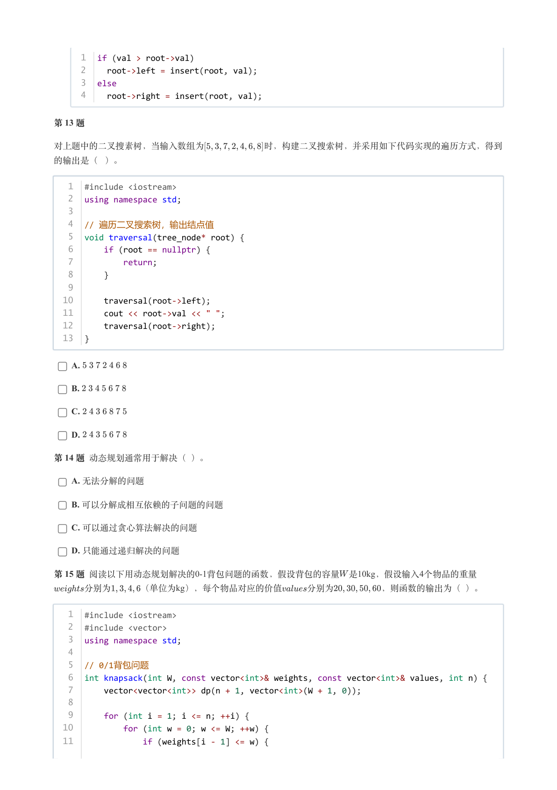

### 提取文本

```
1  if (val > root->val)
     2    root->left = insert(root, val);
     3  else
     4    root->right = insert(root, val);


第 13 题


对上题中的二叉搜素树，当输入数组为       时，构建二叉搜索树，并采用如下代码实现的遍历方式，得到

的输出是（ ）。


   1  #include <iostream>
   2  using namespace std;
   3
   4  // 遍历二叉搜索树，输出结点值
   5  void traversal(tree_node* root) {
   6      if (root == nullptr) {
   7          return;
   8      }
   9
  10      traversal(root->left);
  11      cout << root->val << " ";
  12      traversal(root->right);
  13  }


    A.

    B.

    C.

    D.

第 14 题 动态规划通常用于解决（ ）。

    A. 无法分解的问题

    B. 可以分解成相互依赖的子问题的问题

    C. 可以通过贪心算法解决的问题

    D. 只能通过递归解决的问题

第 15 题 阅读以下用动态规划解决的0-1背包问题的函数，假设背包的容量 是10kg，假设输入4个物品的重量
   分别为    （单位为kg），每个物品对应的价值   分别为     ，则函数的输出为（ ）。


   1  #include <iostream>
   2  #include <vector>
   3  using namespace std;
   4
   5  // 0/1背包问题
   6  int knapsack(int W, const vector<int>& weights, const vector<int>& values, int n) {
   7      vector<vector<int>> dp(n + 1, vector<int>(W + 1, 0));
   8
   9      for (int i = 1; i <= n; ++i) {
  10          for (int w = 0; w <= W; ++w) {
  11              if (weights[i - 1] <= w) {
```

## 第 8 页

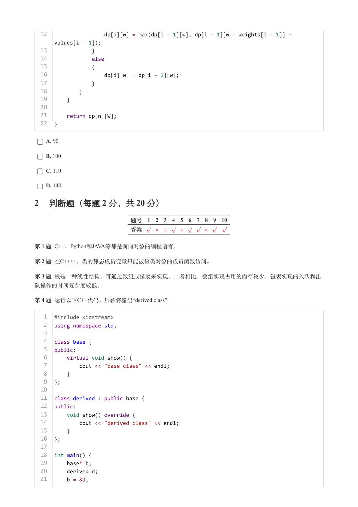

### 提取文本

```
12                  dp[i][w] = max(dp[i - 1][w], dp[i - 1][w - weights[i - 1]] +
      values[i - 1]);
  13              }
  14              else
  15              {
  16                  dp[i][w] = dp[i - 1][w];
  17              }
  18          }
  19      }
  20
  21      return dp[n][W];
  22  }


    A. 90

    B. 100

    C. 110

    D. 140

2 判断题（每题 2 分，共 20 分）

                 题号  1  2  3  4  5  6  7  8  9  10

                 答案


第 1 题 C++、Python和JAVA等都是面向对象的编程语言。

第 2 题 在C++中，类的静态成员变量只能被该类对象的成员函数访问。

第 3 题 栈是一种线性结构，可通过数组或链表来实现。二者相比，数组实现占用的内存较少，链表实现的入队和出

队操作的时间复杂度较低。

第 4 题 运行以下C++代码，屏幕将输出“derived class”。


   1  #include <iostream>
   2  using namespace std;
   3
   4  class base {
   5  public:
   6      virtual void show() {
   7          cout << "base class" << endl;
   8      }
   9  };
  10
  11  class derived : public base {
  12  public:
  13      void show() override {
  14          cout << "derived class" << endl;
  15      }
  16  };
  17
  18  int main() {
  19      base* b;
  20      derived d;
  21      b = &d;
```

## 第 9 页

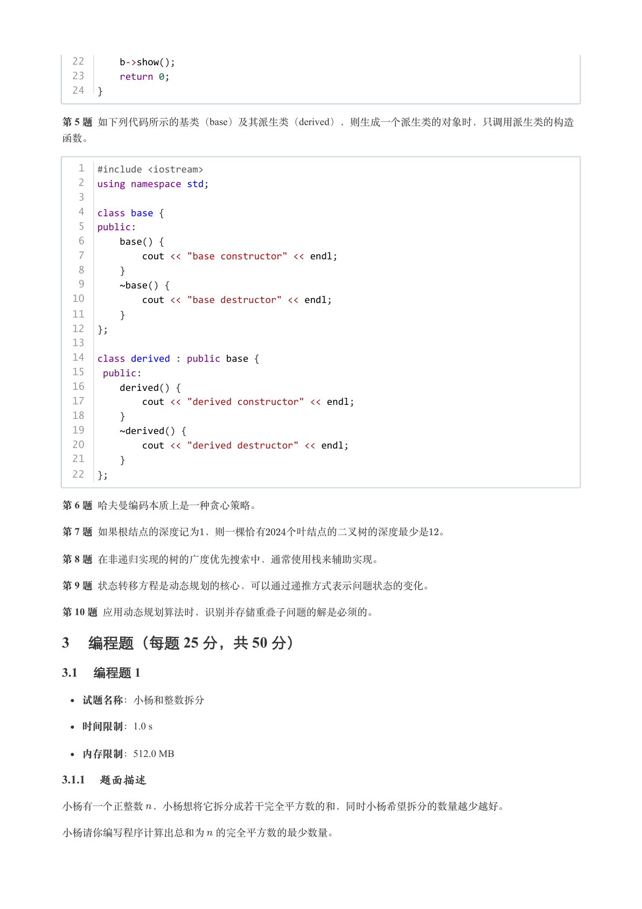

### 提取文本

```
22      b->show();
  23      return 0;
  24  }


第 5 题 如下列代码所示的基类（base）及其派生类（derived），则生成一个派生类的对象时，只调用派生类的构造

函数。


   1  #include <iostream>
   2  using namespace std;
   3
   4  class base {
   5  public:
   6      base() {
   7          cout << "base constructor" << endl;
   8      }
   9      ~base() {
  10          cout << "base destructor" << endl;
  11      }
  12  };
  13
  14  class derived : public base {
  15   public:
  16      derived() {
  17          cout << "derived constructor" << endl;
  18      }
  19      ~derived() {
  20          cout << "derived destructor" << endl;
  21      }
  22  };


第 6 题 哈夫曼编码本质上是一种贪心策略。

第 7 题 如果根结点的深度记为，则一棵恰有  个叶结点的二叉树的深度最少是 。

第 8 题 在非递归实现的树的广度优先搜索中，通常使用栈来辅助实现。

第 9 题 状态转移方程是动态规划的核心，可以通过递推方式表示问题状态的变化。

第 10 题 应用动态规划算法时，识别并存储重叠子问题的解是必须的。

3 编程题（每题 25 分，共 50 分）

3.1 编程题 1


  试题名称：小杨和整数拆分

   时间限制：1.0 s

   内存限制：512.0 MB

3.1.1 题面描述

小杨有一个正整数 ，小杨想将它拆分成若干完全平方数的和，同时小杨希望拆分的数量越少越好。


小杨请你编写程序计算出总和为 的完全平方数的最少数量。
```

## 第 10 页

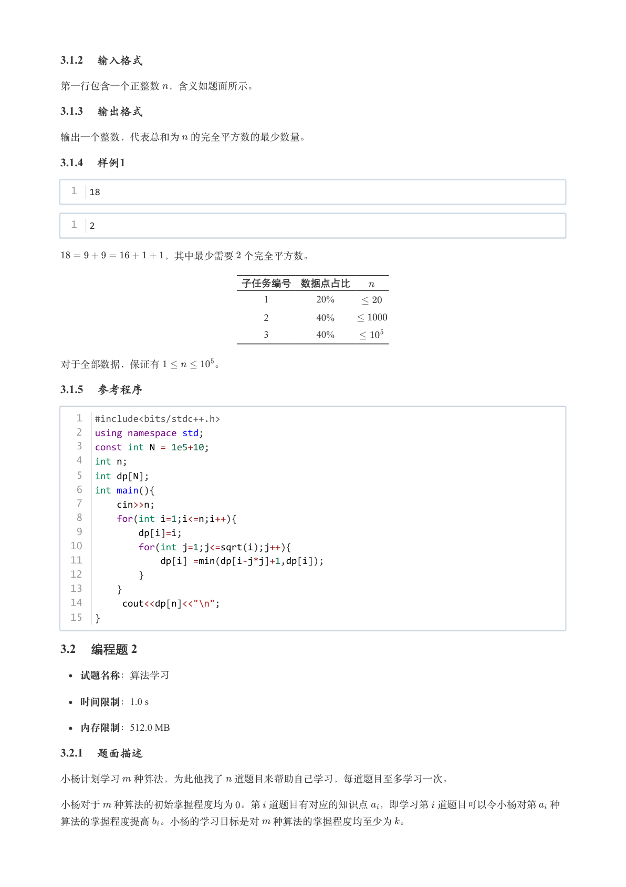

### 提取文本

```
3.1.2 输入格式

第一行包含一个正整数 ，含义如题面所示。

3.1.3 输出格式

输出一个整数，代表总和为 的完全平方数的最少数量。

3.1.4 样例1

  1  18


  1  2


          ，其中最少需要 个完全平方数。


                  子任务编号 数据点占比

                                         1        20%

                                         2        40%

                                         3        40%


对于全部数据，保证有      。

3.1.5 参考程序

   1  #include<bits/stdc++.h>
   2  using namespace std;
   3  const int N = 1e5+10;
   4  int n;
   5  int dp[N];
   6  int main(){
   7      cin>>n;
   8      for(int i=1;i<=n;i++){
   9          dp[i]=i;
  10          for(int j=1;j<=sqrt(i);j++){
  11              dp[i] =min(dp[i-j*j]+1,dp[i]);
  12          }
  13      }
  14       cout<<dp[n]<<"\n";
  15  }

3.2 编程题 2

  试题名称：算法学习

   时间限制：1.0 s

   内存限制：512.0 MB

3.2.1 题面描述

小杨计划学习 种算法，为此他找了 道题目来帮助自己学习，每道题目至多学习一次。


小杨对于 种算法的初始掌握程度均为 。第 道题目有对应的知识点 ，即学习第 道题目可以令小杨对第 种

算法的掌握程度提高 。小杨的学习目标是对 种算法的掌握程度均至少为 。
```

## 第 11 页

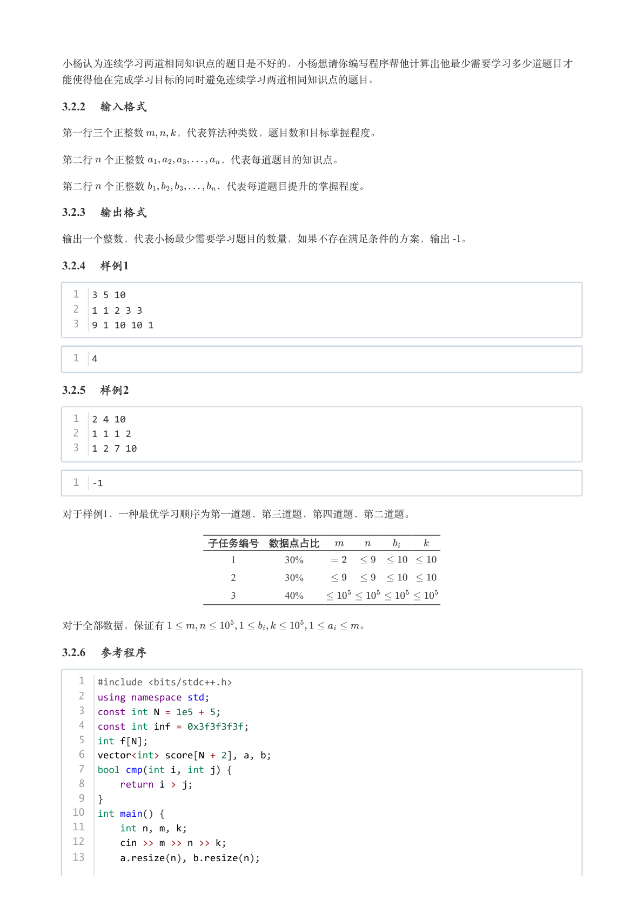

### 提取文本

```
小杨认为连续学习两道相同知识点的题目是不好的，小杨想请你编写程序帮他计算出他最少需要学习多少道题目才

能使得他在完成学习目标的同时避免连续学习两道相同知识点的题目。

3.2.2 输入格式

第一行三个正整数   ，代表算法种类数，题目数和目标掌握程度。


第二行 个正整数       ，代表每道题目的知识点。


第二行 个正整数       ，代表每道题目提升的掌握程度。

3.2.3 输出格式

输出一个整数，代表小杨最少需要学习题目的数量，如果不存在满足条件的方案，输出 -1。

3.2.4 样例1

  1  3 5 10
  2  1 1 2 3 3
  3  9 1 10 10 1


  1  4

3.2.5 样例2

  1  2 4 10
  2  1 1 1 2
  3  1 2 7 10


  1  -1


对于样例1，一种最优学习顺序为第一道题，第三道题，第四道题，第二道题。


              子任务编号 数据点占比

                                 1        30%

                                 2        30%

                                 3        40%


对于全部数据，保证有                   。

3.2.6 参考程序

   1  #include <bits/stdc++.h>
   2  using namespace std;
   3  const int N = 1e5 + 5;
   4  const int inf = 0x3f3f3f3f;
   5  int f[N];
   6  vector<int> score[N + 2], a, b;
   7  bool cmp(int i, int j) {
   8      return i > j;
   9  }
  10  int main() {
  11      int n, m, k;
  12      cin >> m >> n >> k;
  13      a.resize(n), b.resize(n);
```

## 第 12 页

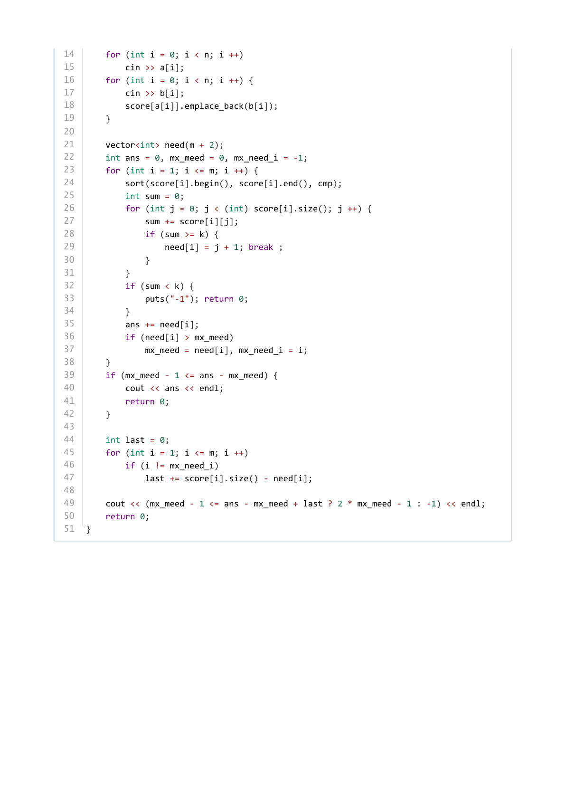

### 提取文本

```
14      for (int i = 0; i < n; i ++)
15          cin >> a[i];
16      for (int i = 0; i < n; i ++) {
17          cin >> b[i];
18          score[a[i]].emplace_back(b[i]);
19      }
20
21      vector<int> need(m + 2);
22      int ans = 0, mx_meed = 0, mx_need_i = -1;
23      for (int i = 1; i <= m; i ++) {
24          sort(score[i].begin(), score[i].end(), cmp);
25          int sum = 0;
26          for (int j = 0; j < (int) score[i].size(); j ++) {
27              sum += score[i][j];
28              if (sum >= k) {
29                  need[i] = j + 1; break ;
30              }
31          }
32          if (sum < k) {
33              puts("-1"); return 0;
34          }
35          ans += need[i];
36          if (need[i] > mx_meed)
37              mx_meed = need[i], mx_need_i = i;
38      }
39      if (mx_meed - 1 <= ans - mx_meed) {
40          cout << ans << endl;
41          return 0;
42      }
43
44      int last = 0;
45      for (int i = 1; i <= m; i ++)
46          if (i != mx_need_i)
47              last += score[i].size() - need[i];
48
49      cout << (mx_meed - 1 <= ans - mx_meed + last ? 2 * mx_meed - 1 : -1) << endl;
50      return 0;
51  }
```
