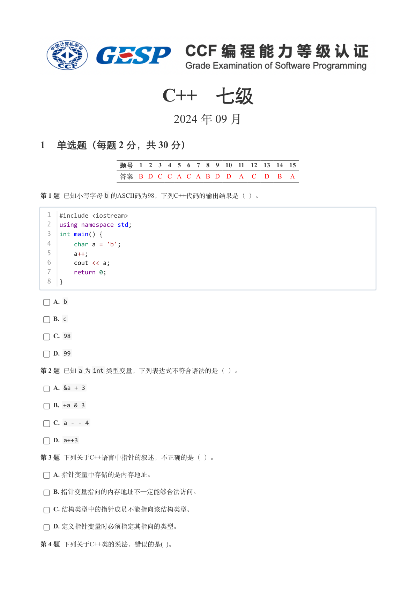
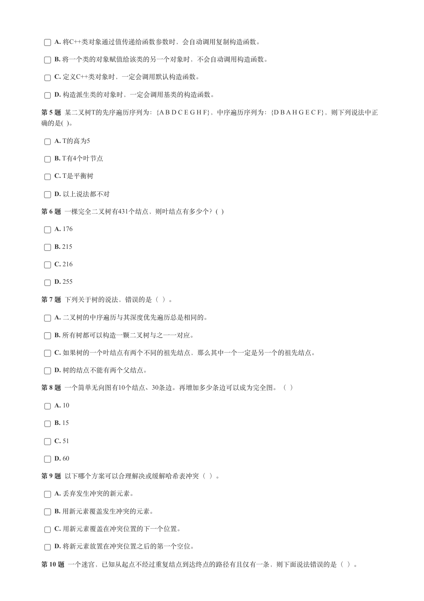
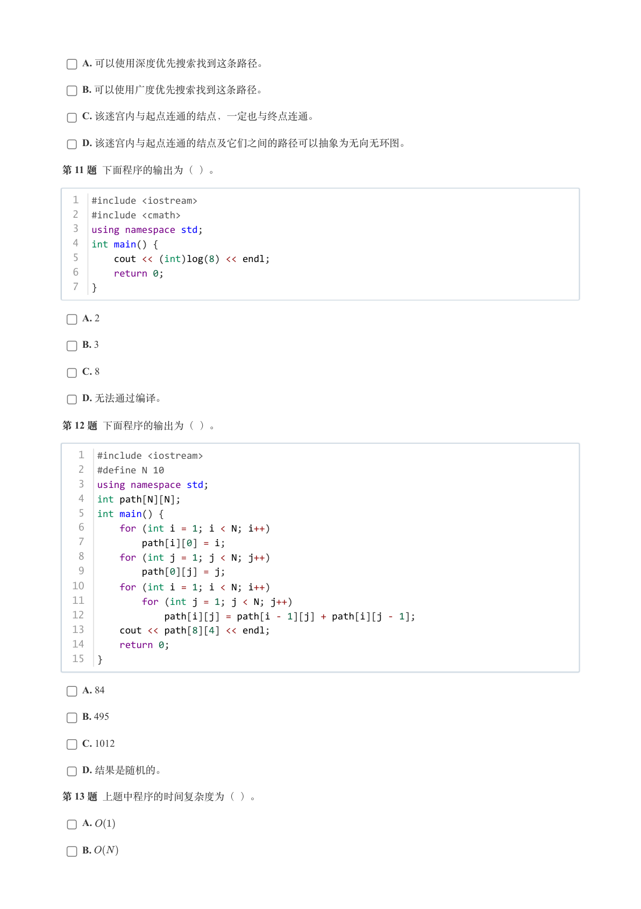
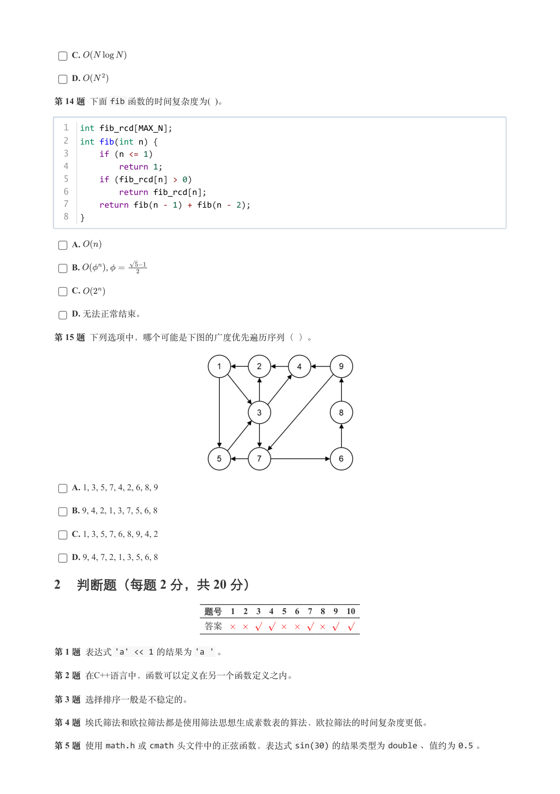
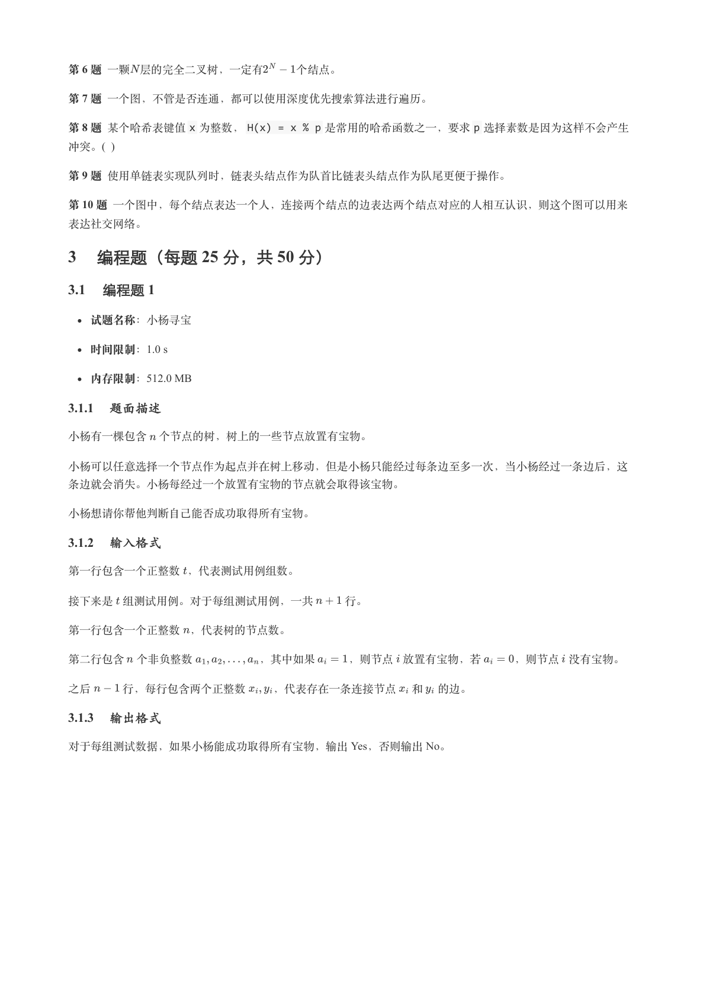
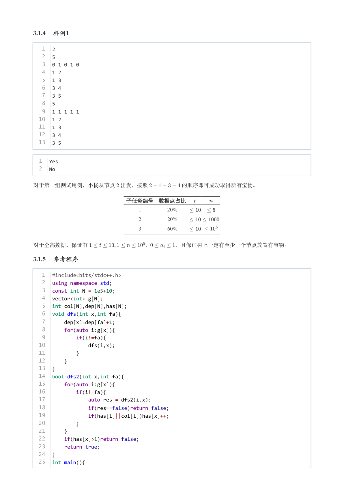
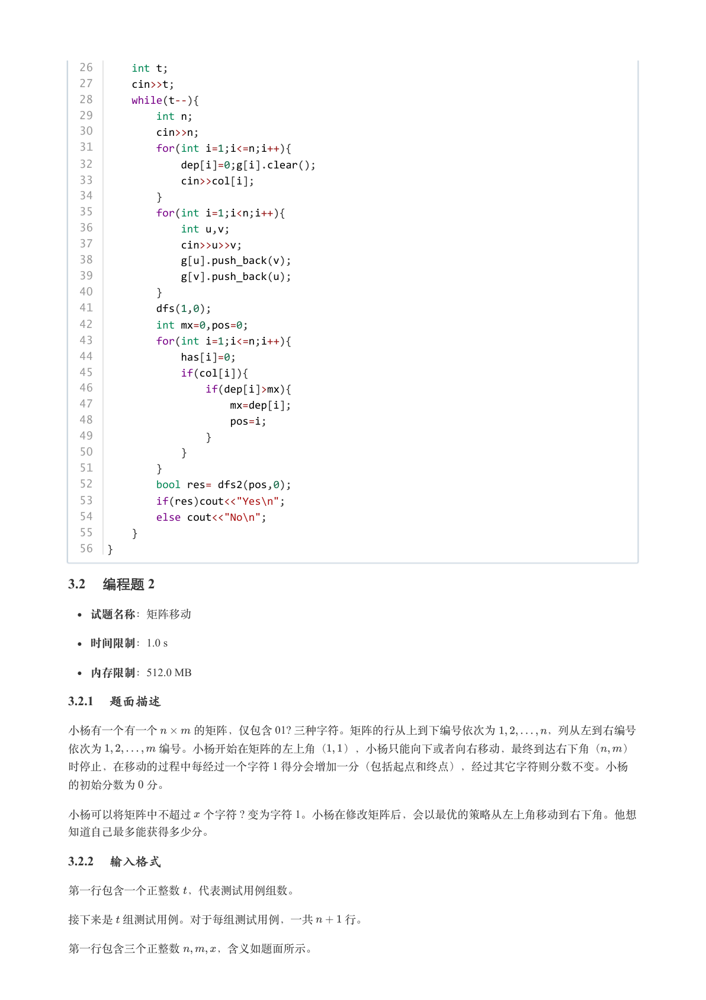
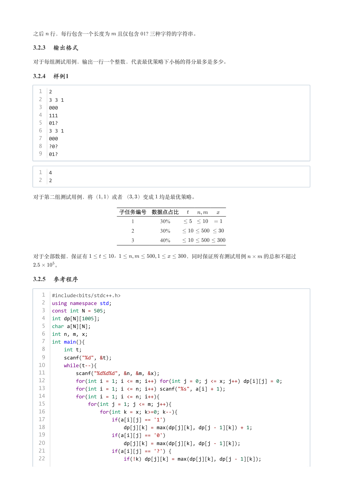
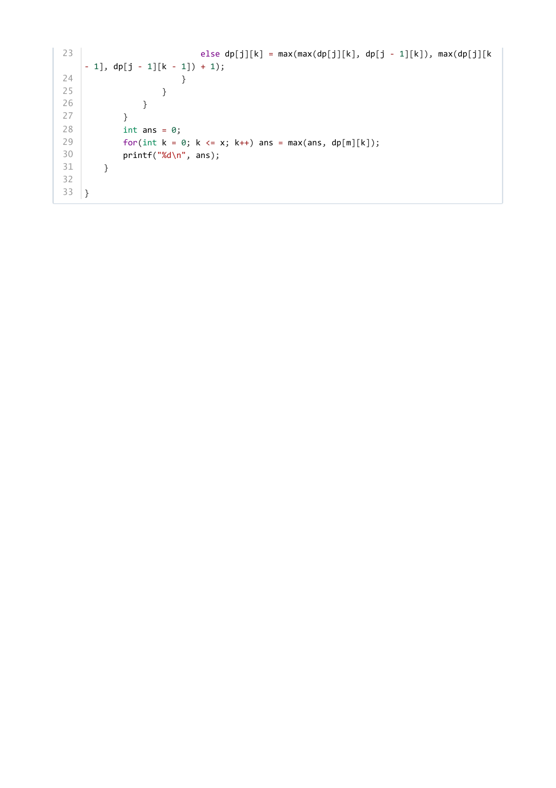

# 2024年9月-C++7级

- 原始 PDF：[`pdfs/2024年9月-C++7级.pdf`](../pdfs/2024年9月-C++7级.pdf)
- 页数：9
- 转换脚本：[`scripts/convert_pdfs_to_markdown.py`](../scripts/convert_pdfs_to_markdown.py)

> 为尽量避免信息丢失，每页均附带页面图片；文本提取结果保留原有顺序与换行特征，个别公式、图形、特殊排版请以页面图片为准。

## 第 1 页



### 提取文本

```
C++　七级

                      2024 年 09 月

1 单选题（每题 2 分，共 30 分）


            题号  1  2  3  4  5  6  7  8  9  10  11  12  13  14  15
            答案 B D C C A C A B D D  A  C  D  B  A


第 1 题 已知小写字母b 的ASCII码为98，下列C++代码的输出结果是（ ）。


  1  #include <iostream>
  2  using namespace std;
  3  int main() {
  4      char a = 'b';
  5      a++;
  6      cout << a;
  7      return 0;
  8  }


    A. b

    B. c

    C. 98

    D. 99

第 2 题 已知a 为int 类型变量，下列表达式不符合语法的是（ ）。

    A. &a + 3

    B. +a & 3

    C. a - - 4

    D. a++3

第 3 题 下列关于C++语言中指针的叙述，不正确的是（ ）。

    A. 指针变量中存储的是内存地址。

    B. 指针变量指向的内存地址不一定能够合法访问。

    C. 结构类型中的指针成员不能指向该结构类型。

    D. 定义指针变量时必须指定其指向的类型。

第 4 题 下列关于C++类的说法，错误的是( )。
```

## 第 2 页



### 提取文本

```
A. 将C++类对象通过值传递给函数参数时，会自动调用复制构造函数。

    B. 将一个类的对象赋值给该类的另一个对象时，不会自动调用构造函数。

    C. 定义C++类对象时，一定会调用默认构造函数。

    D. 构造派生类的对象时，一定会调用基类的构造函数。

第 5 题 某二叉树T的先序遍历序列为：{A B D C E G H F}，中序遍历序列为：{D B A H G E C F}，则下列说法中正
确的是( )。

    A. T的高为5

    B. T有4个叶节点

    C. T是平衡树

    D. 以上说法都不对

第 6 题 一棵完全二叉树有431个结点，则叶结点有多少个？(  )

    A. 176

    B. 215

    C. 216

    D. 255

第 7 题 下列关于树的说法，错误的是（ ）。

    A. 二叉树的中序遍历与其深度优先遍历总是相同的。

    B. 所有树都可以构造一颗二叉树与之一一对应。

    C. 如果树的一个叶结点有两个不同的祖先结点，那么其中一个一定是另一个的祖先结点。

    D. 树的结点不能有两个父结点。

第 8 题 一个简单无向图有10个结点、30条边。再增加多少条边可以成为完全图。（ ）

    A. 10

    B. 15

    C. 51

    D. 60

第 9 题 以下哪个方案可以合理解决或缓解哈希表冲突（ ）。

    A. 丢弃发生冲突的新元素。

    B. 用新元素覆盖发生冲突的元素。

    C. 用新元素覆盖在冲突位置的下一个位置。

    D. 将新元素放置在冲突位置之后的第一个空位。

第 10 题 一个迷宫，已知从起点不经过重复结点到达终点的路径有且仅有一条，则下面说法错误的是（ ）。
```

## 第 3 页



### 提取文本

```
A. 可以使用深度优先搜索找到这条路径。

    B. 可以使用广度优先搜索找到这条路径。

    C. 该迷宫内与起点连通的结点，一定也与终点连通。

    D. 该迷宫内与起点连通的结点及它们之间的路径可以抽象为无向无环图。

第 11 题 下面程序的输出为（ ）。


  1  #include <iostream>
  2  #include <cmath>
  3  using namespace std;
  4  int main() {
  5      cout << (int)log(8) << endl;
  6      return 0;
  7  }


    A. 2

    B. 3

    C. 8

    D. 无法通过编译。

第 12 题 下面程序的输出为（ ）。


   1  #include <iostream>
   2  #define N 10
   3  using namespace std;
   4  int path[N][N];
   5  int main() {
   6      for (int i = 1; i < N; i++)
   7          path[i][0] = i;
   8      for (int j = 1; j < N; j++)
   9          path[0][j] = j;
  10      for (int i = 1; i < N; i++)
  11          for (int j = 1; j < N; j++)
  12              path[i][j] = path[i - 1][j] + path[i][j - 1];
  13      cout << path[8][4] << endl;
  14      return 0;
  15  }


    A. 84

    B. 495

    C. 1012

    D. 结果是随机的。

第 13 题 上题中程序的时间复杂度为（ ）。

    A.

    B.
```

## 第 4 页



### 提取文本

```
C.

    D.

第 14 题 下面fib 函数的时间复杂度为( )。


  1  int fib_rcd[MAX_N];
  2  int fib(int n) {
  3      if (n <= 1)
  4          return 1;
  5      if (fib_rcd[n] > 0)
  6          return fib_rcd[n];
  7      return fib(n - 1) + fib(n - 2);
  8  }


    A.

    B.            ,

    C.

    D. 无法正常结束。

第 15 题 下列选项中，哪个可能是下图的广度优先遍历序列（ ）。


    A. 1, 3, 5, 7, 4, 2, 6, 8, 9

    B. 9, 4, 2, 1, 3, 7, 5, 6, 8

    C. 1, 3, 5, 7, 6, 8, 9, 4, 2

    D. 9, 4, 7, 2, 1, 3, 5, 6, 8

2 判断题（每题 2 分，共 20 分）

                 题号  1  2  3  4  5  6  7  8  9  10

                 答案


第 1 题 表达式'a' << 1 的结果为'a ' 。

第 2 题 在C++语言中，函数可以定义在另一个函数定义之内。

第 3 题 选择排序一般是不稳定的。

第 4 题 埃氏筛法和欧拉筛法都是使用筛法思想生成素数表的算法，欧拉筛法的时间复杂度更低。

第 5 题 使用math.h 或cmath 头文件中的正弦函数，表达式sin(30) 的结果类型为double 、值约为0.5 。
```

## 第 5 页



### 提取文本

```
第 6 题 一颗 层的完全二叉树，一定有   个结点。

第 7 题 一个图，不管是否连通，都可以使用深度优先搜索算法进行遍历。

第 8 题 某个哈希表键值x 为整数，H(x) = x % p 是常用的哈希函数之一，要求p 选择素数是因为这样不会产生
冲突。(  )

第 9 题 使用单链表实现队列时，链表头结点作为队首比链表头结点作为队尾更便于操作。

第 10 题 一个图中，每个结点表达一个人，连接两个结点的边表达两个结点对应的人相互认识，则这个图可以用来

表达社交网络。

3 编程题（每题 25 分，共 50 分）

3.1 编程题 1


  试题名称：小杨寻宝

   时间限制：1.0 s

   内存限制：512.0 MB

3.1.1 题面描述

小杨有一棵包含 个节点的树，树上的一些节点放置有宝物。


小杨可以任意选择一个节点作为起点并在树上移动，但是小杨只能经过每条边至多一次，当小杨经过一条边后，这

条边就会消失。小杨每经过一个放置有宝物的节点就会取得该宝物。


小杨想请你帮他判断自己能否成功取得所有宝物。

3.1.2 输入格式

第一行包含一个正整数 ，代表测试用例组数。


接下来是 组测试用例。对于每组测试用例，一共   行。


第一行包含一个正整数 ，代表树的节点数。


第二行包含 个非负整数      ，其中如果   ，则节点 放置有宝物，若   ，则节点 没有宝物。


之后   行，每行包含两个正整数  ，代表存在一条连接节点 和 的边。

3.1.3 输出格式

对于每组测试数据，如果小杨能成功取得所有宝物，输出 Yes，否则输出 No。
```

## 第 6 页



### 提取文本

```
3.1.4 样例1

   1  2
   2  5
   3  0 1 0 1 0
   4  1 2
   5  1 3
   6  3 4
   7  3 5
   8  5
   9  1 1 1 1 1
  10  1 2
  11  1 3
  12  3 4
  13  3 5


  1  Yes
  2  No


对于第一组测试用例，小杨从节点 出发，按照      的顺序即可成功取得所有宝物。


                 子任务编号 数据点占比

                                       1        20%

                                       2        20%

                                       3        60%


对于全部数据，保证有            ，     ，且保证树上一定有至少一个节点放置有宝物。

3.1.5 参考程序

   1  #include<bits/stdc++.h>
   2  using namespace std;
   3  const int N = 1e5+10;
   4  vector<int> g[N];
   5  int col[N],dep[N],has[N];
   6  void dfs(int x,int fa){
   7      dep[x]=dep[fa]+1;
   8      for(auto i:g[x]){
   9          if(i!=fa){
  10              dfs(i,x);
  11          }
  12      }
  13  }
  14  bool dfs2(int x,int fa){
  15      for(auto i:g[x]){
  16          if(i!=fa){
  17              auto res = dfs2(i,x);
  18              if(res==false)return false;
  19              if(has[i]||col[i])has[x]++;
  20          }
  21      }
  22      if(has[x]>1)return false;
  23      return true;
  24  }
  25  int main(){
```

## 第 7 页



### 提取文本

```
26      int t;
  27      cin>>t;
  28      while(t--){
  29          int n;
  30          cin>>n;
  31          for(int i=1;i<=n;i++){
  32              dep[i]=0;g[i].clear();
  33              cin>>col[i];
  34          }
  35          for(int i=1;i<n;i++){
  36              int u,v;
  37              cin>>u>>v;
  38              g[u].push_back(v);
  39              g[v].push_back(u);
  40          }
  41          dfs(1,0);
  42          int mx=0,pos=0;
  43          for(int i=1;i<=n;i++){
  44              has[i]=0;
  45              if(col[i]){
  46                  if(dep[i]>mx){
  47                      mx=dep[i];
  48                      pos=i;
  49                  }
  50              }
  51          }
  52          bool res= dfs2(pos,0);
  53          if(res)cout<<"Yes\n";
  54          else cout<<"No\n";
  55      }
  56  }

3.2 编程题 2


  试题名称：矩阵移动

   时间限制：1.0 s

   内存限制：512.0 MB

3.2.1 题面描述

小杨有一个有一个   的矩阵，仅包含 01? 三种字符。矩阵的行从上到下编号依次为     ，列从左到右编号

依次为     编号。小杨开始在矩阵的左上角（ ），小杨只能向下或者向右移动，最终到达右下角（  ）
时停止，在移动的过程中每经过一个字符 1 得分会增加一分（包括起点和终点），经过其它字符则分数不变。小杨

的初始分数为 分。

小杨可以将矩阵中不超过 个字符 ? 变为字符 1。小杨在修改矩阵后，会以最优的策略从左上角移动到右下角。他想

知道自己最多能获得多少分。

3.2.2 输入格式

第一行包含一个正整数 ，代表测试用例组数。


接下来是 组测试用例。对于每组测试用例，一共   行。


第一行包含三个正整数   ，含义如题面所示。
```

## 第 8 页



### 提取文本

```
之后 行，每行包含一个长度为 且仅包含 01? 三种字符的字符串。

3.2.3 输出格式

对于每组测试用例，输出一行一个整数，代表最优策略下小杨的得分最多是多少。

3.2.4 样例1

  1  2
  2  3 3 1
  3  000
  4  111
  5  01?
  6  3 3 1
  7  000
  8  ?0?
  9  01?


  1  4
  2  2


对于第二组测试用例，将（ ）或者 （ ）变成 均是最优策略。


                子任务编号 数据点占比

                                    1        30%

                                    2        30%

                                    3        40%


对于全部数据，保证有     ，            ，同时保证所有测试用例   的总和不超过

    。

3.2.5 参考程序

   1  #include<bits/stdc++.h>
   2  using namespace std;
   3  const int N = 505;
   4  int dp[N][1005];
   5  char a[N][N];
   6  int n, m, x;
   7  int main(){
   8      int t;
   9      scanf("%d", &t);
  10      while(t--){
  11          scanf("%d%d%d", &n, &m, &x);
  12          for(int i = 1; i <= m; i++) for(int j = 0; j <= x; j++) dp[i][j] = 0;
  13          for(int i = 1; i <= n; i++) scanf("%s", a[i] + 1);
  14          for(int i = 1; i <= n; i++){
  15              for(int j = 1; j <= m; j++){
  16                  for(int k = x; k>=0; k--){
  17                      if(a[i][j] == '1')
  18                          dp[j][k] = max(dp[j][k], dp[j - 1][k]) + 1;
  19                      if(a[i][j] == '0')
  20                          dp[j][k] = max(dp[j][k], dp[j - 1][k]);
  21                      if(a[i][j] == '?') {
  22                          if(!k) dp[j][k] = max(dp[j][k], dp[j - 1][k]);
```

## 第 9 页



### 提取文本

```
23                          else dp[j][k] = max(max(dp[j][k], dp[j - 1][k]), max(dp[j][k
    - 1], dp[j - 1][k - 1]) + 1);
24                      }
25                  }
26              }
27          }
28          int ans = 0;
29          for(int k = 0; k <= x; k++) ans = max(ans, dp[m][k]);
30          printf("%d\n", ans);
31      }
32
33  }
```
