# 2024年9月-C++8级

- 原始 PDF：[`pdfs/2024年9月-C++8级.pdf`](../pdfs/2024年9月-C++8级.pdf)
- 页数：13
- 转换脚本：[`scripts/convert_pdfs_to_markdown.py`](../scripts/convert_pdfs_to_markdown.py)

> 为尽量避免信息丢失，每页均附带页面图片；文本提取结果保留原有顺序与换行特征，个别公式、图形、特殊排版请以页面图片为准。

## 第 1 页

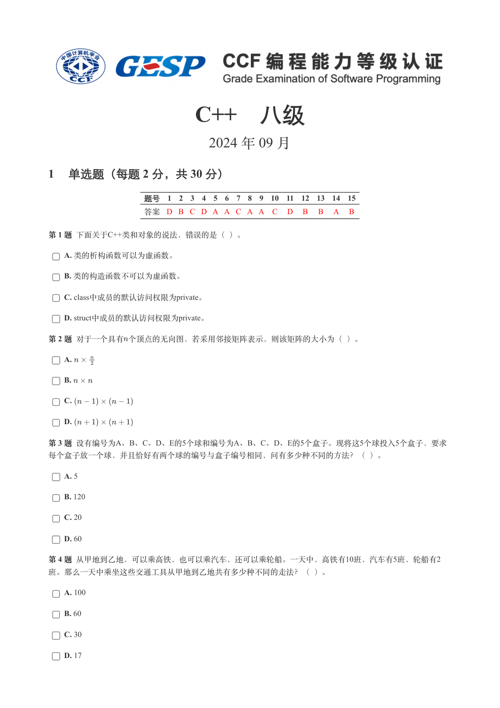

### 提取文本

```
C++　八级

                      2024 年 09 月

1 单选题（每题 2 分，共 30 分）


            题号  1  2  3  4  5  6  7  8  9  10  11  12  13  14  15
            答案 D B C D A A C A A  C  D  B  B  A  B


第 1 题 下面关于C++类和对象的说法，错误的是（ ）。

    A. 类的析构函数可以为虚函数。

    B. 类的构造函数不可以为虚函数。

    C. class中成员的默认访问权限为private。

    D. struct中成员的默认访问权限为private。

第 2 题 对于一个具有个顶点的无向图，若采用邻接矩阵表示，则该矩阵的大小为（ ）。

    A.

    B.

    C.

    D.

第 3 题 设有编号为A、B、C、D、E的5个球和编号为A、B、C、D、E的5个盒子。现将这5个球投入5个盒子，要求

每个盒子放一个球，并且恰好有两个球的编号与盒子编号相同，问有多少种不同的方法？（ ）。

    A. 5

    B. 120

    C. 20

    D. 60

第 4 题 从甲地到乙地，可以乘高铁，也可以乘汽车，还可以乘轮船。一天中，高铁有10班，汽车有5班，轮船有2

班。那么一天中乘坐这些交通工具从甲地到乙地共有多少种不同的走法？（ ）。

    A. 100

    B. 60

    C. 30

    D. 17
```

## 第 2 页

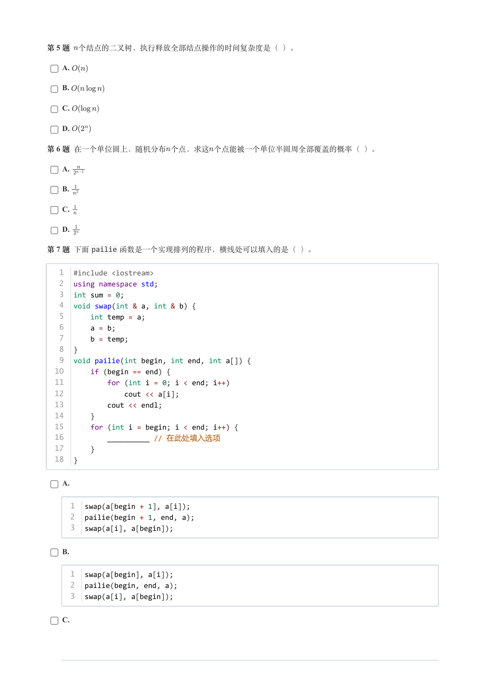

### 提取文本

```
第 5 题 个结点的二叉树，执行释放全部结点操作的时间复杂度是（ ）。

    A.

    B.

    C.

    D.

第 6 题 在一个单位圆上，随机分布个点，求这个点能被一个单位半圆周全部覆盖的概率（ ）。

    A.

    B.

    C.

    D.

第 7 题 下面pailie 函数是一个实现排列的程序，横线处可以填入的是（ ）。


   1  #include <iostream>
   2  using namespace std;
   3  int sum = 0;
   4  void swap(int & a, int & b) {
   5      int temp = a;
   6      a = b;
   7      b = temp;
   8  }
   9  void pailie(int begin, int end, int a[]) {
  10      if (begin == end) {
  11          for (int i = 0; i < end; i++)
  12              cout << a[i];
  13          cout << endl;
  14      }
  15      for (int i = begin; i < end; i++) {
  16          __________ // 在此处填入选项
  17      }
  18  }


    A.


     1  swap(a[begin + 1], a[i]);
     2  pailie(begin + 1, end, a);
     3  swap(a[i], a[begin]);


    B.


     1  swap(a[begin], a[i]);
     2  pailie(begin, end, a);
     3  swap(a[i], a[begin]);


    C.
```

## 第 3 页

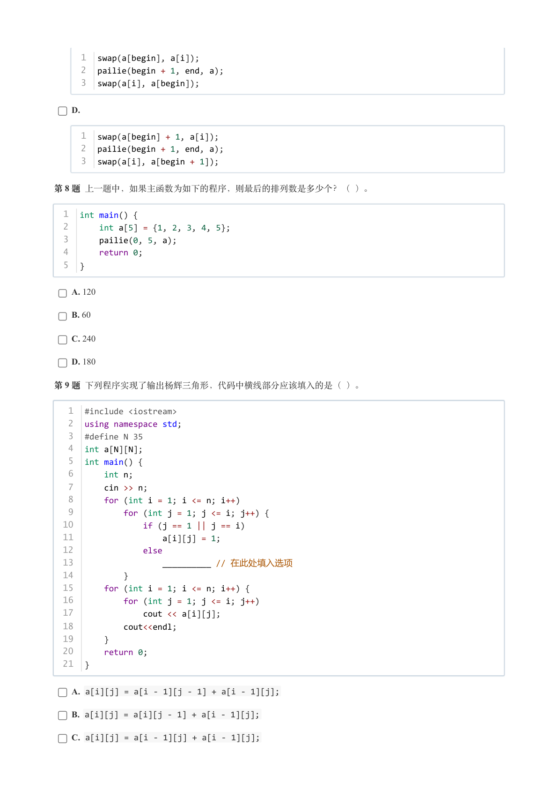

### 提取文本

```
1  swap(a[begin], a[i]);
     2  pailie(begin + 1, end, a);
     3  swap(a[i], a[begin]);


    D.


     1  swap(a[begin] + 1, a[i]);
     2  pailie(begin + 1, end, a);
     3  swap(a[i], a[begin + 1]);


第 8 题 上一题中，如果主函数为如下的程序，则最后的排列数是多少个？（ ）。


  1  int main() {
  2      int a[5] = {1, 2, 3, 4, 5};
  3      pailie(0, 5, a);
  4      return 0;
  5  }


    A. 120

    B. 60

    C. 240

    D. 180

第 9 题 下列程序实现了输出杨辉三角形，代码中横线部分应该填入的是（ ）。


   1  #include <iostream>
   2  using namespace std;
   3  #define N 35
   4  int a[N][N];
   5  int main() {
   6      int n;
   7      cin >> n;
   8      for (int i = 1; i <= n; i++)
   9          for (int j = 1; j <= i; j++) {
  10              if (j == 1 || j == i)
  11                  a[i][j] = 1;
  12              else
  13                  __________ // 在此处填入选项
  14          }
  15      for (int i = 1; i <= n; i++) {
  16          for (int j = 1; j <= i; j++)
  17              cout << a[i][j];
  18          cout<<endl;
  19      }
  20      return 0;
  21  }


    A. a[i][j] = a[i - 1][j - 1] + a[i - 1][j];

    B. a[i][j] = a[i][j - 1] + a[i - 1][j];

    C. a[i][j] = a[i - 1][j] + a[i - 1][j];
```

## 第 4 页

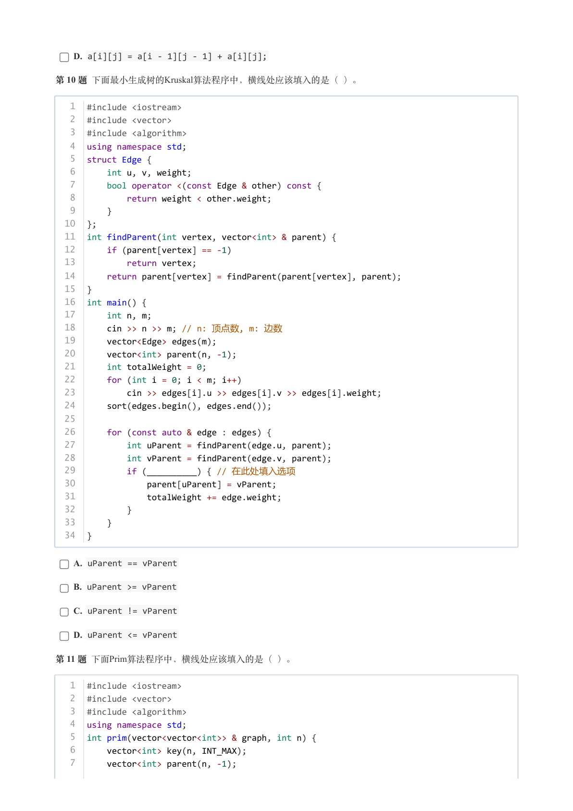

### 提取文本

```
D. a[i][j] = a[i - 1][j - 1] + a[i][j];

第 10 题 下面最小生成树的Kruskal算法程序中，横线处应该填入的是（ ）。


   1  #include <iostream>
   2  #include <vector>
   3  #include <algorithm>
   4  using namespace std;
   5  struct Edge {
   6      int u, v, weight;
   7      bool operator <(const Edge & other) const {
   8          return weight < other.weight;
   9      }
  10  };
  11  int findParent(int vertex, vector<int> & parent) {
  12      if (parent[vertex] == -1)
  13          return vertex;
  14      return parent[vertex] = findParent(parent[vertex], parent);
  15  }
  16  int main() {
  17      int n, m;
  18      cin >> n >> m; // n: 顶点数, m: 边数
  19      vector<Edge> edges(m);
  20      vector<int> parent(n, -1);
  21      int totalWeight = 0;
  22      for (int i = 0; i < m; i++)
  23          cin >> edges[i].u >> edges[i].v >> edges[i].weight;
  24      sort(edges.begin(), edges.end());
  25
  26      for (const auto & edge : edges) {
  27          int uParent = findParent(edge.u, parent);
  28          int vParent = findParent(edge.v, parent);
  29          if (__________) { // 在此处填入选项
  30              parent[uParent] = vParent;
  31              totalWeight += edge.weight;
  32          }
  33      }
  34  }


    A. uParent == vParent

    B. uParent >= vParent

    C. uParent != vParent

    D. uParent <= vParent

第 11 题 下面Prim算法程序中，横线处应该填入的是（ ）。


   1  #include <iostream>
   2  #include <vector>
   3  #include <algorithm>
   4  using namespace std;
   5  int prim(vector<vector<int>> & graph, int n) {
   6      vector<int> key(n, INT_MAX);
   7      vector<int> parent(n, -1);
```

## 第 5 页

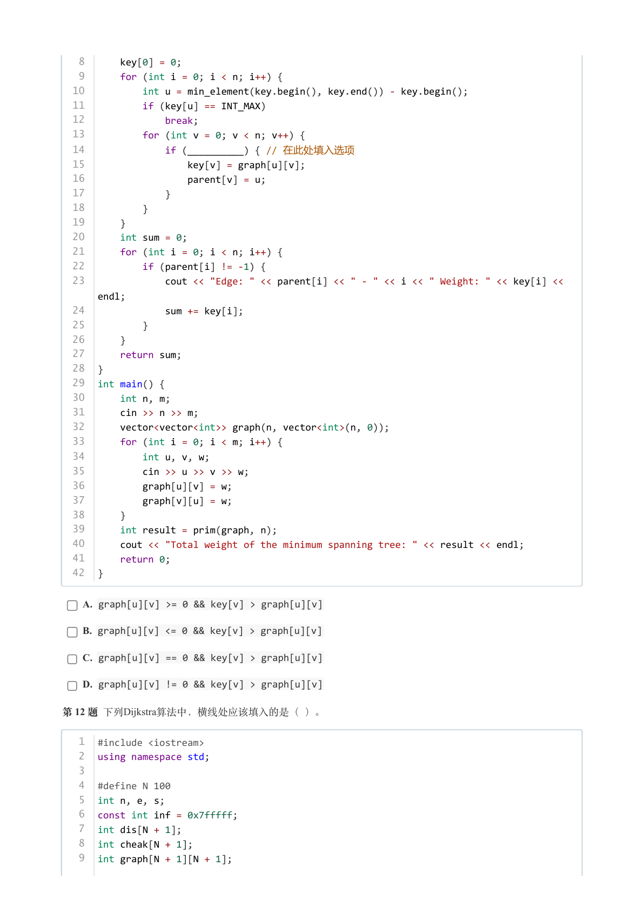

### 提取文本

```
8      key[0] = 0;
   9      for (int i = 0; i < n; i++) {
  10          int u = min_element(key.begin(), key.end()) - key.begin();
  11          if (key[u] == INT_MAX)
  12              break;
  13          for (int v = 0; v < n; v++) {
  14              if (__________) { // 在此处填入选项
  15                  key[v] = graph[u][v];
  16                  parent[v] = u;
  17              }
  18          }
  19      }
  20      int sum = 0;
  21      for (int i = 0; i < n; i++) {
  22          if (parent[i] != -1) {
  23              cout << "Edge: " << parent[i] << " - " << i << " Weight: " << key[i] <<
      endl;
  24              sum += key[i];
  25          }
  26      }
  27      return sum;
  28  }
  29  int main() {
  30      int n, m;
  31      cin >> n >> m;
  32      vector<vector<int>> graph(n, vector<int>(n, 0));
  33      for (int i = 0; i < m; i++) {
  34          int u, v, w;
  35          cin >> u >> v >> w;
  36          graph[u][v] = w;
  37          graph[v][u] = w;
  38      }
  39      int result = prim(graph, n);
  40      cout << "Total weight of the minimum spanning tree: " << result << endl;
  41      return 0;
  42  }


    A. graph[u][v] >= 0 && key[v] > graph[u][v]

    B. graph[u][v] <= 0 && key[v] > graph[u][v]

    C. graph[u][v] == 0 && key[v] > graph[u][v]

    D. graph[u][v] != 0 && key[v] > graph[u][v]

第 12 题 下列Dijkstra算法中，横线处应该填入的是（ ）。


   1  #include <iostream>
   2  using namespace std;
   3
   4  #define N 100
   5  int n, e, s;
   6  const int inf = 0x7fffff;
   7  int dis[N + 1];
   8  int cheak[N + 1];
   9  int graph[N + 1][N + 1];
```

## 第 6 页

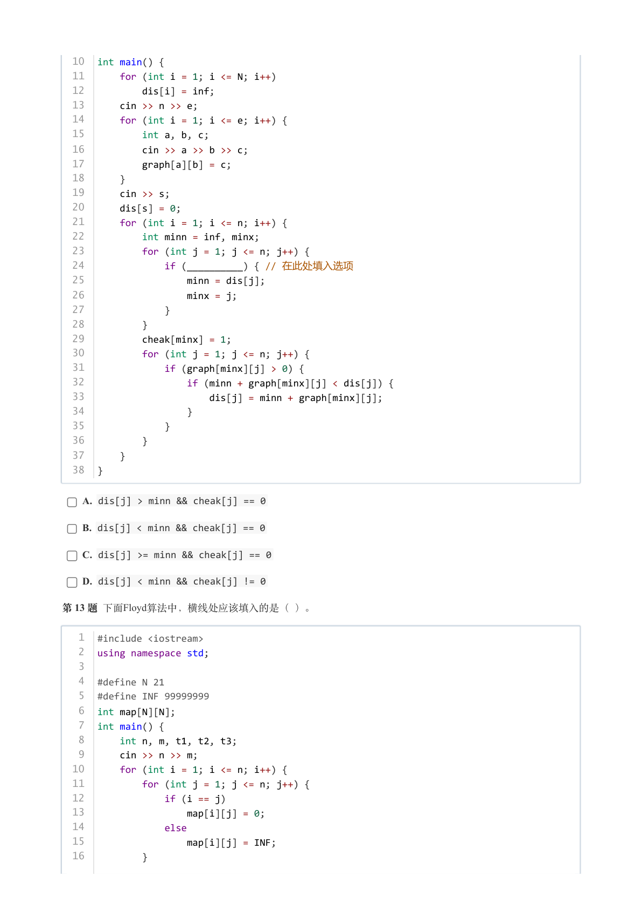

### 提取文本

```
10  int main() {
  11      for (int i = 1; i <= N; i++)
  12          dis[i] = inf;
  13      cin >> n >> e;
  14      for (int i = 1; i <= e; i++) {
  15          int a, b, c;
  16          cin >> a >> b >> c;
  17          graph[a][b] = c;
  18      }
  19      cin >> s;
  20      dis[s] = 0;
  21      for (int i = 1; i <= n; i++) {
  22          int minn = inf, minx;
  23          for (int j = 1; j <= n; j++) {
  24              if (__________) { // 在此处填入选项
  25                  minn = dis[j];
  26                  minx = j;
  27              }
  28          }
  29          cheak[minx] = 1;
  30          for (int j = 1; j <= n; j++) {
  31              if (graph[minx][j] > 0) {
  32                  if (minn + graph[minx][j] < dis[j]) {
  33                      dis[j] = minn + graph[minx][j];
  34                  }
  35              }
  36          }
  37      }
  38  }

    A. dis[j] > minn && cheak[j] == 0

    B. dis[j] < minn && cheak[j] == 0

    C. dis[j] >= minn && cheak[j] == 0

    D. dis[j] < minn && cheak[j] != 0

第 13 题 下面Floyd算法中，横线处应该填入的是（ ）。


   1  #include <iostream>
   2  using namespace std;
   3
   4  #define N 21
   5  #define INF 99999999
   6  int map[N][N];
   7  int main() {
   8      int n, m, t1, t2, t3;
   9      cin >> n >> m;
  10      for (int i = 1; i <= n; i++) {
  11          for (int j = 1; j <= n; j++) {
  12              if (i == j)
  13                  map[i][j] = 0;
  14              else
  15                  map[i][j] = INF;
  16          }
```

## 第 7 页

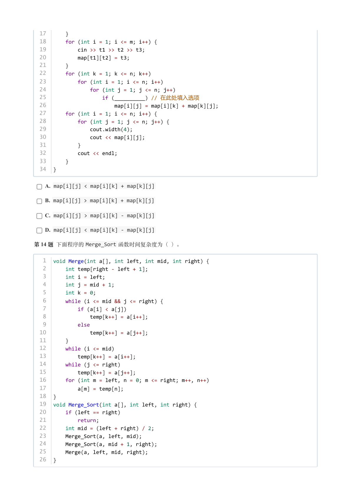

### 提取文本

```
17      }
  18      for (int i = 1; i <= m; i++) {
  19          cin >> t1 >> t2 >> t3;
  20          map[t1][t2] = t3;
  21      }
  22      for (int k = 1; k <= n; k++)
  23          for (int i = 1; i <= n; i++)
  24              for (int j = 1; j <= n; j++)
  25                  if (__________) // 在此处填入选项
  26                      map[i][j] = map[i][k] + map[k][j];
  27      for (int i = 1; i <= n; i++) {
  28          for (int j = 1; j <= n; j++) {
  29              cout.width(4);
  30              cout << map[i][j];
  31          }
  32          cout << endl;
  33      }
  34  }

    A. map[i][j] < map[i][k] + map[k][j]

    B. map[i][j] > map[i][k] + map[k][j]

    C. map[i][j] > map[i][k] - map[k][j]

    D. map[i][j] < map[i][k] - map[k][j]

第 14 题 下面程序的Merge_Sort 函数时间复杂度为（ ）。


   1  void Merge(int a[], int left, int mid, int right) {
   2      int temp[right - left + 1];
   3      int i = left;
   4      int j = mid + 1;
   5      int k = 0;
   6      while (i <= mid && j <= right) {
   7          if (a[i] < a[j])
   8              temp[k++] = a[i++];
   9          else
  10              temp[k++] = a[j++];
  11      }
  12      while (i <= mid)
  13          temp[k++] = a[i++];
  14      while (j <= right)
  15          temp[k++] = a[j++];
  16      for (int m = left, n = 0; m <= right; m++, n++)
  17          a[m] = temp[n];
  18  }
  19  void Merge_Sort(int a[], int left, int right) {
  20      if (left == right)
  21          return;
  22      int mid = (left + right) / 2;
  23      Merge_Sort(a, left, mid);
  24      Merge_Sort(a, mid + 1, right);
  25      Merge(a, left, mid, right);
  26  }
```

## 第 8 页

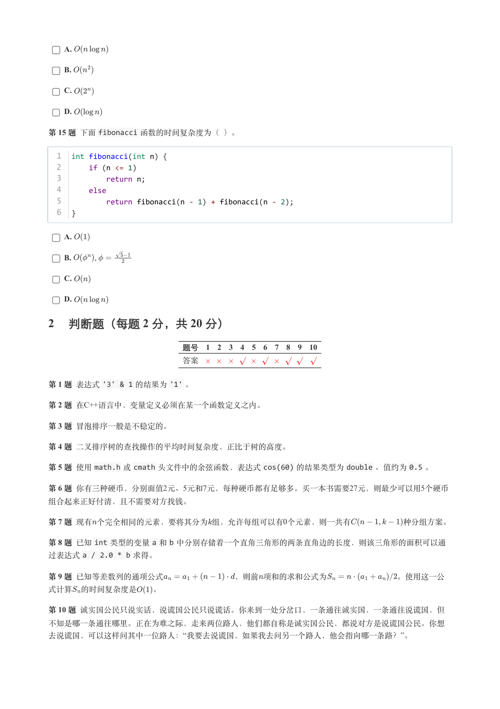

### 提取文本

```
A.

    B.

    C.

    D.

第 15 题 下面fibonacci 函数的时间复杂度为（ ）。


  1  int fibonacci(int n) {
  2      if (n <= 1)
  3          return n;
  4      else
  5          return fibonacci(n - 1) + fibonacci(n - 2);
  6  }


    A.

    B.            ,

    C.

    D.

2 判断题（每题 2 分，共 20 分）

                 题号  1  2  3  4  5  6  7  8  9  10

                 答案


第 1 题 表达式'3' & 1 的结果为'1' 。

第 2 题 在C++语言中，变量定义必须在某一个函数定义之内。

第 3 题 冒泡排序一般是不稳定的。

第 4 题 二叉排序树的查找操作的平均时间复杂度，正比于树的高度。

第 5 题 使用math.h 或cmath 头文件中的余弦函数，表达式cos(60) 的结果类型为double 、值约为0.5 。

第 6 题 你有三种硬币，分别面值2元、5元和7元，每种硬币都有足够多。买一本书需要27元，则最少可以用5个硬币

组合起来正好付清，且不需要对方找钱。

第 7 题 现有个完全相同的元素，要将其分为组，允许每组可以有个元素，则一共有       种分组方案。

第 8 题 已知int 类型的变量a 和b 中分别存储着一个直角三角形的两条直角边的长度，则该三角形的面积可以通
过表达式a / 2.0 * b 求得。

第 9 题 已知等差数列的通项公式         ，则前项和的求和公式为         。使用这一公

式计算 的时间复杂度是  。

第 10 题 诚实国公民只说实话，说谎国公民只说谎话。你来到一处分岔口，一条通往诚实国，一条通往说谎国，但

不知是哪一条通往哪里。正在为难之际，走来两位路人，他们都自称是诚实国公民，都说对方是说谎国公民。你想
去说谎国，可以这样问其中一位路人：“我要去说谎国，如果我去问另一个路人，他会指向哪一条路？”。
```

## 第 9 页

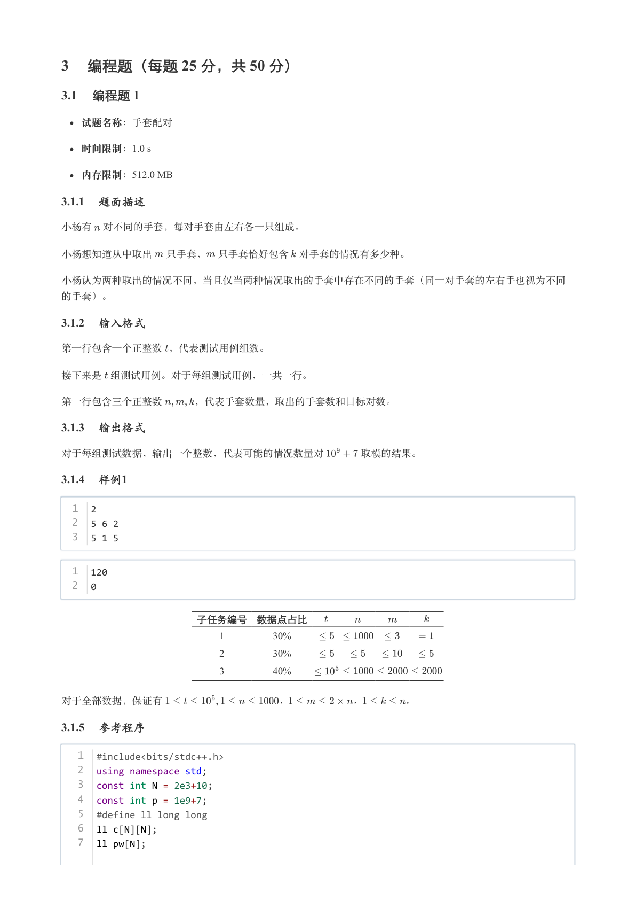

### 提取文本

```
3 编程题（每题 25 分，共 50 分）

3.1 编程题 1


  试题名称：手套配对

   时间限制：1.0 s

   内存限制：512.0 MB

3.1.1 题面描述

小杨有 对不同的手套，每对手套由左右各一只组成。


小杨想知道从中取出 只手套， 只手套恰好包含 对手套的情况有多少种。


小杨认为两种取出的情况不同，当且仅当两种情况取出的手套中存在不同的手套（同一对手套的左右手也视为不同

的手套）。

3.1.2 输入格式

第一行包含一个正整数 ，代表测试用例组数。


接下来是 组测试用例。对于每组测试用例，一共一行。


第一行包含三个正整数   ，代表手套数量，取出的手套数和目标对数。

3.1.3 输出格式

对于每组测试数据，输出一个整数，代表可能的情况数量对    取模的结果。

3.1.4 样例1

  1  2
  2  5 6 2
  3  5 1 5


  1  120
  2  0


             子任务编号 数据点占比

                               1        30%

                               2        30%

                               3        40%


对于全部数据，保证有             ，       ，    。

3.1.5 参考程序

   1  #include<bits/stdc++.h>
   2  using namespace std;
   3  const int N = 2e3+10;
   4  const int p = 1e9+7;
   5  #define ll long long
   6  ll c[N][N];
   7  ll pw[N];
```

## 第 10 页

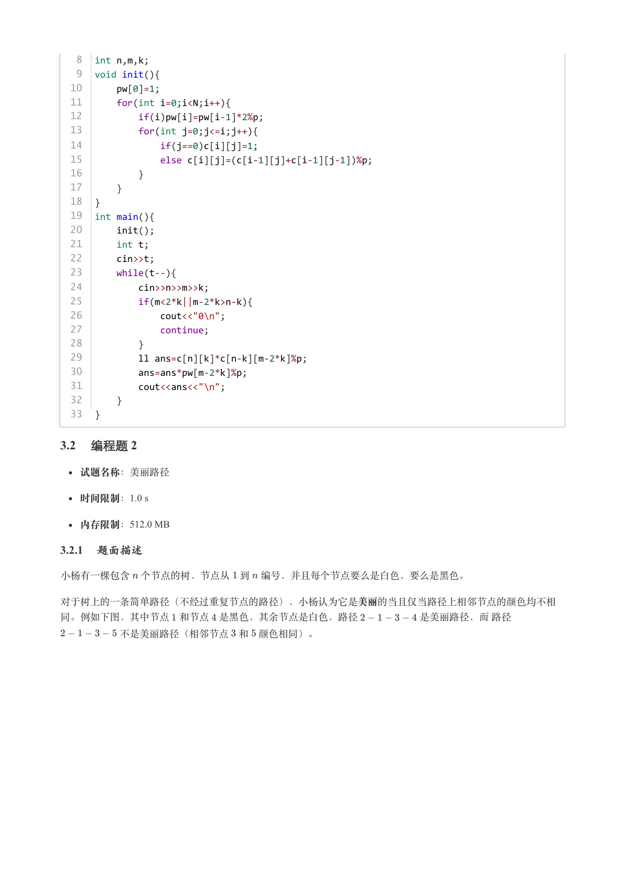

### 提取文本

```
8  int n,m,k;
   9  void init(){
  10      pw[0]=1;
  11      for(int i=0;i<N;i++){
  12          if(i)pw[i]=pw[i-1]*2%p;
  13          for(int j=0;j<=i;j++){
  14              if(j==0)c[i][j]=1;
  15              else c[i][j]=(c[i-1][j]+c[i-1][j-1])%p;
  16          }
  17      }
  18  }
  19  int main(){
  20      init();
  21      int t;
  22      cin>>t;
  23      while(t--){
  24          cin>>n>>m>>k;
  25          if(m<2*k||m-2*k>n-k){
  26              cout<<"0\n";
  27              continue;
  28          }
  29          ll ans=c[n][k]*c[n-k][m-2*k]%p;
  30          ans=ans*pw[m-2*k]%p;
  31          cout<<ans<<"\n";
  32      }
  33  }

3.2 编程题 2


  试题名称：美丽路径

   时间限制：1.0 s

   内存限制：512.0 MB

3.2.1 题面描述

小杨有一棵包含 个节点的树，节点从 到 编号，并且每个节点要么是白色，要么是黑色。


对于树上的一条简单路径（不经过重复节点的路径），小杨认为它是美丽的当且仅当路径上相邻节点的颜色均不相

同。例如下图，其中节点 和节点 是黑色，其余节点是白色，路径      是美丽路径，而 路径

      不是美丽路径（相邻节点 和 颜色相同）。
```

## 第 11 页

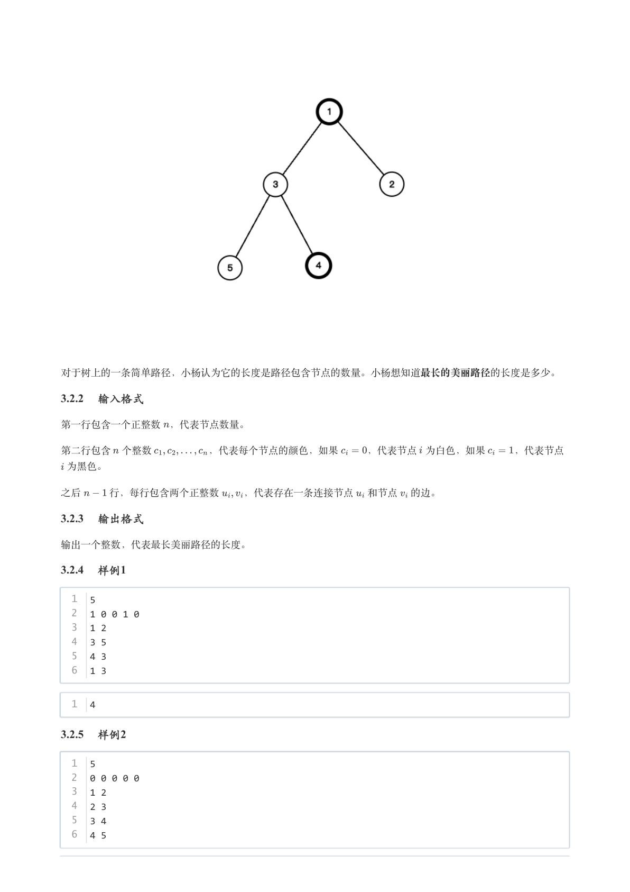

### 提取文本

```
对于树上的一条简单路径，小杨认为它的长度是路径包含节点的数量。小杨想知道最长的美丽路径的长度是多少。

3.2.2 输入格式

第一行包含一个正整数 ，代表节点数量。


第二行包含 个整数      ，代表每个节点的颜色，如果   ，代表节点 为白色，如果   ，代表节点

 为黑色。


之后   行，每行包含两个正整数  ，代表存在一条连接节点 和节点 的边。

3.2.3 输出格式

输出一个整数，代表最长美丽路径的长度。

3.2.4 样例1

  1  5
  2  1 0 0 1 0
  3  1 2
  4  3 5
  5  4 3
  6  1 3


  1  4

3.2.5 样例2

  1  5
  2  0 0 0 0 0
  3  1 2
  4  2 3
  5  3 4
  6  4 5
```

## 第 12 页

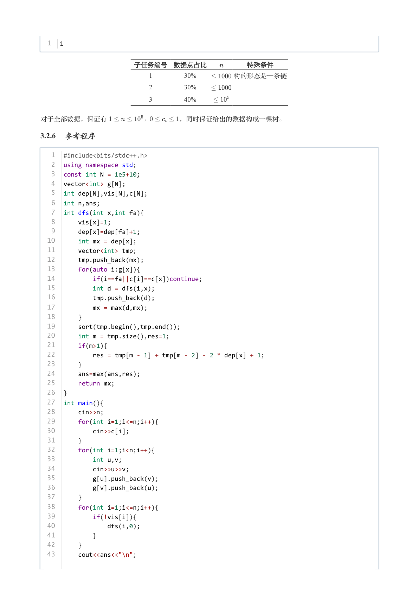

### 提取文本

```
1  1


              子任务编号 数据点占比      特殊条件

                                 1        30%      树的形态是一条链

                                 2        30%

                                 3        40%


对于全部数据，保证有      ，    ，同时保证给出的数据构成一棵树。

3.2.6 参考程序

   1  #include<bits/stdc++.h>
   2  using namespace std;
   3  const int N = 1e5+10;
   4  vector<int> g[N];
   5  int dep[N],vis[N],c[N];
   6  int n,ans;
   7  int dfs(int x,int fa){
   8      vis[x]=1;
   9      dep[x]=dep[fa]+1;
  10      int mx = dep[x];
  11      vector<int> tmp;
  12      tmp.push_back(mx);
  13      for(auto i:g[x]){
  14          if(i==fa||c[i]==c[x])continue;
  15          int d = dfs(i,x);
  16          tmp.push_back(d);
  17          mx = max(d,mx);
  18      }
  19      sort(tmp.begin(),tmp.end());
  20      int m = tmp.size(),res=1;
  21      if(m>1){
  22          res = tmp[m - 1] + tmp[m - 2] - 2 * dep[x] + 1;
  23      }
  24      ans=max(ans,res);
  25      return mx;
  26  }
  27  int main(){
  28      cin>>n;
  29      for(int i=1;i<=n;i++){
  30          cin>>c[i];
  31      }
  32      for(int i=1;i<n;i++){
  33          int u,v;
  34          cin>>u>>v;
  35          g[u].push_back(v);
  36          g[v].push_back(u);
  37      }
  38      for(int i=1;i<=n;i++){
  39          if(!vis[i]){
  40              dfs(i,0);
  41          }
  42      }
  43      cout<<ans<<"\n";
```

## 第 13 页


### 提取文本

```
44  }
```
