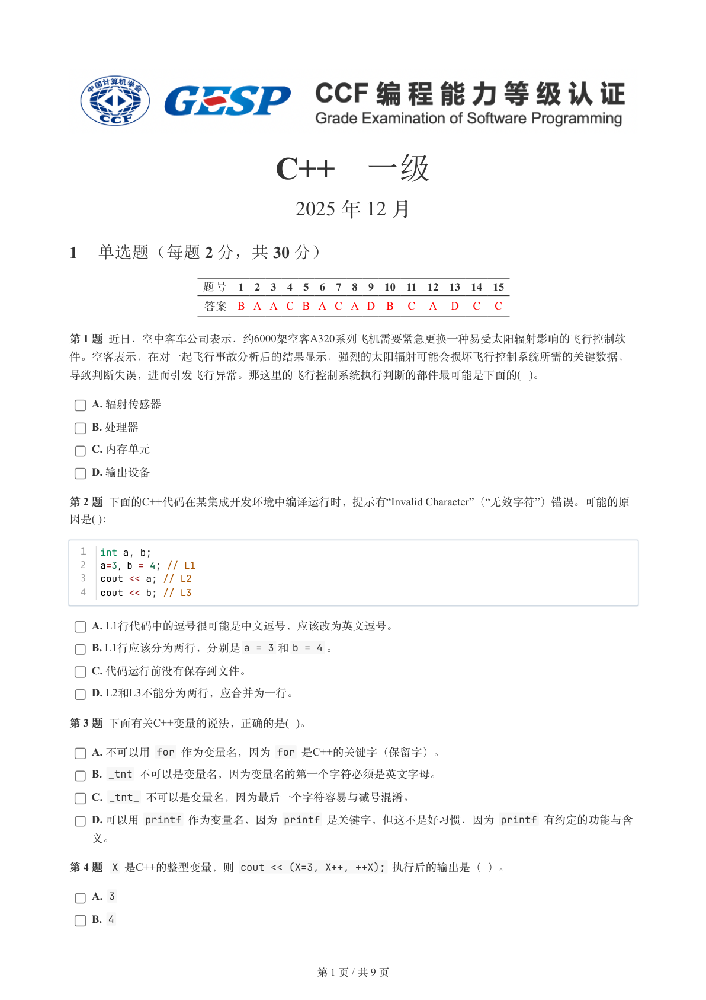
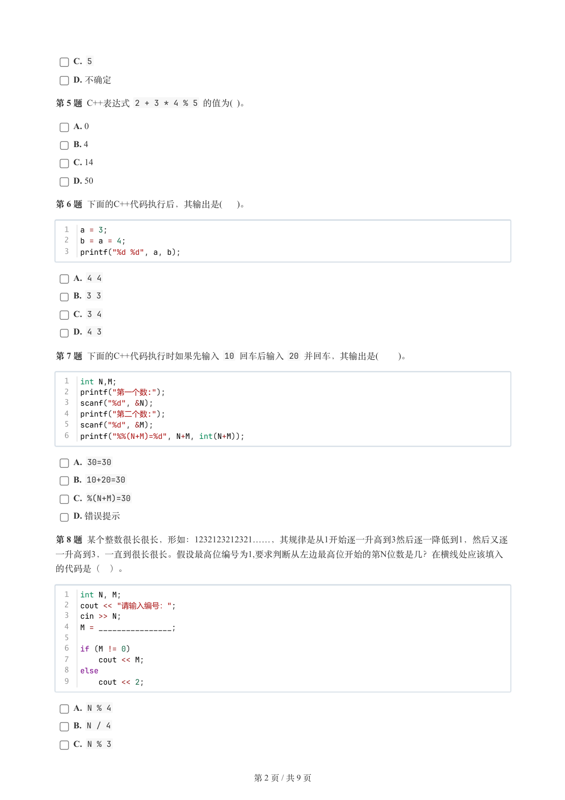
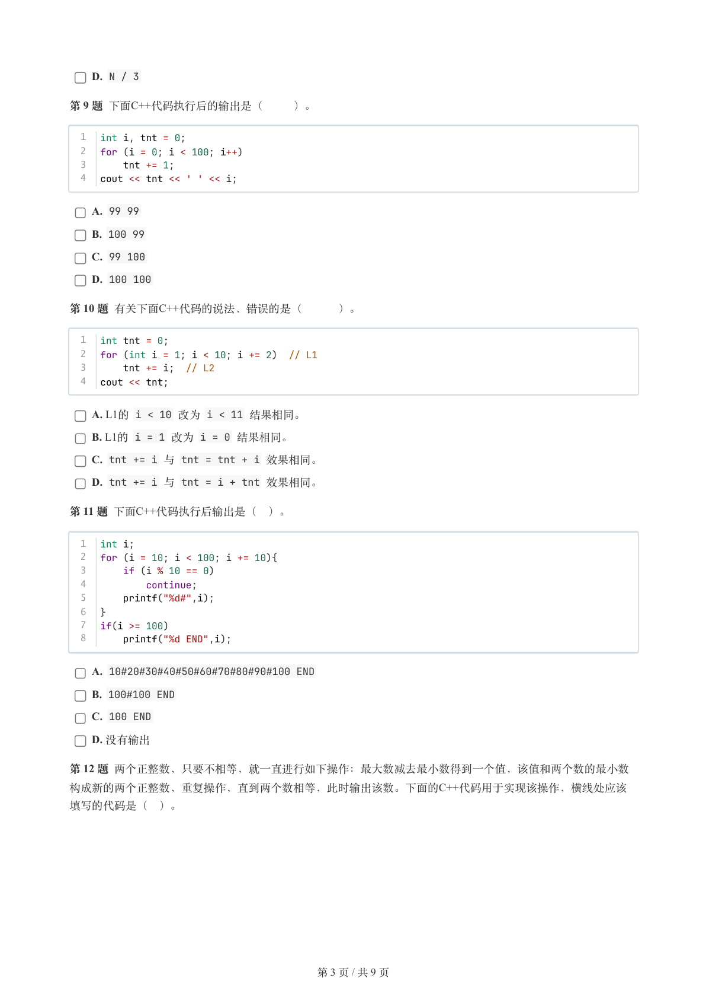
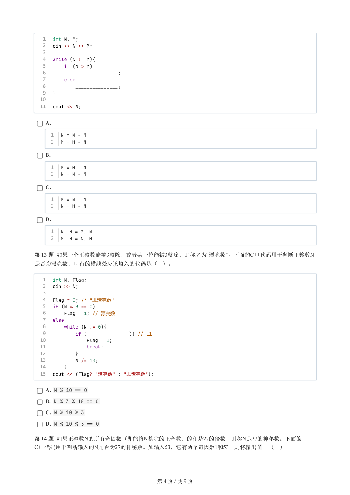
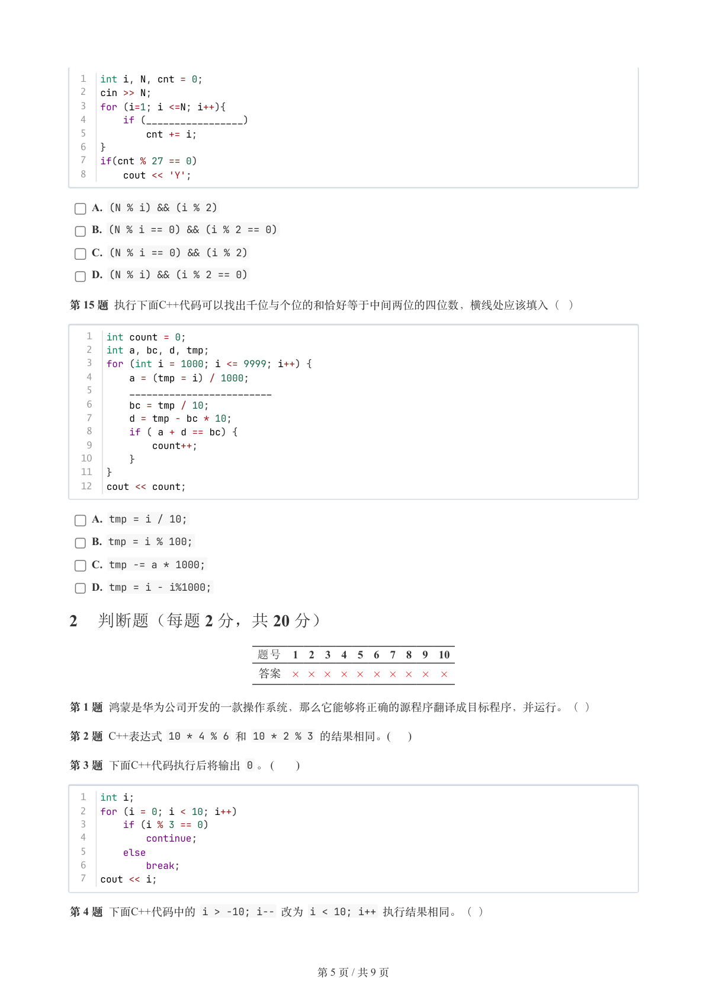
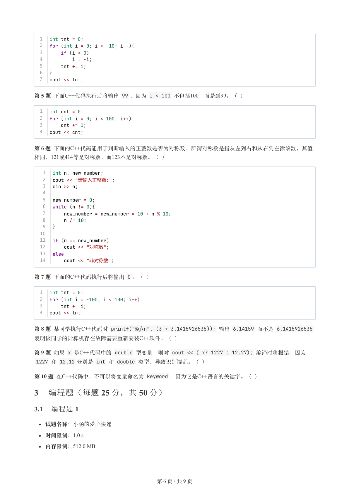
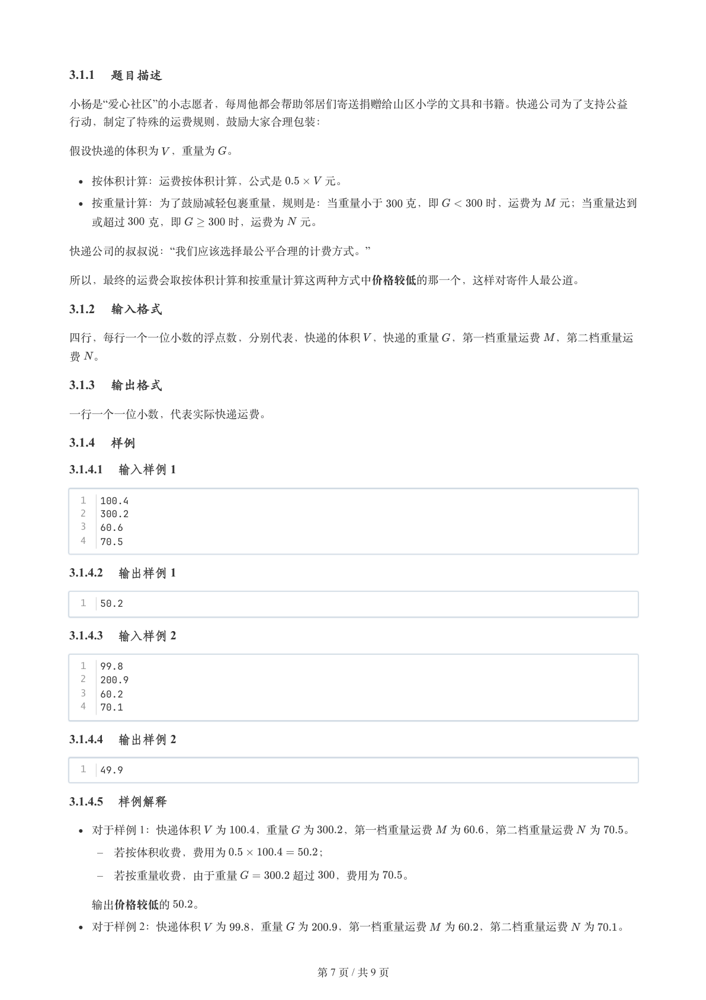
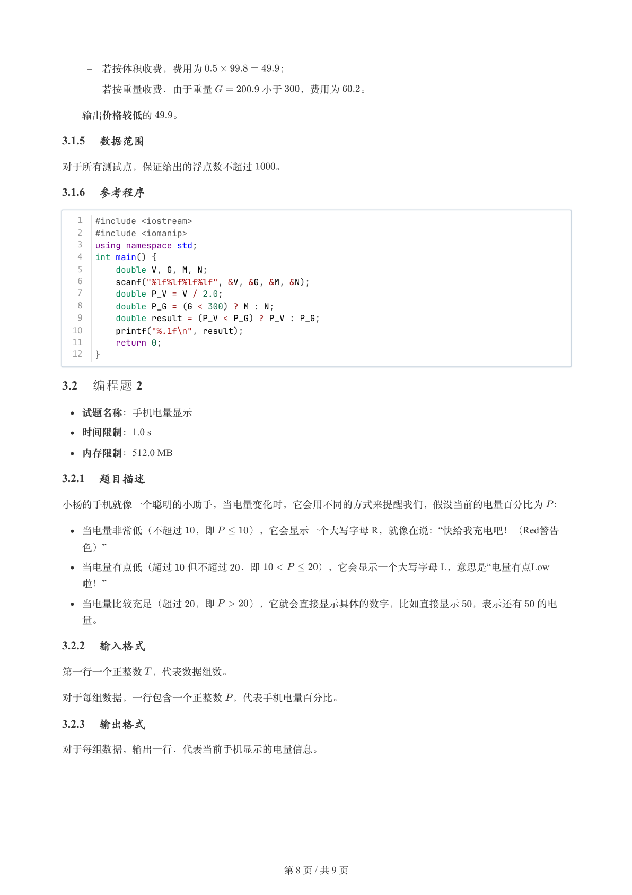
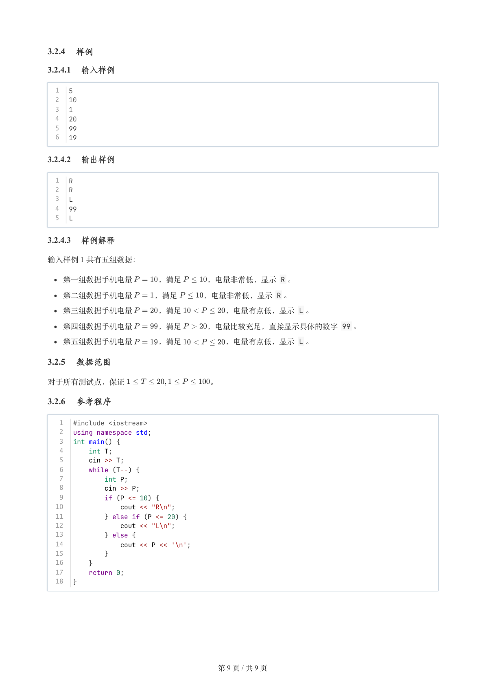

# 2025年12月-C++1级

- 原始 PDF：[`pdfs/2025年12月-C++1级.pdf`](../pdfs/2025年12月-C++1级.pdf)
- 页数：9
- 转换脚本：[`scripts/convert_pdfs_to_markdown.py`](../scripts/convert_pdfs_to_markdown.py)

> 为尽量避免信息丢失，每页均附带页面图片；文本提取结果保留原有顺序与换行特征，个别公式、图形、特殊排版请以页面图片为准。

## 第 1 页



### 提取文本

```
C++　一级

                      2025 年 12 月

1 单选题（每题 2 分，共 30 分）


           题号  1  2  3  4  5  6  7  8  9  10  11  12  13  14  15
            答案 B A A C B A C A D  B  C  A  D  C  C


第 1 题 近日，空中客车公司表示，约6000架空客A320系列飞机需要紧急更换一种易受太阳辐射影响的飞行控制软

件。空客表示，在对一起飞行事故分析后的结果显示，强烈的太阳辐射可能会损坏飞行控制系统所需的关键数据，

导致判断失误，进而引发飞行异常。那这里的飞行控制系统执行判断的部件最可能是下面的( )。

    A. 辐射传感器

    B. 处理器

    C. 内存单元

    D. 输出设备

第 2 题 下面的C++代码在某集成开发环境中编译运行时，提示有“Invalid Character”（“无效字符”）错误。可能的原
因是( )：


  1  int a, b;
  2  a=3，b = 4; // L1
  3  cout << a; // L2
  4  cout << b; // L3


    A. L1行代码中的逗号很可能是中文逗号，应该改为英文逗号。

    B. L1行应该分为两行，分别是a = 3 和b = 4 。

    C. 代码运行前没有保存到文件。

    D. L2和L3不能分为两行，应合并为一行。

第 3 题 下面有关C++变量的说法，正确的是( )。

    A. 不可以用 for 作为变量名，因为 for 是C++的关键字（保留字）。

    B. _tnt 不可以是变量名，因为变量名的第一个字符必须是英文字母。

    C. _tnt_ 不可以是变量名，因为最后一个字符容易与减号混淆。

    D. 可以用 printf 作为变量名，因为 printf 是关键字，但这不是好习惯，因为 printf 有约定的功能与含

  义。

第 4 题  X 是C++的整型变量，则 cout << (X=3, X++, ++X); 执行后的输出是（ ）。

    A. 3

    B. 4


                       第 1 页 / 共 9 页
```

## 第 2 页



### 提取文本

```
C. 5

    D. 不确定

第 5 题 C++表达式 2 + 3 * 4 % 5 的值为( )。

    A. 0

    B. 4

    C. 14

    D. 50

第 6 题 下面的C++代码执行后，其输出是(  )。


  1  a = 3;
  2  b = a = 4;
  3  printf("%d %d", a, b);

    A. 4 4

    B. 3 3

    C. 3 4

    D. 4 3

第 7 题 下面的C++代码执行时如果先输入 10 回车后输入 20 并回车，其输出是(   )。


  1  int N,M;
  2  printf("第一个数:");
  3  scanf("%d", &N);
  4  printf("第二个数:");
  5  scanf("%d", &M);
  6  printf("%%(N+M)=%d", N+M, int(N+M));

    A. 30=30

    B. 10+20=30

    C. %(N+M)=30

    D. 错误提示

第 8 题 某个整数很长很长，形如：1232123212321……，其规律是从1开始逐一升高到3然后逐一降低到1，然后又逐
一升高到3，一直到很长很长。假设最高位编号为1,要求判断从左边最高位开始的第N位数是几？在横线处应该填入

的代码是（ ）。


  1  int N, M;
  2  cout << "请输入编号：";
  3  cin >> N;
  4  M = ________________;
  5
  6  if (M != 0)
  7      cout << M;
  8  else
  9      cout << 2;

    A. N % 4

    B. N / 4

    C. N % 3


                       第 2 页 / 共 9 页
```

## 第 3 页



### 提取文本

```
D. N / 3

第 9 题 下面C++代码执行后的输出是（   ）。


  1  int i, tnt = 0;
  2  for (i = 0; i < 100; i++)
  3      tnt += 1;
  4  cout << tnt << ' ' << i;

    A. 99 99

    B. 100 99

    C. 99 100

    D. 100 100

第 10 题 有关下面C++代码的说法，错误的是（   ）。


  1  int tnt = 0;
  2  for (int i = 1; i < 10; i += 2)  // L1
  3      tnt += i;  // L2
  4  cout << tnt;

    A. L1的 i < 10 改为 i < 11 结果相同。

    B. L1的 i = 1 改为 i = 0 结果相同。

    C. tnt += i 与 tnt = tnt + i 效果相同。

    D. tnt += i 与 tnt = i + tnt 效果相同。

第 11 题 下面C++代码执行后输出是（ ）。


  1  int i;
  2  for (i = 10; i < 100; i += 10){
  3      if (i % 10 == 0)
  4          continue;
  5      printf("%d#",i);
  6  }
  7  if(i >= 100)
  8      printf("%d END",i);

    A. 10#20#30#40#50#60#70#80#90#100 END

    B. 100#100 END

    C. 100 END

    D. 没有输出

第 12 题 两个正整数，只要不相等，就一直进行如下操作：最大数减去最小数得到一个值，该值和两个数的最小数
构成新的两个正整数，重复操作，直到两个数相等，此时输出该数。下面的C++代码用于实现该操作，横线处应该

填写的代码是（ ）。


                       第 3 页 / 共 9 页
```

## 第 4 页



### 提取文本

```
1  int N, M;
   2  cin >> N >> M;
   3
   4  while (N != M){
   5      if (N > M)
   6          _______________;
   7      else
   8          _______________;
   9  }
  10
  11  cout << N;


    A.

      1  N = N - M
      2  M = M - N

    B.

      1  M = M - N
      2  N = N - M

    C.

      1  M = N - M
      2  N = M - N

    D.

      1  N, M = M, N
      2  M, N = N, M


第 13 题 如果一个正整数能被3整除，或者某一位能被3整除，则称之为“漂亮数”。下面的C++代码用于判断正整数N
是否为漂亮数，L1行的横线处应该填入的代码是（ ）。


   1  int N, Flag;
   2  cin >> N;
   3
   4  Flag = 0; // "非漂亮数"
   5  if (N % 3 == 0)
   6      Flag = 1; //"漂亮数"
   7  else
   8      while (N != 0){
   9          if (_______________){ // L1
  10              Flag = 1;
  11              break;
  12          }
  13          N /= 10;
  14      }
  15  cout << (Flag? "漂亮数" : "非漂亮数");

    A. N % 10 == 0

    B. N % 3 % 10 == 0

    C. N % 10 % 3

    D. N % 10 % 3 == 0

第 14 题 如果正整数N的所有奇因数（即能将N整除的正奇数）的和是27的倍数，则称N是27的神秘数。下面的
C++代码用于判断输入的N是否为27的神秘数。如输入53，它有两个奇因数1和53，则将输出Y 。（ ）。


                       第 4 页 / 共 9 页
```

## 第 5 页



### 提取文本

```
1  int i, N, cnt = 0;
  2  cin >> N;
  3  for (i=1; i <=N; i++){
  4      if (_________________)
  5          cnt += i;
  6  }
  7  if(cnt % 27 == 0)
  8      cout << 'Y';

    A. (N % i) && (i % 2)

    B. (N % i == 0) && (i % 2 == 0)

    C. (N % i == 0) && (i % 2)

    D. (N % i) && (i % 2 == 0)

第 15 题 执行下面C++代码可以找出千位与个位的和恰好等于中间两位的四位数，横线处应该填入（ ）


   1  int count = 0;
   2  int a, bc, d, tmp;
   3  for (int i = 1000; i <= 9999; i++) {
   4      a = (tmp = i) / 1000;
   5      _________________________
   6      bc = tmp / 10;
   7      d = tmp - bc * 10;
   8      if ( a + d == bc) {
   9          count++;
  10      }
  11  }
  12  cout << count;

    A. tmp = i / 10;

    B. tmp = i % 100;

    C. tmp -= a * 1000;

    D. tmp = i - i%1000;

2 判断题（每题 2 分，共 20 分）

                题号  1  2  3  4  5  6  7  8  9  10

                 答案


第 1 题 鸿蒙是华为公司开发的一款操作系统，那么它能够将正确的源程序翻译成目标程序，并运行。（ ）

第 2 题 C++表达式 10 * 4 % 6 和 10 * 2 % 3 的结果相同。(     )

第 3 题 下面C++代码执行后将输出 0 。 (      )


  1  int i;
  2  for (i = 0; i < 10; i++)
  3      if (i % 3 == 0)
  4          continue;
  5      else
  6          break;
  7  cout << i;

第 4 题 下面C++代码中的 i > -10; i-- 改为 i < 10; i++ 执行结果相同。（ ）


                       第 5 页 / 共 9 页
```

## 第 6 页



### 提取文本

```
1  int tnt = 0;
  2  for (int i = 0; i > -10; i--){
  3      if (i < 0)
  4          i = -i;
  5      tnt += i;
  6  }
  7  cout << tnt;

第 5 题 下面C++代码执行后将输出 99 ，因为 i < 100 不包括100，而是到99。（ ）


  1  int cnt = 0;
  2  for (int i = 0; i < 100; i++)
  3      cnt += 1;
  4  cout << cnt;


第 6 题 下面的C++代码能用于判断输入的正整数是否为对称数。所谓对称数是指从左到右和从右到左读该数，其值
相同，121或414等是对称数，而123不是对称数。（ ）


   1  int n, new_number;
   2  cout << "请输入正整数:";
   3  cin >> n;
   4
   5  new_number = 0;
   6  while (n != 0){
   7      new_number = new_number * 10 + n % 10;
   8      n /= 10;
   9  }
  10
  11  if (n == new_number)
  12      cout << "对称数";
  13  else
  14      cout << "非对称数";

第 7 题 下面的C++代码执行后将输出 0 。（ ）


  1  int tnt = 0;
  2  for (int i = -100; i < 100; i++)
  3      tnt += i;
  4  cout << tnt;

第 8 题 某同学执行C++代码时 printf("%g\n", (3 + 3.1415926535)); 输出 6.14159 而不是 6.1415926535
表明该同学的计算机存在故障需要重新安装C++软件。（ ）

第 9 题 如果 x 是C++代码中的 double 型变量，则对 cout << ( x? 1227 : 12.27); 编译时将报错，因为
 1227 和 12.12 分别是 int 和 double 类型，导致识别混乱。（ ）

第 10 题 在C++代码中，不可以将变量命名为 keyword ，因为它是C++语言的关键字。（ ）

3 编程题（每题 25 分，共 50 分）

3.1 编程题 1


  试题名称：小杨的爱心快递

   时间限制：1.0 s

   内存限制：512.0 MB


                       第 6 页 / 共 9 页
```

## 第 7 页



### 提取文本

```
3.1.1 题目描述

小杨是“爱心社区”的小志愿者，每周他都会帮助邻居们寄送捐赠给山区小学的文具和书籍。快递公司为了支持公益

行动，制定了特殊的运费规则，鼓励大家合理包装：


假设快递的体积为 ，重量为 。


  按体积计算：运费按体积计算，公式是    元。

  按重量计算：为了鼓励减轻包裹重量，规则是：当重量小于  克，即    时，运费为  元；当重量达到

  或超过  克，即    时，运费为 元。

快递公司的叔叔说：“我们应该选择最公平合理的计费方式。”


所以，最终的运费会取按体积计算和按重量计算这两种方式中价格较低的那一个，这样对寄件人最公道。

3.1.2 输入格式

四行，每行一个一位小数的浮点数，分别代表，快递的体积 ，快递的重量 ，第一档重量运费 ，第二档重量运

费 。

3.1.3 输出格式

一行一个一位小数，代表实际快递运费。

3.1.4 样例

3.1.4.1 输入样例 1

  1  100.4
  2  300.2
  3  60.6
  4  70.5

3.1.4.2 输出样例 1

  1  50.2

3.1.4.3 输入样例 2

  1  99.8
  2  200.9
  3  60.2
  4  70.1

3.1.4.4 输出样例 2

  1  49.9

3.1.4.5 样例解释

  对于样例 1：快递体积 为   ，重量 为   ，第一档重量运费  为  ，第二档重量运费 为  。

   –   若按体积收费，费用为        ；

   –   若按重量收费，由于重量     超过  ，费用为  。


  输出价格较低的  。

  对于样例 2：快递体积 为  ，重量 为   ，第一档重量运费  为  ，第二档重量运费 为  。


                       第 7 页 / 共 9 页
```

## 第 8 页



### 提取文本

```
–   若按体积收费，费用为        ；

   –   若按重量收费，由于重量     小于  ，费用为  。


  输出价格较低的  。

3.1.5 数据范围

对于所有测试点，保证给出的浮点数不超过  。

3.1.6 参考程序

   1  #include <iostream>
   2  #include <iomanip>
   3  using namespace std;
   4  int main() {
   5      double V, G, M, N;
   6      scanf("%lf%lf%lf%lf", &V, &G, &M, &N);
   7      double P_V = V / 2.0;
   8      double P_G = (G < 300) ? M : N;
   9      double result = (P_V < P_G) ? P_V : P_G;
  10      printf("%.1f\n", result);
  11      return 0;
  12  }

3.2 编程题 2


  试题名称：手机电量显示

   时间限制：1.0 s

   内存限制：512.0 MB

3.2.1 题目描述

小杨的手机就像一个聪明的小助手，当电量变化时，它会用不同的方式来提醒我们，假设当前的电量百分比为 ：

  当电量非常低（不超过 ，即   ），它会显示一个大写字母 R，就像在说：“快给我充电吧！（Red警告
  色）”

  当电量有点低（超过  但不超过 ，即      ），它会显示一个大写字母 L，意思是“电量有点Low
  啦！”

  当电量比较充足（超过 ，即   ），它就会直接显示具体的数字，比如直接显示 ，表示还有  的电

  量。

3.2.2 输入格式

第一行一个正整数 ，代表数据组数。


对于每组数据，一行包含一个正整数 ，代表手机电量百分比。

3.2.3 输出格式

对于每组数据，输出一行，代表当前手机显示的电量信息。


                       第 8 页 / 共 9 页
```

## 第 9 页



### 提取文本

```
3.2.4 样例

3.2.4.1 输入样例

  1  5
  2  10
  3  1
  4  20
  5  99
  6  19

3.2.4.2 输出样例

  1  R
  2  R
  3  L
  4  99
  5  L

3.2.4.3 样例解释

输入样例 1 共有五组数据：

  第一组数据手机电量   ，满足   ，电量非常低，显示 R 。

  第二组数据手机电量   ，满足   ，电量非常低，显示 R 。

  第三组数据手机电量   ，满足      ，电量有点低，显示 L 。

  第四组数据手机电量   ，满足   ，电量比较充足，直接显示具体的数字 99 。

  第五组数据手机电量   ，满足      ，电量有点低，显示 L 。

3.2.5 数据范围

对于所有测试点，保证           。

3.2.6 参考程序

   1  #include <iostream>
   2  using namespace std;
   3  int main() {
   4      int T;
   5      cin >> T;
   6      while (T--) {
   7          int P;
   8          cin >> P;
   9          if (P <= 10) {
  10              cout << "R\n";
  11          } else if (P <= 20) {
  12              cout << "L\n";
  13          } else {
  14              cout << P << '\n';
  15          }
  16      }
  17      return 0;
  18  }


                       第 9 页 / 共 9 页
```
