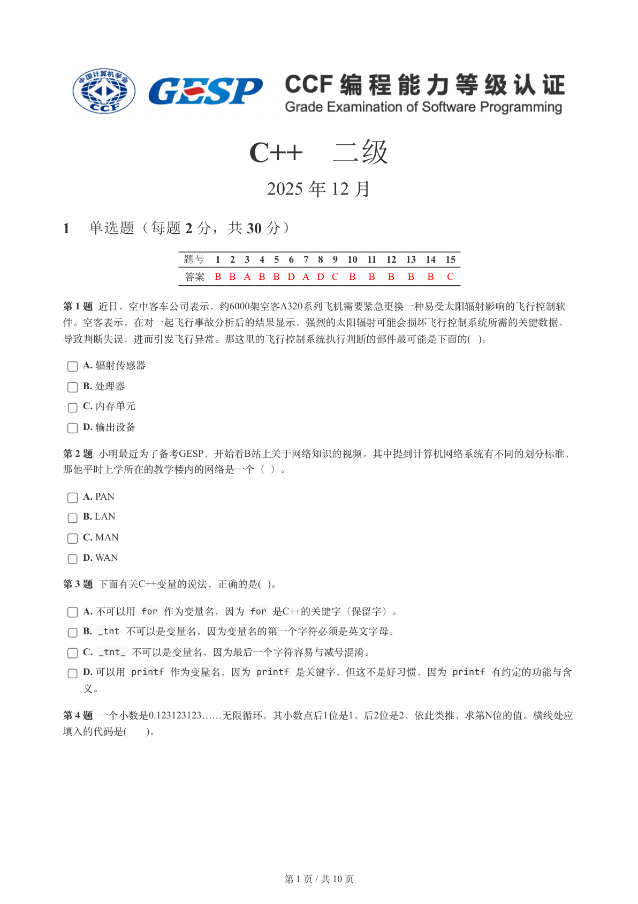
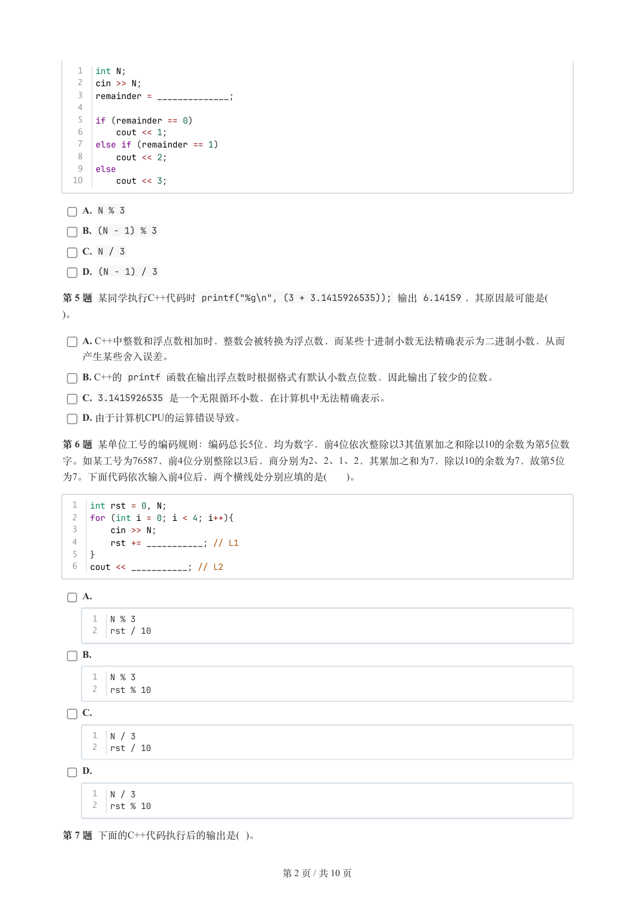
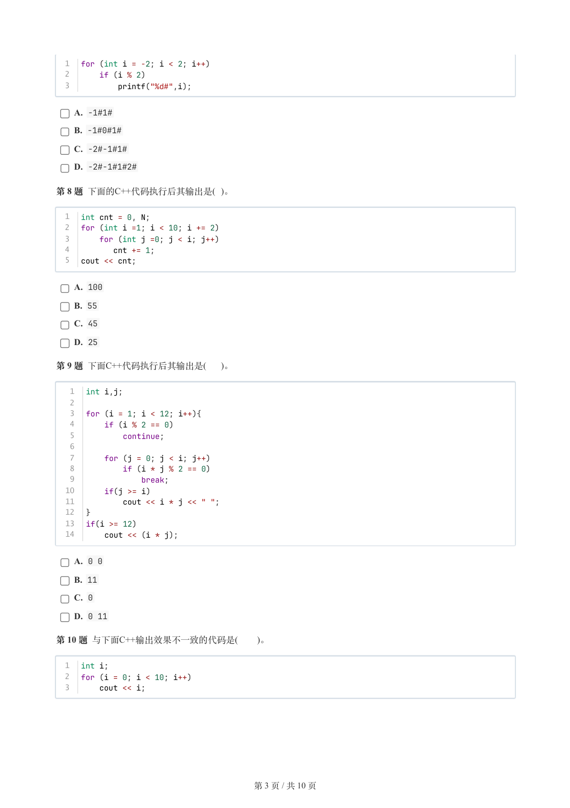
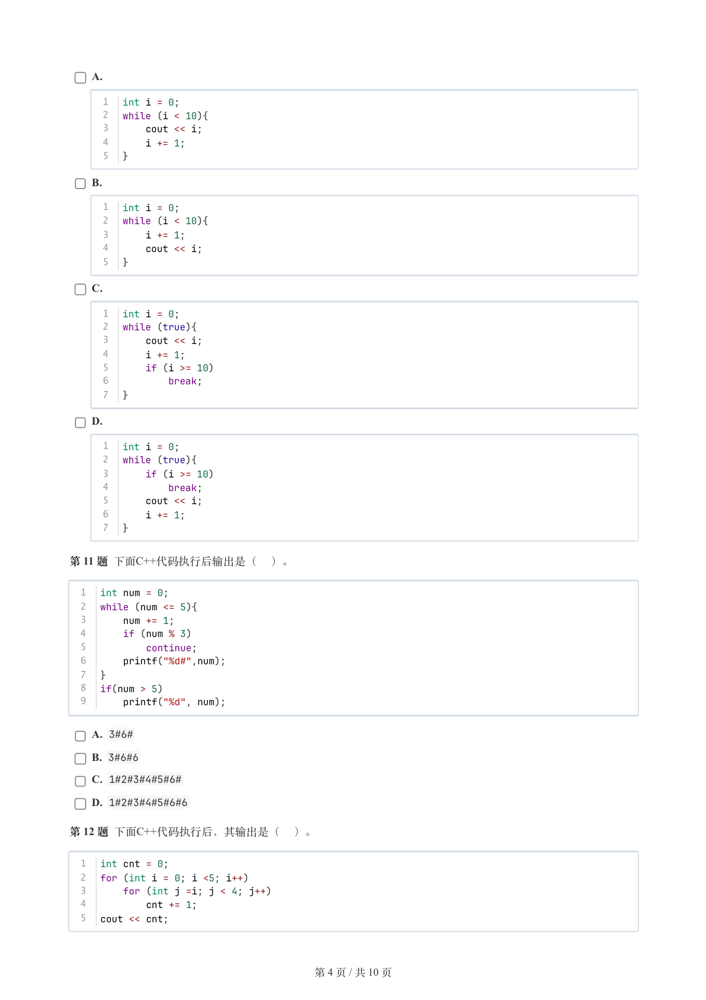
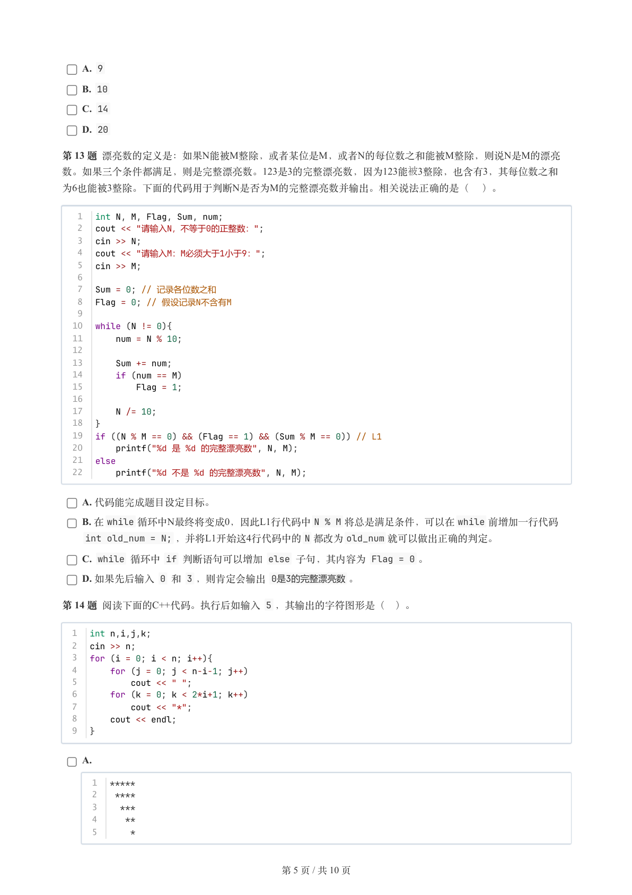
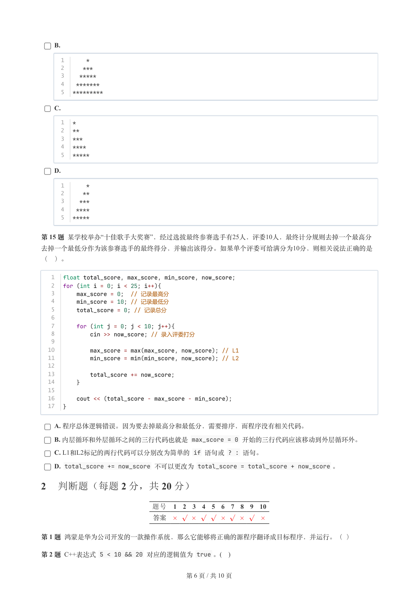
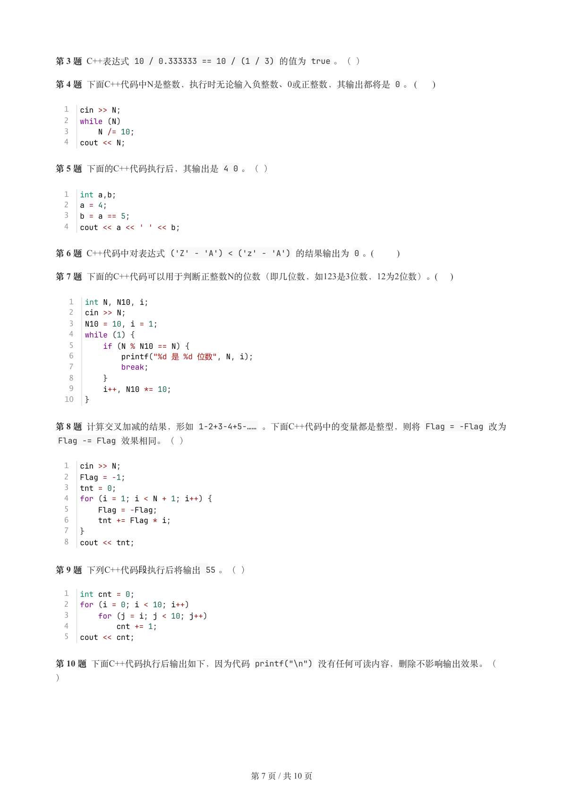
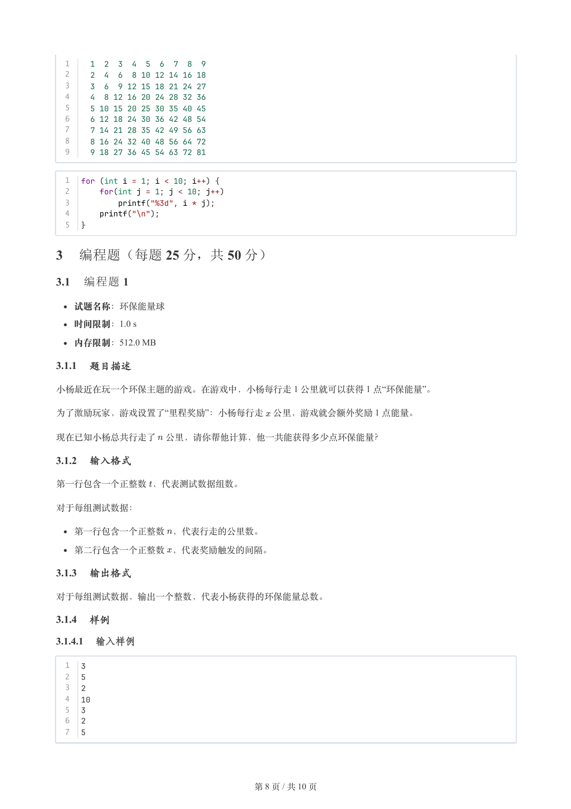
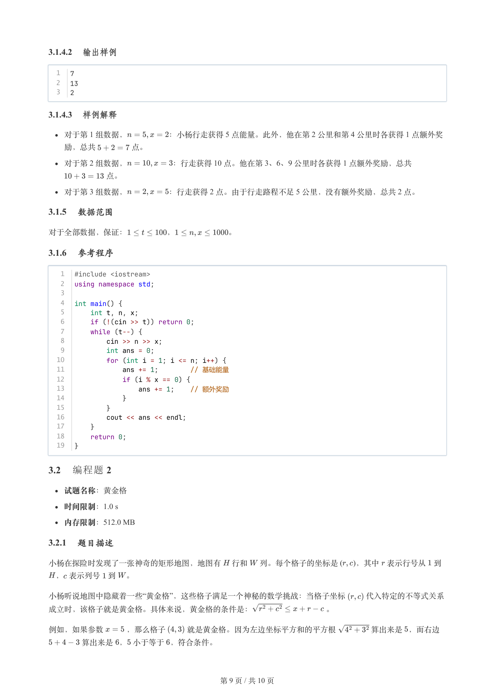
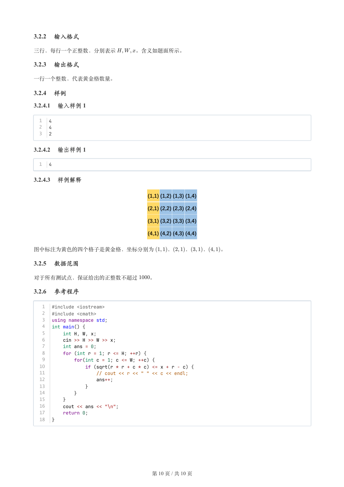

# 2025年12月-C++2级

- 原始 PDF：[`pdfs/2025年12月-C++2级.pdf`](../pdfs/2025年12月-C++2级.pdf)
- 页数：10
- 转换脚本：[`scripts/convert_pdfs_to_markdown.py`](../scripts/convert_pdfs_to_markdown.py)

> 为尽量避免信息丢失，每页均附带页面图片；文本提取结果保留原有顺序与换行特征，个别公式、图形、特殊排版请以页面图片为准。

## 第 1 页



### 提取文本

```
C++　二级

                      2025 年 12 月

1 单选题（每题 2 分，共 30 分）


           题号  1  2  3  4  5  6  7  8  9  10  11  12  13  14  15
            答案 B B A B B D A D C  B  B  B  B  B  C


第 1 题 近日，空中客车公司表示，约6000架空客A320系列飞机需要紧急更换一种易受太阳辐射影响的飞行控制软

件。空客表示，在对一起飞行事故分析后的结果显示，强烈的太阳辐射可能会损坏飞行控制系统所需的关键数据，

导致判断失误，进而引发飞行异常。那这里的飞行控制系统执行判断的部件最可能是下面的( )。

    A. 辐射传感器

    B. 处理器

    C. 内存单元

    D. 输出设备

第 2 题 小明最近为了备考GESP，开始看B站上关于网络知识的视频。其中提到计算机网络系统有不同的划分标准，

那他平时上学所在的教学楼内的网络是一个（ ）。

    A. PAN

    B. LAN

    C. MAN

    D. WAN

第 3 题 下面有关C++变量的说法，正确的是( )。

    A. 不可以用 for 作为变量名，因为 for 是C++的关键字（保留字）。

    B. _tnt 不可以是变量名，因为变量名的第一个字符必须是英文字母。

    C. _tnt_ 不可以是变量名，因为最后一个字符容易与减号混淆。

    D. 可以用 printf 作为变量名，因为 printf 是关键字，但这不是好习惯，因为 printf 有约定的功能与含

  义。

第 4 题 一个小数是0.123123123……无限循环，其小数点后1位是1，后2位是2，依此类推，求第N位的值。横线处应
填入的代码是(   )。


                       第 1 页 / 共 10 页
```

## 第 2 页



### 提取文本

```
1  int N;
   2  cin >> N;
   3  remainder = ______________;
   4
   5  if (remainder == 0)
   6      cout << 1;
   7  else if (remainder == 1)
   8      cout << 2;
   9  else
  10      cout << 3;

    A. N % 3

    B. (N - 1) % 3

    C. N / 3

    D. (N - 1) / 3

第 5 题 某同学执行C++代码时 printf("%g\n", (3 + 3.1415926535)); 输出 6.14159 ，其原因最可能是(
)。

    A. C++中整数和浮点数相加时，整数会被转换为浮点数，而某些十进制小数无法精确表示为二进制小数，从而

  产生某些舍入误差。

    B. C++的 printf 函数在输出浮点数时根据格式有默认小数点位数，因此输出了较少的位数。

    C. 3.1415926535 是一个无限循环小数，在计算机中无法精确表示。

    D. 由于计算机CPU的运算错误导致。

第 6 题 某单位工号的编码规则：编码总长5位，均为数字，前4位依次整除以3其值累加之和除以10的余数为第5位数
字。如某工号为76587，前4位分别整除以3后，商分别为2、2、1、2，其累加之和为7，除以10的余数为7，故第5位
为7。下面代码依次输入前4位后，两个横线处分别应填的是(   )。


  1  int rst = 0, N;
  2  for (int i = 0; i < 4; i++){
  3      cin >> N;
  4      rst += ___________; // L1
  5  }
  6  cout << ___________; // L2


    A.

      1  N % 3
      2  rst / 10

    B.

      1  N % 3
      2  rst % 10

    C.

      1  N / 3
      2  rst / 10

    D.

      1  N / 3
      2  rst % 10


第 7 题 下面的C++代码执行后的输出是( )。


                       第 2 页 / 共 10 页
```

## 第 3 页



### 提取文本

```
1  for (int i = -2; i < 2; i++)
  2      if (i % 2)
  3          printf("%d#",i);

    A. -1#1#

    B. -1#0#1#

    C. -2#-1#1#

    D. -2#-1#1#2#

第 8 题 下面的C++代码执行后其输出是( )。


  1  int cnt = 0, N;
  2  for (int i =1; i < 10; i += 2)
  3      for (int j =0; j < i; j++)
  4         cnt += 1;
  5  cout << cnt;

    A. 100

    B. 55

    C. 45

    D. 25

第 9 题 下面C++代码执行后其输出是(  )。


   1  int i,j;
   2
   3  for (i = 1; i < 12; i++){
   4      if (i % 2 == 0)
   5          continue;
   6
   7      for (j = 0; j < i; j++)
   8          if (i * j % 2 == 0)
   9              break;
  10      if(j >= i)
  11          cout << i * j << " ";
  12  }
  13  if(i >= 12)
  14      cout << (i * j);

    A. 0 0

    B. 11

    C. 0

    D. 0 11

第 10 题 与下面C++输出效果不一致的代码是(   )。


  1  int i;
  2  for (i = 0; i < 10; i++)
  3      cout << i;


                       第 3 页 / 共 10 页
```

## 第 4 页



### 提取文本

```
A.

      1  int i = 0;
      2  while (i < 10){
      3      cout << i;
      4      i += 1;
      5  }

    B.

      1  int i = 0;
      2  while (i < 10){
      3      i += 1;
      4      cout << i;
      5  }

    C.

      1  int i = 0;
      2  while (true){
      3      cout << i;
      4      i += 1;
      5      if (i >= 10)
      6          break;
      7  }

    D.

      1  int i = 0;
      2  while (true){
      3      if (i >= 10)
      4          break;
      5      cout << i;
      6      i += 1;
      7  }


第 11 题 下面C++代码执行后输出是（ ）。


  1  int num = 0;
  2  while (num <= 5){
  3      num += 1;
  4      if (num % 3)
  5          continue;
  6      printf("%d#",num);
  7  }
  8  if(num > 5)
  9      printf("%d", num);

    A. 3#6#

    B. 3#6#6

    C. 1#2#3#4#5#6#

    D. 1#2#3#4#5#6#6

第 12 题 下面C++代码执行后，其输出是（ ）。


  1  int cnt = 0;
  2  for (int i = 0; i <5; i++)
  3      for (int j =i; j < 4; j++)
  4          cnt += 1;
  5  cout << cnt;


                       第 4 页 / 共 10 页
```

## 第 5 页



### 提取文本

```
A. 9

    B. 10

    C. 14

    D. 20

第 13 题 漂亮数的定义是：如果N能被M整除，或者某位是M，或者N的每位数之和能被M整除，则说N是M的漂亮
数。如果三个条件都满⾜，则是完整漂亮数。123是3的完整漂亮数，因为123能被3整除，也含有3，其每位数之和
为6也能被3整除。下⾯的代码⽤于判断N是否为M的完整漂亮数并输出。相关说法正确的是（ ）。


   1  int N, M, Flag, Sum, num;
   2  cout << "请输入N，不等于0的正整数：";
   3  cin >> N;
   4  cout << "请输入M：M必须大于1小于9：";
   5  cin >> M;
   6
   7  Sum = 0; // 记录各位数之和
   8  Flag = 0; // 假设记录N不含有M
   9
  10  while (N != 0){
  11      num = N % 10;
  12
  13      Sum += num;
  14      if (num == M)
  15          Flag = 1;
  16
  17      N /= 10;
  18  }
  19  if ((N % M == 0) && (Flag == 1) && (Sum % M == 0)) // L1
  20      printf("%d 是 %d 的完整漂亮数", N, M);
  21  else
  22      printf("%d 不是 %d 的完整漂亮数", N, M);


    A. 代码能完成题目设定目标。

    B. 在while 循环中N最终将变成0，因此L1行代码中N % M 将总是满足条件，可以在while 前增加一行代码
    int old_num = N; ，并将L1开始这4行代码中的N 都改为old_num 就可以做出正确的判定。

    C. while 循环中 if 判断语句可以增加 else 子句，其内容为 Flag = 0 。

    D. 如果先后输入 0 和 3 ，则肯定会输出 0是3的完整漂亮数。

第 14 题 阅读下面的C++代码。执行后如输入 5 ，其输出的字符图形是（ ）。


  1  int n,i,j,k;
  2  cin >> n;
  3  for (i = 0; i < n; i++){
  4      for (j = 0; j < n-i-1; j++)
  5          cout << " ";
  6      for (k = 0; k < 2*i+1; k++)
  7          cout << "*";
  8      cout << endl;
  9  }


    A.

      1  *****
      2   ****
      3    ***
      4     **
      5      *


                       第 5 页 / 共 10 页
```

## 第 6 页



### 提取文本

```
B.

      1      *
      2     ***
      3    *****
      4   *******
      5  *********

    C.

      1  *
      2  **
      3  ***
      4  ****
      5  *****

    D.

      1      *
      2     **
      3    ***
      4   ****
      5  *****


第 15 题 某学校举办“十佳歌手大奖赛”，经过选拔最终参赛选手有25人，评委10人，最终计分规则去掉一个最高分
去掉一个最低分作为该参赛选手的最终得分，并输出该得分。如果单个评委可给满分为10分，则相关说法正确的是

（ ）。


   1  float total_score, max_score, min_score, now_score;
   2  for (int i = 0; i < 25; i++){
   3      max_score = 0;  // 记录最高分
   4      min_score = 10; // 记录最低分
   5      total_score = 0; // 记录总分
   6
   7      for (int j = 0; j < 10; j++){
   8          cin >> now_score; // 录入评委打分
   9
  10          max_score = max(max_score, now_score); // L1
  11          min_score = min(min_score, now_score); // L2
  12
  13          total_score += now_score;
  14      }
  15
  16      cout << (total_score - max_score - min_score);
  17  }


    A. 程序总体逻辑错误。因为要去掉最高分和最低分，需要排序，而程序没有相关代码。

    B. 内层循环和外层循环之间的三行代码也就是 max_score = 0 开始的三行代码应该移动到外层循环外。

    C. L1和L2标记的两行代码可以分别改为简单的 if 语句或 ? : 语句。

    D. total_score += now_score 不可以更改为 total_score = total_score + now_score 。

2 判断题（每题 2 分，共 20 分）


                题号  1  2  3  4  5  6  7  8  9  10

                 答案


第 1 题 鸿蒙是华为公司开发的一款操作系统，那么它能够将正确的源程序翻译成目标程序，并运行。（ ）

第 2 题 C++表达式 5 < 10 && 20 对应的逻辑值为 true 。(   )


                       第 6 页 / 共 10 页
```

## 第 7 页



### 提取文本

```
第 3 题 C++表达式 10 / 0.333333 == 10 / (1 / 3) 的值为 true 。（ ）

第 4 题 下面C++代码中N是整数，执行时无论输入负整数、0或正整数，其输出都将是 0 。 (     )


  1  cin >> N;
  2  while (N)
  3      N /= 10;
  4  cout << N;

第 5 题 下面的C++代码执行后，其输出是 4 0 。（ ）


  1  int a,b;
  2  a = 4;
  3  b = a == 5;
  4  cout << a << ' ' << b;

第 6 题 C++代码中对表达式 ('Z' - 'A') < ('z' - 'A') 的结果输出为 0 。(        )

第 7 题 下面的C++代码可以用于判断正整数N的位数（即几位数，如123是3位数，12为2位数）。(    )


   1  int N, N10, i;
   2  cin >> N;
   3  N10 = 10, i = 1;
   4  while (1) {
   5      if (N % N10 == N) {
   6          printf("%d 是 %d 位数", N, i);
   7          break;
   8      }
   9      i++, N10 *= 10;
  10  }


第 8 题 计算交叉加减的结果，形如 1-2+3-4+5-…… 。下面C++代码中的变量都是整型，则将 Flag = -Flag 改为
 Flag -= Flag 效果相同。（ ）


  1  cin >> N;
  2  Flag = -1;
  3  tnt = 0;
  4  for (i = 1; i < N + 1; i++) {
  5      Flag = -Flag;
  6      tnt += Flag * i;
  7  }
  8  cout << tnt;


第 9 题下列C++代码段执⾏后将输出55 。（）

  1  int cnt = 0;
  2  for (i = 0; i < 10; i++)
  3      for (j = i; j < 10; j++)
  4          cnt += 1;
  5  cout << cnt;


第 10 题 下面C++代码执行后输出如下，因为代码 printf("\n") 没有任何可读内容，删除不影响输出效果。（

）


                       第 7 页 / 共 10 页
```

## 第 8 页



### 提取文本

```
1    1  2  3  4  5  6  7  8  9
  2    2  4  6  8 10 12 14 16 18
  3    3  6  9 12 15 18 21 24 27
  4    4  8 12 16 20 24 28 32 36
  5    5 10 15 20 25 30 35 40 45
  6    6 12 18 24 30 36 42 48 54
  7    7 14 21 28 35 42 49 56 63
  8    8 16 24 32 40 48 56 64 72
  9    9 18 27 36 45 54 63 72 81


  1  for (int i = 1; i < 10; i++) {
  2      for(int j = 1; j < 10; j++)
  3          printf("%3d", i * j);
  4      printf("\n");
  5  }

3 编程题（每题 25 分，共 50 分）

3.1 编程题 1


  试题名称：环保能量球

   时间限制：1.0 s

   内存限制：512.0 MB

3.1.1 题目描述

小杨最近在玩一个环保主题的游戏。在游戏中，小杨每行走 1 公里就可以获得 1 点“环保能量”。

为了激励玩家，游戏设置了“里程奖励”：小杨每行走 公里，游戏就会额外奖励 1 点能量。


现在已知小杨总共行走了 公里，请你帮他计算，他一共能获得多少点环保能量？

3.1.2 输入格式

第一行包含一个正整数 ，代表测试数据组数。


对于每组测试数据：


  第一行包含一个正整数 ，代表行走的公里数。

  第二行包含一个正整数 ，代表奖励触发的间隔。

3.1.3 输出格式

对于每组测试数据，输出一个整数，代表小杨获得的环保能量总数。

3.1.4 样例

3.1.4.1 输入样例

  1  3
  2  5
  3  2
  4  10
  5  3
  6  2
  7  5


                       第 8 页 / 共 10 页
```

## 第 9 页



### 提取文本

```
3.1.4.2 输出样例

  1  7
  2  13
  3  2

3.1.4.3 样例解释

  对于第 1 组数据，     ：小杨行走获得 5 点能量。此外，他在第 2 公里和第 4 公里时各获得 1 点额外奖

  励，总共     点。

  对于第 2 组数据，      ：行走获得 10 点。他在第 3、6、9 公里时各获得 1 点额外奖励，总共

       点。

  对于第 3 组数据，     ：行走获得 2 点。由于行走路程不足 5 公里，没有额外奖励，总共 2 点。

3.1.5 数据范围

对于全部数据，保证：     ，       。

3.1.6 参考程序

   1  #include <iostream>
   2  using namespace std;
   3
   4  int main() {
   5      int t, n, x;
   6      if (!(cin >> t)) return 0;
   7      while (t--) {
   8          cin >> n >> x;
   9          int ans = 0;
  10          for (int i = 1; i <= n; i++) {
  11              ans += 1;        // 基础能量
  12              if (i % x == 0) {
  13                  ans += 1;    // 额外奖励
  14              }
  15          }
  16          cout << ans << endl;
  17      }
  18      return 0;
  19  }

3.2 编程题 2

  试题名称：黄金格

   时间限制：1.0 s

   内存限制：512.0 MB

3.2.1 题目描述

小杨在探险时发现了一张神奇的矩形地图，地图有 行和  列。每个格子的坐标是 (  )，其中 表示行号从 到

 ， 表示列号 到 。

小杨听说地图中隐藏着一些“黄金格”，这些格子满足一个神秘的数学挑战：当格子坐标   代入特定的不等式关系

成立时，该格子就是黄金格。具体来说，黄金格的条件是：         。


例如，如果参数   ，那么格子   就是黄金格。因为左边坐标平方和的平方根    算出来是 ，而右边

    算出来是 ， 小于等于 ，符合条件。


                       第 9 页 / 共 10 页
```

## 第 10 页



### 提取文本

```
3.2.2 输入格式

三行，每行一个正整数，分别表示    。含义如题面所示。

3.2.3 输出格式

一行一个整数，代表黄金格数量。

3.2.4 样例

3.2.4.1 输入样例 1

  1  4
  2  4
  3  2

3.2.4.2 输出样例 1

  1  4

3.2.4.3 样例解释


图中标注为黄色的四个格子是黄金格，坐标分别为  ，  ，  ，  。

3.2.5 数据范围

对于所有测试点，保证给出的正整数不超过  。

3.2.6 参考程序

   1  #include <iostream>
   2  #include <cmath>
   3  using namespace std;
   4  int main() {
   5      int H, W, x;
   6      cin >> H >> W >> x;
   7      int ans = 0;
   8      for (int r = 1; r <= H; ++r) {
   9          for(int c = 1; c <= W; ++c) {
  10              if (sqrt(r * r + c * c) <= x + r - c) {
  11                  // cout << r << " " << c << endl;
  12                  ans++;
  13              }
  14          }
  15      }
  16      cout << ans << "\n";
  17      return 0;
  18  }


                       第 10 页 / 共 10 页
```
